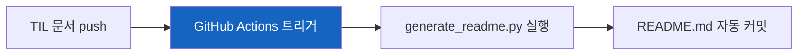

# CLAUDE.md

이 저장소에서 Claude Code가 작업할 때 따라야 할 가이드라인입니다.

---

## 1. 절대 규칙

**사용자가 명시적으로 요청하지 않는 한 다음 행동을 하지 마라:**

| 금지 행동 | 이유 |
|-----------|------|
| `python scripts/generate_readme.py` 실행 | README.md는 GitHub Actions가 자동 생성 |
| `git add`, `git commit`, `git push` 실행 | 사용자가 직접 커밋 시점을 결정 |
| `README.md` 수정 | 자동 생성 파일이므로 수동 편집 금지 |

---

## 2. 저장소 개요

**TIL (Today I Learned)** 저장소. 주로 Python, Java, Spring, 보안 관련 기술 문서를 담고 있다.

**핵심 특징:**
- 모든 설명은 **한국어**, 코드/기술 용어는 **영어**
- 주요 독자는 **Java 개발자** → Python 개념 설명 시 Java 비교 포함
- README.md는 GitHub Actions가 자동 생성

```
TIL/
├── python/          # Python 학습 노트
├── java/            # Java 학습 노트
├── spring/          # Spring Framework 학습 노트
├── security/        # 보안 관련 학습 노트
├── ai/              # AI/ML 관련 학습 노트
├── scripts/         # 자동화 스크립트
└── .github/workflows/
```

---

## 3. 문서 작성 철학

### 3.1 "왜(Why)"를 항상 설명하라

기술 문서가 "무엇(What)"과 "어떻게(How)"만 설명하면 금방 잊혀진다.
**"왜 이 기술이 필요한가?", "왜 이렇게 설계되었는가?"**를 설명해야 독자가 진정으로 이해한다.

```markdown
❌ Bad: "DI는 의존성을 외부에서 주입하는 패턴입니다"

✅ Good: "만약 프레임워크 없이 웹 서버를 만든다면?
         우리가 직접 해야 할 일들이 산더미처럼 쌓인다..."
```

### 3.2 스토리텔링으로 풀어가라

| 원칙 | 설명 |
|------|------|
| **문제 상황부터 시작** | 해결책을 먼저 제시하지 말고, 문제를 먼저 공감하게 하라 |
| **자연스러운 흐름** | "그렇다면", "이제", "하지만", "왜일까?" 같은 연결어 사용 |
| **비유와 예시** | 추상적 개념을 구체적으로 (할리우드 원칙, 닭과 달걀) |
| **"왜일까?" 질문** | 개념 설명 후 독자 스스로 생각하게 유도 |

**문체:**
- 서술형: "~해보자", "~가 있다", "~이다"
- 대화체 질문: "왜일까?", "어떻게 될까?"
- 문단 단위로 풀어서 설명 (한 줄씩 끊지 않음)

**Good Example:**
```markdown
Spring이 처음 나온 2004년부터 지금까지, 수많은 것들이 바뀌었다.
XML 설정이 어노테이션으로 바뀌었고, 동기 처리가 리액티브로 확장되었다.

하지만 IoC와 DI는 그대로다. 왜일까?

이것들은 "좋은 객체지향 설계"의 원칙을 코드로 구현한 것이기 때문이다.
기술은 바뀌어도 좋은 설계의 정의는 바뀌지 않는다.
```

---

## 4. 문서 구조

### 4.1 필수 구조

```markdown
# 제목 (예: Python의 XXX, Spring의 XXX)

한 줄 설명

## 결론부터 말하면

[핵심 요약 2-3문장]
[Before/After 코드 비교]

## 1. 첫 번째 주제
### 세부 내용

## 2. 두 번째 주제
### 세부 내용

---

## 출처

- [출처 제목](URL)
```

### 4.2 "결론부터 말하면" 섹션 (MANDATORY)

**이 섹션이 가장 중요하다.** 독자가 1분 안에 핵심을 파악할 수 있어야 한다.

```markdown
## 결론부터 말하면

**IoC는 "제어권을 넘긴다"는 철학**이고,
**DI는 그 철학을 구현하는 구체적인 방법**입니다.

// Before: 개발자가 직접 모든 것을 제어
public class OrderService {
    public OrderService() {
        this.paymentGateway = new StripePaymentGateway();  // 강한 결합
    }
}

// After: Spring이 제어, 개발자는 선언만
@Service
public class OrderService {
    public OrderService(PaymentGateway paymentGateway) {  // 느슨한 결합
        this.paymentGateway = paymentGateway;
    }
}
```

### 4.3 파일명 규칙

**파일명은 반드시 첫 번째 제목과 동일하게 작성**

| 제목 | 파일명 |
|------|--------|
| `# Python의 f-string` | `Python의-f-string.md` |
| `# Spring의 DI와 IoC` | `Spring의-DI와-IoC.md` |
| `# MITM 중간자 공격` | `MITM-중간자-공격.md` |

- 특수문자 제거, 공백을 하이픈(-)으로 변환
- 첫 줄은 반드시 `# `로 시작

---

## 5. 시각화 가이드

### 5.1 mermaid를 우선 사용하라

**ASCII 박스(`┌──┐`, `───▶`)보다 mermaid 다이어그램을 먼저 고려하라.**

| 상황 | 다이어그램 타입 |
|------|-----------------|
| 워크플로우, 프로세스 | `graph` / `flowchart` |
| 시간 순서 상호작용 | `sequenceDiagram` |
| 클래스 구조, 아키텍처 | `classDiagram` |
| DB 스키마, 엔티티 관계 | `erDiagram` |
| 역사/타임라인 | `timeline` |

**시각화가 유용한 경우:**
- Before/After 비교
- 단계별 프로세스 (1→2→3→4)
- 시스템 아키텍처
- 상태 전이

### 5.2 mermaid 스타일 규칙

**글씨가 반드시 보여야 한다.**

```markdown
❌ Bad: style Node fill:#e1f5ff          (밝은 배경에 자동 흰색 글씨 → 안 보임)
❌ Bad: style Node fill:#333,color:#666  (어두운 배경에 어두운 글씨 → 안 보임)

✅ Good: style Node stroke:#2196F3,stroke-width:3px  (테두리만 강조)
✅ Good: style Node fill:#1565C0,color:#fff          (어두운 배경 + 흰 글씨)
✅ Good: style Node fill:#E3F2FD,color:#000          (밝은 배경 + 검은 글씨)
```

---

## 6. 스타일 가이드

### 6.1 언어

- **설명**: 한국어
- **코드/기술 용어**: 영어 (DI, IoC, Bean, Scope 등)

### 6.2 비교 표현

**테이블:**
```markdown
| 특징 | Python | Java |
|------|--------|------|
| 타입 | 동적 | 정적 |
```

**코드 비교:**
```markdown
# Python
def example():
    pass

# Java
public void example() { }
```

**Do's and Don'ts:**
```markdown
✅ 이렇게 하라
❌ 이렇게 하지 마라
```

### 6.3 출처 표기

문서 맨 마지막에 `## 출처` 섹션 추가. 공식 문서를 가장 위에 배치.

```markdown
## 출처

- [Spring Framework Documentation](https://docs.spring.io/...) - 공식 문서
- [블로그 제목](https://blog.example.com/article)
```

---

## 7. 카테고리별 특성

### Python
Java 개발자가 Python으로 전환하는 관점에서 작성:
- Type hints, typing 모듈
- OOP 개념 (@dataclass, @abstractmethod, self)
- Python 특화 기능 (f-string, *args/**kwargs, with)

### Java
- 버전별 새 기능 (Java 21, 25 등)
- 모던 Java 패턴

### Spring
- Spring Framework 핵심 개념 (IoC, DI, AOP)
- Spring Boot 설정과 패턴
- 실무 활용 예제

### Security
- 보안 개념 (MITM, PII 등)
- 실무 보안 구현

---

## 8. 자동화

### README 자동 생성



- **트리거**: `main` 브랜치에 `*.md` 파일 변경 시
- **동작**: 모든 TIL 문서 스캔 → 카테고리별 인덱스 생성
- **주의**: push 후 30-60초 대기, 다음 작업 전 `git pull` 필수

### 새 카테고리 추가

폴더만 만들면 자동으로 카테고리가 생성된다:

```bash
mkdir -p new-category
# 문서 작성 후 push하면 README에 자동 반영
```

---

## 9. 요약: 좋은 TIL 문서 체크리스트

- [ ] "결론부터 말하면" 섹션이 있는가?
- [ ] "왜"를 설명했는가?
- [ ] 스토리텔링으로 풀어갔는가?
- [ ] Before/After 비교가 있는가?
- [ ] 복잡한 개념은 mermaid로 시각화했는가?
- [ ] 출처를 명시했는가?
- [ ] 파일명이 제목과 일치하는가?
