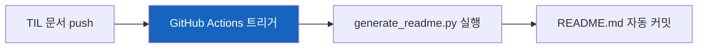

# CLAUDE.md

이 저장소에서 Claude Code가 작업할 때 따라야 할 가이드라인입니다.

---

## 1. 절대 규칙

**사용자가 명시적으로 요청하지 않는 한 다음 행동을 하지 마라:**

| 금지 행동 | 이유 |
|-----------|------|
| `python scripts/generate_readme.py` 실행 | README.md는 GitHub Actions가 자동 생성 |
| `git add`, `git commit`, `git push` 실행 | 사용자가 직접 커밋 시점을 결정 |
| `README.md` 수정 | 자동 생성 파일이므로 수동 편집 금지 |

---

## 2. 저장소 개요

**TIL (Today I Learned)** 저장소. 주로 Python, Java, Spring, 보안 관련 기술 문서를 담고 있다.

**핵심 특징:**
- 모든 설명은 **한국어**, 코드/기술 용어는 **영어**
- 주요 독자는 **Java 개발자** -> Python 개념 설명 시 Java 비교 포함
- README.md는 GitHub Actions가 자동 생성

```
TIL/
├── python/          # Python 학습 노트
├── java/            # Java 학습 노트
├── spring/          # Spring Framework 학습 노트
├── security/        # 보안 관련 학습 노트
├── ai/              # AI/ML 관련 학습 노트
├── computer-science/ # CS 기초 개념
├── nodejs/          # Node.js 학습 노트
├── scripts/         # 자동화 스크립트
└── .github/workflows/
```

---

## 3. 문서 작성 규칙

**TIL 문서 작성 시 `/til` 스킬의 규칙을 따르라.** 작성 철학, 스타일 가이드, 시각화 규칙은 스킬에 정의되어 있다.

핵심 원칙:
- **"왜(Why)"를 반드시 설명** -- 기술 나열이 아닌 스토리텔링
- **"결론부터 말하면"** 섹션 필수
- **mermaid 사용** -- ASCII 박스 금지
- **파일명 = 제목** -- 공백은 하이픈으로

---

## 4. 자동화

### README 자동 생성


```mermaid
graph LR
    A[TIL 문서 push] --> B[GitHub Actions 트리거]
    B --> C[generate_readme.py 실행]
    C --> D[README.md 자동 커밋]

    style B fill:#1565C0,color:#fff
```

- **트리거**: `main` 브랜치에 `*.md` 파일 변경 시
- **동작**: 모든 TIL 문서 스캔 -> 카테고리별 인덱스 생성
- **주의**: push 후 30-60초 대기, 다음 작업 전 `git pull` 필수

### 새 카테고리 추가

폴더만 만들면 자동으로 카테고리가 생성된다:

```bash
mkdir -p new-category
# 문서 작성 후 push하면 README에 자동 반영
```
