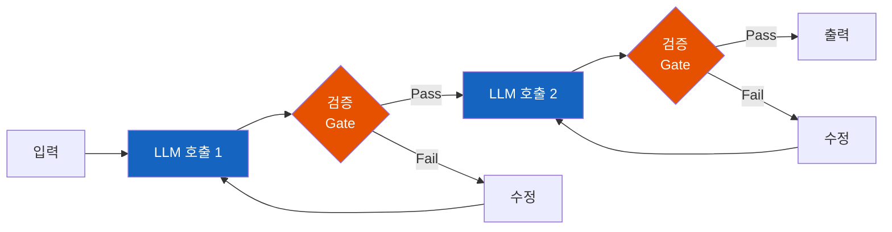
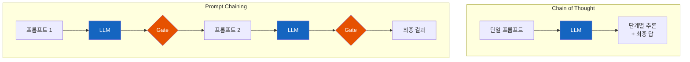
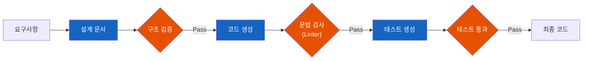

# AI Agent 워크플로 패턴 - 프롬프트 체이닝

복잡한 작업을 한 번에 시키면 LLM은 실수한다. 작게 나누면 정확해진다. 프롬프트 체이닝은 이 단순한 원리를 워크플로로 만든 것이다.

> **시리즈 안내**: 이 문서는 AI Agent 워크플로 패턴 시리즈의 일부입니다.
> 1. **프롬프트 체이닝** (현재 문서)
> 2. 라우팅
> 3. 병렬 처리
> 4. 오케스트레이터-워커
> 5. 평가-최적화

## 결론부터 말하면

**프롬프트 체이닝은 복잡한 작업을 여러 LLM 호출로 분해하여 순차 실행하는 패턴이다.** 각 단계의 출력이 다음 단계의 입력이 되고, 단계 사이에 검증 로직(Gate)을 넣을 수 있다.



| 비교 항목 | Chain of Thought (CoT) | Prompt Chaining |
|----------|------------------------|-----------------|
| **호출 횟수** | 단일 프롬프트 | 여러 프롬프트 |
| **검증 시점** | 최종 결과만 검증 | 각 단계마다 검증 가능 |
| **비용** | 낮음 | 중간~높음 |
| **적합한 상황** | 추론/논리 문제 | 다단계 작업 |

## 1. 왜 프롬프트 체이닝이 필요한가?

### 1.1 하나의 거대한 프롬프트의 문제

LLM에게 복잡한 작업을 한 번에 시키면 어떻게 될까?

```
프롬프트: "이 마케팅 카피를 작성하고, 한국어로 번역하고,
SEO 최적화하고, 소셜 미디어용 짧은 버전도 만들어줘"
```

결과는 예측하기 어렵다. LLM이 어떤 부분을 먼저 처리할지, 각 단계가 제대로 수행되었는지 알 수 없다. 중간에 실수가 있어도 최종 결과만 보고는 어디서 잘못되었는지 찾기 어렵다.

### 1.2 분해하면 정확해진다

같은 작업을 4단계로 나누면?

```
1단계: 마케팅 카피 작성 → [검증: 길이/톤 확인]
2단계: 한국어 번역 → [검증: 번역 품질 확인]
3단계: SEO 최적화 → [검증: 키워드 포함 여부]
4단계: 짧은 버전 생성 → [검증: 글자수 제한]
```

각 단계가 집중된 작업만 수행하므로 정확도가 높아진다. 중간에 문제가 생기면 해당 단계만 다시 실행할 수 있다. Anthropic은 이를 **"지연 시간을 교환하여 정확도를 높이는 전략"** 이라고 설명한다.

## 2. Chain of Thought와 무엇이 다른가?

혼동하기 쉬운 두 개념을 정리해보자.

### 2.1 Chain of Thought (CoT)

CoT는 **단일 프롬프트 내에서** LLM이 단계별로 사고하도록 유도하는 기법이다.

```
프롬프트: "단계별로 생각하며 다음 문제를 풀어라:
철수가 사과 3개를 가지고 있고, 영희에게 1개를 주면..."
```

```
LLM 응답:
1. 철수는 처음에 3개의 사과를 가지고 있다
2. 영희에게 1개를 준다
3. 따라서 3 - 1 = 2
답: 2개
```

모든 것이 **하나의 LLM 호출** 안에서 일어난다. 중간 단계를 우리가 검증하거나 수정할 수 없다.

### 2.2 Prompt Chaining

프롬프트 체이닝은 **여러 LLM 호출을 순차적으로 연결** 한다.

```python
# [개념 설명용 의사코드]

# 1단계: 개요 생성
outline = llm.call("이 주제에 대한 블로그 글 개요를 작성해줘: {topic}")

# 검증 Gate (실제 구현에서는 문자열 파싱 또는 JSON 모드 사용)
if len(outline.sections) < 3:
    raise ValidationError("개요가 너무 짧습니다")

# 2단계: 본문 작성 (이전 출력 사용)
content = llm.call(f"다음 개요를 바탕으로 본문을 작성해줘: {outline}")

# 검증 Gate
if len(content) < 500:
    raise ValidationError("본문이 너무 짧습니다")

# 3단계: 편집
final = llm.call(f"다음 글을 교정하고 다듬어줘: {content}")
```

각 단계 사이에 **프로그래밍 방식의 검증(Gate)** 을 넣을 수 있다. 실패하면 해당 단계만 재시도하면 된다.

> **참고**: 위 코드는 개념 설명용 의사코드다. 실제 LLM은 문자열을 반환하므로 `outline.sections`처럼 객체로 접근하려면 JSON 모드(Structured Output)를 사용하거나, 문자열에서 패턴을 파싱해야 한다. 실제 구현은 3절에서 다룬다.

### 2.3 핵심 차이점



| 측면 | Chain of Thought | Prompt Chaining |
|------|------------------|-----------------|
| **제어권** | LLM에게 맡김 | 개발자가 가짐 |
| **중간 검증** | 불가능 | 가능 |
| **오류 복구** | 전체 재시도 | 해당 단계만 재시도 |
| **투명성** | 낮음 | 높음 |
| **적합한 작업** | 논리/수학 문제 | 다단계 변환 작업 |

> **참고**: 다이어그램의 "Gate → Fix → 재시도" 루프는 3.4절의 피드백 루프 코드에서 구현된다.

**하이브리드 접근도 가능하다:** 프롬프트 체이닝의 각 단계 내에서 CoT를 사용할 수 있다. 예를 들어, 1단계에서 "단계별로 생각하며 개요를 작성해라"라고 요청하는 것이다.

## 3. 순수 파이썬으로 구현하기

프레임워크 없이 프롬프트 체이닝을 구현해보자. 핵심은 생각보다 단순하다.

### 3.1 기본 구조

```python
from openai import OpenAI

client = OpenAI()

def call_llm(prompt: str, model: str = "gpt-4o-mini") -> str:
    """단순한 LLM 호출 래퍼 (모델 선택 가능)"""
    response = client.chat.completions.create(
        model=model,
        messages=[{"role": "user", "content": prompt}]
    )
    return response.choices[0].message.content


def prompt_chain(initial_input: str, steps: list[dict]) -> dict:
    """
    프롬프트 체이닝 실행

    Args:
        initial_input: 최초 입력
        steps: [{"prompt": "...", "gate": callable or None}, ...]

    Returns:
        {"outputs": [...], "final": "..."}
    """
    outputs = []
    current_input = initial_input

    for i, step in enumerate(steps):
        # 프롬프트에 이전 출력 주입
        prompt = step["prompt"].format(input=current_input)

        # LLM 호출
        result = call_llm(prompt)

        # Gate 검증 (있다면)
        if gate := step.get("gate"):
            if not gate(result):
                raise ValueError(f"Step {i+1} failed gate validation")

        outputs.append(result)
        current_input = result

    return {"outputs": outputs, "final": outputs[-1]}
```

### 3.2 실제 사용 예시: 블로그 글 작성

```python
def validate_outline(text: str) -> bool:
    """개요에 최소 3개의 섹션이 있는지 확인"""
    return text.count("##") >= 3 or text.count("1.") >= 3


def validate_length(min_chars: int):
    """최소 글자수 검증 함수 생성"""
    def validator(text: str) -> bool:
        return len(text) >= min_chars
    return validator


# 체이닝 단계 정의
steps = [
    {
        "prompt": "다음 주제에 대한 블로그 글 개요를 작성해줘. "
                  "최소 3개의 섹션을 포함해야 해.\n\n주제: {input}",
        "gate": validate_outline
    },
    {
        "prompt": "다음 개요를 바탕으로 상세한 본문을 작성해줘. "
                  "각 섹션은 최소 2-3문단이어야 해.\n\n개요:\n{input}",
        "gate": validate_length(1000)
    },
    {
        "prompt": "다음 글을 검토하고 문법 오류를 수정해줘. "
                  "더 자연스럽게 다듬되 핵심 내용은 유지해.\n\n원문:\n{input}",
        "gate": None  # 마지막 단계는 검증 없이 진행
    }
]

# 실행
result = prompt_chain("Python 비동기 프로그래밍 입문", steps)
print(result["final"])
```

> **실무 권장 - 왜 Structured Outputs가 필수인가**: 위 예시의 `text.count("##")`같은 문자열 매칭은 LLM이 형식을 조금만 바꿔도(예: `##` 대신 `###` 사용) 검증이 실패한다. 실무에서는 **Structured Outputs(JSON Mode)** 나 **Pydantic** 을 사용해 응답 스키마를 강제해야 한다. `{"sections": [...], "word_count": 1500}`처럼 구조화된 응답을 받으면 필드 존재 여부와 타입을 확실히 검증할 수 있다.

> **실무 팁 - 모델 믹스**: 각 단계마다 적합한 모델과 `temperature`를 다르게 설정하면 비용과 품질을 동시에 잡을 수 있다. 예를 들어, 개요 생성/교정은 `gpt-4o-mini`로, 본문 작성은 `gpt-4o`나 `claude-3-5-sonnet`으로 처리한다. 검증 단계는 `temperature=0`으로 일관성을, 창의적 작문은 `0.7` 이상으로 다양성을 확보한다.

### 3.3 이전 출력 참조가 필요한 경우

더 복잡한 체이닝에서는 바로 직전 출력뿐 아니라 이전 단계들의 출력도 참조해야 할 수 있다.

```python
from string import Template

def advanced_prompt_chain(initial_input: str, steps: list[dict]) -> dict:
    """
    모든 이전 출력을 참조할 수 있는 고급 체이닝

    프롬프트에서 사용 가능한 변수 ($변수명 형식):
    - $input: 최초 입력
    - $output_1, $output_2, ...: 각 단계의 출력
    - $prev: 바로 이전 출력
    """
    outputs = []

    for i, step in enumerate(steps):
        # 치환에 사용할 변수 맵 생성
        variables = {
            "input": initial_input,
            "prev": outputs[-1] if outputs else initial_input
        }

        # 이전 단계 결과들을 변수 맵에 추가
        for j, output in enumerate(outputs):
            variables[f"output_{j+1}"] = output

        # string.Template으로 안전하게 치환
        # LLM 응답에 중괄호({})가 포함되어도 문제없음
        t = Template(step["prompt"])
        prompt = t.safe_substitute(variables)

        result = call_llm(prompt)

        if gate := step.get("gate"):
            if not gate(result):
                raise ValueError(f"Step {i+1} failed gate validation")

        outputs.append(result)

    return {"outputs": outputs, "final": outputs[-1]}
```

> **참고**: `string.Template`은 `$변수명` 형식을 사용하므로 LLM 응답에 포함된 중괄호와 충돌하지 않는다. `safe_substitute()`는 정의되지 않은 변수를 그대로 두므로 에러가 발생하지 않는다.

### 3.4 피드백 루프를 포함한 재시도

단순히 같은 프롬프트로 재시도하면 운에 맡기는 것이다. **검증 실패 이유를 다음 프롬프트에 포함** 해야 LLM이 실수를 인지하고 수정할 수 있다.

> **Gate 인터페이스 변경**: 3.1~3.3절의 Gate 함수는 `bool`만 반환했다. 피드백 루프를 구현하려면 **반환 형식을 `tuple[bool, str]`로 변경** 해야 한다. 첫 번째 값은 성공 여부, 두 번째 값은 실패 시 피드백 메시지다. 따라서 아래의 `prompt_chain_with_feedback` 함수에는 3.2절의 Gate 함수를 그대로 사용할 수 없다.

```python
def validate_with_feedback(text: str) -> tuple[bool, str]:
    """검증 결과와 피드백 메시지를 함께 반환"""
    if len(text) < 1000:
        return False, f"본문이 너무 짧습니다. 현재 {len(text)}자, 최소 1000자 필요."
    if "결론" not in text:
        return False, "결론 섹션이 누락되었습니다."
    return True, ""


def prompt_chain_with_feedback(
    initial_input: str,
    steps: list[dict],
    max_retries: int = 3
) -> dict:
    """Gate 실패 시 피드백을 포함하여 재시도"""
    outputs = []
    current_input = initial_input

    for i, step in enumerate(steps):
        base_prompt = step["prompt"].format(input=current_input)
        prompt = base_prompt
        feedback = ""

        for attempt in range(max_retries):
            # 이전 실패 피드백이 있으면 프롬프트에 추가
            if feedback:
                prompt = f"{base_prompt}\n\n[이전 시도 피드백: {feedback}]"

            result = call_llm(prompt)

            if gate := step.get("gate"):
                passed, feedback = gate(result)
                if passed:
                    break
                print(f"Step {i+1}, attempt {attempt+1}: {feedback}")
            else:
                break
        else:
            raise ValueError(f"Step {i+1} failed after {max_retries} attempts")

        outputs.append(result)
        current_input = result

    return {"outputs": outputs, "final": outputs[-1]}
```

> **실무 팁 - 대화형 피드백**: 위 예시는 피드백을 문자열로 이어 붙였지만, Chat Completion API를 사용할 때는 **메시지 리스트** 로 구성하는 것이 더 효과적이다. 실패한 응답을 `assistant` 메시지로, 수정 요청을 `user` 메시지로 추가하면 LLM이 대화 맥락을 이해하고 오류를 더 정확히 수정한다.

## 4. 실제 사례

### 4.1 마케팅 콘텐츠 파이프라인


### 4.2 코드 생성 파이프라인



### 4.3 문서 처리 파이프라인 (AWS 사례)

AWS Prescriptive Guidance에서 제시하는 문서 처리 예시:

| 단계 | 작업 | Gate |
|------|------|------|
| 1 | 문서에서 핵심 정보 추출 | 필수 필드 존재 여부 |
| 2 | 정보 구조화 (JSON 변환) | 스키마 검증 |
| 3 | 요약 생성 | 길이 제한 |
| 4 | 분류 태그 부여 | 유효한 태그 목록 |

## 5. 언제 프롬프트 체이닝을 사용할까?

### 5.1 적합한 상황

| 상황 | 설명 |
|------|------|
| **작업이 고정된 단계로 분해됨** | 항상 A→B→C 순서로 진행 |
| **중간 검증이 필요함** | 각 단계의 품질을 보장해야 함 |
| **정확도 > 속도** | 지연 시간을 감수할 수 있음 |
| **디버깅이 중요함** | 어디서 문제가 발생했는지 알아야 함 |

### 5.2 부적합한 상황

| 상황 | 대안 |
|------|------|
| 단순한 단일 작업 | 직접 LLM 호출 |
| 실시간 응답 필요 | 병렬화 패턴 |
| 단계가 입력에 따라 달라짐 | 오케스트레이터-워커 패턴 |
| 동적 의사결정 필요 | Agent 패턴 |

### 5.3 비용 고려

프롬프트 체이닝은 여러 번의 LLM 호출이 필요하므로 비용이 증가한다. 하지만 실패한 전체 작업을 재시도하는 것보다 실패한 단계만 재시도하는 것이 더 효율적일 수 있다.

```
단일 호출: 성공률 70% → 평균 1.4회 호출로 성공
3단계 체이닝: 각 단계 95% → 평균 3.15회 호출로 성공

하지만 체이닝은 실패 지점을 정확히 알 수 있고,
해당 단계만 재시도하면 되므로 디버깅 비용이 줄어든다.
```

## 6. 정리

프롬프트 체이닝은 **"분할 정복"** 을 LLM 워크플로에 적용한 것이다.

| 핵심 | 설명 |
|------|------|
| **순차 실행** | 각 LLM 호출의 출력이 다음 호출의 입력 |
| **Gate 검증** | 단계 사이에 프로그래밍 방식의 품질 검증 |
| **투명성** | 각 단계가 독립적이므로 디버깅 용이 |
| **트레이드오프** | 지연 시간 증가 vs 정확도 향상 |

CoT가 **LLM 내부의 사고 과정** 을 유도하는 것이라면, 프롬프트 체이닝은 **외부에서 워크플로를 제어** 하는 것이다. 둘은 상호 배타적이지 않으며, 체이닝의 각 단계에서 CoT를 사용할 수 있다.

---

## 출처

- [Building effective agents](https://www.anthropic.com/engineering/building-effective-agents) - Anthropic Engineering Blog
- [Prompt Chaining](https://www.promptingguide.ai/techniques/prompt_chaining) - Prompt Engineering Guide
- [Prompt Chaining vs Chain of Thought](https://www.airops.com/blog/prompt-chaining-vs-chain-of-thought) - AirOps
- [Workflow for prompt chaining](https://docs.aws.amazon.com/prescriptive-guidance/latest/agentic-ai-patterns/workflow-for-prompt-chaining.html) - AWS Prescriptive Guidance
- [Minimal Prompt Chainables](https://gist.github.com/disler/d51d7e37c3e5f8d277d8e0a71f4a1d2e) - GitHub Gist
- [Prompt Chaining Tutorial](https://www.datacamp.com/tutorial/prompt-chaining-llm) - DataCamp
