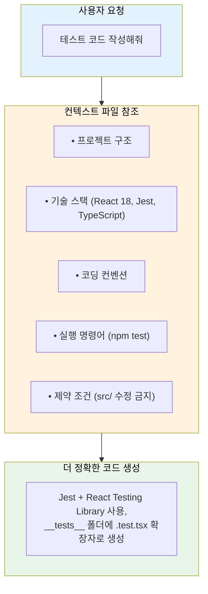
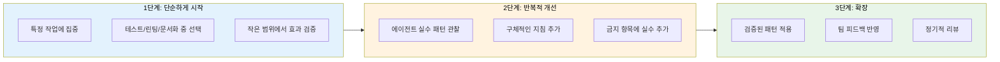

# AI 코딩 어시스턴트 컨텍스트 파일 작성 가이드

GitHub Copilot의 `agents.md`, Claude Code의 `CLAUDE.md`, Cursor의 `.cursorrules` 등 AI 코딩 어시스턴트의 컨텍스트 파일을 효과적으로 작성하는 방법

## 결론부터 말하면

**좋은 컨텍스트 파일 = 명확한 역할 + 실행 가능한 명령어 + 코드 예시 + 명확한 경계**

**❌ 나쁜 예시**
```
"도움이 되는 코딩 어시스턴트입니다."
```

**✅ 좋은 예시**
```
"React 18, TypeScript, Vite 기반 프로젝트에서
컴포넌트 테스트를 작성하는 QA 엔지니어입니다.

## 사용 가능한 명령어
npm test
npm run lint --fix

## 경계
✅ 항상: 테스트 파일에 타입 추가
🚫 금지: src/ 디렉토리 직접 수정"
```

GitHub이 2,500개 이상의 저장소를 분석한 결과, **6가지 핵심 요소**가 AI 에이전트의 성능을 좌우한다.

## 1. 왜 컨텍스트 파일이 중요한가?

### AI 코딩 어시스턴트의 작동 방식



### 각 도구별 컨텍스트 파일

| 도구 | 파일명 | 위치 |
|------|--------|------|
| GitHub Copilot | `agents.md`, `copilot-instructions.md` | `.github/` |
| Claude Code | `CLAUDE.md` | 프로젝트 루트 |
| Cursor | `.cursorrules` | 프로젝트 루트 |
| Windsurf | `.windsurfrules` | 프로젝트 루트 |
| Aider | `.aider.conf.yml` | 프로젝트 루트 |

## 2. 성공의 6가지 핵심 요소

### 2.1 명확한 역할 정의

AI에게 **구체적인 전문성**을 부여해야 한다.

**❌ 모호한 역할**
```
당신은 도움이 되는 코딩 어시스턴트입니다.
```

**✅ 명확한 역할**
```
당신은 React 컴포넌트의 단위 테스트를 작성하는 QA 엔지니어입니다.
Jest와 React Testing Library를 사용하며,
사용자 행동 기반 테스트를 우선시합니다.
```

**효과**: 범용적인 역할보다 **특정 분야에 집중**할 때 더 정확한 결과물을 생성한다.

### 2.2 실행 가능한 명령어 우선

추상적 설명 대신 **구체적인 커맨드**를 제공한다.

**❌ 추상적 설명**
```
테스트를 실행하고 린트를 체크하세요.
```

**✅ 실행 가능한 명령어**
```bash
## 테스트
npm test                    # 전체 테스트 실행
npm test -- --watch        # 감시 모드
npm test -- --coverage     # 커버리지 포함

## 린트
npm run lint               # 린트 체크
npm run lint --fix         # 자동 수정
npx eslint src/ --ext .ts,.tsx

## 빌드
npm run build              # 프로덕션 빌드
npm run dev                # 개발 서버
```

**효과**: AI가 **즉시 실행 가능한 형태**로 명령어를 제안할 수 있다.

### 2.3 코드 예시 활용

세 단락의 설명보다 **하나의 실제 코드 스니펫**이 효과적이다.

**❌ 설명만 있는 경우**
```
컴포넌트 테스트 시 render 함수를 사용하고,
screen 객체로 요소를 쿼리하며,
userEvent로 사용자 상호작용을 시뮬레이션합니다.
```

**✅ 좋은 테스트 코드 예시**
```tsx
import { render, screen } from '@testing-library/react';
import userEvent from '@testing-library/user-event';
import { Button } from './Button';

describe('Button', () => {
  it('클릭 시 onClick 핸들러가 호출된다', async () => {
    const handleClick = vi.fn();
    render(<Button onClick={handleClick}>클릭</Button>);

    await userEvent.click(screen.getByRole('button', { name: '클릭' }));

    expect(handleClick).toHaveBeenCalledTimes(1);
  });
});
```

**❌ 피해야 할 패턴**
```tsx
test('button test', () => {
  const { container } = render(<Button />);
  // container.querySelector 사용 금지 - 접근성 쿼리 사용
});
```

**효과**: AI가 **프로젝트의 코딩 스타일**을 정확히 파악한다.

### 2.4 명확한 경계 설정

AI가 **해야 할 것**과 **하지 말아야 할 것**을 명시한다.

**✅ 항상 할 것**
- 새 파일 생성 전 기존 파일 확인
- TypeScript 타입 명시
- 테스트 코드와 함께 작성
- 커밋 전 lint 실행

**⚠️ 먼저 물어볼 것**
- 새로운 의존성 추가
- 기존 API 시그니처 변경
- 데이터베이스 스키마 수정

**🚫 절대 하지 말 것**
- `src/` 디렉토리 직접 수정 (PR 통해서만)
- `.env` 파일이나 시크릿 커밋
- `console.log` 프로덕션 코드에 남기기
- `any` 타입 사용

**효과**: AI가 **위험한 작업을 자동으로 수행하는 것을 방지**한다.

### 2.5 구체적인 기술 스택

버전을 포함한 **정확한 기술 스택**을 명시한다.

**❌ 모호한 기술 스택**
```
React 프로젝트입니다.
```

**✅ 구체적인 기술 스택**

| 분류 | 기술 | 버전 |
|------|------|------|
| 프론트엔드 | React | 18.2.0 |
| | TypeScript | 5.3 |
| | Vite | 5.0 |
| | TailwindCSS | 3.4 |
| 테스트 | Vitest | 1.0 |
| | React Testing Library | 14.0 |
| | MSW (API Mocking) | 2.0 |
| 상태 관리 | Zustand | 4.4 |
| | React Hook Form | 7.48 |
| 유틸리티 | axios | 1.6 |
| | date-fns | 3.0 |
| | zod | 3.22 |

**효과**: AI가 **버전에 맞는 API와 문법**을 사용한다.

### 2.6 프로젝트 구조 설명

각 디렉토리의 **역할과 목적**을 명시한다.

```
src/
├── components/       # 재사용 가능한 UI 컴포넌트
│   ├── common/       # 버튼, 인풋 등 기본 컴포넌트
│   └── features/     # 기능별 복합 컴포넌트
├── hooks/            # 커스텀 React 훅
├── pages/            # 라우트별 페이지 컴포넌트
├── services/         # API 호출 함수
├── stores/           # Zustand 스토어
├── types/            # TypeScript 타입 정의
├── utils/            # 유틸리티 함수
└── __tests__/        # 테스트 파일

docs/                 # 문서
scripts/              # 빌드/배포 스크립트
```

**파일 명명 규칙**

| 종류 | 규칙 | 예시 |
|------|------|------|
| 컴포넌트 | PascalCase.tsx | `UserProfile.tsx` |
| 훅 | use로 시작 | `useAuth.ts` |
| 유틸 | camelCase.ts | `formatDate.ts` |
| 테스트 | *.test.tsx 또는 *.spec.tsx | `Button.test.tsx` |

**효과**: AI가 **올바른 위치에 파일을 생성**한다.

## 3. 권장 에이전트 유형

특정 작업에 특화된 에이전트를 정의하면 더 좋은 결과를 얻는다.

| 에이전트 | 역할 | 주요 명령어 |
|---------|------|-----------|
| `@docs-agent` | API 문서화, JSDoc 작성 | `npm run docs:build` |
| `@test-agent` | 단위/통합 테스트 작성 | `npm test` |
| `@lint-agent` | 코드 스타일 자동 수정 | `npm run lint --fix` |
| `@api-agent` | REST/GraphQL 엔드포인트 생성 | `npm run dev` |
| `@review-agent` | 코드 리뷰, 보안 취약점 검토 | `npm audit` |
| `@refactor-agent` | 코드 리팩토링, 성능 최적화 | `npm run analyze` |

### 에이전트 정의 예시 (GitHub Copilot)

```yaml
---
name: test-agent
description: React 컴포넌트 테스트 전문가
---

## 역할
당신은 React Testing Library와 Vitest를 사용하는 테스트 엔지니어입니다.

## 규칙
1. 사용자 행동 기반 테스트 작성
2. getByRole, getByLabelText 등 접근성 쿼리 우선
3. 구현 세부사항이 아닌 동작 테스트
4. 각 테스트는 독립적으로 실행 가능해야 함

## 명령어
npm test -- --run           # 단일 실행
npm test -- --watch         # 감시 모드
npm test -- --coverage      # 커버리지
```

## 4. 실전 템플릿

### 4.1 범용 템플릿

```
# 프로젝트명

[한 줄 설명]

## 역할
당신은 [구체적인 전문성]을 가진 [역할]입니다.

## 기술 스택
- [프레임워크/라이브러리 + 버전]
- [프레임워크/라이브러리 + 버전]

## 프로젝트 구조
[디렉토리 구조와 각 폴더의 역할]

## 사용 가능한 명령어
[전체 명령어 + 플래그]

## 코딩 표준
[좋은 예시 코드]
[피해야 할 패턴 코드]

## 경계
✅ 항상: [...]
⚠️ 먼저 물어보기: [...]
🚫 절대 금지: [...]
```

### 4.2 CLAUDE.md 예시

```markdown
# CLAUDE.md

## 프로젝트 개요
Next.js 14 기반의 이커머스 플랫폼

## 기술 스택
- Next.js 14 (App Router)
- TypeScript 5.3
- Prisma + PostgreSQL
- TailwindCSS + shadcn/ui

## 핵심 규칙

### ✅ 항상
- Server Components 우선 사용
- 클라이언트 컴포넌트는 'use client' 명시
- API 라우트는 Zod로 입력 검증
- 에러는 error.tsx로 처리

### 🚫 금지
- getServerSideProps 사용 (App Router 사용)
- any 타입
- console.log (logger 사용)
- 직접 SQL 쿼리 (Prisma 사용)

## 명령어
npm run dev          # 개발 서버
npm run db:push      # DB 스키마 푸시
npm run db:studio    # Prisma Studio
npm test             # 테스트 실행

## 파일 구조
app/
├── (auth)/          # 인증 관련 라우트 그룹
├── (shop)/          # 쇼핑 관련 라우트 그룹
├── api/             # API 라우트
└── components/      # 공유 컴포넌트
```

## 5. 일반적인 실수와 해결책

### 5.1 모호한 페르소나

| 구분 | 내용 |
|------|------|
| ❌ 문제 | "당신은 훌륭한 개발자입니다." |
| ✅ 해결 | "당신은 Next.js App Router와 서버 컴포넌트에 전문성을 가진 프론트엔드 개발자입니다. 성능 최적화와 접근성을 중시합니다." |

### 5.2 명령어 생략

| 구분 | 내용 |
|------|------|
| ❌ 문제 | "테스트를 실행하세요." |
| ✅ 해결 | `npm test -- --run` (단일 실행), `npm test -- UserProfile.test` (특정 파일), `npm test -- --coverage` (커버리지 포함) |

### 5.3 경계 미정의

| 구분 | 내용 |
|------|------|
| ❌ 문제 | (경계에 대한 언급 없음) |
| ✅ 해결 | 🚫 main 브랜치 직접 푸시, .env 파일 수정, 프로덕션 DB 직접 조회, node_modules 커밋 금지 |

### 5.4 버전 미명시

| 구분 | 내용 |
|------|------|
| ❌ 문제 | "React와 TypeScript를 사용합니다." |
| ✅ 해결 | "React 18.2 (Concurrent Features 활성화), TypeScript 5.3 (satisfies 연산자 사용 가능)" |

## 6. 시작하기 전략

### 단계별 접근



### AI를 활용한 초안 작성

```
프롬프트 예시:
"이 저장소를 분석하고 CLAUDE.md 파일의 초안을 작성해줘.
다음을 포함해야 해:
- 기술 스택과 버전
- 프로젝트 구조 설명
- 주요 명령어
- 코딩 컨벤션"
```

## 7. 컨텍스트 파일의 효과

### Before vs After

| 구분 | Before (컨텍스트 없음) | After (컨텍스트 있음) |
|------|----------------------|---------------------|
| 요청 | "로그인 API 만들어줘" | "로그인 API 만들어줘" |
| 프레임워크 | Express.js (프로젝트는 Next.js) | Next.js API Route |
| 언어 | JavaScript | TypeScript + Zod 검증 |
| DB 접근 | 직접 쿼리 | Prisma 사용 |
| 에러 처리 | 미흡 | 프로젝트 표준 적용 |
| 기존 코드 활용 | 없음 | auth 유틸리티 활용 |

## 요약

### 6가지 핵심 요소

| 요소 | 설명 | 예시 |
|------|------|------|
| 명확한 역할 | 구체적인 전문성 부여 | "React 테스트 전문가" |
| 실행 가능한 명령어 | 플래그 포함 전체 명령어 | `npm test -- --coverage` |
| 코드 예시 | 좋은 예/나쁜 예 | 실제 프로젝트 코드 |
| 명확한 경계 | 항상/물어보기/금지 | "🚫 any 타입 금지" |
| 구체적 기술 스택 | 버전 포함 | "React 18.2, TS 5.3" |
| 프로젝트 구조 | 디렉토리 역할 설명 | "src/hooks/: 커스텀 훅" |

### 체크리스트

- [ ] 역할이 "도움이 되는 어시스턴트"보다 구체적인가?
- [ ] 모든 명령어에 플래그와 옵션이 포함되어 있는가?
- [ ] 좋은 코드 예시가 포함되어 있는가?
- [ ] "절대 하지 말 것" 목록이 있는가?
- [ ] 기술 스택에 버전이 명시되어 있는가?
- [ ] 프로젝트 구조와 파일 명명 규칙이 있는가?

## 출처

- [How to write a great agents.md: Lessons from over 2,500 repositories](https://github.blog/ai-and-ml/github-copilot/how-to-write-a-great-agents-md-lessons-from-over-2500-repositories/) - GitHub Blog (2025)
