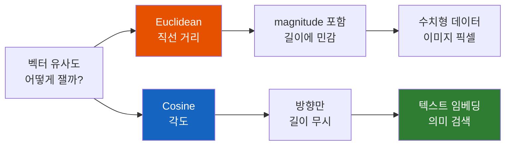

# Dense Vector 검색은 왜 거리가 아니라 각도로 유사도를 잴까?

두 벡터가 "비슷하다"를 재는 방법은 여러 가지인데, 왜 의미 기반 검색은 하필 Cosine Similarity를 기본값으로 쓸까?

## 결론부터 말하면

**텍스트 임베딩의 "의미"는 벡터의 방향에 담기고, "길이(magnitude)"는 문서 크기 같은 노이즈에 담기기 때문이다.** Cosine Similarity는 두 벡터의 각도만 보고 길이를 무시한다. 반면 Euclidean Distance는 길이까지 포함해 측정하므로, "10페이지 기술 문서"와 "2문단 요약"이 같은 주제여도 거리가 멀게 나와버린다.



| 항목 | Euclidean Distance | Cosine Similarity |
|---|---|---|
| 측정 대상 | 두 점 사이 직선 거리 | 두 벡터 사이 각도 |
| magnitude 영향 | 받음 | 받지 않음 |
| 값 범위 | $[0, \infty)$ | $[-1, 1]$ |
| 의미 검색 적합성 | 길이 편향 발생 | 방향 = 의미 |
| Elasticsearch 기본값 | — | **cosine** |

BM25가 "같은 단어"만 찾을 수 있었다면, Dense Vector 검색은 "같은 의미"를 찾는다. 그런데 "의미가 비슷하다"는 걸 수학적으로 어떻게 정의할까? 이게 오늘의 질문이다.

## 1. 왜 Dense Vector 검색이 필요한가?

### 1.1 BM25의 근본적 한계

BM25는 훌륭한 랭킹 알고리즘이지만 태생적 한계가 하나 있다. **"검색어와 정확히 같은 토큰이 문서에 있어야만 매칭된다"** 는 것이다.

예를 들어 사용자가 "자동차 연비"를 검색한다고 해보자. BM25는 다음 문서들을 모두 **관련 없음** 으로 판단한다.

- "차량의 연료 효율성"
- "승용차 기름 소비 패턴"
- "car fuel economy"

사람이 보기엔 완전히 같은 주제지만, BM25에게는 그저 다른 토큰일 뿐이다. 토큰화 단계에서 "자동차"와 "차량"은 완전히 별개의 항목이 된다. 동의어 사전(synonym dictionary)을 수동으로 관리해 어느 정도 보완할 수는 있지만, 언어는 무한한 변주를 만들어낸다. 확장성이 없는 접근이다.

### 1.2 만약 단어를 의미 좌표에 놓을 수 있다면?

여기서 문제 해결의 실마리가 나온다. **"단어나 문장을 '의미가 가까우면 가깝게, 멀면 멀게' 배치된 좌표 공간에 넣을 수 있다면?"** 그럼 "자동차"와 "차량"을 서로 가까운 지점에 놓고, "자동차"와 "김치찌개"는 멀리 떨어진 지점에 놓을 수 있다.

이게 바로 **임베딩(embedding)** 이다. 문장 하나를 고차원 벡터(예: 384차원, 1536차원)로 변환한다. BERT, Sentence-Transformers, OpenAI의 `text-embedding-3-small` 같은 모델들이 바로 이 일을 한다. 학습 과정에서 "의미가 비슷한 문장은 비슷한 벡터를 갖도록" 훈련된 결과물이다.

임베딩이 있으면 검색은 이렇게 바뀐다.

1. 쿼리 문장을 벡터로 변환
2. 모든 문서 벡터와 "비슷함"을 측정
3. 가장 비슷한 top-K 반환

2번의 "비슷함"을 수학적으로 어떻게 정의할지가 이 TIL의 핵심 질문이다.

## 2. Euclidean이냐 Cosine이냐

### 2.1 가장 직관적인 선택: Euclidean Distance

"두 벡터가 비슷하다"를 들으면 대부분 **"두 점이 가깝다"** 는 이미지를 먼저 떠올린다. 중학교에서 배운 두 점 사이 거리 공식이 그대로 쓰인다.

$$
d(\vec{a}, \vec{b}) = \sqrt{\sum_{i=1}^{n} (a_i - b_i)^2}
$$

2차원으로 시각화하면 그냥 두 점 사이를 잇는 선의 길이다. 직관적이고, 물리적 감각과 잘 맞는다. 실제로 이미지 픽셀이나 센서 데이터처럼 **각 차원의 절댓값이 고유한 의미를 갖는 경우** 에는 이 방식이 가장 자연스럽다. 온도 센서 임베딩에서 "100°C"가 "25°C"보다 "20°C"에서 더 멀어야 한다면, 그 "멀다"를 그대로 수치로 반영해주는 것이 Euclidean이기 때문이다.

그런데 텍스트 임베딩에서는 이상한 일이 벌어진다.

### 2.2 이상한 점: 같은 주제인데 거리가 멀다

10페이지짜리 기술 문서와 같은 주제를 다룬 2문단짜리 요약을 임베딩해보면 어떻게 될까? 두 벡터는 **방향은 비슷하지만 길이가 크게 다르다**. 긴 문서일수록 임베딩 벡터의 norm(길이)이 커지는 경향이 있기 때문이다. 이것은 모델의 버그가 아니라, 대부분의 텍스트 임베딩 모델이 학습되는 방식의 자연스러운 부산물이다.

Euclidean Distance로 재면 두 벡터는 "거리가 멀다"고 나온다. 길이 차이가 그대로 거리에 더해지기 때문이다. 하지만 우리가 원하는 건 "같은 주제인가?" 아닌가? **문서 길이는 의미가 아니라 노이즈다.** 그런데 Euclidean은 노이즈와 신호를 구분하지 못한다.

### 2.3 해결책: 길이를 버리고 각도만 보자

그래서 등장하는 것이 **Cosine Similarity** 다. 두 벡터가 원점에서 뻗어나가는 방향만 비교하고, 길이는 완전히 무시한다.

$$
\text{cosine}(\vec{a}, \vec{b}) = \frac{\vec{a} \cdot \vec{b}}{\|\vec{a}\| \cdot \|\vec{b}\|}
$$

분자는 내적(dot product), 분모는 두 벡터의 길이의 곱이다. 분모로 나눠주는 순간 각 벡터는 단위 길이로 정규화되고, 결과값은 **순수한 각도의 코사인값** 만 남는다.

값의 범위는 $[-1, 1]$이다.

- $1$: 완전히 같은 방향 (각도 0도)
- $0$: 수직 (관련 없음, 각도 90도)
- $-1$: 정반대 (각도 180도)

이제 10페이지 문서와 2문단 요약은 **거의 1에 가까운 cosine 값** 을 갖는다. 길이 차이가 완전히 상쇄된 결과다. **"의미는 방향에 있고, 길이는 문서 크기 같은 노이즈에 있다"** — 이 한 문장이 Cosine Similarity가 기본값인 이유다.

### 2.4 한 줄 비교

| 상황 | Euclidean | Cosine |
|---|---|---|
| 같은 방향, 길이만 다름 | 거리 크게 측정 (멀다) | 1에 수렴 (유사) |
| 다른 방향, 길이 비슷 | 길이 대비 거리 보통 | 작게 측정 (덜 유사) |
| 텍스트 임베딩에서 | 문서 길이에 휘둘림 | 의미만 포착 |

## 3. Elasticsearch에서 직접 써보기

### 3.1 dense_vector 필드 정의

Elasticsearch에서 벡터 검색을 쓰려면 `dense_vector` 타입 필드를 만든다. 핵심 옵션은 `dims`(차원 수)와 `similarity`(유사도 측정 방식) 두 가지다.

```json
PUT /articles
{
  "mappings": {
    "properties": {
      "title": { "type": "text" },
      "content_vector": {
        "type": "dense_vector",
        "dims": 384,
        "index": true,
        "similarity": "cosine"
      }
    }
  }
}
```

`similarity`의 기본값이 `cosine`이라는 점에 주목하자. Elasticsearch도 **"텍스트 임베딩에는 cosine이 정답"** 이라는 관점을 공식 기본값으로 반영해둔 것이다. 선택 가능한 값은 `cosine`, `dot_product`, `l2_norm`, `max_inner_product` 네 가지다. 이 중 `max_inner_product`는 정규화되지 않은 벡터에 대해 벡터 크기(magnitude)까지 함께 반영하는 metric으로, 일부 임베딩 모델(예: Cohere의 일부 모델)이 권장하는 방식이다.

`index: true`는 HNSW(Hierarchical Navigable Small World) 그래프 인덱스를 구축해 **근사 최근접 이웃(ANN, Approximate Nearest Neighbor) 검색** 을 가능하게 한다. 이게 없으면 매 쿼리마다 모든 문서와의 유사도를 전부 계산해야 한다(brute force). 10만 건이면 몰라도 100만 건 넘어가면 사실상 쓸 수 없다.

### 3.2 kNN 검색 쿼리

인덱싱이 끝나면 kNN 검색은 이렇게 쓴다.

```json
GET /articles/_search
{
  "knn": {
    "field": "content_vector",
    "query_vector": [0.12, -0.34, 0.58],
    "k": 10,
    "num_candidates": 100
  }
}
```

`k`는 최종적으로 받을 결과 개수, `num_candidates`는 HNSW가 내부적으로 탐색할 후보 풀 크기다. `num_candidates`를 늘리면 정확도(recall)가 올라가지만 지연 시간(latency)은 늘어난다. **recall과 latency의 트레이드오프** 를 여기서 조절한다. 일반적으로 `k`의 5~10배 정도를 `num_candidates`로 준다.

### 3.3 Elasticsearch의 cosine 점수 공식

ES가 반환하는 `_score`는 순수 cosine 값 그대로가 아니다. cosine의 범위는 $[-1, 1]$인데 ES의 `_score`는 음수가 될 수 없다는 제약이 있기 때문이다. 그래서 다음 공식으로 변환한다.

$$
\text{\_score} = \frac{1 + \text{cosine}(\vec{q}, \vec{d})}{2}
$$

이 변환으로 최종 점수는 $[0, 1]$ 범위가 된다. 완전히 같은 방향이면 1, 수직이면 0.5, 정반대면 0이 나온다. 이 정규화된 값이 BM25의 `_score`와 함께 hybrid 검색의 재료로 쓰인다.

### 3.4 성능 팁: 미리 정규화하면 dot_product를 써라

공식 문서에 숨어있는 중요한 팁이 있다. **임베딩 벡터를 미리 단위 벡터로 정규화해뒀다면, `similarity`를 `dot_product`로 바꾸는 것이 더 빠르다.**

왜일까? 정규화된 벡터에서는 $\|\vec{a}\| = \|\vec{b}\| = 1$이므로 cosine 공식의 분모가 1이 된다. 즉 **cosine = dot product** 가 수학적으로 성립한다. 분모 계산과 제곱근 연산을 통째로 생략할 수 있으니 빠를 수밖에 없다.

OpenAI나 Cohere의 최신 임베딩 모델들은 대부분 이미 정규화된 벡터를 반환한다. 이런 경우 `similarity: "dot_product"`로 설정하면 **동일한 랭킹 결과** 를 **더 빠르게** 얻는다. Elastic 공식 문서도 이 방식을 명시적으로 권장한다.

## 4. 정리

### 핵심 포인트

1. **의미는 방향에, 노이즈는 길이에 담긴다**
   - 텍스트 임베딩에서 벡터의 magnitude는 주로 문서 길이나 토큰 수 같은 "의미와 무관한 정보"를 반영한다. Cosine Similarity는 방향만 보고 magnitude를 무시하기 때문에, 같은 주제의 문서라면 분량이 달라도 유사하다고 판단할 수 있다.

2. **Cosine vs Euclidean의 선택 기준**
   - 텍스트·의미 검색 → Cosine. 이미지 픽셀·센서 값·절댓값이 고유한 의미를 갖는 수치 데이터 → Euclidean. 가장 안전한 원칙은 **"임베딩 모델이 학습 시 사용한 metric과 동일한 것을 쓰는 것"** 이다.

3. **정규화된 벡터라면 dot_product가 더 빠르다**
   - 모델이 이미 단위 벡터를 반환한다면 cosine의 분모가 항상 1이므로 cosine과 dot product는 수학적으로 동일해진다. Elasticsearch에서 `similarity: "dot_product"`로 바꾸면 같은 결과를 분모·제곱근 계산 없이 더 빠르게 얻는다.

---

## 출처

- [Dense vector field type - Elasticsearch Reference](https://www.elastic.co/docs/reference/elasticsearch/mapping-reference/dense-vector) - Elastic 공식 문서
- [kNN search in Elasticsearch - Elastic Docs](https://www.elastic.co/docs/solutions/search/vector/knn) - Elastic 공식 문서
- [Vector Similarity Explained - Pinecone](https://www.pinecone.io/learn/vector-similarity/)
- [Distance Metrics in Vector Search - Weaviate](https://weaviate.io/blog/distance-metrics-in-vector-search)
- [What is cosine similarity and why is it used in semantic search? - Milvus](https://milvus.io/ai-quick-reference/what-is-cosine-similarity-and-why-is-it-used-in-semantic-search)
