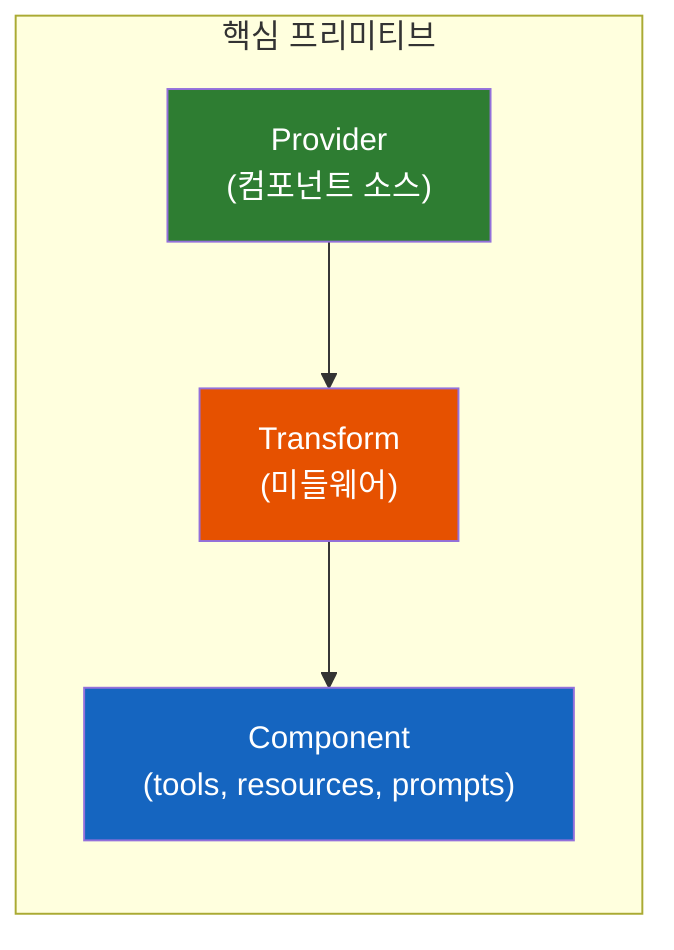
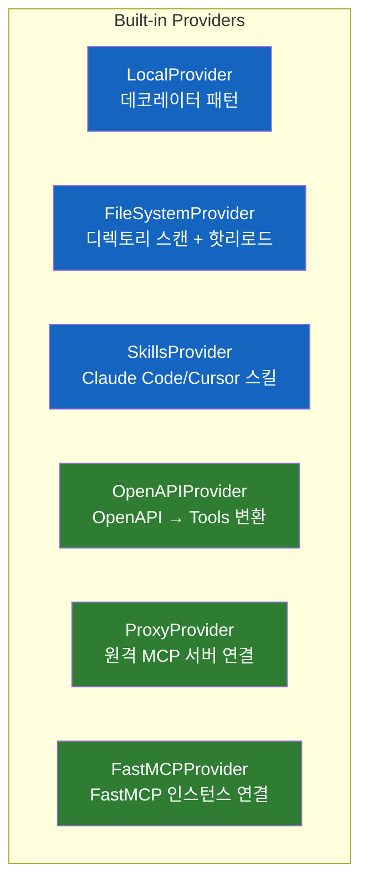
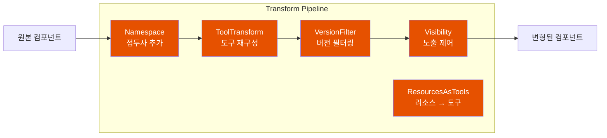
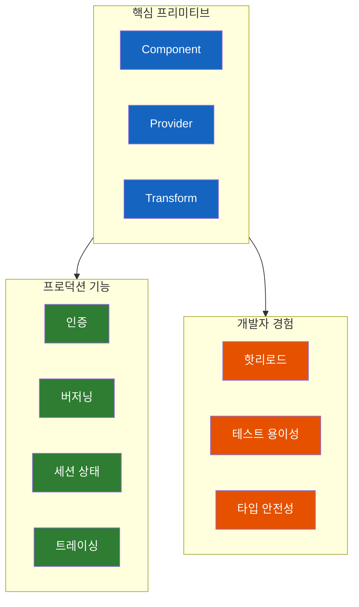

# FastMCP 3.0 - 프로덕션 레디 MCP 서버 구축의 새로운 패러다임

MCP 서버를 직접 만들어봤다면 알겠지만, 보일러플레이트 코드가 너무 많다. FastMCP 3.0은 이 문제를 근본적으로 해결하면서, 프로덕션 환경에서 필요한 기능들을 모두 갖췄다.

## 결론부터 말하면

**FastMCP 3.0은 세 가지 핵심 프리미티브로 재설계되었다:** Component, Provider, Transform. 이 조합으로 마운팅, 프록시, 필터링 같은 복잡한 기능들이 자연스럽게 구현된다.



| 기능 | 설명 |
|------|------|
| **Provider** | 컴포넌트를 어디서 가져올지 (DB, REST API, 파일 시스템 등) |
| **Transform** | 컴포넌트를 어떻게 변형할지 (네임스페이스, 필터링, 리네이밍) |
| **Component** | 실제 기능 (tools, resources, prompts) |

---

## 1. 왜 이런 재설계가 필요했나?

### 기존 방식의 한계

MCP 서버를 만들 때 흔히 겪는 문제들이 있다:

- **재사용성 부족**: 한 서버에서 만든 도구를 다른 서버에서 쓰려면 복사-붙여넣기
- **구성 복잡성**: 여러 서버를 조합하려면 프록시 로직 직접 구현
- **프로덕션 갭**: 인증, 버저닝, 세션 관리를 직접 만들어야 함

### FastMCP 3.0의 접근

마운팅을 예로 들어보자. 기존에는 별도의 마운팅 시스템이 필요했다. 하지만 FastMCP 3.0에서는?

> "마운팅은 단지 두 가지 프리미티브의 조합이다: 다른 서버에서 컴포넌트를 가져오는 Provider와 네임스페이스 접두사를 추가하는 Transform."

복잡한 기능이 기본 구성 요소의 조합으로 나온다. 이것이 **조합성(composability)** 의 힘이다.

---

## 2. Provider 시스템

Provider는 컴포넌트를 어디서 가져올지 결정한다. 데이터베이스, REST API, Kubernetes 클러스터 등 어디서든 컴포넌트를 소싱할 수 있다.

### 2.1 빌트인 Provider들



| Provider | 용도 | 특징 |
|----------|------|------|
| **LocalProvider** | 기존 데코레이터 패턴 | 여러 서버 인스턴스에서 재사용 가능 |
| **FileSystemProvider** | 디렉토리에서 도구 스캔 | **핫리로드 지원** |
| **SkillsProvider** | 인스트럭션 파일을 MCP 리소스로 노출 | Claude Code, Cursor, Copilot 호환 |
| **OpenAPIProvider** | OpenAPI 스펙 → MCP 도구 변환 | Transform과 조합해 최적화 가능 |
| **ProxyProvider** | 원격 MCP 서버 연결 | 분산 서비스 구성 |
| **FastMCPProvider** | 다른 FastMCP 인스턴스 연결 | 미들웨어 체인 보존 |

### 2.2 FileSystemProvider 예시

파일 시스템에서 도구를 자동으로 로드하고, 개발 중 변경 사항을 핫리로드한다:

```python
from fastmcp import FastMCP
from fastmcp.server.providers import FileSystemProvider  # ⚠️ FastMCP 3 공식 경로: fastmcp.server.providers

mcp = FastMCP("My Server")
mcp.add_provider(FileSystemProvider("./tools"))  # tools 디렉토리 스캔
```

> **import 경로 일러두기** — 본 문서의 일부 짧은 예시는 가독성을 위해 `fastmcp.providers`/`fastmcp.auth`/`fastmcp.middleware` 같은 약식 경로로 표기되어 있을 수 있다. **FastMCP 3 공식 경로는 `fastmcp.server.providers`, `fastmcp.server.providers.openapi`, `fastmcp.server.auth`, `fastmcp.server.middleware`** 이므로, 실제 코드를 작성할 때는 이 정식 경로를 사용해야 한다 ([공식 문서](https://gofastmcp.com/servers/providers/filesystem) 참고).

### 2.3 OpenAPIProvider - API를 MCP 도구로 변환

기존 REST API가 있다면? OpenAPI 스펙만 있으면 MCP 도구로 변환할 수 있다:

```python
import httpx
from fastmcp.server.providers.openapi import OpenAPIProvider  # ✅ FastMCP 3 공식 경로

# 1) OpenAPI 스펙을 먼저 로드 (URL이든 dict든)
spec = httpx.get("https://api.example.com/openapi.json").json()

# 2) 실제 API를 호출할 httpx.AsyncClient를 따로 준비
client = httpx.AsyncClient(base_url="https://api.example.com")

# 3) provider에 spec과 client를 함께 넘긴다
provider = OpenAPIProvider(openapi_spec=spec, client=client)
mcp.add_provider(provider)
```

> URL 문자열만 넘기는 short form은 공식 API에 없다. *스펙 로딩*과 *런타임 호출 client*는 분리해서 명시적으로 주입하는 것이 FastMCP 3의 표준 패턴이다 ([공식 OpenAPI 통합 가이드](https://gofastmcp.com/integrations/openapi) 참고).

---

## 3. Transform 파이프라인

Transform은 컴포넌트가 클라이언트에 도달하기 전에 변형을 적용한다. 두 가지 레벨에서 동작한다:

- **Provider 레벨**: 특정 Provider의 컴포넌트만 영향
- **Server 레벨**: 모든 컴포넌트에 영향

### 3.1 핵심 Transform들



| Transform | 용도 |
|-----------|------|
| **Namespace** | 이름 충돌 방지를 위한 접두사 추가 |
| **ToolTransform** | 도구 리네이밍, 설명 수정, 인자 변경, 태그 추가 |
| **VersionFilter** | 특정 버전 범위만 노출 |
| **Visibility** | 태그/이름/버전으로 노출 제어 (allowlist/blocklist) |
| **ResourcesAsTools** | 리소스를 도구로 노출 (tools만 지원하는 클라이언트용) |
| **PromptsAsTools** | 프롬프트를 도구로 노출 |

### 3.2 ToolTransform 예시

서드파티 자동 생성 도구를 AI 에이전트에 최적화:

```python
from fastmcp.server.transforms import ToolTransform
from fastmcp.tools.tool_transform import ToolTransformConfig

provider.add_transform(ToolTransform({
    "verbose_auto_generated_name": ToolTransformConfig(
        name="short_name",
        description="에이전트를 위한 더 나은 설명",
        tags={"category"},
    ),
}))
```

---

## 4. 인증(Authorization) 시스템

프로덕션 환경에서 가장 중요한 부분이다. FastMCP 3.0은 컴포넌트별 세밀한 인증을 지원한다.

### 4.1 컴포넌트별 인증

```python
from fastmcp import FastMCP
from fastmcp.server.auth import require_scopes, restrict_tag
from fastmcp.server.auth import AuthContext  # ✅ FastMCP 3 공식 import 경로

mcp = FastMCP("Secure Server")

# 단순 인증 여부 검사는 빌트인 헬퍼가 아니라 커스텀 auth check로 표현한다 — `require_auth`라는 이름의 함수는 공식 API에 없다.
def authenticated_only(ctx: AuthContext) -> bool:
    return ctx.token is not None

@mcp.tool(auth=authenticated_only)  # 유효한 토큰만 허용
def public_tool():
    pass

@mcp.tool(auth=require_scopes("admin:write"))  # 특정 스코프 필요
def admin_tool():
    pass
```

### 4.2 빌트인 인증 체크

| 체크 | 설명 |
|------|------|
| `require_scopes("scope1", "scope2")` | 특정 OAuth 스코프 필요 (FastMCP 3 공식 빌트인) |
| `restrict_tag("admin", scopes=["admin:*"])` | 태그별 스코프 요구사항 (FastMCP 3 공식 빌트인) |
| 커스텀 함수 (예: `lambda ctx: ctx.token is not None`) | "유효 토큰만 통과" 같은 단순 인증 검사는 직접 정의 — `require_auth`는 공식 API에 없으므로 사용 X |

### 4.3 서버 전체 인증

```python
from fastmcp.server.middleware import AuthMiddleware
from fastmcp.server.auth import require_scopes

# AuthMiddleware는 required_scopes 인자가 아니라 auth= 인자로 check를 받는다.
mcp.add_middleware(AuthMiddleware(auth=require_scopes("api:access")))
```

> **주의**: STDIO 트랜스포트는 OAuth 개념이 없어 모든 인증 체크를 우회한다. 이는 로컬 개발 환경(Claude Desktop, Cursor 등)에서는 편리하지만, **프로덕션 환경에서는 반드시 HTTP/SSE 트랜스포트와 함께 AuthMiddleware를 사용해야 한다.**

---

## 5. 컴포넌트 버저닝

여러 버전의 컴포넌트가 공존할 수 있다. PEP 440 시맨틱 버저닝을 따른다.

```python
@mcp.tool(version="1.0.0")
def my_tool_v1():
    """레거시 버전"""
    pass

@mcp.tool(version="2.0.0")
def my_tool_v2():
    """새 버전 - 기본으로 노출"""
    pass
```

- 목록 조회 시 **가장 높은 버전만** 노출
- 이전 버전은 명시적으로 접근 가능
- FastMCP 클라이언트는 버전 선택 파라미터 지원

---

## 6. 세션 스코프 상태(State)

도구 호출 간 상태를 유지할 수 있다. 세션 내에서 영속적이며, 1일 후 자동 만료된다.

```python
@mcp.tool
async def stateful_tool(ctx: Context):
    # 상태 읽기
    count = await ctx.get_state("counter", default=0)

    # 상태 쓰기
    await ctx.set_state("counter", count + 1)

    # 상태 삭제
    await ctx.delete_state("counter")

    return f"호출 횟수: {count + 1}"
```

### 분산 배포 지원

pykeyvalue 라이브러리로 Redis 등 외부 스토리지 사용 가능 (공식 경로·인자명 기준):

```python
from key_value.aio.stores.redis import RedisStore

mcp = FastMCP(
    "Distributed Server",
    session_state_store=RedisStore(...),  # ⚠️ FastMCP 3 공식 인자명은 session_state_store
)
```

---

## 7. 세션별 가시성(Visibility)

세션마다 동적으로 컴포넌트를 활성화/비활성화할 수 있다:

```python
@mcp.tool
async def enable_admin_mode(ctx: Context):
    # 관리자 도구 활성화
    await ctx.enable_components(tags=["admin"])
    return "관리자 모드 활성화됨"

@mcp.tool
async def disable_dangerous_tools(ctx: Context):
    # 위험한 도구 비활성화
    await ctx.disable_components(names=["delete_all", "drop_table"])
```

FastMCP는 영향받는 세션에 자동으로 변경 알림을 전송한다.

---

## 8. 프로덕션 기능들

### 8.1 OpenTelemetry 트레이싱

FastMCP 3은 도구 호출·리소스 읽기·프롬프트 렌더링에 대한 OpenTelemetry 계측을 **기본 활성화**된 상태로 제공한다. 즉 `enable_tracing=True` 같은 코드 옵션을 켜는 게 아니라, **OpenTelemetry SDK/환경 변수/CLI 계측**을 설정하기만 하면 FastMCP가 자동으로 span을 내보낸다.

```bash
# 가장 간단한 경로 — opentelemetry-instrument로 자동 계측
pip install opentelemetry-distro opentelemetry-exporter-otlp
opentelemetry-bootstrap --action=install
opentelemetry-instrument \
    --traces_exporter otlp \
    --service_name my-fastmcp-server \
    fastmcp run server.py
```

```python
# 또는 코드에서 SDK 직접 설정
from opentelemetry.sdk.trace import TracerProvider
from opentelemetry.sdk.trace.export import BatchSpanProcessor
from opentelemetry.exporter.otlp.proto.grpc.trace_exporter import OTLPSpanExporter
from opentelemetry import trace

provider = TracerProvider()
provider.add_span_processor(BatchSpanProcessor(OTLPSpanExporter()))
trace.set_tracer_provider(provider)

# 별도 옵션 없이 평소처럼 사용 — FastMCP가 자동으로 span을 채워준다
mcp = FastMCP("Traced Server")
```

자세한 내용은 [공식 Telemetry 문서](https://gofastmcp.com/servers/telemetry) 참고.

### 8.2 백그라운드 태스크 (SEP-1686)

MCP에는 장기 실행 백그라운드 태스크를 위한 스펙 확장(SEP-1686: Standard Extension Proposal)이 있다. FastMCP는 Docket 통합으로 이를 구현한다 — 기본은 in-memory(`memory://`) 백엔드이며, **프로덕션 영속성과 수평 워커 확장은 Redis 또는 Valkey 백엔드(`redis://host:port/db`)로 구성**한다:

```python
from fastmcp.server.tasks import TaskConfig

@mcp.tool(task=TaskConfig(mode="required"))
async def long_running_task():
    """반드시 백그라운드 태스크로 실행"""
    ...

@mcp.tool(task=TaskConfig(mode="optional"))
async def flexible_task():
    """동기와 태스크 실행 모두 지원"""
    ...

@mcp.tool(task=True)  # mode="optional"의 단축형
async def simple_task():
    ...
```

| 모드 | 설명 |
|------|------|
| `"forbidden"` | 태스크 실행 불가 (기본값) |
| `"optional"` | 동기와 태스크 실행 모두 지원 |
| `"required"` | 반드시 백그라운드 태스크로 실행 |

Docket 통합을 위해 `pip install fastmcp[tasks]`로 설치한다.

### 8.3 도구 타임아웃

포그라운드 실행 시간 제한 (초과 시 MCP 에러 코드 -32000):

```python
@mcp.tool(timeout=30)  # 30초 제한
async def limited_tool():
    pass
```

### 8.4 페이지네이션

대규모 컴포넌트 레지스트리를 위한 커서 기반 페이지네이션:

```python
mcp = FastMCP("Large Server", list_page_size=100)
```

---

## 9. 개발자 경험 개선

### 9.1 데코레이터가 호출 가능한 함수 반환

Flask/FastAPI처럼 직접 함수 호출로 테스트 가능:

```python
@mcp.tool
def my_tool(name: str):
    return f"Hello, {name}"

# 테스트 시 직접 호출
result = my_tool("World")  # "Hello, World"
```

### 9.2 핫리로드

```bash
# 파일 변경 시 자동 재시작
fastmcp run --reload

# dev 모드는 기본으로 reload 포함
fastmcp dev
```

### 9.3 동기 도구의 자동 스레드풀 실행

동기 함수도 자동으로 스레드풀에서 실행되어 병렬 처리 가능:

```python
@mcp.tool
def sync_tool():  # async가 아니어도 OK
    # 자동으로 threadpool에서 실행
    return expensive_computation()
```

### 9.4 Lifespan 조합

`|` 연산자로 모듈화된 setup/teardown — 단, **`|` 합성은 FastMCP의 `@lifespan` 데코레이터(`fastmcp.server.lifespan.lifespan`)로 만든 composable lifespan에만 적용**된다는 점에 주의해야 한다. 기존 `@asynccontextmanager` 함수를 그대로 합치려면 `ContextManagerLifespan(...)`으로 감싸야 한다.

```python
from fastmcp import FastMCP
from fastmcp.server.lifespan import lifespan  # ✅ FastMCP의 composable lifespan 데코레이터

@lifespan
async def db_lifespan(server):
    db = await connect_db()
    try:
        yield {"db": db}
    finally:
        await db.close()

@lifespan
async def cache_lifespan(server):
    cache = await connect_cache()
    try:
        yield {"cache": cache}
    finally:
        await cache.close()

# 순차 진입, 역순 종료 (LIFO)
mcp = FastMCP("Combined", lifespan=db_lifespan | cache_lifespan)
```

> 만약 이미 `@asynccontextmanager`로 작성된 lifespan이 있다면, `from fastmcp.server.lifespan import ContextManagerLifespan` 후 `ContextManagerLifespan(my_async_cm) | other_lifespan` 형태로 감싸야 `|` 합성이 가능하다.

### 9.5 트랜스포트 감지

도구가 현재 트랜스포트를 감지해 응답 최적화:

```python
@mcp.tool
async def adaptive_tool(ctx: Context):
    if ctx.transport == "stdio":
        return "간단한 응답"
    else:
        return "HTTP용 상세 응답"
```

---

## 10. Breaking Changes

대부분의 기존 코드는 수정 없이 동작한다. 주요 변경 사항:

| 변경 | 마이그레이션 |
|------|-------------|
| 데코레이터 반환 동작 | `FASTMCP_DECORATOR_MODE` 환경변수로 제어 |
| 상태 메서드가 async로 변경 | `await ctx.get_state()` |
| 명시적 auth provider 설정 | 문서 참조 |
| `enabled` 파라미터 deprecated | Visibility 시스템 사용 |

---

## 정리

FastMCP 3.0은 MCP 서버 구축의 새로운 표준을 제시한다:



| 영역 | 기능 |
|------|------|
| **조합성** | Provider + Transform으로 복잡한 기능 구현 |
| **프로덕션** | 인증, 버저닝, 세션 상태, OpenTelemetry |
| **개발 경험** | 핫리로드, 테스트 용이성, 타입 안전성 |

---

## 부록: 원문 번역

> 아래는 [Jeremiah Lowin의 블로그 포스트](https://www.jlowin.dev/blog/fastmcp-3-whats-new) (2026년 1월 20일) 전체 번역이다.

---

### FastMCP 3.0의 새로운 기능

*모든 주요 기능에 대한 포괄적인 가이드*

*2026년 1월 20일 | Jeremiah Lowin*

---

FastMCP 3.0은 역대 가장 큰 릴리스다. 이 글에서는 아키텍처 개요와 관련 문서 링크를 포함하여 모든 주요 기능을 상세히 다룬다.

#### 아키텍처

FastMCP 2에는 기능이 많았다. 정말 많았다. 서버 마운팅, 원격 프록싱, 태그별 필터링, 도구 스키마 변환. 각 기능은 자체 코드, 자체 멘탈 모델, 자체 엣지 케이스를 가진 독립적인 하위 시스템이었다. 새로운 것을 추가하려면 다른 모든 것과 어떻게 상호작용하는지 파악해야 했고—그 답은 대개 "더 많은 글루 코드를 작성하라"였다.

FastMCP 3은 다른 질문을 던진다: 이 모든 기능이 동일한 프리미티브의 다른 조합일 뿐이라면?

아키텍처는 세 가지 개념으로 귀결된다:

**Component** 는 MCP의 원자다. 도구, 리소스, 프롬프트. 클라이언트가 실제로 상호작용하는 대상이다. 컴포넌트는 이름, 스키마, 메타데이터, 동작을 가진다. 궁극적으로 노출하려는 것이다.

**Provider** 는 질문에 답한다: 컴포넌트가 어디서 오는가? Provider는 컴포넌트를 나열하고 이름으로 검색할 수 있는 모든 것이다. 데코레이트된 함수가 provider다. 파일 디렉토리가 provider다. 원격 MCP 서버가 provider다. OpenAPI 스펙이 provider다. 중요한 것은 FastMCP 서버 자체가 provider라는 점이다—이는 서버 안에 서버를 무한히 중첩할 수 있다는 의미다.

**Transform** 은 컴포넌트 파이프라인의 미들웨어다. Provider에서 클라이언트로 흐르는 컴포넌트를 가로채서 통과하는 것을 수정할 수 있다. 도구 이름 변경, 네임스페이스 접두사 추가, 버전별 필터링, 태그로 컴포넌트 숨기기—이 모두가 transform이다. Transform은 조합된다: 스택처럼 쌓으면 각각이 이전 것의 출력을 처리한다.

##### 왜 조합성이 중요한가

여기서 흥미로워진다. FastMCP 2에서 서브 서버를 "마운팅"하는 것은 대규모 특수 기능이었다. 네임스페이싱, 미들웨어 체인, 라이프사이클 관리를 처리하기 위해 수백 줄의 코드가 필요했다. 원격 서버 프록싱도 마찬가지. 가시성 필터링도 마찬가지.

FastMCP 3에서 마운팅은 단지 두 가지 프리미티브의 조합이다:

- 다른 서버에서 컴포넌트를 소싱하는 **Provider**
- 네임스페이스 접두사를 추가하는 **Transform**

그게 전부다. 특별한 마운팅 코드가 없다. 마운팅 동작은 각자 한 가지를 잘 수행하는 프리미티브의 조합에서 나온다.

원격 서버 프록싱? 그것은 MCP 클라이언트가 지원하는 Provider다. Provider가 클라이언트를 래핑하고, list/get 호출을 MCP 프로토콜 호출로 변환하고, 결과를 반환한다. 특별한 프록시 하위 시스템이 없다—그냥 원격 서버와 통신하는 provider일 뿐이다.

사용자마다 다른 도구를 보는 세션별 가시성? 그것은 서버 대신 개별 세션에 적용된 Transform이다. 가시성 transform은 전역으로 실행되는지 세션별로 실행되는지 알지도 신경 쓰지도 않는다. 그저 규칙에 따라 컴포넌트를 필터링한다. 세션별 동작은 적용 위치에서 나온다.

이 조합성은 실질적인 결과를 가져온다: FastMCP 3은 더 적은 코드로 더 많은 기능을 제공하고, 우리가 예상하지 못한 방식으로 기능을 조합할 수 있다. 원격 서버를 프록시하고, 태그로 도구를 필터링하고, 이름을 바꾸고, 인증된 사용자에게만 노출하고 싶다면? Provider 하나, Transform 세 개, 그리고 약간의 auth 미들웨어다. 각 조각은 독립적이다. 각 조각은 테스트 가능하다. 그리고 새로운 transform이나 provider를 추가하면 자동으로 다른 모든 것과 함께 작동한다.

##### 실제 동작 방식

클라이언트가 도구 목록을 요청하면 다음이 일어난다:

1. 서버가 모든 Provider에서 컴포넌트를 수집한다
2. 각 Provider가 자체 transform 체인을 실행한다 (provider 레벨 transforms)
3. 서버가 집계된 결과에 자체 transform 체인을 실행한다 (server 레벨 transforms)
4. 최종 목록이 클라이언트에 전달된다

이 이중 레벨 transform 시스템은 강력하다. Provider 레벨 transform은 해당 provider의 컴포넌트만 영향을 미친다—마운트된 서버의 네임스페이싱에 유용하다. Server 레벨 transform은 모든 것에 영향을 미친다—전역 가시성 규칙이나 auth 필터링에 유용하다.

동일한 흐름이 `get_tool`, `call_tool`, `read_resource`, 그리고 다른 모든 작업에서 발생한다. Transform은 이 중 어느 것이든 가로챌 수 있어 파이프라인의 어느 지점에서든 동작을 주입할 수 있다.

궁금할 수 있다: 미들웨어는 어떻게 되나? FastMCP에는 여전히 미들웨어가 있고, 요청에 대해 작동한다—도구 호출, 리소스 읽기, 그리고 실행 시 다른 작업을 가로챈다. FastMCP 2에서 일부 사용자는 미들웨어를 사용해 동적으로 도구를 수정하거나 새 컴포넌트를 주입하려고 했다. 어느 정도 작동했지만, 예측하기 어렵고, auth 및 가시성 같은 다른 시스템과 조합하기 어려웠으며, 서버 레벨에서 작동해 컴포넌트의 하위 집합을 다루기 어려웠다. Transform이 깔끔한 답이다: 컴포넌트 레벨 수정을 위해 설계되었고, 자연스럽게 조합되며, provider 시스템과 통합된다. 미들웨어는 여전히 자신이 잘하는 것에 사용된다—인증, 로깅, 속도 제한, 그리고 요청 레벨의 다른 횡단 관심사. 약간의 회색 영역이 있지만, 가이드라인은: 어떤 컴포넌트가 존재하는지 형성하는 것은 transform, 요청이 어떻게 실행되는지 처리하는 것은 미들웨어다.

다음은 FastMCP 3과 함께 제공되는 provider와 transform 둘러보기다. "기능"보다는 "빌딩 블록"으로 생각하라—애플리케이션에 필요한 것을 구축하기 위해 조합하는 프리미티브다.

---

#### Providers

Provider는 "컴포넌트가 어디서 오는가?"에 답한다.

##### 커스텀 Provider

`Provider`를 서브클래싱해서 직접 provider를 작성할 수 있다:

```python
from fastmcp.server.providers import Provider

class DatabaseProvider(Provider):
    async def list_tools(self) -> Sequence[Tool]:
        # 데이터베이스에서 사용 가능한 도구 쿼리
        rows = await db.fetch("SELECT * FROM tools")
        return [Tool(name=row['name'], description=row['description'])
                for row in rows]

    async def get_tool(self, name: str) -> Tool | None:
        row = await db.fetchrow("SELECT * FROM tools WHERE name = ?", name)
        if row:
            return Tool(name=row['name'], description=row['description'])
        return None

# 서버에 연결
mcp = FastMCP("Database Server", providers=[DatabaseProvider()])
```

이 패턴은 강력하다: REST API에서 도구가 필요한가? APIProvider를 작성하라. Kubernetes 클러스터에서 도구가 필요한가? KubeProvider를 작성하라. Provider 패턴이 확장 포인트다.

##### 빌트인 Providers

FastMCP는 가장 일반적인 패턴을 위한 provider를 제공한다.

###### LocalProvider

이것이 전통적인 FastMCP 경험이다. 함수를 정의하고 데코레이트하면 컴포넌트가 된다. v3에서 새로운 점은 LocalProvider가 이제 명시적이고 재사용 가능하다는 것이다—동일한 provider를 여러 서버에 연결할 수 있다.

```python
from fastmcp.server.providers import LocalProvider

provider = LocalProvider()

@provider.tool
def greet(name: str) -> str:
    return f"Hello, {name}!"

# 여러 서버에 연결
server1 = FastMCP("Server1", providers=[provider])
server2 = FastMCP("Server2", providers=[provider])
```

###### FileSystemProvider

이것은 MCP 서버를 구성하는 근본적으로 다른 방식이다. 서버 인스턴스를 import하고 함수를 데코레이트하는 대신, 독립적인 도구 파일을 작성한다:

**mcp/tools/greet.py**

```python
from fastmcp.tools import tool

@tool
def greet(name: str) -> str:
    """Greet someone by name."""
    return f"Hello, {name}!"
```

그런 다음 provider를 디렉토리에 지정한다:

```python
from fastmcp import FastMCP
from fastmcp.server.providers import FileSystemProvider

mcp = FastMCP("server", providers=[FileSystemProvider("mcp/")])
```

해결하는 문제: 전통적인 서버는 파일 간 조율이 필요하다—도구 파일이 서버를 import하거나(커플링 생성) 서버가 모든 도구 모듈을 import해야 한다(레지스트리 병목 생성). FileSystemProvider는 이 커플링을 완전히 제거한다.

`reload=True`로 설정하면 provider가 모든 요청마다 다시 스캔한다—서버 재시작 없이 변경 사항이 즉시 적용된다. 이것은 개발에 혁신적이다.

###### SkillsProvider

스킬은 Claude Code, Cursor, Copilot이 새로운 기능을 배우는 데 사용하는 인스트럭션 파일이다. SkillsProvider는 이를 MCP 리소스로 노출한다. 즉, 모든 MCP 클라이언트가 서버에서 스킬을 발견하고 다운로드할 수 있다.

```python
from pathlib import Path
from fastmcp import FastMCP
from fastmcp.server.providers.skills import SkillsDirectoryProvider

mcp = FastMCP("Skills Server")
mcp.add_provider(SkillsDirectoryProvider(
    roots=Path.home() / ".claude" / "skills"
))
```

`SKILL.md` 파일이 있는 각 하위 디렉토리가 검색 가능한 스킬이 된다. 클라이언트는 다음을 본다:

- `skill://{name}/SKILL.md` - 메인 인스트럭션 파일
- `skill://{name}/_manifest` - 크기와 해시가 포함된 모든 파일의 JSON 목록
- `skill://{name}/{path}` - 지원 파일

기본 경로가 잠긴 벤더별 provider도 제공한다: `ClaudeSkillsProvider`, `CursorSkillsProvider`, `VSCodeSkillsProvider`, `CodexSkillsProvider` 등.

FastMCP 클라이언트는 서버에서 로컬 파일시스템으로 스킬을 자동으로 동기화할 수 있어, 조직 전체에 스킬을 배포하기 쉽다.

###### OpenAPIProvider

OpenAPI-to-MCP 변환은 FastMCP 2의 가장 인기 있는 기능 중 하나였다. v3에서는 이를 provider로 재구성하여 시스템의 다른 모든 것과 조합할 수 있다.

```python
from fastmcp.server.providers.openapi import OpenAPIProvider
import httpx

client = httpx.AsyncClient(base_url="https://api.example.com")
provider = OpenAPIProvider(openapi_spec=spec, client=client)

mcp = FastMCP("API Server", providers=[provider])
```

모든 엔드포인트가 기본으로 도구가 된다. ToolTransform(아래에서 다룸)과 함께 사용하면, 자동 생성된 도구의 이름을 바꾸고, 설명을 개선하고, 에이전트를 위한 출력을 큐레이션할 수 있다—마침내 OpenAPI 변환이 더 많은 컨텍스트를 맹목적으로 축적하는 것이 아니라 좋은 컨텍스트를 구축하기 위한 도구가 된다.

###### ProxyProvider

ProxyProvider는 원격 MCP 서버에서 컴포넌트를 소싱한다. 이것이 `create_proxy()`를 구동한다: 모든 MCP 서버에 연결하고 그 컴포넌트를 마치 로컬인 것처럼 노출한다.

```python
from fastmcp.server import create_proxy

# 원격 서버에 대한 프록시 생성
server = create_proxy("http://remote-server/mcp")
```

###### FastMCPProvider

FastMCPProvider는 다른 FastMCP 서버 인스턴스에서 컴포넌트를 소싱한다. 이것이 `mount()`를 구동한다: 미들웨어 체인을 유지하면서 서버를 함께 구성한다.

```python
from fastmcp import FastMCP

main = FastMCP("Main")
sub = FastMCP("Sub")

@sub.tool
def greet(name: str) -> str:
    return f"Hello, {name}!"

# 네임스페이스와 함께 마운트 - greet이 "sub_greet"이 됨
main.mount(sub, prefix="sub")
```

내부적으로 이것은 Namespace transform과 함께 FastMCPProvider를 생성한다—동일한 프리미티브, 더 깔끔한 API.

---

#### Transforms

Transform은 provider에서 클라이언트로 흐르는 컴포넌트를 수정한다. 두 가지 타입의 메서드에서 동작한다: **list** 작업(예: `list_tools`)은 전체 컴포넌트 시퀀스를 받아 변환된 시퀀스를 반환하고; **get** 작업(예: `get_tool`)은 `call_next`를 사용하는 미들웨어 패턴으로 조회를 체이닝한다. Transform은 스택처럼 쌓을 수 있고, 각각이 이전 것의 출력을 처리한다.

Transform은 두 레벨에서 적용된다:

- **Provider 레벨**: `provider.add_transform()` - 해당 provider의 컴포넌트만 영향
- **Server 레벨**: `server.add_transform()` - 모든 provider의 모든 컴포넌트에 영향

##### 빌트인 Transforms

###### Namespace

Namespace는 컴포넌트 이름에 접두사를 추가하고(`tool` → `api_tool`), URI에 경로 세그먼트를 추가한다(`data://x` → `data://api/x`). 서버를 조합할 때 충돌을 피하는 데 필수적이다.

```python
from fastmcp.server.transforms import Namespace

provider.add_transform(Namespace("api"))
```

###### ToolTransform

ToolTransform으로 도구를 완전히 재구성할 수 있다: 이름 변경, 설명 재작성, 인자 이름과 스키마 수정, 태그 추가. 이것은 제공하는 도구를 제어할 수 없을 때 특히 강력하다—OpenAPIProvider를 사용하거나 서드파티 서버를 프록시하는 경우, ToolTransform으로 자동 생성된 도구를 에이전트에 맞게 최적화할 수 있다.

```python
from fastmcp.server.transforms import ToolTransform
from fastmcp.tools.tool_transform import ToolTransformConfig

provider.add_transform(ToolTransform({
    "verbose_auto_generated_name": ToolTransformConfig(
        name="short_name",
        description="에이전트를 위한 더 나은 설명",
        tags={"category"},
    ),
}))
```

###### VersionFilter

VersionFilter는 버전 범위 내의 컴포넌트만 노출하여, 동일한 코드베이스에서 v1과 v2 서버를 실행할 수 있게 한다. 컴포넌트에 버전을 정의하는 방법은 컴포넌트 버저닝을 참조하라.

```python
from fastmcp.server.transforms import VersionFilter

# 다른 필터로 provider를 공유하는 서버 생성
api_v1 = FastMCP("API v1", providers=[components])
api_v1.add_transform(VersionFilter(version_lt="2.0"))

api_v2 = FastMCP("API v2", providers=[components])
api_v2.add_transform(VersionFilter(version_gte="2.0"))
```

###### Visibility

Visibility transform은 태그, 이름, 버전으로 어떤 컴포넌트가 노출되는지 제어한다. 이것이 서버와 provider의 `enable()`과 `disable()` 메서드를 구동한다.

```python
mcp.disable(tags={"admin"})              # admin 도구 숨김
mcp.disable(names={"dangerous_tool"})    # 이름으로 숨김
mcp.enable(tags={"public"}, only=True)   # Allowlist 모드
```

###### ResourcesAsTools와 PromptsAsTools

이 transform들은 tools 프로토콜만 지원하는 클라이언트를 위해 리소스와 프롬프트를 도구로 노출한다. 일부 MCP 호스트—특히 초기 채택자와 단순한 구현—는 에이전트에 도구만 노출한다. 이 transform들로 서버를 풍부하게 유지하면서도 제한된 클라이언트와 함께 작동할 수 있다.

```python
from fastmcp.server.transforms import ResourcesAsTools, PromptsAsTools

mcp.add_transform(ResourcesAsTools(mcp))
mcp.add_transform(PromptsAsTools(mcp))
```

ResourcesAsTools는 기본 리소스 작업을 래핑하는 `list_resources`와 `read_resource` 도구를 생성한다. PromptsAsTools는 `list_prompts`와 `get_prompt` 도구를 생성한다. Transform들이 자동으로 인자 매핑과 응답 포맷팅을 처리한다—리소스와 프롬프트가 예상대로 정확히 작동하지만, 도구 인터페이스를 통해서다.

##### 커스텀 Transform

`Transform`을 서브클래싱해서 직접 transform을 작성할 수 있다:

```python
from collections.abc import Sequence
from fastmcp.server.transforms import Transform, GetToolNext
from fastmcp.tools import Tool

class TagFilter(Transform):
    def __init__(self, required_tags: set[str]):
        self.required_tags = required_tags

    async def list_tools(self, tools: Sequence[Tool]) -> Sequence[Tool]:
        # list 작업은 시퀀스를 직접 받음
        return [t for t in tools if t.tags & self.required_tags]

    async def get_tool(self, name: str, call_next: GetToolNext) -> Tool | None:
        # get 작업은 call_next 미들웨어 패턴 사용
        tool = await call_next(name)
        return tool if tool and tool.tags & self.required_tags else None
```

---

#### Authorization

FastMCP 3은 tools, resources, prompts에 대한 컴포넌트별 인가를 제공한다.

##### 컴포넌트 레벨 Auth

`auth` 파라미터는 접근을 결정하는 callable을 받는다:

```python
from fastmcp import FastMCP
from fastmcp.server.auth import require_scopes
from fastmcp.server.auth import AuthContext  # ✅ FastMCP 3 공식 import 경로

mcp = FastMCP()

# 빌트인 헬퍼에 require_auth는 없으므로, "토큰만 있으면 통과"는 커스텀 check로 정의한다.
def authenticated_only(ctx: AuthContext) -> bool:
    return ctx.token is not None

@mcp.tool(auth=authenticated_only)
def protected_tool(): ...

@mcp.resource("data://secret", auth=require_scopes("read"))
def secret_data(): ...

@mcp.prompt(auth=require_scopes("admin"))
def admin_prompt(): ...
```

빌트인 체크 (FastMCP 3 공식):
- `require_scopes(*scopes)`: 특정 OAuth 스코프 필요
- `restrict_tag(tag, scopes)`: 태그된 컴포넌트에 스코프 요구
- "유효 토큰만 통과"는 위 예시의 `authenticated_only`처럼 커스텀 함수로 직접 정의 (이전 원문에 등장하던 `require_auth`는 공식 API에 없음)

##### 서버 전체 Auth

AuthMiddleware로 모든 컴포넌트에 인가 적용:

```python
from fastmcp.server.middleware import AuthMiddleware
from fastmcp.server.auth import require_scopes, restrict_tag
from fastmcp.server.auth import AuthContext  # ✅ FastMCP 3 공식 import 경로

def authenticated_only(ctx: AuthContext) -> bool:
    return ctx.token is not None

# 모든 컴포넌트에 "유효 토큰" 요구
mcp = FastMCP(middleware=[AuthMiddleware(auth=authenticated_only)])

# 태그 기반 제한
mcp = FastMCP(middleware=[
    AuthMiddleware(auth=restrict_tag("admin", scopes=["admin"]))
])
```

##### 커스텀 Auth 체크

`token`과 `component`가 포함된 `AuthContext`를 받는다:

```python
def custom_check(ctx: AuthContext) -> bool:
    return ctx.token is not None and "admin" in ctx.token.scopes
```

참고: STDIO 트랜스포트는 모든 auth 체크를 우회한다.

##### 곧 출시: CIMD

Client ID Metadata Document (CIMD)가 Dynamic Client Registration을 대체한다. 클라이언트가 POST로 등록하는 대신 메타데이터 문서의 HTTPS URL을 제공한다. 서버가 이를 가져와 검증하여 더 나은 클라이언트 확인이 가능해진다.

---

#### 컴포넌트 버저닝

여러 컴포넌트 버전을 등록하면, FastMCP는 가장 높은 버전을 노출하면서 호환성을 위해 이전 버전을 보존한다.

##### 버전 선언

```python
@mcp.tool(version="1.0")
def add(x: int, y: int) -> int:
    return x + y

@mcp.tool(version="2.0")
def add(x: int, y: int, z: int = 0) -> int:
    return x + y + z

# list_tools()에서 v2.0만 노출
# "add" 호출 시 v2.0 실행
```

버전 비교는 PEP 440 시맨틱 버저닝을 따른다 (1.10 > 1.9 > 1.2). `v` 접두사는 정규화된다.

##### 버전 메타데이터

컴포넌트 목록 조회 시 `meta`에 모든 사용 가능한 버전이 노출된다:

```python
tools = await client.list_tools()
# 각 도구의 meta에 포함:
# - meta["fastmcp"]["version"]: 이 컴포넌트의 버전 ("2.0")
# - meta["fastmcp"]["versions"]: 모든 버전 ["2.0", "1.0"]
```

##### 특정 버전 호출

FastMCP 클라이언트는 직접 버전 선택을 지원한다:

```python
from fastmcp import Client

async with Client(server) as client:
    # 최신 버전 호출 (기본값)
    result = await client.call_tool("add", {"x": 1, "y": 2})

    # 특정 버전 호출
    result = await client.call_tool("add", {"x": 1, "y": 2}, version="1.0")
```

일반 MCP 클라이언트의 경우 arguments의 `_meta`로 버전을 전달한다:

```json
{
  "x": 1,
  "y": 2,
  "_meta": {
    "fastmcp": {
      "version": "1.0"
    }
  }
}
```

---

#### 세션 스코프 상태

상태가 단일 요청이 아닌 세션 내 도구 호출 간에 유지된다:

```python
@mcp.tool
async def increment_counter(ctx: Context) -> int:
    count = await ctx.get_state("counter") or 0
    await ctx.set_state("counter", count + 1)
    return count + 1
```

상태는 세션 ID로 자동 키잉되어 클라이언트 간 격리를 보장한다.

**v2와의 주요 차이점:**
- 메서드가 이제 async: `await ctx.get_state()`, `await ctx.set_state()`, `await ctx.delete_state()`
- 상태가 1일 후 만료 (TTL)되어 무한 증가 방지

**분산 백엔드:**

플러거블 스토리지를 위해 [pykeyvalue](https://github.com/strawgate/py-key-value) 사용:

```python
from key_value.aio.stores.redis import RedisStore

mcp = FastMCP("server", session_state_store=RedisStore(...))
```

**Stateless HTTP:**

FastMCP는 `mcp-session-id` 헤더를 존중한다. 스토리지 백엔드가 설정되면 가상 세션을 생성한다.

---

#### 가시성 시스템

가시성 시스템으로 컴포넌트를 활성화하거나 비활성화한다:

```python
mcp = FastMCP("Server")

# 이름으로 비활성화
mcp.disable(names={"dangerous_tool"}, components=["tool"])

# 태그로 비활성화
mcp.disable(tags={"admin"})

# Allowlist 모드
mcp.enable(tags={"public"}, only=True)

# enable이 이전 disable을 오버라이드
mcp.disable(tags={"internal"})
mcp.enable(names={"safe_tool"})  # internal 태그에도 불구하고 보임
```

**Blocklist vs Allowlist:**
- **Blocklist** (기본값): 명시적으로 비활성화된 것 외에 모두 보임
- **Allowlist** (`only=True`): 명시적으로 활성화된 것만 보임

##### 세션별 가시성

서버 레벨 가시성은 모든 클라이언트에 영향을 준다. 세션별 제어를 위해 `Context` 메서드를 사용한다:

```python
@mcp.tool(tags={"premium"})
def premium_analysis(data: str) -> str:
    return f"Premium analysis of: {data}"

@mcp.tool
async def unlock_premium(ctx: Context) -> str:
    """이 세션에서만 프리미엄 기능 잠금 해제."""
    await ctx.enable_components(tags={"premium"})
    return "Premium features unlocked"

@mcp.tool
async def reset_features(ctx: Context) -> str:
    """기본 기능 세트로 리셋."""
    await ctx.reset_visibility()
    return "Features reset to defaults"

# 전역으로 비활성화 - 세션이 개별적으로 잠금 해제
mcp.disable(tags={"premium"})
```

세션 가시성 메서드:
- `await ctx.enable_components(...)`: 이 세션에서 활성화
- `await ctx.disable_components(...)`: 이 세션에서 비활성화
- `await ctx.reset_visibility()`: 세션 규칙 초기화

FastMCP는 영향받는 세션에 자동으로 변경 알림을 전송한다.

---

#### 프로덕션 기능

##### OpenTelemetry 트레이싱

네이티브 OTEL 계측이 도구 호출, 리소스 읽기, 프롬프트 렌더링을 추적한다:

```python
from opentelemetry import trace
from opentelemetry.sdk.trace import TracerProvider
from opentelemetry.sdk.trace.export import BatchSpanProcessor
from opentelemetry.exporter.otlp.proto.grpc.trace_exporter import OTLPSpanExporter

provider = TracerProvider()
provider.add_span_processor(BatchSpanProcessor(OTLPSpanExporter()))
trace.set_tracer_provider(provider)

# fastmcp를 평소처럼 사용 - span이 백엔드로 내보내짐
```

서버 span에 포함되는 정보: 컴포넌트 키, provider 타입, 세션 ID, auth 컨텍스트. 클라이언트 span은 W3C trace context 전파와 함께 발신 호출을 래핑한다.

##### 백그라운드 태스크 (SEP-1686)

Docket 통합을 통한 장기 실행 태스크용 MCP 스펙 확장 — 기본 백엔드는 `memory://`이며, **프로덕션 영속성과 수평 워커 확장은 Redis 또는 Valkey 백엔드(`redis://host:port/db`)** 에서 동작한다:

```python
from fastmcp.server.tasks import TaskConfig

@mcp.tool(task=TaskConfig(mode="required"))
async def long_running_task():
    # 반드시 백그라운드 태스크로 실행
    ...

@mcp.tool(task=TaskConfig(mode="optional"))
async def flexible_task():
    # 동기와 태스크 실행 모두 지원
    ...

@mcp.tool(task=True)  # mode="optional"의 단축형
async def simple_task():
    ...
```

태스크 모드:
- `"forbidden"`: 태스크 실행 불가 (기본값)
- `"optional"`: 동기와 태스크 실행 모두 지원
- `"required"`: 반드시 백그라운드 태스크로 실행

Docket 통합을 위해 `fastmcp[tasks]`로 설치한다.

##### 도구 타임아웃

포그라운드 실행 시간 제한:

```python
@mcp.tool(timeout=30.0)
async def fetch_data(url: str) -> dict:
    """30초 타임아웃으로 가져오기."""
    ...
```

초과 시 클라이언트는 MCP 에러 코드 `-32000`을 받는다. 동기와 비동기 도구 모두 지원된다. 타임아웃은 백그라운드 태스크에는 적용되지 않는다.

##### 페이지네이션

많은 컴포넌트가 있는 서버를 위해 페이지네이션 활성화:

```python
server = FastMCP("ComponentRegistry", list_page_size=50)
```

설정되면 목록 작업이 후속 페이지를 위한 `nextCursor`와 함께 페이지네이션된다. FastMCP Client는 모든 페이지를 자동으로 가져온다. 수동 페이지네이션의 경우:

```python
async with Client(server) as client:
    result = await client.list_tools_mcp()
    while result.nextCursor:
        result = await client.list_tools_mcp(cursor=result.nextCursor)
```

##### PingMiddleware

장기 연결 유지:

```python
from fastmcp.server.middleware import PingMiddleware

mcp = FastMCP("server")
mcp.add_middleware(PingMiddleware(interval_ms=5000))
```

---

#### 개발자 경험

##### 데코레이터가 함수를 반환

데코레이트된 함수가 Flask, FastAPI, Typer처럼 호출 가능하게 유지된다:

```python
@mcp.tool
def greet(name: str) -> str:
    return f"Hello, {name}!"

# 여전히 당신의 함수 - 직접 호출
greet("World")  # "Hello, World!"
```

직관적인 테스트가 가능하다. v2 호환성을 위해 `FASTMCP_DECORATOR_MODE=object`를 설정한다.

##### 핫 리로드

`fastmcp run --reload`가 파일을 감시하고 자동으로 리로드한다:

```bash
# 변경 감시 및 재시작
fastmcp run server.py --reload

# 특정 디렉토리 감시
fastmcp run server.py --reload --reload-dir ./src --reload-dir ./lib
```

`fastmcp dev`는 기본으로 `--reload`를 포함하는 단축어이다.

##### 자동 스레드풀

동기 도구, 리소스, 프롬프트가 자동으로 스레드풀에서 실행된다:

```python
import time

@mcp.tool
def slow_tool():
    time.sleep(10)  # 더 이상 다른 요청을 블로킹하지 않음
    return "done"
```

세 개의 동시 호출이 이제 순차적(30초) 대신 병렬로 실행된다(~10초).

##### 조합 가능한 Lifespan

`|` 연산자로 lifespan 조합:

```python
from fastmcp import FastMCP
from fastmcp.server.lifespan import lifespan

@lifespan
async def db_lifespan(server):
    db = await connect_db()
    try:
        yield {"db": db}
    finally:
        await db.close()

@lifespan
async def cache_lifespan(server):
    cache = await connect_cache()
    try:
        yield {"cache": cache}
    finally:
        await cache.close()

mcp = FastMCP("server", lifespan=db_lifespan | cache_lifespan)
```

둘 다 순서대로 진입하고 역순으로 종료된다 (LIFO). Context dict가 병합된다.

##### Rich Result 클래스

새로운 result 클래스가 명시적인 응답 제어를 제공한다:

**ToolResult:**

```python
from fastmcp.tools import ToolResult

@mcp.tool
def process(data: str) -> ToolResult:
    return ToolResult(
        content=[TextContent(type="text", text="Done")],
        structured_content={"status": "success", "count": 42},
        meta={"processing_time_ms": 150}
    )
```

**ResourceResult:**

```python
from fastmcp.resources import ResourceResult, ResourceContent

@mcp.resource("data://items")
def get_items() -> ResourceResult:
    return ResourceResult(
        contents=[
            ResourceContent({"key": "value"}),
            ResourceContent(b"binary data"),
        ],
        meta={"count": 2}
    )
```

**PromptResult:**

```python
from fastmcp.prompts import PromptResult, Message

@mcp.prompt
def conversation() -> PromptResult:
    return PromptResult(
        messages=[
            Message("What's the weather?"),
            Message("It's sunny today.", role="assistant"),
        ],
        meta={"generated_at": "2024-01-01"}
    )
```

##### Context.transport 속성

도구가 활성 트랜스포트를 감지한다:

```python
@mcp.tool
def my_tool(ctx: Context) -> str:
    if ctx.transport == "stdio":
        return "short response"
    return "detailed response with more context"
```

`"stdio"`, `"sse"` (legacy), 또는 `"streamable-http"`(2025-03-26 스펙 표준)를 반환한다. FastMCP는 호환을 위해 SSE transport도 여전히 식별 가능하지만, 신규 서버는 **Streamable HTTP**를 채택하는 것이 권장된다.

---

#### 업그레이드

대부분의 사용자는 수정 없이 업그레이드할 수 있다. [업그레이드 가이드](https://gofastmcp.com/development/upgrade-guide)의 Breaking changes:

- **데코레이터가 함수를 반환** (v2용으로 `FASTMCP_DECORATOR_MODE=object` 설정)
- **State 메서드가 async** (`await ctx.get_state()`)
- **Auth provider가 명시적 설정 필요** (자동 환경 로딩 없음)
- **`enabled` 파라미터 제거** (가시성 사용: `mcp.enable()` / `mcp.disable()`)

---

#### 설치 및 리소스

- **업그레이드:** `pip install fastmcp==3.0.0b1`
- **문서:** [새 문서 읽기](https://gofastmcp.com)
- **GitHub:** [저장소에 스타](https://github.com/jlowin/fastmcp)

Happy Context Engineering.

---

## 출처

- [FastMCP 3.0: What's New](https://www.jlowin.dev/blog/fastmcp-3-whats-new) - 공식 블로그
- [FastMCP GitHub](https://github.com/jlowin/fastmcp)
- [FastMCP Documentation](https://gofastmcp.com/)
