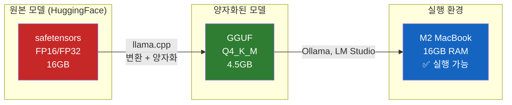
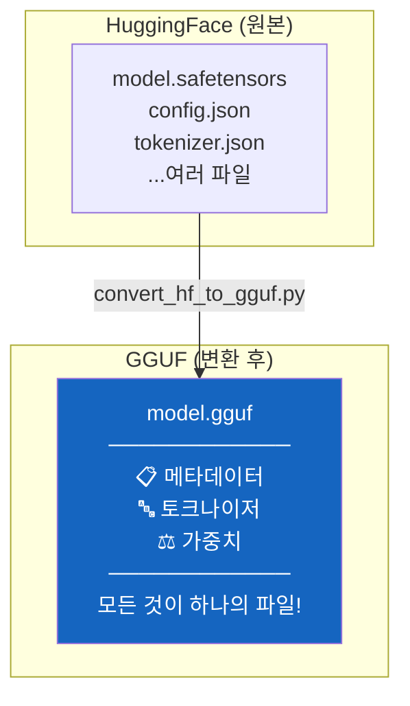
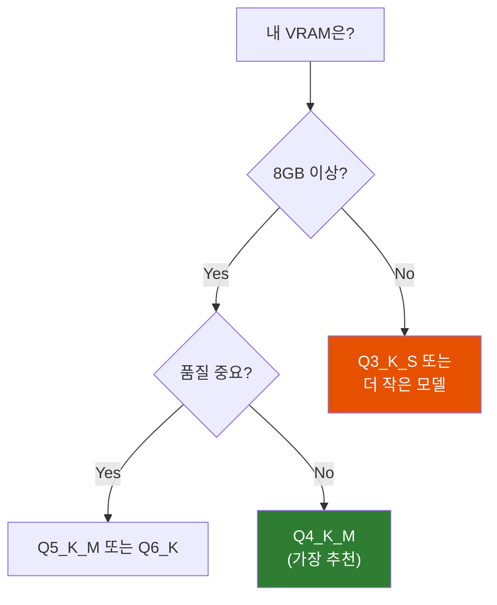

# GGUF와 양자화 - 서민도 로컬에서 LLM을 돌릴 수 있는 이유

"70억 파라미터 모델이 내 맥북에서 돌아간다고?"

## 결론부터 말하면

**양자화(Quantization)는 LLM의 가중치 정밀도를 낮춰 파일 크기와 메모리 사용량을 줄이는 기술이다.** GGUF는 이 양자화된 모델을 저장하고 실행하기 위한 파일 포맷이다.

| 구분 | FP16 (원본) | Q4_K_M (양자화) | 감소율 |
|------|-------------|-----------------|--------|
| 8B 모델 크기 | ~16GB | ~4.5GB | **72%** |
| 70B 모델 크기 | ~140GB | ~42GB | **70%** |



핵심은 간단하다: **비싼 GPU 없이도 LLM을 돌릴 수 있게 해주는 "압축 기술"** 이다.

## 1. 왜 양자화가 필요한가?

### 1.1 LLM의 메모리 문제

LLM은 **거대하다.** 정말로.

모델의 "파라미터"는 신경망의 가중치(weight)다. 7B 모델이면 70억 개의 숫자가 저장되어 있다. 각 숫자는 보통 FP16(16비트) 형식으로 저장되므로:

$$
\text{메모리} = \text{파라미터 수} \times \frac{\text{비트 수}}{8} = 7B \times 2 \text{bytes} = 14\text{GB}
$$

**14GB.** 모델 가중치만 올리는데 14GB가 필요하다. 여기에 KV 캐시, 활성화 값까지 더하면 실제 필요 메모리는 더 늘어난다.

| 모델 | 파라미터 | FP16 VRAM | 일반 GPU로 가능? |
|------|----------|-----------|------------------|
| Llama 3.2 3B | 30억 | ~6GB | ✅ |
| Llama 3.1 8B | 80억 | ~16GB | ⚠️ RTX 4090 필요 |
| Llama 3.1 70B | 700억 | ~140GB | ❌ A100 2장 필요 |
| GPT-3 175B | 1750억 | ~350GB | ❌ 클라우드만 |

### 1.2 서민의 현실

그런데 대부분의 개발자는 이런 상황이다:

- 맥북 프로 M2: 16GB 통합 메모리
- 게이밍 PC: RTX 3060 12GB
- 사무용 PC: 내장 그래픽...

**70B 모델을 돌리려면 최소 140GB VRAM이 필요한데, 내 GPU는 12GB다.**

이 간극을 메우기 위해 양자화가 등장했다.

## 2. 양자화란 무엇인가?

### 2.1 핵심 아이디어

양자화는 **정밀도를 희생해서 크기를 줄이는 것** 이다.

고해상도 이미지를 JPEG로 압축하면 약간의 화질 손실이 있지만 파일 크기가 크게 줄어드는 것과 같다. LLM의 가중치도 마찬가지다.

```
원본 가중치 (FP16):  0.123456789...  (16비트)
양자화 후 (INT4):    0.125           (4비트)
```

16비트에서 4비트로 줄이면 **메모리가 1/4로** 줄어든다.

### 2.2 왜 품질 손실이 적을까?

신기한 점은 이렇게 압축해도 **모델 성능이 크게 떨어지지 않는다는 것** 이다.

이유는 LLM의 가중치가 특별한 분포를 따르기 때문이다. 대부분의 가중치는 0 근처에 몰려 있고, 극단적으로 큰 값은 드물다. 양자화 알고리즘은 이 특성을 이용해 자주 등장하는 값 범위에 더 많은 비트를 할당한다.

| 양자화 레벨 | 비트 | 품질 손실 | 용도 |
|-------------|------|-----------|------|
| Q8_0 | 8비트 | 거의 없음 | 품질 최우선 |
| Q6_K | 6비트 | 미미함 | 품질 중시 |
| Q5_K_M | 5비트 | 약간 | 균형 |
| **Q4_K_M** | 4비트 | 수용 가능 | **가장 인기** |
| Q3_K_M | 3비트 | 눈에 띔 | VRAM 제한 |
| Q2_K | 2비트 | 심각함 | 극한 상황 |

**Q4_K_M이 "골드 스탠다드"로 불리는 이유:** 메모리를 75% 줄이면서도 출력 품질이 원본의 97% 이상을 유지한다.

### 2.3 품질 손실을 객관적으로 측정하는 방법: PPL

"97% 품질 유지"라는 말의 근거는 뭘까? 양자화 품질을 객관적으로 측정하는 지표가 **PPL(Perplexity)** 이다.

PPL은 모델이 다음 토큰을 얼마나 잘 예측하는지를 나타내는 수치다. **낮을수록 좋다.** 양자화를 하면 PPL이 올라가는데, 이 증가폭이 작을수록 품질 손실이 적다는 의미다.

llama.cpp의 `llama-quantize` 도구에서 제공하는 7B 모델 기준 벤치마크:

| 양자화 | 크기 | PPL 증가 | 해석 |
|--------|------|----------|------|
| Q8_0 | 8.0G | +0.0004 | 거의 무손실 |
| Q6_K | 6.6G | +0.0008 | 미미한 손실 |
| Q5_K_M | 5.5G | +0.0122 | 약간의 손실 |
| Q4_K_M | 4.5G | +0.0532 | 수용 가능한 손실 |
| Q3_K_M | 3.4G | +0.2437 | 눈에 띄는 손실 |
| Q2_K | 2.7G | +0.8698 | 심각한 손실 |

> **실무 팁:** HuggingFace에서 GGUF 모델을 받을 때 README에 PPL 벤치마크가 포함된 경우가 많다. 용도에 따라 허용 가능한 PPL 증가폭을 기준으로 양자화 레벨을 선택하면 된다.

### 2.4 GGUF 네이밍 컨벤션 해석

HuggingFace에서 GGUF 모델을 받으면 이런 파일명을 볼 수 있다:

```
llama-3.1-8b-instruct-Q4_K_M.gguf
                       ↑ ↑ ↑
                       │ │ └─ 크기: S(Small), M(Medium), L(Large)
                       │ └─── 방법: K(K-quant 혼합 정밀도)
                       └───── 비트: 4비트 양자화
```

| 접미사 | 의미 |
|--------|------|
| Q4_0, Q4_1 | 레거시 4비트 (구버전) |
| Q4_K_S | 4비트, K-quant, Small |
| Q4_K_M | 4비트, K-quant, Medium ⭐ |
| Q5_K_M | 5비트, K-quant, Medium |
| Q8_0 | 8비트, 레거시 포맷 |

**K-quant란?** 레이어나 텐서마다 다른 정밀도를 적용하는 혼합 정밀도 양자화다. 중요한 레이어는 높은 정밀도로, 덜 중요한 레이어는 낮은 정밀도로 저장해서 전체적인 품질 손실을 최소화한다.

### 2.5 Imatrix: 더 똑똑한 양자화

Q4 이하로 내려가면 품질 손실이 눈에 띄기 시작한다. 이를 보완하기 위해 등장한 것이 **Imatrix(Importance Matrix)** 양자화다.

기존 양자화는 모든 가중치를 동등하게 취급한다. 하지만 실제로는 **어떤 가중치는 출력에 더 큰 영향을 미친다.** Imatrix는 calibration 데이터를 활용해 각 가중치의 중요도를 계산하고, 중요한 가중치에 더 높은 정밀도를 할당한다.

HuggingFace에서 GGUF 파일을 찾을 때 이런 이름을 볼 수 있다:

```
model-Q4_K_M.gguf           ← 일반 양자화
model-Q4_K_M-imatrix.gguf   ← Imatrix 적용
```

> **실무 팁:** 같은 Q4_K_M이라도 `imatrix` 또는 `i-quant`가 붙은 모델이 동일 용량에서 더 낮은 PPL(더 높은 품질)을 보인다. 특히 Q3 이하의 공격적인 양자화에서는 Imatrix가 거의 필수다.

## 3. GGUF는 무엇인가?

### 3.1 GGUF의 정체

**GGUF(GPT-Generated Unified Format)** 는 llama.cpp 프로젝트에서 만든 파일 포맷이다. Georgi Gerganov가 개발했다.

여기서 중요한 점: **GGUF 자체는 양자화 방법이 아니다.** 양자화된 모델을 저장하는 **컨테이너 포맷** 이다.



### 3.2 왜 GGUF가 필요했나?

이전에는 GGML이라는 포맷이 있었다. 하지만 GGML에는 문제가 있었다:

| 문제 | GGML (구) | GGUF (신) |
|------|-----------|-----------|
| 파일 구성 | 여러 파일 필요 | **단일 파일** |
| 메타데이터 | 제한적 | **확장 가능한 key-value** |
| 호환성 | 버전마다 깨짐 | **하위 호환성 보장** |
| 로딩 속도 | 느림 | **빠름** |

**핵심 개선점:** GGUF는 모델 가중치, 토크나이저, 설정 정보를 **하나의 파일에** 담는다. 파일 하나만 다운로드하면 바로 실행할 수 있다.

### 3.3 GGUF의 장점

1. **CPU 친화적**: GPU 없이 CPU만으로도 추론 가능
2. **메모리 매핑**: 파일을 메모리에 직접 매핑해서 빠른 로딩
3. **부분 오프로딩**: GPU VRAM이 부족하면 일부만 GPU에 올리고 나머지는 CPU에서 처리
4. **크로스 플랫폼**: Windows, macOS, Linux 모두 지원

## 4. 실제 사용 예시

### 4.1 HuggingFace에서 모델 찾기

HuggingFace에서 같은 모델이 두 가지 형태로 존재한다:

```
openai/gpt-oss-20b           ← 원본 (safetensors)
lmstudio-community/gpt-oss-20b-GGUF  ← GGUF 변환본
```

| 구분 | 원본 | GGUF |
|------|------|------|
| 제공자 | OpenAI (원본) | LM Studio 커뮤니티 (변환) |
| 파일 포맷 | safetensors/PyTorch | GGUF |
| 용도 | GPU 추론, 학습, 파인튜닝 | 로컬 추론 최적화 |
| 양자화 | FP16 (기본) | Q4_K_M, Q5_K_M 등 선택 가능 |

### 4.2 VRAM 계산하기

내 하드웨어에서 어떤 모델을 돌릴 수 있을까? 간단한 공식이 있다:

$$
M = P \times \frac{Q}{8} \times 1.2
$$

- $M$: 필요 VRAM (GB)
- $P$: 파라미터 수 (Billion)
- $Q$: 양자화 비트 수
- $1.2$: 오버헤드 (KV 캐시 등) 20%

**예시: Llama 3.1 70B를 Q4로 양자화하면?**

$$
M = 70 \times \frac{4}{8} \times 1.2 = 70 \times 0.5 \times 1.2 = 42\text{GB}
$$

| 내 하드웨어 | 가능한 모델 (Llama 3 기준) |
|-------------|----------------------------|
| 8GB (M1 Mac) | 3B Q8, 8B Q4_K_M |
| 16GB (M2 Pro) | 8B Q8, 8B Q5_K_M |
| 24GB (RTX 4090) | 8B Q8 + 여유, 70B Q4_K_M (일부 오프로드) |
| 48GB (M2 Ultra) | 70B Q4_K_M |

### 4.3 Ollama로 실행하기

```bash
# Q4 양자화된 llama3.1 8B 실행
ollama run llama3.1:8b

# 특정 양자화 버전 지정
ollama run llama3.1:8b-q4_K_M
```

### 4.4 직접 양자화하기

llama.cpp를 사용해서 직접 양자화할 수도 있다:

```bash
# 1. llama.cpp 빌드
git clone https://github.com/ggerganov/llama.cpp
cd llama.cpp && make

# 2. HuggingFace 모델을 GGUF로 변환 (FP16)
python convert_hf_to_gguf.py ./my-model --outfile model-f16.gguf

# 3. 양자화 적용
./llama-quantize model-f16.gguf model-q4_k_m.gguf Q4_K_M
```

## 5. 양자화 선택 가이드

### 5.1 의사결정 플로우



### 5.2 실용적 권장사항

| 상황 | 추천 양자화 | 이유 |
|------|-------------|------|
| VRAM 여유 있음 | Q5_K_M | 품질과 크기의 최적 균형 |
| 일반적인 사용 | **Q4_K_M** | 골드 스탠다드 |
| VRAM 부족 | Q3_K_M | 품질 손실 있지만 실행 가능 |
| 품질 최우선 | Q8_0 | 거의 원본 수준 |

> **경험칙:** 같은 VRAM에서 "큰 모델 + 높은 양자화"가 "작은 모델 + 낮은 양자화"보다 보통 더 좋은 결과를 낸다. 예를 들어 14B Q4가 7B Q8보다 나은 경우가 많다.

## 6. 정리

| 개념 | 설명 |
|------|------|
| **양자화** | 모델 가중치의 정밀도를 낮춰 크기를 줄이는 기술 |
| **GGUF** | 양자화된 모델을 저장하는 파일 포맷 (llama.cpp용) |
| **Q4_K_M** | 가장 인기 있는 양자화 레벨 (75% 크기 감소, 97%+ 품질 유지) |
| **llama.cpp** | CPU에서 LLM을 실행하기 위한 C++ 라이브러리 |

**"양자화가 서민이 로컬에서 모델을 돌리게 하려고 만든 거야?"**

정확하다. 원래 70B 모델을 돌리려면 수천만 원짜리 GPU가 필요했다. 양자화 덕분에 이제 맥북이나 게이밍 PC에서도 돌릴 수 있다. 오픈소스 커뮤니티의 노력으로 AI 민주화가 가능해진 것이다.

---

## 출처

- [llama.cpp GitHub](https://github.com/ggerganov/llama.cpp) - GGUF 공식 구현
- [GGUF Loader - What is GGUF?](https://ggufloader.github.io/what-is-gguf.html) - GGUF 포맷 설명
- [Ready Tensor - LLAMA.CPP Guide for Creating GGUFs](https://app.readytensor.ai/publications/llamacpp-guide-for-creating-ggufs-hcDn2L4uNtfz) - 실습 가이드
- [LocalLLM.in - Quantization Explained](https://localllm.in/blog/quantization-explained) - 양자화 네이밍 컨벤션
- [Medium - Quantize Llama models with GGUF and llama.cpp](https://medium.com/data-science/quantize-llama-models-with-ggml-and-llama-cpp-3612dfbcc172) - Maxime Labonne
- [HuggingFace - Optimizing LLMs for Speed and Memory](https://huggingface.co/docs/transformers/en/llm_tutorial_optimization) - 공식 문서
