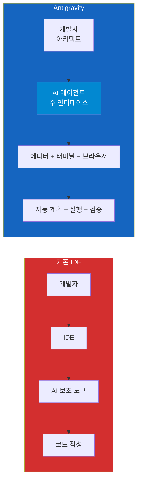
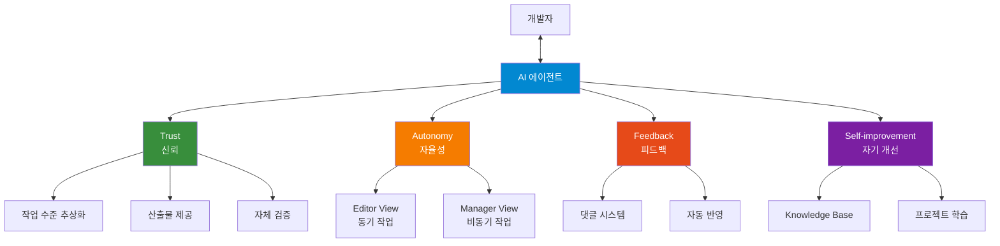
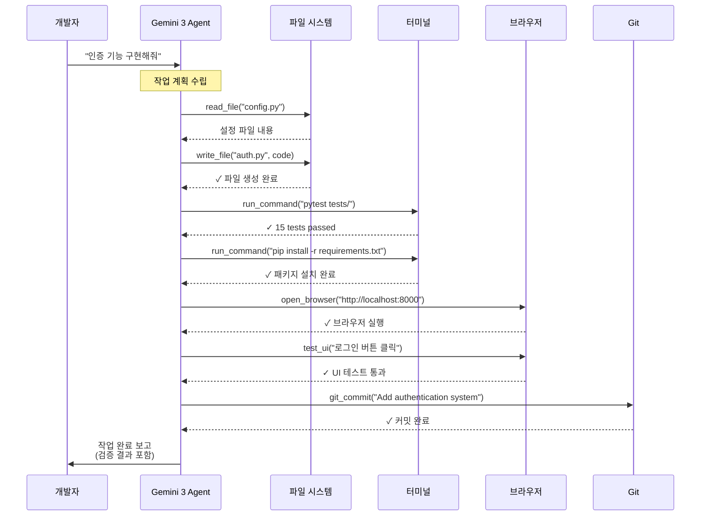
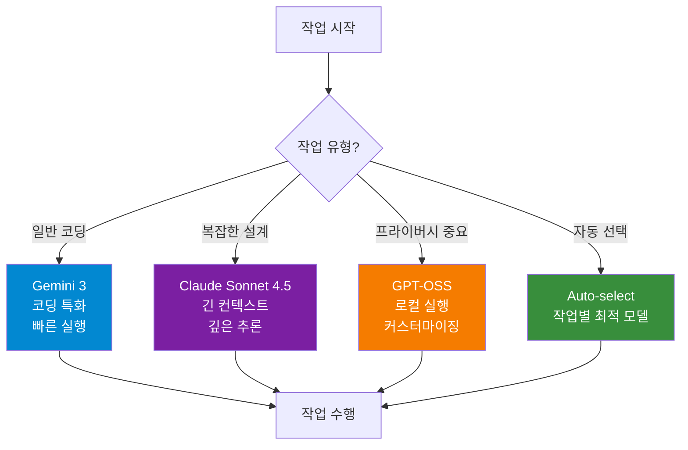

# Google Antigravity: 에이전트 우선 개발 환경

Google이 2025년 Gemini 3와 함께 발표한 차세대 AI 개발 플랫폼

## 결론부터 말하면

Google Antigravity는 **AI 에이전트를 중심으로 개발 환경 전체를 재설계**한 플랫폼입니다.



**핵심 변화**:
- **개발자 역할**: 코더 → 아키텍트
- **AI 역할**: 보조 도구 → 능동적 파트너
- **작업 방식**: 동기 → 비동기

**무료 Public Preview** | MacOS, Windows, Linux 지원

## 1. 왜 Antigravity를 만들었나?

### 1.1 배경

Gemini 3 같은 고성능 모델이 등장하면서, AI는 더 이상 단순한 코드 완성 도구가 아닙니다. 이제 AI는 에디터, 터미널, 브라우저를 넘나들며 **장시간 자율적으로 작업**할 수 있습니다.

기존 IDE는 이런 능력을 제대로 활용하지 못했습니다. 그래서 Google은 **에이전트 우선(Agent-First)** 철학으로 개발 환경을 처음부터 다시 설계했습니다.

### 1.2 비전

> "아이디어만 있다면 누구나 그것을 현실로 만들 수 있게 한다"

개발자가 코드를 한 줄 한 줄 작성하는 대신, **무엇을 만들지 설명**하면 AI가 **계획하고, 실행하고, 검증**까지 수행합니다.

## 2. 4가지 핵심 원칙

Antigravity는 **Trust, Autonomy, Feedback, Self-improvement** 네 가지 원칙을 중심으로 설계되었습니다.



### 2.1 Trust (신뢰)

**문제점**: 기존 AI 도구는 극단적입니다.
- 모든 도구 호출을 다 보여주거나 (너무 복잡)
- 최종 코드만 보여주거나 (검증 불가)

**Antigravity의 해결책**: **작업 수준(Task-level) 추상화**

```
AI 에이전트가 제공하는 것:
┌─────────────────────────────────┐
│ 1. 작업 목록 (Task List)         │
│    - 무엇을 할 것인지 계획       │
├─────────────────────────────────┤
│ 2. 구현 계획 (Implementation)    │
│    - 어떻게 할 것인지 전략       │
├─────────────────────────────────┤
│ 3. Artifacts (산출물)            │
│    - 스크린샷                   │
│    - 브라우저 녹화               │
│    - 실행 결과                  │
├─────────────────────────────────┤
│ 4. 검증 결과 (Verification)      │
│    - 테스트 통과 여부            │
│    - 코드 품질 검사              │
└─────────────────────────────────┘
```

개발자는 세부 도구 호출이 아닌 **의미 있는 작업 단위**로 진행 상황을 확인합니다.

### 2.2 Autonomy (자율성)

**2가지 작업 방식** 제공:

#### Editor View (에디터 뷰)
- 전통적인 IDE와 유사
- 탭 자동완성, 인라인 명령어
- 동기적 작업에 최적화

```
┌─────────────────────────────┐
│    Editor (코드 편집기)      │
├─────────────────────────────┤
│  - Tab completions          │
│  - Inline commands          │
│  - Side panel Agent         │
└─────────────────────────────┘

사용 시나리오:
- 코드 직접 수정
- 빠른 프로토타이핑
- 즉각적인 피드백 필요 시
```

#### Manager View (매니저 뷰)
- **에이전트가 주 인터페이스**
- 에디터, 터미널, 브라우저를 AI가 제어
- 비동기 작업에 최적화

```
┌─────────────────────────────┐
│   AI Agent Manager          │
│   (Mission Control)         │
├─────────────────────────────┤
│  ┌─────┬─────┬──────────┐  │
│  │Edit │Term │ Browser  │  │
│  └─────┴─────┴──────────┘  │
│                             │
│  - 여러 에이전트 동시 실행   │
│  - 백그라운드 작업          │
│  - 진행 상황 알림           │
└─────────────────────────────┘

사용 시나리오:
- 복잡한 기능 구현
- 리서치 + 개발 동시 진행
- 여러 워크스페이스 관리
```

**예시**: 백그라운드에서 AI가 리서치를 수행하는 동안, 개발자는 다른 작업에 집중할 수 있습니다.

### 2.3 Feedback (피드백)

AI가 완벽하지 않더라도 **80%만 해결하면 유용**합니다. 단, 나머지 20%를 쉽게 수정할 수 있어야 합니다.

**Antigravity의 피드백 시스템**:

```
1. 텍스트 Artifact:
   - Google Docs 스타일 댓글
   - "이 부분은 Repository Pattern으로 변경"

2. 시각적 Artifact:
   - 스크린샷에 직접 표시
   - "여기 버튼 색상 파란색으로"

3. 자동 반영:
   - 에이전트 작업 중단 불필요
   - 피드백이 자동으로 통합됨
```

개발자가 작업 흐름을 멈추지 않고도 AI의 방향을 조정할 수 있습니다.

### 2.4 Self-improvement (자기 개선)

**프로젝트별 학습**:

```
Antigravity의 Knowledge Base:

┌───────────────────────────────┐
│ 프로젝트: my-app              │
├───────────────────────────────┤
│ 학습 내용:                    │
│                               │
│ 1. 코딩 스타일                │
│    - 함수명: snake_case       │
│    - Docstring 형식           │
│                               │
│ 2. 아키텍처 패턴              │
│    - Repository Pattern 사용  │
│    - 모든 API에 rate limit    │
│                               │
│ 3. 과거 이슈                  │
│    - 2025-01-15: N+1 쿼리 발생│
│      → select_related 필수    │
└───────────────────────────────┘
```

작업할수록 AI가 프로젝트에 더 정확히 적응합니다.

## 3. Gemini 3 통합

### 3.1 Gemini 3 특징

Google의 공식 설명:
> "Gemini 2.5 Pro를 능가하는 코딩 능력, 에이전트 워크플로우와 복잡한 zero-shot 작업에 뛰어남"

**강화된 능력**:
- 강력한 추론 (Enhanced Reasoning)
- 함수 호출 (Function Calling) - 개발 환경 제어
- 장시간 자율 실행

### 3.2 개발 환경 제어 예시

Gemini 3는 **함수 호출(Function Calling)**을 통해 개발 환경을 직접 제어합니다:



모든 작업을 개발자 개입 없이 **자율적으로 계획하고 실행**합니다.

## 4. 지원 모델

**멀티 모델 전략**: 상황에 맞는 최적의 모델 선택



### 4.1 지원 모델

| 모델 | 특징 | 추천 용도 |
|------|------|----------|
| **Gemini 3** (기본) | 코딩 특화, 에이전트 워크플로우 네이티브 | 일반적인 개발 작업 |
| **Claude Sonnet 4.5** | 긴 컨텍스트, 복잡한 추론 | 아키텍처 설계, 리팩토링 |
| **GPT-OSS** (오픈소스) | 로컬 실행, 커스터마이징 | 프라이버시 중요 프로젝트 |

### 4.2 모델 선택 예시

```python
# 빠른 코딩 작업
config = {"model": "gemini-3"}

# 복잡한 아키텍처 설계
config = {"model": "claude-sonnet-4.5"}

# 로컬 실행 (프라이버시)
config = {"model": "gpt-oss", "mode": "local"}

# 자동 선택 (작업별 최적 모델)
config = {
    "models": {
        "coding": "gemini-3",
        "architecture": "claude-sonnet-4.5"
    },
    "mode": "auto-select"
}
```

## 5. 시작하기

### 5.1 현재 상태

```
✅ Public Preview (무료)
✅ MacOS, Linux, Windows 지원
✅ Gemini 3 Pro 무료 사용 (넉넉한 제한)
```

### 5.2 접근 방법

공식 사이트: [antigravity.google](https://antigravity.google)

**공식 문서 및 자료**:
- [Antigravity 소개 블로그](https://antigravity.google/blog/introducing-google-antigravity)
- [Gemini 3 발표](https://blog.google/products/gemini/gemini-3/)
- [개발자 가이드](https://blog.google/technology/developers/gemini-3-developers/)

## 6. 주요 특징 요약

| 특징 | 설명 |
|------|------|
| **Agent-First** | AI가 보조가 아닌 주 인터페이스 |
| **비동기 작업** | 여러 에이전트가 동시에 작업 |
| **자체 검증** | AI가 코드 테스트/검증까지 수행 |
| **학습 능력** | 프로젝트 학습으로 점점 정확해짐 |
| **멀티 모델** | Gemini 3, Claude, GPT-OSS 선택 |
| **2가지 모드** | Editor (동기) + Manager (비동기) |

## 7. 기존 도구와의 차이

```
GitHub Copilot:
- 코드 완성 중심
- 라인/블록 단위 제안

Cursor:
- AI-first IDE
- 채팅 + 인라인 편집

Claude Code:
- 에이전트
- 터미널/파일 접근

Google Antigravity:
- 에이전트 우선 (Agent-First)
- 비동기 + 자체 검증
- 브라우저 제어까지 포함
```

**핵심 차별점**:
1. 비동기 워크플로우 (병렬 작업)
2. 브라우저 통합 (UI 테스트 자동화)
3. 프로젝트 학습 (점점 똑똑해짐)

---

**발표일**: 2025년
**현재 상태**: Public Preview (무료)
**지원 플랫폼**: MacOS, Windows, Linux

## 출처

- [Introducing Google Antigravity](https://antigravity.google/blog/introducing-google-antigravity) - Google Antigravity 공식 블로그 (2025년)
- [Gemini 3 발표](https://blog.google/products/gemini/gemini-3/) - Google 공식 블로그
- [Gemini 3 for developers](https://blog.google/technology/developers/gemini-3-developers/) - Google 개발자 블로그
