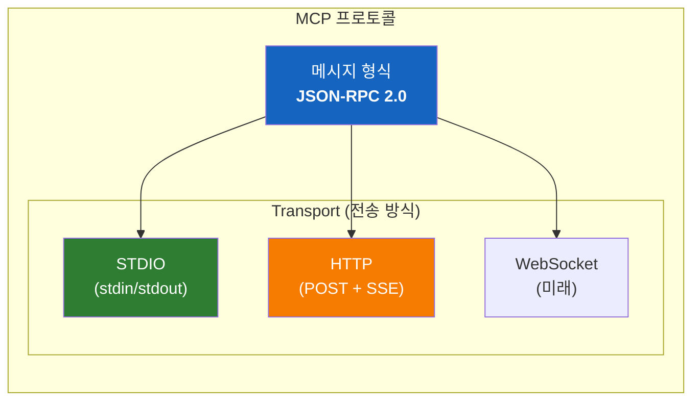
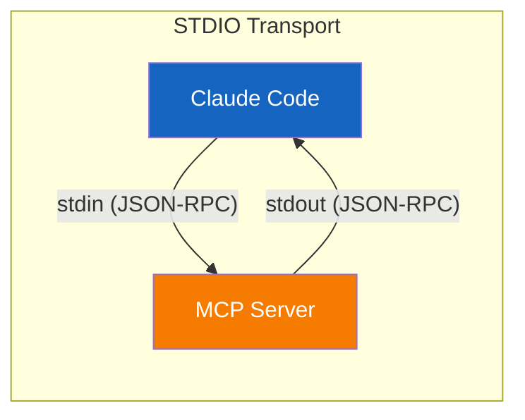
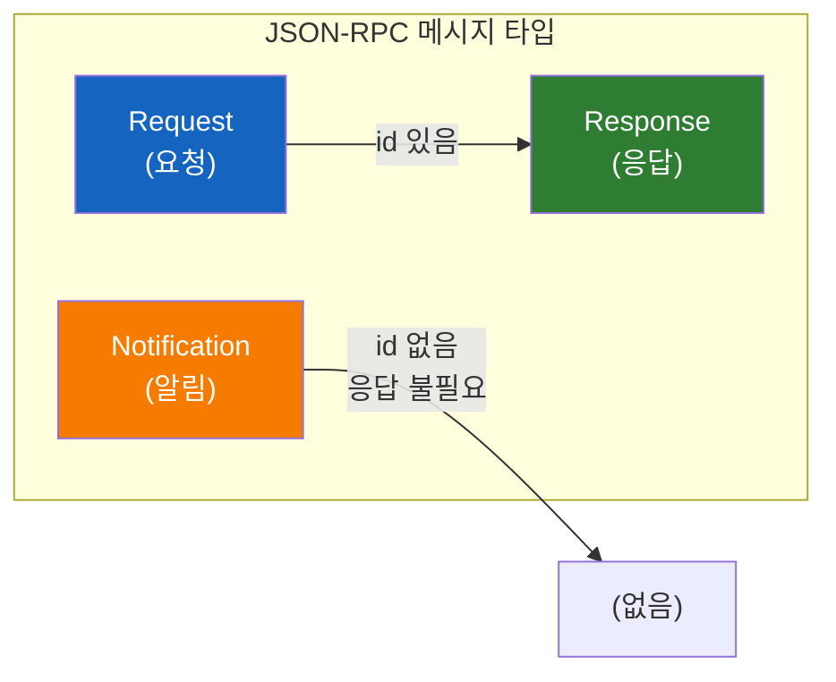
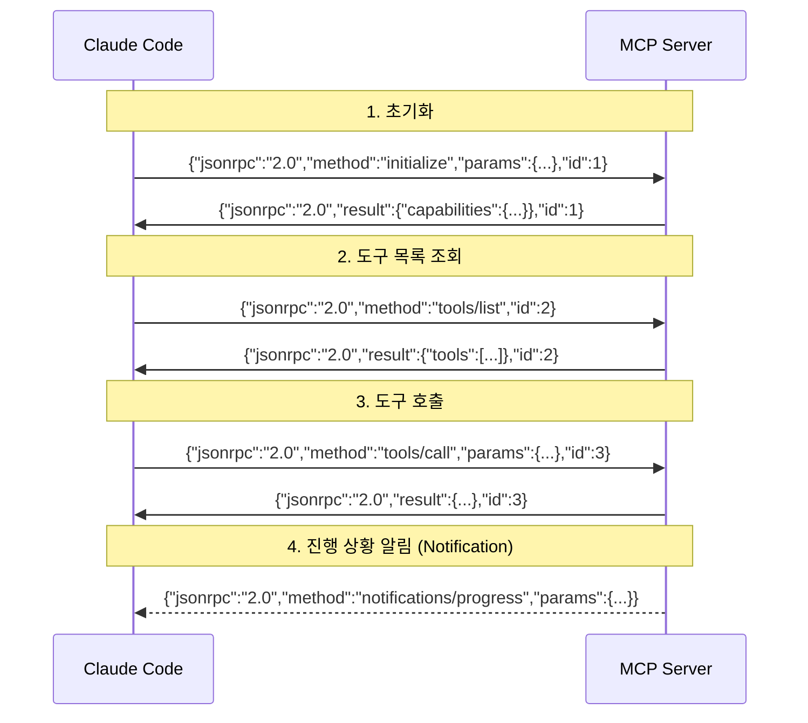
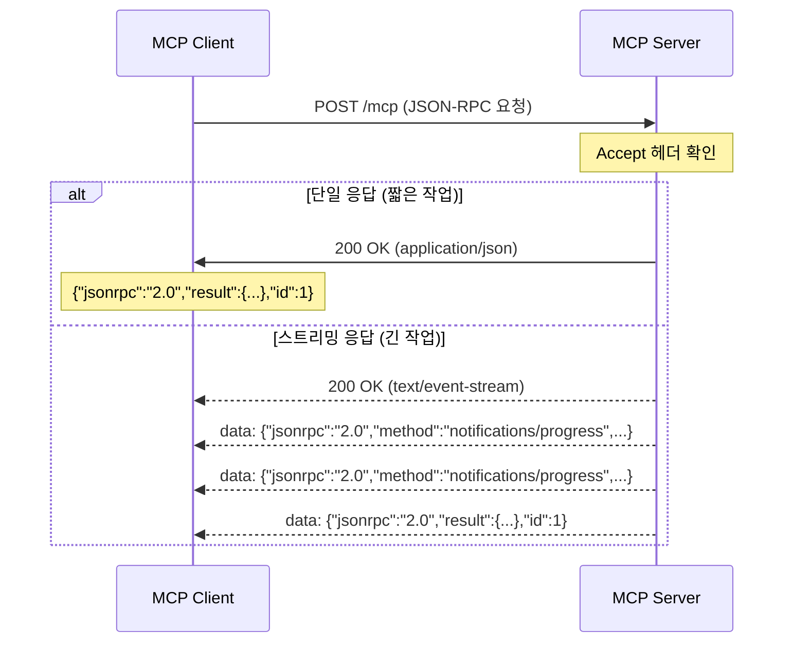

# JSON-RPC와 MCP의 관계

"MCP는 HTTP 프로토콜이고 POST로 통신하는데 본문이 JSON-RPC다" - 이 이해는 **반만 맞다**. 정확히 정리해보자.

## 결론부터 말하면

**MCP는 HTTP가 아니다. MCP는 자체 프로토콜이며, JSON-RPC 2.0을 메시지 형식으로 사용한다. HTTP는 여러 Transport 중 하나일 뿐이다.**



| 계층 | 역할 | MCP에서 |
|------|------|---------|
| **메시지 형식** | "무엇"을 보내는가 | **JSON-RPC 2.0** |
| **Transport** | "어떻게" 보내는가 | STDIO, HTTP, WebSocket |

**핵심:**
- JSON-RPC = 메시지의 **포맷** (봉투 양식)
- Transport = 메시지를 **전달하는 방법** (우편, 택배, 직접 전달)
- MCP = 이 둘을 조합한 **프로토콜**

---

## 1. 왜 이런 오해가 생기는가?

### 1.1 HTTP로 통신할 때만 보면

MCP 서버를 HTTP로 실행하면 이렇게 보인다:

```bash
# HTTP Transport로 MCP 서버 실행
python server.py --transport http --port 8080
```

클라이언트는 이렇게 요청한다:

```bash
curl -X POST http://localhost:8080 \
  -H "Content-Type: application/json" \
  -d '{"jsonrpc": "2.0", "method": "tools/list", "id": 1}'
```

이것만 보면 "아, MCP는 HTTP POST에 JSON-RPC 본문을 보내는 거구나"라고 생각하기 쉽다.

### 1.2 하지만 STDIO Transport도 있다

실제로 Claude Desktop이나 Claude Code는 **STDIO Transport**를 기본으로 사용한다:



HTTP 없이, 프로세스 간 파이프로 같은 JSON-RPC 메시지를 주고받는다. **HTTP는 선택 사항일 뿐이다.**

---

## 2. JSON-RPC 2.0이란?

### 2.1 핵심 개념

**JSON-RPC = JSON으로 원격 함수를 호출하는 규약**

- **JSON**: 데이터 형식
- **RPC**: Remote Procedure Call (원격 함수 호출)

```python
# 로컬 함수 호출
result = get_weather("Seoul")

# JSON-RPC로 원격 함수 호출
request = {
    "jsonrpc": "2.0",
    "method": "get_weather",
    "params": {"city": "Seoul"},
    "id": 1
}
# 이 JSON을 서버에 보내면, 서버가 get_weather("Seoul")을 실행하고 결과를 돌려줌
```

### 2.2 메시지 종류

JSON-RPC 2.0은 세 가지 메시지 타입을 정의한다:



| 타입 | id 필드 | 응답 | 용도 |
|------|---------|------|------|
| **Request** | ✅ 있음 | ✅ 필요 | 함수 호출 후 결과 받기 |
| **Notification** | ❌ 없음 | ❌ 불필요 | 일방적 알림 (Fire & Forget) |
| **Response** | ✅ 있음 | - | Request에 대한 응답 |

### 2.3 메시지 구조

#### Request (요청)

```json
{
    "jsonrpc": "2.0",          // 필수: 버전 (항상 "2.0")
    "method": "tools/call",    // 필수: 호출할 메서드
    "params": {                // 선택: 파라미터
        "name": "get_weather",
        "arguments": {"city": "Seoul"}
    },
    "id": 1                    // 필수: 요청 식별자
}
```

#### Response - 성공

```json
{
    "jsonrpc": "2.0",
    "result": {                // 성공 시: result 포함
        "temperature": 15,
        "condition": "맑음"
    },
    "id": 1                    // 요청의 id와 동일해야 함
}
```

#### Response - 에러

```json
{
    "jsonrpc": "2.0",
    "error": {                 // 실패 시: error 포함
        "code": -32600,        // 에러 코드
        "message": "Invalid Request",
        "data": "추가 정보"     // 선택
    },
    "id": 1
}
```

**규칙:** `result`와 `error`는 **동시에 존재할 수 없다**. 둘 중 하나만 있어야 한다.

#### Notification (알림)

```json
{
    "jsonrpc": "2.0",
    "method": "notifications/progress",
    "params": {
        "progress": 50,
        "total": 100
    }
    // id가 없음! → 응답을 기대하지 않음
}
```

### 2.4 표준 에러 코드

| 코드 | 의미 | 설명 |
|------|------|------|
| -32700 | Parse error | JSON 파싱 실패 |
| -32600 | Invalid Request | 유효하지 않은 요청 |
| -32601 | Method not found | 메서드 없음 |
| -32602 | Invalid params | 잘못된 파라미터 |
| -32603 | Internal error | 내부 에러 |

---

## 3. MCP에서 JSON-RPC 사용

### 3.1 실제 MCP 메시지 흐름

Claude Code가 MCP 서버에 도구를 호출하는 과정:



### 3.2 실제 메시지 예시

#### 도구 목록 조회

**Request:**
```json
{
    "jsonrpc": "2.0",
    "method": "tools/list",
    "id": 1
}
```

**Response:**
```json
{
    "jsonrpc": "2.0",
    "result": {
        "tools": [
            {
                "name": "get_weather",
                "description": "도시의 현재 날씨를 조회합니다",
                "inputSchema": {
                    "type": "object",
                    "properties": {
                        "city": {"type": "string"}
                    },
                    "required": ["city"]
                }
            }
        ]
    },
    "id": 1
}
```

#### 도구 호출

**Request:**
```json
{
    "jsonrpc": "2.0",
    "method": "tools/call",
    "params": {
        "name": "get_weather",
        "arguments": {
            "city": "Seoul"
        }
    },
    "id": 2
}
```

**Response:**
```json
{
    "jsonrpc": "2.0",
    "result": {
        "content": [
            {
                "type": "text",
                "text": "서울의 현재 날씨: 15°C, 맑음"
            }
        ]
    },
    "id": 2
}
```

---

## 4. Transport별 JSON-RPC 전송 방식

**핵심:** JSON-RPC 메시지는 동일하고, Transport만 다르다.

### 4.1 STDIO Transport

```python
# 메시지 전송: stdin으로 쓰기
process.stdin.write(b'{"jsonrpc":"2.0","method":"tools/list","id":1}\n')
process.stdin.flush()

# 메시지 수신: stdout에서 읽기
response = process.stdout.readline()
# b'{"jsonrpc":"2.0","result":{"tools":[...]},"id":1}\n'
```

**특징:**
- 메시지는 **줄바꿈(\n)** 으로 구분
- 메시지 내부에 줄바꿈 포함 불가
- 로그는 **stderr** 로 출력 (stdout은 JSON-RPC 전용)

### 4.2 HTTP Transport (Streamable HTTP - 2025 스펙)

HTTP Transport는 일반적인 REST API와 다르게 **SSE(Server-Sent Events)** 와 결합되어 있다.

**왜 SSE가 필요한가?**

단순 HTTP 요청/응답 모델은 서버가 클라이언트에게 **비동기적으로 메시지를 보낼 수 없다**. 예를 들어 "파일 분석 중... 50% 완료"와 같은 진행 상황 알림을 보내려면 서버 → 클라이언트 방향 채널이 필요하다. SSE를 조합하면 **서버 푸시**가 가능해져 양방향 통신과 유사한 효과를 얻을 수 있다.

MCP HTTP Transport는 **Streamable HTTP** 방식을 사용한다:

```bash
# 단일 POST 요청 + 스트리밍 응답
curl -X POST http://localhost:8080/mcp \
  -H "Content-Type: application/json" \
  -H "Accept: application/json, text/event-stream" \
  -d '{"jsonrpc":"2.0","method":"tools/call","params":{...},"id":1}'
```

**통신 흐름:**



**응답 방식은 서버가 결정:**
- `application/json`: 단일 응답 (빠른 작업)
- `text/event-stream` (SSE): 스트리밍 응답 (진행 상황 알림 + 최종 결과)

**핵심:** 클라이언트는 `Accept` 헤더에 두 가지 타입을 모두 명시하고, 서버가 상황에 따라 적절한 응답 방식을 선택한다.

**REST API와의 차이:**

| 특성 | REST API | JSON-RPC over HTTP |
|------|----------|-------------------|
| 엔드포인트 | 리소스별 다름 (`/users`, `/orders`) | **단일 엔드포인트** (`/mcp`) |
| 행위 구분 | HTTP 메서드 (GET, POST, PUT, DELETE) | JSON 내부 `"method"` 필드 |
| URL 예시 | `GET /users/123` | `POST /mcp` + `{"method":"users/get"}` |

JSON-RPC는 단일 URL을 **RPC 터널**처럼 사용한다. 어떤 함수를 호출할지는 URL이 아닌 JSON 본문의 `method` 필드가 결정한다.

### 4.3 비교

| 특성 | STDIO | HTTP |
|------|-------|------|
| 메시지 형식 | **동일** (JSON-RPC 2.0) | **동일** (JSON-RPC 2.0) |
| 구분자 | 줄바꿈 (`\n`) | HTTP 프레임 |
| 연결 방식 | 부모가 자식 spawn | 클라이언트 → 서버 연결 |
| 네트워크 | 불필요 (로컬 파이프) | 필요 |
| 스트리밍 | stdout 연속 읽기 | SSE (Server-Sent Events) |

---

## 5. 왜 JSON-RPC를 선택했나?

### 5.1 대안들과 비교

| 프로토콜 | 장점 | 단점 |
|----------|------|------|
| **JSON-RPC** | 단순, 가볍다, 표준화됨 | 양방향 스트리밍 제한 |
| REST | 익숙함, 리소스 중심 | RPC에 부적합 |
| gRPC | 고성능, 스트리밍 | 복잡, 바이너리 |
| GraphQL | 유연한 쿼리 | 과한 복잡성 |

### 5.2 JSON-RPC가 적합한 이유

**1. 단순성**

```json
// 이게 전부다. 배우는 데 5분이면 충분
{"jsonrpc": "2.0", "method": "...", "params": {...}, "id": 1}
{"jsonrpc": "2.0", "result": {...}, "id": 1}
```

**2. LSP의 성공 사례**

MCP는 **LSP(Language Server Protocol)** 에서 영감을 받았다. LSP도 JSON-RPC 2.0을 사용하며, VS Code 등 수많은 에디터에서 성공적으로 동작한다.

```
LSP: 에디터 ↔ 언어 서버 (코드 분석, 자동완성)
MCP: AI 클라이언트 ↔ 도구 서버 (도구 호출, 데이터 접근)
```

**3. Transport 독립성**

JSON-RPC는 Transport를 규정하지 않는다. 덕분에 MCP는 STDIO, HTTP, WebSocket 등 상황에 맞는 Transport를 자유롭게 선택할 수 있다.

---

## 6. 자주 하는 오해 정리

### 오해 1: "MCP는 HTTP 프로토콜이다"

❌ **틀림.** MCP는 HTTP가 아닌 자체 프로토콜이다.

```
MCP ≠ HTTP
MCP = JSON-RPC 메시지 + Transport (STDIO 또는 HTTP 또는 ...)
```

### 오해 2: "JSON-RPC는 HTTP에서만 쓴다"

❌ **틀림.** JSON-RPC는 Transport에 독립적이다.

```
JSON-RPC over STDIO  ✅
JSON-RPC over HTTP   ✅
JSON-RPC over WebSocket ✅
JSON-RPC over TCP Socket ✅
```

### 오해 3: "MCP 서버는 항상 포트를 열어야 한다"

❌ **틀림.** STDIO Transport는 포트를 열지 않는다.

```bash
# STDIO: 포트 없음, 부모 프로세스가 직접 연결
python server.py

# HTTP: 포트 열림
python server.py --transport http --port 8080
```

---

## 정리

### MCP 통신 구조

```
┌─────────────────────────────────────────────┐
│              MCP 프로토콜                    │
├─────────────────────────────────────────────┤
│                                             │
│   메시지 형식: JSON-RPC 2.0                  │
│   ┌─────────────────────────────────────┐   │
│   │ {"jsonrpc":"2.0","method":"..."}    │   │
│   └─────────────────────────────────────┘   │
│                                             │
├─────────────────────────────────────────────┤
│   Transport (택1)                           │
│   ┌──────────┐  ┌──────────┐  ┌─────────┐  │
│   │  STDIO   │  │   HTTP   │  │   ...   │  │
│   │ (파이프)  │  │  (POST)  │  │         │  │
│   └──────────┘  └──────────┘  └─────────┘  │
└─────────────────────────────────────────────┘
```

### Transport vs Protocol 구분

| 개념 | 설명 |
|------|------|
| **MCP** | LLM과 외부 시스템 연결을 위한 **새로운 프로토콜** |
| **JSON-RPC** | MCP 메시지의 **형식/문법** |
| **Transport** | MCP 메시지를 **전달하는 방법** (STDIO, HTTP 등) |

그래서:
- **MCP ≠ HTTP** (HTTP는 전송 방법 중 하나일 뿐)
- **MCP ≠ JSON-RPC** (JSON-RPC는 메시지 형식일 뿐)
- **MCP = 새로운 프로토콜** (JSON-RPC 형식을 쓰고, STDIO/HTTP로 전송)

비유하면:
- **편지(MCP)** 를 보내는데
- **한국어(JSON-RPC)** 로 쓰고
- **택배/우편(Transport)** 으로 보낸다

### 핵심 요약

| 질문 | 답변 |
|------|------|
| MCP가 HTTP인가? | ❌ 아니다. MCP는 자체 프로토콜 |
| JSON-RPC의 역할은? | 메시지 **형식**(포맷)을 정의 |
| Transport의 역할은? | 메시지를 **전달하는 방법** |
| 왜 JSON-RPC인가? | 단순, 표준화, LSP에서 검증됨 |
| STDIO vs HTTP? | 로컬은 STDIO, 원격은 HTTP |

---

## 출처

- [JSON-RPC 2.0 Specification](https://www.jsonrpc.org/specification) - 공식 스펙
- [MCP Specification - Base Protocol](https://spec.modelcontextprotocol.io/specification/2025-03-26/basic/) - MCP 공식 스펙
- [MCP Specification - Transports](https://spec.modelcontextprotocol.io/specification/2025-03-26/basic/transports/) - Transport 스펙
- [Model Context Protocol Documentation](https://modelcontextprotocol.io/) - 공식 문서
