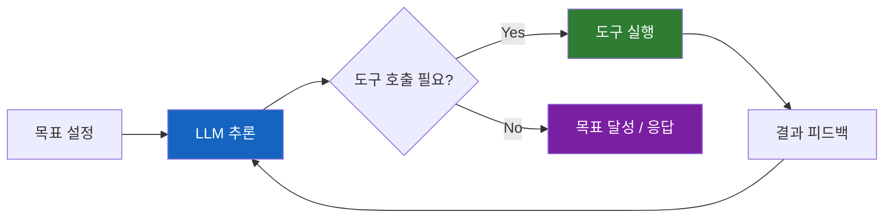
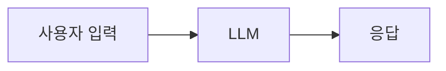

# LLM Agent란 무엇인가

"에이전트"라는 용어의 혼란을 정리하고, 기술 커뮤니티에서 합의된 정의를 살펴본다.

## 결론부터 말하면

**LLM Agent는 "도구를 루프로 실행하여 목표를 달성하는 시스템"이다.**

```
Agent = 도구(Tools) + 루프(Loop) + 목표(Goal)
```



이 정의가 중요한 이유는, "에이전트"라는 단어가 너무 남발되어 아무도 같은 의미로 쓰지 않았기 때문이다.

---

## 1. 왜 "에이전트"의 정의가 필요한가?

1994년, AI 연구자 Michael Wooldridge는 이렇게 썼다:

> "'에이전트란 무엇인가?'라는 질문은 AI 커뮤니티에서 '지능이란 무엇인가?'만큼 당혹스러운 것이다."

30년이 지난 지금도 상황은 크게 다르지 않았다. "에이전트"는 마케팅 용어로 남발되었고, 사람마다 다른 의미로 사용했다.

하지만 Simon Willison에 따르면, 2025년 현재 **기술 구현자들 사이에서는 합의된 정의가 생겼다**. Anthropic, LangChain, 그리고 많은 LLM 프레임워크들이 동일한 패러다임을 채택했기 때문이다.

---

## 2. 에이전트의 세 가지 구성요소

### 2.1 도구 (Tools)

LLM이 외부 세계와 상호작용할 수 있게 해주는 함수들이다.

```python
# 도구의 예시
tools = [
    search_web,        # 웹 검색
    read_file,         # 파일 읽기
    execute_code,      # 코드 실행
    send_email,        # 이메일 발송
]
```

도구가 없으면 LLM은 그저 텍스트를 생성할 뿐이다. 도구가 있어야 **행동**할 수 있다.

### 2.2 루프 (Loop)

단순히 도구를 한 번 호출하는 것은 에이전트가 아니다. **루프**가 핵심이다.

```python
while not goal_achieved:
    # 1. LLM이 현재 상황을 분석
    response = llm.think(context)

    # 2. 도구 호출이 필요하면 실행
    if response.needs_tool:
        result = execute_tool(response.tool_call)
        context.append(result)  # 결과를 다시 LLM에게 피드백

    # 3. 목표 달성 여부 판단
    if response.is_complete:
        goal_achieved = True
```

도구 실행 결과가 다시 LLM에게 전달되고, LLM은 그 결과를 바탕으로 다음 행동을 결정한다. 이 **피드백 루프**가 에이전트의 핵심이다.

### 2.3 목표 (Goal)

루프에는 반드시 **종료 조건**이 있어야 한다. 그렇지 않으면 무한 루프에 빠진다.

목표는 다양한 형태로 주어질 수 있다:
- 사용자가 직접 설정: "이 버그를 수정해줘"
- 다른 LLM이 설정: 멀티 에이전트 시스템에서 상위 에이전트가 하위 에이전트에게 태스크 위임
- 시스템이 설정: "사용자 질문에 답변할 때까지"

---

## 3. 에이전트가 아닌 것들

### 3.1 단순 챗봇



도구도 없고 루프도 없다. 그냥 입력-출력의 일회성 상호작용이다.

### 3.2 단일 도구 호출

```python
# 이건 에이전트가 아니다
result = llm.call_tool("search_web", query="Python tutorial")
return result
```

도구를 한 번 호출하고 끝난다. 루프가 없다.

### 3.3 브라우저 자동화

OpenAI의 ChatGPT "에이전트" 기능은 사실 **브라우저 자동화**에 가깝다. 웹 브라우저를 제어해서 클릭하고 타이핑하는 것이다. Simon Willison은 이것이 "에이전트"라는 용어의 오용이라고 비판한다.

---

## 4. 왜 이 정의가 유용한가?

### 4.1 구현 관점에서 명확하다

"도구 루프"는 코드로 직접 구현할 수 있는 구체적인 패턴이다.

```python
class Agent:
    def __init__(self, llm, tools):
        self.llm = llm
        self.tools = tools

    def run(self, goal: str) -> str:
        context = [{"role": "user", "content": goal}]

        while True:
            response = self.llm.generate(context, tools=self.tools)

            if response.tool_calls:
                for tool_call in response.tool_calls:
                    result = self.execute_tool(tool_call)
                    context.append({"role": "tool", "content": result})
            else:
                return response.content  # 목표 달성
```

### 4.2 메모리가 자연스럽게 포함된다

루프 구조 덕분에 **단기 메모리**가 자동으로 생긴다. 이전 도구 호출 결과들이 컨텍스트에 쌓이기 때문이다.

장기 메모리가 필요하다면? 그것도 도구로 구현하면 된다:

```python
tools = [
    save_to_memory,    # 장기 메모리에 저장
    recall_from_memory # 장기 메모리에서 불러오기
]
```

---

## 5. 에이전트가 직원을 대체할 수 있을까?

비즈니스 세계에서는 "에이전트"를 **인간 직원의 대체재**로 기대하는 경향이 있다. "고객 지원 에이전트", "마케팅 에이전트", "영업 에이전트"...

Simon Willison은 이런 기대에 **강하게 반대**한다. 핵심 이유는 **책임성(Accountability)** 문제다.

### 인간 직원 vs AI 에이전트

| 구분 | 인간 직원 | AI 에이전트 |
|------|-----------|-------------|
| 책임 | 행동에 책임을 진다 | 책임을 질 수 없다 |
| 학습 | 실수로부터 배운다 | 성과 개선 계획의 대상이 될 수 없다 |
| 해고 | 가능하다 | 의미가 없다 |
| 신뢰 | 점진적으로 쌓인다 | 본질적으로 불안정하다 |

1979년 IBM 교육 슬라이드에는 이런 문구가 있었다:

> "컴퓨터는 책임질 수 없으므로, 경영 결정을 내려서는 안 된다."

46년이 지난 지금도 이 원칙은 유효하다. AI가 아무리 똑똑해져도, **책임을 질 수 있는 존재**가 되지는 않는다.

---

## 6. 정의의 혼란이 생긴 이유

가장 큰 원인은 **OpenAI 자체의 혼란**이다. 같은 회사에서 세 가지 다른 의미로 "에이전트"를 사용한다:

| OpenAI 제품/발언 | "에이전트"의 의미 |
|------------------|-------------------|
| Sam Altman의 발표 | "독립적으로 작업 수행하는 AI 시스템" (모호함) |
| ChatGPT Agent | 브라우저 자동화 (도구 루프와 다름) |
| Agents SDK | 도구 루프 패턴 (기술적 정의에 가까움) |

업계 리더가 일관성 없이 용어를 사용하니, 혼란이 퍼질 수밖에 없었다.

---

## 7. 결론: 왜 정의가 중요한가

"에이전트"가 buzzword로만 남아있으면, 생산적인 논의가 불가능하다.

하지만 **"도구 루프"**라는 명확한 정의가 있으면:
- 구현자들이 같은 것을 이야기할 수 있다
- 기술적 논의가 가능해진다
- 마케팅 용어와 실제 기술을 구분할 수 있다

LangChain, Anthropic, 그리고 많은 LLM 프레임워크들이 이 정의를 채택했다. 이제 "에이전트"라는 단어는 더 이상 모호한 마케팅 용어가 아니라, **구체적인 아키텍처 패턴**을 의미한다.

```
에이전트 = 도구(Tools) + 루프(Loop) + 목표(Goal)
```

이것이 현재 기술 커뮤니티에서 합의된 정의다.

---

## 출처

- [What is an agent? - Simon Willison's Weblog](https://simonwillison.net/2025/Sep/18/agents/) - 본 문서의 주요 참고 자료
- [LangChain Agents Documentation](https://python.langchain.com/docs/concepts/agents/) - LangChain의 에이전트 정의
- [Anthropic Claude Documentation](https://docs.anthropic.com/en/docs/build-with-claude/tool-use) - Anthropic의 도구 사용 가이드
