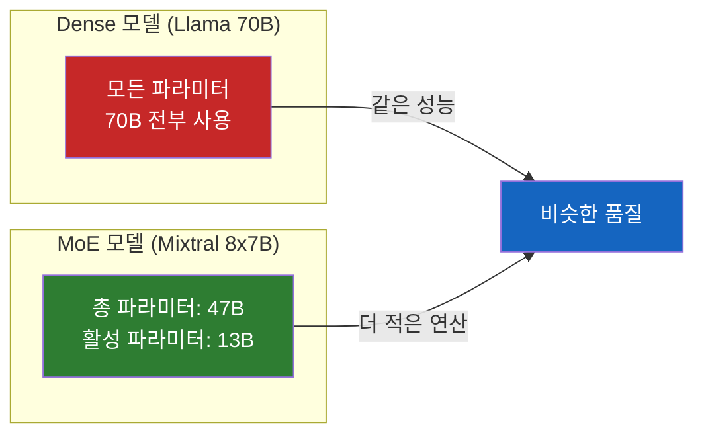
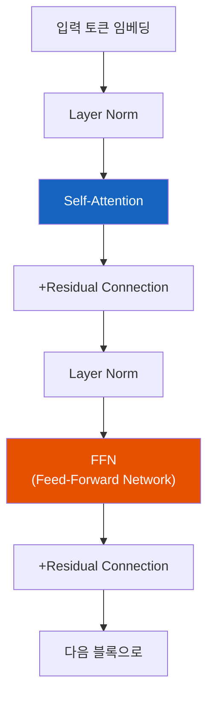
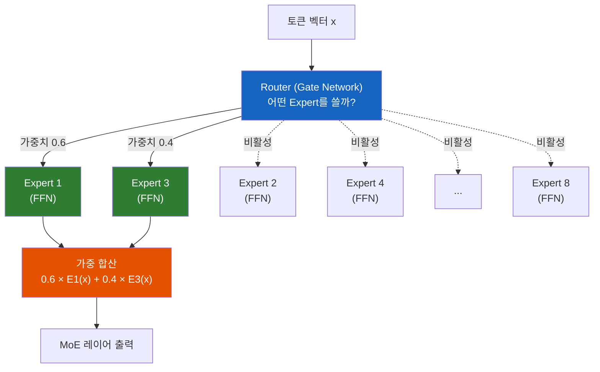
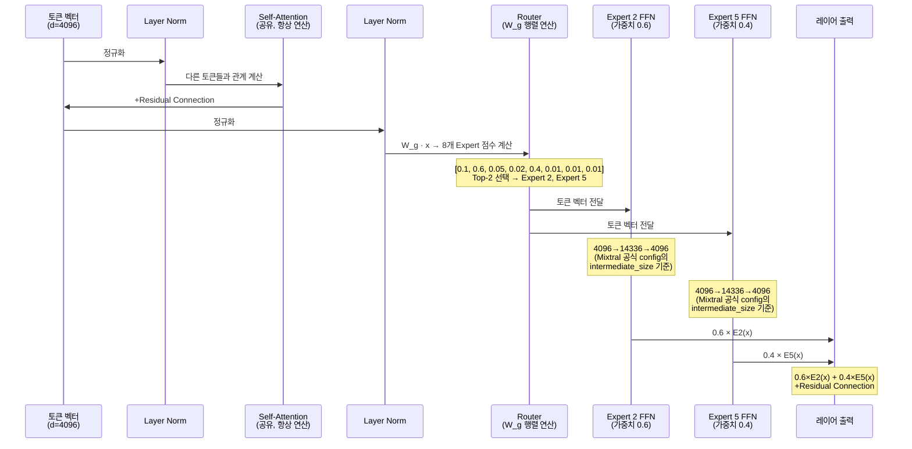
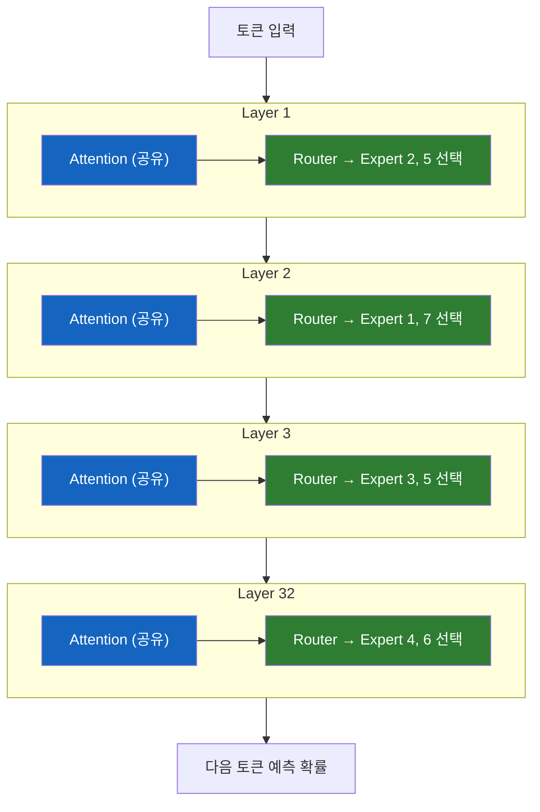
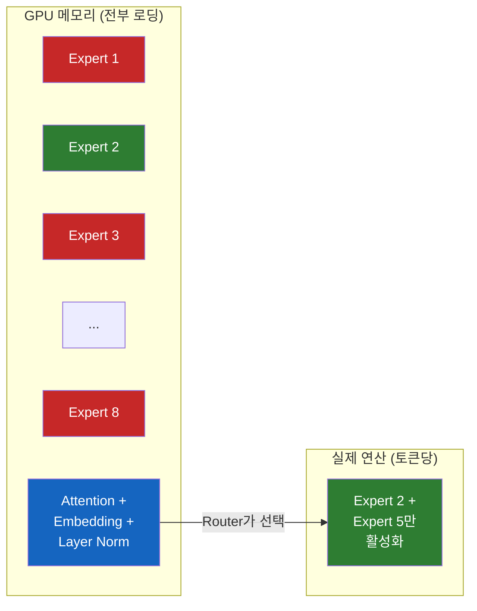
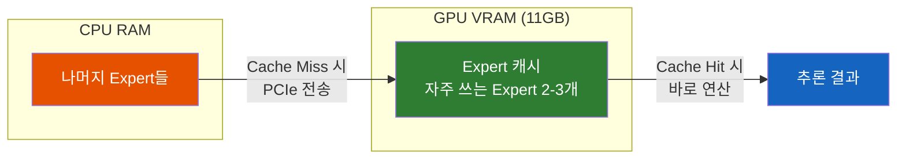

# LLM의 Mixture of Experts - 적은 연산으로 거대한 모델을 돌리는 비결

"671B 파라미터 모델인데, 추론할 때는 37B만 쓴다고?"

## 결론부터 말하면

**Mixture of Experts(MoE)는 Transformer의 FFN(Feed-Forward Network) 레이어를 여러 개의 "전문가(Expert)" 네트워크로 교체하고, 토큰마다 일부 Expert만 선택적으로 활성화하는 아키텍처다.** 파라미터 수는 많지만 실제 연산량은 적어서, 같은 성능을 더 적은 비용으로 달성할 수 있다.

| 구분 | Dense 모델 | MoE 모델 |
|------|-----------|----------|
| 추론 시 활성 파라미터 | **전부** | **일부만** (Top-K) |
| 연산 효율 | 낮음 | **높음** |
| 메모리 요구량 | 파라미터 비례 | **전체 파라미터를 메모리에 로딩해야 함** |
| 학습 속도 | 느림 | **빠름** (같은 성능 기준) |

하지만 메모리에 관해서는 반전이 있다. **MoE 모델은 추론 시 일부 Expert만 사용하지만, 모든 Expert의 가중치를 메모리에 올려두어야 한다.** 어떤 토큰이 어떤 Expert를 필요로 할지 미리 알 수 없기 때문이다.

## 1. 왜 MoE가 필요한가?

### 1.1 Dense 모델의 딜레마

LLM의 성능을 올리는 가장 확실한 방법은 **파라미터를 늘리는 것** 이다. GPT-3(175B)가 GPT-2(1.5B)보다 압도적으로 뛰어난 이유도 단순히 더 크기 때문이다. 이를 **스케일링 법칙(Scaling Law)** 이라 한다.

하지만 문제가 있다. Dense 모델(일반적인 Transformer)에서는 **모든 토큰이 모든 파라미터를 통과한다.** 모델이 2배 커지면 연산량도 2배, 학습 비용도 2배가 된다.

$$
\text{연산량(FLOPs)} \approx 6 \times N \times D
$$

여기서 $N$은 파라미터 수, $D$는 학습 데이터 토큰 수다. 파라미터가 커질수록 연산량이 선형으로 증가한다.

그렇다면 이런 질문이 생긴다: **"파라미터는 많이 갖고 있되, 매번 전부 사용하지 않으면 안 될까?"**

이것이 바로 MoE의 핵심 아이디어다.

### 1.2 사람도 원래 이렇게 한다

생각해보면 우리 뇌도 비슷하게 작동한다. 뇌에는 약 860억 개의 뉴런이 있지만, 수학 문제를 풀 때와 음악을 들을 때 활성화되는 영역은 다르다. 모든 뉴런이 동시에 100% 활성화되지 않는다.

MoE는 이 원리를 차용한다. **여러 전문가를 두고, 입력에 따라 적절한 전문가만 활성화한다.**

## 2. Transformer 레이어 구조 복습

MoE가 Transformer의 "어디를" 바꾸는지 이해하려면, 먼저 Transformer 블록의 구조를 알아야 한다.

### 2.1 Decoder-Only Transformer의 한 블록

GPT, Llama, Mistral 같은 LLM은 Decoder-Only Transformer다. 하나의 Transformer 블록은 다음과 같이 구성된다:

이 블록이 수십 개 쌓여서 하나의 LLM이 된다. Llama 3 70B는 이 블록이 80개, Llama 3 8B는 32개다.

### 2.2 각 레이어의 역할

| 레이어 | 역할 | 파라미터 비중 |
|--------|------|--------------|
| **Embedding** | 토큰을 벡터로 변환 | 작음 |
| **Self-Attention** | "이 토큰이 다른 토큰들과 어떤 관계인가?" 를 계산 | ~30% |
| **FFN (Feed-Forward Network)** | 토큰별로 독립적으로 비선형 변환 적용. "지식 저장소" 역할 | **~65%** |
| **Layer Norm** | 학습 안정화를 위한 정규화 | 매우 작음 |
| **Residual Connection** | 기울기 소실 방지, 학습 안정화 | 파라미터 없음 |

핵심은 **일반적인 Dense Transformer 기준으로, FFN이 전체 파라미터의 약 2/3를 차지한다** 는 점이다. (MoE에서는 Expert FFN이 복제되므로 이 비중이 90% 이상으로 올라간다.) Self-Attention이 "토큰 간의 관계"를 파악한다면, FFN은 그 정보를 바탕으로 "무엇을 기억하고 변환할지"를 결정한다. 학습된 세계 지식(world knowledge)의 상당 부분이 FFN에 저장된다는 연구 결과도 있다.

### 2.3 FFN의 내부 구조

FFN은 사실 간단한 2층 MLP(Multi-Layer Perceptron)다:

$$
\text{FFN}(x) = W_2 \cdot \sigma(W_1 \cdot x + b_1) + b_2
$$

입력 벡터 $x$를 더 큰 차원으로 확장($W_1$)한 후 활성화 함수($\sigma$, 보통 SiLU/GELU)를 적용하고, 다시 원래 차원으로 축소($W_2$)한다. 보통 확장 비율은 4배다. 즉, hidden dimension이 4096이면 FFN 내부는 16384 차원으로 확장된다.

**MoE는 바로 이 FFN을 여러 개의 Expert FFN으로 교체한다.** Attention, Embedding, Layer Norm 등 나머지 레이어는 그대로 유지한다.

## 3. MoE 아키텍처 상세

### 3.1 구조: Router + Experts

MoE 레이어는 두 가지 핵심 컴포넌트로 구성된다:

**Router (Gate Network):**

Router는 입력 토큰 벡터를 받아서 각 Expert에 대한 확률(가중치)을 계산한다. 가장 단순한 형태는 선형 변환 + Softmax다:

$$
G(x) = \text{Softmax}(\text{TopK}(W_g \cdot x))
$$

$W_g$는 학습 가능한 가중치 행렬이고, TopK는 상위 K개의 Expert만 선택하는 연산이다. 나머지 Expert의 가중치는 0으로 설정된다.

**Experts:**

각 Expert는 독립적인 FFN이다. 구조는 일반 Transformer의 FFN과 동일하지만, 각각 서로 다른 가중치를 갖는다. 학습 과정에서 각 Expert는 자연스럽게 서로 다른 패턴을 학습하게 된다.

### 3.2 토큰 하나가 MoE를 통과하는 과정

3.1에서 구조를 봤으니, 이제 실제로 토큰 하나가 어떻게 흘러가는지 따라가 보자. Mixtral 8x7B(8 Expert, Top-2) 기준이다.

#### 한 레이어 내부

토큰 "안녕"이 레이어 하나를 통과하는 과정이다. Attention까지는 Dense 모델과 동일하고, **FFN 단계에서만 달라진다.**

이 과정에서 **Expert 1, 3, 4, 6, 7, 8은 아무 연산도 하지 않는다.** 메모리에 올라가 있지만 그냥 쉬고 있는 것이다.

#### 32개 레이어를 전부 통과하면

핵심은 **매 레이어의 Router가 독립적으로 Expert를 선택한다** 는 점이다. Layer 1에서 Expert 2, 5를 썼다고 Layer 2에서도 같은 Expert를 쓰는 게 아니다.

32개 레이어를 전부 통과하면, 한 토큰 기준으로도 8개 Expert 전부가 최소 한 번은 사용될 가능성이 높다. 여기에 배치 내 여러 토큰까지 고려하면 거의 확실히 8개 전부 사용된다. **이것이 모든 Expert를 메모리에 올려야 하는 근본적인 이유다.**

| 구분 | 매 레이어에서 하는 일 |
|------|---------------------|
| **Attention** | 항상 전부 연산 (공유 파라미터) |
| **FFN (Expert)** | 8개 중 **2개만** 연산 (Router가 선택) |
| **나머지 6개 Expert** | 해당 레이어에서 연산 없음 (메모리만 차지) |

### 3.3 실제 모델 사례

| 모델 | 총 파라미터 | 활성 파라미터 | Expert 수 | Top-K |
|------|------------|-------------|-----------|-------|
| **Mixtral 8x7B** | 47B | 13B | 8 | 2 |
| **DeepSeek-V2** | 236B | 21B | 160 | 6 |
| **DeepSeek-V3** | 671B | 37B | 1+256 | 8 |
| **Grok-1** | 314B | 약 86B | 8 | 2 |
| **DBRX** | 132B | 36B | 16 | 4 |

DeepSeek-V3의 Expert 수가 "1+256"인 이유는, 1개의 **Shared Expert(공유 전문가)** 가 모든 토큰에 대해 항상 활성화되고, 나머지 256개 중 Top-8이 라우팅되는 구조이기 때문이다. Shared Expert는 모든 토큰에 공통적으로 필요한 보편적 지식을 담당하고, 라우팅 Expert들은 토큰별로 특화된 처리를 담당한다.

여기서 의문이 생긴다. Mixtral 8x7B는 이름이 "8x7B"인데 왜 총 파라미터가 56B(8×7B)가 아니라 47B일까?

그 이유는 **Expert로 교체되는 것은 FFN 레이어뿐** 이기 때문이다. Attention 레이어, Embedding, Layer Norm 등은 모든 토큰이 공유한다. Mixtral의 경우 각 Expert FFN은 약 5.6B 파라미터를 가지고, 나머지 공유 파라미터가 약 2.3B다.

$$
\text{총 파라미터} = \underbrace{8 \times 5.6B}_{\text{8개 Expert FFN}} + \underbrace{2.3B}_{\text{공유 레이어 (Attention 등)}} \approx 47B
$$

### 3.4 Router의 학습 문제: Load Balancing

MoE에서 가장 까다로운 문제 중 하나는 **Expert 불균형** 이다. 학습 초기에 특정 Expert가 다른 Expert보다 약간만 더 잘하면, Router가 그 Expert에 토큰을 몰아보내게 된다. 그러면 해당 Expert만 더 잘 학습되고, 나머지 Expert는 학습 기회를 잃는 악순환이 생긴다. 이를 **"Rich-get-richer"** 문제라 한다.

이를 해결하기 위해 두 가지 전략을 사용한다. 첫째, **Expert Capacity(전문가 용량)** 를 설정한다. 각 Expert가 한 번에 처리할 수 있는 토큰 수에 상한을 두어, 특정 Expert에 토큰이 몰리는 것을 물리적으로 방지한다. 상한을 초과한 토큰은 연산이 생략(Token Dropping)되거나 다른 Expert로 우회된다. 둘째, **보조 손실(Auxiliary Loss)** 을 추가한다. 모든 Expert가 비슷한 수의 토큰을 처리하도록 유도하는 정규화 항이다:

$$
\mathcal{L}_{\text{balance}} = \alpha \cdot N \cdot \sum_{i=1}^{N} f_i \cdot P_i
$$

여기서 $f_i$는 Expert $i$가 실제로 처리한 토큰 비율, $P_i$는 Router가 Expert $i$에 할당한 평균 확률이다. 둘 다 균등하면 이 값이 최소화된다.

## 4. 메모리의 역설: 모든 Expert를 올려야 한다

### 4.1 왜 전부 올려야 하는가?

여기서 많은 사람들이 착각하는 부분이 있다. "2개 Expert만 쓰면 2개만 메모리에 올리면 되지 않나?"

**안 된다.** 이유는 간단하다:

1. **어떤 토큰이 어떤 Expert를 선택할지 미리 알 수 없다.** Router의 결정은 입력에 따라 동적으로 바뀐다.
2. **배치 내의 서로 다른 토큰이 서로 다른 Expert를 선택한다.** 한 배치에서 8개 Expert 전부가 최소 한 번은 활성화될 수 있다.
3. **레이어마다 선택이 달라진다.** 레이어 1에서 Expert 1, 3을 사용했더라도 레이어 2에서는 Expert 5, 7을 사용할 수 있다.

결과적으로, Mixtral 8x7B를 서빙하려면 **47B 파라미터 전체를 GPU 메모리에 올려야 한다.** FP16 기준으로 약 94GB의 VRAM이 필요하다. 추론 시 연산량은 12B Dense 모델 수준이지만, 메모리는 47B Dense 모델 수준이 필요한 셈이다.

여기에 **KV 캐시(KV Cache)** 문제까지 더해진다. 추론 시 이전 토큰들의 Key/Value 벡터를 캐시에 저장해야 하는데, 거대한 Expert 가중치가 VRAM의 대부분을 차지하기 때문에 긴 컨텍스트 처리를 위한 KV 캐시 여유 공간이 Dense 모델 대비 부족해진다. **Multi-head Latent Attention(MLA)** 은 이 문제에 잘 어울리는 해법인데, 정확히는 DeepSeek가 **V2 논문(2024년 5월)에서 처음 도입**하고 V3가 그대로 계승한 기법이다. MLA의 1차 목적은 KV 캐시를 저차원 latent로 압축해 long-context 추론의 메모리 부담을 일반적으로 줄이는 것이고, MoE 환경에서는 Expert 가중치에 VRAM이 많이 잡히기 때문에 그 효과가 특히 크게 체감되는 것이다 (즉 MoE 전용 기법은 아니다).

| 모델 | 총 파라미터 | FP16 메모리 | 추론 연산량(FLOPs 기준) |
|------|-----------|-----------|---------------------|
| Mixtral 8x7B | 47B | ~94GB | 13B Dense 수준 |
| DeepSeek-V3 | 671B | ~1.3TB | 37B Dense 수준 |

### 4.2 그래서 어떻게 해결하나?

이 "메모리는 크지만 연산은 적은" 특성 때문에, MoE 모델에 특화된 최적화 기법들이 연구되고 있다:

**1. Expert Offloading**

모든 Expert를 GPU에 올리지 않고, 비활성 Expert는 CPU RAM이나 NVMe SSD에 두었다가 필요할 때만 GPU로 옮기는 방식이다. GPU에는 자주 쓰이는 Expert만 캐시해둔다. LRU(Least Recently Used) 같은 캐시 정책을 사용하거나, Router의 예측을 미리 확인해서 필요한 Expert를 사전에 prefetch하는 기법도 있다. 다만 Cache Miss가 발생하면 PCIe 대역폭이 병목이 되어 **추론 지연시간(Latency)이 크게 증가** 할 수 있으므로, 실시간 서비스보다는 배치 처리에 더 적합한 전략이다.

2025년 발표된 FloE 논문은 Mixtral 8x7B를 **11GB VRAM급 GPU(예: RTX 2080 Ti) 한 장** 에서 실행하는 데 성공했다. Expert 내부의 중복성을 압축해서 전송량을 9.3배 줄이고, 메모리 사용량을 8.5배 감소시킨 것이다.

**2. 양자화 (Quantization)**

기존 GGUF/양자화 기법을 MoE에도 적용한다. Expert마다 중요도가 다르기 때문에, 자주 활성화되는 Expert는 높은 정밀도(FP16)로, 덜 사용되는 Expert는 낮은 정밀도(INT4/INT2)로 저장하는 **Mixed-Precision** 전략도 연구되고 있다. HOBBIT이라는 기법은 이 방식으로 전송 지연을 4배까지 줄이면서 정확도 손실은 1% 미만으로 유지했다.

**3. Expert Parallelism**

여러 GPU에 Expert를 나눠서 올리는 방식이다. GPU 1에 Expert 1-4, GPU 2에 Expert 5-8을 올려두고, 토큰의 라우팅 결과에 따라 해당 GPU로 전송한다. DeepSeek-V3 같은 초대형 MoE 모델은 이 방식이 필수적이다.

## 5. MoE의 장단점 정리

### 장점

| 항목 | 설명 |
|------|------|
| **학습 효율** | 같은 연산 예산으로 더 큰 모델을 학습할 수 있다 |
| **추론 속도** | 활성 파라미터가 적어 같은 품질 대비 추론이 빠르다 |
| **전문화** | 각 Expert가 서로 다른 패턴(코드, 수학, 다국어 등)을 학습할 수 있다 |
| **스케일링** | Expert 수를 늘려 모델 용량을 확장할 수 있다 |

### 단점

| 항목 | 설명 |
|------|------|
| **메모리** | 모든 Expert를 메모리에 올려야 하므로 VRAM 요구량이 높다 |
| **학습 불안정** | Expert 불균형, Router 학습의 어려움 |
| **Fine-tuning 난이도** | Expert 레이어의 80%가 전체 파라미터를 차지하지만, fine-tuning 시 non-expert 파라미터 업데이트가 더 효과적이라는 역설적 결과가 있다 |
| **통신 오버헤드** | 멀티 GPU 배포 시 Expert 간 토큰 라우팅에 따른 통신 비용 |

## 6. 정리

MoE는 "모든 파라미터를 매번 사용할 필요는 없다"는 단순하지만 강력한 아이디어다. Transformer의 FFN 레이어를 여러 Expert로 분할하고, Router가 토큰마다 최적의 Expert를 선택하게 함으로써, 파라미터 수 대비 연산량을 극적으로 줄인다.

하지만 메모리 측면에서는 "공짜 점심"이 아니다. **추론 시 일부 Expert만 활성화되지만, 어떤 Expert가 선택될지 모르기 때문에 전체 모델을 메모리에 올려야 한다.** 이것이 MoE의 근본적인 트레이드오프다.

이 트레이드오프를 완화하기 위해 Expert Offloading, Mixed-Precision 양자화, Expert Parallelism 같은 기법들이 활발히 연구되고 있으며, 2025년 현재 소비자급 GPU에서도 MoE 모델을 실행할 수 있는 수준까지 발전했다.

현재 프론티어 모델의 대부분(DeepSeek-V3, Mixtral, Grok, DBRX)이 MoE 아키텍처를 채택하고 있다는 사실이, 이 아키텍처의 중요성을 말해준다.

---

## 출처

- [Mixture of Experts Explained](https://huggingface.co/blog/moe) - Hugging Face 공식 블로그
- [Applying Mixture of Experts in LLM Architectures](https://developer.nvidia.com/blog/applying-mixture-of-experts-in-llm-architectures/) - NVIDIA Developer Blog
- [Mixture-of-Experts (MoE) LLMs](https://cameronrwolfe.substack.com/p/moe-llms) - Cameron R. Wolfe, Ph.D.
- [A Visual Guide to Mixture of Experts](https://newsletter.maartengrootendorst.com/p/a-visual-guide-to-mixture-of-experts) - Maarten Grootendorst
- [FloE: On-the-Fly MoE Inference on Memory-constrained GPU](https://openreview.net/forum?id=i5aHAkkhJH) - ICML 2025
- [Expert Offloading for Scalable AI](https://www.emergentmind.com/topics/expert-offloading) - Emergent Mind
