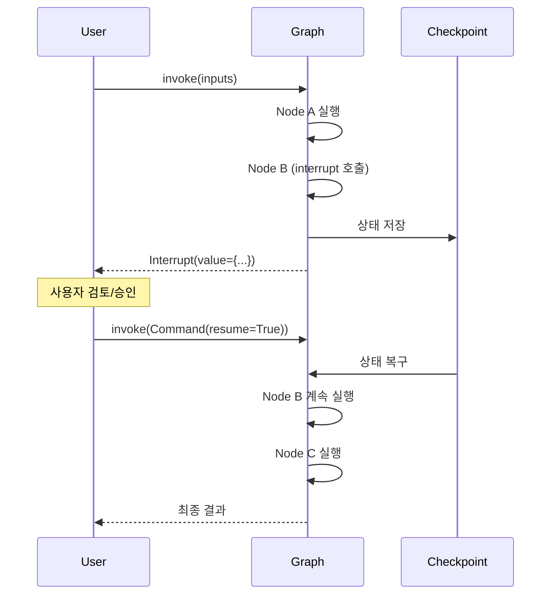
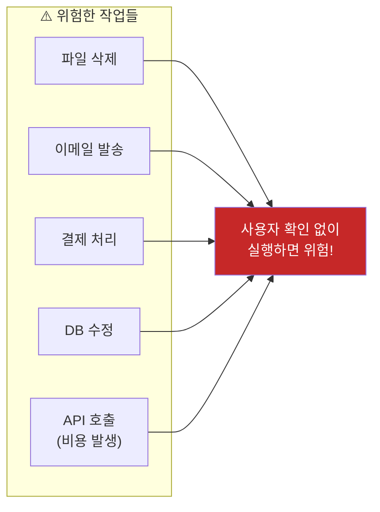
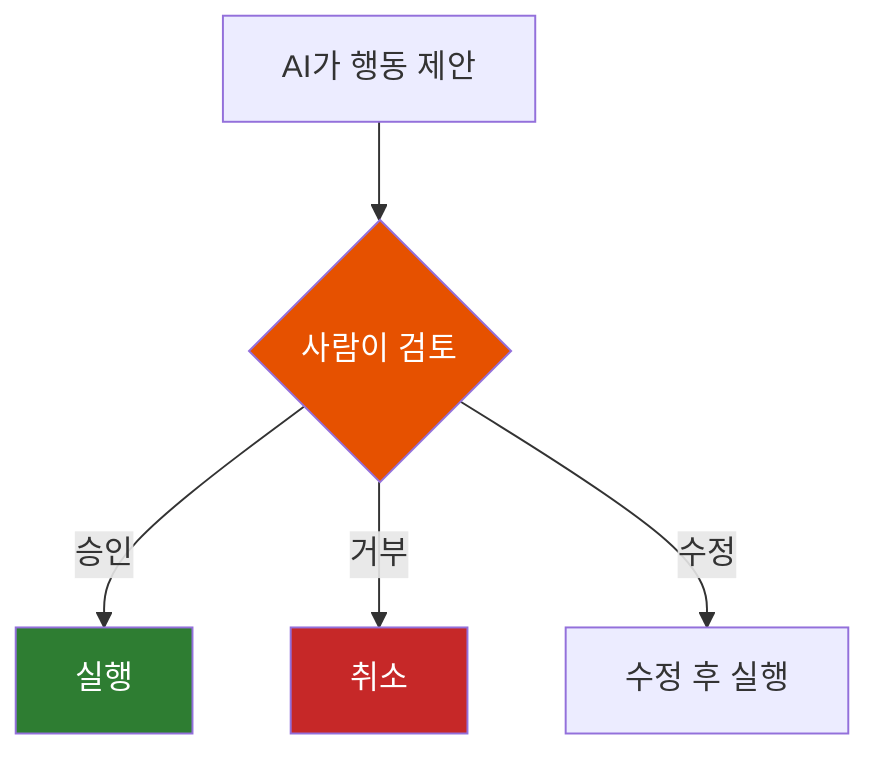
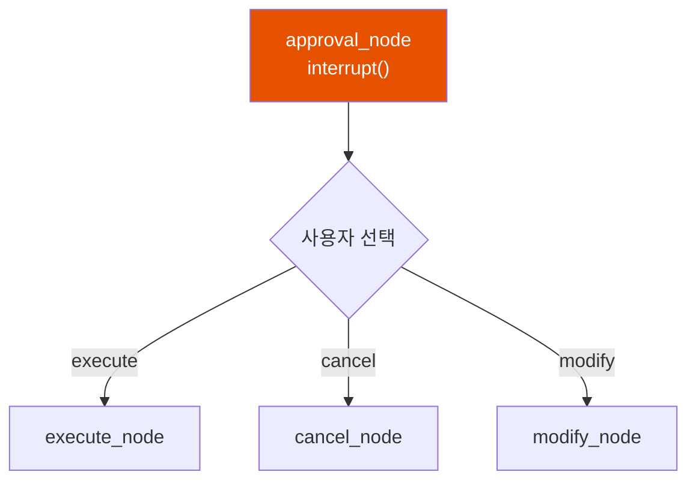
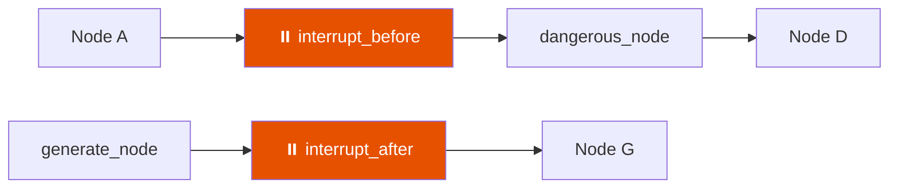
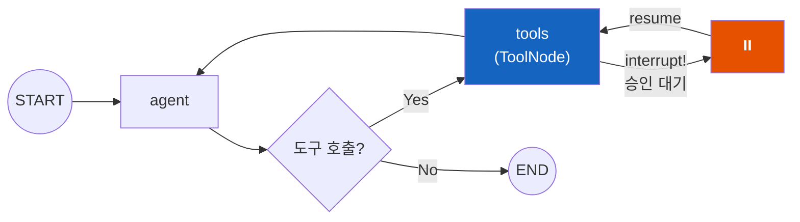
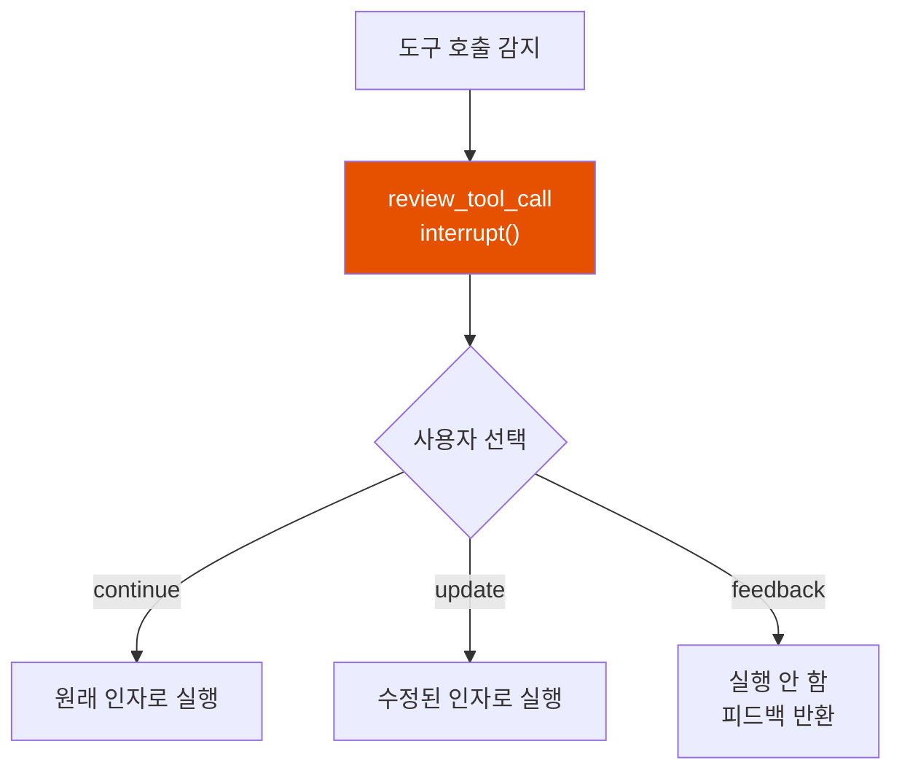

# LangGraph Interrupts - 사람의 승인이 필요할 때

AI Agent가 "모든 파일 삭제"를 실행하려 한다. 사용자 확인 없이 바로 실행해도 될까?

## 결론부터 말하면

**Interrupt는 그래프 실행을 일시 중단하고 외부 입력(사람의 승인, 추가 정보 등)을 기다리는 기능** 이다. `interrupt()` 함수로 실행을 멈추고, `Command(resume=...)` 로 재개한다. 이를 통해 **Human-in-the-Loop** 워크플로우를 구현할 수 있다.



| 방식 | 설명 | 사용 시점 | 위계 |
|------|------|----------|------|
| **`interrupt()` 함수** | 노드 **내부** 에서 동적으로 중단, `Command(resume=...)`로 값을 받아 재개 | 조건부 승인, 사용자 입력 수집, 도구 호출 검토 등 모든 프로덕션 HITL 워크플로 | **표준 권장 방식** (LangGraph 공식) |
| `interrupt_before` | 특정 노드 **실행 전** 에 중단 (정적 설정) | 디버깅·테스트에서 결정론적 중단점이 필요할 때 | 보조 |
| `interrupt_after` | 특정 노드 **실행 후** 에 중단 (정적 설정) | 디버깅·결과 확인 | 보조 |

> `interrupt_before`/`interrupt_after`는 여전히 지원되지만, 동적 분기·resume 값 전달·`Command` 통합이 모두 가능한 `interrupt()` 함수가 1급 메커니즘이다. 새 워크플로를 짤 때는 **`interrupt()` 함수부터** 고려하라.

## 1. 왜 Interrupt가 필요한가?

### 1.1 AI Agent의 위험한 행동

LLM 기반 Agent는 때때로 **위험하거나 비용이 큰 작업** 을 수행하려 한다:



### 1.2 Human-in-the-Loop 패턴

**Human-in-the-Loop** 은 AI의 결정에 사람이 개입하는 패턴이다:



**사용 사례:**
- 민감한 작업 전 승인 요청
- 생성된 콘텐츠 검토
- 도구 호출 인자 확인/수정
- 추가 정보 수집

## 2. interrupt() 함수 기본 사용법

### 2.1 기본 구조

```python
from langgraph.types import interrupt

def my_node(state):
    # 1. interrupt() 호출 - 실행 중단
    user_input = interrupt(value={
        "question": "이 작업을 승인하시겠습니까?",
        "details": state["action_details"]
    })

    # 2. Command(resume=...)로 재개되면 여기서 계속
    # user_input에는 resume으로 전달된 값이 들어옴

    if user_input:
        return {"status": "approved"}
    else:
        return {"status": "rejected"}
```

**핵심 포인트:**
- `interrupt(value)`: value는 **JSON 직렬화 가능한 데이터** (클라이언트에 전달됨)
- 재개 시 `interrupt()`의 **반환값** 으로 사용자 입력이 들어옴
- **Checkpointer 필수!** (상태 저장을 위해)

### 2.2 완전한 예제: 승인 워크플로우

```python
from typing import Literal, Optional, TypedDict
from langgraph.checkpoint.memory import MemorySaver
from langgraph.graph import StateGraph, START, END
from langgraph.types import Command, interrupt


class ApprovalState(TypedDict):
    action_details: str
    status: Optional[Literal["pending", "approved", "rejected"]]


def approval_node(state: ApprovalState) -> Command[Literal["proceed", "cancel"]]:
    """승인 요청 노드 - interrupt로 중단"""

    # 클라이언트에 보낼 데이터
    decision = interrupt({
        "question": "이 작업을 승인하시겠습니까?",
        "details": state["action_details"],
    })

    # 재개 시 decision에 사용자 응답이 들어옴
    # Command의 goto로 다음 노드 지정
    if decision:
        return Command(goto="proceed")
    else:
        return Command(goto="cancel")


def proceed_node(state: ApprovalState):
    return {"status": "approved"}


def cancel_node(state: ApprovalState):
    return {"status": "rejected"}


# 그래프 빌드
builder = StateGraph(ApprovalState)
builder.add_node("approval", approval_node)
builder.add_node("proceed", proceed_node)
builder.add_node("cancel", cancel_node)

builder.add_edge(START, "approval")
builder.add_edge("proceed", END)
builder.add_edge("cancel", END)

# Checkpointer 필수!
checkpointer = MemorySaver()
graph = builder.compile(checkpointer=checkpointer)


# === 실행 ===
config = {"configurable": {"thread_id": "approval-123"}}

# 1단계: 첫 실행 - interrupt에서 중단됨
result = graph.invoke(
    {"action_details": "Transfer $500", "status": "pending"},
    config=config,
)

# 중단 정보 확인
print(result["__interrupt__"])
# [Interrupt(value={'question': '이 작업을 승인하시겠습니까?', 'details': 'Transfer $500'})]


# 2단계: 사용자가 승인 후 재개
resumed = graph.invoke(
    Command(resume=True),  # True를 전달하여 승인
    config=config,
)

print(resumed["status"])  # "approved"
```

## 3. Command로 재개하기

### 3.1 Command 기본 사용법

```python
from langgraph.types import Command

# 단순 값 전달
graph.invoke(Command(resume=True), config)
graph.invoke(Command(resume="user input text"), config)
graph.invoke(Command(resume={"action": "approve"}), config)
```

> ⚠️ **`Command`의 인자별 위치** — LangGraph 공식 문서에 따르면 `update`/`goto`/`graph` 같은 인자는 **노드 함수의 반환값**에 사용하는 것이 의도된 패턴이고, `invoke()`/`stream()` 입력으로 넘기는 `Command`는 **`resume`** 만 의도된 사용이다. 따라서 "재개와 동시에 상태도 업데이트하고 싶다"면 `invoke(Command(resume=..., update=...))`로 넘기는 대신, 노드 내부에서 `interrupt()` 반환값을 받은 뒤 `return Command(update=..., goto=...)`로 처리하는 3.3절 패턴을 써야 한다.

### 3.2 Command의 goto로 분기

`Command`는 `goto`로 다음 노드를 직접 지정할 수 있다:

```python
from langgraph.types import Command, interrupt
from typing import Literal

def approval_node(state) -> Command[Literal["execute", "cancel", "modify"]]:
    response = interrupt({
        "question": "어떻게 하시겠습니까?",
        "options": ["execute", "cancel", "modify"]
    })

    # 사용자 선택에 따라 다른 노드로 분기
    return Command(goto=response["choice"])
```



### 3.3 상태 업데이트와 함께 재개

```python
def human_input_node(state) -> Command[Literal["agent"]]:
    """사용자 입력을 받아 상태에 추가"""

    user_input = interrupt(value="메시지를 입력하세요")

    # 상태 업데이트 + 다음 노드 지정
    return Command(
        update={
            "messages": [{"role": "human", "content": user_input}]
        },
        goto="agent"
    )
```

## 4. interrupt_before / interrupt_after

특정 노드 **실행 전/후** 에 자동으로 중단하는 방식이다. 주로 **디버깅** 이나 **검토** 용도로 사용한다.

### 4.1 컴파일 타임 설정

```python
from langgraph.checkpoint.memory import MemorySaver

checkpointer = MemorySaver()

# 컴파일 시 중단점 설정
graph = builder.compile(
    checkpointer=checkpointer,
    interrupt_before=["dangerous_node"],  # 이 노드 실행 전에 중단
    interrupt_after=["generate_node"],    # 이 노드 실행 후에 중단
)
```



### 4.2 런타임 설정

실행 시점에 동적으로 중단점을 설정할 수 있다:

```python
config = {"configurable": {"thread_id": "debug-session"}}

# invoke 시 중단점 지정
graph.invoke(
    inputs,
    config=config,
    interrupt_before=["node_a"],
    interrupt_after=["node_b", "node_c"],
)

# 재개
graph.invoke(None, config=config)
```

### 4.3 언제 사용하나?

| 방식 | 사용 시점 |
|------|----------|
| `interrupt()` 함수 | 조건부 승인, 동적 판단 필요 |
| `interrupt_before` | 위험한 노드 실행 전 검토 |
| `interrupt_after` | 노드 결과 확인 후 진행 결정 |

```python
# interrupt() - 노드 내부에서 조건부 사용
def maybe_dangerous(state):
    if state["risk_level"] > 0.8:
        approved = interrupt({"message": "고위험 작업입니다. 승인하시겠습니까?"})
        if not approved:
            return {"status": "cancelled"}
    # 실행 계속...

# interrupt_before - 항상 특정 노드 전에 중단
graph = builder.compile(
    checkpointer=checkpointer,
    interrupt_before=["execute_trade"]  # 거래 실행 전 항상 중단
)
```

## 5. 실전 예제: 도구 호출 승인

AI Agent가 도구를 호출하기 전에 사용자 승인을 받는 예제. **ToolNode** 를 사용하여 실제로 도구가 실행되도록 구성한다.

```python
from typing import Annotated, Literal
from typing_extensions import TypedDict
from langchain_core.messages import AnyMessage
from langchain_core.tools import tool
from langchain_anthropic import ChatAnthropic
from langgraph.checkpoint.memory import MemorySaver
from langgraph.graph import StateGraph, START, END
from langgraph.graph.message import add_messages
from langgraph.prebuilt import ToolNode
from langgraph.types import Command, interrupt


class AgentState(TypedDict):
    messages: Annotated[list[AnyMessage], add_messages]


@tool
def send_email(to: str, subject: str, body: str) -> str:
    """이메일 발송 도구 - 승인 필요"""

    # 발송 전 interrupt로 승인 요청
    response = interrupt({
        "action": "send_email",
        "to": to,
        "subject": subject,
        "body": body,
        "message": "이 이메일을 발송하시겠습니까?",
    })

    # 타입 체크: resume 값이 딕셔너리인지 확인
    if not isinstance(response, dict):
        return "이메일 발송 취소됨 (잘못된 응답 형식)"

    if response.get("action") == "approve":
        # 사용자가 수정한 값 사용 (없으면 원래 값)
        final_to = response.get("to", to)
        final_subject = response.get("subject", subject)
        final_body = response.get("body", body)

        # 실제 이메일 발송
        print(f"[발송] to={final_to}, subject={final_subject}")
        return f"이메일 발송 완료: {final_to}"

    return "이메일 발송 취소됨"


# 도구와 모델 설정
tools = [send_email]
model = ChatAnthropic(model="claude-sonnet-4-5-20250929").bind_tools(tools)


def agent_node(state: AgentState):
    """LLM을 호출하여 응답 또는 도구 호출 결정"""
    result = model.invoke(state["messages"])
    return {"messages": [result]}


def should_continue(state: AgentState) -> Literal["tools", "end"]:
    """도구 호출이 있으면 tools로, 없으면 종료"""
    last_message = state["messages"][-1]
    if hasattr(last_message, "tool_calls") and last_message.tool_calls:
        return "tools"
    return "end"


# 그래프 빌드
builder = StateGraph(AgentState)

# 노드 추가
builder.add_node("agent", agent_node)
builder.add_node("tools", ToolNode(tools))  # ToolNode가 실제로 도구 실행

# 엣지 설정
builder.add_edge(START, "agent")
builder.add_conditional_edges("agent", should_continue, {
    "tools": "tools",
    "end": END
})
builder.add_edge("tools", "agent")  # 도구 실행 후 다시 agent로

# Checkpointer 필수!
checkpointer = MemorySaver()
graph = builder.compile(checkpointer=checkpointer)


# === 실행 ===
config = {"configurable": {"thread_id": "email-workflow"}}

# 1. 첫 실행 - ToolNode에서 도구 실행 시 interrupt 발생
initial = graph.invoke(
    {"messages": [{"role": "user", "content": "alice@example.com에게 회의 일정 메일 보내줘"}]},
    config=config,
)

# 중단 정보 확인
print(initial["__interrupt__"])
# [Interrupt(value={'action': 'send_email', 'to': 'alice@example.com', ...})]


# 2. 승인 + 제목 수정 후 재개
resumed = graph.invoke(
    Command(resume={
        "action": "approve",
        "subject": "[긴급] 회의 일정 변경 안내"  # 제목 수정
    }),
    config=config,
)

print(resumed["messages"][-1].content)  # 도구 실행 결과
```



## 6. 도구 호출 검토/수정 패턴

도구 호출을 검토하고 수정할 수 있는 재사용 가능한 패턴:

```python
from typing import Union
from langgraph.types import interrupt
from langchain_core.messages import ToolCall, ToolMessage


def review_tool_call(tool_call: ToolCall) -> Union[ToolCall, ToolMessage]:
    """도구 호출 검토 - 승인/수정/피드백"""

    response = interrupt({
        "question": "이 도구 호출을 검토해주세요",
        "tool_name": tool_call["name"],
        "tool_args": tool_call["args"],
        "options": ["continue", "update", "feedback"]
    })

    action = response["action"]
    data = response.get("data")

    if action == "continue":
        # 원래대로 실행
        return tool_call

    elif action == "update":
        # 인자 수정 후 실행
        return {**tool_call, "args": data}

    elif action == "feedback":
        # 실행하지 않고 피드백 반환
        return ToolMessage(
            content=data,
            name=tool_call["name"],
            tool_call_id=tool_call["id"]
        )
```



## 7. 다중 Interrupt 처리

여러 승인이 필요한 경우 리스트로 처리할 수 있다:

```python
from langgraph.types import interrupt

def multi_approval_node(state):
    # 여러 항목에 대한 승인 요청
    responses = interrupt([
        {"item": "action_1", "question": "작업 1을 승인하시겠습니까?"},
        {"item": "action_2", "question": "작업 2를 승인하시겠습니까?"},
        {"item": "action_3", "question": "작업 3을 승인하시겠습니까?"},
    ])

    # responses는 리스트로 반환됨
    approved_actions = [
        item["item"]
        for item, response in zip(state["actions"], responses)
        if response
    ]

    return {"approved_actions": approved_actions}
```

## 8. 주의사항

### 8.1 노드는 처음부터 재실행된다

**중요:** `interrupt()` 후 재개하면 해당 **노드 전체가 처음부터 다시 실행** 된다. `interrupt()` 이전의 코드도 다시 실행되므로 **멱등성(Idempotency)** 을 고려해야 한다.

```python
# ⚠️ 주의: interrupt 전 사이드 이펙트가 있는 경우
def dangerous_node(state):
    # 이 코드는 재개 시 다시 실행됨!
    db.insert(state["data"])  # ❌ 중복 삽입 위험!

    approved = interrupt({"question": "진행하시겠습니까?"})

    if approved:
        return {"status": "done"}


# ✅ 개선: 멱등성 보장
def safe_node(state):
    # 멱등한 작업 (이미 존재하면 스킵)
    db.upsert(state["data"], key=state["id"])  # ✅ 중복 실행해도 안전

    approved = interrupt({"question": "진행하시겠습니까?"})

    if approved:
        return {"status": "done"}
```

**권장 패턴:**
- `interrupt()` 이전에는 **읽기 작업만** 수행
- 쓰기 작업은 `interrupt()` 이후에 배치
- 불가피한 경우 **멱등성 키(idempotency key)** 사용

### 8.2 Checkpointer 필수

**Interrupt는 반드시 Checkpointer가 필요하다.** 없으면 에러 발생.

```python
# ❌ Bad: Checkpointer 없음
graph = builder.compile()  # interrupt 사용 불가!

# ✅ Good: Checkpointer 있음
from langgraph.checkpoint.memory import MemorySaver
graph = builder.compile(checkpointer=MemorySaver())
```

### 8.3 Thread ID 필수

재개 시 **같은 Thread ID** 를 사용해야 한다:

```python
config = {"configurable": {"thread_id": "my-workflow-123"}}

# 첫 실행
graph.invoke(inputs, config=config)

# 재개 - 같은 config 사용!
graph.invoke(Command(resume=True), config=config)
```

### 8.3 interrupt() 반환값 타입

`interrupt()`의 반환값은 `Command(resume=...)`에 전달한 값과 **동일한 타입** :

```python
# resume에 True 전달
graph.invoke(Command(resume=True), config)
# → interrupt()는 True 반환

# resume에 딕셔너리 전달
graph.invoke(Command(resume={"action": "approve", "note": "OK"}), config)
# → interrupt()는 {"action": "approve", "note": "OK"} 반환
```

## 9. Interrupt vs 다른 기능 비교

| 기능 | 목적 | 사용 시점 |
|------|------|----------|
| **Interrupt** | 외부 입력 대기 | 사람 승인, 추가 정보 필요 |
| **Checkpoint** | 상태 저장 | 모든 노드 실행 후 자동 |
| **RetryPolicy** | 실패 시 재시도 | 일시적 오류 처리 |
| **Streaming** | 실시간 출력 | 진행 상황 표시 |

## 10. 정리

**Interrupt** 는 LangGraph에서 Human-in-the-Loop을 구현하는 핵심 기능이다.

**핵심 개념:**

| 개념 | 설명 |
|------|------|
| `interrupt(value)` | 실행 중단, value를 클라이언트에 전달 |
| `Command(resume=...)` | 중단된 그래프 재개, 값 전달 |
| `interrupt_before` | 특정 노드 실행 전 중단 |
| `interrupt_after` | 특정 노드 실행 후 중단 |
| `__interrupt__` | 결과에 포함된 중단 정보 |

**사용 시나리오:**

| 상황 | 권장 방식 |
|------|----------|
| 조건부 승인 (위험도 높을 때만) | `interrupt()` 함수 |
| 항상 검토 필요한 노드 | `interrupt_before` |
| 결과 확인 후 진행 | `interrupt_after` |
| 도구 호출 승인/수정 | `interrupt()` + 검토 패턴 |

**필수 조건:**
- ✅ Checkpointer 설정
- ✅ Thread ID 지정
- ✅ 같은 config로 재개

---

## 출처

- [LangGraph Documentation - Human-in-the-Loop](https://langchain-ai.github.io/langgraph/concepts/human_in_the_loop/) - 공식 문서
- [LangGraph How-to - Interrupts](https://langchain-ai.github.io/langgraph/how-tos/human_in_the_loop/)
- [LangGraph API Reference - Types](https://langchain-ai.github.io/langgraph/reference/types/)
