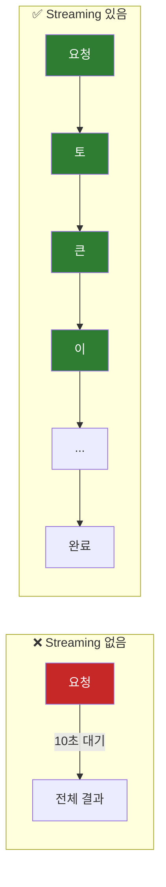
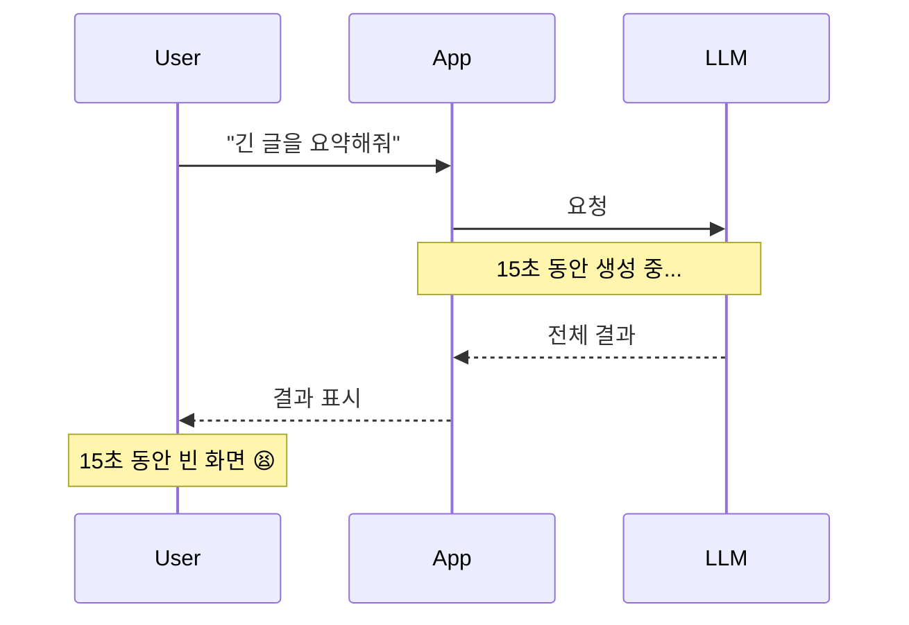
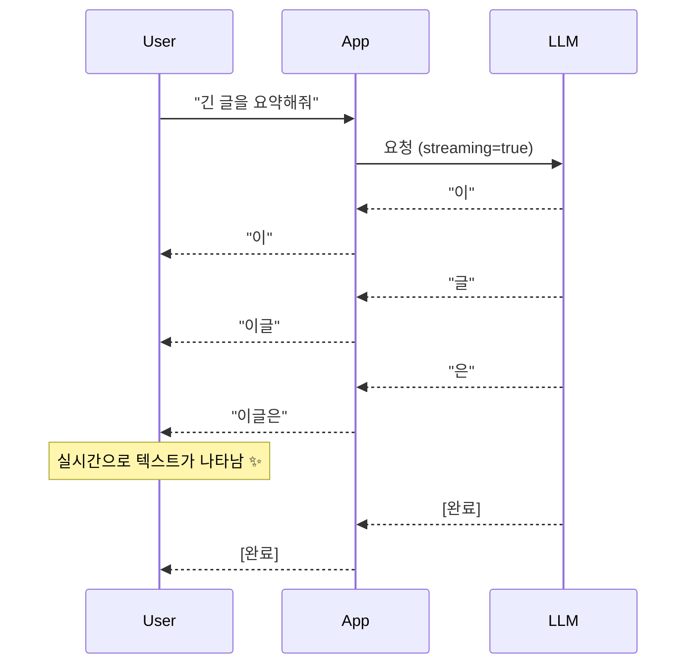
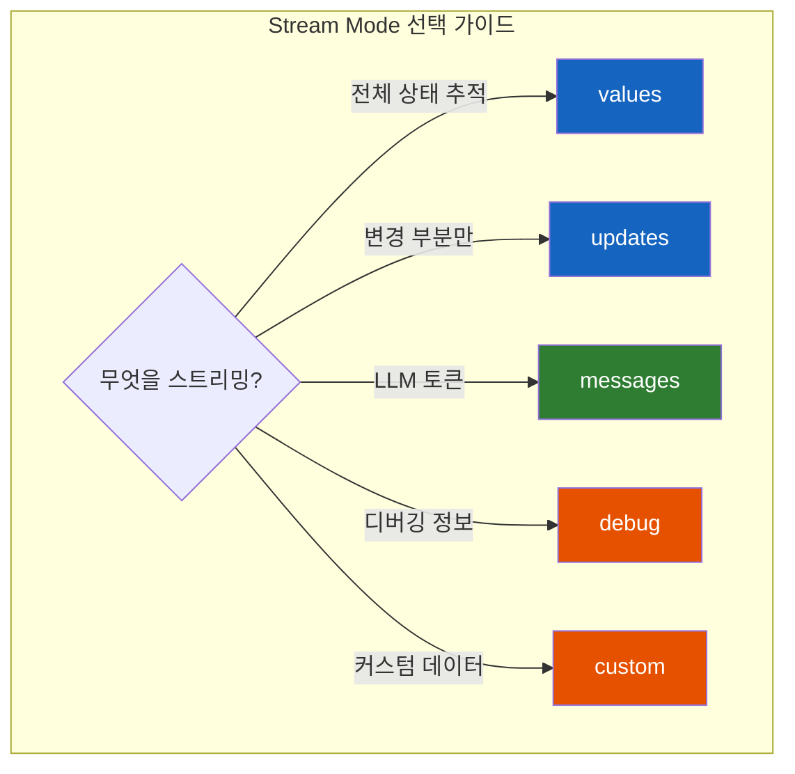

# LangGraph Streaming - 실시간으로 결과 받기

LLM이 답변을 생성하는 데 10초가 걸린다. 사용자는 10초 동안 빈 화면만 봐야 할까?

## 결론부터 말하면

**Streaming은 그래프 실행 결과를 실시간으로 받아보는 기능** 이다. LangGraph는 다양한 **Stream Mode** 를 제공하여 **노드별 상태 업데이트**, **LLM 토큰 단위 출력**, **커스텀 진행 상황** 등을 실시간으로 전달할 수 있다.



| Stream Mode | 출력 내용 | 주요 용도 |
|-------------|----------|----------|
| `values` | 노드 실행 후 **전체 상태** | 상태 추적 |
| `updates` | 노드가 **변경한 부분만** | 효율적 모니터링 |
| `messages` | LLM **토큰 단위** 출력 | 챗봇 UI |
| `debug` | 상세 실행 정보 | 디버깅 |
| `custom` | 개발자가 정의한 데이터 | 진행률, 중간 결과 |

## 1. 왜 Streaming이 필요한가?

### 1.1 사용자 경험의 문제

LLM 기반 애플리케이션에서 응답 시간은 치명적인 문제다:



**문제점:**

- 사용자는 앱이 작동하는지 알 수 없음
- 긴 대기 시간 → 이탈률 증가
- 중간에 취소할 수 없음

### 1.2 Streaming으로 해결



## 2. Stream Mode 완전 정복

### 2.1 기본 사용법

```python
from langgraph.graph import StateGraph, START, END
from typing import TypedDict

class State(TypedDict):
    topic: str
    joke: str

def refine_topic(state: State):
    return {"topic": state["topic"] + " and cats"}

def generate_joke(state: State):
    return {"joke": f"This is a joke about {state['topic']}"}

# 그래프 빌드
graph = (
    StateGraph(State)
    .add_node(refine_topic)
    .add_node(generate_joke)
    .add_edge(START, "refine_topic")
    .add_edge("refine_topic", "generate_joke")
    .add_edge("generate_joke", END)
    .compile()
)

# 스트리밍 실행
for chunk in graph.stream(
    {"topic": "ice cream"},
    stream_mode="updates"  # 모드 지정
):
    print(chunk)
```

### 2.2 values 모드 - 전체 상태 스냅샷

각 노드 실행 후 **전체 상태** 를 반환한다.

```python
for chunk in graph.stream(
    {"topic": "ice cream"},
    stream_mode="values"
):
    print(chunk)
```

**출력:**

```python
# 초기 상태
{'topic': 'ice cream'}

# refine_topic 실행 후
{'topic': 'ice cream and cats', 'joke': ''}

# generate_joke 실행 후
{'topic': 'ice cream and cats', 'joke': 'This is a joke about ice cream and cats'}
```

**언제 사용하나:**
- 매 단계마다 전체 상태를 확인해야 할 때
- 상태 기반 UI 업데이트
- 디버깅

### 2.3 updates 모드 - 변경된 부분만

각 노드가 **변경한 부분만** 반환한다. 노드 이름과 함께 제공된다.

```python
for chunk in graph.stream(
    {"topic": "ice cream"},
    stream_mode="updates"
):
    print(chunk)
```

**출력:**

```python
# refine_topic 노드의 업데이트
{'refine_topic': {'topic': 'ice cream and cats'}}

# generate_joke 노드의 업데이트
{'generate_joke': {'joke': 'This is a joke about ice cream and cats'}}
```

**언제 사용하나:**
- 네트워크 대역폭 절약
- 어떤 노드가 무엇을 변경했는지 추적
- 증분(incremental) 업데이트

### 2.4 messages 모드 - LLM 토큰 스트리밍

LLM의 출력을 **토큰 단위** 로 받는다. 챗봇 UI에서 가장 많이 사용된다.

```python
from langchain.chat_models import init_chat_model
from langgraph.graph import StateGraph, START, END, MessagesState

llm = init_chat_model(model="openai:gpt-4o-mini")

def call_model(state: MessagesState):
    response = llm.invoke(state["messages"])
    return {"messages": [response]}

graph = (
    StateGraph(MessagesState)
    .add_node("model", call_model)
    .add_edge(START, "model")
    .add_edge("model", END)
    .compile()
)

# 토큰 단위 스트리밍
for message_chunk, metadata in graph.stream(
    {"messages": [{"role": "user", "content": "Tell me a joke"}]},
    stream_mode="messages"
):
    if message_chunk.content:
        print(message_chunk.content, end="", flush=True)
```

**출력 (실시간):**

```
Why don't scientists trust atoms?

Because they make up everything!
```

**metadata 구조:**

```python
{
    "langgraph_node": "model",      # 현재 노드
    "langgraph_triggers": ["start:model"],
    "langgraph_step": 1,
    "ls_model_type": "chat",
    "ls_model_name": "gpt-4o-mini"
}
```

### 2.5 debug 모드 - 상세 실행 정보

개발/디버깅용으로 **상세한 실행 정보** 를 제공한다.

```python
for chunk in graph.stream(
    {"topic": "ice cream"},
    stream_mode="debug"
):
    print(chunk)
```

**출력:**

```python
{
    "type": "task",
    "timestamp": "2024-01-15T10:30:00.000Z",
    "step": 1,
    "payload": {
        "id": "abc-123",
        "name": "refine_topic",
        "input": {"topic": "ice cream"},
        "triggers": ["start:refine_topic"]
    }
}
{
    "type": "task_result",
    "timestamp": "2024-01-15T10:30:00.100Z",
    "step": 1,
    "payload": {
        "id": "abc-123",
        "name": "refine_topic",
        "result": [["topic", "ice cream and cats"]]
    }
}
```

### 2.6 custom 모드 - 커스텀 데이터 스트리밍

노드 내부에서 **개발자가 정의한 데이터** 를 스트리밍한다.

```python
from langgraph.graph import StateGraph, START, END
from langgraph.config import get_stream_writer
from typing import TypedDict

class State(TypedDict):
    items: list[str]
    processed: list[str]

def process_items(state: State):
    writer = get_stream_writer()  # StreamWriter 가져오기
    processed = []

    for i, item in enumerate(state["items"]):
        # 진행률 스트리밍
        writer({"progress": f"{i+1}/{len(state['items'])}", "current": item})

        # 처리
        processed.append(item.upper())

        # 중간 결과 스트리밍
        writer({"intermediate_result": item.upper()})

    return {"processed": processed}

graph = (
    StateGraph(State)
    .add_node("process", process_items)
    .add_edge(START, "process")
    .add_edge("process", END)
    .compile()
)

# custom 모드로 스트리밍
for chunk in graph.stream(
    {"items": ["apple", "banana", "cherry"], "processed": []},
    stream_mode="custom"
):
    print(chunk)
```

**출력:**

```python
{'progress': '1/3', 'current': 'apple'}
{'intermediate_result': 'APPLE'}
{'progress': '2/3', 'current': 'banana'}
{'intermediate_result': 'BANANA'}
{'progress': '3/3', 'current': 'cherry'}
{'intermediate_result': 'CHERRY'}
```

## 3. 다중 모드 스트리밍

여러 Stream Mode를 **동시에** 사용할 수 있다.

```python
for stream_mode, chunk in graph.stream(
    {"messages": [{"role": "user", "content": "What is the weather in SF?"}]},
    stream_mode=["updates", "messages", "custom"]  # 리스트로 전달
):
    print(f"[{stream_mode}] {chunk}")
```

**출력:**

```python
[updates] {'agent': {'messages': [...]}}
[messages] (AIMessageChunk(content='Let'), {...})
[messages] (AIMessageChunk(content=' me'), {...})
[custom] {'tool_call': 'get_weather', 'args': {'city': 'SF'}}
[updates] {'tools': {'messages': [...]}}
[messages] (AIMessageChunk(content='The'), {...})
[messages] (AIMessageChunk(content=' weather'), {...})
```

## 4. 비동기 스트리밍

비동기 환경에서는 `astream()`을 사용한다.

```python
async for chunk in graph.astream(
    {"topic": "ice cream"},
    stream_mode="updates"
):
    print(chunk)

# 다중 모드
async for stream_mode, chunk in graph.astream(
    {"messages": [...]},
    stream_mode=["updates", "messages"]
):
    print(f"[{stream_mode}] {chunk}")
```

## 5. Subgraph 스트리밍

Subgraph의 내부 실행도 스트리밍할 수 있다. `subgraphs=True` 옵션을 사용한다.

```python
from langgraph.graph import START, StateGraph
from typing import TypedDict

# Subgraph 정의
class SubgraphState(TypedDict):
    foo: str
    bar: str

def subgraph_node_1(state: SubgraphState):
    return {"bar": "bar"}

def subgraph_node_2(state: SubgraphState):
    return {"foo": state["foo"] + state["bar"]}

subgraph = (
    StateGraph(SubgraphState)
    .add_node(subgraph_node_1)
    .add_node(subgraph_node_2)
    .add_edge(START, "subgraph_node_1")
    .add_edge("subgraph_node_1", "subgraph_node_2")
    .compile()
)

# Parent graph 정의
class ParentState(TypedDict):
    foo: str

def node_1(state: ParentState):
    return {"foo": "hi! " + state["foo"]}

graph = (
    StateGraph(ParentState)
    .add_node("node_1", node_1)
    .add_node("node_2", subgraph)  # Subgraph를 노드로 추가
    .add_edge(START, "node_1")
    .add_edge("node_1", "node_2")
    .compile()
)

# Subgraph 포함 스트리밍
for namespace, chunk in graph.stream(
    {"foo": "foo"},
    stream_mode="updates",
    subgraphs=True  # Subgraph 내부도 스트리밍
):
    print(f"[{namespace}] {chunk}")
```

**출력:**

```python
# Parent graph
[('',)] {'node_1': {'foo': 'hi! foo'}}

# Subgraph 내부
[('node_2:abc123',)] {'subgraph_node_1': {'bar': 'bar'}}
[('node_2:abc123',)] {'subgraph_node_2': {'foo': 'hi! foobar'}}

# Parent graph 완료
[('',)] {'node_2': {'foo': 'hi! foobar'}}
```

## 6. Functional API에서 스트리밍

`@entrypoint` 데코레이터를 사용하는 Functional API에서도 스트리밍이 가능하다.

```python
from langgraph.func import entrypoint
from langgraph.checkpoint.memory import InMemorySaver
from langgraph.config import get_stream_writer

checkpointer = InMemorySaver()

@entrypoint(checkpointer=checkpointer)
def main(inputs: dict) -> int:
    writer = get_stream_writer()

    writer("Started processing")  # custom 스트림
    result = inputs["x"] * 2
    writer(f"Result is {result}")

    return result

config = {"configurable": {"thread_id": "abc"}}

for mode, chunk in main.stream(
    {"x": 5},
    stream_mode=["custom", "updates"],
    config=config
):
    print(f"{mode}: {chunk}")
```

**출력:**

```python
custom: Started processing
custom: Result is 10
updates: {'main': 10}
```

## 7. 실전 예제: 챗봇 UI

FastAPI와 함께 실시간 챗봇을 구현하는 예제:

```python
from fastapi import FastAPI
from fastapi.responses import StreamingResponse
from langchain.chat_models import init_chat_model
from langgraph.graph import StateGraph, START, END, MessagesState
import json

app = FastAPI()

llm = init_chat_model(model="openai:gpt-4o-mini")

def call_model(state: MessagesState):
    response = llm.invoke(state["messages"])
    return {"messages": [response]}

graph = (
    StateGraph(MessagesState)
    .add_node("model", call_model)
    .add_edge(START, "model")
    .add_edge("model", END)
    .compile()
)


async def generate_stream(user_message: str):
    """SSE 스트림 생성"""
    async for chunk, metadata in graph.astream(
        {"messages": [{"role": "user", "content": user_message}]},
        stream_mode="messages"
    ):
        if chunk.content:
            # Server-Sent Events 형식
            yield f"data: {json.dumps({'content': chunk.content})}\n\n"

    yield "data: [DONE]\n\n"


@app.post("/chat")
async def chat(message: str):
    return StreamingResponse(
        generate_stream(message),
        media_type="text/event-stream"
    )
```

**프론트엔드 (JavaScript):**

```javascript
const eventSource = new EventSource('/chat?message=Hello');

eventSource.onmessage = (event) => {
    if (event.data === '[DONE]') {
        eventSource.close();
        return;
    }

    const data = JSON.parse(event.data);
    // 실시간으로 텍스트 표시
    document.getElementById('response').innerText += data.content;
};
```

## 8. Stream Mode 비교 정리



| Mode | 출력 형태 | 주요 용도 | 성능 |
|------|----------|----------|------|
| `values` | `{전체 상태}` | 상태 기반 UI | 보통 |
| `updates` | `{노드: {변경된 값}}` | 증분 업데이트 | 좋음 |
| `messages` | `(MessageChunk, metadata)` | 챗봇 UI | 최고 |
| `debug` | `{type, timestamp, payload}` | 디버깅 | 느림 |
| `custom` | `{개발자 정의}` | 진행률, 중간결과 | 가변 |

## 9. 정리

**Streaming** 은 LangGraph 애플리케이션의 사용자 경험을 크게 향상시킨다.

**핵심 개념:**

| 개념 | 설명 |
|------|------|
| `stream()` | 동기 스트리밍 |
| `astream()` | 비동기 스트리밍 |
| `stream_mode` | 스트리밍 모드 지정 |
| `get_stream_writer()` | 커스텀 데이터 스트리밍 |
| `subgraphs=True` | Subgraph 내부 스트리밍 |

**모드별 선택 기준:**

| 상황 | 추천 모드 |
|------|----------|
| 챗봇 UI (타이핑 효과) | `messages` |
| 실시간 상태 모니터링 | `updates` |
| 진행률 표시 | `custom` |
| 전체 상태 저장/복원 | `values` |
| 문제 해결/디버깅 | `debug` |

---

## 출처

- [LangGraph Documentation - Streaming](https://langchain-ai.github.io/langgraph/concepts/streaming/) - 공식 문서
- [LangGraph How-to Guides - Streaming](https://langchain-ai.github.io/langgraph/how-tos/#streaming)
- [LangGraph API Reference](https://langchain-ai.github.io/langgraph/reference/)
