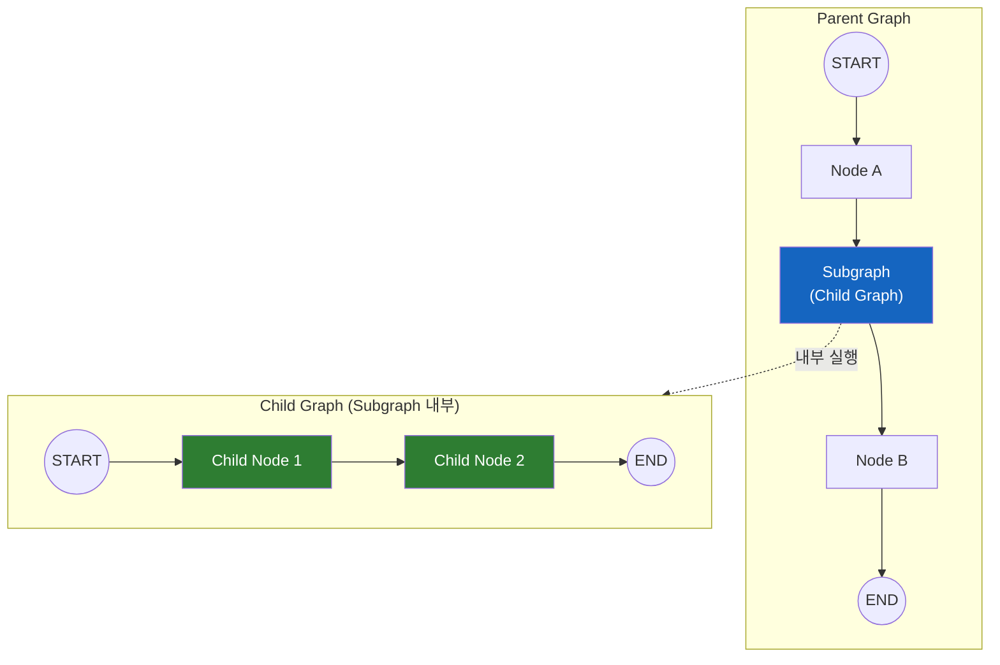
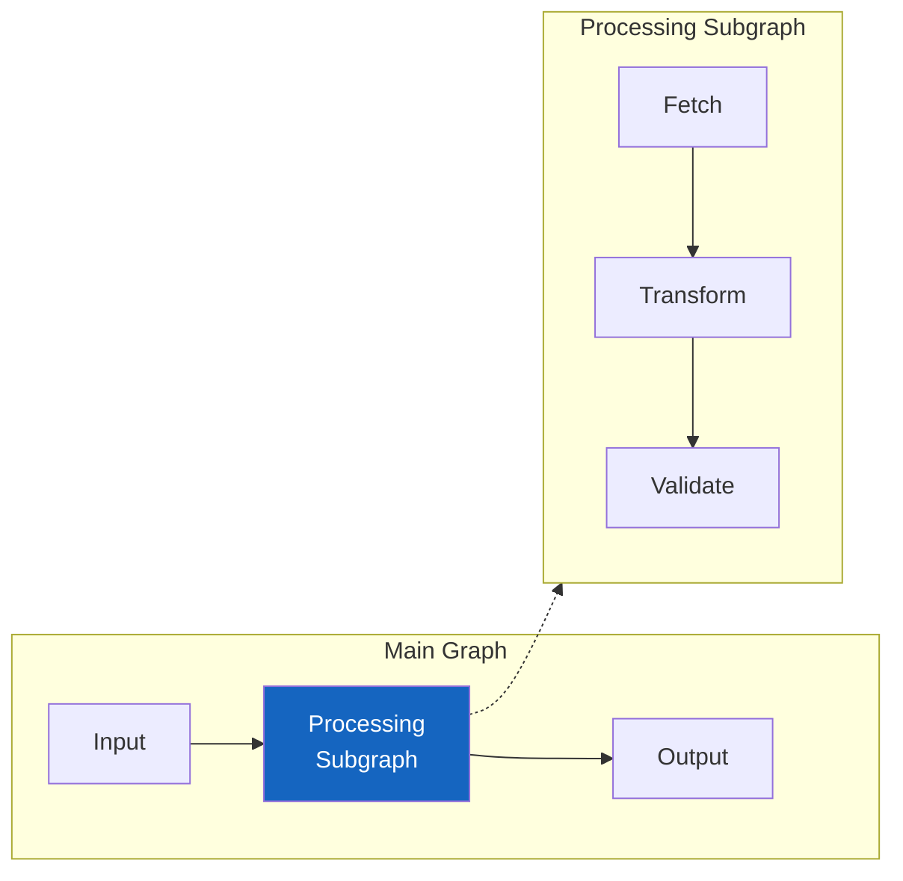
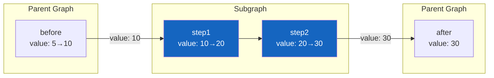
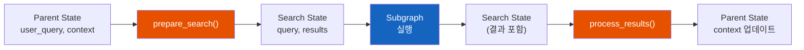
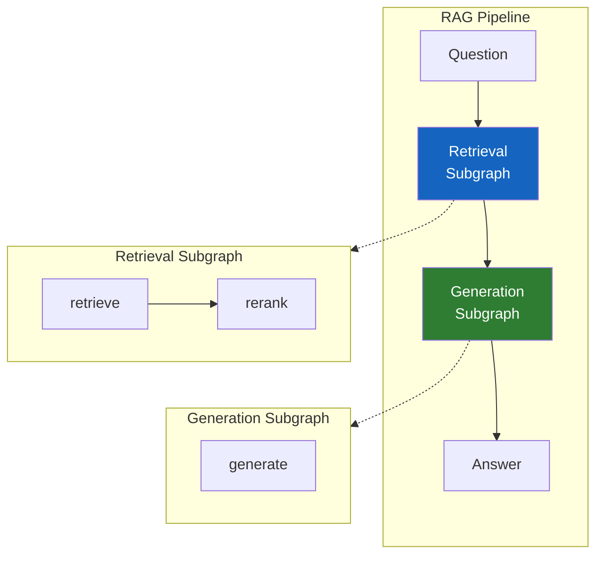

# LangGraph Subgraph - 그래프 안의 그래프

복잡한 AI 에이전트를 만들다 보면, 하나의 거대한 그래프가 되어버린다. 이걸 어떻게 모듈화할 수 있을까?

## 결론부터 말하면

**Subgraph는 컴파일된 그래프를 다른 그래프의 노드로 사용하는 기능** 이다. 복잡한 워크플로우를 작은 단위로 분리하고, 재사용 가능한 컴포넌트로 만들 수 있다.



| 특징 | 설명 |
|------|------|
| 모듈화 | 복잡한 로직을 독립적인 그래프로 분리 |
| 재사용 | 한 번 만든 Subgraph를 여러 곳에서 사용 |
| 격리 | 각 Subgraph는 자체 상태와 네임스페이스 보유 |
| 스트리밍 | 부모와 자식 이벤트를 구분하여 처리 가능 |

## 1. 왜 Subgraph가 필요한가?

### 1.1 거대한 그래프의 문제

AI 에이전트가 복잡해지면 그래프도 커진다.

```python
# ❌ 모든 로직이 하나의 그래프에 있음
builder = StateGraph(State)
builder.add_node("parse_input", parse_input)
builder.add_node("validate", validate)
builder.add_node("fetch_data", fetch_data)
builder.add_node("process_data", process_data)
builder.add_node("call_llm", call_llm)
builder.add_node("format_response", format_response)
builder.add_node("handle_error", handle_error)
builder.add_node("retry_logic", retry_logic)
builder.add_node("log_result", log_result)
# ... 더 많은 노드들

# 엣지도 복잡해짐
builder.add_edge("parse_input", "validate")
builder.add_conditional_edges("validate", ...)
# ... 수십 개의 엣지
```

**문제점:**

- **가독성 저하**: 전체 흐름을 파악하기 어려움
- **테스트 어려움**: 개별 기능을 독립적으로 테스트하기 힘듦
- **재사용 불가**: 비슷한 로직을 다른 곳에서 사용하려면 복사해야 함
- **유지보수 어려움**: 변경 시 의도치 않은 영향 범위

### 1.2 Subgraph로 해결

Subgraph를 사용하면 관련 로직을 독립적인 그래프로 분리할 수 있다.



```python
# ✅ 모듈화된 구조
# 1. 데이터 처리 Subgraph
processing_graph = build_processing_graph()

# 2. 메인 그래프에서 Subgraph 사용
main_builder = StateGraph(MainState)
main_builder.add_node("input", parse_input)
main_builder.add_node("process", processing_graph)  # Subgraph를 노드로!
main_builder.add_node("output", format_output)
```

## 2. Subgraph 기본 사용법

### 2.1 Subgraph 생성

Subgraph는 일반 그래프와 동일하게 만든다. **컴파일된 그래프** 를 다른 그래프의 노드로 추가하면 된다.

```python
from typing_extensions import TypedDict
from langgraph.graph import StateGraph, START, END


# === Subgraph 정의 ===
class ChildState(TypedDict):
    value: int


def child_step1(state: ChildState) -> dict:
    return {"value": state["value"] * 2}


def child_step2(state: ChildState) -> dict:
    return {"value": state["value"] + 10}


# Subgraph 빌드 및 컴파일
child_builder = StateGraph(ChildState)
child_builder.add_node("step1", child_step1)
child_builder.add_node("step2", child_step2)
child_builder.add_edge(START, "step1")
child_builder.add_edge("step1", "step2")
child_builder.add_edge("step2", END)

child_graph = child_builder.compile()  # 컴파일!


# === Parent Graph 정의 ===
class ParentState(TypedDict):
    value: int
    result: str


def before_subgraph(state: ParentState) -> dict:
    return {"value": state["value"] + 5}


def after_subgraph(state: ParentState) -> dict:
    return {"result": f"최종 값: {state['value']}"}


# Parent Graph 빌드
parent_builder = StateGraph(ParentState)
parent_builder.add_node("before", before_subgraph)
parent_builder.add_node("child", child_graph)  # Subgraph를 노드로 추가!
parent_builder.add_node("after", after_subgraph)

parent_builder.add_edge(START, "before")
parent_builder.add_edge("before", "child")
parent_builder.add_edge("child", "after")
parent_builder.add_edge("after", END)

parent_graph = parent_builder.compile()


# 실행
result = parent_graph.invoke({"value": 5, "result": ""})
print(result)
# {'value': 30, 'result': '최종 값: 30'}
# 계산: 5 → +5=10 → *2=20 → +10=30
```

### 2.2 State 공유 방식

Subgraph와 Parent Graph가 **같은 State 스키마** 를 사용하면 상태가 자동으로 공유된다.



**규칙:**

| 상황 | 동작 |
|------|------|
| 같은 키 존재 | Subgraph 출력이 Parent State 덮어씀 |
| Subgraph에만 있는 키 | Parent State에 추가되지 않음 |
| Parent에만 있는 키 | Subgraph에서 접근 불가 |

## 3. State 변환: 다른 스키마 사용

### 3.1 문제: State 스키마가 다를 때

실제로는 Parent와 Subgraph의 State 스키마가 다른 경우가 많다.

```python
# Parent State
class ParentState(TypedDict):
    user_query: str
    context: list
    final_answer: str

# Subgraph State (검색 전용)
class SearchState(TypedDict):
    query: str
    results: list
```

이 경우 **State 변환 함수** 가 필요하다.

### 3.2 입력/출력 변환 함수 사용

```python
from typing_extensions import TypedDict
from langgraph.graph import StateGraph, START, END


# === Subgraph: 검색 전용 ===
class SearchState(TypedDict):
    query: str
    results: list


def search_web(state: SearchState) -> dict:
    # 웹 검색 시뮬레이션
    results = [f"Result for: {state['query']}"]
    return {"results": results}


search_builder = StateGraph(SearchState)
search_builder.add_node("search", search_web)
search_builder.add_edge(START, "search")
search_builder.add_edge("search", END)
search_graph = search_builder.compile()


# === Parent Graph ===
class ParentState(TypedDict):
    user_query: str
    context: list
    final_answer: str


def prepare_search(state: ParentState) -> SearchState:
    """Parent State → Search State 변환"""
    return {"query": state["user_query"], "results": []}


def process_search_results(search_result: SearchState) -> dict:
    """Search State → Parent State 업데이트"""
    return {"context": search_result["results"]}


# Subgraph를 함수로 래핑
# ⚠️ 중요: config를 전달해야 Checkpoint가 유지됨 (8.3절 참고)
from langchain_core.runnables import RunnableConfig
from langgraph.config import get_config


def search_node(state: ParentState) -> dict:
    # 현재 config 가져오기 (Checkpoint 연속성을 위해 필수!)
    config = get_config()

    # 1. 입력 변환
    search_input = prepare_search(state)

    # 2. Subgraph 실행 (config 전달)
    search_output = search_graph.invoke(search_input, config)

    # 3. 출력 변환
    return process_search_results(search_output)


def generate_answer(state: ParentState) -> dict:
    context_str = "\n".join(state["context"])
    return {"final_answer": f"Based on: {context_str}"}


# Parent Graph 빌드
parent_builder = StateGraph(ParentState)
parent_builder.add_node("search", search_node)  # 래핑된 함수 사용
parent_builder.add_node("generate", generate_answer)

parent_builder.add_edge(START, "search")
parent_builder.add_edge("search", "generate")
parent_builder.add_edge("generate", END)

parent_graph = parent_builder.compile()


# 실행
result = parent_graph.invoke({
    "user_query": "LangGraph란?",
    "context": [],
    "final_answer": ""
})
print(result)
# {'user_query': 'LangGraph란?',
#  'context': ['Result for: LangGraph란?'],
#  'final_answer': 'Based on: Result for: LangGraph란?'}
```

### 3.3 변환 패턴 정리



## 4. Checkpoint와 Subgraph

### 4.1 checkpoint_ns: 네임스페이스 분리

Subgraph는 자체 **checkpoint namespace** 를 가진다. 이를 통해 Parent와 Subgraph의 Checkpoint가 분리된다.

```python
from langgraph.checkpoint.memory import InMemorySaver

checkpointer = InMemorySaver()
parent_graph = parent_builder.compile(checkpointer=checkpointer)

config = {"configurable": {"thread_id": "demo"}}
result = parent_graph.invoke(input_state, config)

# Checkpoint 조회
for state in parent_graph.get_state_history(config):
    checkpoint_ns = state.config["configurable"].get("checkpoint_ns", "")
    print(f"Namespace: '{checkpoint_ns}', Next: {state.next}")
```

**출력 예시:**

```
Namespace: '', Next: ()                    # Parent 완료
Namespace: '', Next: ('after',)            # Parent: child 완료
Namespace: 'child', Next: ()               # Subgraph 완료
Namespace: 'child', Next: ('step2',)       # Subgraph: step1 완료
Namespace: 'child', Next: ('step1',)       # Subgraph 시작
Namespace: '', Next: ('child',)            # Parent: before 완료
Namespace: '', Next: ('before',)           # Parent 시작
```

### 4.2 Subgraph 상태 직접 조회

LangGraph의 Subgraph checkpoint namespace는 단순 `"child"`가 아니라 **`"노드명:uuid"`** 형식이고, 중첩 Subgraph는 `|`로 이어진다 (예: `"child:abc-123|inner:def-456"`). 따라서 namespace를 직접 하드코딩하기보다 **`subgraphs=True` 옵션**으로 Subgraph state를 함께 받아오는 방식이 안전하다.

```python
# 권장 방식 — subgraphs=True로 Subgraph state까지 함께 조회
parent_state = parent_graph.get_state(
    {"configurable": {"thread_id": "demo"}},
    subgraphs=True,
)

# tasks 안의 각 task가 자신의 namespace와 state를 들고 있다
for task in parent_state.tasks:
    print(task.name, task.state)  # task.state.values에 Subgraph 내부 값
```

> 만약 namespace 문자열을 직접 알고 있다면 `{"thread_id": "demo", "checkpoint_ns": "child:<uuid>"}`로 `get_state()`를 호출할 수도 있지만, uuid는 실행마다 달라지므로 일반적으로는 위처럼 `subgraphs=True` 경로가 실무 표준이다.

## 5. Streaming과 Subgraph

### 5.1 Subgraph 이벤트 구분

스트리밍 시 `subgraphs=True`를 설정하면 Subgraph의 이벤트도 수신할 수 있다.

```python
config = {"configurable": {"thread_id": "stream-demo"}}

# subgraphs=True로 Subgraph 이벤트 포함
for namespace, chunk in parent_graph.stream(
    input_state,
    config,
    stream_mode="updates",
    subgraphs=True
):
    print(f"Namespace: {namespace}")
    print(f"  Chunk: {chunk}")
    print()
```

**출력 예시:**

```
Namespace: ()
  Chunk: {'before': {'value': 10}}

Namespace: ('child:abc-123',)        # ⚠️ "노드명:task_id" 형식
  Chunk: {'step1': {'value': 20}}

Namespace: ('child:abc-123',)
  Chunk: {'step2': {'value': 30}}

Namespace: ()
  Chunk: {'after': {'result': '최종 값: 30'}}
```

> **중요 — namespace는 `'노드명'`이 아니라 `'노드명:task_id'`** : LangGraph가 Subgraph 이벤트를 흘려보낼 때 namespace 튜플의 각 원소는 부모에서 그 Subgraph를 호출한 *노드명에 task id가 결합된 문자열*이다. 그래서 `namespace == ('child',)` 같은 정확한 일치 비교는 **항상 False**가 되어 Subgraph 이벤트를 놓치게 된다.

### 5.2 Namespace 기반 필터링

```python
for namespace, chunk in parent_graph.stream(
    input_state, config,
    stream_mode="updates",
    subgraphs=True
):
    if namespace == ():
        # Parent Graph 이벤트
        print(f"[Parent] {chunk}")
    elif namespace and namespace[0].startswith("child:"):
        # Subgraph 이벤트 — 'child:<task_id>' prefix로 판별
        print(f"[Subgraph] {chunk}")
```

## 6. 실전 예제: RAG 파이프라인

검색(Retrieval)과 생성(Generation)을 분리한 RAG 시스템 예제다.

```python
from typing import Annotated
from typing_extensions import TypedDict
from langgraph.graph import StateGraph, START, END
from langgraph.graph.message import add_messages
from langgraph.checkpoint.memory import InMemorySaver


# === Retrieval Subgraph ===
class RetrievalState(TypedDict):
    query: str
    documents: list


def retrieve_documents(state: RetrievalState) -> dict:
    # 실제로는 벡터 DB 검색
    docs = [
        f"Doc1 about {state['query']}",
        f"Doc2 about {state['query']}"
    ]
    return {"documents": docs}


def rerank_documents(state: RetrievalState) -> dict:
    # 문서 재정렬 (간단한 예시)
    reranked = sorted(state["documents"], reverse=True)
    return {"documents": reranked}


retrieval_builder = StateGraph(RetrievalState)
retrieval_builder.add_node("retrieve", retrieve_documents)
retrieval_builder.add_node("rerank", rerank_documents)
retrieval_builder.add_edge(START, "retrieve")
retrieval_builder.add_edge("retrieve", "rerank")
retrieval_builder.add_edge("rerank", END)

retrieval_graph = retrieval_builder.compile()


# === Generation Subgraph ===
class GenerationState(TypedDict):
    context: str
    question: str
    answer: str


def generate_answer(state: GenerationState) -> dict:
    # 실제로는 LLM 호출
    answer = f"Answer based on context: {state['context'][:50]}..."
    return {"answer": answer}


generation_builder = StateGraph(GenerationState)
generation_builder.add_node("generate", generate_answer)
generation_builder.add_edge(START, "generate")
generation_builder.add_edge("generate", END)

generation_graph = generation_builder.compile()


# === Main RAG Graph ===
from langgraph.config import get_config


class RAGState(TypedDict):
    question: str
    documents: list
    answer: str


def retrieval_node(state: RAGState) -> dict:
    """Retrieval Subgraph 래핑"""
    config = get_config()  # Checkpoint 연속성을 위해 필수!
    result = retrieval_graph.invoke({
        "query": state["question"],
        "documents": []
    }, config)
    return {"documents": result["documents"]}


def generation_node(state: RAGState) -> dict:
    """Generation Subgraph 래핑"""
    config = get_config()  # Checkpoint 연속성을 위해 필수!
    context = "\n".join(state["documents"])
    result = generation_graph.invoke({
        "context": context,
        "question": state["question"],
        "answer": ""
    }, config)
    return {"answer": result["answer"]}


# RAG Graph 빌드
rag_builder = StateGraph(RAGState)
rag_builder.add_node("retrieval", retrieval_node)
rag_builder.add_node("generation", generation_node)

rag_builder.add_edge(START, "retrieval")
rag_builder.add_edge("retrieval", "generation")
rag_builder.add_edge("generation", END)

checkpointer = InMemorySaver()
rag_graph = rag_builder.compile(checkpointer=checkpointer)


# 실행
config = {"configurable": {"thread_id": "rag-demo"}}
result = rag_graph.invoke({
    "question": "LangGraph의 장점은?",
    "documents": [],
    "answer": ""
}, config)

print(result)
# {'question': 'LangGraph의 장점은?',
#  'documents': ['Doc2 about LangGraph의 장점은?', 'Doc1 about LangGraph의 장점은?'],
#  'answer': 'Answer based on context: Doc2 about LangGraph의 장점은?\nDoc1...'}
```



## 7. Subgraph 설계 패턴

### 7.1 언제 Subgraph를 사용할까?

| 상황 | Subgraph 사용 |
|------|--------------|
| 독립적으로 테스트 가능한 로직 | ✅ |
| 여러 곳에서 재사용되는 워크플로우 | ✅ |
| 다른 팀이 개발하는 컴포넌트 | ✅ |
| 단순한 순차 로직 | ❌ 일반 노드로 충분 |
| 상태 공유가 복잡한 경우 | ⚠️ 신중하게 설계 |

### 7.2 네이밍 컨벤션

```python
# Subgraph 이름은 기능을 명확히
retrieval_graph = build_retrieval_graph()      # ✅
search_graph = build_search_graph()            # ✅
graph1 = build_graph()                         # ❌ 불명확

# 노드 이름과 구분
parent_builder.add_node("retrieval", retrieval_graph)  # Subgraph
parent_builder.add_node("parse_input", parse_input)    # 일반 노드
```

### 7.3 State 설계 원칙

```python
# ✅ Good: 명확한 입력/출력
class RetrievalState(TypedDict):
    query: str        # 입력
    documents: list   # 출력

# ❌ Bad: 불필요한 필드 포함
class RetrievalState(TypedDict):
    query: str
    documents: list
    user_id: str      # 검색에 불필요
    session_data: dict  # 검색에 불필요
```

## 8. 주의사항

### 8.1 순환 참조 금지

Subgraph가 자신을 포함하는 Parent를 참조하면 안 된다 — 이 경우 **빌드 시점에 자동으로 거부되지는 않는다**. 컴파일은 통과하지만, 실행 중에 부모→자식→부모→… 가 무한 반복되어 결국 **`RecursionError` / Python 재귀 한도 초과 / 스택 오버플로**로 실패한다.

```python
# ❌ 순환 참조 — 빌드는 통과, 실행 시 RecursionError 가능성
parent_graph = parent_builder.compile()
child_builder.add_node("parent", parent_graph)
```

따라서 LangGraph의 자동 검증을 기대하지 말고, **설계 단계에서 그래프 호출 그래프(call graph)에 사이클이 없는지 직접 확인**해야 한다 (실제 그래프 노드 사이의 엣지에는 사이클이 있어도 무방하다 — 여기서 막아야 하는 것은 *서브그래프 컴포지션 트리*의 사이클이다).

### 8.2 Checkpointer 공유

Subgraph를 직접 노드로 추가하면 Parent의 Checkpointer가 자동으로 공유된다.

```python
# ✅ Checkpointer가 자동 공유됨
parent_builder.add_node("child", child_graph)
parent_graph = parent_builder.compile(checkpointer=checkpointer)

# ⚠️ 래핑 함수 사용 시 주의
def wrapped_child(state):
    return child_graph.invoke(state)  # 별도의 Checkpointer 필요할 수 있음
```

**래핑 함수와 Checkpoint 세부 히스토리:**

이 부분은 `compile(checkpointer=...)`의 세 가지 값을 정확히 구분해 이해해야 한다.

| `compile()` 인자 | 동작 |
|------------------|------|
| `checkpointer=None` (기본값) | **Per-invocation 모드** — 자체 저장소는 없지만, 부모 그래프의 checkpointer가 호출 시 *상속*되어 Subgraph 내부 step도 저장된다 |
| `checkpointer=<saver>` | Subgraph가 자체 checkpointer를 갖는다 (직접 노드로 추가하면 보통 부모 것을 쓰면 충분하므로 흔한 패턴은 아님) |
| `checkpointer=False` | **명시적 stateless** — 부모의 checkpointer를 상속하지 않으며, Subgraph 내부 step의 히스토리가 저장되지 않는다. 짧고 가벼운 read-only Subgraph 등에 사용 |

따라서 "Checkpointer 없이 컴파일됐다"라는 모호한 표현을 피해야 한다. **`checkpointer=False`로 명시적으로 stateless로 만든 경우에만 Subgraph 내부 히스토리가 저장되지 않는다.** 또한 래핑 함수 안에서 `child_graph.invoke(state, config)`를 호출할 때, child가 `checkpointer=None`이면 부모 config의 checkpointer가 그대로 흐르므로 세부 히스토리가 보존된다.

```python
# Subgraph 내부까지 Time Travel/디버깅이 필요한 경우
child_graph = child_builder.compile(checkpointer=checkpointer)  # ✅ Subgraph에도 설정

# 또는 Parent에 직접 추가 (자동 공유)
parent_builder.add_node("child", child_graph)  # ✅ 래핑 없이 직접 추가
```

| 방식 | Subgraph 내부 Checkpoint |
|------|-------------------------|
| 직접 노드 추가 (`add_node(name, graph)`) | ✅ 자동 저장 (부모의 checkpointer 자동 공유) |
| 래핑 함수 + Subgraph가 `checkpointer=None`(기본값) + 부모 `config` 전달 | ✅ 부모의 checkpointer를 상속해 per-invocation 저장 |
| 래핑 함수 + Subgraph가 `checkpointer=False` (명시적 stateless) | ❌ 저장 안 됨 (의도된 stateless) |
| 래핑 함수 + Subgraph가 자체 `checkpointer` 보유 | ✅ Subgraph가 자체 저장소에 기록 |
| 래핑 함수 호출 시 `config`를 전달하지 않음 | ❌ 부모 컨텍스트가 전파되지 않아 저장 안 됨 |

### 8.3 Config 전파

Subgraph 실행 시 config가 자동 전파된다. 래핑 함수를 사용할 때는 수동으로 전달해야 한다.

```python
from langgraph.config import get_config

def wrapped_subgraph(state: ParentState) -> dict:
    # 현재 config 가져오기
    config = get_config()

    # Subgraph에 config 전달
    result = child_graph.invoke(transform(state), config)
    return process_result(result)
```

## 9. 정리

**Subgraph** 는 복잡한 그래프를 모듈화하고 재사용 가능하게 만드는 기능이다.

**핵심 개념:**

| 개념 | 설명 |
|------|------|
| Subgraph | 컴파일된 그래프를 노드로 사용 |
| State 변환 | 다른 스키마 간 데이터 변환 |
| checkpoint_ns | Subgraph별 Checkpoint 네임스페이스 |
| subgraphs=True | 스트리밍 시 Subgraph 이벤트 포함 |

**사용 패턴:**

```python
# 1. Subgraph 생성
child_graph = child_builder.compile()

# 2. Parent에 추가 (같은 State)
parent_builder.add_node("child", child_graph)

# 3. 또는 래핑 함수 사용 (다른 State)
def child_node(state):
    input_state = transform_input(state)
    result = child_graph.invoke(input_state)
    return transform_output(result)

parent_builder.add_node("child", child_node)
```

**활용 시나리오:**

- **RAG 파이프라인**: Retrieval, Generation 분리
- **멀티 에이전트**: 각 에이전트를 Subgraph로 구현
- **도메인 분리**: 팀별/기능별 그래프 모듈화
- **테스트 용이성**: 개별 Subgraph 단위 테스트

---

## 출처

- [LangGraph Documentation - Subgraphs](https://langchain-ai.github.io/langgraph/concepts/subgraphs/) - 공식 문서
- [LangGraph Documentation - Low Level](https://langchain-ai.github.io/langgraph/concepts/low_level/)
- [LangGraph GitHub](https://github.com/langchain-ai/langgraph)
