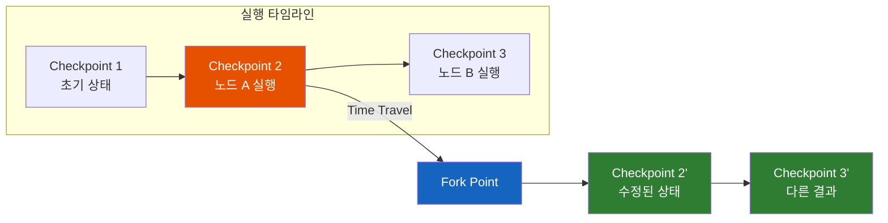
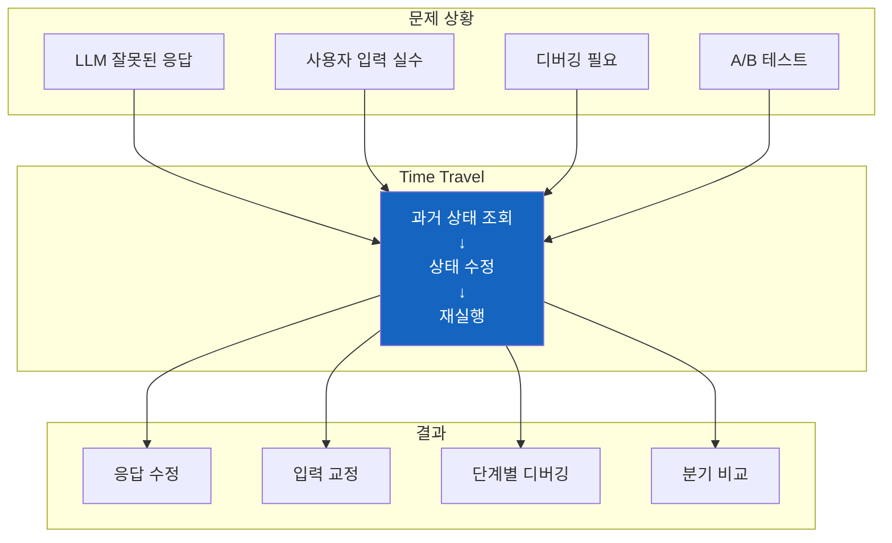
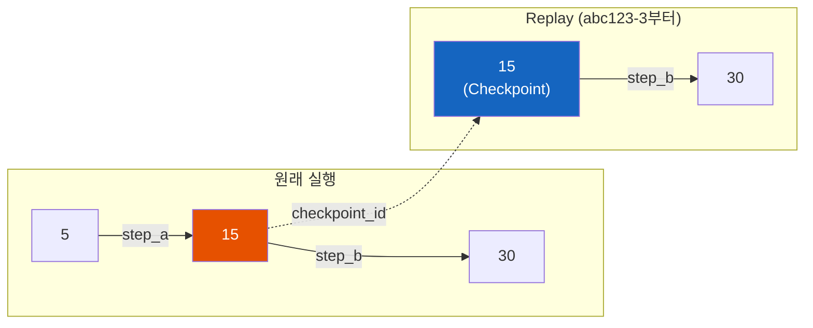
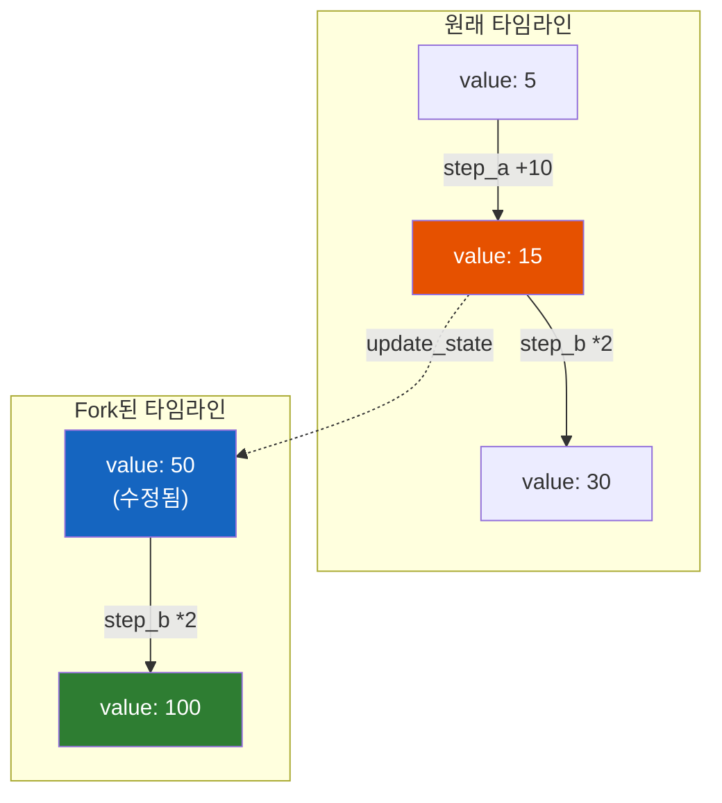
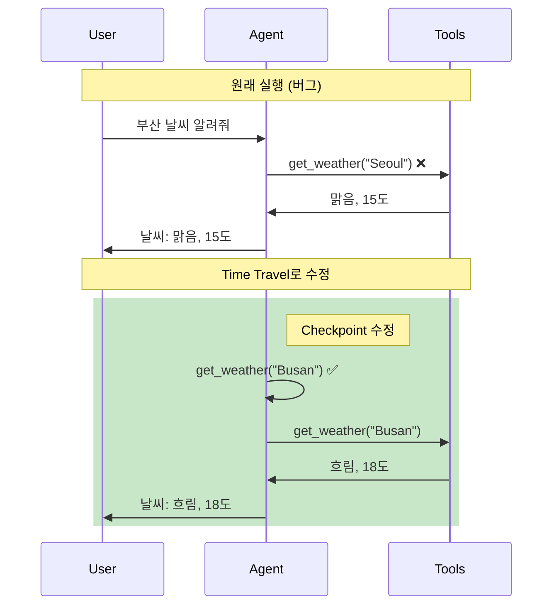
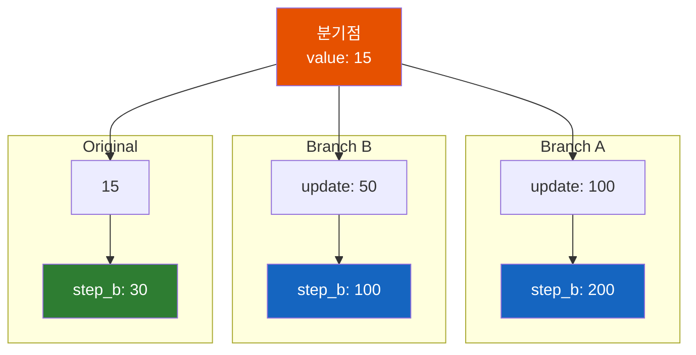
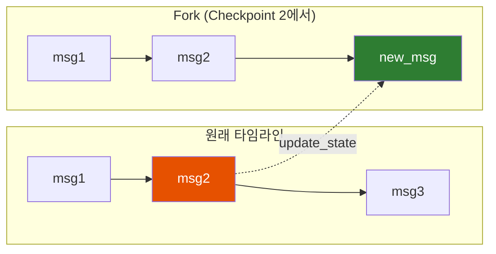

# LangGraph Time Travel - 과거로 돌아가 다시 실행하기

LLM이 잘못된 응답을 했다. "이 시점으로 돌아가서 다시 해볼 수 있으면 좋겠는데..."

## 결론부터 말하면

**Time Travel은 Checkpoint를 활용해 과거 상태로 돌아가 다시 실행하는 기능** 이다. 특정 시점의 상태를 조회하고(`get_state_history`), 수정하고(`update_state`), 그 시점에서 다시 실행(`invoke` with `checkpoint_id`)할 수 있다.



| 기능 | 메서드 | 설명 |
|------|--------|------|
| 이력 조회 | `get_state_history()` | Thread의 모든 Checkpoint 순회 |
| 과거 상태 조회 | `get_state(config)` | 특정 checkpoint_id의 상태 조회 |
| 상태 수정 | `update_state(config, values)` | Checkpoint의 상태 값 수정 |
| 재실행 | `invoke(input, config)` | 수정된 상태에서 그래프 재실행 |

## 1. 왜 Time Travel이 필요한가?

### 1.1 LLM은 항상 완벽하지 않다

AI 에이전트를 만들다 보면 이런 상황이 자주 발생한다:

```
사용자: "서울 날씨 알려줘"
AI: (tool call) get_weather("Seoul")
→ 결과: 맑음, 15도

사용자: "부산도"
AI: (tool call) get_weather("Seoul")  ← 잘못된 tool call!
→ 결과: 맑음, 15도 (서울 날씨가 또 나옴)
```

LLM이 "부산"을 "서울"로 잘못 해석했다. 이미 실행이 끝났는데, 어떻게 고칠 수 있을까?

**전통적인 해결책:**

- 처음부터 다시 시작 → 비용 낭비, 이전 대화 컨텍스트 손실
- 에러 메시지로 재시도 → 불확실하고 비효율적

**Time Travel의 해결책:**

```python
# 1. 잘못된 시점의 Checkpoint 찾기
for state in graph.get_state_history(config):
    print(state.values, state.config)

# 2. 해당 Checkpoint의 상태 수정
graph.update_state(
    target_config,  # 수정할 Checkpoint
    {"messages": [corrected_tool_call]}  # 올바른 tool call로 교체
)

# 3. 수정된 상태에서 다시 실행
result = graph.invoke(None, config)  # 그래프 재개
```

### 1.2 Time Travel의 핵심 가치



## 2. 상태 이력 조회: get_state_history

### 2.1 기본 사용법

`get_state_history()`는 Thread의 모든 Checkpoint를 **역순**(최신→과거)으로 반환한다.

```python
from langgraph.graph import StateGraph, START, END
from langgraph.checkpoint.memory import InMemorySaver
from typing_extensions import TypedDict


class State(TypedDict):
    value: int
    history: list[str]


def step_a(state: State) -> dict:
    return {
        "value": state["value"] + 10,
        "history": state["history"] + ["step_a"]
    }


def step_b(state: State) -> dict:
    return {
        "value": state["value"] * 2,
        "history": state["history"] + ["step_b"]
    }


# 그래프 빌드
builder = StateGraph(State)
builder.add_node("step_a", step_a)
builder.add_node("step_b", step_b)
builder.add_edge(START, "step_a")
builder.add_edge("step_a", "step_b")
builder.add_edge("step_b", END)

memory = InMemorySaver()
graph = builder.compile(checkpointer=memory)

# 실행
config = {"configurable": {"thread_id": "demo"}}
result = graph.invoke({"value": 5, "history": []}, config)
print(result)  # {"value": 30, "history": ["step_a", "step_b"]}

# 상태 이력 조회
for state in graph.get_state_history(config):
    print(f"Checkpoint: {state.config['configurable']['checkpoint_id']}")
    print(f"  Next: {state.next}")
    print(f"  Values: {state.values}")
    print()
```

**출력:**

```
Checkpoint: abc123-4  (최신)
  Next: ()            # 실행 완료
  Values: {'value': 30, 'history': ['step_a', 'step_b']}

Checkpoint: abc123-3
  Next: ('step_b',)   # step_b 실행 전
  Values: {'value': 15, 'history': ['step_a']}

Checkpoint: abc123-2
  Next: ('step_a',)   # step_a 실행 전
  Values: {'value': 5, 'history': []}

Checkpoint: abc123-1
  Next: ('__start__',)
  Values: {}
```

### 2.2 StateSnapshot 구조

`get_state_history()`가 반환하는 각 항목은 `StateSnapshot` 객체다.

```python
class StateSnapshot:
    values: dict           # 현재 상태 값
    next: tuple[str, ...]  # 다음 실행될 노드들
    config: dict           # checkpoint_id 포함 설정
    metadata: dict         # 메타데이터 (step, source 등)
    created_at: str        # 생성 시각
    parent_config: dict    # 부모 Checkpoint 설정
    tasks: tuple           # 대기 중인 태스크들
```

| 속성 | 설명 | 활용 |
|------|------|------|
| `values` | Checkpoint 시점의 상태 | 상태 확인, 디버깅 |
| `next` | 다음 실행될 노드 | 실행 흐름 파악 |
| `config` | checkpoint_id 포함 | Time Travel 대상 지정 |
| `metadata` | step 번호, 소스 등 | 필터링, 분석 |

### 2.3 필터링

특정 조건의 Checkpoint만 조회할 수 있다.

```python
# 최근 5개만 조회
recent_states = list(graph.get_state_history(config, limit=5))

# 특정 metadata로 필터링
filtered = [
    s for s in graph.get_state_history(config)
    if s.metadata.get("source") == "update"  # update_state로 생성된 것만
]
```

## 3. 과거 상태로 이동: checkpoint_id

### 3.1 특정 Checkpoint의 상태 조회

`get_state()`에 `checkpoint_id`를 포함한 config를 전달하면 해당 시점의 상태를 가져온다.

```python
# 현재(최신) 상태
current_state = graph.get_state(config)
print(current_state.values)  # {'value': 30, 'history': ['step_a', 'step_b']}

# 특정 Checkpoint 상태
past_config = {
    "configurable": {
        "thread_id": "demo",
        "checkpoint_id": "abc123-3"  # step_a 실행 후, step_b 실행 전
    }
}
past_state = graph.get_state(past_config)
print(past_state.values)  # {'value': 15, 'history': ['step_a']}
print(past_state.next)    # ('step_b',)
```

### 3.2 과거 상태에서 재실행 (Replay)

`checkpoint_id`를 지정하고 `invoke()`를 호출하면 해당 시점부터 다시 실행한다.

```python
# step_a 실행 후 상태에서 다시 시작
past_config = {
    "configurable": {
        "thread_id": "demo",
        "checkpoint_id": "abc123-3"
    }
}

# None을 전달하면 해당 Checkpoint 상태에서 이어서 실행
result = graph.invoke(None, past_config)
print(result)  # {'value': 30, 'history': ['step_a', 'step_b']}
```



## 4. 상태 수정: update_state

### 4.1 기본 사용법

`update_state()`는 특정 Checkpoint의 상태를 수정하고 **새로운 Checkpoint를 생성** 한다. 원본 Checkpoint는 그대로 유지된다.

```python
# 현재 상태 확인
current = graph.get_state(config)
print(current.values)  # {'value': 30, 'history': ['step_a', 'step_b']}

# 상태 수정 (새 Checkpoint 생성)
graph.update_state(
    config,
    {"value": 100}  # value만 수정
)

# 수정된 상태 확인
updated = graph.get_state(config)
print(updated.values)  # {'value': 100, 'history': ['step_a', 'step_b']}
```

### 4.2 과거 Checkpoint 수정 (Fork)

과거 시점의 Checkpoint를 수정하면 **새로운 분기(fork)** 가 생성된다. **중요한 점은 `update_state()`가 새로운 config를 반환한다는 것이다.** 이 반환된 config를 사용해야 수정된 상태에서 실행할 수 있다.

```python
# step_a 실행 후 상태 (value: 15)
past_config = {
    "configurable": {
        "thread_id": "demo",
        "checkpoint_id": "abc123-3"
    }
}

# 과거 상태 수정 → 새 분기 생성, 새 config 반환
new_config = graph.update_state(
    past_config,
    {"value": 50}  # 15 → 50으로 변경
)

# ⚠️ 반드시 반환된 new_config를 사용해야 함!
# past_config를 사용하면 수정 전 상태에서 실행됨
result = graph.invoke(None, new_config)
print(result)  # {'value': 100, 'history': ['step_a', 'step_b']}
                # 50 * 2 = 100 (원래는 15 * 2 = 30)
```



### 4.3 as_node 옵션: 특정 노드가 실행한 것처럼 처리

`as_node` 파라미터를 사용하면 특정 노드가 상태를 업데이트한 것처럼 처리할 수 있다. 이는 다음 실행될 노드를 제어하는 데 유용하다.

```python
# step_a가 실행한 것처럼 상태 업데이트
graph.update_state(
    config,
    {"value": 50},
    as_node="step_a"  # step_a가 출력한 것으로 처리
)

# 이제 다음 노드는 step_a의 다음인 step_b
state = graph.get_state(config)
print(state.next)  # ('step_b',)
```

**활용 시나리오:**

| 상황 | as_node 설정 |
|------|-------------|
| 특정 노드 결과 교체 | 해당 노드 이름 |
| 처음부터 다시 실행 | 생략 (기본값) |
| 그래프 종료 처리 | `END` |

```python
from langgraph.graph import END

# 그래프를 즉시 종료시키려면
graph.update_state(config, {"value": -1}, as_node=END)

state = graph.get_state(config)
print(state.next)  # () - 실행 완료 상태
```

## 5. 실전 예제: 잘못된 Tool Call 수정

AI 에이전트가 잘못된 tool call을 했을 때 Time Travel로 수정하는 예제다.

```python
from typing import Annotated
from typing_extensions import TypedDict
from langgraph.graph import StateGraph, START, END
from langgraph.graph.message import add_messages
from langgraph.checkpoint.memory import InMemorySaver
from langgraph.prebuilt import ToolNode
from langchain_core.messages import HumanMessage, AIMessage, ToolMessage
from langchain_core.tools import tool


# Tool 정의
@tool
def get_weather(city: str) -> str:
    """Get weather for a city."""
    weather_data = {
        "Seoul": "맑음, 15도",
        "Busan": "흐림, 18도"
    }
    return weather_data.get(city, f"{city} 날씨 정보 없음")


tools = [get_weather]


# State 정의
class State(TypedDict):
    messages: Annotated[list, add_messages]


# 에이전트 노드 (간단한 예시)
def agent(state: State) -> dict:
    # 실제로는 LLM이 처리하지만, 데모를 위해 하드코딩
    last_message = state["messages"][-1]

    if isinstance(last_message, ToolMessage):
        # Tool 결과를 받았으면 응답
        return {"messages": [AIMessage(content=f"날씨: {last_message.content}")]}

    # Tool call 생성 (의도적으로 잘못된 호출)
    if "부산" in last_message.content:
        # 버그: "부산"인데 "Seoul"로 잘못 호출
        return {"messages": [AIMessage(
            content="",
            tool_calls=[{"name": "get_weather", "args": {"city": "Seoul"}, "id": "call_1"}]
        )]}

    return {"messages": [AIMessage(content="무엇을 도와드릴까요?")]}


def should_continue(state: State) -> str:
    last = state["messages"][-1]
    if hasattr(last, "tool_calls") and last.tool_calls:
        return "tools"
    return "end"


# 그래프 빌드
builder = StateGraph(State)
builder.add_node("agent", agent)
builder.add_node("tools", ToolNode(tools))
builder.add_edge(START, "agent")
builder.add_conditional_edges("agent", should_continue, {"tools": "tools", "end": END})
builder.add_edge("tools", "agent")

memory = InMemorySaver()
graph = builder.compile(checkpointer=memory)

# 실행
config = {"configurable": {"thread_id": "weather-demo"}}
result = graph.invoke(
    {"messages": [HumanMessage(content="부산 날씨 알려줘")]},
    config
)

print("=== 잘못된 결과 ===")
print(result["messages"][-1].content)
# "날씨: 맑음, 15도" ← 서울 날씨가 나옴 (버그!)
```

### 5.1 Time Travel로 수정

```python
# 1. 상태 이력 조회
print("=== 상태 이력 ===")
for state in graph.get_state_history(config):
    print(f"Next: {state.next}")
    if state.values.get("messages"):
        last_msg = state.values["messages"][-1]
        print(f"  Last message: {type(last_msg).__name__}")
        if hasattr(last_msg, "tool_calls") and last_msg.tool_calls:
            print(f"  Tool calls: {last_msg.tool_calls}")
    print()

# 2. tool call이 있는 Checkpoint 찾기
target_state = None
for state in graph.get_state_history(config):
    if state.values.get("messages"):
        last_msg = state.values["messages"][-1]
        if hasattr(last_msg, "tool_calls") and last_msg.tool_calls:
            target_state = state
            break

print(f"Found checkpoint: {target_state.config['configurable']['checkpoint_id']}")

# 3. 올바른 tool call로 수정 (반환된 new_config 저장)
corrected_message = AIMessage(
    content="",
    tool_calls=[{"name": "get_weather", "args": {"city": "Busan"}, "id": "call_1"}]
)

new_config = graph.update_state(
    target_state.config,
    {"messages": [corrected_message]},
    as_node="agent"  # agent가 출력한 것처럼 처리
)

# 4. 수정된 상태에서 재실행 (⚠️ new_config 사용!)
# target_state.config를 사용하면 수정 전 상태가 실행됨
result = graph.invoke(None, new_config)

print("=== 수정된 결과 ===")
print(result["messages"][-1].content)
# "날씨: 흐림, 18도" ← 부산 날씨가 정확히 나옴!
```



## 6. 브랜치 비교: A/B 테스트

Time Travel을 활용하면 같은 시점에서 다른 선택지를 시도해볼 수 있다.

```python
# 분기점 Checkpoint 저장
branch_point = None
for state in graph.get_state_history(config):
    if state.next == ("step_b",):  # step_b 실행 직전
        branch_point = state
        break

# Branch A: value를 100으로 설정
graph.update_state(branch_point.config, {"value": 100})
result_a = graph.invoke(None, branch_point.config)
print(f"Branch A result: {result_a['value']}")  # 200

# Branch B: value를 50으로 설정 (같은 분기점에서 다시)
graph.update_state(branch_point.config, {"value": 50})
result_b = graph.invoke(None, branch_point.config)
print(f"Branch B result: {result_b['value']}")  # 100

# 원본은 그대로 유지
original = graph.get_state(config)
print(f"Original result: {original.values['value']}")  # 30
```



## 7. 주의사항

### 7.1 Checkpoint 불변성

`update_state()`는 **원본 Checkpoint를 수정하지 않는다**. 항상 새로운 Checkpoint가 생성된다.

```python
# 원본
original_id = graph.get_state(config).config["configurable"]["checkpoint_id"]

# 수정
graph.update_state(config, {"value": 999})

# 새 Checkpoint 생성됨
new_id = graph.get_state(config).config["configurable"]["checkpoint_id"]

print(original_id != new_id)  # True - 다른 ID
```

### 7.2 Reducer와 update_state

State에 reducer(`add_messages` 등)가 적용된 경우, `update_state()`도 reducer를 통과한다.

```python
class State(TypedDict):
    messages: Annotated[list, add_messages]  # 누적 reducer

# update_state에 메시지 추가
graph.update_state(config, {"messages": [new_message]})
# → 기존 messages에 new_message가 추가됨 (덮어쓰기 아님!)
```

**Fork 시 동작 주의:**

과거 Checkpoint를 대상으로 `update_state()`를 호출하면, **해당 시점까지의 히스토리** 에 새 메시지가 합쳐져 분기(Fork)가 생성된다. 즉, 선택한 Checkpoint 이후의 메시지들은 새 분기에 포함되지 않는다.



| 대상 | 동작 |
|------|------|
| 최신 Checkpoint | 현재 히스토리에 메시지 추가 |
| 과거 Checkpoint | 해당 시점까지의 히스토리 + 새 메시지로 분기 생성 |

**메시지 교체가 필요한 경우:**

```python
from langchain_core.messages import RemoveMessage

# 기존 메시지 삭제 후 새 메시지 추가
graph.update_state(config, {
    "messages": [
        RemoveMessage(id=old_message_id),  # 삭제
        new_message                         # 추가
    ]
})
```

### 7.3 비동기 API

비동기 환경에서는 `a` prefix 메서드를 사용한다.

```python
# 이력 조회
async for state in graph.aget_state_history(config):
    print(state.values)

# 상태 조회
state = await graph.aget_state(config)

# 상태 수정
await graph.aupdate_state(config, new_values)
```

## 8. 정리

LangGraph의 **Time Travel** 은 Checkpoint 기반으로 과거 상태를 탐색하고 수정하는 기능이다.

**핵심 메서드:**

| 메서드 | 설명 | 반환 |
|--------|------|------|
| `get_state_history(config)` | 모든 Checkpoint 순회 | `Iterator[StateSnapshot]` |
| `get_state(config)` | 특정 Checkpoint 상태 | `StateSnapshot` |
| `update_state(config, values)` | 상태 수정 (새 Checkpoint 생성) | **새 Checkpoint를 가리키는 `RunnableConfig`** (이 반환값을 다음 `invoke()`/`get_state()`에 그대로 넘겨야 분기된 상태를 따라간다) |
| `invoke(None, config)` | Checkpoint에서 재실행 | `State` |

**활용 시나리오:**

| 상황 | 접근 방법 |
|------|----------|
| LLM 응답 오류 수정 | 해당 Checkpoint 찾기 → `update_state` → `invoke` |
| 디버깅 | `get_state_history`로 단계별 상태 확인 |
| A/B 테스트 | 같은 분기점에서 다른 값으로 `update_state` |
| Undo 기능 | 과거 `checkpoint_id`로 `get_state` |

**기억할 점:**

- `update_state`는 원본을 수정하지 않고 새 Checkpoint 생성
- reducer가 있으면 `update_state`도 reducer 적용
- `as_node` 옵션으로 다음 실행 노드 제어

---

## 출처

- [LangGraph Documentation - Time Travel](https://langchain-ai.github.io/langgraph/concepts/time-travel/) - 공식 문서
- [LangGraph Checkpoint Package](https://github.com/langchain-ai/langgraph/tree/main/libs/checkpoint) - GitHub
