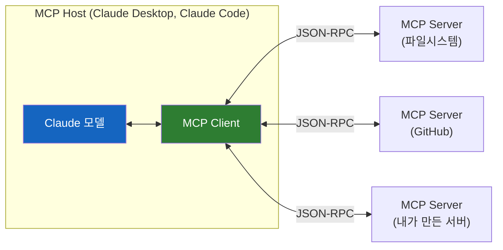
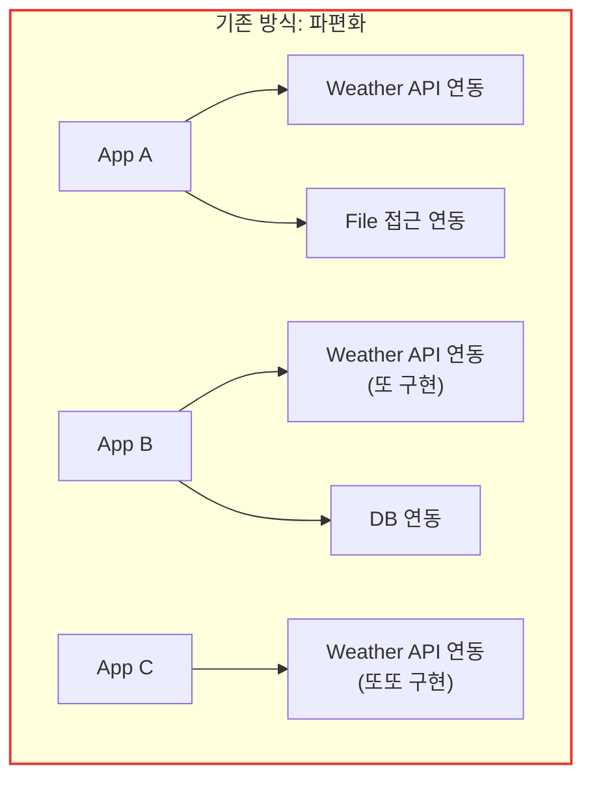
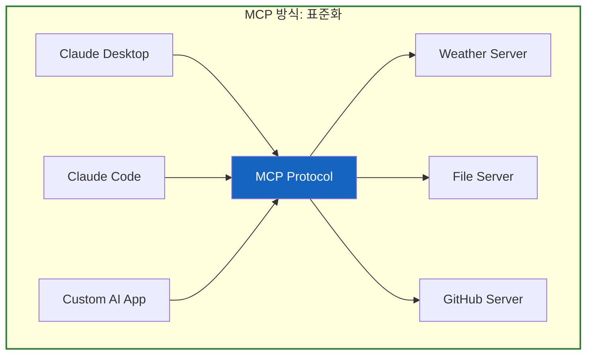
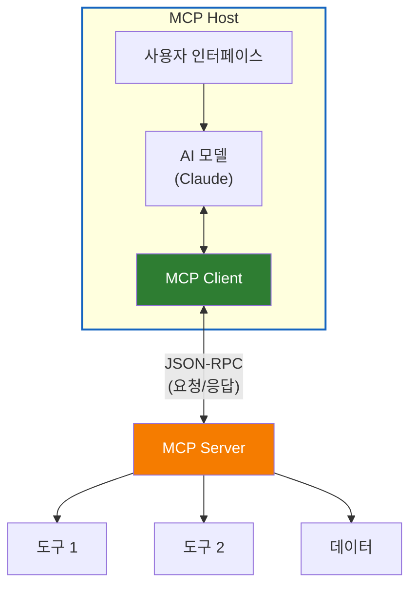
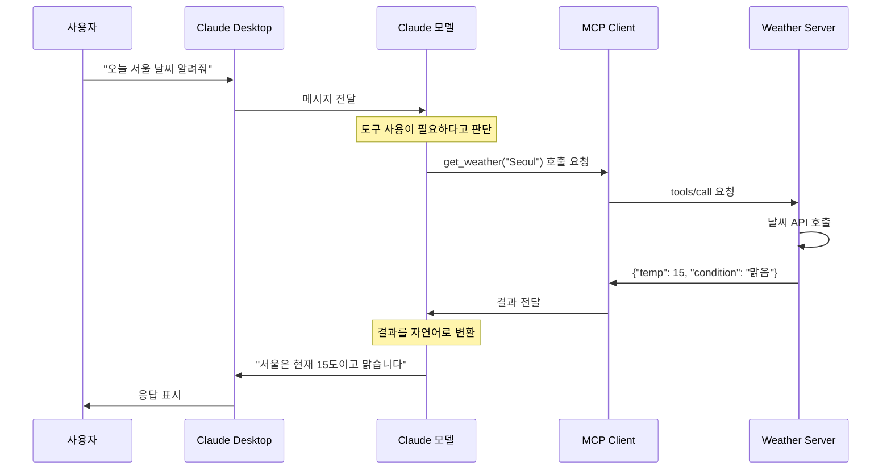
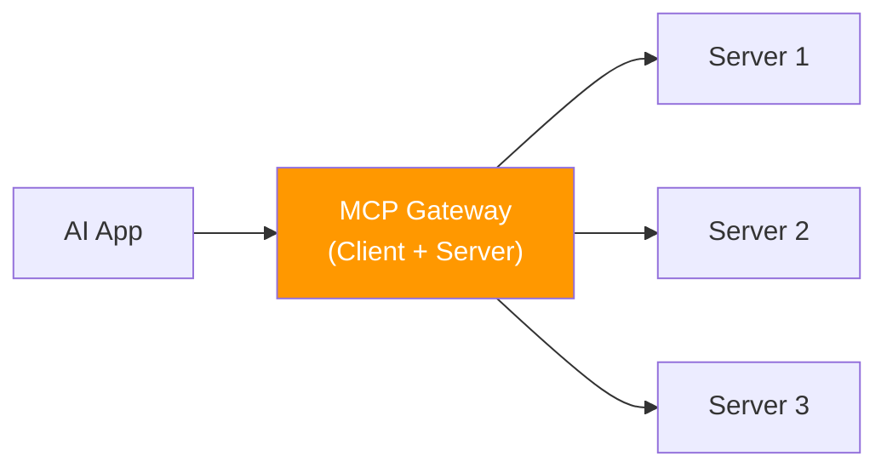
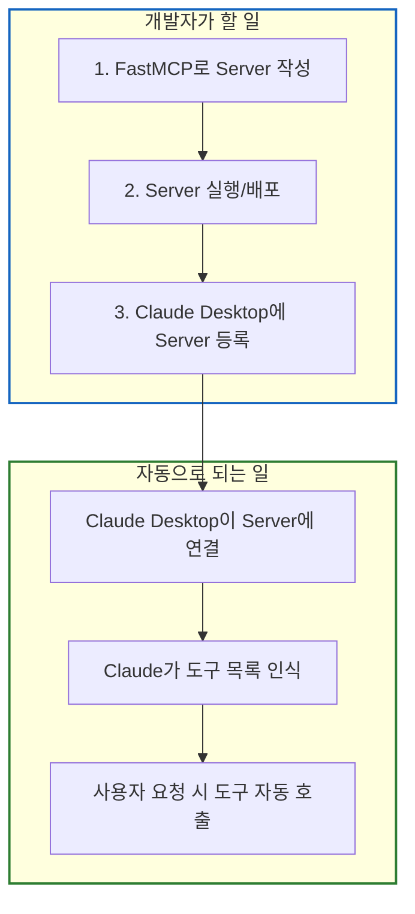

# MCP (Model Context Protocol) 이해하기

AI 모델이 외부 세계와 소통하는 표준 언어, MCP의 개념과 구조를 완전히 이해하기

## 결론부터 말하면

**MCP = AI 모델이 외부 도구/데이터에 접근할 수 있게 해주는 "표준 인터페이스"다.**

USB가 다양한 기기를 컴퓨터에 연결하는 표준이듯, MCP는 다양한 도구를 AI에 연결하는 표준이다.



| 구성 요소 | 역할 | 비유 | 예시 |
|-----------|------|------|------|
| **MCP Host** | 전체를 감싸는 앱 | 컴퓨터 본체 | Claude Desktop, Claude Code |
| **MCP Client** | 서버에 연결 요청 | USB 포트 | Host 안에 내장됨 |
| **MCP Server** | 도구/데이터 제공 | USB 기기 | FastMCP로 만든 서버 |

**핵심 포인트:**
- FastMCP로 만드는 것 = **MCP Server** (도구 제공자)
- Claude Desktop/Code = 이미 **MCP Client**가 내장되어 있음
- 개발자가 Client를 만들 필요 없음 (자체 AI 앱을 만들 때만 필요)

## 1. 왜 MCP가 필요한가?

### 1.1 문제: AI 모델의 고립

Claude나 GPT 같은 LLM은 태생적으로 **고립되어 있다**. 아무리 똑똑해도 실시간 정보를 모르고, 파일을 읽지 못하고, API를 호출하지 못한다.

```python
# ❌ 일반 LLM의 한계
user: "오늘 서울 날씨 알려줘"
llm: "죄송합니다. 저는 실시간 정보에 접근할 수 없습니다."

user: "내 프로젝트의 README.md 읽어줘"
llm: "죄송합니다. 저는 파일 시스템에 접근할 수 없습니다."

user: "GitHub에 이슈 만들어줘"
llm: "죄송합니다. 저는 외부 API를 호출할 수 없습니다."
```

### 1.2 기존 해결책의 문제점

각 애플리케이션이 자체적으로 도구 연결을 구현했다. 하지만 이 방식은 문제가 있었다.



| 문제 | 설명 |
|------|------|
| **중복 개발** | 같은 기능을 각 앱마다 다시 구현 |
| **호환성 없음** | A앱의 도구를 B앱에서 사용 불가 |
| **보안 관리 어려움** | 각자 다른 방식으로 권한 관리 |
| **생태계 분열** | 도구 개발자가 모든 앱 지원 불가 |

### 1.3 MCP의 해결책: 표준화

MCP는 이 문제를 **표준 프로토콜**로 해결한다. USB가 다양한 기기를 하나의 규격으로 연결하듯, MCP는 다양한 도구를 하나의 규격으로 연결한다.



**장점:**
- **한 번 만들면 어디서든**: Weather Server를 한 번 만들면 모든 MCP 지원 앱에서 사용
- **표준화된 보안**: 동일한 권한 모델로 관리
- **생태계 성장**: 도구 개발자는 MCP만 지원하면 됨

## 2. MCP 아키텍처 상세 설명

### 2.1 세 가지 구성 요소

MCP는 **Host**, **Client**, **Server** 세 가지로 구성된다. 이 구조가 헷갈리기 쉬우니 천천히 이해해보자.



#### MCP Host

**역할:** 전체 애플리케이션을 감싸는 컨테이너

| 예시 | 설명 |
|------|------|
| Claude Desktop | Anthropic의 공식 데스크톱 앱 |
| Claude Code | CLI 기반 AI 코딩 도구 |
| 커스텀 AI 앱 | MCP SDK로 만든 자체 앱 |

Host는 사용자 인터페이스, AI 모델, 그리고 MCP Client를 모두 포함한다. 개발자 입장에서는 "Claude Desktop을 사용한다"고 하면 Host를 사용하는 것이다.

#### MCP Client

**역할:** Server에 연결하고 통신을 담당

```python
# Client가 하는 일 (개념적 코드)
class MCPClient:
    def connect(self, server_config):
        """서버에 연결"""
        self.connection = establish_connection(server_config)

    def list_tools(self):
        """서버가 제공하는 도구 목록 조회"""
        return self.connection.request("tools/list")

    def call_tool(self, tool_name, arguments):
        """도구 호출"""
        return self.connection.request("tools/call", {
            "name": tool_name,
            "arguments": arguments
        })
```

**중요:** Client는 Host 안에 내장되어 있다. 개발자가 직접 만들 필요가 없다!

#### MCP Server

**역할:** 실제 도구와 데이터를 제공

```python
# Server가 하는 일 (개념적 코드)
class MCPServer:
    def __init__(self):
        self.tools = []

    def register_tool(self, name, handler, description):
        """도구 등록"""
        self.tools.append({
            "name": name,
            "handler": handler,
            "description": description
        })

    def handle_request(self, request):
        """Client의 요청 처리"""
        if request.method == "tools/list":
            return self.tools
        elif request.method == "tools/call":
            tool = self.find_tool(request.params.name)
            return tool.handler(request.params.arguments)
```

**핵심:** FastMCP로 만드는 것이 바로 이 Server다!

### 2.2 통신 흐름

사용자가 "오늘 서울 날씨 알려줘"라고 말하면 어떤 일이 일어날까?



### 2.3 왜 Client/Server로 분리했을까?

**의문:** 왜 굳이 Client와 Server를 분리했을까? 그냥 Host에서 직접 도구를 호출하면 안 되나?

**이유 1: 격리(Isolation)**

```
❌ 직접 호출 시
Host 프로세스 안에서 도구 실행
→ 도구가 충돌하면 전체 앱이 죽음
→ 악성 도구가 Host 메모리에 접근 가능

✅ Server 분리 시
별도 프로세스에서 도구 실행
→ Server가 죽어도 Host는 안전
→ 프로세스 격리로 보안 강화
```

**이유 2: 언어 독립성**

```
MCP Server는 어떤 언어로든 만들 수 있다:
- Python: FastMCP
- TypeScript: @modelcontextprotocol/sdk
- Go, Rust, Java...

JSON-RPC로 통신하기 때문에 언어가 달라도 문제없다.
```

**이유 3: 재사용성**

```
하나의 Server를 여러 Host에서 공유:

Weather Server (하나만 실행)
    ├── Claude Desktop이 연결
    ├── Claude Code가 연결
    └── 내 커스텀 앱이 연결

서버를 한 번 만들면 어디서든 사용할 수 있다.
```

## 3. MCP Server 만들기 (FastMCP)

### 3.1 FastMCP란?

FastMCP는 Python으로 MCP Server를 쉽게 만들 수 있게 해주는 프레임워크다. FastAPI가 REST API 개발을 쉽게 해주듯, FastMCP는 MCP Server 개발을 쉽게 해준다.

```python
# FastMCP로 만든 간단한 MCP Server
from fastmcp import FastMCP

# 서버 생성
mcp = FastMCP("my-tools")

# 도구 등록: 데코레이터 하나로 끝!
@mcp.tool()
def get_weather(city: str) -> dict:
    """도시의 현재 날씨를 조회합니다."""
    # 실제로는 날씨 API 호출
    # 구조화된 데이터를 반환하면 AI가 더 유연하게 활용 가능
    return {"city": city, "temp": 25, "condition": "맑음"}

@mcp.tool()
def calculate(expression: str) -> float:
    """수학 계산을 수행합니다."""
    return eval(expression)  # 실제로는 안전한 파서 사용

# 서버 실행
if __name__ == "__main__":
    mcp.run()
```

### 3.2 MCP Server가 제공하는 것들

MCP Server는 세 가지를 제공할 수 있다:

| 제공 항목 | 설명 | 예시 |
|-----------|------|------|
| **Tools** | AI가 호출할 수 있는 함수 | `get_weather()`, `send_email()` |
| **Resources** | AI가 읽을 수 있는 데이터 | 파일 내용, DB 스키마 |
| **Prompts** | 재사용 가능한 프롬프트 템플릿 | 코드 리뷰 템플릿 |

```python
from fastmcp import FastMCP

mcp = FastMCP("comprehensive-server")

# 1. Tool: AI가 실행할 수 있는 함수
@mcp.tool()
def search_database(query: str) -> list:
    """데이터베이스를 검색합니다."""
    return db.execute(query)

# 2. Resource: AI가 읽을 수 있는 데이터
@mcp.resource("config://app")
def get_app_config() -> str:
    """애플리케이션 설정을 반환합니다."""
    return json.dumps(app_config)

# 3. Prompt: 재사용 가능한 프롬프트
@mcp.prompt()
def code_review_prompt(code: str) -> str:
    """코드 리뷰 프롬프트를 생성합니다."""
    return f"""
    다음 코드를 리뷰해주세요:

    ```
    {code}
    ```

    다음 관점에서 검토해주세요:
    1. 버그 가능성
    2. 성능 이슈
    3. 가독성
    """
```

### 3.3 실전 예제: GitHub MCP Server

```python
from fastmcp import FastMCP
from github import Github

mcp = FastMCP("github-tools")

# GitHub 클라이언트 초기화
gh = Github(os.environ["GITHUB_TOKEN"])

@mcp.tool()
def list_repos(username: str) -> list:
    """사용자의 GitHub 저장소 목록을 조회합니다."""
    user = gh.get_user(username)
    return [
        {"name": repo.name, "stars": repo.stargazers_count}
        for repo in user.get_repos()
    ]

@mcp.tool()
def create_issue(
    repo: str,
    title: str,
    body: str
) -> dict:
    """GitHub 저장소에 이슈를 생성합니다."""
    repository = gh.get_repo(repo)
    issue = repository.create_issue(title=title, body=body)
    return {
        "number": issue.number,
        "url": issue.html_url
    }

@mcp.tool()
def get_pr_diff(repo: str, pr_number: int) -> str:
    """PR의 변경 내용(diff)을 조회합니다."""
    repository = gh.get_repo(repo)
    pr = repository.get_pull(pr_number)
    # diff_url로 실제 diff 텍스트를 가져옴
    import requests
    return requests.get(pr.diff_url).text
```

이 서버를 실행하면, Claude Desktop/Code에서 GitHub 작업을 자연어로 수행할 수 있다:

```
User: "anthropics/claude 저장소에 '문서 개선 필요' 이슈 만들어줘"
Claude: create_issue 도구를 사용해서 이슈를 생성하겠습니다.
        [도구 실행]
        이슈가 생성되었습니다: https://github.com/anthropics/claude/issues/123
```

## 4. MCP Client가 필요한 경우

대부분의 경우 Client를 직접 만들 필요가 없다. Claude Desktop이나 Claude Code가 이미 Client 역할을 하기 때문이다.

**그렇다면 언제 Client를 직접 만들어야 할까?**

### 4.1 자체 AI 애플리케이션 개발 시

자체 AI 앱을 만들고, 그 앱에서 MCP Server의 도구를 사용하고 싶다면 Client가 필요하다.

```python
# 자체 AI 앱에서 MCP Client 사용
from mcp import Client

async def main():
    # MCP Server에 연결
    client = Client()
    await client.connect("stdio://weather-server")

    # 사용 가능한 도구 확인
    tools = await client.list_tools()
    print(f"사용 가능한 도구: {tools}")

    # 도구 호출
    result = await client.call_tool(
        "get_weather",
        {"city": "Seoul"}
    )
    print(f"결과: {result}")
```

### 4.2 MCP Gateway/Proxy 구축 시

여러 MCP Server를 하나로 묶는 Gateway를 만들 때 Client가 필요하다.



## 5. 실제 사용 흐름 정리

### 5.1 개발자가 해야 할 일



### 5.2 Claude Desktop 설정 예시

설정 파일 위치는 운영체제마다 다르다:

| OS | 경로 |
|----|------|
| macOS | `~/Library/Application Support/Claude/claude_desktop_config.json` |
| Windows | `%APPDATA%\Claude\claude_desktop_config.json` |
| Linux | `~/.config/Claude/claude_desktop_config.json` |

```json
// macOS 예시: ~/Library/Application Support/Claude/claude_desktop_config.json
{
  "mcpServers": {
    "weather": {
      "command": "python",
      "args": ["/path/to/weather_server.py"]
    },
    "github": {
      "command": "npx",
      "args": ["-y", "@anthropic/mcp-server-github"],
      "env": {
        "GITHUB_TOKEN": "your-token"
      }
    }
  }
}
```

이렇게 설정하면:
1. Claude Desktop 시작 시 자동으로 Server 프로세스 실행
2. Claude가 해당 Server의 도구들을 인식
3. 사용자가 관련 요청을 하면 자동으로 도구 호출

## 6. 비유로 완전히 이해하기

### 레스토랑 비유

| MCP 용어 | 레스토랑 비유 | 설명 |
|----------|--------------|------|
| MCP Host | 레스토랑 건물 | 전체 시스템을 감싸는 컨테이너 |
| Claude 모델 | 손님 | 실제로 서비스를 이용하는 주체 |
| MCP Client | 웨이터 | 손님의 주문을 주방에 전달 |
| MCP Server | 주방 | 실제 음식(기능)을 만드는 곳 |
| Tools | 메뉴 | 주방에서 만들 수 있는 음식 목록 |

```
손님(Claude): "스테이크 주세요"
웨이터(Client): 주방에 스테이크 주문 전달
주방(Server): 스테이크 조리
웨이터(Client): 손님에게 스테이크 전달
손님(Claude): "맛있네요!" (사용자에게 결과 전달)
```

### USB 비유

```
USB 규격 = MCP 프로토콜
USB 포트 = MCP Client
USB 기기 = MCP Server

- USB 규격이 있어서 어떤 USB 기기든 컴퓨터에 연결 가능
- MCP 프로토콜이 있어서 어떤 MCP Server든 Claude에 연결 가능
```

## 7. 정리

### 핵심 요약

| 질문 | 답변 |
|------|------|
| MCP란? | AI 모델과 외부 도구를 연결하는 **표준 프로토콜** |
| FastMCP로 뭘 만드나? | **MCP Server** (도구 제공자) |
| Client는 누가 만드나? | **Claude Desktop/Code에 이미 내장**되어 있음 |
| 언제 Client를 만드나? | 자체 AI 앱을 만들 때만 필요 |

### MCP의 가치

```
Before MCP:
├── 각 앱이 자체적으로 도구 연결 구현
├── 도구 개발자는 모든 앱 지원 필요
└── 생태계 파편화

After MCP:
├── 표준 프로토콜로 한 번 만들면 어디서든 사용
├── 도구 개발자는 MCP만 지원하면 됨
└── 생태계 통합
```

### 다음 단계

1. **MCP Server 만들어보기**: FastMCP로 간단한 도구 서버 작성
2. **Claude Desktop에 연결**: 설정 파일에 서버 등록
3. **실제 사용**: 자연어로 도구 사용해보기

## 출처

- [Model Context Protocol Documentation](https://modelcontextprotocol.io/docs) - 공식 문서
- [FastMCP GitHub](https://github.com/jlowin/fastmcp) - FastMCP 프레임워크
- [MCP Specification](https://spec.modelcontextprotocol.io/) - MCP 스펙 문서
- [Anthropic MCP Announcement](https://www.anthropic.com/news/model-context-protocol) - Anthropic 공식 발표
