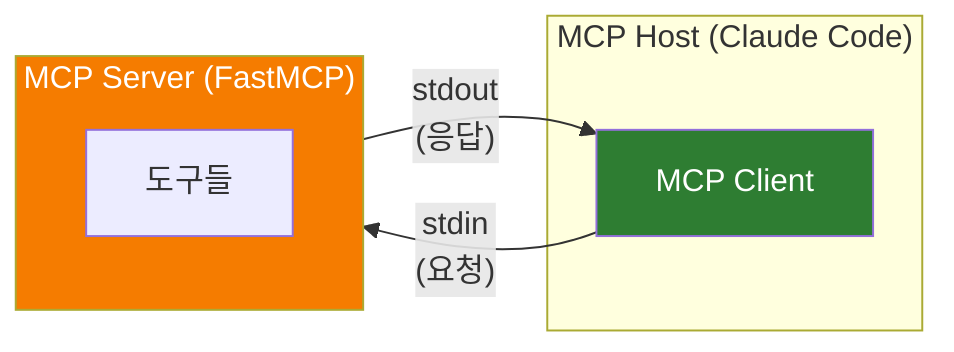
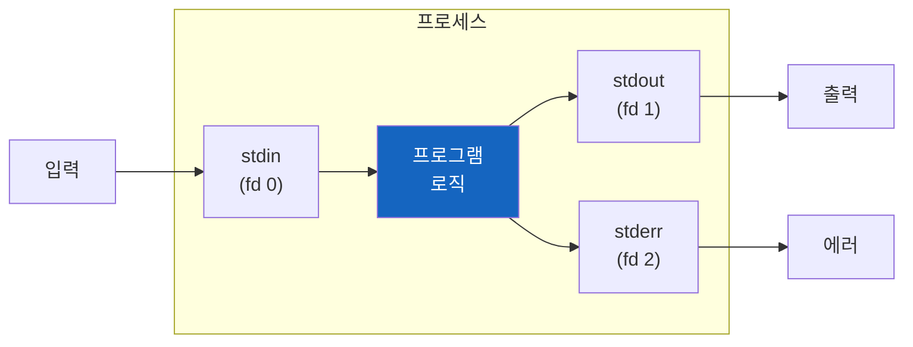
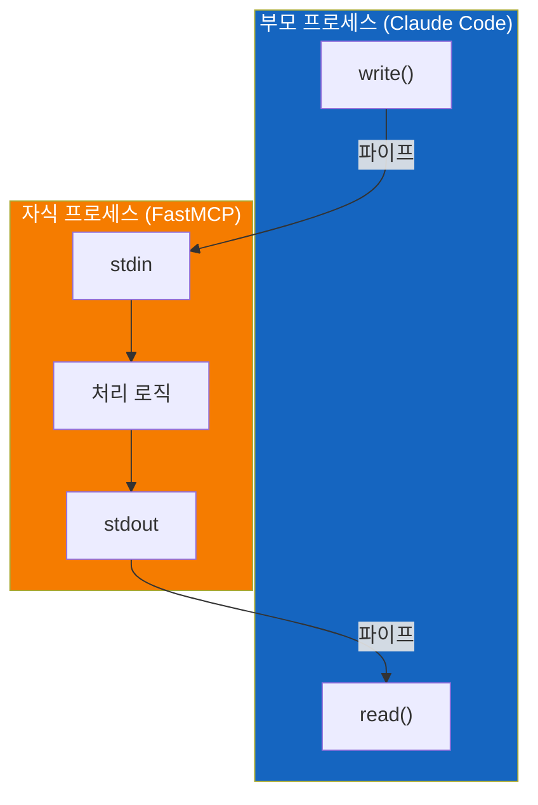
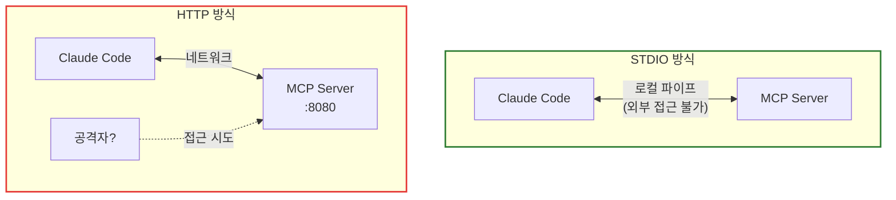
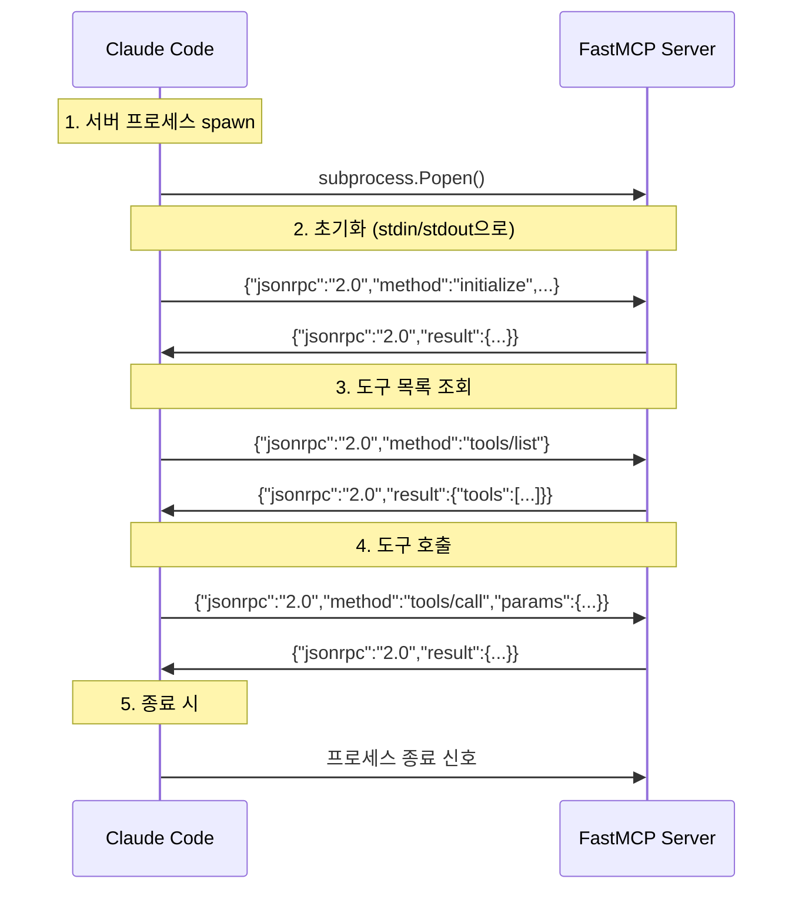
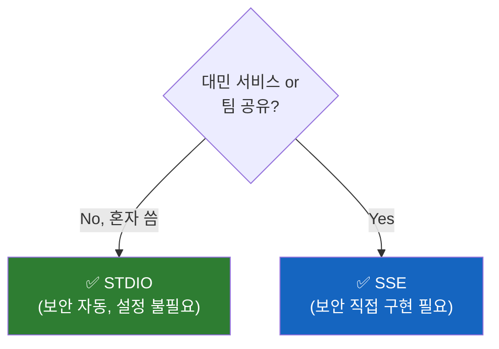
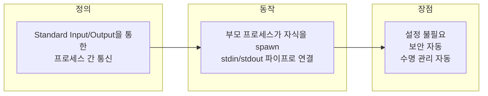

# MCP의 STDIO Transport 이해하기

"📦 Transport: STDIO"라는 메시지를 보고 당황했다면, 이 글이 도움이 될 것이다.

## 결론부터 말하면

**STDIO는 새로운 프로토콜이 아니다.** 1970년대 Unix부터 존재한 가장 원시적인 프로세스 간 통신 방식이다.



| 구분 | 설명 |
|------|------|
| **STDIO** | Standard Input/Output의 약자 |
| **역할** | MCP Client와 Server가 메시지를 주고받는 **통신 채널** |
| **특징** | 네트워크 없이 프로세스 간 파이프로 직접 연결 |

**핵심:** STDIO는 "어떻게 데이터를 보내는가"에 대한 답이다. "무슨 데이터를 보내는가"는 MCP 프로토콜(JSON-RPC)이 정의한다.

## 1. 두 프로그램이 대화하려면?

### 1.1 문제 상황

Claude Code가 FastMCP 서버의 도구를 사용하려면 둘이 **대화** 해야 한다. Claude Code가 "날씨 알려줘"라고 요청하면, FastMCP 서버가 "서울은 15도야"라고 응답해야 한다.

그런데 둘은 완전히 **별개의 프로그램** 이다. 어떻게 대화할 수 있을까?


### 1.2 프로그램 간 통신 방법들

컴퓨터 과학에서 프로그램 간 통신(IPC, Inter-Process Communication)에는 여러 방법이 있다.

| 방법 | 설명 | 예시 |
|------|------|------|
| **파일** | 파일에 쓰고 읽기 | A가 파일에 쓰면 B가 읽음 |
| **소켓** | 네트워크 통신 | HTTP, TCP/IP |
| **공유 메모리** | 메모리 영역 공유 | 고성능 통신에 사용 |
| **파이프** | 데이터 스트림 연결 | **stdin/stdout** |

이 중에서 가장 **단순하고 오래된** 방법이 바로 파이프, 즉 STDIO다.

## 2. STDIO: 가장 오래된 대화 방법

### 2.1 Unix의 철학

1970년대 Unix를 만든 사람들은 이런 철학을 가졌다:

> "작은 프로그램들을 파이프로 연결하여 복잡한 작업을 수행하자"

```bash
# Unix 파이프 예시
cat file.txt | grep "error" | wc -l
```

이 명령어를 분해해보면:


`cat`의 출력(stdout)이 `grep`의 입력(stdin)으로 들어가고, `grep`의 출력이 `wc`의 입력으로 들어간다. 이게 바로 **파이프** 다.

### 2.2 stdin, stdout, stderr

모든 프로그램은 태어날 때부터 세 개의 통로를 가진다.



| 스트림 | File Descriptor | 용도 | 기본 연결 |
|--------|-----------------|------|----------|
| **stdin** | 0 | 입력 받기 | 키보드 |
| **stdout** | 1 | 출력 보내기 | 화면 |
| **stderr** | 2 | 에러 출력 | 화면 |

**핵심 통찰:** 이 세 통로는 **재연결(redirect)** 이 가능하다!

```bash
# 기본: 키보드 → 프로그램 → 화면
./program

# stdin을 파일로 변경 <<헷갈리는 주석임. 입력을 파일에서 받기 또는  파일 내용을 입력으로 넣기
./program < input.txt

# stdout을 파일로 변경
./program > output.txt

# 다른 프로그램과 연결
./program_a | ./program_b

# 1. 표준 출력만 파일로 저장 (에러는 여전히 화면에 뜸)
./program > output.txt

# 2. 에러(fd 2)만 별도 파일로 저장
./program 2> error.log

# 3. 표준 출력과 에러를 모두 같은 파일에 저장 (자주 쓰이는 패턴)
./program > all_output.log 2>&1
```

### 2.3 부모-자식 프로세스 연결

프로그램 A가 프로그램 B를 실행(spawn)하면 어떻게 될까?

```python
# 부모 프로세스 (Claude Code)
import subprocess

# 자식 프로세스 실행 (FastMCP Server)
process = subprocess.Popen(
    ["python", "server.py"],
    stdin=subprocess.PIPE,   # 부모가 자식의 stdin에 쓸 수 있음
    stdout=subprocess.PIPE,  # 부모가 자식의 stdout을 읽을 수 있음 (JSON-RPC 메시지)
    stderr=subprocess.PIPE,  # 부모가 자식의 stderr를 읽을 수 있음 (로그/디버깅용)
)

# 자식에게 메시지 보내기
process.stdin.write(b'{"jsonrpc": "2.0", "method": "get_weather", "id": 1}\n')  # \n = 메시지 끝 표시
process.stdin.flush()  # 버퍼를 비워야 즉시 전달됨 (없으면 자식이 메시지를 못 받을 수 있음)

# 자식의 응답 받기 (\n까지 읽음)
response = process.stdout.readline()
```



이제 두 프로세스가 대화할 수 있다!

## 3. MCP에서 STDIO를 쓰는 이유

### 3.1 MCP의 Transport 옵션

MCP 프로토콜은 **통신 내용**(JSON-RPC 메시지)과 **통신 방법**(Transport)을 분리했다. Transport는 두 가지가 있다:

| Transport | 통신 경로 | 연결 방식 | 사용 사례 |
|-----------|----------|----------|----------|
| **STDIO** | 프로세스 파이프 | 부모가 자식을 spawn | 로컬 도구, CLI |
| **SSE** | HTTP 네트워크 | 클라이언트가 서버에 연결 | 원격 서버, 웹 |

### 3.2 왜 STDIO가 기본인가?

**의문:** 왜 MCP는 STDIO를 기본으로 선택했을까? HTTP가 더 익숙하지 않나?

**이유 1: 설정이 필요 없다**

```bash
# STDIO: 그냥 실행하면 끝
python server.py

# HTTP: 포트 설정, 방화벽, CORS...
python server.py --port 8080 --host 0.0.0.0
```

**이유 2: 보안이 자동으로 해결된다**



STDIO는 프로세스 간 파이프이므로 **외부에서 접근이 불가능** 하다. 네트워크 포트를 열지 않기 때문에 방화벽 설정도 필요 없다.

**이유 3: 수명 관리가 자동이다**

```
STDIO:
Claude Code 종료 → MCP Server도 자동 종료 (자식 프로세스니까)

HTTP:
Claude Code 종료 → MCP Server는 계속 실행 중 (별도 관리 필요)
```

### 3.3 실제 동작 흐름

Claude Code에서 FastMCP 서버를 사용하면 내부적으로 이런 일이 벌어진다:



모든 메시지가 stdin/stdout을 통해 JSON-RPC 형식으로 오간다.

## 4. STDIO vs SSE 비교

### 4.1 핵심 차이: "누가 쓰는가?"

**한 줄 요약:**
- **STDIO** = 혼자 쓸 때 (로컬)
- **SSE** = 여러 명이 쓸 때 (팀, 대민 서비스)

#### 상황 1: 혼자 쓸 때 (STDIO)

```
내 맥북
┌─────────────────────────────────────────┐
│                                         │
│  Claude Code ◄──── 파이프 ────► MCP Server  │
│              (내부 연결, 외부 접근 불가)     │
│                                         │
└─────────────────────────────────────────┘
```

- 부모(Claude Code)가 자식(MCP Server)을 **직접 실행**
- 파이프는 둘만의 **전용 통로**
- 외부에서 이 통로에 접근할 방법이 **없음** → 보안 자동 해결

#### 상황 2: 여러 명이 쓸 때 (SSE)

```
철수 맥북                              회사 서버
┌─────────────┐                     ┌─────────────┐
│ Claude Code │ ────── HTTP ──────► │             │
└─────────────┘                     │  MCP Server │
                                    │  :8080 열림  │
영희 맥북                            │             │
┌─────────────┐                     │             │
│ Claude Code │ ────── HTTP ──────► │             │
└─────────────┘                     └─────────────┘

해커?
┌─────────────┐
│   ??? 　    │ ────── HTTP ──────► 접근 시도 가능!
└─────────────┘
```

- 서버가 **포트를 열고 기다림**
- 누구든 그 포트로 **접속 가능** (1:N)
- 외부에 열려 있으므로 **보안 직접 구현 필요** (인증, HTTPS 등)

#### 비유로 정리

| 방식 | 비유 | 특징 |
|------|------|------|
| **STDIO** | 내선 전화 (직통선) | 둘만 사용, 외부 접근 불가 |
| **SSE** | 대표 전화번호 | 누구나 전화 가능, 보안 필요 |

#### 결론: 언제 무엇을 쓰나?



| 상황 | 추천 Transport | 보안 |
|------|---------------|------|
| 혼자 로컬에서 개발 | **STDIO** | 자동 (신경 쓸 것 없음) |
| 팀 내부 공유 서버 | **SSE** | 인증 필요 |
| 대민 오픈 서비스 | **SSE** | 인증 + HTTPS + 방화벽 등 |
| 빠른 프로토타이핑 | **STDIO** | 자동 |

### 4.2 상세 비교

| 특성 | STDIO | SSE |
|------|-------|-----|
| **설정 복잡도** | 낮음 (그냥 실행) | 높음 (포트, 호스트, 인증) |
| **보안** | 자동 (로컬 파이프) | 직접 구현 (인증, HTTPS) |
| **네트워크** | 불필요 | 필요 |
| **다중 클라이언트** | 불가 (1:1) | 가능 (1:N) |
| **원격 접근** | 불가 | 가능 |
| **수명 관리** | 자동 (부모-자식) | 수동 |
| **디버깅** | stderr로 로그 출력 (stdout은 JSON-RPC 전용) | 쉬움 (HTTP 도구 사용) |

### 4.3 SSE 방식 예시

```python
# SSE Transport로 실행
from fastmcp import FastMCP

mcp = FastMCP("my-server")

@mcp.tool()
def hello(name: str) -> str:
    return f"Hello, {name}!"

# HTTP 서버로 실행
if __name__ == "__main__":
    mcp.run(transport="sse", port=8080)
```

```
📦 Transport:   SSE (Server-Sent Events)
🌐 Server:      http://localhost:8080
```

## 5. 자주 하는 오해

### 오해 1: "STDIO는 느리다"

**사실:** 네트워크 오버헤드가 없어서 오히려 **가장 빠르다**. 같은 머신의 메모리 버퍼를 통해 직접 전달되기 때문이다.

### 오해 2: "STDIO는 텍스트만 보낼 수 있다"

**사실:** 바이트 스트림이므로 **무엇이든** 보낼 수 있다. MCP는 JSON-RPC 텍스트를 보내지만, 이미지나 바이너리도 Base64 인코딩으로 전송 가능하다.

### 오해 3: "STDIO는 구식 기술이다"

**사실:** 50년 된 기술이지만 **현대에도 널리 사용** 된다.

| 도구 | STDIO 사용 방식 |
|------|----------------|
| Docker | 컨테이너 로그 |
| Git | 외부 도구 연동 |
| LSP | 에디터 ↔ 언어 서버 |
| **MCP** | AI ↔ 도구 서버 |

## 6. 정리

### STDIO Transport란?



### 핵심 요약

| 질문 | 답변 |
|------|------|
| STDIO가 프로토콜인가? | **아니다.** 통신 채널(Transport)이다 |
| 새로운 기술인가? | **아니다.** 1970년대 Unix부터 존재 |
| MCP에서 왜 사용하나? | 설정 없이 안전하게 로컬 통신 |
| 언제 다른 걸 쓰나? | 원격 접근이나 다중 클라이언트 필요 시 SSE |

### MCP 통신의 전체 그림

```
┌─────────────────────────────────────────────────────────┐
│                      MCP 프로토콜                         │
│                    (무엇을 보내는가)                       │
│                                                         │
│   ┌─────────────┐    JSON-RPC     ┌─────────────┐      │
│   │   Client    │ ◄─────────────► │   Server    │      │
│   └─────────────┘                 └─────────────┘      │
│                                                         │
├─────────────────────────────────────────────────────────┤
│                      Transport                          │
│                   (어떻게 보내는가)                        │
│                                                         │
│        ┌──────────┐         ┌──────────┐               │
│        │  STDIO   │         │   SSE    │               │
│        │ (파이프)  │         │ (HTTP)   │               │
│        └──────────┘         └──────────┘               │
└─────────────────────────────────────────────────────────┘
```

## 출처

- [MCP Specification - Transports](https://spec.modelcontextprotocol.io/specification/basic/transports/) - 공식 스펙
- [FastMCP Documentation](https://gofastmcp.com/servers/transports) - Transport 설명
- [Unix Philosophy](https://en.wikipedia.org/wiki/Unix_philosophy) - Unix 철학
- [Standard Streams](https://en.wikipedia.org/wiki/Standard_streams) - stdin/stdout/stderr
