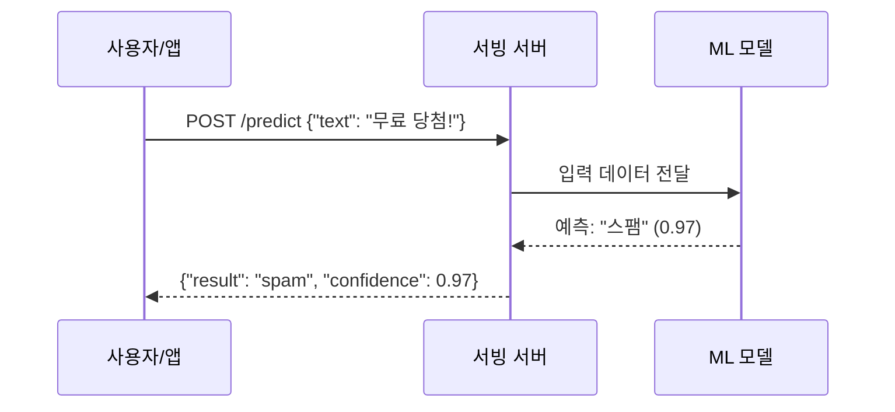
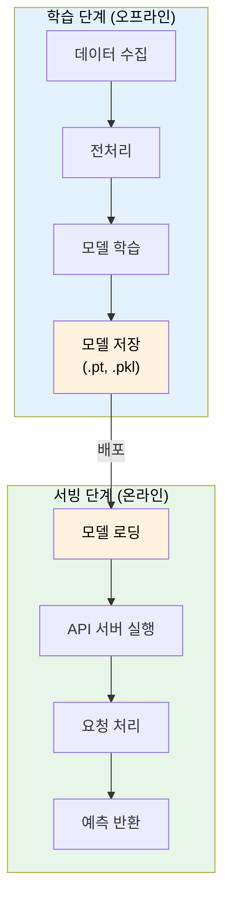
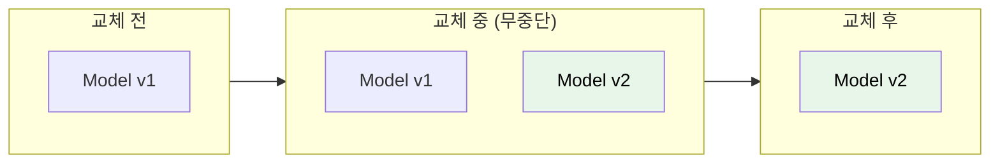
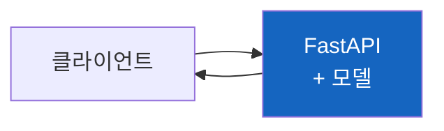
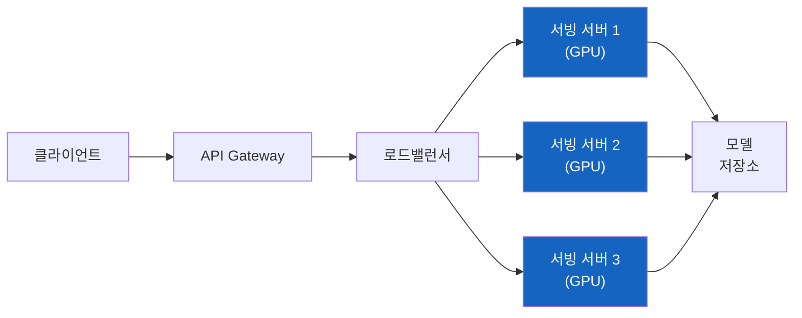
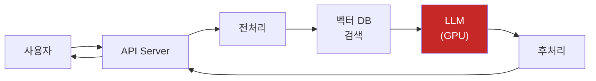

# ML 모델 서빙이란 무엇인가

"모델 서빙"이라는 말을 처음 들으면 뭔가 거창해 보인다. 하지만 본질은 단순하다. **레스토랑에서 요리를 손님에게 "서빙"하는 것** 과 똑같다.

## 결론부터 말하면

**ML 모델 서빙은 학습된 모델을 API로 노출해서 실시간 예측 요청을 처리하는 것이다.**


| 레스토랑 비유 | ML 세계 |
|-------------|---------|
| 레시피 개발 | **모델 학습 (Training)** |
| 레시피 파일 | **모델 파일 (.pt, .pkl, .h5)** |
| 주방에 배치 | **모델 로딩** |
| 주문 받고 요리 제공 | **모델 서빙 (Serving)** |
| 손님의 주문 | **API 요청 (입력 데이터)** |
| 완성된 요리 | **예측 결과 (출력)** |

---

## 1. 왜 "서빙"이라는 개념이 필요한가?

### 1.1 학습과 서빙은 완전히 다른 일

ML을 처음 접하면 "모델 만들기"에만 집중한다. Jupyter Notebook에서 학습하고, 정확도 측정하고, 끝.

```python
# 학습 (Training) - Data Scientist의 영역
model = RandomForestClassifier()
model.fit(X_train, y_train)
print(f"정확도: {model.score(X_test, y_test)}")  # 95%! 끝?
```

하지만 이 모델을 **실제 서비스에서 사용하려면** 어떻게 해야 할까?

```
사용자: "이 이메일이 스팸인지 알려줘"
시스템: ???
```

Jupyter Notebook을 24시간 켜놓을 수는 없다. 누군가 요청할 때마다 모델이 응답해야 한다.

### 1.2 서빙의 본질: 모델을 API로 노출



**서빙 = 학습된 모델을 HTTP API로 감싸서 요청을 받고 응답하는 것**

Java 개발자에게 익숙한 비유:
- **모델 학습** = 비즈니스 로직 개발
- **모델 서빙** = Spring Boot로 REST API 만들기

```java
// Java 개발자가 하는 일
@RestController
public class UserController {
    @PostMapping("/users")
    public User createUser(@RequestBody UserRequest request) {
        return userService.create(request);  // 비즈니스 로직 호출
    }
}
```

```python
# ML 엔지니어가 하는 일 (모델 서빙)
@app.post("/predict")
async def predict(request: PredictRequest):
    return model.predict(request.data)  # 모델 호출
```

구조가 똑같다!

---

## 2. 모델 서빙의 흐름

### 2.1 전체 ML 파이프라인에서의 위치



| 단계 | 특징 | 주기 |
|------|------|------|
| **학습** | 시간이 오래 걸림 (분~일) | 가끔 (일/주/월) |
| **서빙** | 빠른 응답 필요 (ms~s) | 항상 (24/7) |

### 2.2 실제 서빙 코드 예시

**1단계: 모델 저장 (학습 후)**
```python
import pickle

# 학습 완료 후 모델 저장
model = train_model(data)
with open("spam_classifier.pkl", "wb") as f:
    pickle.dump(model, f)
```

**2단계: 서빙 서버 구현**
```python
from fastapi import FastAPI
from pydantic import BaseModel
import pickle

app = FastAPI()

# 서버 시작 시 모델 로딩 (한 번만)
with open("spam_classifier.pkl", "rb") as f:
    model = pickle.load(f)

class PredictRequest(BaseModel):
    text: str

class PredictResponse(BaseModel):
    result: str
    confidence: float

@app.post("/predict", response_model=PredictResponse)
async def predict(request: PredictRequest):
    # 예측 수행
    prediction = model.predict([request.text])[0]
    probability = model.predict_proba([request.text])[0].max()

    return PredictResponse(
        result="spam" if prediction == 1 else "ham",
        confidence=float(probability)
    )
```

**3단계: 서버 실행**
```bash
uvicorn main:app --host 0.0.0.0 --port 8000
```

**4단계: API 호출**
```bash
curl -X POST "http://localhost:8000/predict" \
  -H "Content-Type: application/json" \
  -d '{"text": "축하합니다! 무료 상품에 당첨되셨습니다!"}'

# 응답
{"result": "spam", "confidence": 0.97}
```

---

## 3. 왜 모델 서빙이 어려운가?

단순히 FastAPI로 감싸면 끝일 것 같지만, 실무에서는 여러 문제가 발생한다.

### 3.1 모델이 무겁다

```python
# 일반 API 서버
def get_user(user_id):
    return db.query(user_id)  # 몇 MB 메모리

# ML 모델 서버
def predict(image):
    return model.predict(image)  # 수 GB 메모리, GPU 필요
```

| 구분 | 일반 API | ML 서빙 |
|------|---------|---------|
| 메모리 | 수백 MB | **수 GB ~ 수십 GB** |
| CPU/GPU | CPU | **GPU 필요 (딥러닝)** |
| 로딩 시간 | 즉시 | **수 초 ~ 수 분** |
| 응답 시간 | 수 ms | **수십 ms ~ 수 초** |

### 3.2 트래픽 처리

```
일반 API: 요청 100개 → 서버 100개 복제 → 끝
ML 서빙: 요청 100개 → GPU 서버 100개? 💸💸💸
```

GPU는 비싸다. 효율적으로 사용해야 한다.

**해결책: 배칭 (Batching)**
```python
# 요청 하나씩 처리 (비효율)
predict(image1)  # GPU 10% 사용
predict(image2)  # GPU 10% 사용
predict(image3)  # GPU 10% 사용

# 배치로 처리 (효율)
predict([image1, image2, image3])  # GPU 90% 사용
```

배칭에는 두 가지 방식이 있다:

| 방식 | 설명 | 사용 시점 |
|------|------|----------|
| **정적 배칭** | 클라이언트가 여러 데이터를 묶어서 요청 | 배치 작업 (오프라인) |
| **동적 배칭** | 서버가 여러 사용자 요청을 모아서 처리 | 실시간 서빙 (온라인) |

동적 배칭은 서빙 프레임워크(Triton, TorchServe, Ray Serve)가 자동으로 처리한다. 짧은 시간(예: 10ms) 동안 들어온 요청을 모아서 GPU에 한 번에 전달한다.

### 3.3 모델 업데이트

새로운 모델을 배포하면서 서비스 중단 없이 교체해야 한다.



---

## 4. 모델 서빙 방법들

### 4.1 직접 구현

```python
# FastAPI / Flask로 직접 구현
from fastapi import FastAPI

app = FastAPI()
model = load_model()

@app.post("/predict")
async def predict(data):
    return model.predict(data)
```

**장점:** 단순, 커스터마이징 자유
**단점:** 스케일링, 배칭, 모니터링 직접 구현 필요

### 4.2 전용 서빙 프레임워크

| 프레임워크 | 특화 영역 | 특징 |
|-----------|---------|------|
| **Ray Serve** | 범용 ML | FastAPI 통합, 모델 조합 |
| **TensorFlow Serving** | TensorFlow | gRPC, 고성능 |
| **TorchServe** | PyTorch | 배칭, 버전 관리 |
| **Triton** | NVIDIA | 멀티 프레임워크, GPU 최적화 |
| **BentoML** | 범용 ML | 패키징, 배포 자동화 |

### 4.3 클라우드 서비스

| 서비스 | 제공사 |
|--------|--------|
| SageMaker Endpoints | AWS |
| Vertex AI | Google Cloud |
| Azure ML | Microsoft |

---

## 5. Spring 개발자를 위한 비유 정리

| ML 개념 | Spring 비유 |
|---------|------------|
| 모델 학습 | 비즈니스 로직 개발 |
| 모델 파일 (.pt) | JAR 파일 |
| 모델 서빙 | Spring Boot 앱 배포 |
| 서빙 프레임워크 | Spring Cloud (스케일링) |
| 배칭 | DB 배치 처리 |
| 모델 버전 관리 | Git + CI/CD |

```
[개발자가 코드 작성] → [JAR 빌드] → [서버 배포] → [API 제공]
[ML이 모델 학습]    → [모델 저장] → [서버 배포] → [예측 API 제공]
```

---

## 6. 실무에서 자주 보는 서빙 아키텍처

### 6.1 단순 구조 (소규모)



### 6.2 확장 구조 (대규모)



### 6.3 LLM 서빙 (최신)



---

## 정리

> **핵심:** 모델 서빙 = 학습된 모델을 API로 노출해서 예측 요청을 처리하는 것

| 질문 | 답변 |
|------|------|
| 서빙이 뭐야? | 레스토랑에서 요리를 손님에게 전달하는 것 |
| 왜 필요해? | 학습된 모델을 실제 서비스에서 사용하려면 |
| 뭐가 어려워? | 모델이 무겁고, GPU가 비싸고, 스케일링이 필요 |
| 어떻게 해? | FastAPI 직접 구현 or 전용 프레임워크 사용 |

### ML 파이프라인 요약

```
데이터 → 학습 → 모델 저장 → [서빙] → 예측 API
                              ↑
                          여기가 서빙!
```

---

## 출처

- [Ray Serve 공식 문서](https://docs.ray.io/en/latest/serve/index.html)
- [TensorFlow Serving](https://www.tensorflow.org/tfx/guide/serving)
- [TorchServe](https://pytorch.org/serve/)
- [BentoML](https://docs.bentoml.com/)
