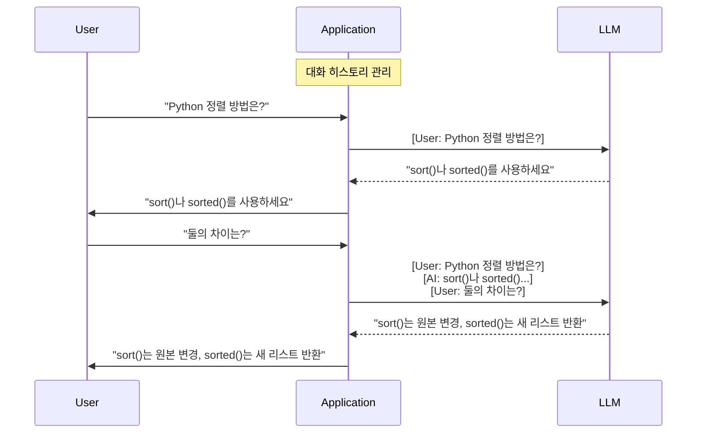
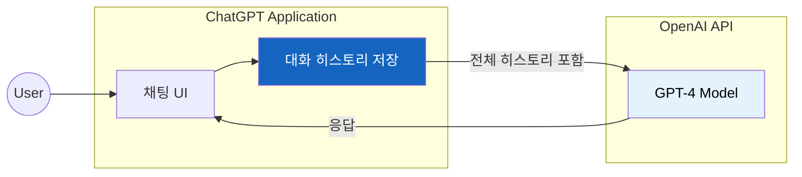
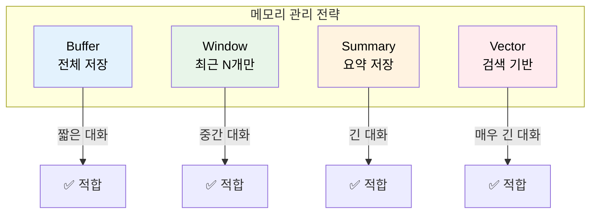

# Multi-turn Conversation (멀티턴 대화)

"둘의 차이가 뭐야?"라고 물었을 때, AI가 "뭐랑 뭐요?"라고 되묻는다면 어떨까?

## 결론부터 말하면

**멀티턴(Multi-turn)** 은 여러 번의 왕복 대화를 통해 **맥락을 유지** 하는 대화 방식이다. LLM은 기본적으로 각 요청을 독립적으로 처리하므로, 멀티턴을 구현하려면 **이전 대화 히스토리를 명시적으로 전달** 해야 한다.



| 구분 | Single-turn | Multi-turn |
|------|-------------|------------|
| 대화 횟수 | 1회 질문-답변 | 여러 번 왕복 |
| 맥락 유지 | ❌ 없음 | ✅ 이전 대화 기억 |
| 구현 | 단순 | 히스토리 관리 필요 |
| 비용 | 낮음 | 높음 (전체 히스토리 전송) |

---

## 1. 왜 멀티턴이 필요한가?

### 1.1 LLM은 기억력이 없다

LLM API를 직접 호출해본 적이 있다면 이상한 점을 발견했을 것이다. 분명 방금 대화했는데, 다음 질문에서 이전 내용을 전혀 기억하지 못한다.

```python
# Turn 1
response = llm.invoke("Python에서 리스트를 정렬하는 방법은?")
# "list.sort() 또는 sorted(list)를 사용하세요."

# Turn 2
response = llm.invoke("둘의 차이는 뭐야?")
# "뭐랑 뭐의 차이를 말씀하시는 건가요?" 😕
```

왜 이런 일이 벌어질까?

**LLM API는 Stateless(무상태)다.** 각 요청은 완전히 독립적으로 처리된다. 서버 측에서 이전 대화를 저장하지 않는다. 마치 매번 새로운 사람과 대화하는 것과 같다.

### 1.2 그렇다면 ChatGPT는 어떻게?

"잠깐, ChatGPT는 이전 대화를 잘 기억하는데?"

맞다. 하지만 그건 **ChatGPT 애플리케이션** 이 해주는 것이지, LLM 자체의 기능이 아니다.



ChatGPT 애플리케이션이 하는 일:
1. 모든 대화를 저장
2. 새 질문할 때 **이전 대화 전체를 함께 전송**
3. LLM은 그 전체를 보고 맥락을 파악

**즉, 멀티턴은 애플리케이션 레벨에서 구현해야 하는 기능이다.**

### 1.3 직접 구현한다면?

가장 단순한 멀티턴 구현은 이렇다:

```python
from langchain_openai import ChatOpenAI
from langchain_core.messages import HumanMessage, AIMessage

llm = ChatOpenAI(model="gpt-4")

# 대화 히스토리를 직접 관리
messages = []

# Turn 1
messages.append(HumanMessage(content="Python에서 리스트를 정렬하는 방법은?"))
response = llm.invoke(messages)
messages.append(response)
print(response.content)
# "list.sort() 또는 sorted(list)를 사용하세요."

# Turn 2 - 이전 대화가 포함되어 있으므로 맥락 파악 가능!
messages.append(HumanMessage(content="둘의 차이는 뭐야?"))
response = llm.invoke(messages)
messages.append(response)
print(response.content)
# "sort()는 원본을 변경하고, sorted()는 새 리스트를 반환합니다." ✅
```

간단해 보인다. 하지만 여기서 문제가 시작된다.

---

## 2. 멀티턴의 도전 과제

### 2.1 대화가 길어지면?

대화가 100턴이 넘어가면 어떻게 될까?

```
Turn 1: 100 토큰
Turn 2: 100 + 150 = 250 토큰
Turn 3: 250 + 200 = 450 토큰
...
Turn 50: 수만 토큰 💥
```

**문제 1: 토큰 제한**

LLM에는 컨텍스트 윈도우 제한이 있다. GPT-4는 8K~128K, Claude는 200K까지. 아무리 커도 무한하지 않다.

**문제 2: 비용 폭증**

매 요청마다 전체 히스토리를 보내므로, 대화가 길어질수록 비용이 누적되어 급격하게 증가한다. (토큰 수가 등차수열의 합으로 늘어나 $O(n^2)$ 에 가까워진다)

**문제 3: 응답 지연**

토큰이 많아지면 처리 시간도 늘어난다.

### 2.2 해결책: 메모리 관리 전략

이 문제를 해결하기 위해 다양한 **메모리 관리 전략** 이 등장했다.



---

## 3. LangChain 메모리 구현

LangChain은 다양한 메모리 관리 전략을 제공한다.

> **참고:** 현재 LangChain에서는 상태 관리를 위해 `ConversationChain`보다 더 유연하고 강력한 **LangGraph** 사용을 권장하는 추세다. 이 문서의 예제는 메모리의 기본 개념을 이해하기 위한 것이다. 실제 프로덕션에서는 [LangGraph Persistence](https://langchain-ai.github.io/langgraph/how-tos/persistence/)를 참고하라.

### 3.1 ConversationBufferMemory (전체 저장)

가장 단순한 방식. 모든 대화를 그대로 저장한다.

```python
from langchain.chains import ConversationChain
from langchain_openai import ChatOpenAI
from langchain.memory import ConversationBufferMemory

memory = ConversationBufferMemory()

conversation = ConversationChain(
    llm=ChatOpenAI(model="gpt-4"),
    memory=memory,
    verbose=True
)

conversation.predict(input="Python이 뭐야?")
conversation.predict(input="어디에 쓰여?")  # Python 맥락 유지
conversation.predict(input="배우기 어려워?")  # 여전히 Python 얘기
```

| 장점 | 단점 |
|------|------|
| 모든 대화 내용 보존 | 메모리 많이 사용 |
| 구현 단순 | 긴 대화에 부적합 |

**사용 시기:** 짧은 대화, 모든 맥락이 중요한 경우

### 3.2 ConversationBufferWindowMemory (최근 N개)

최근 N개 턴만 유지하고 나머지는 버린다.

```python
from langchain.memory import ConversationBufferWindowMemory

# 최근 5턴만 저장
memory = ConversationBufferWindowMemory(k=5)
```

| 장점 | 단점 |
|------|------|
| 메모리 사용량 제한 | 오래된 대화 손실 |
| 예측 가능한 비용 | 초반 맥락 잊음 |

**사용 시기:** 최근 맥락만 중요한 경우 (예: 일반 상담)

### 3.3 ConversationSummaryMemory (요약)

대화를 LLM으로 요약해서 저장한다.

```python
from langchain.memory import ConversationSummaryMemory
from langchain_openai import ChatOpenAI

memory = ConversationSummaryMemory(
    llm=ChatOpenAI(model="gpt-4")
)
```

| 장점 | 단점 |
|------|------|
| 긴 대화도 압축 가능 | 요약 과정에서 정보 손실 |
| 핵심만 유지 | 요약에 추가 비용 발생 |

**사용 시기:** 매우 긴 대화, 핵심만 필요한 경우

### 3.4 ConversationSummaryBufferMemory (요약 + 최근)

과거는 요약하고, 최근 대화는 그대로 유지하는 하이브리드 방식.

```python
from langchain.memory import ConversationSummaryBufferMemory

memory = ConversationSummaryBufferMemory(
    llm=ChatOpenAI(model="gpt-4"),
    max_token_limit=2000  # 이 이상이면 오래된 것 요약
)
```

| 장점 | 단점 |
|------|------|
| 최근 대화는 상세히 유지 | 설정이 복잡함 |
| 오래된 맥락도 요약으로 보존 | 요약 비용 발생 |

**사용 시기:** 긴 대화에서 최근 맥락이 특히 중요한 경우

### 3.5 ConversationTokenBufferMemory (토큰 기반)

토큰 수로 메모리를 관리한다.

```python
from langchain.memory import ConversationTokenBufferMemory

memory = ConversationTokenBufferMemory(
    llm=ChatOpenAI(model="gpt-4"),
    max_token_limit=2000  # 최대 2000 토큰
)
```

**사용 시기:** 토큰 비용 제어가 중요한 경우

### 3.6 VectorStoreRetrieverMemory (벡터 검색)

대화가 발생할 때마다 **자동으로 벡터 DB에 저장** 하고, 새 질문이 들어오면 의미적으로 **관련된 과거 대화만 검색** 해서 컨텍스트에 포함한다.

```python
from langchain.memory import VectorStoreRetrieverMemory
from langchain.chains import ConversationChain
from langchain_openai import OpenAIEmbeddings, ChatOpenAI
from langchain_community.vectorstores import Chroma

vectorstore = Chroma(embedding_function=OpenAIEmbeddings())
retriever = vectorstore.as_retriever(search_kwargs={"k": 5})

memory = VectorStoreRetrieverMemory(retriever=retriever)

conversation = ConversationChain(
    llm=ChatOpenAI(model="gpt-4"),
    memory=memory,
    verbose=True
)

# predict 호출 시, 대화가 벡터 DB에 저장되고 관련 내용이 검색됨
conversation.predict(input="내 이름은 홍길동이고, 파이썬을 배우고 싶어.")
# ... 100턴 후 ...
conversation.predict(input="내 이름이 뭐라고 했지?")  # 관련 대화를 검색해서 답변
```

| 장점 | 단점 |
|------|------|
| 의미적으로 관련된 과거 대화 검색 | 설정 복잡 |
| 매우 긴 대화 히스토리 가능 | 인프라 필요 (벡터 DB) |

**사용 시기:** 특정 주제 관련 과거 대화 참조가 필요한 경우

### 3.7 메모리 선택 가이드

| Memory 타입 | 대화 길이 | 비용 | 복잡도 | 추천 상황 |
|------------|----------|------|--------|---------|
| BufferMemory | 짧음 | 낮음 | 낮음 | 단순 챗봇 |
| BufferWindowMemory | 중간 | 낮음 | 낮음 | 일반 상담 |
| SummaryMemory | 긺 | 높음 | 중간 | 긴 상담 세션 |
| SummaryBufferMemory | 긺 | 중간 | 중간 | 균형잡힌 접근 |
| TokenBufferMemory | 중간 | 중간 | 중간 | 비용 제어 |
| VectorStoreMemory | 매우 긺 | 높음 | 높음 | 의미 검색 필요 |

---

## 4. 실제 활용 사례

### 4.1 Multi-turn이 필수인 경우

**고객 상담 챗봇**

```
User: "환불하고 싶어요"
Bot: "네, 주문번호를 알려주세요"
User: "1234입니다"  ← "환불" 맥락 유지
Bot: "1234 주문 확인했습니다. 환불 사유는?"
User: "사이즈가 안 맞아요"
Bot: "알겠습니다. 환불 처리하겠습니다"
```

**코딩 튜터**

```
User: "for 문 사용법 알려줘"
AI: [for 문 설명]
User: "예제 보여줘"  ← for 문 맥락 유지
AI: [for 문 예제]
User: "range는 뭐야?"  ← 여전히 for 문 맥락
AI: [range 설명]
```

### 4.2 Single-turn으로 충분한 경우

- 검색 엔진 (독립적인 검색)
- 번역 서비스 (문장별 번역)
- 텍스트 분류 (감성 분석 등)
- 문서 요약 (한 번에 요약)

---

## 5. 구현 팁

### 5.1 세션 관리

사용자별로 대화 히스토리를 분리해야 한다.

```python
from datetime import datetime

user_sessions = {}

def get_or_create_session(user_id):
    if user_id not in user_sessions:
        user_sessions[user_id] = {
            "messages": [],
            "created_at": datetime.now()
        }
    return user_sessions[user_id]
```

### 5.2 타임아웃 설정

오래된 세션은 정리해야 한다.

```python
SESSION_TIMEOUT = 1800  # 30분

def is_session_expired(session):
    elapsed = (datetime.now() - session["last_activity"]).seconds
    return elapsed > SESSION_TIMEOUT
```

### 5.3 컨텍스트 윈도우 관리

```python
MAX_MESSAGES = 20

def add_message(session, message):
    session["messages"].append(message)

    if len(session["messages"]) > MAX_MESSAGES:
        session["messages"] = session["messages"][-MAX_MESSAGES:]
```

### 5.4 중요 정보는 시스템 프롬프트에

먼 과거의 대화는 잊혀질 수 있다. 중요한 정보는 시스템 프롬프트에 저장하라.

```python
system_prompt = """
사용자 정보:
- 이름: 홍길동
- 선호 언어: Python
- 이전 질문 주제: 정렬 알고리즘
"""
```

---

## 6. 정리

### 왜 멀티턴이 필요한가?

LLM API는 **Stateless** 다. 이전 대화를 기억하지 않는다. 자연스러운 대화를 위해서는 애플리케이션에서 **대화 히스토리를 관리** 해야 한다.

### 핵심 개념

| 개념 | 설명 |
|------|------|
| Single-turn | 독립적인 1회 질문-답변 |
| Multi-turn | 맥락을 유지하며 연속 대화 |
| 메모리 관리 | 토큰 제한과 비용 때문에 필요 |

### 구현 핵심

```python
# 1. 히스토리 저장
messages = []

# 2. 새 메시지 추가
messages.append(HumanMessage(content="질문"))

# 3. 전체 히스토리와 함께 호출
response = llm.invoke(messages)

# 4. 응답도 히스토리에 추가
messages.append(response)
```

### 주의사항

- ⚠️ 토큰 제한: 대화가 길어지면 컨텍스트 윈도우 초과
- ⚠️ 비용 증가: 매번 전체 히스토리 전송
- ⚠️ 메모리 전략 선택: 상황에 맞는 전략 필요

---

## 출처

- [OpenAI - Chat Completions](https://platform.openai.com/docs/guides/chat-completions) - 공식 문서
- [Anthropic - Claude Conversations](https://docs.anthropic.com/en/docs/build-with-claude/prompt-engineering) - 공식 문서
- [LangChain Memory Types](https://python.langchain.com/docs/modules/memory/types/) - 공식 문서
- [LangGraph Persistence](https://langchain-ai.github.io/langgraph/how-tos/persistence/) - 최신 권장 방식
- [Pinecone - LangChain Conversational Memory](https://www.pinecone.io/learn/series/langchain/langchain-conversational-memory/)
