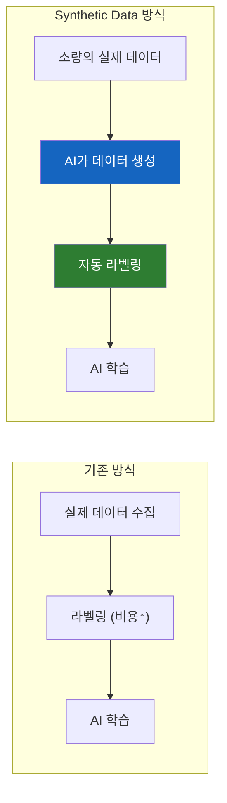
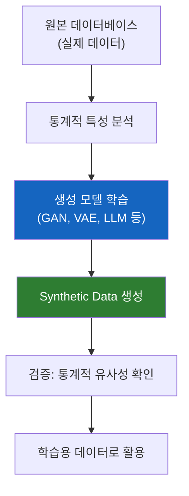
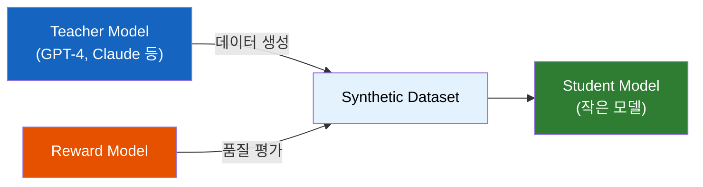
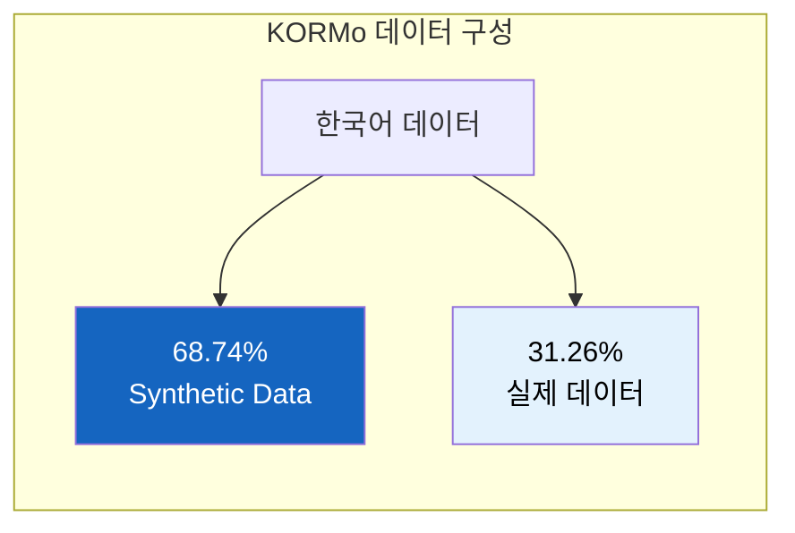
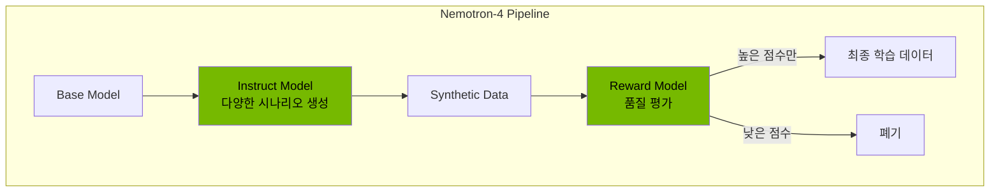
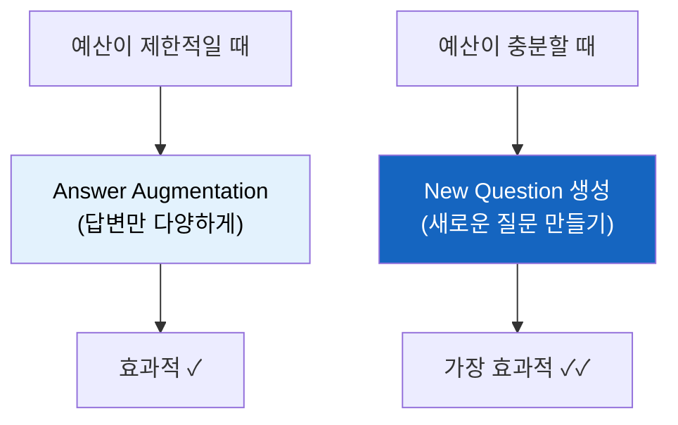
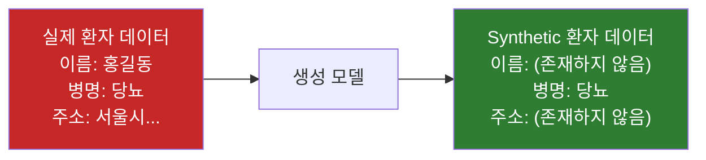
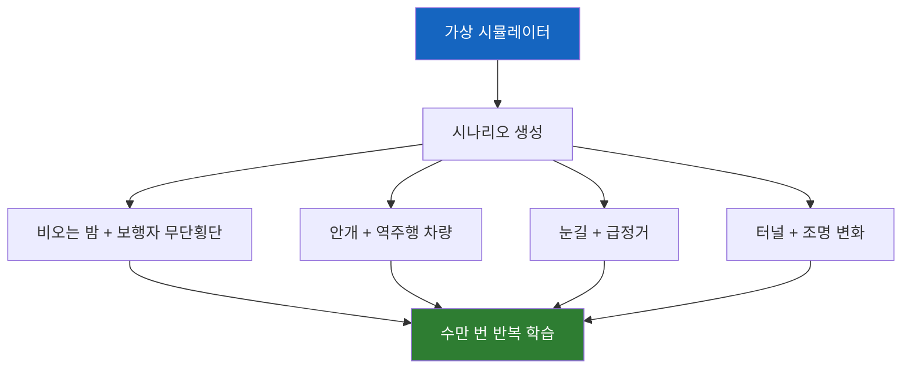
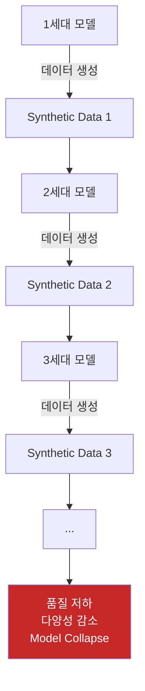
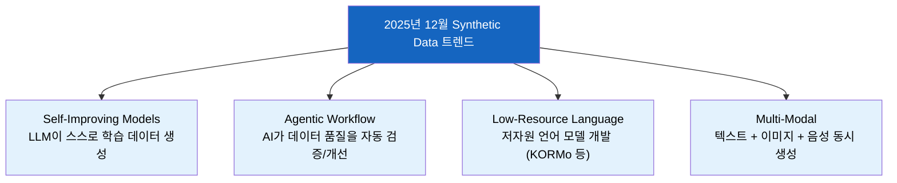

# Synthetic Data: AI 학습의 비밀 무기

"실제 데이터가 부족하면 AI를 못 만드는 거 아닌가요?" — 그렇지 않다. AI가 AI를 가르치는 시대가 왔다.

## 결론부터 말하면

**Synthetic Data(합성 데이터)** 는 실제 세계에서 수집한 것이 아니라 **인공적으로 생성된 데이터** 다. 실제 데이터의 통계적 특성을 그대로 모방하지만, 실제 정보는 전혀 포함하지 않는다.



| 구분 | 실제 데이터 | Synthetic Data |
|------|------------|----------------|
| 출처 | 현실 세계에서 수집 | AI가 인공적으로 생성 |
| 개인정보 | 포함 가능 (보호 필요) | **포함 안 함** (안전) |
| 희귀 케이스 | 수집하기 어려움 | **원하는 만큼 생성** 가능 |
| 비용 | 수집·라벨링에 높은 비용 | **저렴하고 빠름** |
| 편향 | 현실의 편향 그대로 | 의도적으로 균형 조절 가능 |

---

## 1. 왜 Synthetic Data가 필요해졌을까?

### 1.1 실제 데이터 수집의 한계

자율주행차를 만든다고 상상해보자. 이 AI가 안전하게 운전하려면 어떤 상황들을 학습해야 할까?

- 비 오는 밤에 갑자기 뛰어드는 보행자
- 역주행하는 차량
- 도로에 떨어진 대형 화물
- 갑작스러운 타이어 펑크

**문제는 이런 상황이 현실에서 매우 드물다는 것이다.** 아니, 드물어야 정상이다. 하지만 AI를 안전하게 학습시키려면 이런 위험한 상황을 수천, 수만 번 경험시켜야 한다.

실제로 이런 데이터를 모으려면 어떻게 해야 할까? 사고가 날 때까지 기다려야 하나? 그건 불가능하고, 윤리적으로도 문제다.

### 1.2 의료 데이터의 딜레마

또 다른 예를 보자. 희귀 질환을 진단하는 AI를 만들고 싶다.

문제 1: 희귀 질환이니까 **데이터 자체가 적다**. 전 세계에 환자가 1,000명밖에 없는 질환이라면?

문제 2: 환자 데이터는 **개인정보 보호법** 에 묶여 있다. HIPAA, GDPR 같은 규정 때문에 함부로 사용할 수 없다.

문제 3: 설령 데이터가 있어도 **라벨링 비용** 이 어마어마하다. 전문 의사가 일일이 "이건 암이다, 이건 아니다"라고 판단해야 한다.

**이런 상황에서 Synthetic Data가 해결책으로 등장했다.**

---

## 2. Synthetic Data란 정확히 무엇인가?

### 2.1 쉬운 비유: 사진 vs 그림

실제 데이터와 Synthetic Data의 관계를 사진과 그림에 비유할 수 있다.

```
실제 데이터 = 📷 사진
Synthetic Data = 🎨 그림
```

**사진**은 실제 존재하는 것을 그대로 담는다. 그 안에는 실제 사람, 실제 장소, 실제 정보가 들어있다.

**그림**은 화가가 상상하거나 참고해서 그린다. 실제처럼 보이지만, 그 안의 사람은 실존하지 않는다. 하지만 "사람이 이렇게 생겼구나, 나무는 이렇게 생겼구나"를 배우기에는 충분하다.

Synthetic Data도 마찬가지다. **통계적 특성**은 실제와 같지만, **실제 정보**는 전혀 포함하지 않는다.

### 2.2 기술적 정의



Synthetic Data는 다음 과정을 거쳐 만들어진다:

1. **원본 데이터 분석**: 실제 데이터의 분포, 패턴, 상관관계 파악
2. **생성 모델 학습**: GAN, VAE, 또는 LLM이 이 패턴을 학습
3. **새로운 데이터 생성**: 학습된 패턴을 기반으로 완전히 새로운 데이터 생성
4. **품질 검증**: 생성된 데이터가 원본과 통계적으로 유사한지 확인

---

## 3. AI Agent와 Synthetic Data의 관계

### 3.1 왜 AI Agent 컨퍼런스에서 이 이야기가 나왔을까?

AI Agent를 학습시키려면 **다양한 상황에서의 대화/행동 데이터** 가 필요하다. 문제는:

| 필요한 것 | 현실의 어려움 |
|-----------|--------------|
| 고객 문의 응대 시나리오 | 실제 고객 데이터는 개인정보 |
| 에러 상황 대응 | 에러는 자주 발생하지 않음 |
| 다양한 언어/표현 | 수집 비용이 높음 |
| Edge Case 처리 | 현실에서 거의 발생 안 함 |

**Synthetic Data로 이 모든 걸 해결할 수 있다.**

### 3.2 LLM이 LLM을 가르친다

2024년부터 급부상한 트렌드가 있다. **"LLM이 생성한 데이터로 다른 LLM을 학습시킨다"** 는 것이다.



이것을 **Knowledge Distillation(지식 증류)** 이라고 한다. 큰 모델(Teacher)의 지식을 작은 모델(Student)에게 전달하는 방법이다.

**실제 사례:**
- **Orca**: GPT-4에서 생성한 데이터로 학습, 논리적 추론 능력 향상
- **WizardCoder**: 프로그래밍 관련 Synthetic Data로 코딩 능력 특화
- **Alpaca**: ChatGPT가 생성한 52,000개의 instruction으로 학습
- **KORMo**: 한국어 오픈 추론 모델 — **한국어 데이터의 68.74%가 Synthetic Data**

### 3.3 KORMo: 한국어 모델의 Synthetic Data 활용 사례

2025년 발표된 **KORMo (Korean Open Reasoning Model)** 는 Synthetic Data 활용의 대표적인 성공 사례다. 108억 파라미터 규모의 이중언어(한국어-영어) 모델이다.



**왜 Synthetic Data를 대량 사용했을까?**

한국어는 영어에 비해 고품질 학습 데이터가 절대적으로 부족하다. 웹에서 크롤링할 수 있는 한국어 텍스트 양이 영어의 1/100도 안 되기 때문이다.

KORMo 팀은 이 문제를 Synthetic Data로 해결했다:

| 전략 | 설명 |
|------|------|
| 균형 잡힌 언어 커버리지 | 다양한 도메인의 한국어 데이터 생성 |
| 다양한 지시 스타일 | 질문, 요약, 번역 등 여러 형태의 instruction |
| 신중한 큐레이션 | 품질 검증을 거쳐 저품질 데이터 제거 |

**핵심 발견:**

> "합성 데이터가 균형잡힌 언어 커버리지와 다양한 지시 스타일로 **신중하게 큐레이션되면**, 대규모 사전학습 중 불안정성이나 성능 저하를 야기하지 않는다."

결과적으로 KORMo는 **한국어의 거의 원어민 수준의 추론과 담화 일관성** 을 달성했다. 이 연구는 저자원 언어(Low-resource Language)에서 Synthetic Data가 얼마나 강력한 해결책인지를 보여주는 중요한 선례가 되었다.

### 3.4 NVIDIA의 Nemotron-4 340B

NVIDIA가 2024년에 공개한 Nemotron-4 340B는 Synthetic Data 생성을 위해 특별히 설계된 모델이다.



**Instruct Model**이 다양한 상황을 시뮬레이션한 데이터를 생성하고, **Reward Model**이 "이 데이터가 실제로 유용한가?"를 평가한다. 품질이 낮은 데이터는 버리고, 높은 것만 학습에 사용한다.

---

## 4. Synthetic Data는 어떻게 만들까?

### 4.1 생성 기법 분류

| 기법 | 설명 | 주요 활용 |
|------|------|----------|
| **GAN** (Generative Adversarial Network) | 생성자와 판별자가 경쟁하며 학습 | 이미지, 영상 |
| **VAE** (Variational AutoEncoder) | 데이터를 압축했다 복원하며 변형 생성 | 이미지, 의료 데이터 |
| **LLM** (Large Language Model) | 프롬프트 기반 텍스트 데이터 생성 | 대화, 문서, 코드 |
| **규칙 기반** | 도메인 전문가가 정의한 규칙으로 생성 | 금융, 제조 시뮬레이션 |
| **시뮬레이션** | 물리 엔진으로 가상 환경 시뮬레이션 | 자율주행, 로봇 |

### 4.2 LLM을 활용한 Synthetic Data 생성 (가장 흔한 방법)

AI Agent 학습에서 가장 많이 쓰이는 방법이다.

```python
# 의사코드: LLM으로 Synthetic Data 생성

# 1. Teacher Model에게 질문-답변 쌍 생성 요청
prompt = """
당신은 고객 서비스 시나리오 생성 전문가입니다.
다음 카테고리에 대해 10개의 질문-답변 쌍을 생성하세요:
- 카테고리: 환불 요청
- 톤: 정중하고 전문적
- 난이도: 중급 (약간 까다로운 고객)
"""

# 2. 생성된 데이터
synthetic_data = [
    {
        "question": "주문한 지 2주가 지났는데 아직 안 왔어요. 환불해주세요.",
        "answer": "불편을 드려 죄송합니다. 배송 상황을 확인해보겠습니다..."
    },
    # ... 더 많은 데이터
]

# 3. Reward Model로 품질 평가
for item in synthetic_data:
    score = reward_model.evaluate(item)
    if score > threshold:
        final_dataset.append(item)
```

### 4.3 Scale AI가 발견한 전략

Scale AI의 NeurIPS 2024 논문에서 흥미로운 발견이 있었다:



**예산이 적을 때**: 기존 질문에 대해 답변만 다양하게 생성 → 효율적
**예산이 많을 때**: 완전히 새로운 질문을 생성 → 가장 효과적

---

## 5. Synthetic Data의 장점

### 5.1 개인정보 보호



Synthetic Data에는 **실제 개인이 존재하지 않는다**. 통계적 패턴만 가져왔을 뿐, "홍길동"이라는 사람의 실제 정보는 없다. 그래서 GDPR, HIPAA 같은 개인정보 보호 규정을 우회할 수 있다.

### 5.2 희귀 케이스 증강

은행의 사기 탐지 AI를 생각해보자.

| 거래 유형 | 실제 비율 | 학습에 필요한 비율 |
|----------|----------|------------------|
| 정상 거래 | 99.9% | 50% |
| 사기 거래 | 0.1% | 50% |

실제 데이터만으로는 사기 탐지 AI를 제대로 학습시킬 수 없다. 사기 케이스가 너무 적기 때문이다. Synthetic Data로 **사기 거래 패턴을 대량 생성** 해서 데이터 불균형을 해결할 수 있다.

### 5.3 자동 라벨링

수동 라벨링은 AI 개발에서 가장 비싸고 시간이 많이 드는 작업이다.

```
실제 데이터 라벨링:
1. 이미지 1,000장 수집
2. 라벨러 고용 (시간당 $20)
3. 각 이미지에 "고양이", "강아지" 등 라벨 부착
4. 품질 검수
→ 비용: 수천 달러, 시간: 몇 주

Synthetic Data:
1. 생성 시 자동으로 라벨 포함
→ 비용: API 비용만, 시간: 몇 시간
```

### 5.4 시나리오 시뮬레이션

자율주행의 예로 돌아가보자:



Waymo와 Tesla는 **수십억 마일의 가상 주행 데이터** 를 Synthetic하게 생성해서 AI를 학습시킨다. 현실에서는 수백 년이 걸릴 경험을 몇 주 만에 할 수 있다.

---

## 6. Synthetic Data의 한계와 주의점

### 6.1 현실과의 괴리 (Reality Gap)

아무리 정교하게 만들어도 Synthetic Data는 **현실의 모든 뉘앙스를 담지 못한다**.

```
예: 고객 서비스 챗봇

Synthetic Data로 학습:
- "환불해주세요" → 정해진 절차 안내
- "반품 원해요" → 정해진 절차 안내

현실의 고객:
- "아니 진짜 이게 뭐예요 돈 돌려줘요 사장 나오라고 해요!!!"
- 이모티콘, 오타, 줄임말, 비속어 섞인 표현

→ Synthetic Data가 예측하지 못한 패턴
```

### 6.2 편향의 증폭

**Synthetic Data는 원본 데이터의 편향을 그대로 물려받는다.** 때로는 증폭시키기도 한다.


### 6.3 Model Collapse (모델 붕괴)

2024년 Nature에 발표된 연구에서 경고한 현상이다.

**AI가 AI가 만든 데이터로만 계속 학습하면?**



복사기로 복사한 종이를 또 복사하면? 점점 화질이 떨어지듯이, AI 생성 데이터로만 계속 학습하면 **품질이 저하되고 다양성이 감소** 한다.

**해결책**: 항상 일정 비율의 **실제 데이터를 섞어서** 학습해야 한다.

### 6.4 검증의 어려움

"이 Synthetic Data가 정말 현실을 잘 반영하는가?"를 검증하기 어렵다.

| 검증 방법 | 한계 |
|----------|------|
| 통계적 유사성 | 분포는 같아도 edge case 누락 가능 |
| 전문가 검토 | 비용이 높고 주관적 |
| 실제 테스트 | 결국 현실 데이터 필요 |

---

## 7. 실제 활용 사례

### 7.1 자율주행 (Waymo, Tesla)

```
사용 방식: 가상 시뮬레이터에서 수십억 마일 주행 데이터 생성
생성하는 것: 다양한 날씨, 사고 상황, 도로 조건
장점: 위험한 상황을 안전하게 무한 학습
```

### 7.2 의료 (IBM, Google Health)

```
사용 방식: 실제 환자 데이터의 패턴으로 가상 환자 데이터 생성
생성하는 것: 의료 기록, X-ray 이미지, 병리 보고서
장점: 개인정보 걱정 없이 AI 학습 가능
```

### 7.3 금융 (JPMorgan, Goldman Sachs)

```
사용 방식: 사기 거래 패턴을 분석해 대량의 사기 시나리오 생성
생성하는 것: 가짜 사기 거래 데이터
장점: 희귀한 사기 케이스를 충분히 학습
```

### 7.4 LLM Fine-tuning (OpenAI, Meta, NVIDIA)

```
사용 방식: 큰 모델이 생성한 데이터로 작은 모델 학습
생성하는 것: 질문-답변 쌍, 대화 시나리오, 코드
장점: 라벨링 비용 절감, 특정 도메인 특화
```

---

## 8. 2025년 12월 Synthetic Data 트렌드

### 8.1 시장 전망

- Gartner: **2030년까지 Synthetic Data가 실제 데이터를 완전히 추월** 할 것으로 예측
- Synthetic Data 시장: **2026년 35억 달러** 규모로 성장 전망
- World Economic Forum: AI 학습 데이터 부족 문제의 핵심 해결책으로 Synthetic Data 지목

### 8.2 주요 트렌드



**Self-Improving Models**: DeepSeek가 선도한 트렌드로, LLM이 스스로 학습 데이터를 생성하고 자신을 개선하는 방식이다. Google도 자체 개선 모델에서 질문-답변 쌍을 생성해 테스트 점수를 크게 향상시켰다.

**Agentic Workflow**: AI Agent가 데이터를 생성 → 비판 → 개선하는 자동화 파이프라인. 사람 개입 없이 데이터 품질을 지속적으로 높인다.

**저자원 언어(Low-Resource Language) 해결**: KORMo처럼 실제 데이터가 부족한 언어에서 Synthetic Data로 고품질 모델을 만드는 사례가 늘고 있다. 한국어, 아랍어, 힌디어 등 비영어권 AI 개발의 핵심 전략이 되었다.

---

## 9. 정리

### 핵심 포인트

| 질문 | 답변 |
|------|------|
| Synthetic Data란? | AI가 인공적으로 생성한 데이터 |
| 왜 필요한가? | 개인정보 보호, 희귀 케이스 생성, 비용 절감 |
| 어떻게 만드나? | GAN, VAE, LLM 등 생성 모델 활용 |
| AI Agent와 관계? | Agent 학습에 필요한 다양한 시나리오 생성 |
| 주의할 점? | 편향, Model Collapse, 현실 괴리 |

### Java 개발자를 위한 비유

```java
// 실제 데이터 = 프로덕션 DB에서 가져온 데이터
List<User> realUsers = productionDB.findAll();

// Synthetic Data = Mock 데이터지만, 통계적으로 현실적인 것
List<User> syntheticUsers = DataGenerator.generate(
    distribution = realUsers.getStatistics(),  // 실제 분포 참고
    count = 1_000_000,                          // 원하는 만큼 생성
    includeEdgeCases = true                     // 희귀 케이스 포함
);

// 테스트할 때 Mock 데이터 쓰듯이, AI 학습할 때 Synthetic Data 사용
```

테스트 코드에서 Mock 객체를 만들어 사용하듯이, AI 학습에서는 Synthetic Data를 만들어 사용한다. 다만 차이점은, **Synthetic Data는 통계적으로 현실을 정확히 모방한다** 는 것이다.

---

## 출처

- [KORMo: Korean Open Reasoning Model for Everyone (arXiv)](https://arxiv.org/abs/2510.09426) - 한국어 Synthetic Data 활용 사례
- [World Economic Forum - AI training data is running low – but we have a solution](https://www.weforum.org/stories/2025/12/data-ai-training-synthetic/)
- [BigDATAwire - Why Synthetic Data Will Decide Who Wins the Next Wave of AI](https://www.hpcwire.com/bigdatawire/2025/12/03/why-synthetic-data-will-decide-who-wins-the-next-wave-of-ai/)
- [MIT News - The pros and cons of synthetic data in AI](https://news.mit.edu/2025/3-questions-pros-cons-synthetic-data-ai-kalyan-veeramachaneni-0903)
- [IBM - Examining synthetic data: The promise, risks and realities](https://www.ibm.com/think/insights/ai-synthetic-data)
- [Scale AI - Synthetic Data Generation Strategies for Fine-Tuning LLMs](https://scale.com/blog/synthetic-data-fine-tuning-llms)
- [NVIDIA Blog - Nemotron-4 Synthetic Data Generation](https://blogs.nvidia.com/blog/nemotron-4-synthetic-data-generation-llm-training/)
- [OpenAI Cookbook - Synthetic Data Generation](https://cookbook.openai.com/examples/sdg1)
- [Neptune.ai - Synthetic Data for LLM Training](https://neptune.ai/blog/synthetic-data-for-llm-training)
