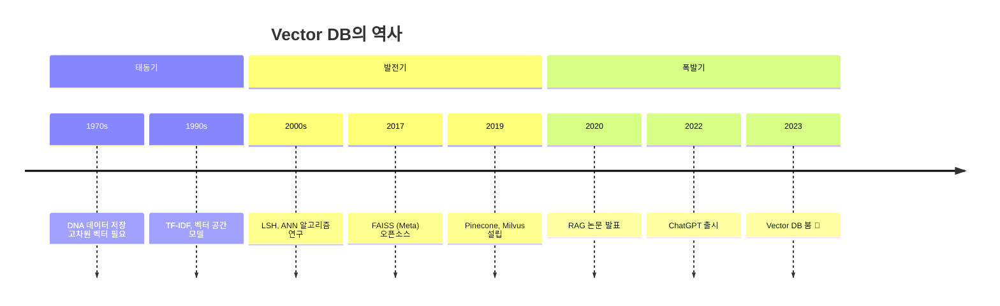
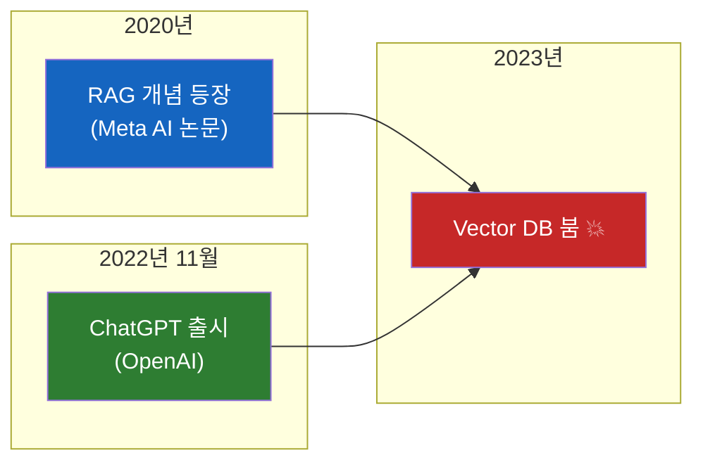
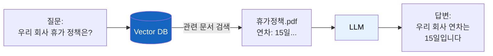
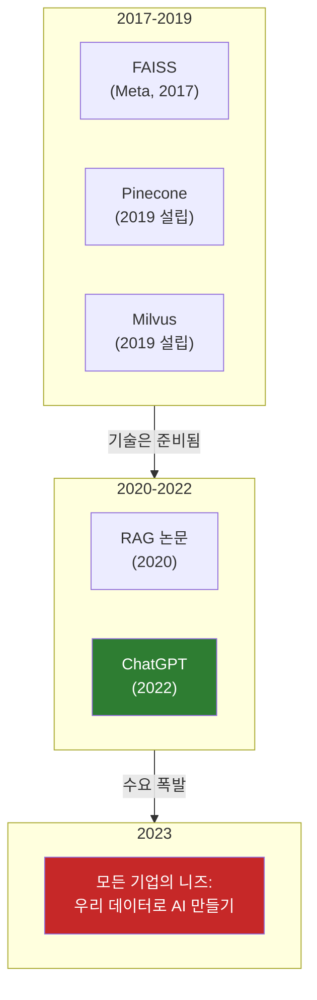
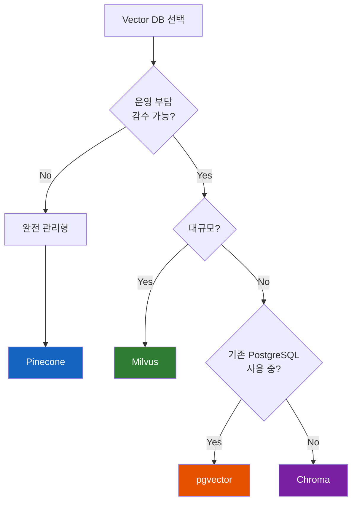

# Vector DB, AI 시대에 갑자기 뜬 이유

"Vector DB? ChatGPT 나오고 나서 생긴 거 아니야?" — 아니다. 50년 역사를 가진 기술이다.

## 결론부터 말하면

**Vector DB는 1970년대부터 존재했다.** DNA 연구, 이미지 검색, 추천 시스템 등에서 이미 쓰이고 있었다. 그런데 왜 갑자기 2023년부터 폭발적으로 뜨게 됐을까?



| 시기 | 주요 사용처 | 인지도 |
|------|------------|--------|
| 1970s~2010s | DNA 연구, 이미지 검색, 추천 시스템 | 연구자/전문가만 알음 |
| 2017~2019 | ML 엔지니어, 대기업 AI 팀 | 일부 개발자 인지 |
| 2020~2022 | NLP 연구자, 검색 엔진 | RAG 개념 등장 |
| **2023~현재** | **모든 개발자** | **대중화** |

---

## 1. Vector DB는 원래 뭐에 쓰던 물건인가?

### 1.1 DNA 연구의 고민 (1970년대)

1970년대 후반, DNA 시퀀싱 기술이 발전하면서 연구자들은 새로운 문제에 직면했다. DNA 염기서열 데이터를 어떻게 저장하고 검색할 것인가?

DNA 염기서열은 A, T, G, C 네 문자의 조합이지만, 유사한 서열을 찾으려면 단순 문자열 비교로는 한계가 있었다. "정확히 일치"가 아니라 **"비슷한 것"** 을 찾아야 했기 때문이다.

연구자들은 DNA를 **고차원 벡터로 변환** 해서 저장하고, **벡터 간 거리** 로 유사도를 계산하는 방법을 고안했다. 이것이 Vector DB의 시초다.

### 1.2 이미지 검색의 등장 (1990s~2000s)

구글 이미지 검색을 생각해보자. "고양이 사진"을 검색하면 어떻게 고양이 이미지를 찾을까?

초기에는 파일명이나 주변 텍스트에 의존했다. 하지만 이건 한계가 명확했다. `IMG_0042.jpg`라는 파일명만으로는 그게 고양이인지 강아지인지 알 수 없다.

해결책은 **이미지를 벡터로 변환** 하는 것이었다. 이미지의 특징(색상, 패턴, 형태)을 숫자 배열로 표현하고, 유사한 벡터를 가진 이미지를 찾는 방식이다.

```
고양이 이미지 → [0.2, 0.8, 0.1, ..., 0.5]  (512차원 벡터)
강아지 이미지 → [0.3, 0.7, 0.2, ..., 0.4]  (512차원 벡터)

두 벡터의 거리 = 유사도
```

### 1.3 추천 시스템 (2000s~2010s)

넷플릭스가 영화를 추천하는 방법도 본질적으로 같다.

```
사용자A의 취향 벡터: [액션:0.9, 로맨스:0.2, SF:0.7, ...]
영화X의 특성 벡터: [액션:0.8, 로맨스:0.1, SF:0.9, ...]

→ 두 벡터가 가까움 = 추천!
```

Spotify의 음악 추천, Amazon의 상품 추천 모두 이 원리다. **"비슷한 것을 빠르게 찾는다"** — 이것이 Vector DB의 본질이다.

---

## 2. 그런데 왜 갑자기 2023년에 폭발했을까?

### 2.1 두 가지 혁신의 만남

Vector DB가 폭발적으로 뜬 이유는 **두 가지 기술의 만남** 때문이다.



### 2.2 RAG: LLM의 치명적 약점을 보완하다

2020년, Meta AI(당시 Facebook AI Research)의 Patrick Lewis가 **RAG(Retrieval-Augmented Generation)** 개념을 발표했다.

LLM에는 치명적인 약점이 있다:

| 문제 | 설명 |
|------|------|
| **Hallucination** | 없는 사실을 있는 것처럼 말함 |
| **지식 단절** | 학습 시점 이후 정보를 모름 |
| **내부 데이터 무지** | 회사 내부 문서를 모름 |

RAG의 해결책은 단순하지만 강력하다:

> "LLM에게 답을 만들어내라고 하지 말고, **관련 문서를 먼저 찾아서 읽게 하자.**"



여기서 **Vector DB가 핵심 역할** 을 한다. 질문을 벡터로 변환하고, 가장 관련 있는 문서를 빠르게 찾아오는 것이다.

### 2.3 ChatGPT: 모든 사람이 LLM을 쓰기 시작하다

2022년 11월, ChatGPT가 출시됐다. 2개월 만에 1억 명이 사용했다. 역사상 가장 빠른 성장이었다.

그러자 모든 기업이 같은 생각을 했다:

> "우리도 ChatGPT 같은 거 만들어야 하는데... 우리 회사 데이터로 답변하게 할 수 없을까?"

답은 RAG였다. 그리고 RAG를 구현하려면 Vector DB가 필요했다.

### 2.4 완벽한 타이밍



기술은 이미 준비되어 있었다:
- **2017년**: Meta가 FAISS 오픈소스 공개
- **2019년**: Pinecone, Milvus 등 전문 Vector DB 회사 설립

그리고 ChatGPT가 **수요를 폭발** 시켰다.

---

## 3. Vector DB의 핵심 원리

### 3.1 임베딩: 모든 것을 벡터로

Vector DB를 이해하려면 **임베딩(Embedding)** 을 알아야 한다.

임베딩은 텍스트, 이미지, 음성 등을 **고정 길이의 숫자 배열(벡터)** 로 변환하는 것이다.

```python
from openai import OpenAI

client = OpenAI()

# 텍스트를 벡터로 변환
response = client.embeddings.create(
    model="text-embedding-3-small",
    input="오늘 날씨가 좋다"
)

vector = response.data[0].embedding
print(len(vector))  # 1536차원 벡터
print(vector[:5])   # [0.023, -0.012, 0.045, ...]
```

**핵심은 의미가 유사하면 벡터도 가깝다는 것이다:**

```
"오늘 날씨가 좋다"  → [0.2, 0.5, 0.1, ...]
"오늘 하늘이 맑다"  → [0.21, 0.48, 0.12, ...]  ← 거리 가까움
"주식이 폭락했다"  → [0.8, 0.1, 0.9, ...]     ← 거리 멂
```

### 3.2 ANN: 빠른 유사 검색

수억 개의 벡터 중에서 가장 가까운 것을 찾으려면? 모든 벡터와 거리를 계산하면 너무 느리다.

**ANN(Approximate Nearest Neighbor)** 알고리즘이 이 문제를 해결한다. "정확히 가장 가까운 것"이 아니라 **"거의 가장 가까운 것"** 을 빠르게 찾는다.

| 방식 | 속도 | 정확도 |
|------|------|--------|
| Exact Search | 느림 ($O(n)$) | 100% |
| ANN (HNSW, IVF 등) | 빠름 ($O(\log n)$) | 95%+ |

대부분의 경우 95% 정확도면 충분하다. 속도를 위해 약간의 정확도를 희생하는 트레이드오프다.

### 3.3 Vector DB vs 기존 DB

| 특성 | 관계형 DB (MySQL) | Vector DB (Pinecone) |
|------|------------------|---------------------|
| 데이터 형태 | 테이블, 행, 열 | 고차원 벡터 |
| 검색 방식 | 정확한 조건 매칭 | 유사도 기반 |
| 쿼리 예시 | `WHERE age = 25` | "이 벡터와 가장 비슷한 10개" |
| 인덱싱 | B-Tree, Hash | HNSW, IVF, PQ |
| 주요 용도 | CRUD, 트랜잭션 | 의미 검색, 추천 |

---

## 4. 주요 Vector DB 비교

### 4.1 역사순 정리

| 이름 | 출시/설립 | 특징 |
|------|----------|------|
| **FAISS** | 2017 (Meta) | 오픈소스 라이브러리, 직접 운영 필요 |
| **Annoy** | 2017 (Spotify) | 경량, 읽기 최적화 |
| **Milvus** | 2019 | 오픈소스, 대규모 확장성 |
| **Pinecone** | 2019 | 완전 관리형 서비스 |
| **Qdrant** | 2021 | Rust 기반, 고성능 |
| **Weaviate** | 2021 | GraphQL 지원 |
| **Chroma** | 2022 | 경량, 로컬 개발 최적화 |
| **pgvector** | 2021 | PostgreSQL 확장 |

### 4.2 선택 가이드



---

## 5. 정리

### Vector DB가 갑자기 뜬 진짜 이유

| 요소 | 설명 |
|------|------|
| **기술 준비** | 2017~2019년에 FAISS, Pinecone, Milvus 등장 |
| **개념 정립** | 2020년 RAG 논문으로 LLM + Vector DB 조합 정립 |
| **수요 폭발** | 2022년 ChatGPT로 모든 기업이 AI 도입 원함 |
| **완벽한 타이밍** | 기술 + 개념 + 수요가 동시에 맞아떨어짐 |

### 핵심 요약

1. **Vector DB는 50년 역사를 가진 기술이다** — DNA 연구, 이미지 검색, 추천 시스템에서 이미 사용
2. **RAG가 LLM과 Vector DB를 연결했다** — 2020년 Meta AI 논문
3. **ChatGPT가 수요를 폭발시켰다** — 모든 기업이 "우리 데이터로 AI"를 원함
4. **기술은 이미 준비되어 있었다** — 2017~2019년에 인프라 완성

---

## 출처

- [Meta AI - Retrieval-Augmented Generation (RAG) Paper (2020)](https://arxiv.org/abs/2005.11401) - RAG 원본 논문
- [NVIDIA - What Is Retrieval-Augmented Generation?](https://blogs.nvidia.com/blog/what-is-retrieval-augmented-generation/) - RAG 개념 설명
- [The History of Vector Databases](https://techshali.com/the-history-of-vector-databases/) - Vector DB 역사
- [In Search of the History of the Vector Database](https://sw2.beehiiv.com/p/search-history-vector-database) - DNA 연구와 Vector DB
- [The Rise of Vector Databases](https://www.endava.com/insights/articles/the-rise-of-vector-databases) - Vector DB 발전사
- [Wikipedia - Retrieval-augmented generation](https://en.wikipedia.org/wiki/Retrieval-augmented_generation) - RAG 위키피디아
