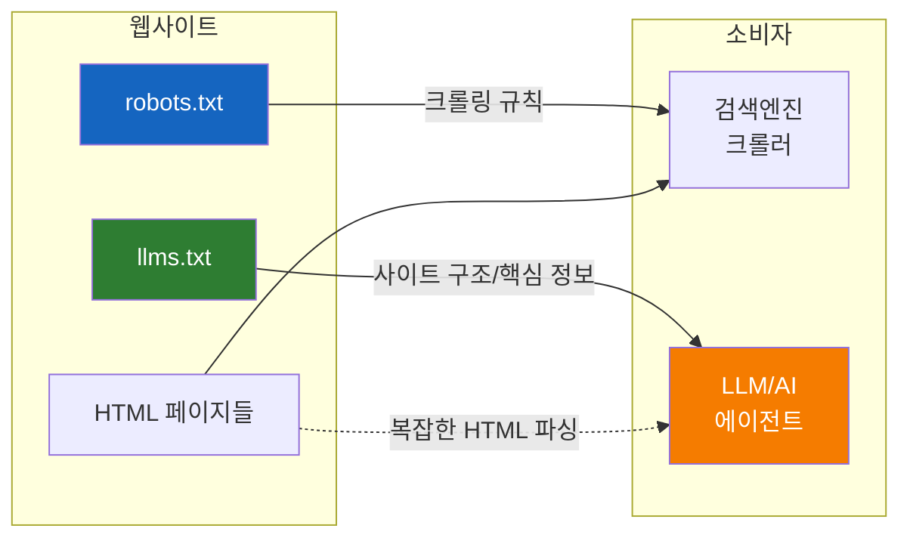
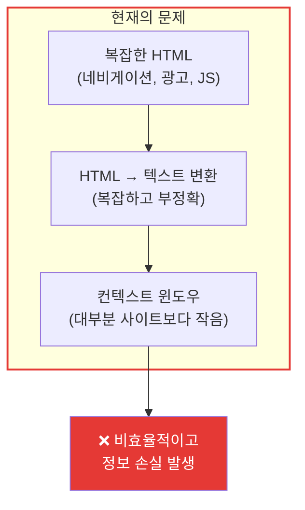
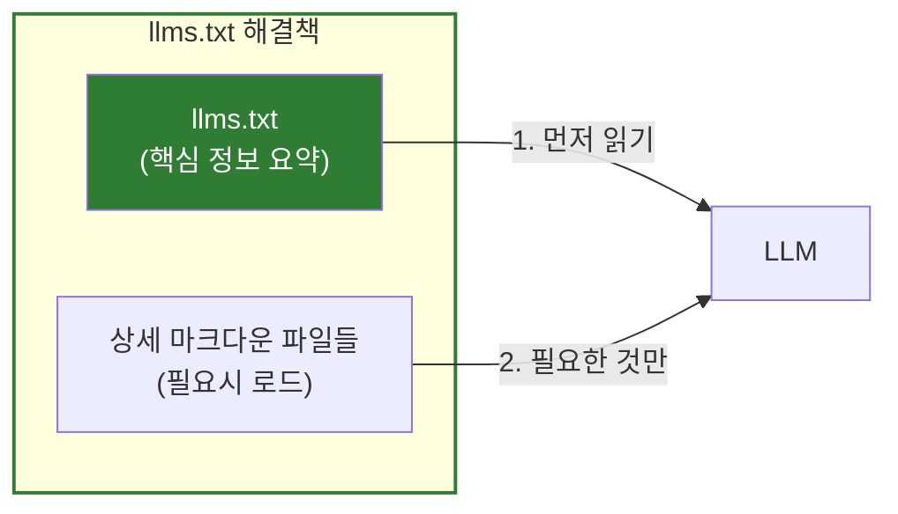
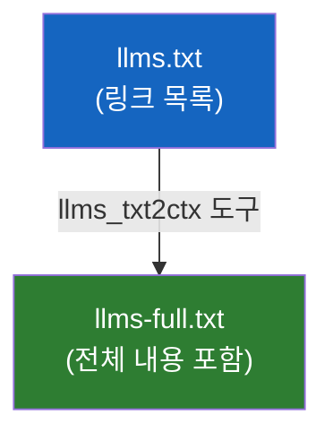
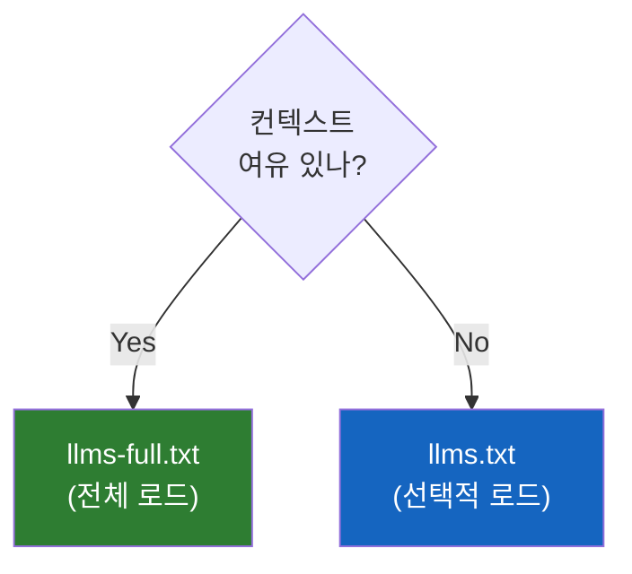
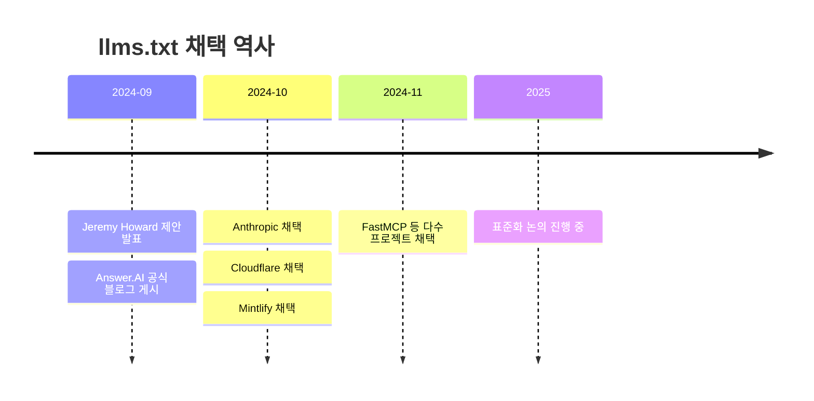
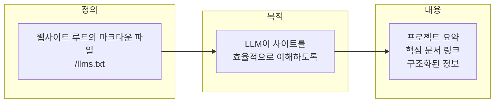

# llms.txt - AI 시대의 robots.txt

웹사이트가 LLM에게 "우리 사이트는 이렇게 생겼어"라고 알려주는 새로운 표준

## 결론부터 말하면

**llms.txt는 웹사이트가 LLM/AI 에이전트에게 사이트 정보를 제공하는 마크다운 파일이다.**



| 파일 | 대상 | 역할 |
|------|------|------|
| `robots.txt` | 검색엔진 크롤러 | "이 페이지는 크롤링하지 마" |
| `llms.txt` | LLM/AI 에이전트 | "우리 사이트 핵심 정보는 이거야" |

**핵심:** 2024년 9월 Jeremy Howard(fast.ai 창시자)가 제안한 표준. Anthropic, Cloudflare, Mintlify 등이 초기 채택.

## 1. 왜 llms.txt가 필요한가?

### 1.1 문제: LLM은 웹사이트를 읽기 어렵다

Claude나 GPT 같은 LLM이 웹사이트 정보를 활용하려면 어떤 일이 벌어질까?



| 문제 | 설명 |
|------|------|
| **HTML 복잡성** | 네비게이션, 광고, JavaScript 등 노이즈가 많음 |
| **변환 어려움** | HTML → 평문 변환이 복잡하고 정보 손실 발생 |
| **컨텍스트 한계** | LLM의 토큰 제한으로 사이트 전체를 넣을 수 없음 |
| **정보 분산** | 필요한 정보가 수십 개 페이지에 흩어져 있음 |

### 1.2 실제 상황: FastMCP 문서를 읽으려면?

FastMCP 공식 문서 사이트를 Claude에게 읽히고 싶다고 가정해보자.

```
❌ 현재 방식:
1. https://gofastmcp.com 접속
2. HTML 전체 다운로드 (수십 페이지)
3. 각 페이지에서 본문만 추출 (네비게이션, 푸터 제거)
4. 텍스트로 변환
5. 컨텍스트에 넣기... 근데 토큰 초과!
6. 어떤 페이지를 버릴지 결정해야 함

✅ llms.txt 방식:
1. https://gofastmcp.com/llms.txt 접속
2. 핵심 정보와 중요 문서 링크 획득
3. 필요한 문서만 선택적으로 로드
4. 효율적으로 컨텍스트 활용
```

### 1.3 해결책: 사이트가 직접 LLM용 정보를 제공

웹사이트 운영자가 "LLM이 알아야 할 핵심 정보"를 미리 정리해서 제공하면 된다. 이것이 바로 **llms.txt** 다.



## 2. llms.txt 스펙 상세

### 2.1 파일 위치

```
https://example.com/llms.txt
```

`robots.txt`와 마찬가지로 웹사이트 **루트 경로** 에 위치한다.

### 2.2 파일 형식

**마크다운(Markdown)** 으로 작성한다. 왜 마크다운인가?

| 형식 | LLM 처리 | 이유 |
|------|----------|------|
| HTML | 어려움 | 태그, 스타일, 스크립트 등 노이즈 |
| XML | 보통 | 구조화되어 있지만 장황함 |
| **Markdown** | **쉬움** | 간결하고 LLM이 효율적으로 처리 |

### 2.3 파일 구조

```markdown
# 프로젝트명 (필수 - H1 제목)

> 프로젝트 한 줄 요약 (인용문)

프로젝트에 대한 상세 설명...

## 문서 섹션 (H2로 구분)

- [문서 제목](URL): 설명
- [또 다른 문서](URL): 설명

## Optional

- [부가 문서](URL): 컨텍스트 부족시 생략 가능
```

### 2.4 구성 요소

| 요소 | 필수 여부 | 설명 |
|------|----------|------|
| **H1 제목** | **필수** | 프로젝트/사이트명 (유일한 필수 요소) |
| **인용문** | 선택 | 핵심 정보 요약 (blockquote) |
| **상세 설명** | 선택 | 프로젝트 설명 (일반 마크다운) |
| **문서 목록** | 선택 | H2 섹션 아래 링크 목록 |
| **Optional 섹션** | 선택 | 컨텍스트 부족시 생략 가능한 문서 |

### 2.5 실제 예시

```markdown
# FastMCP

> FastMCP는 Python으로 MCP 서버를 쉽게 만들 수 있는 프레임워크입니다.

FastMCP를 사용하면 데코레이터 하나로 도구를 정의하고,
Claude Desktop이나 Claude Code와 연동할 수 있습니다.

## 핵심 문서

- [빠른 시작 가이드](/docs/quickstart.md): 5분 만에 첫 MCP 서버 만들기
- [Tool 만들기](/docs/tools.md): @mcp.tool() 데코레이터 사용법
- [Transport 설명](/docs/transports.md): STDIO vs SSE 비교

## API 레퍼런스

- [FastMCP 클래스](/docs/api/fastmcp.md): 메인 클래스 API
- [Context 객체](/docs/api/context.md): 요청 컨텍스트 활용

## Optional

- [변경 이력](/docs/changelog.md): 버전별 변경사항
- [기여 가이드](/docs/contributing.md): 오픈소스 기여 방법
```

## 3. llms.txt vs llms-full.txt

일부 사이트는 두 가지 버전을 제공한다.



| 파일 | 내용 | 용도 |
|------|------|------|
| `llms.txt` | 링크 목록만 | LLM이 필요한 문서만 선택적 로드 |
| `llms-full.txt` | 모든 문서 내용 포함 | 한 번에 전체 컨텍스트 로드 |

### 언제 무엇을 쓰나?



## 4. 마크다운 버전 페이지 (.md)

llms.txt와 함께, 각 HTML 페이지의 **마크다운 버전** 을 제공하는 것도 권장된다.

```
https://example.com/docs/quickstart.html      ← 사람용 (HTML)
https://example.com/docs/quickstart.html.md   ← LLM용 (Markdown)
```

이렇게 하면 LLM이 특정 페이지 정보가 필요할 때, HTML 파싱 없이 마크다운을 직접 읽을 수 있다.

## 5. 채택 현황

### 5.1 타임라인



### 5.2 채택 사이트 예시

| 사이트 | llms.txt URL |
|--------|--------------|
| FastMCP | `https://gofastmcp.com/llms.txt` |
| Anthropic Docs | `https://docs.anthropic.com/llms.txt` |
| Cloudflare | `https://developers.cloudflare.com/llms.txt` |

## 6. 내 사이트에 적용하기

### 6.1 기본 템플릿

```markdown
# 내 프로젝트명

> 프로젝트를 한 문장으로 설명

이 프로젝트는 [주요 기능]을 제공합니다.
[대상 사용자]를 위해 설계되었습니다.

## 시작하기

- [설치 가이드](/docs/install.md): 설치 방법
- [빠른 시작](/docs/quickstart.md): 첫 번째 예제

## 핵심 개념

- [아키텍처](/docs/architecture.md): 시스템 구조
- [API 레퍼런스](/docs/api.md): 전체 API 문서

## Optional

- [FAQ](/docs/faq.md): 자주 묻는 질문
- [문제 해결](/docs/troubleshooting.md): 일반적인 문제 해결
```

### 6.2 체크리스트

- [ ] `/llms.txt` 파일 생성
- [ ] H1 제목 (프로젝트명) 포함
- [ ] 핵심 문서 링크 정리
- [ ] Optional 섹션으로 부가 문서 분리
- [ ] 각 페이지의 `.md` 버전 제공 (권장)

## 7. 정리

### llms.txt란?



### 핵심 요약

| 질문 | 답변 |
|------|------|
| llms.txt가 뭔가? | LLM용 사이트 정보 파일 (마크다운) |
| 왜 필요한가? | LLM이 HTML 파싱 없이 핵심 정보 획득 |
| 누가 만들었나? | Jeremy Howard (2024년 9월) |
| 어디에 두나? | 웹사이트 루트 (`/llms.txt`) |
| robots.txt와 차이? | robots.txt는 "하지 마", llms.txt는 "여기 봐" |

### robots.txt vs llms.txt

| 특성 | robots.txt | llms.txt |
|------|------------|----------|
| **대상** | 검색엔진 크롤러 | LLM/AI 에이전트 |
| **목적** | 접근 제한 | 정보 제공 |
| **형식** | 자체 문법 | 마크다운 |
| **역할** | "이건 보지 마" | "이건 꼭 봐" |

## 출처

- [llms.txt 공식 사이트](https://llmstxt.org/) - 공식 스펙 문서
- [Answer.AI 발표 글](https://www.answer.ai/posts/2024-09-03-llmstxt.html) - Jeremy Howard 원본 제안
- [LLMs.txt Explained - Medium](https://medium.com/data-science/llms-txt-explained-414d5121bcb3) - 상세 설명
- [Jeremy Howard Twitter 발표](https://x.com/jeremyphoward/status/1831089138571133290) - 최초 발표
