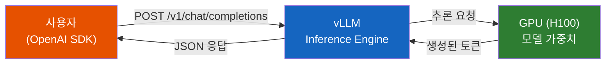
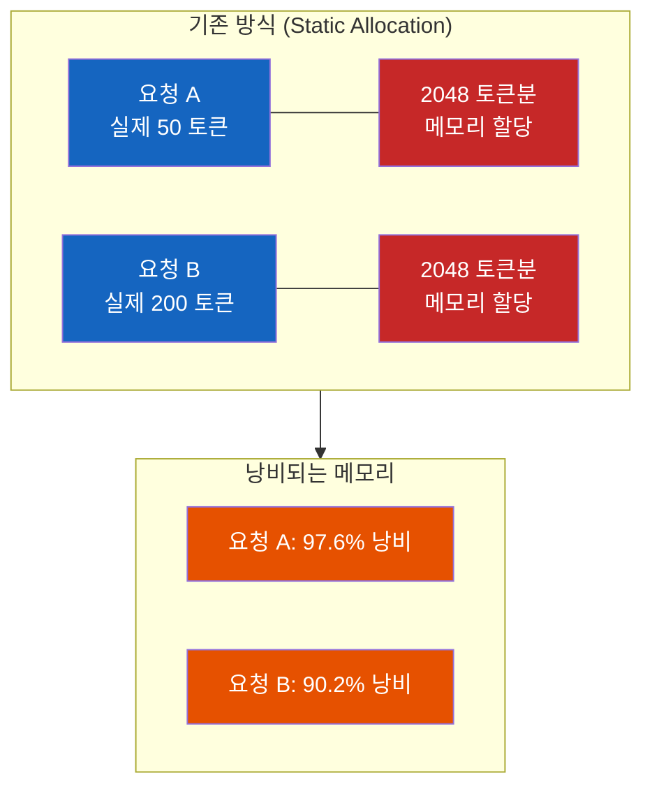
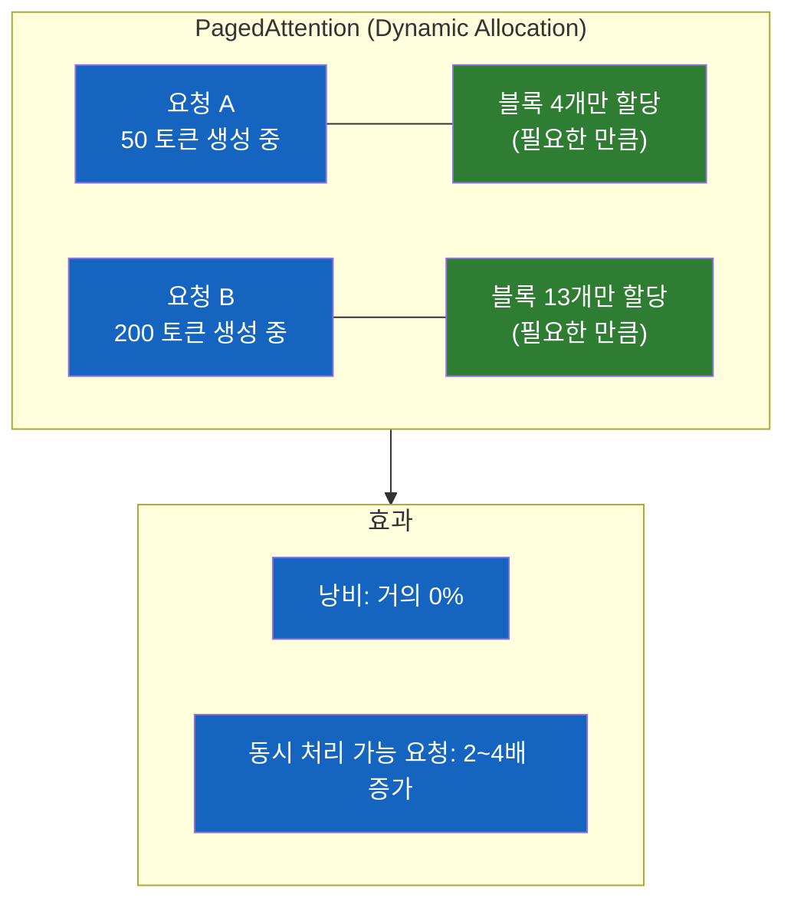
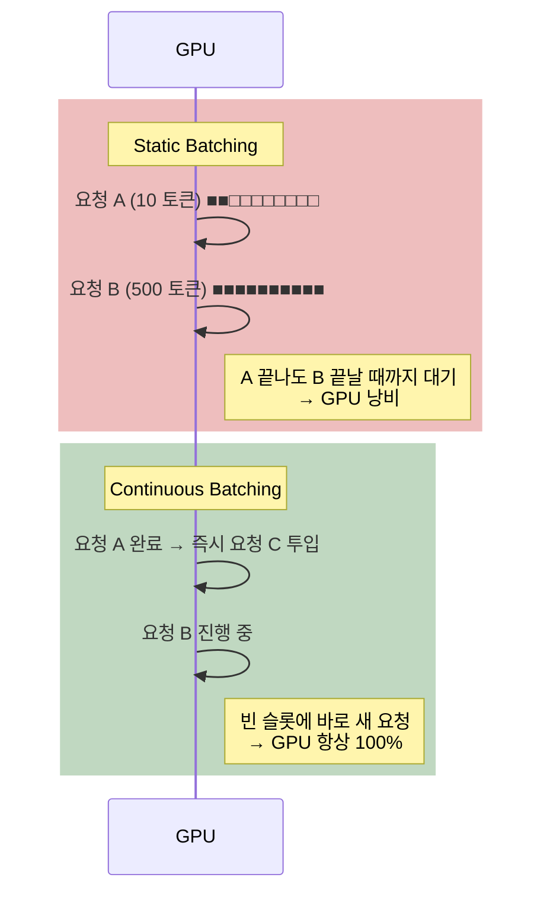
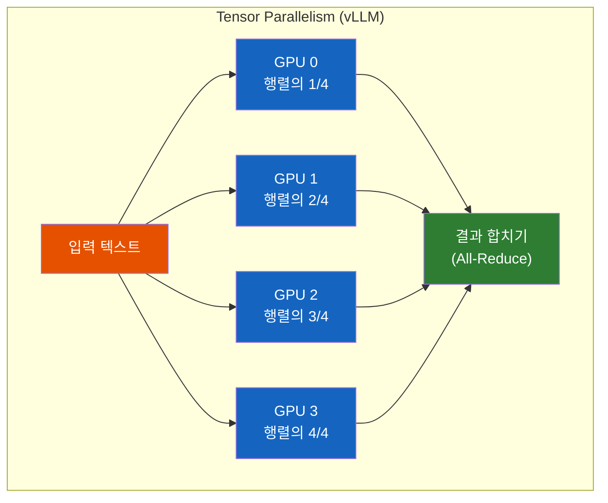
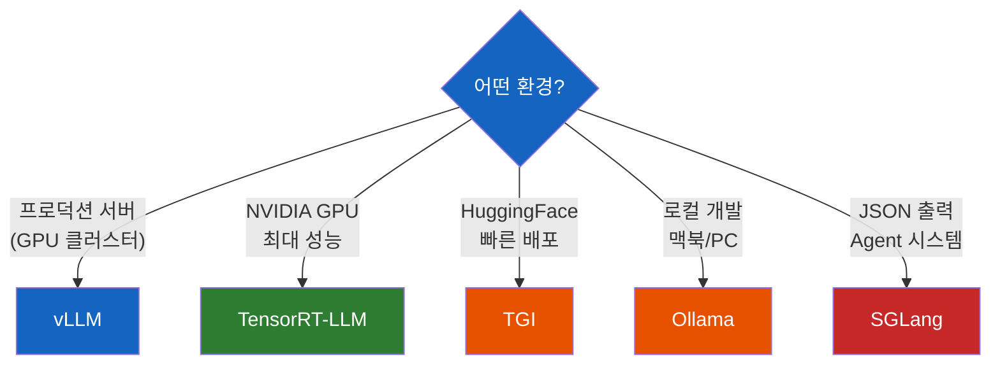
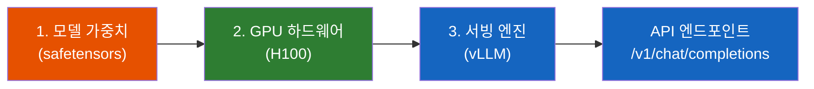

# vLLM - GPU 위의 LLM은 누가 서빙하는가

H100에 120B 모델을 올렸다. 그런데 API 엔드포인트는 누가 만들어주지?

## 결론부터 말하면

**모델 가중치(weights)는 그냥 숫자 덩어리다.** `.safetensors` 파일을 GPU에 올려놓는다고 API가 자동으로 생기지 않는다. 요청을 받고, 추론(inference)하고, 응답을 돌려주는 **서빙 엔진** 이 필요한데, 그 역할을 하는 것이 **vLLM** 이다.

vLLM은 단순한 API 서버가 아니다. **PagedAttention** 으로 GPU 메모리 낭비를 제거하고, **Continuous Batching** 으로 GPU 유휴 시간을 없애며, **Tensor Parallelism** 으로 거대 모델을 여러 GPU에 나눠 올린다. 그리고 이 모든 것을 **OpenAI 호환 API** 로 감싸서, `base_url` 하나만 바꾸면 기존 OpenAI 코드가 그대로 동작하게 만든다.



| 구성 요소 | 역할 | 비유 |
|-----------|------|------|
| 모델 가중치 (.safetensors) | 숫자 덩어리 (지식) | 엔진 |
| GPU (H100) | 연산 수행 하드웨어 | 연료 + 실린더 |
| **vLLM** | 요청 수신 → 추론 → 응답 반환 | **자동차 전체** (차체 + 핸들 + 페달) |
| OpenAI SDK | HTTP 요청 래퍼 | 운전자의 손 |

---

## 1. 왜 서빙 엔진이 필요한가?

> [[ML 모델 서빙이란 무엇인가]] 에서 모델 서빙의 기본 개념을 다뤘다. 이번엔 **LLM 서빙** 이 왜 특별히 어려운지, 그리고 vLLM이 그 문제를 어떻게 해결하는지를 파고든다.

### 1.1 모델 파일의 정체

AI 모델을 "학습시켰다"고 하면, 그 결과물은 뭘까? `.safetensors`나 `.bin` 확장자를 가진 파일들이다. 이 안에는 수십억 개의 숫자(가중치, weights)가 들어있다. 120B 모델이라면 1,200억 개의 파라미터, FP16 기준으로 약 240GB에 달하는 숫자 덩어리다.

하지만 이 파일만으로는 아무것도 할 수 없다. 누군가 "안녕하세요"라고 보내면, 이 메시지를 토큰으로 변환하고, 모델에 입력하고, 출력 토큰을 하나씩 생성하고, 다시 텍스트로 변환해서 돌려줘야 한다. 이 전체 과정을 관리하는 소프트웨어가 바로 서빙 엔진이다.

### 1.2 그냥 transformers로 하면 안 되나?

물론 된다. HuggingFace의 `transformers` 라이브러리로 이렇게 할 수 있다:

```python
from transformers import AutoModelForCausalLM, AutoTokenizer

model = AutoModelForCausalLM.from_pretrained("gpt-oss-120b")
tokenizer = AutoTokenizer.from_pretrained("gpt-oss-120b")

inputs = tokenizer("안녕하세요", return_tensors="pt").to("cuda")
outputs = model.generate(**inputs, max_new_tokens=100)
print(tokenizer.decode(outputs[0]))
```

이걸 FastAPI로 감싸면 API도 만들 수 있다. 그런데 왜 vLLM이 따로 필요할까?

**프로덕션에서는 성능이 처참하기 때문이다.** 위 코드는 한 번에 하나의 요청만 처리한다. 10명이 동시에 요청하면 9명은 기다려야 한다. GPU는 수천만 원짜리 장비인데, 한 번에 하나만 처리하면 돈을 태우는 것과 같다.

그리고 LLM에는 전통 ML 모델과 다른 특수한 문제가 있다. 바로 **KV Cache** 다.

---

## 2. vLLM의 핵심 기술

vLLM(Virtual Large Language Model)은 UC Berkeley에서 2023년에 공개한 오픈소스 LLM 추론 및 서빙 엔진이다. 이름에 "Virtual"이 들어간 이유가 있는데, 곧 알게 된다.

### 2.1 PagedAttention - GPU 메모리의 혁명

#### KV Cache란?

LLM이 텍스트를 생성할 때, **이미 처리한 토큰의 정보를 캐시에 저장** 해둔다. 이걸 KV Cache(Key-Value Cache)라고 한다. "오늘 날씨가"라는 3개 토큰을 처리한 후 다음 토큰 "좋다"를 생성할 때, 앞의 3개를 다시 계산하지 않고 캐시에서 꺼내 쓴다.

왜 필요할까? Transformer 아키텍처의 Self-Attention은 이전 모든 토큰을 참조해야 한다. 토큰을 하나 생성할 때마다 이전 토큰을 전부 다시 계산하면 $O(n^2)$ 으로 시간이 폭발한다. 그래서 한 번 계산한 Key-Value 쌍을 캐시에 저장해두고 재사용한다.

#### 기존 방식의 문제

문제는 이 KV Cache가 **엄청나게 크다** 는 것이다. 그리고 요청마다 생성되는 토큰 수가 다르기 때문에, 기존 방식은 **최대 길이만큼 메모리를 미리 할당** 했다.

"최대 2048 토큰까지 가능"이면, 실제로 50 토큰만 생성하더라도 2048 토큰분의 메모리를 잡아두는 것이다.



vLLM 논문에 따르면 이 낭비가 **GPU 메모리의 60~80%** 에 달한다. GPU 메모리가 80GB나 되는 H100에서도 실제로 쓸 수 있는 메모리는 16~32GB뿐인 셈이다.

#### PagedAttention의 해법

vLLM은 이 문제를 **OS의 가상 메모리(Virtual Memory)** 에서 영감을 받아 해결했다. 이것이 vLLM이라는 이름의 유래다.

OS는 프로세스마다 메모리를 통째로 할당하지 않는다. 4KB짜리 **페이지(Page)** 단위로 나누고, 필요할 때만 물리 메모리에 매핑한다. PagedAttention은 이 원리를 KV Cache에 적용했다.



| 비교 | 기존 방식 | PagedAttention |
|------|-----------|----------------|
| 메모리 할당 | 최대 길이만큼 미리 할당 | 필요할 때 블록 단위로 할당 |
| 메모리 낭비 | 60~80% | **4% 이하** |
| 동시 처리 요청 수 | 적음 | **2~4배 증가** |
| 비유 | 주차장 전체를 한 대에 할당 | 주차 칸 하나씩 배정 |

결과적으로 **같은 GPU로 2~4배 더 많은 요청을 동시에 처리** 할 수 있다. GPU 비용이 수천만 원인 프로덕션 환경에서 이 차이는 매우 크다.

### 2.2 Continuous Batching - GPU가 쉬는 시간을 없앤다

#### Static Batching의 한계

여러 요청을 모아서 한 번에 처리하면 GPU 활용률이 올라간다. 이걸 배칭(Batching)이라 하는데, 전통적인 방식(Static Batching)에는 치명적인 문제가 있다.

요청 A가 10 토큰, 요청 B가 500 토큰을 생성한다고 하자. Static Batching에서는 A가 끝나도 **B가 끝날 때까지 새 요청을 받을 수 없다.** A가 차지하던 GPU 자원은 B가 끝날 때까지 놀고 있는 것이다.



#### Continuous Batching의 해법

**Continuous Batching** 은 요청 하나가 끝나면 즉시 그 자리에 새 요청을 채워넣는다. 배치 전체가 끝날 때까지 기다리지 않는다.

| 비교 | Static Batching | Continuous Batching |
|------|-----------------|---------------------|
| 새 요청 투입 시점 | 배치 전체 완료 후 | **개별 요청 완료 즉시** |
| GPU 유휴 시간 | 많음 (짧은 요청이 끝나도 대기) | **거의 없음** |
| 처리량 (throughput) | 낮음 | **높음** |
| 비유 | 식당에서 테이블 전원 식사 끝나야 다음 손님 | 한 자리 비면 바로 다음 손님 앉힘 |

이 두 가지 기술(PagedAttention + Continuous Batching)이 vLLM의 핵심이다. 같은 GPU 하드웨어에서 **처리량을 2~4배** 끌어올리는 것이 vLLM이 사실상 업계 표준이 된 이유다.

### 2.3 Tensor Parallelism - 거대 모델을 쪼개서 올린다

그런데 아무리 메모리 효율과 배칭을 최적화해도, 모델 자체가 GPU 한 장에 안 올라가면 아무 소용이 없다.

120B 모델은 FP16 기준으로 약 240GB다. H100 한 장의 VRAM이 80GB이니, 한 장에는 절대 올라가지 않는다.

| 모델 크기 | FP16 메모리 | 필요 GPU (H100 80GB) |
|-----------|-------------|----------------------|
| 7B | ~14GB | 1장 |
| 70B | ~140GB | 2장 |
| 120B | ~240GB | **최소 4장** |

여기서 주의할 점이 있다. "240GB 모델이니까 80GB × 3장 = 240GB면 되지 않나?"라고 생각할 수 있다. 하지만 **가중치만으로 VRAM이 100% 차면 KV Cache를 할당할 공간이 없다.** vLLM의 핵심인 PagedAttention이 동작하려면 KV Cache용 여유 VRAM이 반드시 필요하므로, 실제로는 최소 4장이 필요하다.

**Tensor Parallelism** 은 모델의 각 레이어 내부의 행렬 연산을 여러 GPU에 나눠서 수행한다. 단순히 레이어를 GPU별로 쪼개는 Pipeline Parallelism과 달리, 하나의 행렬 곱셈을 분할하기 때문에 **모든 GPU가 동시에 연산에 참여** 한다.



vLLM에서는 `--tensor-parallel-size` 옵션 하나로 설정한다:

```bash
vllm serve gpt-oss-120b \
  --tensor-parallel-size 4 \
  --port 8000
```

---

## 3. OpenAI 호환 API - base_url만 바꾸면 끝

여기까지가 vLLM 내부의 이야기다. PagedAttention으로 메모리를 아끼고, Continuous Batching으로 GPU를 쉬지 않게 하고, Tensor Parallelism으로 거대 모델을 여러 GPU에 나눠 올린다. 하지만 이 모든 최적화가 있어도, **사용자가 쉽게 요청을 보낼 수 없으면 의미가 없다.**

그래서 vLLM은 한 가지 더 해결했다. API를 직접 설계하지 않고, 이미 업계 표준이 된 **OpenAI의 API 형식을 그대로 구현** 한 것이다.

### 3.1 SDK는 결국 HTTP 래퍼다

OpenAI SDK가 하는 일은 결국 **특정 형식의 HTTP 요청을 보내는 것** 뿐이다.

```python
# 이 코드가 내부적으로 하는 일
client = OpenAI(api_key="sk-xxx")
response = client.chat.completions.create(
    model="gpt-4",
    messages=[{"role": "user", "content": "안녕"}]
)
```

위 코드는 아래 HTTP 요청과 동일하다:

```
POST https://api.openai.com/v1/chat/completions
Content-Type: application/json

{
  "model": "gpt-4",
  "messages": [{"role": "user", "content": "안녕"}]
}
```

### 3.2 vLLM이 같은 형식을 구현했다

vLLM은 OpenAI API와 **동일한 URL 경로, 동일한 요청 형식, 동일한 응답 형식** 을 구현했다. SDK 입장에서는 요청을 보내는 목적지(URL)만 다르고, 나머지는 완전히 같으니 아무 문제 없이 동작한다.

```python
from openai import OpenAI

# OpenAI 서버로 보낼 때
client = OpenAI(api_key="sk-xxx")
# → 기본값 https://api.openai.com/v1 로 요청

# vLLM 서버로 보낼 때 (바뀐 건 base_url 하나뿐)
client = OpenAI(
    base_url="http://사업자-서버:8000/v1",
    api_key="not-needed"
)

# 이 아래 코드는 둘 다 완전히 동일하게 동작한다
response = client.chat.completions.create(
    model="gpt-oss-120b",
    messages=[
        {"role": "system", "content": "당신은 도움이 되는 AI입니다."},
        {"role": "user", "content": "안녕하세요"}
    ],
    stream=True  # 스트리밍도 동일하게 지원
)
```

이런 전략을 **API 호환(compatible)** 이라 부른다. OpenAI의 API 형식이 LLM 업계의 사실상 표준(de facto standard)이 되었기 때문에, vLLM뿐 아니라 거의 모든 서빙 엔진이 이 형식을 따른다.

편의점 택배에 비유하면, **송장 형식은 CJ든 한진이든 똑같다.** 택배사(서버)만 바꾸면 되지, 송장(API 형식)을 새로 배울 필요가 없는 것이다.

### 3.3 vLLM이 제공하는 엔드포인트

| 엔드포인트 | 설명 |
|------------|------|
| `POST /v1/chat/completions` | 대화형 (ChatGPT 스타일) |
| `POST /v1/completions` | 텍스트 완성 |
| `GET /v1/models` | 사용 가능한 모델 목록 |
| `POST /v1/embeddings` | 임베딩 벡터 생성 |

---

## 4. 경쟁 도구들

vLLM만 있는 건 아니다. 목적과 환경에 따라 선택지가 다르다.

| 도구 | 개발 | 특징 | 적합한 상황 |
|------|------|------|-------------|
| **vLLM** | UC Berkeley | PagedAttention, 범용적, 커뮤니티 활발 | 대부분의 프로덕션 환경 |
| **TGI** | HuggingFace | HF 생태계 통합, 배포 간편 | HuggingFace 모델 빠르게 서빙 |
| **TensorRT-LLM** | NVIDIA | H100 최적화 극대화, 설정 복잡 | 최대 성능이 필요한 대규모 서비스 |
| **SGLang** | Stanford | 구조화된 출력(JSON 등)에 강점 | JSON 응답이 중요한 Agent 시스템 |
| **Ollama** | Ollama | 로컬 실행 특화, 설치 간편 | 로컬 개발/테스트 |



---

## 5. 정리

GPU에 LLM을 올려서 서비스하려면 세 가지가 필요하다:



| 질문 | 답변 |
|------|------|
| 모델만 있으면 되나? | 안 된다. 가중치는 숫자 덩어리일 뿐, 서빙 엔진이 필요하다 |
| vLLM이 뭐 하는 건데? | 모델을 GPU에 올리고, API 요청을 받아 추론 결과를 돌려주는 엔진 |
| 왜 vLLM이 빠른가? | PagedAttention(메모리 효율) + Continuous Batching(GPU 활용률) |
| 120B 모델은 GPU 몇 장? | H100 80GB 기준 최소 4장 (Tensor Parallelism) |
| 기존 OpenAI 코드 수정해야? | `base_url`만 바꾸면 나머지는 동일하게 동작 |

---

## 출처

- [vLLM 공식 문서](https://docs.vllm.ai/) - 공식 문서
- [Efficient Memory Management for Large Language Model Serving with PagedAttention](https://arxiv.org/abs/2309.06180) - vLLM 원본 논문 (SOSP 2023)
- [vLLM GitHub](https://github.com/vllm-project/vllm)
