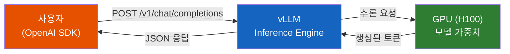
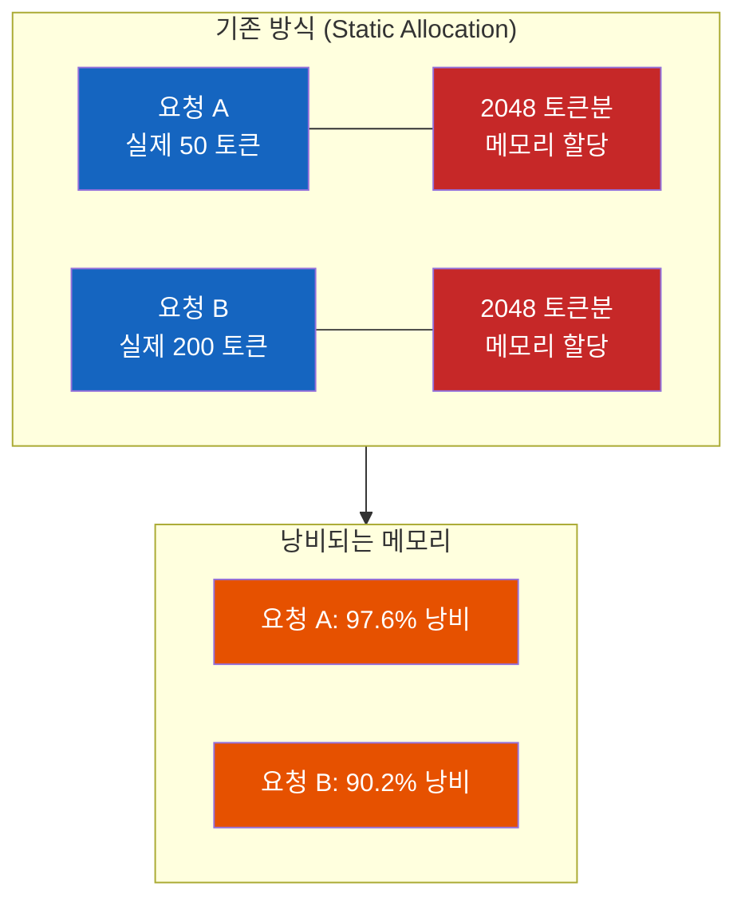
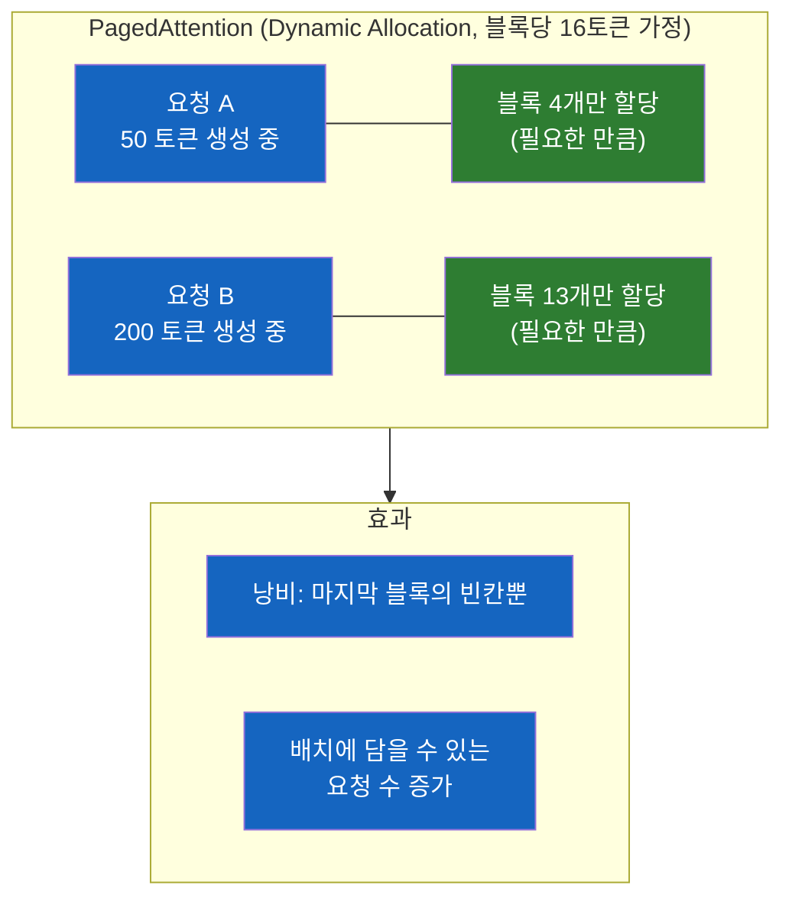
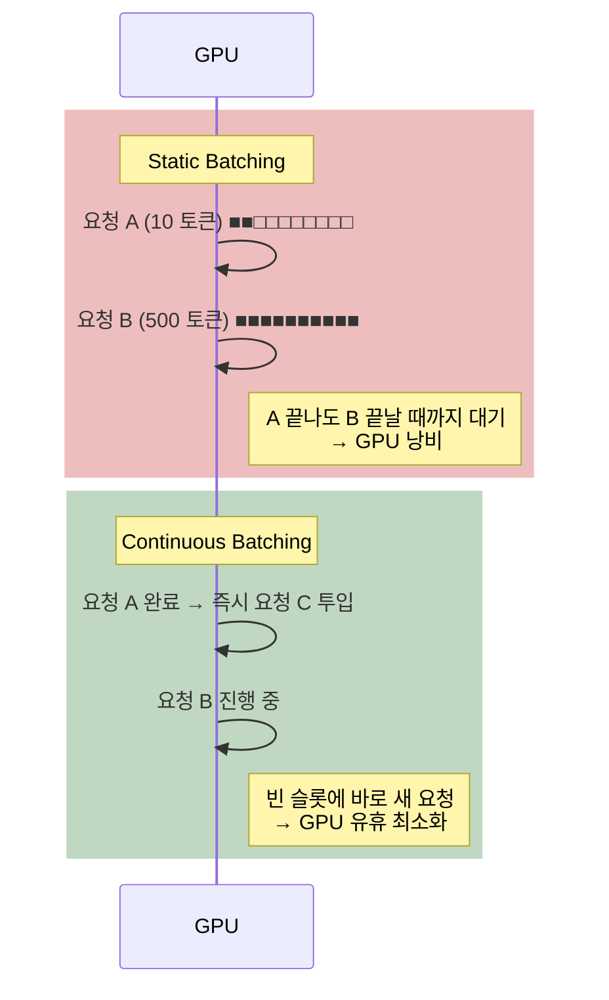
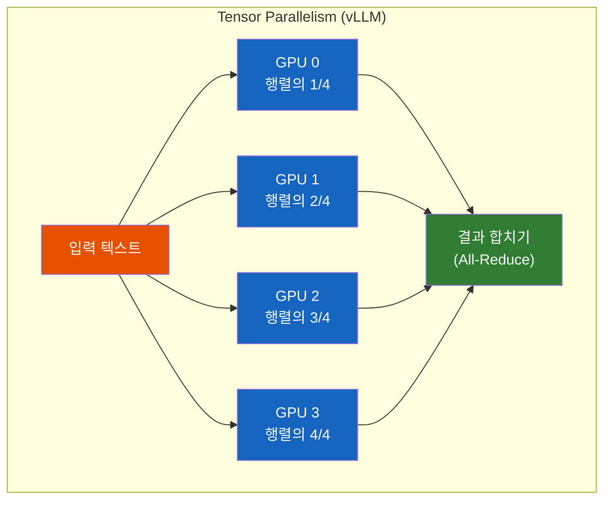
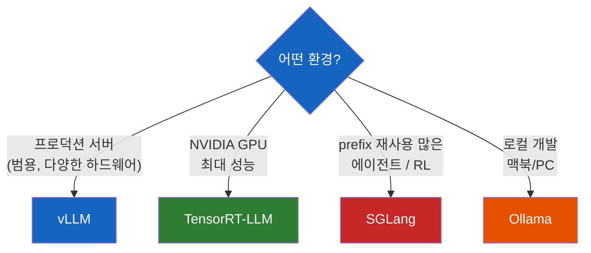
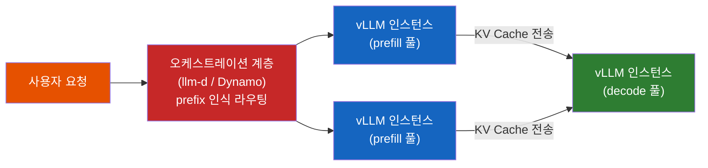
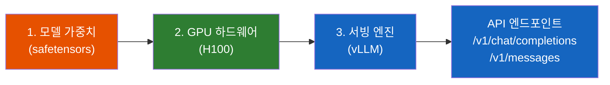

# vLLM - GPU 위의 LLM은 누가 서빙하는가

H100에 120B 모델을 올렸다. 그런데 API 엔드포인트는 누가 만들어주지?

> 2026-10 기준, vLLM **v0.30.0** (2026-09-22 릴리스)으로 내용을 확인했다.

## 결론부터 말하면

**모델 가중치(weights)는 그냥 숫자 덩어리다.** `.safetensors` 파일을 GPU에 올려놓는다고 API가 자동으로 생기지 않는다. 요청을 받고, 추론(inference)하고, 응답을 돌려주는 **서빙 엔진** 이 필요한데, 그 역할을 하는 것이 **vLLM** 이다.

vLLM은 단순한 API 서버가 아니다. **PagedAttention** 으로 KV Cache 메모리 낭비를 거의 없애고, **Continuous Batching** 으로 GPU 유휴 시간을 줄이며, **Tensor Parallelism** 으로 거대 모델을 여러 GPU에 나눠 올린다. 2026년 현재의 V1 엔진에서는 여기에 **Prefix Caching** 과 **Chunked Prefill** 까지 기본으로 켜져 있다. 그리고 이 모든 것을 **OpenAI 호환 API** (이제는 Anthropic Messages API까지)로 감싸서, 접속 주소(`base_url`)와 모델 이름만 맞추면 기존 SDK 코드를 거의 그대로 재사용하게 만든다.


```mermaid
flowchart LR
    A["사용자<br>(OpenAI SDK)"] -->|"POST /v1/chat/completions"| B["vLLM<br>Inference Engine"]
    B -->|"추론 요청"| C["GPU (H100)<br>모델 가중치"]
    C -->|"생성된 토큰"| B
    B -->|"JSON 응답"| A

    style A fill:#E65100,color:#fff
    style B fill:#1565C0,color:#fff
    style C fill:#2E7D32,color:#fff
```

| 구성 요소 | 역할 | 비유 |
|-----------|------|------|
| 모델 가중치 (.safetensors) | 숫자 덩어리 (지식) | 엔진 |
| GPU (H100) | 연산 수행 하드웨어 | 연료 + 실린더 |
| **vLLM** | 요청 수신 → 추론 → 응답 반환 | **자동차 전체** (차체 + 핸들 + 페달) |
| OpenAI SDK | HTTP 요청 래퍼 | 운전자의 손 |

---

## 1. 왜 서빙 엔진이 필요한가?

> [ML-모델-서빙이란-무엇인가](./ML-모델-서빙이란-무엇인가.md) 에서 모델 서빙의 기본 개념을 다뤘다. 이번엔 **LLM 서빙** 이 왜 특별히 어려운지, 그리고 vLLM이 그 문제를 어떻게 해결하는지를 파고든다.

### 1.1 모델 파일의 정체

AI 모델을 "학습시켰다"고 하면, 그 결과물은 뭘까? `.safetensors`나 `.bin` 확장자를 가진 파일들이다. 이 안에는 수십억 개의 숫자(가중치, weights)가 들어있다. 120B 모델이라면 1,200억 개의 파라미터, 파라미터 하나에 2바이트를 쓰는 FP16 기준으로 약 240GB에 달하는 숫자 덩어리다.

하지만 이 파일만으로는 아무것도 할 수 없다. 누군가 "안녕하세요"라고 보내면, 이 메시지를 토큰으로 변환하고, 모델에 입력하고, 출력 토큰을 하나씩 생성하고, 다시 텍스트로 변환해서 돌려줘야 한다. 이 전체 과정을 관리하는 소프트웨어가 바로 서빙 엔진이다.

### 1.2 그냥 transformers로 하면 안 되나?

물론 된다. HuggingFace의 `transformers` 라이브러리로 이렇게 할 수 있다:

```python
from transformers import AutoModelForCausalLM, AutoTokenizer

model = AutoModelForCausalLM.from_pretrained("openai/gpt-oss-120b")
tokenizer = AutoTokenizer.from_pretrained("openai/gpt-oss-120b")

inputs = tokenizer("안녕하세요", return_tensors="pt").to("cuda")
outputs = model.generate(**inputs, max_new_tokens=100)
print(tokenizer.decode(outputs[0]))
```

이걸 FastAPI로 감싸면 API도 만들 수 있다. 그런데 왜 vLLM이 따로 필요할까?

**프로덕션에서는 성능이 처참하기 때문이다.** 위 코드는 한 번에 하나의 요청만 처리한다. 10명이 동시에 요청하면 9명은 기다려야 한다. GPU는 수천만 원짜리 장비인데, 한 번에 하나만 처리하면 돈을 태우는 것과 같다.

그리고 LLM에는 전통 ML 모델과 다른 특수한 문제가 있다. 바로 **KV Cache** 다.

---

## 2. vLLM의 핵심 기술

vLLM은 UC Berkeley Sky Computing Lab에서 2023년 PagedAttention 논문(SOSP 2023)과 함께 공개한 오픈소스 LLM 추론·서빙 엔진이다. "v"가 무엇의 약자인지 공식 정의는 없지만, 논문 스스로 핵심 알고리즘이 **OS의 가상 메모리(virtual memory)** 에서 영감을 받았다고 밝히고 있어 흔히 "virtual"로 설명된다. 왜 그런지는 곧 알게 된다.

> [!note] 2026년의 vLLM
> 연구실 프로젝트로 시작했지만 지금은 2,000명 넘는 기여자가 참여하는 커뮤니티 프로젝트다. 2025-05에 PyTorch Foundation의 호스팅 프로젝트가 되어 중립적인 거버넌스 아래로 들어갔고, 2026-01에는 핵심 메인테이너들이 vLLM 상용화를 위한 회사 Inferact를 세웠다고 발표했다(a16z·Lightspeed 주도 1억 5천만 달러 시드). 오픈소스 프로젝트 자체는 PyTorch Foundation 아래에 그대로 남아 있다.

### 2.1 PagedAttention - GPU 메모리의 혁명

#### KV Cache란?

LLM이 텍스트를 생성할 때, **이미 처리한 토큰의 정보를 캐시에 저장** 해둔다. 이걸 KV Cache(Key-Value Cache)라고 한다. "오늘 날씨가"라는 3개 토큰을 처리한 후 다음 토큰 "좋다"를 생성할 때, 앞의 3개를 다시 계산하지 않고 캐시에서 꺼내 쓴다.

왜 필요할까? Transformer 아키텍처의 Self-Attention은 새 토큰을 만들 때마다 이전 모든 토큰을 참조해야 한다. 캐시가 없으면 토큰을 하나 생성할 때마다 앞의 토큰 전부를 처음부터 다시 계산해야 하므로, 길이 $n$ 까지 생성하는 총 연산량이 $n$ 에 대해 제곱 이상으로 불어난다. 그래서 한 번 계산한 Key-Value 쌍을 캐시에 저장해두고 재사용한다.

이 구조 때문에 LLM의 추론은 성격이 전혀 다른 두 단계로 나뉜다. 사용자가 보낸 프롬프트 전체를 한 번에 통과시키며 KV Cache를 채우는 **prefill** 단계는 많은 토큰을 병렬로 처리하므로 GPU 연산 능력이 병목이다. 반면 캐시를 읽으면서 토큰을 하나씩 만들어내는 **decode** 단계는 연산량은 적고 메모리를 읽는 속도가 병목이다. 뒤에 나오는 Chunked Prefill과 분리 서빙(disaggregated serving)은 모두 이 두 단계의 차이에서 출발한다.

#### 기존 방식의 문제

문제는 이 KV Cache가 **엄청나게 크다** 는 것이다. 그리고 요청마다 생성되는 토큰 수가 다르기 때문에, 기존 방식은 **최대 길이만큼 메모리를 미리, 연속된 공간으로 할당** 했다.

"최대 2048 토큰까지 가능"이면, 실제로 50 토큰만 생성하더라도 2048 토큰분의 메모리를 잡아두는 것이다.


```mermaid
flowchart TB
    subgraph traditional["기존 방식 (Static Allocation)"]
        direction LR
        A["요청 A<br>실제 50 토큰"] --- B["2048 토큰분<br>메모리 할당"]
        C["요청 B<br>실제 200 토큰"] --- D["2048 토큰분<br>메모리 할당"]
    end

    subgraph waste["낭비되는 메모리"]
        E["요청 A: 97.6% 낭비"]
        F["요청 B: 90.2% 낭비"]
    end

    traditional --> waste

    style A fill:#1565C0,color:#fff
    style B fill:#C62828,color:#fff
    style C fill:#1565C0,color:#fff
    style D fill:#C62828,color:#fff
    style E fill:#E65100,color:#fff
    style F fill:#E65100,color:#fff
```

vLLM 논문의 측정에 따르면, 기존 시스템에서 **KV Cache용으로 잡아둔 메모리 중 실제 토큰 상태를 담는 데 쓰인 비율은 20.4~38.2%** 에 불과했다. 미리 예약만 하고 쓰지 않은 공간, 요청 사이에 끼어 아무도 못 쓰는 자투리 공간(fragmentation)이 나머지 60~80%를 차지한 것이다. KV Cache에 20GB를 배정했다면 실제로 일하는 건 4~8GB뿐인 셈이다. 메모리가 모자라니 배치에 담을 수 있는 요청 수도 그만큼 줄어든다.

#### PagedAttention의 해법

vLLM은 이 문제를 **OS의 가상 메모리(Virtual Memory)** 에서 아이디어를 빌려 해결했다.

OS는 프로세스마다 메모리를 통째로 할당하지 않는다. 4KB짜리 **페이지(Page)** 단위로 나누고, 필요할 때만 물리 메모리에 매핑한다. 프로세스 입장에서는 연속된 주소처럼 보이지만, 실제 물리 메모리는 여기저기 흩어져 있어도 된다. PagedAttention은 이 원리를 KV Cache에 적용했다. KV Cache를 일정 토큰 수(예: 16토큰)짜리 **블록** 으로 쪼개고, 요청마다 "논리 블록 → 물리 블록" 매핑 테이블(block table)을 두어 토큰이 늘어날 때마다 블록을 하나씩 붙여준다.


```mermaid
flowchart TB
    subgraph paged["PagedAttention (Dynamic Allocation, 블록당 16토큰 가정)"]
        direction LR
        A["요청 A<br>50 토큰 생성 중"] --- B["블록 4개만 할당<br>(필요한 만큼)"]
        C["요청 B<br>200 토큰 생성 중"] --- D["블록 13개만 할당<br>(필요한 만큼)"]
    end

    subgraph benefit["효과"]
        E["낭비: 마지막 블록의 빈칸뿐"]
        F["배치에 담을 수 있는<br>요청 수 증가"]
    end

    paged --> benefit

    style A fill:#1565C0,color:#fff
    style B fill:#2E7D32,color:#fff
    style C fill:#1565C0,color:#fff
    style D fill:#2E7D32,color:#fff
    style E fill:#1565C0,color:#fff
    style F fill:#1565C0,color:#fff
```

| 비교 | 기존 방식 | PagedAttention |
|------|-----------|----------------|
| 메모리 할당 | 최대 길이만큼 연속 공간을 미리 할당 | 필요할 때 블록 단위로 할당 |
| KV Cache 메모리 낭비 | 60~80% | **4% 미만** |
| 블록 공유 | 불가능 | 같은 내용의 블록을 여러 요청이 공유 |
| 비유 | 주차장 한 구역을 통째로 한 대에 할당 | 주차 칸 하나씩 배정 |

낭비가 사라진 메모리는 고스란히 "동시에 처리할 수 있는 요청 수"로 돌아온다. 논문은 같은 지연 시간 수준에서 기존 최고 수준 시스템(FasterTransformer, Orca) 대비 **처리량이 2~4배** 올라갔다고 보고했다. 그리고 표의 세 번째 줄, **블록을 공유할 수 있다** 는 성질이 뒤에서 Prefix Caching으로 이어진다.

### 2.2 Continuous Batching - GPU가 쉬는 시간을 없앤다

#### Static Batching의 한계

여러 요청을 모아서 한 번에 처리하면 GPU 활용률이 올라간다. 이걸 배칭(Batching)이라 하는데, 전통적인 방식(Static Batching)에는 치명적인 문제가 있다.

요청 A가 10 토큰, 요청 B가 500 토큰을 생성한다고 하자. Static Batching에서는 A가 끝나도 **B가 끝날 때까지 새 요청을 받을 수 없다.** A가 차지하던 GPU 자원은 B가 끝날 때까지 놀고 있는 것이다.


```mermaid
sequenceDiagram
    participant GPU

    rect rgba(198, 40, 40, 0.3)
        Note over GPU: Static Batching
        GPU->>GPU: 요청 A (10 토큰) ■■□□□□□□□□
        GPU->>GPU: 요청 B (500 토큰) ■■■■■■■■■■
        Note right of GPU: A 끝나도 B 끝날 때까지 대기<br>→ GPU 낭비
    end

    rect rgba(46, 125, 50, 0.3)
        Note over GPU: Continuous Batching
        GPU->>GPU: 요청 A 완료 → 즉시 요청 C 투입
        GPU->>GPU: 요청 B 진행 중
        Note right of GPU: 빈 슬롯에 바로 새 요청<br>→ GPU 유휴 최소화
    end
```

#### Continuous Batching의 해법

**Continuous Batching** 은 배치를 토큰 한 스텝(iteration)마다 다시 짠다. 요청 하나가 끝나면 즉시 그 자리에 새 요청을 채워넣고, 배치 전체가 끝날 때까지 기다리지 않는다. 이 아이디어 자체는 2022년 Orca 논문(OSDI '22)의 iteration-level scheduling에서 나왔고, vLLM이 이를 PagedAttention과 결합했다.

| 비교 | Static Batching | Continuous Batching |
|------|-----------------|---------------------|
| 새 요청 투입 시점 | 배치 전체 완료 후 | **개별 요청 완료 즉시** |
| GPU 유휴 시간 | 많음 (짧은 요청이 끝나도 대기) | **거의 없음** |
| 처리량 (throughput) | 낮음 | **높음** |
| 비유 | 식당에서 테이블 전원 식사 끝나야 다음 손님 | 한 자리 비면 바로 다음 손님 앉힘 |

여기서 한 가지 짚을 점이 있다. 앞의 "2~4배"는 이미 Continuous Batching을 쓰던 Orca와 비교한 수치다. 즉 Continuous Batching은 "빈자리를 바로 채우는" 능력이고, PagedAttention은 "자리 수 자체를 늘리는" 능력이다. **두 가지가 맞물려야** 처리량이 크게 오른다.

#### Chunked Prefill - 긴 프롬프트가 줄을 막지 않게

Continuous Batching에도 약점이 하나 남는다. 누군가 수만 토큰짜리 문서를 붙여넣으면, 그 요청의 prefill이 한 스텝을 통째로 차지한다. 그동안 이미 답을 생성하던 다른 요청들의 decode가 멈추고, 사용자 화면에서는 스트리밍이 뚝 끊긴다.

**Chunked Prefill** 은 긴 prefill을 여러 조각으로 잘라, 한 스텝마다 decode 토큰들과 섞어서 처리한다. 한 스텝에 처리할 토큰 예산(`--max-num-batched-tokens`)을 정해두고, decode 요청을 먼저 채운 뒤 남은 예산만큼 prefill 조각을 넣는 식이다. V1 엔진의 스케줄러는 아예 prefill과 decode를 구분하지 않고 "요청마다 이번 스텝에 계산할 토큰 수"만 관리하도록 다시 설계되었고, Chunked Prefill은 가능한 경우 기본으로 켜진다.

### 2.3 Prefix Caching - 같은 앞부분은 다시 계산하지 않는다

채팅과 에이전트 워크로드를 보면 이상한 점이 있다. 매 턴마다 **같은 시스템 프롬프트와 같은 대화 이력** 이 앞에 붙어서 다시 들어온다. 수천 토큰짜리 시스템 프롬프트를 쓰는 에이전트라면, 매 요청마다 그 수천 토큰의 prefill을 반복하는 셈이다.

PagedAttention 덕분에 KV Cache는 이미 블록 단위로 쪼개져 있다. 그렇다면 블록의 내용(앞쪽 토큰 전체)으로 해시를 만들어두고, 새 요청의 앞부분이 기존 블록과 같으면 **그 블록을 그대로 가져다 쓰면** 된다. 이것이 **Automatic Prefix Caching** 이다. 공통 앞부분의 prefill을 건너뛰니 첫 토큰이 나오기까지의 시간(TTFT, Time To First Token)이 줄고, GPU 연산도 아낀다.

| 비교 | Prefix Caching 없음 | Prefix Caching 있음 |
|------|---------------------|---------------------|
| 시스템 프롬프트 처리 | 매 요청마다 prefill | 첫 요청만 prefill, 이후 블록 재사용 |
| 멀티턴 대화 | 이전 턴까지 전부 다시 계산 | 새로 추가된 부분만 계산 |
| 기본값 | V0에서는 옵션 | **V1에서는 기본 켜짐** |

이 기능은 여러 vLLM 인스턴스를 묶는 단계에서 더 중요해진다. 요청을 아무 인스턴스에나 보내면 캐시가 있는 곳을 놓치기 때문에, 뒤에서 볼 llm-d 같은 오케스트레이션 계층은 "같은 prefix를 가진 인스턴스로 보내는" 라우팅을 핵심 기능으로 내세운다.

### 2.4 Tensor Parallelism - 거대 모델을 쪼개서 올린다

그런데 아무리 메모리 효율과 배칭을 최적화해도, 모델 자체가 GPU 한 장에 안 올라가면 아무 소용이 없다.

모든 파라미터를 FP16으로 들고 있는 일반적인(dense) 모델을 기준으로 보자. 120B 모델은 약 240GB이고, H100 한 장의 VRAM은 80GB이니 한 장에는 절대 올라가지 않는다.

| 모델 크기 (dense, FP16) | 가중치 메모리 | 필요 GPU (H100 80GB) |
|-------------------------|---------------|----------------------|
| 7B | ~14GB | 1장 |
| 70B | ~140GB | 2장이면 가중치는 올라가지만 KV Cache 여유가 거의 없다. 실무에선 4장, 또는 FP8 양자화 후 2장 |
| 120B | ~240GB | **최소 4장** |

"240GB 모델이니까 80GB × 3장 = 240GB면 되지 않나?"라고 생각할 수 있다. 안 되는 이유가 두 가지 있다.

첫째, **가중치만으로 VRAM이 100% 차면 KV Cache를 할당할 공간이 없다.** vLLM은 기본적으로 GPU 메모리의 일정 비율(`--gpu-memory-utilization`, v0.30.0 기준 기본값 0.92)만 쓰고, 그 안에서 가중치를 올리고 남은 공간을 전부 KV Cache 블록으로 잡는다. 남는 공간이 없으면 PagedAttention이 일할 자리가 없다.

둘째, **Tensor Parallelism의 GPU 수는 아무 숫자나 쓸 수 없다.** 어텐션 헤드를 GPU들에 똑같이 나눠야 하므로, 전체 어텐션 헤드 수가 TP 크기로 나누어떨어지지 않으면 vLLM이 시작 단계에서 에러를 낸다. 대부분의 모델은 헤드 수가 2의 거듭제곱 배수라서 TP는 보통 2, 4, 8을 쓰게 된다.

**Tensor Parallelism** 은 모델의 각 레이어 내부의 행렬 연산을 여러 GPU에 나눠서 수행한다. 단순히 레이어를 GPU별로 쪼개는 Pipeline Parallelism과 달리, 하나의 행렬 곱셈을 분할하기 때문에 **모든 GPU가 동시에 연산에 참여** 한다. 대신 매 레이어마다 GPU 간 결과를 합쳐야 하므로, NVLink처럼 빠른 GPU 간 연결이 있는 한 노드 안에서 쓰는 것이 기본이다.


```mermaid
flowchart TB
    subgraph tp["Tensor Parallelism (vLLM)"]
        direction LR
        A["입력 텍스트"] --> B["GPU 0<br>행렬의 1/4"]
        A --> C["GPU 1<br>행렬의 2/4"]
        A --> D["GPU 2<br>행렬의 3/4"]
        A --> E["GPU 3<br>행렬의 4/4"]
        B --> F["결과 합치기<br>(All-Reduce)"]
        C --> F
        D --> F
        E --> F
    end

    style A fill:#E65100,color:#fff
    style B fill:#1565C0,color:#fff
    style C fill:#1565C0,color:#fff
    style D fill:#1565C0,color:#fff
    style E fill:#1565C0,color:#fff
    style F fill:#2E7D32,color:#fff
```

#### 그런데 gpt-oss-120b는 H100 한 장에 올라간다

여기까지 보면 "120B면 무조건 4장"처럼 보이지만, 실제로 많이 쓰는 OpenAI의 `gpt-oss-120b` 는 **H100 한 장에 올라간다.** 위 표가 "모든 파라미터를 FP16으로 들고 있다"는 전제 위에 있었기 때문이다.

결정적인 차이는 **정밀도** 다. gpt-oss-120b는 MoE(Mixture of Experts) 모델로 전체 파라미터가 약 117B인데, 그 대부분을 차지하는 expert 가중치를 파라미터당 2바이트(FP16)가 아니라 약 4비트(MXFP4)로 양자화해서 배포한다. 그래서 가중치 전체가 약 60GB로 줄어든다. 80GB 중 기본 사용 비율만큼을 쓰고 가중치를 빼면, KV Cache용으로 10GB대가 남는다.

여기서 MoE **구조** 를 메모리 절감으로 오해하기 쉽다. 토큰 하나를 처리할 때 실제로 계산에 참여하는 파라미터는 약 5.1B뿐이지만, 어떤 expert가 선택될지 미리 알 수 없으므로 **모든 expert의 가중치는 GPU 메모리에 올라가 있어야 한다.** MoE가 줄여주는 것은 토큰당 연산량(그래서 117B 모델치고 빠르다)이지, 저장해야 할 가중치의 양이 아니다. VRAM을 계산할 때는 활성 파라미터가 아니라 전체 파라미터 × 정밀도를 봐야 한다.

그렇다면 이 모델에서 TP는 왜 쓸까? **가중치를 올리기 위해서가 아니라 KV Cache 예산을 늘리기 위해서다.** GPU를 늘리면 KV Cache로 쓸 수 있는 메모리가 늘어나고, 그만큼 더 긴 컨텍스트와 더 많은 동시 요청을 받을 수 있다. GitLab의 gpt-oss-120b 배포 가이드가 제시하는 구성이 이 관계를 잘 보여준다.

| H100 80GB 수 | `--max-model-len` (컨텍스트) | `--max-num-seqs` (동시 요청) |
|--------------|------------------------------|------------------------------|
| 1장 | 32,768 | 16 |
| 2장 (TP=2) | 65,536 | 32 |
| 4장 (TP=4) | 131,072 (전체 128K) | 64 |

결국 GPU 수는 "파라미터 수"가 아니라 **가중치 메모리(구조 × 정밀도) + 필요한 KV Cache 예산** 으로 정해진다. vLLM에서는 `--tensor-parallel-size` 옵션 하나로 설정한다:

```bash
# 가중치는 1장에 들어가지만, 128K 컨텍스트와 동시 요청을 늘리려고 4장에 나눈다
vllm serve openai/gpt-oss-120b \
  --tensor-parallel-size 4 \
  --max-model-len 131072 \
  --port 8000
```

Tensor Parallelism 말고도 vLLM은 여러 병렬화 방식을 지원한다. 상황에 따라 조합해서 쓴다.

| 병렬화 | 무엇을 나누나 | 언제 쓰나 |
|--------|---------------|-----------|
| Tensor Parallel (TP) | 레이어 안의 행렬 연산 | 한 노드 안에서 모델이 GPU 한 장보다 클 때 |
| Pipeline Parallel (PP) | 레이어 묶음 | 여러 노드에 걸칠 때, GPU 수가 TP 조건에 안 맞을 때, NVLink가 없을 때 |
| Data Parallel (DP) | 모델 전체를 복제 | 처리량을 늘리고 싶을 때 |
| Expert Parallel (EP) | MoE의 전문가(expert)들 | DeepSeek, gpt-oss 같은 대형 MoE 모델 |

### 2.5 2023년의 vLLM vs 2026년의 vLLM

2023년의 vLLM이 "PagedAttention을 구현한 빠른 서버"였다면, 지금의 vLLM은 훨씬 넓은 범위를 다룬다. 가장 큰 변화는 2025년에 핵심 구조를 다시 설계한 **V1 엔진** 이다. 기능이 독립적으로 덧붙으며 복잡해진 기존 V0 엔진을 정리하고, 스케줄러·KV Cache 관리자·워커·샘플러·API 서버를 다시 짰다. V1의 목표 중 하나가 "설정하지 않아도 최적화가 켜져 있는 것(zero configs)"이었고, 현재 V0는 완전히 퇴역했다.

| 항목 | 2023년 (초기 vLLM) | 2026년 (v0.30.0, V1 엔진) |
|------|--------------------|---------------------------|
| 핵심 최적화 | PagedAttention + Continuous Batching | 여기에 Chunked Prefill, Prefix Caching 기본 켜짐 |
| 모델 실행 | PyTorch 기본 실행 | torch.compile + CUDA Graph로 커널 최적화 |
| 양자화 | 일부 방식 | FP8, MXFP4, NVFP4, INT4/INT8, GPTQ/AWQ, GGUF 등 |
| 디코딩 가속 | 없음 | Speculative Decoding (n-gram, EAGLE 등) |
| 분산 | TP | TP, PP, DP, EP, Context Parallel |
| 서빙 구조 | 한 인스턴스가 prefill·decode 모두 처리 | prefill·decode(·encode)를 다른 GPU 풀로 분리하는 Disaggregated Serving 지원 |
| API | OpenAI 호환 | OpenAI 호환 + Anthropic Messages API + gRPC |
| 하드웨어 | NVIDIA 중심 | NVIDIA, AMD, Intel, CPU, 그리고 TPU·Gaudi·Ascend·Apple Silicon 등은 플러그인으로 |

이 중 **Disaggregated Serving** 은 앞에서 본 prefill/decode의 차이를 정면으로 이용한다. 연산이 병목인 prefill과 메모리 대역폭이 병목인 decode를 같은 GPU에서 섞어 돌리면 서로를 방해한다. 그래서 prefill 전용 GPU 풀에서 KV Cache를 만든 뒤, 네트워크를 통해 decode 전용 GPU 풀로 넘겨 이어서 생성하게 한다. vLLM은 이 KV Cache 전송을 커넥터(NIXL, Mooncake, LMCache 등)로 추상화해두었다. 대신 공짜는 아니다. 프롬프트가 길수록 넘겨야 할 KV Cache도 커지므로, 노드 간 네트워크(InfiniBand, RoCE 등)의 전송 지연이 TTFT에 그대로 더해진다. 분리 서빙은 빠른 인터커넥트가 있는 대규모 클러스터에서 이득이 나는 선택지다.

---

## 3. OpenAI 호환 API - base_url만 바꾸면 (거의) 끝

여기까지가 vLLM 내부의 이야기다. PagedAttention으로 메모리를 아끼고, Continuous Batching으로 GPU를 쉬지 않게 하고, Tensor Parallelism으로 거대 모델을 여러 GPU에 나눠 올린다. 하지만 이 모든 최적화가 있어도, **사용자가 쉽게 요청을 보낼 수 없으면 의미가 없다.**

그래서 vLLM은 한 가지 더 해결했다. API를 직접 설계하지 않고, 이미 업계 표준이 된 **OpenAI의 API 형식을 그대로 구현** 한 것이다.

### 3.1 SDK는 결국 HTTP 래퍼다

OpenAI SDK가 하는 일은 결국 **특정 형식의 HTTP 요청을 보내는 것** 뿐이다.

```python
# 이 코드가 내부적으로 하는 일
client = OpenAI(api_key="sk-xxx")
response = client.chat.completions.create(
    model="gpt-4",
    messages=[{"role": "user", "content": "안녕"}]
)
```

위 코드는 아래 HTTP 요청과 동일하다:

```
POST https://api.openai.com/v1/chat/completions
Content-Type: application/json

{
  "model": "gpt-4",
  "messages": [{"role": "user", "content": "안녕"}]
}
```

### 3.2 vLLM이 같은 형식을 구현했다

vLLM은 OpenAI API와 **동일한 URL 경로, 동일한 요청 형식, 동일한 응답 형식** 을 구현했다. SDK 입장에서는 요청을 보내는 목적지(URL)만 다르고 형식은 같으니, 지원되는 기능 범위 안에서는 기존 호출 코드가 그대로 동작한다.

```python
from openai import OpenAI

# OpenAI 서버로 보낼 때
client = OpenAI(api_key="sk-xxx")
# → 기본값 https://api.openai.com/v1 로 요청

# vLLM 서버로 보낼 때 (바뀐 건 base_url 하나뿐)
client = OpenAI(
    base_url="http://사업자-서버:8000/v1",
    api_key="token-abc123"  # 서버를 --api-key 로 띄웠다면 같은 값, 아니면 아무 문자열
)

# 이 아래 호출 코드는 그대로 재사용한다
response = client.chat.completions.create(
    model="openai/gpt-oss-120b",  # vllm serve 에 넘긴 이름 (--served-model-name 으로 바꿀 수 있다)
    messages=[
        {"role": "system", "content": "당신은 도움이 되는 AI입니다."},
        {"role": "user", "content": "안녕하세요"}
    ],
    stream=True  # 스트리밍도 동일하게 지원
)
```

이런 전략을 **API 호환(compatible)** 이라 부른다. OpenAI의 API 형식이 LLM 업계의 사실상 표준(de facto standard)이 되었기 때문에, vLLM뿐 아니라 거의 모든 서빙 엔진이 이 형식을 따른다.

편의점 택배에 비유하면, **송장 형식은 CJ든 한진이든 똑같다.** 택배사(서버)만 바꾸면 되지, 송장(API 형식)을 새로 배울 필요가 없는 것이다.

다만 "형식이 같다"는 것이 "모든 기능이 같다"는 뜻은 아니다. 예를 들어 v0.30.0 공식 문서 기준으로 Completions API의 `suffix` 파라미터는 지원하지 않고, Chat API의 `user` 파라미터는 무시되며, `image_url.detail` 도 지원하지 않는다. 반대로 `top_k` 처럼 OpenAI에는 없는 샘플링 파라미터를 추가로 받기도 한다. 기존 코드를 옮길 때는 `base_url`, `api_key`, `model` 을 서버에 맞추고, 쓰고 있는 파라미터가 지원되는지 공식 문서에서 한 번 확인하자.

### 3.3 이제는 Anthropic 형식도 받는다

같은 전략은 OpenAI 형식에서 멈추지 않았다. vLLM은 **Anthropic Messages API** 도 구현했다. Claude Code처럼 Anthropic 형식으로 요청을 보내는 도구도 주소만 바꾸면 vLLM에 올린 오픈 모델을 백엔드로 쓸 수 있다. vLLM 공식 문서가 직접 Claude Code 연동 방법을 안내한다.

```bash
# 1. 툴 호출을 지원하는 모델로 vLLM 실행
vllm serve openai/gpt-oss-120b --served-model-name my-model \
  --enable-auto-tool-choice --tool-call-parser openai

# 2. Claude Code가 vLLM으로 요청을 보내게 설정
#    (Opus/Sonnet/Haiku 슬롯을 모두 같은 모델로 매핑해야 어떤 모델을 골라도 vLLM이 받는다)
ANTHROPIC_BASE_URL=http://localhost:8000 \
ANTHROPIC_API_KEY=dummy \
ANTHROPIC_AUTH_TOKEN=dummy \
ANTHROPIC_DEFAULT_OPUS_MODEL=my-model \
ANTHROPIC_DEFAULT_SONNET_MODEL=my-model \
ANTHROPIC_DEFAULT_HAIKU_MODEL=my-model \
claude
```

### 3.4 vLLM이 제공하는 엔드포인트

| 엔드포인트 | 설명 |
|------------|------|
| `POST /v1/chat/completions` | 대화형 (ChatGPT 스타일) |
| `POST /v1/completions` | 텍스트 완성 |
| `POST /v1/responses` | OpenAI Responses API (gpt-oss의 내장 도구 호출 등) |
| `POST /v1/messages` | Anthropic Messages API |
| `POST /v1/embeddings` | 임베딩 벡터 생성 |
| `POST /v1/audio/transcriptions` | 음성 인식 (Whisper 계열 모델) |
| `GET /v1/models` | 사용 가능한 모델 목록 |

> [!warning] `--api-key` 만 믿으면 안 된다
> `--api-key` (또는 `VLLM_API_KEY`)는 `/v1` 같은 일부 경로의 엔드포인트만 보호한다. 같은 HTTP 서버에 떠 있는 다른 관리용 엔드포인트는 인증 없이 열려 있을 수 있다. 공식 보안 문서도 `--api-key` 에만 의존하지 말고 네트워크 격리, 방화벽, 앞단 게이트웨이를 함께 쓰라고 권고한다. vLLM 포트를 인터넷에 그대로 노출하지 말자.

---

## 4. 경쟁 도구들, 그리고 엔진 위의 계층

### 4.1 서빙 엔진 비교

vLLM만 있는 건 아니다. 목적과 환경에 따라 선택지가 다르다.

| 도구 | 개발 | 특징 | 적합한 상황 |
|------|------|------|-------------|
| **vLLM** | UC Berkeley 출발, 현재 PyTorch Foundation 호스팅 | PagedAttention, 가장 넓은 모델·하드웨어 지원, OpenAI·Anthropic 호환 | 대부분의 프로덕션 환경 (사실상 기본값) |
| **SGLang** | LMSYS 출발, sgl-project 커뮤니티 | RadixAttention(트리 구조 prefix 재사용), 에이전트·RL rollout·대규모 서빙 최적화 | 프롬프트 재사용이 많은 에이전트, RL 학습 파이프라인 |
| **TensorRT-LLM** | NVIDIA | NVIDIA GPU 전용 커널 최적화, 파이썬 중심 프레임워크로 개편 | NVIDIA GPU에서 최대 성능이 필요한 대규모 서비스 |
| **TGI** | HuggingFace | HF 생태계 통합 (maintenance mode, 저장소 archived) | 기존 TGI 배포 유지. 신규는 vLLM·SGLang 권장 |
| **Ollama** | Ollama | 로컬 실행 특화, 설치 간편 | 로컬 개발/테스트 |

> [!note] TGI 상태
> Hugging Face는 TGI를 maintenance mode로 전환하고(경미한 버그 수정·문서만 수용) 후속 엔진으로 vLLM·SGLang을 권장한다. GitHub 저장소는 2026-09 기준 archived 상태다. ([TGI README](https://github.com/huggingface/text-generation-inference))


```mermaid
flowchart TB
    A{"어떤 환경?"}
    A -->|"프로덕션 서버<br>(범용, 다양한 하드웨어)"| B["vLLM"]
    A -->|"NVIDIA GPU<br>최대 성능"| C["TensorRT-LLM"]
    A -->|"prefix 재사용 많은<br>에이전트 / RL"| F["SGLang"]
    A -->|"로컬 개발<br>맥북/PC"| E["Ollama"]

    style A fill:#1565C0,color:#fff
    style B fill:#1565C0,color:#fff
    style C fill:#2E7D32,color:#fff
    style E fill:#E65100,color:#fff
    style F fill:#C62828,color:#fff
```

### 4.2 엔진 위의 계층 - llm-d와 NVIDIA Dynamo

vLLM 하나는 "한 서버(또는 몇 개 노드)에서 모델을 효율적으로 돌리는 엔진"이다. 그런데 트래픽이 커져 vLLM 인스턴스를 수십 개 띄우게 되면 새로운 질문이 생긴다. 요청을 어느 인스턴스로 보내야 prefix cache를 재사용할 수 있을까? prefill 풀과 decode 풀은 어떻게 나누고 KV Cache는 어떻게 옮길까? 부하에 따라 인스턴스 수는 어떻게 늘리고 줄일까?

이 질문을 맡는 것이 엔진 **위** 의 오케스트레이션 계층이다. 이들은 vLLM의 경쟁자가 아니라 vLLM을 여러 개 묶어 쓰는 도구다. Red Hat은 이 관계를 "vLLM은 Linux, llm-d는 Kubernetes"에 비유한다.

- **llm-d** : 2025-05 Red Hat, Google Cloud, IBM Research, NVIDIA, CoreWeave가 시작한 Kubernetes 네이티브 분산 추론 스택이다. vLLM을 엔진으로 쓰고, prefix cache를 고려한 라우팅과 prefill/decode 분리를 제공한다. 2026-03에 CNCF Sandbox 프로젝트가 되었다.
- **NVIDIA Dynamo** : NVIDIA의 분산 추론 프레임워크로, vLLM·SGLang·TensorRT-LLM을 대체하지 않고 그 위에서 여러 노드를 조율한다.


```mermaid
flowchart LR
    U["사용자 요청"] --> R["오케스트레이션 계층<br>(llm-d / Dynamo)<br>prefix 인식 라우팅"]
    R --> P1["vLLM 인스턴스<br>(prefill 풀)"]
    R --> P2["vLLM 인스턴스<br>(prefill 풀)"]
    P1 -->|"KV Cache 전송"| D1["vLLM 인스턴스<br>(decode 풀)"]
    P2 -->|"KV Cache 전송"| D1

    style U fill:#E65100,color:#fff
    style R fill:#C62828,color:#fff
    style P1 fill:#1565C0,color:#fff
    style P2 fill:#1565C0,color:#fff
    style D1 fill:#2E7D32,color:#fff
```

---

## 5. 정리

GPU에 LLM을 올려서 서비스하려면 세 가지가 필요하다:


```mermaid
flowchart LR
    A["1. 모델 가중치<br>(safetensors)"] --> B["2. GPU 하드웨어<br>(H100)"]
    B --> C["3. 서빙 엔진<br>(vLLM)"]
    C --> D["API 엔드포인트<br>/v1/chat/completions<br>/v1/messages"]

    style A fill:#E65100,color:#fff
    style B fill:#2E7D32,color:#fff
    style C fill:#1565C0,color:#fff
    style D fill:#1565C0,color:#fff
```

| 질문 | 답변 |
|------|------|
| 모델만 있으면 되나? | 안 된다. 가중치는 숫자 덩어리일 뿐, 서빙 엔진이 필요하다 |
| vLLM이 뭐 하는 건데? | 모델을 GPU에 올리고, API 요청을 받아 추론 결과를 돌려주는 엔진 |
| 왜 vLLM이 빠른가? | PagedAttention(KV Cache 메모리 효율) + Continuous Batching(GPU 활용률), 여기에 Chunked Prefill·Prefix Caching이 기본으로 켜져 있다 |
| 120B 모델은 GPU 몇 장? | 구조와 정밀도에 따라 다르다. dense FP16 120B는 H100 최소 4장, MXFP4 MoE인 gpt-oss-120b는 1장이면 올라가고 TP는 KV Cache 예산(컨텍스트·동시 요청)을 늘리는 용도다 |
| 기존 OpenAI 코드 수정해야? | `base_url`·`api_key`·`model`만 서버에 맞추면 호출 코드는 재사용된다. 단 일부 파라미터(`suffix` 등)는 미지원이니 확인 필요. Anthropic 형식 클라이언트(Claude Code 등)도 주소만 바꾸면 된다 |
| 인스턴스를 여러 개 띄우면? | llm-d, NVIDIA Dynamo 같은 오케스트레이션 계층이 라우팅과 prefill/decode 분리를 맡는다 |

---

## 출처

- [vLLM 공식 문서](https://docs.vllm.ai/) - 공식 문서
- [vLLM v0.30.0 릴리스 노트](https://github.com/vllm-project/vllm/releases/tag/v0.30.0) - 2026-09-22 릴리스
- [vLLM V1 User Guide](https://docs.vllm.ai/en/latest/usage/v1_guide.html) - V1 엔진 구조와 V0 퇴역
- [vLLM OpenAI-Compatible Server (v0.30.0)](https://docs.vllm.ai/en/v0.30.0/serving/online_serving/openai_compatible_server/) - 지원 엔드포인트와 미지원 파라미터
- [openai/gpt-oss-120b 모델 카드](https://huggingface.co/openai/gpt-oss-120b) - MoE 가중치 MXFP4 양자화, 단일 80GB GPU 실행
- [vLLM Claude Code 연동](https://docs.vllm.ai/en/latest/serving/integrations/claude_code.html) - Anthropic Messages API 사용 예시
- [vLLM Security](https://docs.vllm.ai/en/latest/usage/security.html) - `--api-key` 보호 범위와 한계
- [vLLM Parallelism and Scaling](https://docs.vllm.ai/en/latest/serving/parallelism_scaling.html) - TP/PP 선택 기준
- [vLLM Recipes: openai/gpt-oss-120b](https://recipes.vllm.ai/openai/gpt-oss-120b) - gpt-oss-120b 실행 가이드
- [Efficient Memory Management for Large Language Model Serving with PagedAttention](https://arxiv.org/abs/2309.06180) - vLLM 원본 논문 (SOSP 2023)
- [vLLM: Easy, Fast, and Cheap LLM Serving with PagedAttention](https://blog.vllm.ai/2023/06/20/vllm.html) - vLLM 공식 블로그 (2023-06)
- [vLLM V1: A Major Upgrade to vLLM's Core Architecture](https://blog.vllm.ai/2025/01/27/v1-alpha-release.html) - vLLM 공식 블로그 (2025-01)
- [Orca: A Distributed Serving System for Transformer-Based Generative Models](https://www.usenix.org/conference/osdi22/presentation/yu) - iteration-level scheduling (OSDI 2022)
- [PyTorch Foundation Welcomes vLLM as a Hosted Project](https://pytorch.org/blog/pytorch-foundation-welcomes-vllm/) - PyTorch 블로그 (2025-05)
- [Investing in Inferact](https://a16z.com/announcement/investing-in-inferact/) - a16z (2026-01)
- [Example model deployment with vLLM (GPT OSS 120B)](https://docs.gitlab.com/administration/gitlab_duo_self_hosted/vllm_gpt_oss_120b/) - GitLab Docs, GPU 수별 구성 예시
- [llm-d GitHub](https://github.com/llm-d/llm-d) - Kubernetes 네이티브 분산 추론 스택
- [Why vLLM is the best choice for AI inference today](https://developers.redhat.com/articles/2025/10/30/why-vllm-best-choice-ai-inference-today) - Red Hat Developer, vLLM과 llm-d의 관계
- [SGLang GitHub](https://github.com/sgl-project/sglang)
- [vLLM GitHub](https://github.com/vllm-project/vllm)
