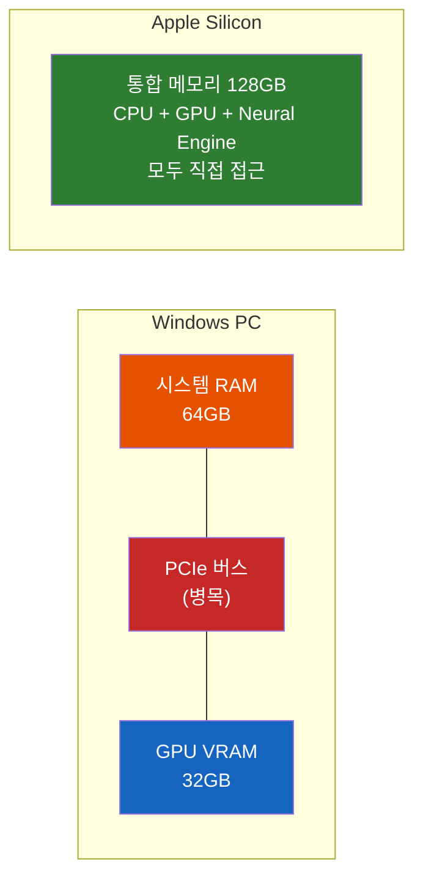
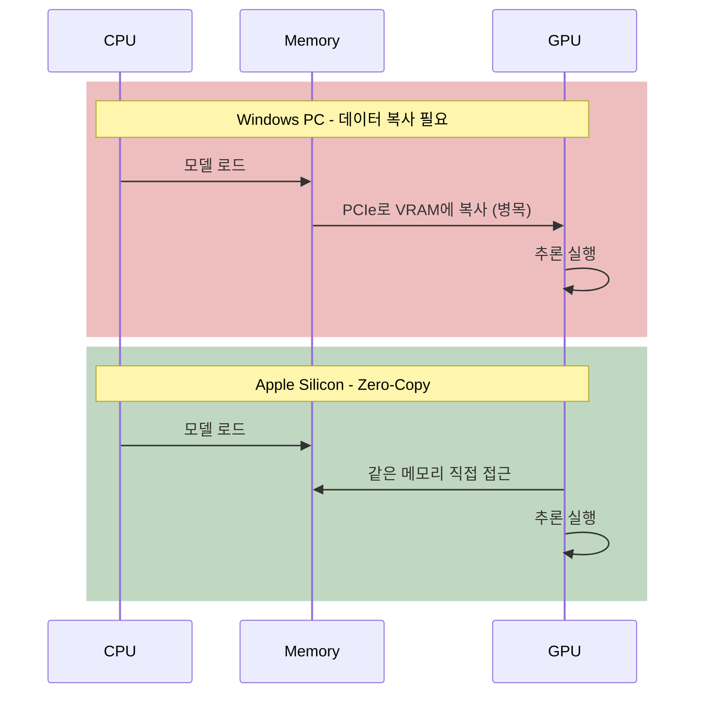
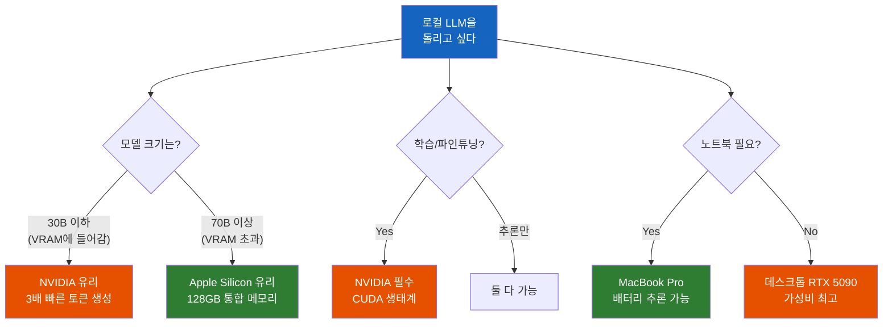

# 로컬 LLM 추론 — Apple Silicon이 NVIDIA GPU를 이기는 순간

VRAM이 크면 무조건 유리할까? 왜 32GB VRAM의 RTX 5090보다 MacBook Pro가 더 큰 모델을 돌릴 수 있을까?

## 결론부터 말하면

**Apple Silicon은 "큰 모델을 돌릴 수 있느냐 없느냐"의 문제에서 구조적 우위를 가진다.** NVIDIA GPU는 VRAM에 모델이 들어가면 압도적으로 빠르지만, 들어가지 않으면 성능이 급격히 떨어진다. Apple Silicon의 통합 메모리(Unified Memory)는 이 "메모리 벽"을 근본적으로 제거한다.

| 항목 | RTX 5090 (데스크톱) | M5 Max (MacBook Pro) |
|------|---------------------|----------------------|
| 모델용 메모리 | **32GB** (VRAM) | **128GB** (통합 메모리) |
| 메모리 대역폭 | **~1,792 GB/s** | **614 GB/s** |
| 모델이 메모리에 들어갈 때 | **훨씬 빠름** (약 3배) | 느리지만 충분 |
| 모델이 메모리를 초과할 때 | **성능 급락** (offload) | 여전히 동작 |

## 1. 왜 VRAM만으로는 부족한가?

로컬에서 LLM을 돌려본 사람이라면 한 번쯤 이런 경험을 했을 것이다. LM Studio에서 8B 모델은 쌩쌩 돌아가는데, 70B 모델을 올리려 하면 "Out of VRAM" 에러가 뜨거나, 올라가더라도 글자가 한 글자씩 느릿느릿 나온다.

이유는 간단하다. **Windows PC에서 AI 모델은 GPU의 VRAM 안에 들어가야 한다.** RTX 5090의 VRAM은 32GB이다. 2026년 4월 기준 최신 모델들의 크기를 보면 문제가 보인다.

| 모델 | Q4 양자화 크기 | RTX 5090 (32GB) |
|------|---------------|-----------------|
| Gemma 4 26B MoE | ~16GB | OK |
| Gemma 4 31B Dense | ~20GB | OK |
| Qwen 3.5 122B MoE | ~64GB | **불가** |
| Llama 4 Maverick 109B | ~60GB | **불가** |
| Qwen 3.5 397B MoE | ~214GB | **불가** |

모델이 VRAM에 안 들어가면 어떻게 될까? 나머지를 시스템 RAM으로 offload해야 한다. 그런데 시스템 RAM과 GPU 사이에는 PCIe 버스가 있고, 이 버스의 대역폭은 고작 **~32 GB/s** (PCIe 5.0 x16 기준)에 불과하다. GPU VRAM의 1,792 GB/s와 비교하면 **56배 느린 병목** 이 생기는 것이다.

## 2. 통합 메모리가 이 문제를 어떻게 해결하는가

Apple Silicon은 메모리 구조 자체가 다르다. CPU, GPU, Neural Engine이 **같은 메모리 풀** 을 공유한다. "시스템 RAM"과 "GPU VRAM"이라는 구분 자체가 없다.

M5 Max MacBook Pro에 128GB 통합 메모리가 있다면, **128GB 전체가 GPU가 직접 접근 가능한 메모리** 다. 이것은 단순히 메모리가 많다는 이야기가 아니다. 핵심은 **데이터 복사가 필요 없다** 는 것이다.

Apple의 ML 프레임워크인 **MLX** 는 이 아키텍처를 극한까지 활용한다. Zero-copy 연산으로 CPU와 GPU 사이에 데이터를 복사할 필요가 없고, lazy evaluation으로 연산을 융합하여 메모리 접근을 최소화한다. 실제 벤치마크에서 MLX는 llama.cpp 대비 **20~87% 높은 처리량** 을 보여주었다.

## 3. 토큰 생성 속도의 비밀 — 메모리 대역폭

그렇다면 모델이 VRAM에 들어가는 경우에는? 여기서는 NVIDIA가 압도적이다. 그 이유를 이해하려면 **토큰 생성의 원리** 를 알아야 한다.

LLM은 텍스트를 생성할 때 **한 번에 하나의 토큰만** 순차적으로 만든다. "안녕하세요"라는 답변을 생성한다면 "안" → "녕" → "하" → "세" → "요"를 하나씩 예측하는 것이다 (실제 토큰 분할은 모델마다 다르다). 그리고 **매 토큰을 생성할 때마다 모델의 전체 가중치를 메모리에서 한 번 읽어야 한다.**

이것이 의미하는 바는 명확하다. 토큰 생성 속도는 연산 능력이 아니라 **메모리에서 데이터를 읽는 속도** 에 의해 결정된다. 이를 간단한 공식으로 표현하면:

$$tok/s \approx \frac{\text{Memory Bandwidth (GB/s)}}{\text{Model Size (GB)}}$$

Qwen 3.5 35B 모델을 Q4 양자화(약 20GB)로 돌린다고 가정하면:

| 하드웨어 | 대역폭 | 이론적 tok/s |
|----------|--------|-------------|
| RTX 5090 | 1,792 GB/s | **~90 tok/s** |
| M5 Max | 614 GB/s | **~30 tok/s** |
| M5 Pro | 307 GB/s | **~15 tok/s** |

RTX 5090이 약 **3배 빠르다.** 실제로 RTX 5090에서 Qwen 3.5-35B-A3B를 돌리면 **200+ tok/s** 가 나온다는 벤치마크가 보고되었다 (MoE 구조로 active 파라미터가 적기 때문에 이론값보다 높다).

### 토큰 속도의 체감

| tok/s | 체감 |
|-------|------|
| 10 이하 | 답답하게 느림 |
| 20~40 | ChatGPT 웹 수준 |
| 60+ | 거의 실시간, 쾌적 |
| 200+ | 눈으로 따라가기 어려울 정도 |

## 4. 그래서 언제 무엇을 선택해야 하는가

핵심은 **"어떤 모델을 돌리느냐"** 에 따라 정답이 달라진다는 것이다.

### NVIDIA를 선택해야 하는 경우

- **30B 이하 모델을 빠르게** 돌리는 것이 목적일 때 (Gemma 4 26B, Qwen 3.5 9B 등)
- 파인튜닝, LoRA 등 **학습** 작업이 필요할 때
- CUDA 전용 도구(vLLM, TensorRT 등)가 필요할 때
- **가성비**: RTX 5090 (~$2,000)으로 32GB VRAM 확보

### Apple Silicon을 선택해야 하는 경우

- **70B 이상 대형 모델** 을 offload 없이 돌리고 싶을 때
- 노트북에서 **이동하면서** AI 추론을 해야 할 때
- **전력 효율** 이 중요한 환경 (배터리, 발열, 소음)
- 프라이버시를 위해 **온디바이스 추론** 이 필수일 때

### 2026년 4월 기준 하드웨어 스펙

| 칩 | 메모리 대역폭 | 최대 메모리 |
|----|-------------|-----------|
| M5 Pro | 307 GB/s | 64 GB |
| M5 Max | 614 GB/s | 128 GB |
| M4 Ultra | 819 GB/s | 512 GB |
| RTX 5090 (데스크톱) | ~1,792 GB/s | 32 GB (VRAM) |
| RTX 5090 (노트북) | ~1,100 GB/s | 24 GB (VRAM) |

## 5. 정리

### 핵심 포인트

1. **VRAM 크기 vs 통합 메모리 — 구조가 다르다**
   - NVIDIA는 GPU VRAM(32GB)에 모델이 들어가야 빠르고, 넘치면 성능이 급락한다
   - Apple Silicon은 통합 메모리(최대 128GB) 전체를 GPU가 직접 접근하므로 "메모리 벽"이 없다

2. **토큰 생성 속도는 메모리 대역폭이 결정한다**
   - $tok/s \approx \text{대역폭} \div \text{모델 크기}$
   - 같은 모델 기준 RTX 5090이 약 3배 빠르지만, 모델이 VRAM에 들어갈 때만 유효하다

3. **정답은 "모델 크기"에 달려 있다**
   - 30B 이하 → NVIDIA (빠른 토큰 생성)
   - 70B 이상 → Apple Silicon (offload 없이 구동 가능)
   - 학습/파인튜닝 → NVIDIA (CUDA 생태계 필수)

---

## 출처

- [Best Mac for AI in 2026: Run Local LLMs on a Budget](https://www.refurb.me/blog/best-mac-for-ai) - Apple Silicon 칩별 스펙 및 통합 메모리 비교
- [Apple M5 Pro MacBook powers Edge AI](https://aragonresearch.com/apple-m5-pro-macbook-powers-edge-ai) - M5 Pro/Max Fusion Architecture 분석
- [llama.cpp: Fast Local LLM Inference, Hardware Choices & Tuning](https://www.clarifai.com/blog/ilama.cpp) - RTX 5090 vs Apple Silicon 대역폭 비교
- [llama.cpp VRAM Requirements: Complete 2026 Guide](https://localllm.in/blog/llamacpp-vram-requirements-for-local-llms) - RTX 5090 32GB VRAM 벤치마크
- [Google Gemma 4 Developer Guide](https://www.lushbinary.com/blog/gemma-4-developer-guide-benchmarks-architecture-local-deployment-2026/) - Gemma 4 모델 스펙 및 로컬 요구사항
- [Qwen3.5 - How to Run Locally](https://unsloth.ai/docs/models/qwen3.5) - Qwen 3.5 모델 크기 및 하드웨어 요구사항
- [Apple has a sleeper advantage when it comes to local LLMs](https://www.xda-developers.com/apple-sleeper-advantage-local-llms/) - MLX와 통합 메모리 장점 분석
- [Native LLM and MLLM Inference at Scale on Apple Silicon](https://www.themoonlight.io/en/review/native-llm-and-mllm-inference-at-scale-on-apple-silicon) - vllm-mlx 벤치마크
