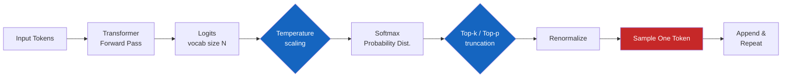
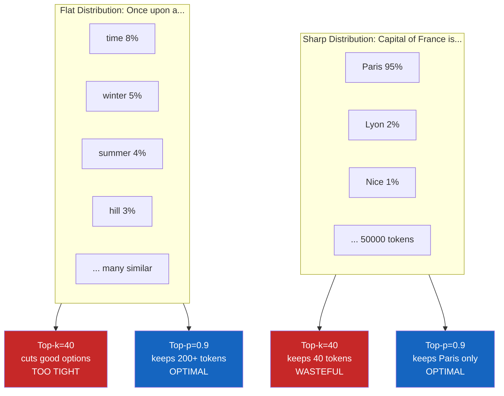

# 왜 LLM API에는 temperature 같은 다이얼이 달려 있을까

OpenAI든 Anthropic이든 LLM API 문서를 펴면 `temperature`, `top_p`, `top_k` 같은 다이얼이 줄줄이 나온다. 처음 보면 "그냥 똑똑한 답 하나 주면 되는 거 아닌가" 싶은데, **이 다이얼들이 없으면 LLM은 실용적인 도구가 못 된다**. 왜 그런지, 그리고 이 다이얼들이 어떻게 진화해왔는지 정리한다.

## 결론부터 말하면

LLM은 매 토큰마다 어휘 전체에 대한 확률 분포를 만든다. 샘플링 파라미터는 이 분포에서 **"어떻게 뽑을지"** 를 결정하는 다이얼이다. 그리고 이 다이얼들의 역사는 **"단순한 cutoff"에서 "분포 모양에 적응하는 cutoff"** 로 진화해온 과정이다.



| 파라미터 | 한 줄 요약 | 등장 시기 |
|---------|-----------|----------|
| Temperature | 분포의 뾰족함을 조절 | 통계물리에서 차용 |
| Top-k | 상위 K개만 후보 | Fan et al. 2018 |
| Top-p (Nucleus) | 누적확률 P까지 후보 | Holtzman et al. 2020 |
| Min-p | 최고 확률의 P배 이상만 후보 | Nguyen et al. ICLR 2025 |

---

## 1. 왜 그냥 1등 토큰을 안 뽑을까

가장 단순한 전략은 **greedy decoding** -- 매 스텝마다 확률이 가장 높은 토큰 하나를 그냥 뽑는 것이다. 결정론적이고, 재현성도 보장된다. 코드 생성이나 분류 같은 작업에선 사실 이게 정답에 가깝다.

문제는 **자연어 생성**이다. 동일한 프롬프트에 항상 똑같은 응답이 나오면 챗봇은 로봇처럼 느껴지고, 창작 작업은 무미건조해진다. 더 큰 문제는 따로 있다. greedy는 종종 **반복 루프(repetition loop)** 에 빠진다.

> "I think I think I think I think I think..."

왜 이런 일이 생기느냐. 한 번 "I think"가 나온 컨텍스트에서 모델이 다시 "I think"를 가장 그럴듯하다고 판단하면, 그 뒤로도 계속 같은 판단이 반복되기 때문이다. greedy는 이 함정을 빠져나올 길이 없다.

그래서 사람들은 **확률 분포에서 샘플링하는** 방향으로 갔다. 매번 같은 토큰을 뽑지 않게, 그러면서도 너무 이상한 토큰은 안 나오게. 이 균형을 잡는 게 샘플링 파라미터들의 본질이다.

---

## 2. Temperature -- 분포의 뾰족함을 조절하는 다이얼

가장 먼저 등장한 다이얼은 temperature다. 이름은 통계물리학의 볼츠만 분포에서 따왔다. softmax에 들어가기 전, logits을 $T$로 나눈다.

$$P(\text{token}_i) = \frac{\exp(\text{logit}_i / T)}{\sum_j \exp(\text{logit}_j / T)}$$

수식이 어려워 보이지만 직관은 간단하다. $T$로 나눈다는 건, $T$가 크면 logits 값들이 서로 비슷해지고, $T$가 작으면 차이가 벌어진다는 뜻이다. 차이가 벌어지면 softmax 후 분포가 **뾰족**해지고, 비슷해지면 **평평**해진다.

| $T$ 값 | 분포 모양 | 결과 |
|--------|----------|------|
| $T \to 0$ | 1등에 집중 (greedy) | 결정론적, 반복 위험 |
| $T = 1.0$ | 원래 분포 그대로 | 모델이 학습한 그대로 |
| $T = 1.5$ | 평평하게 퍼짐 | 창의적, 산만 위험 |

Java 개발자에게 친숙한 비유로 바꿔보자. `Random.nextInt(100)`을 호출할 때 시드를 바꾸는 게 아니라, **확률 분포 자체의 모양**을 바꾸는 거다. 시드는 같은 알고리즘에서 다른 결과를 뽑는 거지만, temperature는 알고리즘이 보는 세계의 형태를 바꾼다.

### Temperature만으로는 부족한 이유

여기서 끝나면 좋겠지만, temperature에는 **롱테일(long-tail) 문제**가 있다. 어휘가 5만 개라고 치자. 각 토큰의 확률이 0.001%씩이라도, 그게 5만 개 모이면 무시 못 할 누적 확률이 된다. $T$를 키우면 이 롱테일이 부각되면서 **"문맥상 말도 안 되는 토큰"** 이 종종 튀어나온다.

> "프랑스의 수도는 **xylophone** 입니다."

확률은 매우 낮지만, 0이 아니다. 그래서 Top-k가 등장한다.

---

## 3. Top-k -- 상위 K개만 살리는 hard cutoff

Fan et al.이 2018년 ACL 논문에서 제안한 방법이다. 아이디어는 단순하다. **확률 상위 K개만 남기고, 나머지는 0으로 잘라낸 뒤 재정규화한다.**

```python
# 의사코드
sorted_probs = sort(probs, descending=True)
top_k_probs = sorted_probs[:K]
top_k_probs = top_k_probs / sum(top_k_probs)  # 재정규화
```

K=40이면 어휘 5만 개 중 40개만 후보가 되니, 이상한 토큰이 튀어나올 확률이 거의 0에 가깝다. 흔히 쓰는 값은 K=40 또는 K=50이다.

### Top-k의 한계 -- "K가 고정이라는 게 함정이다"

문제는 **분포 모양에 무관하게 K가 고정**이라는 점이다. 두 가지 극단을 보자.

**Case 1**: "프랑스의 수도는..." -> 모델은 거의 100% Paris를 확신한다. 이때 K=40을 쓰면 Paris 외에 39개 잡음 후보가 같이 들어온다. 낭비다.

**Case 2**: "옛날 옛적에..." -> 모델은 수많은 자연스러운 다음 단어를 떠올린다(time, winter, summer, hill...). 이때 K=40이면 좋은 후보 160개를 잘라버린다.



이 한계를 해결한 것이 top-p다.

---

## 4. Top-p (Nucleus Sampling) -- 분포 모양에 적응하는 cutoff

Holtzman et al.이 2020년 ICLR 논문 "The Curious Case of Neural Text Degeneration"에서 제안했다. 이 논문은 LLM 샘플링 분야의 고전이다.

아이디어는 K가 아니라 **누적 확률 P**를 기준으로 자르는 것이다.

```python
sorted_probs = sort(probs, descending=True)
cumulative = cumsum(sorted_probs)
# 누적확률이 P에 처음 도달(또는 초과)하는 최소 prefix를 선택
cutoff_idx = first_index_where(cumulative >= P)
nucleus = sorted_probs[: cutoff_idx + 1]
nucleus = nucleus / sum(nucleus)
```

엄밀하게는 "누적확률이 P 이하인 토큰만"이 아니라 **"누적확률이 P를 처음 넘어서는 그 토큰까지 포함"** 한다. 그래야 1등 토큰 하나만으로 이미 P를 넘는 경우(예: Paris 95%)에도 최소 한 개는 남아 분포가 비어버리지 않는다. P=0.9면 "확률 합이 90%를 채우는 데 필요한 최소 개수만" 남긴다고 보면 된다. 분포가 뾰족하면 1~2개만 남고, 분포가 평평하면 200개도 남는다. **모델의 확신도(certainty)에 따라 후보 크기가 자동으로 조절**되는 것이 핵심이다.

이 "후보 집합"이 분포의 머리(nucleus, 핵)를 차지한다는 뜻에서 nucleus sampling이라고도 부른다.

### Top-p가 거의 표준이 된 이유

OpenAI, Anthropic, Google 모두 top_p를 노출하고 있다. 다만 **공식 기본값은 provider/model별로 다르다** -- 예컨대 OpenAI Responses API의 응답 예시는 `top_p: 1.0`(즉 비활성화)으로 보여주고, Gemini의 `topP` 기본값은 모델별로 따로 명시된다. 그리고 OpenAI/Google 모두 "**temperature 와 top_p 중 한쪽만 조정하라**"고 가이드한다. **0.9~0.95는 공식 권장 기본값이라기보다 실무 프로파일에서 자주 쓰이는 값**이라고 이해하는 편이 정확하다.

분포가 어떻게 생기든 적응적으로 동작하니, 운영자 입장에서 다른 다이얼보다 직관적이고 안정적이다. **2020년대 중반까지 가장 많이 쓰인 조합은 "Temperature + Top-p"** 다.

---

## 5. 2025년의 새 흐름 -- Min-p의 등장

2025년 ICLR 오럴 발표로 채택된 Nguyen et al.의 Min-p 논문은 top-p의 약점을 지적했다. 약점은 이거다. **temperature가 높아져 분포가 평평해지면, top-p는 누적 90%를 채우려고 점점 더 많은 저질 토큰을 끌어들인다.**

Min-p의 아이디어는 거꾸로다. 누적 확률이 아니라, **최고 확률 토큰 대비 비율**로 자른다.

$$\text{threshold} = p_{\max} \times p_{\text{base}}$$

`p_base = 0.05`라면, 최고 확률 토큰이 50%일 때 임계값은 2.5%고, 최고 확률 토큰이 10%일 때는 0.5%다. **모델이 확신할 땐 엄격하게, 헷갈릴 땐 너그럽게** 자른다.

`llama.cpp`, `vLLM`, `Ollama`, `HuggingFace Transformers`가 이미 native로 지원하고, 오픈소스 진영에서는 **Temperature + Min-p** 조합이 사실상 새 표준이 됐다. 다만 OpenAI/Anthropic/Google 상용 API는 아직 노출하지 않는다.

---

## 6. 그 외 자주 쓰는 옵션들

### max_tokens

응답 최대 토큰 수. **비용 통제의 핵심**. 컨텍스트 윈도우는 입력 + 출력이라는 점을 까먹지 말자. 다만 모델 스펙시트를 볼 때 **"컨텍스트 윈도우(입력 한도)" 와 "최대 출력 토큰"을 구분**해야 한다. 예컨대 OpenAI GPT-5는 컨텍스트 400K / 최대 출력 128K로 분리되어 있고, Claude Sonnet 4.5는 컨텍스트 200K, Gemini 2.5 Pro는 컨텍스트 1M처럼 모델별로 두 값이 다르게 공시된다. `max_tokens`는 **출력 쪽 한도**에만 영향을 준다.

### stop_sequences

이 문자열이 나오면 즉시 생성 중단. 예: `["\n\nUser:", "```"]`. 구조화된 출력 강제할 때 매우 유용하다. JSON 응답을 받을 때 ```` ``` ```` 마커로 끊는 식.

### frequency_penalty / presence_penalty (OpenAI, Gemini 등)

```
new_logit(token) = logit(token) - frequency_penalty * count(token)
                                 - presence_penalty * has_appeared(token)
```

중요한 포인트: 페널티는 **softmax 이후의 확률(P)이 아니라, 그 전의 logits**에 더해진다. 확률에서 직접 빼면 음수가 나오거나 분포 합이 1을 어겨버리니, 반드시 logits 단계에서 적용된다고 기억해두자.

`frequency_penalty`는 **현재 응답에서 이미 등장한 횟수에 비례해서** logits을 깎고, `presence_penalty`는 **현재 응답에 한 번이라도 등장했으면** 일정량을 깎는다. 여기서 "등장 횟수"는 모델 학습 데이터 전체가 아니라 **지금 생성 중인 응답 한 건 안에서의 카운트**라는 점이 중요하다. 둘 다 -2.0 ~ 2.0 범위. 0.1~0.5 정도면 반복을 효과적으로 줄일 수 있다. OpenAI뿐 아니라 Gemini의 `GenerationConfig`도 `frequencyPenalty`, `presencePenalty` 필드를 지원한다(Anthropic은 노출하지 않음).

### seed (OpenAI)

같은 입력 + 같은 seed -> 같은 출력 (best-effort). **재현성** 확보용. 단, 모델 버전이 바뀌면 깨진다. 테스트 자동화에 유용하다. Anthropic은 OpenAI 호환 SDK에서 `seed`를 받기는 하지만 `Ignored`로 명시되어 있으므로 재현성 보장 수단으로 쓰면 안 된다.

### logprobs / top_logprobs

선택된 토큰의 로그확률을 응답에 포함시키는 옵션. **모델의 confidence 측정**, 분류 신뢰도 평가, RAG 답변 검증에 활용한다.

```python
# 분류 작업에서 모델이 얼마나 확신하는가 측정
response.choices[0].logprobs.content[0].top_logprobs
# [{"token": "예", "logprob": -0.05},
#  {"token": "아니", "logprob": -3.2}]
```

`logprob = -0.05`는 확률 약 95%, `-3.2`는 약 4%. 이 차이로 **"모델이 확실히 '예'라고 답했다"** 를 정량적으로 판단할 수 있다.

### tool_choice / response_format

- **tool_choice**: tool use 강제 ("auto", "any", 특정 tool 지정)
- **response_format**: JSON 스키마 강제 (OpenAI). Anthropic은 native Claude API의 **Structured Outputs** 또는 **strict tool use**로 동등한 효과를 얻을 수 있다 (OpenAI 호환 SDK의 `response_format`은 무시되니 주의). prefill은 보조 패턴 정도로만 활용

---

## 7. 실전 조합 -- 작업별 권장 프로파일

> 주의: 셋(temperature, top_k, top_p)을 모두 동시에 조이면 분포가 의도치 않게 좁아진다. 보통은 **temperature 단독**, 또는 **temperature + top_p** 조합을 쓴다.

```python
# 1. 코드 생성 / JSON 추출 -- 정확성 우선
{"temperature": 0.0, "max_tokens": 2000}

# 2. 문서 요약 -- 사실 기반
{"temperature": 0.3, "top_p": 0.9, "max_tokens": 500}

# 3. 챗봇 -- 자연스러운 대화
{"temperature": 0.7, "top_p": 0.95, "max_tokens": 800}

# 4. 창작 -- 다양성 중시
{
    "temperature": 1.0,
    "top_p": 0.95,
    "max_tokens": 2000,
    "frequency_penalty": 0.3
}

# 5. 분류 -- 확신도 측정
{
    "temperature": 0.0,
    "max_tokens": 5,
    "logprobs": True,
    "top_logprobs": 5
}
```

| 작업 | Temperature | 비고 |
|------|------------|------|
| Code 생성 | 0.0 ~ 0.2 | 결정론적이어야 디버깅 가능 |
| 기술 문서 | 0.2 ~ 0.4 | 정확성 > 스타일 |
| 블로그/요약 | 0.5 ~ 0.7 | 사실과 가독성의 균형 |
| 챗봇 | 0.6 ~ 0.8 | 자연스러움 |
| 창작 | 0.8 ~ 1.2 | 다양성 우선 |
| 브레인스토밍 | 1.0 ~ 1.5 | 의외성 환영 |

---

## 8. 면접/실전에서 자주 묻는 함정들

**Q1. Temperature 0과 Top-k=1의 차이는?**
이론적으로는 동일(둘 다 greedy). 실제 구현에선 부동소수점 오차로 미세한 차이가 날 수 있다. **결과는 같지만 계산 경로가 다르다**는 게 정확한 답.

**Q2. RAG에서 hallucination을 줄이려면?**
- temperature를 0~0.2로 낮춘다
- 프롬프트에 "컨텍스트에 없으면 모른다고 답하라"를 명시한다
- logprobs로 응답의 신뢰도를 게이팅한다 (logprob은 0에 가까울수록 확률이 높으니, 예컨대 첫 토큰 logprob이 **-2.0보다 작으면**(= 약 13.5% 미만이면) 응답 거부 같은 식)

**Q3. 같은 temperature인데 매번 답이 다른 이유는?**
샘플링은 확률적이다. 같은 분포라도 매번 다른 토큰이 뽑힌다. 재현성이 필요하면 `seed` 파라미터를 써야 한다.

**Q4. Reasoning 모델(o1, o3, Claude Opus 4.x with thinking)에선 왜 temperature를 못 만지나?**
체인 오브 쏘트 추론 중에 분포를 흔들면 추론 품질이 망가진다. 그래서 **고정 디폴트로 잠가둔다**. 이건 "다이얼이 사라진" 게 아니라, 모델 제공자가 의도적으로 봉인한 것이다.

---

## 9. 정리

LLM 샘플링 파라미터는 **확률 분포를 어떻게 변형하고, 어디서 자르고, 어떻게 뽑을지**를 제어하는 다이얼이다. 역사적으로 보면 이런 흐름이다.

1. **Greedy** -- 단순하지만 반복 루프에 갇힘
2. **Temperature** -- 분포의 뾰족함은 조절하지만 롱테일은 그대로
3. **Top-k** -- 롱테일은 잘랐지만 분포 모양에 무관
4. **Top-p** -- 분포 모양에 적응, 사실상의 표준
5. **Min-p (2025)** -- 최고 확률 대비 비율로 자르기, 오픈소스 새 표준

> 트렌드는 **수동 튜닝이 덜 필요한 방향**이다. 2026년 시점의 실무 권장은 명확하다. 상용 API라면 **Temperature + Top-p**, 오픈소스 셀프호스팅이라면 **Temperature + Min-p**.

운영 관점에서 가장 중요한 교훈은 이거다. **"기본값(default)을 그냥 두지 말고, 작업의 성격에 맞게 프로파일을 정해두자."** 코드 생성에 temperature=1.0을 두면 디버깅이 지옥이 되고, 챗봇에 temperature=0을 두면 사용자가 도망간다. LLM 도입 프로젝트에서 의외로 자주 놓치는 지점이다.

---

## 출처

- Anthropic API Reference -- Messages: <https://docs.claude.com/en/api/messages>
- OpenAI API Reference -- Chat Completions: <https://platform.openai.com/docs/api-reference/chat>
- Google Gemini API -- GenerationConfig: <https://ai.google.dev/api/generate-content>
- Holtzman, A. et al. (2020). "The Curious Case of Neural Text Degeneration." ICLR 2020. <https://arxiv.org/abs/1904.09751>
- Fan, A., Lewis, M., Dauphin, Y. (2018). "Hierarchical Neural Story Generation." ACL 2018. <https://arxiv.org/abs/1805.04833>
- Nguyen, M. et al. (2025). "Turning Up the Heat: Min-p Sampling for Creative and Coherent LLM Outputs." ICLR 2025. <https://arxiv.org/abs/2407.01082>
- LLM Sampling: Temperature, Top-K, Top-P, and Min-P Explained -- Let's Data Science: <https://letsdatascience.com/blog/llm-sampling-temperature-top-k-top-p-and-min-p-explained>
