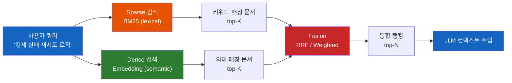
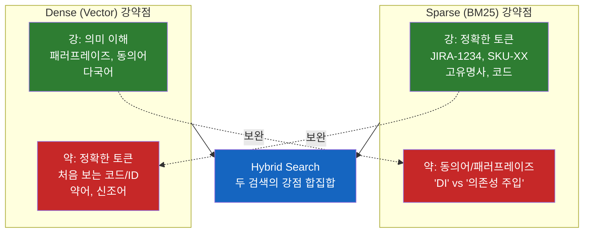
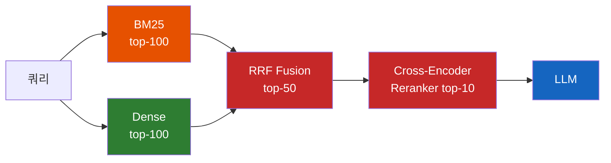

# 왜 RAG 검색은 BM25와 벡터 검색을 둘 다 돌릴까?

요즘 RAG 아키텍처 다이어그램을 보면 "Hybrid Search"라는 박스가 거의 빠지지 않는다. 그런데 이상하다. **검색 한 번이면 충분할 것 같은데, 왜 굳이 두 번 돌려서 합치는 걸 표준으로 만들었을까?**

## 결론부터 말하면

**Sparse 검색(BM25)과 Dense 검색(벡터)은 잘하는 일과 못하는 일이 정반대라서, 둘 중 하나만 쓰면 반드시 어느 한쪽 쿼리에서 무너진다.** 키워드 검색은 `JIRA-1234` 같은 정확한 토큰을 잘 잡지만 "결제 실패 재시도"와 "billing retry"를 같은 거로 못 본다. 벡터 검색은 의미는 잘 보지만 한 번도 본 적 없는 사번·코드·약어 앞에서 헛발질한다. 하이브리드 검색은 둘을 동시에 돌리고 결과를 합쳐서, **두 검색의 약점이 서로의 강점으로 가려지게** 만드는 전략이다.



| 쿼리 유형 | Sparse(BM25) | Dense(Vector) | Hybrid |
|---|---|---|---|
| `JIRA-1234 티켓 내용` | 정확히 매칭 | 비슷한 번호 섞임 | 정확 |
| `결제 실패 시 재시도` | "리트라이"라 적힌 문서 놓침 | 동의어로 매칭 | 정확 |
| `K8s pod OOMKilled 원인` | 약어 매칭 | 의미 매칭 | 둘 다 |

논문 [arXiv:2404.07220 (Blended RAG)](https://arxiv.org/abs/2404.07220) 기준으로 하이브리드는 NQ 데이터셋에서 NDCG@10이 **0.633 -> 0.67**, TREC-COVID에서 **0.804 -> 0.87**처럼 데이터셋 전반에 걸쳐 일관된 개선을 보고하고 있다. 절대 차이는 작아 보이지만, 검색 품질 메트릭에서 5~8%p의 향상은 "굳이 두 번?"이라는 의심을 정량으로 누르는 숫자다.

## 1. 왜 검색 하나로는 부족했을까?

### 1.1 "검색만 잘하면 RAG는 끝난다"는 합의

RAG 파이프라인은 본질적으로 단순하다. **유저 질문 -> 관련 문서 검색 -> LLM에 컨텍스트로 주입 -> 답변 생성**. 이 흐름에서 답변 품질의 상한을 가장 크게 좌우하는 단계는 모델이 아니라 **검색 단계에서 어떤 문서를 가져오느냐**다. 검색이 엉뚱하면 모델은 거의 항상 무너진다. 물론 검색이 깔끔하게 들어와도 생성 단계에서 지시 준수 실패, 컨텍스트 간 충돌, 청크 경계가 잘려 의미가 끊기는 문제 등은 별도로 남는다. 다만 그런 문제들도 검색 품질이 받쳐줘야 의미 있게 다룰 수 있다는 점에서, 검색을 가장 먼저 잡아야 한다는 합의가 자연스럽게 형성됐다.

그래서 처음 RAG가 유행했을 때 사람들은 "이제 키워드 검색은 끝났다, 벡터 검색만 있으면 다 된다"고 생각했다. 의미를 이해하니까 동의어도, 패러프레이즈도, 다국어도 다 잡지 않겠는가? 실제로 데모에서는 정말 그래 보였다.

하지만 프로덕션에 올리고 나서 다들 같은 벽에 부딪혔다.

### 1.2 벽 1: 벡터 검색이 사번을 못 찾는다

사내 위키 RAG 챗봇을 만들었다고 하자. 누군가 이렇게 묻는다.

> "JIRA-1234 티켓 관련 결정사항 알려줘"

벡터 검색은 `JIRA-1234`라는 문자열을 임베딩 공간의 한 점으로 바꾼다. 그런데 임베딩 모델은 이 토큰을 학습한 적이 없다. 더 근본적으로, 임베딩은 텍스트를 수백 차원의 벡터로 **의미 압축**하는 도구라서 "비슷한 의미는 가까이, 다른 의미는 멀리" 배치하도록 만들어졌다. 거기에 BPE 같은 토크나이저가 먼저 `JIRA-1234`를 `JIRA`, `-`, `1234` 같은 부분 토큰으로 분절하고, 그 토큰들을 임베딩 모델이 인코딩한 뒤 mean pooling이나 CLS로 한 벡터로 압축한다. 이 두 단계를 거치는 동안 1234와 1235의 미세한 숫자 차이는 거의 다 흩어져버린다. 결과적으로 이 공간에서는 `JIRA-1234`, `JIRA-1235`, `JIRA-9999`처럼 **숫자만 미세하게 다른 식별자가 거의 같은 위치에 박힌다**. 모델 크기를 키워도 본질적 문제는 풀리지 않는다. 식별자는 "의미"가 아니라 "기호적 일치"가 정답이라서, 벡터화 자체가 잘못된 도구다. 그래서 사용자가 1234를 물어봤는데 1235 티켓 문서가 1순위로 올라오는 일이 벌어진다.

**이게 RAG에서는 치명적이다.** LLM은 검색 결과를 사실로 믿고 답을 만든다. 1235 문서를 1234라고 부르며 답하기 시작한다. 환각의 시작점은 모델이 아니라 검색이었다.

### 1.3 벽 2: 키워드 검색은 "리트라이"를 못 찾는다

그래서 다시 BM25로 돌아간다. BM25는 토큰을 정확히 매칭하니까 1234와 1235를 헷갈리지 않는다. 그런데 이번엔 다른 질문이 들어온다.

> "결제 실패 시 재시도 로직 어떻게 짰지?"

문서에는 이렇게 적혀 있다.

> "Payment failure에 대한 retry policy는 exponential backoff를 사용한다."

BM25 입장에서 "결제 실패", "재시도"라는 토큰은 이 문서에 없다. 0점이다. 의미상 100% 일치하는 문서를 0점으로 던져버린다. **키워드 검색은 단어를 모르면 의미를 모른다.**

물론 실무에서는 형태소 분석기(Analyzer)와 동의어 사전(synonym filter)으로 어느 정도 보완한다. "재시도"-"리트라이"-"retry"를 같은 토큰으로 묶어두면 BM25가 매칭에 성공한다. 다만 이건 **색인 시점에 사람이 미리 정의해 둔 동의어에 한정**된다. 새로 등장하는 표현, 문맥에 따라 달라지는 의미, 쿼리어와 문서어의 자연스러운 차이를 모두 사전으로 잡기는 불가능하다. BM25는 본질적으로 "색인 시점에 토큰화된 단어에 종속적인" 검색이다.

반면 벡터 검색은 **적절한 multilingual 또는 도메인 임베딩 모델을 쓴다는 전제 하에**, 사전을 한 줄도 만들지 않아도 "결제 실패"와 "billing failure", "payment retry"를 임베딩 공간상 가까운 점으로 묶는다. 모델이 해당 표현을 학습한 만큼 자동 매칭이 따라온다는 뜻이라, 한국어 위주 RAG에서 영어 모델만 쓰면 이 이점이 깨질 수도 있다. 그래도 적절한 모델을 골랐다면 **사전 유지보수 비용을 들이지 않고 의미 매칭이 따라오는 것**이 dense 검색의 가장 큰 운영상 이점이다.

### 1.4 두 벽의 본질은 같다

두 실패는 정반대처럼 보이지만, 사실 같은 문제의 다른 얼굴이다. **검색 시스템에 "단 하나의 매칭 기준"을 줬기 때문에**, 그 기준을 벗어나는 쿼리에서 반드시 무너진다.



흥미로운 건 **두 검색의 약점이 정확히 서로의 강점에 대응한다**는 점이다. 그래서 "한쪽을 더 잘 만들자"가 아니라 "둘을 같이 돌리자"가 자연스러운 답이 된다. 이게 하이브리드 검색의 출발이다.

## 2. 핵심 개념: 두 트랙으로 동시에, 그리고 합치기

하이브리드 검색은 단어가 멋있어 보일 뿐, 구조는 단순하다. **같은 쿼리를 두 검색기에 던지고, 각자가 뽑은 후보 목록을 하나로 합친다.** 핵심은 두 단계로 나뉜다.

### 2.1 두 검색기를 병렬로 돌린다

| 트랙 | 인덱스 | 점수 | 잘하는 일 |
|---|---|---|---|
| Sparse | inverted index (Lucene) | BM25 점수 $[0, \infty)$ | 정확한 토큰 매칭 |
| Dense | vector index (HNSW, IVF) | cosine 유사도 $[-1, 1]$ | 의미적 유사도 |

두 인덱스는 완전히 다른 자료구조다. BM25는 "어떤 단어가 어느 문서에 몇 번 나왔는가"를 inverted index로 본다. Dense는 문서를 768/1024차원의 벡터로 임베딩해서 벡터 공간에 박아두고, 쿼리도 같은 공간에 박아서 가까운 점을 찾는다. 따로 인덱스를 두 개 운영한다는 점이 비용이지만, 그 비용이 검색 품질에 분명한 가치를 만든다.

### 2.2 두 결과를 어떻게 합칠까

여기가 진짜 어려운 부분이다. 두 검색이 서로 다른 단위의 점수를 뱉어내기 때문이다. BM25 점수가 35.7이고 cosine이 0.91일 때 어느 쪽이 "더 적합"한가? 단순히 더하면 BM25가 늘 이긴다. 정규화를 해도 분포가 달라서 가중치 튜닝이 끝없이 필요하다.

이 문제의 가장 표준적인 해법이 **Reciprocal Rank Fusion(RRF)** 이다. "점수를 믿지 말고 순위만 믿자"는 발상으로, 다음 공식을 쓴다.

$$
\text{RRF\_score}(d) = \sum_{i \in \{\text{sparse, dense}\}} \frac{1}{k + \text{rank}_i(d)}
$$

$k$는 보통 60. 각 검색에서 문서 $d$가 몇 등인지만 보고, 그 역수를 합쳐서 최종 점수로 쓴다. 점수의 절대값을 버리는 대신 **두 검색이 모두 상위로 끌어올린 문서**가 자연스럽게 위로 올라오게 만든다.

> RRF 자체의 깊이 있는 분석은 [왜 하이브리드 검색은 점수 대신 순위로 결과를 합칠까](./왜-하이브리드-검색은-점수-대신-순위로-결과를-합칠까.md) 글에서 별도로 다룬다. 이 글에서는 "왜 합치는가"의 큰 그림에 집중한다.

대안으로 **Weighted Sum**도 있다. 점수를 정규화한 뒤 $\alpha$ 가중치를 줘서 $\alpha \cdot \text{sparse} + (1-\alpha) \cdot \text{dense}$로 합친다. 데이터셋에 맞춰 $\alpha$를 튜닝할 수 있다는 장점이 있지만, 라벨링된 평가 데이터가 없으면 튜닝이 어렵다는 게 단점이다. 그래서 실무 시작점은 거의 항상 RRF다.

## 3. 실제 사례: Elasticsearch 8.x의 하이브리드 쿼리

추상이 길었으니 진짜 코드를 보자. Elasticsearch는 8.8에서 `rank.rrf` 객체를 기술 미리보기로 처음 도입했고, 8.9에서 조합 범위와 하이브리드 활용이 확대되었다. 이후 8.14에서 `retriever` 추상화를 추가해 8.16에서 GA로 굳혔다. 아래는 `retriever` 문법(**8.14+**)으로 BM25 트랙과 kNN 트랙을 한 번에 묶는 예시다.

```json
POST docs/_search
{
  "retriever": {
    "rrf": {
      "retrievers": [
        {
          "standard": {
            "query": {
              "match": { "content": "결제 실패 재시도 로직" }
            }
          }
        },
        {
          "knn": {
            "field": "content_vector",
            "query_vector": [0.12, -0.04, ...],
            "k": 50,
            "num_candidates": 200
          }
        }
      ],
      "rank_window_size": 50,
      "rank_constant": 60
    }
  }
}
```

각 retriever가 따로 후보를 뽑은 뒤, ES가 자동으로 RRF 융합을 해서 최종 순위를 돌려준다. **개발자는 점수를 어떻게 합칠지 고민할 필요가 없고, "어떤 두 검색을 합치고 싶은가"만 선언하면 된다.** 이게 하이브리드 검색이 표준 도구가 됐다는 가장 명확한 증거다.

Java 백엔드 관점에서 비유하면, BM25는 `Map.equals()`로 정확한 키 매칭을 보장하는 도구이고, 벡터 검색은 `Comparator`로 의미적 거리를 재는 도구다. 둘 다 자료구조에 한 번씩 통과시킨 뒤 결과를 머지하는 셈인데, ES `rrf`가 그 머지 로직을 캡슐화해 주는 것이다.

### 3.1 그럼 언제 하이브리드를 안 쓰는가

하이브리드가 만능은 아니다. 다음 두 경우엔 단일 검색이 더 낫다.

| 상황 | 권장 | 이유 |
|---|---|---|
| 코드 검색 (e.g. GitHub Code Search) | Sparse 우세 | 토큰 정확성이 의미보다 압도적으로 중요 |
| 추천 시스템 (사용자 -> 비슷한 아이템) | Dense 단독 | 토큰 자체가 없거나 무의미함 |
| 일반 사내 RAG, 챗봇, FAQ | **Hybrid** | 자연어 + 고유명사 혼재 |

코드 검색에 벡터를 더하면 오히려 노이즈가 늘어난다. 추천에 BM25를 더하면 의미 없는 ID 매칭이 끼어든다. **"하이브리드를 쓴다"는 결정은 "쿼리에 자연어와 고유명사가 섞여 있는가"에 달려 있다.** 일반적인 RAG 챗봇은 거의 다 여기에 해당해서 하이브리드가 기본값이 된 것이다.

### 3.2 비용과 표준 파이프라인

하이브리드는 공짜가 아니다. 인덱스를 두 개 운영하고, 검색마다 두 번 쿼리를 던지고, fusion 로직이 한 번 더 돈다. 그래도 검색 품질을 깎지 않고 비용을 통제하는 **표준 패턴**은 다음과 같다.



핵심은 **두 검색을 병렬로 돌리고 합친 다음, 마지막 깔때기로 무거운 cross-encoder 리랭커를 top-10에만 적용**하는 것이다. 두 트랙이 모두 후보군에 기여하기 때문에 1.3에서 본 "키워드 없는 의미적 매칭 문서"도 dense 트랙으로 살아남는다. 비용은 리랭킹 단계의 입력 크기를 50~100건으로 묶어 통제한다.

> **"BM25를 prefilter로 쓰자"는 변형 패턴**도 있다. 1차로 BM25 top-200을 뽑고 그 안에서만 dense 재검색을 돌리는 구조인데, 인덱스를 한 번만 풀스캔하니 비용이 더 작다. 다만 **이건 1.3에서 지적한 회상률 한계를 그대로 안고 가는 트레이드오프**다. BM25에서 0점을 받은 의미적 매칭 문서는 dense 단계에 도달하기 전에 이미 탈락한다. 따라서 코드/ID 비중이 압도적으로 높아 "BM25에서 어차피 떨어질 문서면 가져갈 가치도 없다"고 단정할 수 있는 도메인에서만 안전하다. 일반적인 RAG에는 위의 병렬 패턴이 표준이다.

## 4. 정리

### 핵심 포인트

1. **하이브리드는 한쪽의 약점을 다른 쪽의 강점으로 가리는 전략이다**
   - Sparse는 정확한 토큰에 강하고 의미에 약함
   - Dense는 의미에 강하고 처음 보는 토큰에 약함
   - 두 약점이 서로의 강점에 정확히 대응하기 때문에, 합치면 합집합에 가까운 회상률이 나온다

2. **합치는 방식의 표준은 RRF**
   - 점수 스케일이 다른 두 검색을 합치는 건 본질적으로 어려움
   - "점수 대신 순위만 믿자"는 RRF의 발상이 가장 단순하고 robust해서 ES 8.9+, Weaviate, Qdrant 등이 fusion API로 1급 지원
   - Pinecone은 RRF 내장 대신 단일 hybrid index의 점수 결합 또는 별도 sparse/dense 결과 머지 + 호스팅 리랭커 방식으로 하이브리드를 제공
   - 라벨 데이터가 있다면 weighted sum으로 튜닝하는 것도 가능

3. **하이브리드 = "자연어 + 고유명사 혼재 쿼리"의 기본값**
   - 사내 RAG, FAQ 챗봇, 기술 문서 검색은 거의 다 이 카테고리
   - 코드 검색은 sparse 우세, 추천은 dense 단독이 더 적합
   - "검색을 하나만 쓸까 둘을 쓸까"의 판단 기준은 쿼리의 성격이지 일반론이 아니다

---

## 출처

- [Elasticsearch RRF Retriever 공식 문서](https://www.elastic.co/guide/en/elasticsearch/reference/current/rrf.html) - 공식 문서
- [arXiv:2404.07220 - Blended RAG: Improving RAG Accuracy with Semantic Search and Hybrid Query-Based Retrievers](https://arxiv.org/abs/2404.07220) - NDCG 개선 벤치마크
- [Hybrid Search for RAG: BM25, SPLADE, and Vector Search Combined - Prem AI](https://blog.premai.io/hybrid-search-for-rag-bm25-splade-and-vector-search-combined/)
- [Improving Search and RAG with Vectors and BM25 - Cloudurable](https://cloudurable.com/blog/improving-search-and-rag-with-vectors-and-bm25/)
- [Redis - Hybrid search benefits for RAG systems](https://redis.io/blog/hybrid-search-benefits-rag-systems/)
