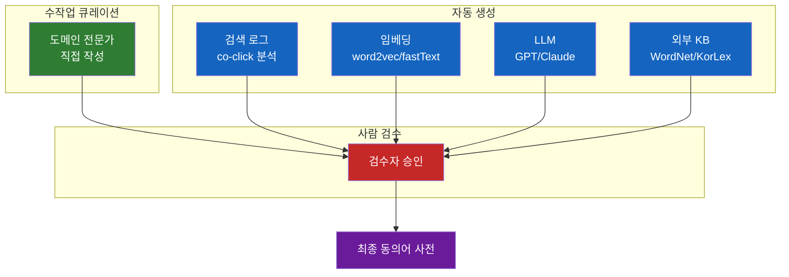
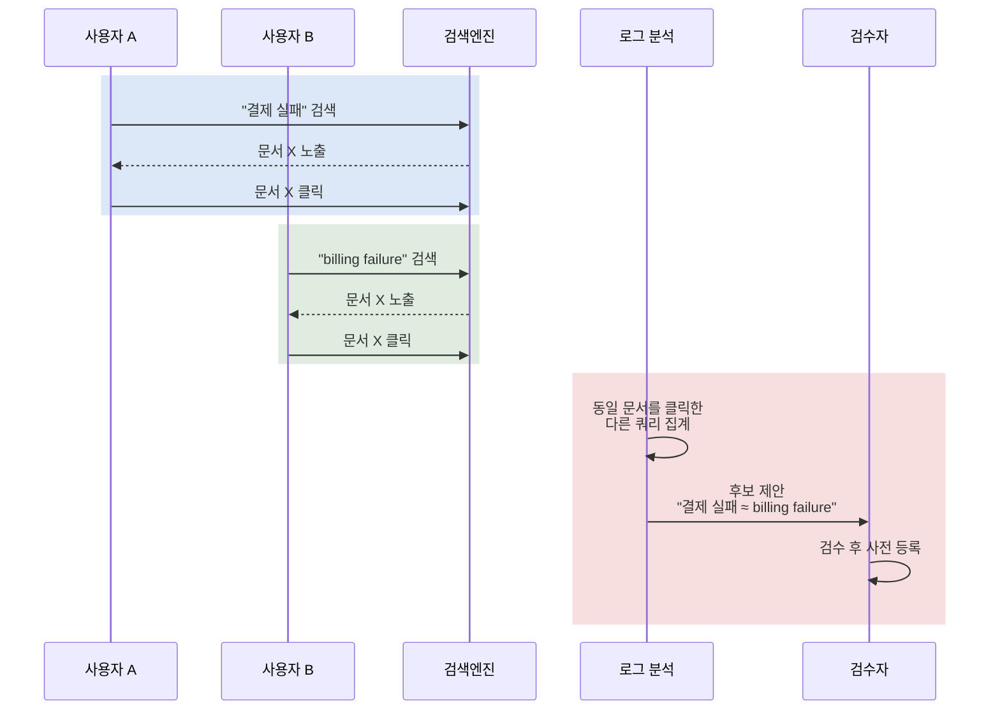

# 왜 검색엔진은 아직도 동의어 사전을 손으로 관리할까?

요즘 사내 검색이나 RAG 챗봇 설정 화면을 들여다보면 어김없이 등장하는 텍스트 박스가 있다. **"동의어 사전(Synonym Dictionary)"**. 한 줄에 `결제, 빌링, billing, payment` 같은 식으로 쉼표로 단어들을 묶어두는 그 파일이다. 임베딩이 의미를 이해하는 시대인데, 왜 이 1960년대식 도구가 지금도 사라지지 않고 검색 시스템 한가운데에 박혀 있는 걸까?

## 결론부터 말하면

**동의어 사전은 키워드 검색이 "단어를 모르면 의미를 모른다"는 본질적 한계를 가졌기 때문에 태어난 도구**다. BM25는 토큰을 정확히 매칭해야 점수를 주는데, 사용자가 "재시도"라고 검색하면 문서에 적힌 "리트라이"는 0점이 된다. 이 간극을 메우는 가장 단순하고 검증된 방법이 **색인이나 쿼리 시점에 토큰을 동의어로 확장해주는 것**이다. 임베딩이 의미를 이해해주는 지금도 사전이 살아남은 이유는, **잘못된 동의어 한 줄이 검색 전체를 오염시키기 때문에** 검색 품질의 하한선을 보장하려면 사람이 검수한 사전을 기반에 깔아야 한다는 운영 경험 때문이다.


| 시점 | 동작 | 비유 (Java 개발자용) |
|---|---|---|
| 색인(index-time) | 문서 색인할 때 동의어로 확장해서 저장 | `@PostConstruct`로 한 번 변환해서 캐시 |
| 쿼리(query-time) | 검색할 때마다 쿼리를 동의어로 확장 | 매 요청마다 `Interceptor`에서 변환 |

## 1. 왜 동의어 사전이 필요했는가

### 1.1 키워드 검색의 본질적 한계

BM25 같은 키워드 검색은 본질적으로 **inverted index에 등록된 토큰과 쿼리 토큰의 정확한 일치**로 점수를 매긴다. 토큰화는 빠르고, 점수 계산은 결정론적이고, 디버깅도 쉽다. 그래서 1990년대부터 지금까지 검색의 기본기로 자리 잡았다.

문제는 인간이 같은 의미를 너무 다양한 방식으로 표현한다는 점이다. 사용자가 "노트북"이라 검색하면 문서에 적힌 "laptop", "랩탑", "휴대용 컴퓨터"는 모두 0점이 된다. **의미는 100% 일치하는데 점수는 0**. 이 비대칭이 키워드 검색의 가장 오래된 약점이다.

### 1.2 "그냥 임베딩 쓰면 되지 않나?"라는 의심

벡터 검색이 등장하면서 많은 사람이 "이제 동의어 사전 같은 건 박물관에 보낼 때가 됐다"고 생각했다. 임베딩 모델은 "노트북"과 "laptop"을 비슷한 위치에 배치하니까, 더 이상 사람이 매핑을 손으로 관리할 필요가 없어 보였기 때문이다.

하지만 프로덕션에 올려보면 같은 벽에 부딪힌다. **임베딩은 의미적 유사도는 잘 잡지만 보장이 없다**. "결제"와 "환불"도 cosine 0.85 정도는 쉽게 나오는데, 검색 의도는 정반대다. 모델 버전을 바꾸면 어제 잘 잡히던 매칭이 오늘 깨지기도 한다. **"이 쿼리에는 반드시 이 문서가 매칭돼야 한다"는 비즈니스 룰을 임베딩만으로는 강제할 수 없다.**

반면 동의어 사전은 단순하고 강력하다. `결제, 빌링`이라고 한 줄 적으면, 모델이 어떻게 학습됐든 두 토큰은 100% 매칭된다. 이 결정론적 특성이 운영자에게는 마음의 평화를 준다. **그래서 임베딩이 등장한 뒤에도 동의어 사전은 사라지지 않고, 오히려 하이브리드 검색의 sparse 트랙을 떠받치는 역할로 더 중요해졌다.**

### 1.3 "결제 실패"와 "billing failure"의 간극

구체적으로 한 사례를 보자. 사내 위키에 이런 문서가 있다.

> "Payment failure 시 retry policy는 exponential backoff를 사용한다."

사용자가 이렇게 검색한다.

> "결제 실패 시 재시도 로직"

BM25 입장에서 두 텍스트가 공유하는 의미 있는 토큰은 거의 없다. 한국어 조사 "시" 같은 토큰이 우연히 겹쳐 미세한 점수가 나올 수는 있지만, 이런 노이즈는 보통 불용어(stopword) 필터로 걸러내므로 실효 점수는 0에 가깝다. 의미상 100% 일치하는 문서를 검색 결과에서 떨어뜨려버리는 이 간극을 해결하는 가장 단순한 방법이 동의어 사전 한 줄이다.

```
결제, payment, billing
실패, failure, fail
재시도, retry, 리트라이, 리트라이로직
```

이 매핑이 색인이나 쿼리 시점에 적용되면, BM25는 두 텍스트를 정확히 매칭한다. **사전 한 줄이 검색 회상률(recall)을 즉시 올려준다**는 단순한 사실이, 이 도구가 60년 넘게 살아남은 이유다.

## 2. 핵심 개념: 동의어 사전은 어디서 왔고 어떻게 작동하나

### 2.1 60년 묵은 도구의 계보

동의어 사전은 RAG 시대에 새로 만들어진 개념이 아니다. **정보 검색(Information Retrieval, IR)** 분야의 가장 오래된 도구 중 하나다.

| 시기 | 무엇 | 의미 |
|---|---|---|
| 1960s | SMART (Cornell) | "쿼리 확장(query expansion)" 개념 등장 |
| 1985~ | WordNet (Princeton) | 영어 단어를 동의어 집합(synset)으로 묶은 어휘 DB |
| 2000s | Lucene 분석기 체계 (Tokenizer + TokenFilter) 정립 | 동의어 처리를 분석 파이프라인의 한 단계로 모델링 |
| 2011 | Lucene 3.5.0 SynonymFilter (multi-word 지원) | 검색엔진 분석 체인의 표준 컴포넌트로 정착 |
| 2020s | ES Synonyms API, synonym_graph | Updateable, multi-word 동의어 지원 |

**WordNet**은 학술적 뿌리에서 가장 중요한 자원이다. Princeton의 인지과학자 George Miller가 1985년부터 만든 영어 어휘 데이터베이스로, 단어를 "synset"이라는 동의어 집합으로 묶고 동의어/반의어/상위어/하위어 관계를 그래프로 표현한다. 지금도 학술 IR 논문에서 "쿼리 확장(query expansion) using WordNet" 같은 제목을 쉽게 볼 수 있다.

이 학술적 흐름이 **Lucene**(2000년대 초)으로 들어오면서 산업 표준이 됐다. Lucene은 텍스트 분석을 "토크나이저 → 필터들"의 파이프라인으로 모델링했고, 그중 한 필터가 `SynonymFilter`였다. Elasticsearch와 Solr가 모두 Lucene 위에 올라가 있으니, 오늘날 우리가 쓰는 거의 모든 키워드 검색 시스템은 같은 디자인을 공유한다.

### 2.2 분석기 파이프라인 안에서의 위치

Java 개발자 비유로 설명하면, Lucene의 분석기는 **Spring의 `MessageConverter` 체인**과 비슷하다. 텍스트가 들어오면 토크나이저(Tokenizer)가 토큰으로 쪼개고, 그다음 여러 필터(TokenFilter)가 순차적으로 토큰을 변환한다.


`Synonym Filter`는 이 파이프라인 안의 한 스테이지다. 들어오는 토큰을 보고, 사전에 매핑이 있으면 추가 토큰을 같은 위치에 끼워 넣는다. 예를 들어 `재시도`라는 토큰이 들어오면, 같은 위치에 `retry`와 `리트라이`를 추가한다. inverted index 입장에서는 이제 세 토큰 모두로 이 문서를 찾을 수 있다.

### 2.3 매핑 형식: 단방향과 양방향

동의어 사전의 한 줄은 두 가지 방향성을 가질 수 있다.

| 형식 | 예시 | 동작 |
|---|---|---|
| 양방향(equivalent) | `노트북, laptop, 랩탑` | 어느 단어로 검색해도 모두 매칭 |
| 단방향(explicit) | `노트북 => laptop, 랩탑` | 좌변 토큰을 우변 토큰들로 **대체(replace)** |

양방향이 직관적이지만 부작용도 있다. 예컨대 `차, car, 자동차`로 묶어두면 "차 한 잔"을 검색했을 때 자동차 광고가 섞일 수 있다. 그래서 도메인에 따라 단방향을 의도적으로 쓰는 경우가 많다. 사용자 쿼리에서 자주 등장하는 표현(예: "노트북")은 문서 표현(예: "laptop")으로 단방향 확장만 해두면 안전하다.

> **운영 팁 -- `=>` 사용 시 자주 하는 실수**: Lucene의 `=>` 연산자는 좌변을 우변으로 **대체**한다. 그래서 `노트북 => laptop, 랩탑`로 적고 query-time에만 사전을 적용하면, 사용자가 "노트북"으로 검색해도 쿼리가 "laptop"/"랩탑"으로 바뀌어 **원문에 "노트북"이 그대로 적힌 문서를 못 찾는 누락**이 발생한다. 이를 막으려면 우변에 자기 자신을 반드시 포함해야 한다: `노트북 => 노트북, laptop, 랩탑`. 양방향 매핑(`,`로만 묶기)을 쓸 때는 이 문제가 없다.
>
> 그럼 왜 굳이 위험을 감수하고 `=>`를 쓸까? 대표적 사용 사례는 **노이즈 토큰을 의도적으로 정규화**하고 싶을 때다. 예컨대 `xs => extra small`처럼 약어를 풀어쓴 정규형으로 통일하거나, `db, 디비 => database`처럼 다양한 표기 변형을 한 토큰으로 모아 인덱스 통계를 안정시키는 경우다. 좌변 토큰을 검색 결과에 노출시킬 필요가 없을 때만 안전하게 쓸 수 있다.

### 2.4 적용 시점: Index-time vs Query-time

이게 운영 결정의 핵심이다. **언제 동의어를 확장할 것인가?**


| 항목 | Index-time | Query-time |
|---|---|---|
| 색인 크기 | 커짐 (확장된 토큰 모두 저장) | 원본만 저장 |
| 쿼리 속도 | 빠름 (단순 매칭) | 약간 느림 (확장 후 매칭) |
| 사전 변경 시 | **전체 reindex 필요** | 즉시 반영 가능 |
| 인덱스 통계(IDF/Norm) | 확장된 토큰이 IDF/문서 길이에 영향 | 인덱스 통계 왜곡 없음 |

> **주의**: query-time이라고 해서 최종 스코어가 안 바뀌는 게 아니다. 쿼리가 여러 토큰으로 확장되면 각 토큰의 점수가 합산되므로 결과 스코어는 당연히 달라진다. 다만 인덱스에 저장된 IDF·필드 길이 같은 **통계치 자체는 원본 텍스트 기준으로 유지**된다는 점이 핵심이다.

Elastic 공식 가이드는 **query-time을 권장한다**. 이유는 운영 유연성이다. 동의어 사전은 운영 중에 자주 바뀌는데, 그때마다 수십 GB 인덱스를 다시 만드는 건 비현실적이다. ES 8.10부터는 `synonyms_set`을 API로 관리하고 `updateable: true` 옵션으로 **재시작 없이 사전을 갱신**할 수 있다.

다만 multi-word 동의어를 다룰 때는 `synonym` 필터 대신 `synonym_graph` 필터를 써야 한다. `synonym_graph`는 멀티 토큰 동의어를 올바른 토큰 그래프로 만들어 phrase 매칭이 깨지지 않게 해준다.

## 3. 어떻게 구축하나: 5가지 방법과 운영 패턴

이제 본론이다. **이 사전을 도대체 어떻게 만들어 나가는가?** 실무에서는 다섯 가지 방법을 섞어 쓴다.



### 3.1 수작업 큐레이션 (가장 흔하고 가장 안정적)

가장 원시적이지만 여전히 가장 많이 쓰이는 방법이다. CS팀, 도메인 전문가, 검색 운영자가 **직접 텍스트 파일에 한 줄씩 추가**한다.

```
# synonyms.txt (Solr/Lucene 포맷)
결제, 빌링, billing, payment
재시도, 리트라이, retry
주문번호, 오더아이디, order_id, OID
xs => xs, extra small
s, sm => s, sm, small
```

> 위 예시의 `=>` 규칙은 좌변 토큰을 우변에 포함시켜 누락을 막는 형태로 작성했다 (2.3절의 운영 팁 참조). **Query-time 전용 운영(이 글에서 권장하는 표준)에서는 항상 자기 자신을 우변에 포함시키는 게 안전하다**. 좌변 토큰을 결과에서 완전히 제거하는 순수 정규화(`xs => extra small`)가 목적이라면, index-time과 query-time 양쪽에 동일한 규칙을 적용해서 인덱스와 쿼리가 모두 같은 정규형으로 통일되어야 한다.

운영 부담은 있지만 **품질이 가장 안정적**이다. 도메인 핵심 용어 50~100개 정도는 거의 다 이 방식으로 시작한다. 잘못된 매핑이 들어가도 누가 넣었는지 추적 가능하고, 즉시 롤백할 수 있다.

운영 팁: **사전을 Git으로 버전 관리**하고, PR 리뷰를 거쳐서 추가하는 게 표준이다. 단순한 텍스트 파일이지만 검색 품질에 미치는 영향은 코드만큼 크다.

### 3.2 검색 로그 기반 자동 추출 (co-click analysis)

가장 강력한 자동화 방법. **사용자가 같은 의도로 입력한 다른 표현을 로그에서 찾는다.**



원리는 단순하다. **두 다른 쿼리가 같은 문서를 클릭하면, 그 두 쿼리는 의미적으로 비슷할 가능성이 높다**. 이걸 통계적으로 누적해서 후보를 뽑는다. 쿠팡, 네이버 같은 회사들이 내부적으로 이걸 대규모로 돌린다.

발전형으로는 "검색했지만 클릭 없음" 쿼리를 분석해서 **동의어 누락 후보**를 찾는 방법도 있다. 사용자가 "결제 실패"로 검색했는데 결과가 없거나 클릭이 없다면, 비슷한 쿼리("billing failure")의 결과를 보여줘야 했던 게 아닌지 의심해볼 수 있다.

### 3.3 임베딩 기반 자동 생성

word2vec, fastText, 또는 sentence embedding으로 단어 간 cosine 유사도를 계산해서 후보를 뽑는다. Apache Lucene에는 2023년부터 **Word2VecSynonymFilter**가 들어왔는데, 임베딩 모델을 분석기 체인에 끼워서 동의어를 즉석 생성하는 TokenFilter다. 분석기 체인 어디에 붙이느냐에 따라 index-time, search-time 모두에서 동작할 수 있다. 다만 이건 **single-token 동의어만 지원하는 experimental API**라서, multi-word 표현이나 운영용 사전 전체를 대체하는 도구로 쓸 수는 없다. "사전 후보를 빠르게 만드는 보조 도구" 정도로 보는 게 맞다.

```python
# 개념적 코드
similar = word2vec_model.most_similar("결제", topn=10)
# → [("빌링", 0.87), ("결재", 0.82), ("payment", 0.79), ...]
```

문제는 **유사도가 높다고 동의어가 아니라는 점**이다. "결제"와 "환불"도 임베딩상 가깝게 나오지만 검색 의도는 정반대다. "긍정"과 "부정"도 cosine 0.7 이상으로 묶이는 경우가 흔하다(반의어 문제). 그래서 항상 **후보 생성 → 사람 검수** 워크플로우로 간다. 자동으로 사전에 바로 들어가는 운영은 거의 없다.

### 3.4 외부 KB(Knowledge Base) 활용

| 자원 | 용도 |
|---|---|
| WordNet | 영어 일반 동의어/유의어 |
| KorLex, 우리말샘 | 한국어 동의어/유의어 |
| Wikipedia redirect | "USA" → "United States" 같은 표기 변형 |
| 도메인 온톨로지 (UMLS, MeSH) | 의료 분야 |
| SNOMED CT | 임상 의학 용어 |

도메인이 명확한 경우 매우 효과적이다. 의료 RAG라면 UMLS 온톨로지의 동의어 관계를 그대로 import하면 도메인 사전 90%가 한 번에 채워진다. 일반 도메인은 효과가 들쭉날쭉해서 보조 수단으로 쓴다.

### 3.5 LLM 기반 (최근 트렌드)

GPT/Claude에게 도메인 핵심 용어 N개를 주고 동의어와 약어를 뽑게 하는 방식이다. 최근 1~2년 사이 PoC 단계에서 가장 빠르게 사전 초안을 만드는 방법으로 자리 잡았다.

프롬프트 예시:
```
다음은 우리 회사 결제 시스템의 핵심 용어 50개다.
각 용어에 대해 사용자가 검색에 쓸 만한 동의어, 약어, 영문 표기를 나열해줘.
출력은 JSON 배열로:
[{"term": "결제", "synonyms": ["빌링", "billing", "payment"]}]
```

장점은 도메인 적응이 매우 빠르다는 점이고, 단점은 **LLM이 자신감 있게 틀리는 경우가 많다**는 점이다. "결제"와 "결재"를 동의어로 묶거나, 도메인에서 의미가 다른 단어를 묶는 실수를 한다. 그래서 이 방식도 결국 사람 검수가 필수다.

### 3.6 5가지 방법 비교

| 방법 | 정확도 | 자동화 | 도메인 적응 | 운영 비용 |
|---|---|---|---|---|
| 수작업 | ★★★★★ | ★ | ★★★★ | 높음 |
| 로그 기반 | ★★★★ | ★★★★ | ★★★★★ | 중간 (로그 파이프라인 필요) |
| 임베딩 | ★★★ | ★★★★★ | ★★ | 낮음 |
| 외부 KB | ★★★★ | ★★★ | ★★ (도메인 한정) | 낮음 |
| LLM | ★★★ | ★★★★★ | ★★★★ | 낮음 (API 비용만) |

핵심 결론: **자동화가 강할수록 정확도가 떨어진다.** 그래서 실무에서는 자동 생성으로 후보를 뽑고, 사람이 검수해서 최종 사전에 반영하는 하이브리드 워크플로우를 쓴다.

## 4. 실제 사례: Elasticsearch 8.x로 보는 동의어 운영

추상이 길었으니 실제 코드를 보자. ES 8.10에서 `Synonyms API`가 추가됐고(8.10 릴리스 노트는 beta로 소개), 현재 v8 공식 API 문서에서는 GA로 제공되고 있다. 사전을 텍스트 파일이 아니라 API로 관리할 수 있다.

### 4.1 동의어 세트 등록

```bash
PUT _synonyms/payment-domain
{
  "synonyms_set": [
    { "id": "rule-1", "synonyms": "결제, 빌링, billing, payment" },
    { "id": "rule-2", "synonyms": "재시도, 리트라이, retry" },
    { "id": "rule-3", "synonyms": "노트북 => 노트북, laptop, 랩탑" }
  ]
}
```

> rule-3에서 `=>` 우변에 좌변 토큰("노트북")을 의도적으로 포함시켰다. 2.3절에서 언급한 대체(replace) 동작 때문에, 자기 자신을 빼면 원문에 "노트북"이 적힌 문서를 못 찾는 누락이 생긴다.

`id`가 있어서 한 줄씩 update/delete가 가능하다. CS팀이 운영 중에 "이 매핑은 빼주세요"라고 하면 해당 `id`만 지우면 된다.

### 4.2 인덱스 분석기에 연결

문서 전반의 한국어 예시("결제", "재시도")와 일관되게, 아래 셋업은 **`nori_tokenizer` 기준**으로 작성했다. ES 공식 문서는 `standard` 토크나이저도 Unicode Text Segmentation 기반으로 대부분 언어에 동작한다고 설명하지만, 한국어 검색 품질과 복합어/형태소 처리를 위해서는 `nori` 사용이 권장된다. 다만 어떤 토크나이저를 쓰든 **사전을 등록하기 전에 `_analyze` API로 실제 토큰 경계를 검증해야 매칭이 의도대로 동작한다**.

```bash
PUT search-docs
{
  "settings": {
    "analysis": {
      "tokenizer": {
        "korean_tokenizer": {
          "type": "nori_tokenizer",
          "decompound_mode": "discard",
          "user_dictionary_rules": ["재시도"]
        }
      },
      "filter": {
        "payment_synonyms": {
          "type": "synonym_graph",
          "synonyms_set": "payment-domain",
          "updateable": true
        }
      },
      "analyzer": {
        "search_analyzer": {
          "tokenizer": "korean_tokenizer",
          "filter": ["lowercase", "payment_synonyms"]
        },
        "index_analyzer": {
          "tokenizer": "korean_tokenizer",
          "filter": ["lowercase"]
        }
      }
    }
  },
  "mappings": {
    "properties": {
      "content": {
        "type": "text",
        "analyzer": "index_analyzer",
        "search_analyzer": "search_analyzer"
      }
    }
  }
}
```

> 사전을 등록하기 전에 반드시 `_analyze` API로 분석기가 "재시도"를 단일 토큰으로 뽑는지 먼저 확인해야 한다. 토큰 경계가 사전 키와 어긋나면 사전을 등록해도 매칭이 일어나지 않는다 (4.5절 참조).

핵심 두 가지:

1. **`updateable: true`** -- 사전 변경을 재시작 없이 적용할 수 있다. 단, query-time analyzer에서만 동작한다. (참고: 이 파라미터는 `synonym`과 `synonym_graph` 양쪽 필터에서 모두 공식 지원된다. 위 코드처럼 `synonym_graph` + `updateable: true` 조합이 표준 패턴이다.)
2. **`analyzer`(색인용)와 `search_analyzer`(쿼리용) 분리** -- 색인은 원본만, 쿼리는 동의어 확장 적용. 사전 변경 시 reindex 불필요.

### 4.3 사전 갱신: API 기반 vs 파일 기반

```bash
# API 기반: 사전 한 줄 추가하면 연결된 search analyzer가 자동 reload됨
PUT _synonyms/payment-domain/rule-4
{
  "synonyms": "주문번호, 오더아이디, order_id, OID"
}
# 끝. 별도 reload 호출 불필요.
```

ES 공식 문서 기준으로 **Synonyms API로 관리하는 synonyms set은 변경 시 연결된 search analyzer가 자동으로 reload**된다. 운영자가 따로 reload API를 호출할 필요가 없다.

반면 **파일 기반(`synonyms_path`)으로 동의어를 관리하는 경우**에는 명시적으로 reload를 호출해야 한다.

```bash
# 파일 기반: synonyms.txt를 직접 수정한 뒤
POST search-docs/_reload_search_analyzers
```

이 흐름이 운영자에게 결정적이다. **한밤중에 CS팀이 "이 동의어 빠진 게 검색 안 돼요"라고 알람을 보내도, 5분 안에 API 한 번 호출하면 끝난다.** index-time 동의어였다면 수 시간짜리 reindex가 돌아야 했을 일이다.

### 4.4 운영 시 자주 만나는 함정: 하이라이팅

Query-time 동의어 확장을 쓰면 **검색 결과 하이라이팅이 깨지는 경우**가 있다. 사용자가 "노트북"으로 검색했는데 매칭된 문서에는 "laptop"만 적혀 있다면, 기본 하이라이터는 어디를 강조해야 할지 모른다. ES에서는 `unified`나 `fvh`(fast vector highlighter) 하이라이터의 옵션을 조정하거나, 매칭된 동의어 토큰까지 강조하도록 분석기 설정을 명시적으로 맞춰야 한다. 사전 도입 후 "검색은 잘 되는데 결과 하이라이팅이 비어 보인다"는 CS 알람이 올라오면 가장 먼저 의심해야 할 지점이다.

> `fvh`를 대안으로 고른다면 필드 매핑에 `term_vector: with_positions_offsets`를 추가해야 하는데, 이는 **인덱스 디스크 사용량을 상당히 증가**시킨다(필드에 따라 30~50% 이상). 하이라이팅 품질과 저장 비용 사이의 트레이드오프를 사전에 계산해야 한다.

### 4.5 한국어 환경에서의 추가 고려

한국어는 형태소 분석기까지 같이 고려해야 한다. ES 공식 한국어 분석기로는 `nori`가 있고, 코난테크놀로지/Saltlux 같은 한국어 NLP 전문 업체들이 더 정교한 형태소 분석기를 판다.

핵심은 **형태소 분석 결과와 동의어 사전이 호환되어야 한다**는 점이다. 분석기가 "재시도"를 "재" + "시도"로 쪼개버리면, 사전에 `재시도, retry`라고 적어도 매칭이 안 된다. 그래서 한국어 환경에서는 **사용자 사전(user dictionary)에 "재시도"를 단일 토큰으로 등록**하고, 그 다음 동의어 사전에 매핑을 거는 두 단계 셋업이 표준이다.

> **중요 -- 토크나이저는 동의어 필터보다 먼저 동작한다**: 분석 파이프라인은 항상 `Tokenizer → TokenFilter` 순서다. 동의어 필터는 토크나이저가 이미 쪼개놓은 토큰을 입력으로 받기 때문에, **토크나이저 단계에서 분리된 단어를 동의어 사전이 사후에 다시 합칠 수는 없다**. "사전에 `재시도, retry`라고 적기만 하면 분석기가 알아서 단어로 인식하겠지"라는 오해는 여기서 깨진다. 단일 토큰 단위로 묶어야 한다면 반드시 **사용자 사전 등록이 선행**되어야 한다.

특히 nori를 쓴다면 **`decompound_mode` 설정(`none`/`discard`/`mixed`)**에 따라 복합어가 어떻게 쪼개지는지 달라진다. 같은 "재시도"가 mode에 따라 단일 토큰으로도, 분해된 토큰으로도, 둘 다로도 인덱싱될 수 있다. 사전을 등록하기 전에 `_analyze` API로 실제 토큰화 결과를 먼저 확인하지 않으면, "사전 등록은 했는데 매칭이 안 된다"는 함정에 자주 빠진다.

구체적인 예로, 사전에 `결제실패, payment failure`라고 등록했다고 해보자. 분석기가 "결제실패"를 `결제` + `실패`로 쪼개어 인덱싱하면, 사전의 `결제실패`라는 문자열 키는 어떤 토큰과도 일치하지 않으므로 동의어 매핑이 동작하지 않는다. **사전의 단어는 반드시 분석기가 실제로 뱉어내는 토큰과 일치하는 형태로 등록**해야 한다. 이게 "단어가 아니라 토큰을 사전에 등록한다"는 표현의 진짜 의미다.

> **필터 체인 순서 주의**: 동의어 필터는 일반적으로 정규화 필터들(`lowercase` 등) **뒤에 두어 깨끗한 토큰을 받는 것**이 안전한 시작점이다. 예컨대 사용자가 "결제는"이라고 입력했을 때 조사 "는"을 제거하는 필터가 동의어 필터보다 뒤에 있으면, 동의어 필터는 "결제는"이라는 토큰을 보게 되어 사전의 `결제` 키와 매칭되지 않을 수 있다. 단, `stop`이나 품사 필터를 동의어 필터 앞에 두면 동의어 규칙의 좌변 자체가 분석 과정에서 제거되어 reload 오류나 규칙 무력화가 일어날 수 있다. 어떤 순서를 택하든 **`_analyze` API로 실제 토큰 스트림과 synonym rule 파싱 결과를 함께 확인**하는 게 가장 확실하다.

## 5. 전문 업체: 누가 이 일을 대신해주는가

자체 구축이 어렵거나 한국어 NLP가 부족할 때 협업하는 업체들이 있다.

### 5.1 글로벌 검색 솔루션 (동의어 사전 내장)

| 업체 | 강점 |
|---|---|
| **Elastic** | Elasticsearch 본가, Synonyms API + Inference 통합 |
| **Lucidworks** | Apache Solr 엔터프라이즈, ML 기반 자동 동의어 |
| **Algolia** | 검색 SaaS, 동의어 관리 UI 내장, Rules API |
| **Coveo** | 엔터프라이즈 검색, 학습형 동의어 (사용자 행동 기반) |
| **Yext** | 검색 플랫폼, 비즈니스 데이터 특화 |

이 업체들은 단순히 키워드 매칭만 제공하지 않는다. **사용자 행동 로그를 받아서 동의어 후보를 자동 추출하고, 운영자에게 검수 UI를 제공하는 워크플로우 전체를 솔루션화**해서 판다.

### 5.2 한국어 NLP 전문 업체

| 업체 | 강점 |
|---|---|
| **Saltlux** | 한국어 시맨틱 엔진, 도메인 온톨로지, LLM 플랫폼 |
| **코난테크놀로지** | 한국어 형태소 분석기 (업체 자체 발표 기준 오픈소스 대비 5.6배 속도, 99% 정확도), 동의어 사전 솔루션 |
| **다이퀘스트(DiQuest)** | 엔터프라이즈 한국어 검색 |
| **Wisenut** | 한국어 검색엔진, 검색 SI |

이 업체들은 단순히 "동의어 사전 파일"만 파는 게 아니라, **형태소 분석기 + 동의어 + 불용어 + 사용자 사전 + 운영 도구**를 패키지로 판다. 사내 RAG에서 한국어 검색 품질이 안 잡힐 때, 특히 의료/법률/금융처럼 도메인 사전이 방대하게 필요한 경우 이런 업체와 협업하는 사례가 많다.

비용은 도메인 크기와 SLA에 따라 다르지만, 엔터프라이즈 라이선스는 보통 **연간 수천만 원~수억 원** 수준이다. 자체 구축의 인건비와 비교해서 의사결정한다.

## 6. 정리

### 핵심 포인트

1. **동의어 사전은 키워드 검색의 본질적 한계를 메우는 도구다**
   - BM25는 토큰을 정확히 일치해야 점수를 주므로, "결제"와 "billing"의 간극을 사전이 메운다
   - 1960년대 IR 시스템부터 내려온 표준 도구이고, Lucene/ES가 그 유산을 그대로 잇는다

2. **임베딩 시대에도 사전이 사라지지 않은 이유는 "보장" 때문이다**
   - 임베딩은 의미를 잘 잡지만 "이 쿼리에는 반드시 이 문서"라는 비즈니스 룰을 강제하지 못한다
   - 검수된 사전은 의도한 매칭을 결정론적으로 강제하고 예측 가능한 방식으로 오탐을 줄일 수 있어, 검색 품질의 하한선 보장에 쓰인다 (물론 사전 자체가 잘못되면 오염이 그대로 퍼지므로 큐레이션 품질이 전제다)

3. **구축은 5가지 방법의 하이브리드다**
   - 수작업 큐레이션이 가장 정확하지만 비용이 크다
   - 로그 기반 co-click 분석이 가장 강력한 자동화 수단이다
   - 임베딩과 LLM은 후보 생성에 효과적이지만 반드시 사람 검수가 필요하다
   - 외부 KB(WordNet, KorLex, UMLS)는 도메인이 명확할 때 큰 도움이 된다

4. **운영의 핵심은 query-time + updateable 조합**
   - ES 8.10+의 Synonyms API와 `synonym_graph` + `updateable: true` 조합이 표준
   - 사전 변경을 재시작/reindex 없이 즉시 반영할 수 있어야 운영이 살아난다

5. **자체 구축이 어렵다면 전문 업체 검토**
   - 글로벌: Elastic, Algolia, Lucidworks, Coveo
   - 국내: Saltlux, 코난테크놀로지, DiQuest, Wisenut

### 본인 프로젝트에 적용한다면

1. **Day 0 (Cold Start)**: 검색 로그가 아직 없는 신규 서비스라면, LLM에게 도메인 지식을 주고 초안 사전을 만들게 한 뒤 사람이 검수하는 방식으로 출발선의 품질을 확보
2. **MVP 단계**: 도메인 핵심 용어 50~100개를 수작업 사전으로 다듬어가며 Git으로 버전 관리
3. **로그 쌓이면**: "검색했지만 클릭 없음" 쿼리를 분석해서 동의어 누락 후보 추출 (co-click 분석으로 정교화)
4. **규모 커지면**: LLM으로 후보 생성 → 사람 검수 워크플로우 자동화
5. **품질 한계 오면**: 한국어 NLP 전문 업체 검토 (특히 의료/법률/금융 도메인)

그리고 잊지 말아야 할 것: **동의어 사전을 아무리 잘 만들어도 BM25만으로는 한계가 있다.** 결국 dense retrieval과 합쳐서 하이브리드 검색으로 가야 사전에 없는 표현까지 잡힌다. 동의어 사전은 sparse 트랙의 품질을 올리는 도구이지, 검색 전체를 책임지는 도구는 아니다.

### 더 깊이 파볼 만한 후속 주제

- **동의어 확장과 BM25 스코어링의 상호작용** -- `should` 절, phrase query, `minimum_should_match`와 결합될 때 점수가 어떻게 달라지는지
- **LLM 기반 Query Rewriting** -- 비즈니스 핵심 용어는 동의어 사전으로 강제하고, 모호한 자연어 문맥은 LLM Rewriter로 해결하는 계층적 전략 (HyDE, Multi-query Retrieval)
- **다의어(Polysemy) 해결을 위한 Query Intent Classification** -- "차(tea/car)" 같은 중의성을 사전 도입 전 의도 분류로 먼저 풀기
- **Synonym Rule 단위의 효과 측정** -- 새 rule 도입 전후 recall, precision, zero-result 감소율, 클릭률을 비교하는 regression test 세트 운영

---

## 출처

- [Elasticsearch Synonyms API 공식 문서](https://www.elastic.co/docs/solutions/search/full-text/search-with-synonyms) - 공식 문서
- [Elasticsearch Synonym Graph Token Filter](https://www.elastic.co/guide/en/elasticsearch/reference/current/analysis-synonym-graph-tokenfilter.html) - 공식 문서
- [WordNet - Princeton University](https://wordnet.princeton.edu/) - WordNet 원본 프로젝트
- [Apache Lucene Word2Vec Synonym Filter (Issue #12168)](https://github.com/apache/lucene/issues/12168) - 임베딩 기반 자동 동의어
- [Sease - Word2Vec Model To Generate Synonyms on the Fly](https://sease.io/2023/04/word2vec-model-to-generate-synonyms-on-the-fly-in-apache-lucene-introduction.html)
- [Pulse - Elasticsearch Synonym Filter Guide](https://pulse.support/kb/elasticsearch-synonym-filter-guide)
- [Improving Query Expansion Using WordNet (arXiv:1309.4938)](https://arxiv.org/abs/1309.4938) - WordNet 기반 쿼리 확장 연구
- [Saltlux - 초거대 언어모델 구축 플랫폼](https://www.saltlux.com/kor/contents/view.do?mId=42)
- [왜 RAG 검색은 BM25와 벡터 검색을 둘 다 돌릴까?](./왜-RAG-검색은-BM25와-벡터-검색을-둘-다-돌릴까.md) - 동일 저장소의 하이브리드 검색 글
