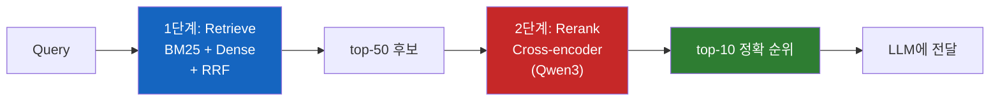
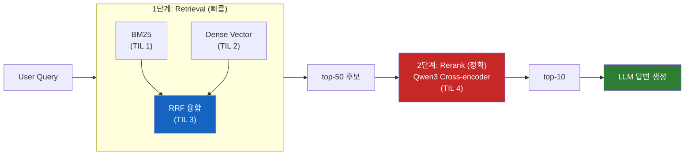

# 왜 빠른 검색 뒤에 느린 모델을 또 붙일까?

하이브리드 검색으로 후보를 뽑았는데, 왜 거기에 더 느린 Cross-encoder 리랭커를 또 돌리는 걸까? Bi-encoder만으로는 왜 부족했을까?

## 결론부터 말하면

**임베딩 기반 검색(Bi-encoder)은 query와 document를 독립적으로 벡터화한다. 그래서 둘 사이의 **세밀한 상호작용** 을 포착하지 못한다.** Cross-encoder 리랭커는 query와 document를 **한 덩어리로 묶어 Transformer에 통과시켜** 관련성을 점수로 내는 모델이다. 정확도는 훨씬 높지만 느리기 때문에 수백만 문서에 쓸 수 없다. 그래서 현대 RAG는 항상 **2단계** 다. 빠른 recall(1단계) + 정확한 precision(2단계)이라는 분업 구조가 비용과 품질을 동시에 만족시키는 유일한 답이다.



| 항목 | Bi-encoder (임베딩) | Cross-encoder (리랭커) |
|---|---|---|
| 구조 | query, doc 각각 독립 인코딩 | query+doc을 함께 입력 |
| Query-Doc 상호작용 | 없음 | 전체 cross-attention |
| 속도 | 빠름 (ANN 검색) | 느림 (쌍마다 forward pass) |
| 적합 스케일 | 수백만~수십억 문서 | top-k (수십~수백) |
| 역할 | Stage 1: **Recall** | Stage 2: **Precision** |

지난 세 TIL(BM25, Dense Vector, RRF)에서 본 것은 전부 1단계에 해당한다. 이번 TIL은 왜 거기서 멈추면 안 되는지, 그리고 Cross-encoder가 어떻게 1단계의 약점을 메우는지를 다룬다.

## 1. 왜 Bi-encoder만으로는 부족한가?

### 1.1 Bi-encoder의 구조

Dense Vector 검색의 기본 구조는 이렇다. query 문장을 임베딩 모델에 통과시켜 벡터 하나를 얻고, 문서도 같은 방식으로 벡터 하나를 얻는다. 그다음 두 벡터의 cosine 유사도로 관련성을 측정한다.

핵심은 **"query와 document가 모델 안에서 한 번도 만나지 않는다"** 는 점이다. 각자 따로 인코딩되어 벡터 공간에 던져지고, 비교는 그 후에 수학적으로만 이뤄진다. 이런 구조를 **Bi-encoder(또는 Dual-encoder)** 라고 부른다. 이 구조 덕분에 수백만 개 문서의 벡터를 **미리 인덱싱** 할 수 있고, 쿼리가 들어오면 ANN 검색으로 밀리초 단위에 top-K를 뽑을 수 있다.

속도는 이 구조의 가장 큰 미덕이다. 그리고 동시에 이 구조의 가장 큰 약점이기도 하다.

### 1.2 정보 병목: "싱글 벡터로 압축된다"는 말의 무게

Bi-encoder는 문서 전체의 의미를 **고정 길이 벡터 하나** (예: 1024차원)로 압축한다. 긴 문서든 짧은 문서든, 복잡한 주제든 단순한 주제든, 출력은 똑같이 벡터 하나다. 이 압축 과정에서 **query와 document의 토큰이 서로 상호작용할 기회가 영영 사라진다.**

왜 이게 문제일까? 실제 관련성은 종종 "어떤 단어가 함께 있느냐"가 아니라 "특정 질문에 대해 이 문서가 실제로 답을 제공하느냐"에 달려있다. 예를 들어 **"Python garbage collection 에러 해결"** 이라는 쿼리에 다음 문서가 들어왔다고 하자.

> "Python 메모리 관리의 기초 — GC 알고리즘은 참조 카운팅과 세대별 수집으로 구성된다. 일반적인 동작 원리는..."

이 문서는 "Python", "garbage collection"이라는 키워드를 다 갖고 있다. **BM25는 키워드가 정확히 겹치기 때문에 이 문서에 높은 점수를 준다. Bi-encoder는 주제 자체가 비슷하기 때문에 임베딩 공간에서 쿼리 근처에 배치한다.** 둘 다 각자의 기준으로는 "관련 있다"고 판단하는 것이다. cosine 유사도도 높게 나온다. 그런데 사용자가 원한 건 **에러 해결 방법** 인데, 이 문서는 기초 개념 설명일 뿐이다. 답을 주지 못한다.

이 차이를 **단 하나의 벡터** 만 보고 구분하는 건 물리적으로 어렵다. **"개념 설명 문서"** 와 **"에러 해결 문서"** 가 임베딩 공간에서 거의 같은 자리에 놓여있기 때문이다. 두 문서의 의미는 비슷한데, **query와의 관계** 는 완전히 다르다. Bi-encoder의 구조는 "관계"를 볼 수 없다.

### 1.3 또 다른 약점: 부정, 조건, 뉘앙스

더 까다로운 예도 있다.

- 쿼리: "코로나 백신이 **없는** 나라 목록"
- 후보 문서: "2024년 기준 코로나 백신 접종률이 높은 국가들..."

임베딩 공간에서 두 문장은 어휘상 거의 같은 자리에 있다. "코로나 백신"이라는 핵심 키워드가 겹치기 때문이다. 하지만 "없는"이라는 한 단어가 의미를 **완전히 뒤집는다**. Bi-encoder는 이 부정(negation)을 포착할 능력이 부족하다. 학습 시점에 negation을 명시적으로 학습하지 않은 이상, 싱글 벡터 압축은 이런 미세한 의미 반전을 잃어버린다.

조건문("만약 X라면 Y")이나 질문 유형("방법" vs "이유" vs "예시")도 마찬가지다. 임베딩은 거시적인 의미 클러스터는 잘 잡지만, **미세한 관계** 는 놓친다.

그래서 등장하는 것이 Cross-encoder다.

## 2. Cross-encoder의 아이디어

### 2.1 query와 document를 한 번에 집어넣는다

Cross-encoder의 구조는 단순하다. Bi-encoder처럼 query와 document를 따로 인코딩하는 대신, 둘을 **이어붙여서 Transformer에 통째로 넣는다**.

```
입력: [CLS] query 문장 [SEP] document 문장 [SEP]
출력: 관련성 점수 하나 (0~1)
```

이 입력이 Transformer의 self-attention 레이어를 통과할 때, query의 모든 토큰과 document의 모든 토큰이 **서로를 직접 "본다"**. "garbage collection 에러"라는 query 토큰이 document 안의 "참조 카운팅 알고리즘" 토큰을 직접 참조할 수 있다. 그 결과 "이 문서는 에러 해결이 아니라 알고리즘 설명이구나"라는 판단이 가능해진다. Bi-encoder가 놓쳤던 **query-document 상호작용** 이 모델 내부에서 직접 이뤄지는 것이다.

### 2.2 그런데 왜 1단계에 쓸 수 없을까?

"그렇게 좋으면 처음부터 Cross-encoder를 쓰면 되잖아?" 이게 당연한 다음 질문이다. 답은 **비용** 이다.

Bi-encoder는 문서 벡터를 **미리 인덱싱** 해둘 수 있다. 쿼리가 들어오면 쿼리만 인코딩하고, 그 벡터와 인덱스에 저장된 문서 벡터들을 ANN 알고리즘으로 비교한다. 수백만 문서여도 밀리초 단위에 끝난다.

Cross-encoder는 이게 불가능하다. **매번 query와 document를 **쌍으로 묶어서** Transformer를 통과시켜야** 하기 때문이다. 문서 벡터를 미리 계산해둘 수 없다. query가 달라지면 처음부터 다시 해야 한다.

숫자로 체감해보자. Pinecone의 추정에 따르면, 4천만 건의 문서에 대해 작은 BERT 크기 Cross-encoder로 단 한 번의 쿼리를 처리하려면 V100 GPU에서 **50시간 이상** 이 걸린다. 같은 작업을 Bi-encoder + ANN으로 하면 **100ms 미만** 이다. 대략 180만 배 차이다. 실시간 검색은커녕 하루에 한 번도 못 돌린다.

### 2.3 해결책: 2단계 분업

여기서 자연스럽게 **2단계 검색(two-stage retrieval)** 철학이 나온다.

| 단계 | 담당 | 목적 | 규모 |
|---|---|---|---|
| 1단계 (Retrieve) | Bi-encoder, BM25, RRF | **Recall**: 정답을 놓치지 않기 | 수백만~수십억 |
| 2단계 (Rerank) | Cross-encoder | **Precision**: 상위권 순서 정확히 | top-50~200 |

1단계는 **폭넓게 캐스팅** 한다. "이 중에 정답이 있을 확률이 높은" 후보 수십~수백 개를 빠르게 뽑는다. 정확한 순위는 중요하지 않다. 일단 정답을 후보 풀 안에 넣기만 하면 된다. 2단계는 그 **좁은 후보 풀** 에 대해서만 Cross-encoder를 돌린다. 50개 문서에 대한 50번의 forward pass는 수백 ms면 끝난다. 감당 가능한 비용이다.

### 2.4 "Retriever sets the ceiling"

2단계 파이프라인에는 반드시 기억해야 할 철칙이 있다. **"1단계가 못 가져온 문서는 2단계가 절대 못 올린다."** Cross-encoder가 아무리 정확해도, 애초에 후보 풀에 없는 문서는 점수를 매길 대상조차 되지 못한다.

이 사실은 실무에서 튜닝 우선순위를 결정한다. 리랭커를 교체해 성능을 쥐어짜려 하기 전에, **1단계의 recall(top-100 내 정답 포함률)이 충분한지** 부터 확인해야 한다. recall이 80%인 1단계에 아무리 좋은 리랭커를 붙여도 최대 정확도는 80%에서 막힌다. 정답을 못 가져오는데 어떻게 재정렬하겠는가.

비유가 도움이 된다. 1단계 검색은 **서점 점원** 에 가깝다. 수많은 책의 제목과 뒷표지를 빠르게 훑어보고 관련 있어 보이는 50권을 골라 당신에게 건네준다. 점원은 빠르지만 책을 읽지는 않는다. 2단계 리랭커는 **전문가** 다. 그 50권을 실제로 펼쳐서 해당 페이지를 읽어보고, **"이 책이 당신 질문에 정말로 답을 주는지"** 를 판단한다. 점원이 놓친 책은 전문가가 볼 기회조차 없다. 그래서 점원의 눈썰미(1단계 recall)가 전체 시스템의 상한을 결정한다.

## 3. Qwen3 Reranker 실전

### 3.1 Qwen3 Reranker의 포지션

Qwen3는 Alibaba가 2025년 6월에 공개한 오픈 임베딩·리랭커 시리즈다. 세 가지 크기(0.6B, 4B, 8B)로 나오고, 임베딩 모델과 리랭커 모델이 **쌍으로** 제공된다. 8B 임베딩 모델은 MTEB multilingual 리더보드 1위(70.58점)를 기록했고, 100개 이상의 언어를 지원한다.

특히 한국어·일본어·중국어를 포함한 아시아 언어 리랭킹에서 강하다는 점이 한국어 RAG 시스템에게 중요한 선택 이유가 된다. Cohere Rerank 같은 상용 API는 영어 중심이고 한국어 성능이 상대적으로 약한 반면, Qwen3는 다국어 사전학습을 강하게 한 모델 위에 리랭킹 task로 fine-tune됐다.

### 3.2 구조: yes/no logit 방식

Qwen3 Reranker의 내부 구조는 조금 독특하다. 일반적인 Cross-encoder는 마지막 분류 헤드에서 0~1 점수를 바로 내놓는다. 반면 Qwen3는 **causal language modeling** 기반이다. query와 document를 프롬프트 형태로 입력한 뒤, 모델에게 **"이 문서가 query에 관련 있는가? yes/no"** 를 묻고, 출력 로짓에서 "yes" 토큰과 "no" 토큰의 확률 비율로 관련성 점수를 계산한다.

$$
\text{score} = \frac{P(\text{yes})}{P(\text{yes}) + P(\text{no})}
$$

이 방식의 장점은 **instruction tuning** 과 자연스럽게 결합된다는 것이다. 쿼리 앞에 "금융 도메인의 FAQ를 찾는 task입니다"처럼 지시문을 붙이면, 같은 모델이 도메인마다 다른 점수 분포를 낼 수 있다. Qwen 논문에 따르면 instruction을 주는 것만으로 관련 task에서 **1~5% 성능 향상** 이 나온다. 별도의 도메인 fine-tuning 없이 zero-shot 커스터마이징이 가능한 것이다.

### 3.3 실제 파이프라인 배치

이전 세 TIL의 내용과 합치면 전체 그림은 이렇게 된다.



실무에서 중요한 숫자 몇 가지를 정리하면 이렇다.

| 파라미터 | 권장값 | 의미 |
|---|---|---|
| 1단계 retriever top-K | 50~100 | 너무 작으면 recall 손실, 너무 크면 2단계 비용 증가 |
| 리랭커 모델 크기 | 0.6B (저지연) ~ 4B (중간) | 8B는 배치 추론 가능한 오프라인 파이프라인용 |
| 최종 top-N | 5~10 | LLM 컨텍스트 윈도우와 답변 품질의 트레이드오프 |
| 리랭커 추가 지연 | 100~500ms | 1단계 대비 가장 큰 비용 증가 지점 |

Qwen3-Reranker-0.6B는 **저지연 실시간 서비스** 에 쓰기 좋고, 4B는 균형, 8B는 품질이 중요한 **배치 분석 파이프라인** 이나 평가용으로 쓴다. 내 경험상 프로덕션 챗봇에는 0.6B로 시작해 품질이 부족하면 4B로 올리는 순서가 무난하다.

### 3.4 튜닝 우선순위 체크리스트

2단계 파이프라인이 기대만큼 안 나올 때 어디부터 봐야 하는가? 순서가 중요하다.

1. **1단계 recall 확인**: 평가 데이터셋에서 "top-100 안에 정답이 포함되는 비율"부터 측정. 80% 미만이면 리랭커 건드리기 전에 1단계부터 개선
2. **top-K 크기 조정**: 리랭커에 넘기는 후보 수를 늘리면 recall은 오르지만 지연 시간도 올라감. 50 → 100으로 늘려보기
3. **Instruction 추가**: Qwen3 Reranker에 도메인 맞춤 instruction을 주면 1~5% 향상
4. **리랭커 크기 업그레이드**: 0.6B → 4B. 위 세 가지를 다 한 뒤에도 품질이 부족할 때

가장 흔한 실수는 **1번을 건너뛰고 4번부터 시도** 하는 것이다. 더 큰 리랭커를 넣어도 1단계가 정답을 안 가져오면 아무 효과가 없다.

## 4. 정리

### 핵심 포인트

1. **Bi-encoder의 한계는 "query와 doc이 만나지 않는 구조"에 있다**
   - 각자 독립적으로 싱글 벡터로 압축되므로 미세한 상호작용·부정·조건을 놓친다. 이 한계는 모델 크기를 키운다고 해결되지 않는다. 구조 자체의 한계이기 때문이다.

2. **Cross-encoder는 query+doc을 함께 넣어 상호작용을 직접 학습한다**
   - 훨씬 정확하지만, 문서 벡터를 미리 계산해둘 수 없어서 **수백만 문서에는 쓸 수 없다**. 그래서 2단계 파이프라인이 필수다: 빠른 1단계로 후보를 좁히고, 정확한 2단계로 재정렬한다.

3. **1단계 recall이 전체 시스템의 상한이다**
   - "리랭커는 후보에 없는 문서를 올릴 수 없다." 튜닝은 항상 1단계 recall 측정부터 시작해야 한다. Qwen3-Reranker 같은 최신 모델로 바꾸기 전에, 1단계가 정답을 top-100 안에 가져오는지부터 확인하라.

---

## 시리즈 마무리

이 TIL로 **Elasticsearch 하이브리드 검색 파이프라인** 4편 시리즈가 끝난다.

1. **BM25** — Elasticsearch `_score`의 정체. 키워드 기반 recall의 출발점
2. **Dense Vector / Cosine Similarity** — 의미 기반 recall. "방향은 의미, 길이는 노이즈"
3. **RRF (Reciprocal Rank Fusion)** — 서로 다른 스케일의 점수를 "순위"로 합치는 법
4. **Cross-encoder Reranker** — 1단계의 약점을 메우는 정밀 재정렬 단계

각 편은 독립적으로도 읽을 수 있지만, 합쳐놓으면 하나의 그림이 나온다. **빠른 recall → 스마트 융합 → 정확한 precision** 이라는 3-beat 구조. 현대 RAG 시스템의 기본 레시피가 바로 이것이다.

---

## 출처

- [Qwen3-Reranker-0.6B - Hugging Face](https://huggingface.co/Qwen/Qwen3-Reranker-0.6B) - Qwen 공식 모델 카드
- [Qwen3-Embedding GitHub](https://github.com/QwenLM/Qwen3-Embedding) - Qwen 공식 레포
- [Rerankers and Two-Stage Retrieval - Pinecone](https://www.pinecone.io/learn/series/rag/rerankers/)
- [Cross-Encoders as Reranker - Weaviate](https://weaviate.io/blog/cross-encoders-as-reranker)
- [Semantic reranking - Elastic Docs](https://www.elastic.co/docs/solutions/search/ranking/semantic-reranking)
- [Hands-on RAG with Qwen3 Embedding and Reranking Models - Milvus](https://milvus.io/blog/hands-on-rag-with-qwen3-embedding-and-reranking-models-using-milvus.md)
