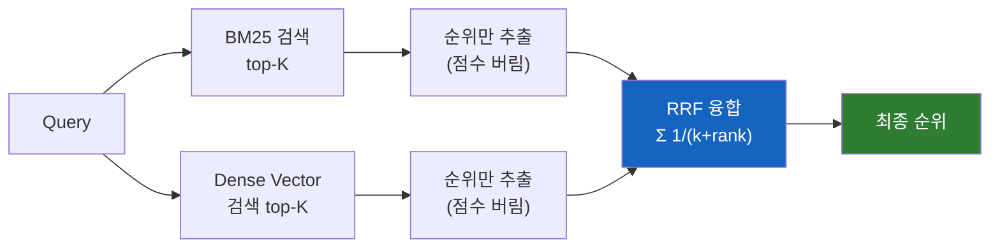

# 왜 하이브리드 검색은 점수 대신 순위로 결과를 합칠까?

BM25 점수와 cosine 유사도는 스케일이 완전히 다르다. 그런데 Elasticsearch의 RRF는 그냥 점수를 통째로 버려버린다. 왜 이 무식해 보이는 방식이 가장 널리 쓰이는 기본값이 됐을까?

## 결론부터 말하면

**서로 다른 검색 방식의 점수는 애초에 같은 잣대로 비교할 수 없기 때문이다.** BM25 점수는 $[0, \infty)$ 범위에서 문서 길이·IDF에 따라 널뛰고, cosine 유사도는 $[0, 1]$에 묶여 있다. 이 둘을 그냥 더하면 한쪽이 늘 이긴다. 정규화를 해도 분포가 달라서 가중치 튜닝이 끝없이 필요하다. **Reciprocal Rank Fusion(RRF)** 은 이 문제를 "점수를 믿지 말고 순위만 믿자"는 과감한 결정으로 우회한다.



| 항목 | Linear Combination | RRF |
|---|---|---|
| 점수 스케일 정규화 | 필요 (min-max 등) | 불필요 |
| 가중치 튜닝 | 필요 (라벨링 데이터) | 불필요 ($k$ 하나만) |
| 하이퍼파라미터 | 여러 개 | $k$ 단 하나 (기본 60) |
| 점수 크기 반영 | 가능 | 불가능 (약점) |
| Plug-and-play | 어려움 | **쉬움** |

Elasticsearch가 RRF를 기본 하이브리드 fusion 방식으로 채택한 이유가 바로 여기에 있다. 그 과정을 직접 따라가 보자.

## 1. 왜 그냥 점수를 더하면 안 되는가?

### 1.1 스케일이 다른 두 점수

지난 두 TIL에서 본 것처럼, 우리는 이제 두 가지 검색 결과를 갖고 있다.

- **BM25 결과**: 각 문서에 $[0, \infty)$ 범위의 점수. 문서 길이, IDF, TF에 따라 1.2가 나오기도 하고 35.7이 나오기도 한다.
- **Dense Vector 결과**: 각 문서에 $[0, 1]$ 범위의 점수. 0.89, 0.91처럼 대부분 좁은 범위에 몰려있다.

단순한 아이디어는 이렇게 합치는 것이다.

$$
\text{final\_score} = w_1 \cdot \text{BM25} + w_2 \cdot \text{cosine}
$$

가중 평균(weighted linear combination)이라고 부른다. 직관적이고 간단하다. 하지만 실제로 돌려보면 두 가지 고통이 기다린다.

### 1.2 고통 1: BM25가 늘 이긴다

BM25 점수가 수십까지 올라가는 반면 cosine은 1을 넘지 않는다. 그냥 더하면 BM25가 숫자로 압도해 버린다. cosine 쪽이 의미상 더 적합한 문서를 상위에 올려놓아도, BM25 점수 차이에 묻혀 아래로 밀려나는 일이 빈번하다.

그래서 **정규화(normalization)** 가 필요해진다. 대표적으로 min-max scaling을 써서 두 점수를 모두 $[0, 1]$ 범위로 맞춘다.

$$
\text{normalized} = \frac{\text{score} - \text{min}}{\text{max} - \text{min}}
$$

여기서 이미 첫 번째 신호가 온다. **쿼리마다 min, max가 달라진다.** 어떤 쿼리는 BM25 최고점이 3.2이고, 다른 쿼리는 28.5다. 정규화 결과도 쿼리마다 의미가 달라지는 셈이다.

### 1.3 고통 2: 분포가 근본적으로 다르다

정규화를 해도 본질적인 문제가 남는다. BM25 점수는 **long-tail 분포** 를 그린다. 상위 몇 개가 압도적으로 높고 나머지는 급격히 떨어진다. 반면 cosine은 **좁은 범위에 뭉쳐있는 분포** 다. 0.87~0.95 사이에 수십 개 문서가 몰린다.

이 두 분포의 "0.5"는 같은 의미가 아니다. BM25의 정규화된 0.5는 "꽤 관련 있음"이지만, cosine의 정규화된 0.5는 "그냥 평범함"일 수 있다. **선형 결합은 이 차이를 구분하지 못한다.** 그래서 가중치 $w_1, w_2$를 쿼리 유형마다 다시 튜닝해야 한다. 라벨링된 평가 데이터가 없으면 이 튜닝은 "느낌상 좋아진 것 같음"이라는 자기기만에 빠지기 쉽다.

"만약 점수를 아예 쓰지 않을 수 있다면?" 이 지점에서 RRF가 등장한다.

## 2. RRF의 핵심 아이디어

### 2.1 점수를 버리고 순위만 남기자

RRF(Reciprocal Rank Fusion)의 접근은 과격하다. **"두 검색기의 점수 스케일이 비교 불가능하다면, 점수를 아예 버리자. 대신 순위(rank)만 쓰자."** 각 검색기에서 1등, 2등, 3등... 같은 순서만 추출하면 자연스럽게 같은 척도가 된다.

공식은 단순하다. 각 검색기에서 문서 $d$의 순위를 $r_i(d)$라고 할 때:

$$
\text{RRF}(d) = \sum_{i=1}^{n} \frac{1}{k + r_i(d)}
$$

여기서 $i$는 각 검색기(BM25, dense, 필요하면 더), $k$는 평활화(smoothing) 상수다. 여러 검색기에서 **모두 상위권에 나타난 문서** 가 높은 점수를 받는 구조다. **한 검색기에서만 상위권에 있고 다른 검색기에서는 낮은 순위라면 점수가 눈에 띄게 줄어든다.**

이 구조를 다르게 표현하면 RRF는 **합의(consensus) 기반 알고리즘** 이다. 특정 검색기가 노이즈나 편향 때문에 엉뚱한 문서에 비정상적으로 높은 점수를 찍어도, 다른 검색기들이 동의하지 않으면 그 문서는 최종 순위에서 자연스럽게 밀려난다. **"여러 독립적인 랭킹 함수가 동의하는 문서만 신뢰한다"** 는 철학이 이상치(outlier)에 대한 강건함(robustness)을 만들어내고, 이것이 튜닝 없이도 안정적으로 동작하는 근본 이유다.

### 2.2 숫자로 체감하기: k=60일 때

공식만 봐서는 직관이 잘 안 온다. $k = 60$(Elasticsearch 기본값)으로 실제 계산을 해보자.

| 순위 ($r$) | 기여도 $1/(60+r)$ |
|---|---|
| 1 | 0.01639 |
| 2 | 0.01613 |
| 10 | 0.01429 |
| 50 | 0.00909 |
| 100 | 0.00625 |

눈에 띄는 특징 하나가 있다. **1등과 2등의 기여도 차이가 고작 0.00026** 이다. 약 1.6% 차이에 불과하다. 반면 1등과 100등의 차이는 약 2.6배다.

이게 의도된 설계다. $k = 60$은 **"상위권끼리는 비교적 평평하게 대우하고, 하위권으로 갈수록 기여도를 완만하게 깎는"** 보수적인 값이다. 왜 보수적으로 잡을까? 상위권 10등 안에 들어온 문서들은 어느 쪽 검색기가 정답인지 **확실히 알 수 없기 때문** 이다. 두 검색기 모두에서 공통적으로 상위에 나타난 문서를 우선하되, 그 안에서의 순서 차이에는 덜 민감하게 굴겠다는 철학이다.

### 2.3 k를 바꾸면 어떻게 되나

$k$는 RRF의 유일한 하이퍼파라미터다. 의미는 이렇게 정리할 수 있다.

| $k$ 값 | 성격 | 효과 |
|---|---|---|
| 작음 (20~40) | 공격적 | 상위권 가중치가 커짐 — 1등과 10등의 차이가 또렷해진다 |
| 기본 (60) | 균형 | 경험적으로 다양한 데이터셋에서 잘 동작하는 값 |
| 큼 (80~120) | 보수적 | 순위 차이가 더 평평해짐 — 여러 검색기의 합의를 중시 |

2009년 논문에서 처음 제안된 $k = 60$은 **"튜닝하지 않아도 대부분의 경우에 잘 동작하는 값"** 으로 경험적으로 확인된 수치다. 그래서 Elasticsearch, OpenSearch, Vespa 같은 주요 벡터 검색 엔진이 모두 이 값을 기본으로 채택했다. RRF의 진짜 매력은 공식의 우아함이 아니라 **"하이퍼파라미터가 사실상 없음"** 이라는 실용성에 있다.

## 3. Elasticsearch의 RRF Retriever

### 3.1 Retriever API로 하이브리드 검색 구성

Elasticsearch는 8.14부터 `retriever` API를 technical preview로 도입했고, **8.16부터 정식 출시(GA)** 했다. 이 API로 BM25 검색과 kNN 검색을 하나의 쿼리 안에서 묶고, 결과를 RRF로 합쳐서 반환할 수 있다. 그 이전(8.8~8.13)에는 `sub_searches` + 최상위 `rank` 파라미터 방식으로 RRF를 구성했는데, 이 방식은 현재 deprecated 상태이므로 **8.14+ 버전에서는 아래 retriever 문법을 쓰는 것이 정답** 이다.

```json
GET /articles/_search
{
  "retriever": {
    "rrf": {
      "retrievers": [
        {
          "standard": {
            "query": {
              "match": { "content": "자동차 연비" }
            }
          }
        },
        {
          "knn": {
            "field": "content_vector",
            "query_vector": [0.12, -0.34, 0.58],
            "k": 50,
            "num_candidates": 100
          }
        }
      ],
      "rank_window_size": 50,
      "rank_constant": 60
    }
  }
}
```

핵심 파라미터는 두 개다.

- **`rank_window_size`**: 각 retriever에서 가져올 상위 문서 수. 이 범위 안에서만 RRF 순위 계산이 이뤄진다. 너무 작으면 한쪽만 잡은 정답을 놓치고, 너무 크면 레이턴시가 늘어난다. 일반적으로 50~100 사이가 권장값이다.
- **`rank_constant`**: 앞에서 설명한 $k$ 값. 기본 60.

실행 순서는 다음과 같다.

1. 각 retriever(BM25, kNN)가 독립적으로 상위 `rank_window_size` 개 문서를 가져온다
2. Coordinating node가 두 결과의 **순위만** 추출한다 (원본 점수는 버려짐)
3. RRF 공식으로 새 점수를 계산해 최종 순위를 만든다

### 3.2 "점수가 안 나온다"의 정체

팀 대화에서 자주 나오는 "하이브리드 검색에는 키워드 점수가 없다"는 말이 정확히 이 지점을 가리킨다. 응답의 `_score`는 **BM25 점수도, cosine 점수도 아닌 RRF 융합 점수** 다. 원래의 BM25 점수나 벡터 유사도가 궁금하다면 **`"explain": true`** 를 붙여야 각 retriever의 원본 점수까지 응답에 포함된다.

이것은 버그가 아니라 설계다. **서로 스케일이 다른 점수를 단일 숫자로 노출하는 순간, 사용자는 그 숫자를 오독하기 쉽다.** RRF는 순위로 정렬하는 것이 목적이므로 점수 자체는 버리는 것이 오히려 정직하다.

### 3.3 Weighted RRF: 두 검색기를 다르게 대우하기

최근 Elasticsearch에 추가된 기능으로, 각 retriever에 가중치를 줄 수 있다. 공식이 확장된다.

$$
\text{Weighted RRF}(d) = \sum_{i=1}^{n} w_i \cdot \frac{1}{k + r_i(d)}
$$

예를 들어 긴 자연어 질문이 들어오는 챗봇 서비스라면 semantic retriever에 더 큰 가중치를 주고, 정확한 제품명을 찾는 커머스 검색이라면 BM25에 더 큰 가중치를 줄 수 있다. 그래도 RRF의 본질(순위 기반 융합)은 유지되므로, linear combination처럼 점수 정규화 지옥에 빠지지는 않는다.

### 3.4 실무 로드맵: 언제 RRF를 떠나야 하는가

RRF가 "튜닝 없이 바로 쓸 수 있는 기본값"인 이유는 **zero-shot 상황** (라벨링된 정답 데이터가 없는 상태)에서도 안정적으로 동작하기 때문이다. 서비스 초기에는 대부분 이 상태다. 유저가 무엇을 원하는지, 어떤 쿼리가 들어오는지, 어떤 랭킹이 정답인지 아직 모른다.

반대로 linear combination이나 LTR(Learning to Rank)은 **평가 데이터가 쌓였을 때 진가가 드러난다.** 사용자 클릭 로그, 명시적 평가(별점·"도움이 됐어요"), nDCG·MRR 같은 지표로 품질을 측정할 수 있어야 가중치 튜닝이 의미를 갖기 때문이다. 그래서 실무의 표준 로드맵은 이렇게 흘러간다.

1. **초기**: RRF로 시작 (튜닝 없이 준수한 기본 성능)
2. **성장기**: 사용자 행동 로그와 평가셋 축적
3. **성숙기**: Weighted RRF → Linear Combination → LTR로 점진적 고도화

멀티에이전트 RAG 파이프라인처럼 아직 트래픽과 평가 데이터가 부족한 단계라면, RRF는 "당분간 최적"이 아니라 **"당분간 이걸 떠날 이유가 없다"** 에 가깝다.

## 4. 정리

### 핵심 포인트

1. **점수 스케일 문제는 정규화로 완전히 풀리지 않는다**
   - BM25는 long-tail 분포, cosine은 좁은 클러스터 분포를 갖는다. 정규화를 해도 두 "0.5"는 같은 의미가 아니다. 쿼리마다 가중치를 다시 튜닝해야 하는 linear combination은 라벨링 데이터 없이는 지속 가능하지 않다.

2. **RRF는 점수를 버리고 순위만 쓴다**
   - 공식 $\sum 1/(k + r)$ 안에 점수는 등장하지 않는다. 스케일 문제를 "사용하지 않는 것"으로 우회한 것이다. $k = 60$은 경험적으로 검증된 기본값이고, 하이퍼파라미터는 이 하나뿐이어서 "plug-and-play"가 가능하다.

3. **약점도 분명히 알고 있어야 한다**
   - 1등 문서의 점수가 2등보다 10배 높아도 RRF는 그 차이를 반영하지 못한다. **점수 크기가 진짜로 의미 있는 도메인** (예: 임곗값 기반 필터링)이라면 linear combination이나 Weighted RRF를 고려해야 한다. 또한 RRF 결과의 `_score`는 원본 점수가 아닌 **순위 기반 융합값** 이라는 사실을 잊지 말아야 한다.

---

## 출처

- [Reciprocal rank fusion - Elasticsearch Reference](https://www.elastic.co/docs/reference/elasticsearch/rest-apis/reciprocal-rank-fusion) - Elastic 공식 문서
- [Weighted reciprocal rank fusion (RRF) in Elasticsearch - Elasticsearch Labs](https://www.elastic.co/search-labs/blog/weighted-reciprocal-rank-fusion-rrf)
- [Elastic linear retriever for hybrid search - Elasticsearch Labs](https://www.elastic.co/search-labs/blog/linear-retriever-hybrid-search)
- [A Comprehensive Hybrid Search Guide - Elastic](https://www.elastic.co/what-is/hybrid-search)
- [Introducing reciprocal rank fusion for hybrid search - OpenSearch](https://opensearch.org/blog/introducing-reciprocal-rank-fusion-hybrid-search/)
