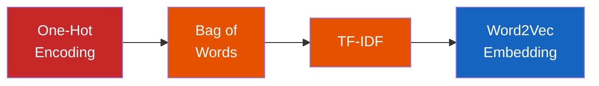
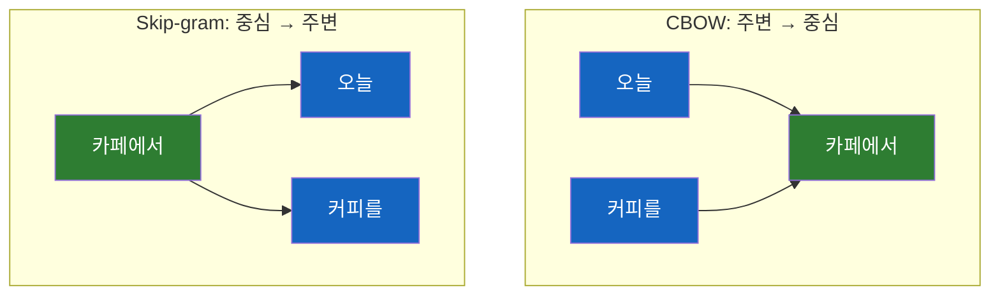

# 컴퓨터에게 단어의 의미를 가르치는 법

텍스트를 숫자로 바꾸는 방법은 어떻게 진화해왔을까? One-Hot Encoding의 한계부터 Word2Vec이 "King - Man + Woman ≈ Queen"을 가능하게 한 원리까지.

## 결론부터 말하면

**컴퓨터는 텍스트를 직접 이해할 수 없다.** 모든 단어는 숫자(벡터)로 변환되어야 계산할 수 있다. 이 변환 방법이 진화한 흐름이 곧 NLP의 핵심 역사다.



| 방법 | 벡터 크기 | 의미 반영 | 핵심 한계 |
|------|-----------|-----------|-----------|
| One-Hot | 어휘 수 (수만~수십만) | X | 모든 단어가 같은 거리 |
| Bag of Words | 어휘 수 | X | "the" 같은 불용어와 핵심 단어를 동등 취급 |
| TF-IDF | 어휘 수 | △ (중요도만) | 유의어 관계를 모름 |
| **Word2Vec** | **100~300** | **O** | **대량 코퍼스 필요** |

초기 방법들은 단어를 **독립적인 기호** 로 취급했다. Word2Vec은 단어를 **의미가 담긴 좌표** 로 변환했다. 이 전환 덕분에 "King - Man + Woman ≈ Queen"이라는 의미 연산이 가능해졌다.

## 1. 왜 텍스트를 숫자로 바꿔야 하는가?

컴퓨터의 세계에는 문자가 없다. CPU가 할 수 있는 것은 덧셈, 곱셈, 비교 같은 숫자 연산뿐이다. "고양이"라는 단어를 CPU에 넣으면? 아무 계산도 할 수 없다.

그래서 NLP(자연어 처리)의 첫 번째 과제는 항상 같았다. **텍스트를 어떻게 숫자로 표현할 것인가?** 이때 변환 대상이 되는 텍스트 데이터 모음을 **코퍼스(Corpus)** 라고 부른다. 위키백과 전체 텍스트, 뉴스 기사 10만 건, 고객 리뷰 데이터 — 이런 것들이 모두 코퍼스다. AI 모델의 성능은 이 코퍼스의 품질과 규모에 크게 좌우된다.

Java 개발자에게 비유하면, 이 문제는 객체를 직렬화(serialize)하는 것과 비슷하다. 핵심은 **변환 과정에서 의미를 얼마나 보존하느냐** 다. JSON으로 직렬화하면 구조는 살지만 행동(메서드)은 사라지듯, 텍스트를 숫자로 바꿀 때도 무언가는 항상 손실된다. 문제는 그 손실이 얼마나 심각하냐는 것이다.

## 2. 첫 번째 시도: One-Hot Encoding

가장 직관적인 방법부터 시작해보자. 코퍼스의 모든 단어에 고유 인덱스를 부여하고, 해당 위치만 1로 표시하는 것이다.

```
어휘: ["나는", "오늘", "밥을", "먹었다", "라면을"]

나는   → [1, 0, 0, 0, 0]
오늘   → [0, 1, 0, 0, 0]
밥을   → [0, 0, 1, 0, 0]
먹었다 → [0, 0, 0, 1, 0]
라면을 → [0, 0, 0, 0, 1]
```

딱 하나만 1(Hot)이고 나머지는 0이라서 "One-Hot"이다. Java의 `enum`에서 `ordinal()`을 이진 배열로 펼친 것과 같다.

단순하고 명확하다. 하지만 이 방식에는 치명적인 문제가 세 가지 있다.

**첫째, 차원의 저주다.** 한국어 어휘가 10만 개라면 각 단어가 길이 10만짜리 벡터가 된다. 99.999%가 0인 극도로 비효율적인 표현이다. 이렇게 대부분이 0인 벡터를 **희소 벡터(Sparse Vector)** 라고 부른다.

**둘째, 의미를 전혀 담지 못한다.** "강아지"와 "개"는 거의 같은 뜻이지만, 벡터 간 거리를 계산하면 "강아지↔개"와 "강아지↔자동차"의 거리가 동일하다. 모든 단어 쌍이 같은 거리에 있으니, 의미적 유사성을 비교하는 것 자체가 불가능하다.

**셋째, 순서 정보가 사라진다.** "개가 사람을 물었다"와 "사람이 개를 물었다"를 합산하면 같은 벡터가 된다. 완전히 다른 뜻인데 같은 표현이 되는 것이다.

## 3. 조금 더 나은 시도: Bag of Words와 TF-IDF

### Bag of Words — 단어 빈도 세기

One-Hot의 자연스러운 확장이다. 문서에서 각 단어가 몇 번 등장했는지 세는 방식이다. 단어를 주머니(Bag)에 던져 넣고 개수를 세는 것과 같아서 **단어 주머니(Bag of Words)** 라고 부른다.

```
문서 1: "고양이가 좋다 고양이가 귀엽다"
문서 2: "강아지가 좋다"

어휘: ["고양이가", "좋다", "귀엽다", "강아지가"]

문서 1 → [2, 1, 1, 0]   # "고양이가"가 2번 등장
문서 2 → [0, 1, 0, 1]
```

이제 단어의 빈도가 반영된다. 하지만 여기서 문제가 생긴다. "the", "is", "a" 같은 단어(한국어라면 "이", "그", "를")는 거의 모든 문서에서 자주 등장한다. 빈도가 높다고 중요한 단어는 아니다. 오히려 노이즈에 가깝다.

### TF-IDF — 중요한 단어에 가중치 주기

TF-IDF(Term Frequency - Inverse Document Frequency)는 이 문제를 우아하게 해결한다. 핵심 아이디어는 이렇다: **특정 문서에서 자주 등장하면서(TF), 전체 문서에서는 드물게 나타나는 단어(IDF)가 중요하다.**

$$\text{TF-IDF}(t, d) = \text{TF}(t, d) \times \log\frac{N}{\text{DF}(t)}$$

- $\text{TF}(t, d)$: 문서 $d$에서 단어 $t$가 등장한 횟수
- $N$: 전체 문서 수
- $\text{DF}(t)$: 단어 $t$가 등장하는 문서 수

예를 들어 "머신러닝"이라는 단어가 특정 문서에 10번 나오지만 전체 1,000개 문서 중 3개에서만 등장한다면? TF-IDF 점수가 매우 높다. 반면 "그리고"가 모든 문서에 등장한다면? IDF가 거의 0이 되어 점수가 낮아진다.

TF-IDF는 검색 엔진(Elasticsearch의 BM25)에서 여전히 현역으로 사용될 만큼 실용적이다. 하지만 근본적인 한계는 해결하지 못했다. 여전히 단어를 **독립적인 기호** 로 취급한다. "좋다"와 "훌륭하다"가 비슷한 의미라는 것을 여전히 알 수 없다.

그렇다면 단어의 **의미 자체** 를 벡터에 담을 수는 없을까?

## 4. 패러다임의 전환: Word2Vec과 임베딩

2013년, Google의 Tomas Mikolov가 Word2Vec을 발표하면서 게임의 규칙이 완전히 바뀌었다. 핵심 아이디어는 놀랍도록 단순하다.

> **"You shall know a word by the company it keeps."**
> (단어는 함께 쓰이는 단어들로 알 수 있다.)
> — J.R. Firth, 1957

"커피" 주변에는 "마시다", "카페", "에스프레소"가 자주 등장한다. "맥주" 주변에도 "마시다"가 등장하지만, "카페" 대신 "펍", "에스프레소" 대신 "생맥주"가 나타난다. 이 **주변 단어의 패턴** 이 곧 그 단어의 의미를 정의한다는 것이 Word2Vec의 핵심 발상이다.

### Sparse에서 Dense로

One-Hot이 길이 10만의 희소 벡터(대부분이 0)였다면, Word2Vec은 길이 100~300의 **밀집 벡터(Dense Vector)** 를 만든다. 모든 차원에 의미 있는 실수값이 들어간다.

```
# One-Hot (Sparse) — 대부분이 0, 의미 없음
"고양이" → [0, 0, 0, ..., 1, ..., 0, 0]  # 길이 100,000

# Word2Vec (Dense) — 모든 값이 의미 있음
"고양이" → [0.21, -0.45, 0.87, 0.12, ..., -0.33]  # 길이 300
```

여기서 각 차원이 정확히 무엇을 의미하는지는 사람이 해석하기 어렵다. 하지만 학습 결과를 보면, 어떤 차원은 "생물 vs 무생물"을, 어떤 차원은 "긍정 vs 부정"을, 어떤 차원은 "크기"를 암묵적으로 인코딩한다.

### 두 가지 학습 방식: CBOW와 Skip-gram

Word2Vec은 신경망을 사용해 단어 벡터를 학습한다. 학습 방식에는 두 가지가 있다.

| 방식 | 입력 | 출력 | 특징 |
|------|------|------|------|
| **CBOW** | 주변 단어들 | 중심 단어 예측 | 빈도 높은 단어에 강함, 학습이 빠름 |
| **Skip-gram** | 중심 단어 | 주변 단어들 예측 | 드문 단어에 강함, 학습이 느림 |

예를 들어 "나는 오늘 **카페에서** 커피를 마셨다"라는 문장에서 window size가 2라면:

- **CBOW:** ["오늘", "커피를"]을 보고 → "카페에서"를 예측
- **Skip-gram:** "카페에서"를 보고 → ["오늘", "커피를"]을 예측



이 예측 과정을 수백만 문장에 대해 반복하면, 비슷한 문맥에서 등장하는 단어들은 자연스럽게 **비슷한 벡터** 를 갖게 된다. "카페"와 "레스토랑"은 비슷한 주변 단어("가다", "앉다", "주문하다")와 함께 등장하므로, 학습이 끝나면 벡터 공간에서 가까운 위치에 놓인다.

### 마법의 순간: King - Man + Woman ≈ Queen

Word2Vec으로 학습된 벡터에서 놀라운 일이 일어난다. 단어 벡터끼리 산술 연산이 가능하고, 그 결과가 의미적으로 타당한 것이다.

$$\vec{\text{King}} - \vec{\text{Man}} + \vec{\text{Woman}} \approx \vec{\text{Queen}}$$

왜 이런 일이 가능할까? Word2Vec이 단어의 **의미적 관계** 를 벡터 공간의 **방향** 으로 인코딩하기 때문이다. "King→Queen"의 방향과 "Man→Woman"의 방향이 거의 같다. 이 공통 방향이 바로 **성별** 이라는 의미 차원을 나타낸다.

같은 원리로 다른 관계도 포착된다:

| 연산 | 결과 | 포착된 관계 |
|------|------|-------------|
| Paris - France + Japan | ≈ Tokyo | 수도 |
| bigger - big + small | ≈ smaller | 비교급 |
| King - Man + Woman | ≈ Queen | 성별 |

### 코사인 유사도: 두 단어가 얼마나 비슷한가?

벡터 공간에 단어들을 배치했으니, 이제 두 단어의 의미적 유사성을 **정량적으로 측정** 할 수 있다. 가장 널리 쓰이는 방법이 코사인 유사도(Cosine Similarity)다.

$$\text{cosine similarity}(\vec{A}, \vec{B}) = \frac{\vec{A} \cdot \vec{B}}{|\vec{A}| \times |\vec{B}|}$$

두 벡터 사이 각도의 코사인 값을 구하는 것이다. 결과는 -1에서 1 사이의 값으로, **1에 가까울수록 유사하고, 0이면 무관하고, -1이면 반대** 의미다.

왜 단순한 거리(유클리드 거리)가 아니라 각도를 쓸까? 벡터의 **크기** 보다 **방향** 이 의미를 더 잘 나타내기 때문이다. "커피"가 문서 A에서 3번, 문서 B에서 30번 나왔다고 해서 의미가 달라지지 않는다. 코사인 유사도는 크기를 무시하고 방향만 비교한다.

```
cosine("고양이", "강아지") ≈ 0.85   # 매우 유사
cosine("고양이", "커피")   ≈ 0.12   # 거의 무관
cosine("좋다",   "나쁘다") ≈ -0.38  # 반대 의미
```

이 코사인 유사도는 현대 AI 시스템 곳곳에서 핵심 연산으로 사용된다. RAG(검색 증강 생성)에서 "사용자 질문과 가장 유사한 문서 찾기", 추천 시스템에서 "이 상품과 비슷한 상품 찾기" — 모두 코사인 유사도 기반이다.

## 5. 그래서 현대 LLM은?

Word2Vec은 혁신이었지만, 한 가지 한계가 있었다. 단어마다 **하나의 고정된 벡터** 만 갖는다는 점이다. "배"라는 단어는 문맥에 따라 과일, 선박, 신체 부위를 의미하지만, Word2Vec에서는 하나의 벡터로만 표현된다.

2017년 Transformer가 등장하면서 이 문제가 해결된다. BERT, GPT 같은 모델은 **같은 단어라도 문맥에 따라 다른 벡터** 를 생성한다. 이것을 **문맥적 임베딩(Contextual Embedding)** 이라고 부른다. 현대 LLM(ChatGPT, Claude)이 사용하는 것이 바로 이 방식이다.


## 6. 정리

### 핵심 포인트

1. **텍스트를 숫자로 바꾸는 방법의 진화가 곧 NLP의 역사다**
   - One-Hot → BoW → TF-IDF → Word2Vec → Transformer Embedding
   - 각 단계는 이전 방식의 한계("의미를 모른다")를 해결하기 위해 등장했다

2. **Word2Vec의 핵심: "함께 쓰이는 단어가 비슷하면, 의미도 비슷하다"**
   - 주변 단어 패턴을 학습하여 의미를 밀집 벡터로 인코딩한다
   - 덕분에 King - Man + Woman ≈ Queen 같은 의미 연산이 가능해졌다

3. **코사인 유사도로 의미적 거리를 측정한다**
   - 벡터의 방향(각도)이 의미를 나타내므로 각도를 비교한다
   - RAG, 검색, 추천 시스템의 핵심 연산으로 현재도 널리 사용된다

---

## 출처

- Mikolov, T. et al. (2013). "Efficient Estimation of Word Representations in Vector Space" - Word2Vec 원본 논문
- [Word2Vec Tutorial - The Skip-Gram Model](http://mccormickml.com/2016/04/19/word2vec-tutorial-the-skip-gram-model/) - Chris McCormick
- [TF-IDF - Wikipedia](https://en.wikipedia.org/wiki/Tf%E2%80%93idf)
