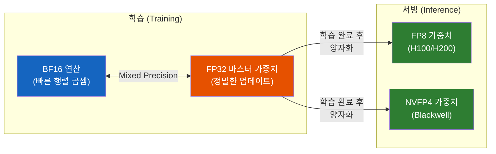
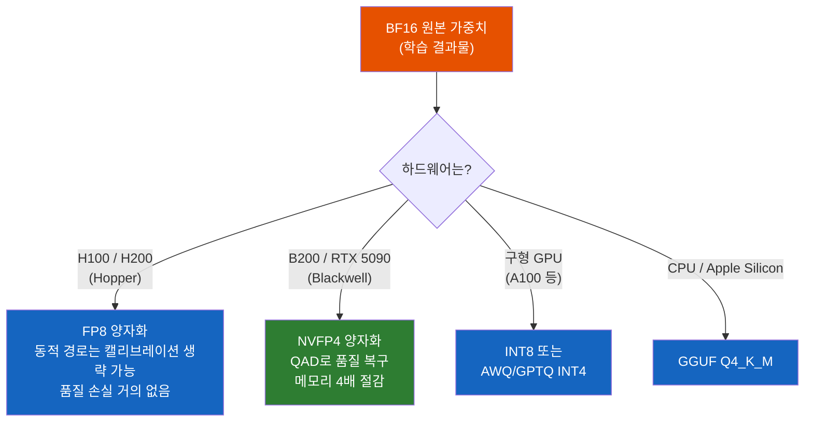

# 프로덕션 LLM 서빙에서 FP32를 아무도 안 쓰는 이유

FP32는 컴퓨터가 실수를 표현하는 기본 단위다. 그런데 ChatGPT도, Claude도, Gemini도 FP32로 서빙하지 않는다. 왜?

## 결론부터 말하면

**프로덕션 LLM 서빙에서 "생짜" FP32를 쓰는 곳은 없다.** 학습(training)조차 순수 FP32가 아닌 BF16 + FP32 혼합 정밀도(mixed precision)를 사용한다. 서빙(inference)은 더 공격적으로, 2026년 현재 **FP8이 클라우드 서빙의 표준** 이며, NVIDIA Blackwell GPU에서는 **NVFP4(4비트)** 가 새로운 표준으로 떠오르고 있다.

| 단계 | 정밀도 | 비유 |
|------|--------|------|
| 학습 | BF16 + FP32 혼합 | 원본 마스터 음원 녹음 |
| 서빙 (클라우드) | FP8 또는 NVFP4 | 스트리밍 서비스 (MP3/AAC) |
| 서빙 (로컬) | Q4_K_M (GGUF) | 스마트폰 저장 (더 강한 압축) |

원본 WAV(FP32)로 스트리밍하는 음악 서비스가 없듯이, FP32로 서빙하는 AI 서비스도 없다.

## 1. 왜 FP32를 그대로 쓰면 안 되는가?

### 1.1 숫자 하나의 크기가 문제다

FP32는 파라미터 하나를 저장하는 데 **4 bytes** 를 쓴다. 이것이 수십억 개 모여있는 LLM에서는 치명적이다.

| 모델 | 파라미터 수 | FP32 크기 | FP8 크기 | 절감률 |
|------|-----------|----------|---------|--------|
| Llama 3.1 8B | 80억 | 32GB | 8GB | **75%** |
| Qwen 3.5 32B | 320억 | 128GB | 32GB | **75%** |
| Llama 3.1 70B | 700억 | **280GB** | 70GB | **75%** |

70B 모델을 FP32로 서빙하려면 280GB의 GPU 메모리가 필요하다. H100 80GB GPU가 **4장** 이상 있어야 한다. 같은 모델을 FP8로 양자화하면 70GB, GPU **1장** 으로 충분하다. 서버 비용이 4배 차이 나는데, 품질 차이는 거의 없다면? 당연히 양자화한다.

### 1.2 메모리뿐만 아니라 속도도 달라진다

앞선 TIL에서 다뤘듯이, LLM 추론 속도는 **메모리 대역폭** 이 결정한다. 매 토큰을 생성할 때마다 모델 전체 가중치를 메모리에서 읽어야 하기 때문이다. 모델 크기가 절반이 되면 읽을 데이터도 절반이 되므로, **토큰 생성 속도가 약 2배** 빨라진다.

H100 GPU에서 Qwen3-32B 모델의 실제 벤치마크를 보면:

| 정밀도 | 처리량 (BF16 대비) | MMLU-Pro 정확도 | HumanEval (코드) |
|--------|-------------------|----------------|-----------------|
| BF16 (기준) | 1.0x | 69.2% | 90.9% |
| FP8 | ~1.8x | 68.8% | 89.6% |
| GPTQ-Int4 | **2.7x** | 67.4% | 82.9% |

FP8은 속도가 1.8배 빨라지면서 **정확도 손실이 0.4%p에 불과** 하다. Int4는 속도가 2.7배지만 코드 생성에서 8%p 하락이 보인다. 이것이 프로덕션에서 FP8이 표준인 이유다 — 속도와 품질의 최적 균형점이기 때문이다.

## 2. 학습과 서빙은 다른 전략을 쓴다

여기서 많이 혼동하는 부분이 있다. **학습할 때와 서빙할 때의 정밀도 전략이 완전히 다르다.**

### 2.1 학습: BF16 + FP32 혼합 정밀도

학습에서도 순수 FP32를 쓰지 않는다. 2018년 NVIDIA가 Mixed Precision Training을 도입한 이후, **BF16으로 연산하고 FP32로 가중치를 업데이트** 하는 혼합 방식이 표준이다.

왜 하필 BF16일까? FP16과 비교하면 이유가 명확해진다.

| 포맷 | 비트 | 지수(exponent) | 가수(mantissa) | 특징 |
|------|------|---------------|---------------|------|
| FP32 | 32 | 8비트 | 23비트 | 정밀도 최고, 느림 |
| FP16 | 16 | 5비트 | 10비트 | 빠르지만 **범위가 좁아** overflow 위험 |
| **BF16** | 16 | **8비트** | 7비트 | FP32와 **같은 범위**, 정밀도만 낮음 |

BF16은 FP32와 **지수부가 같다.** 즉, 표현할 수 있는 숫자의 범위(dynamic range)가 FP32와 동일하다. 학습 중 gradient 값이 극단적으로 크거나 작아져도 **FP16에 비해 overflow/underflow 위험이 크게 줄어든다** (BF16도 유한 정밀도이므로 위험 자체가 사라지는 것은 아니다). FP16은 지수부가 5비트뿐이라 이런 문제가 빈번했고, 복잡한 loss scaling이 필요했다.

그래서 BF16은 **"FP32의 drop-in replacement"** 라고 불린다. 연산은 2배 빠르고, 메모리는 절반이면서, 학습 안정성은 FP32와 거의 같다.

### 2.2 서빙: 더 공격적으로 줄인다

학습이 끝나면 가중치는 **고정(frozen)** 된다. 더 이상 gradient를 계산하거나 가중치를 업데이트하지 않는다. 이 고정된 숫자들을 "얼마나 압축해도 출력이 비슷한가?"만 따지면 되기 때문에, 서빙에서는 학습보다 훨씬 공격적으로 양자화한다.

## 3. 2026년 프로덕션 양자화 스택

놀라운 점은 프로덕션에서 한 가지 양자화만 쓰지 않는다는 것이다. **메모리 영역별로 다른 양자화** 를 조합한다.

LLM 추론 중 GPU 메모리를 차지하는 것은 세 가지다:

| 메모리 영역 | 설명 | 양자화 기법 |
|------------|------|-----------|
| **모델 가중치** (고정) | 학습된 파라미터 | AWQ INT4, NVFP4 |
| **활성화 값** (동적) | 추론 중 계산되는 중간 값 | FP8 |
| **KV 캐시** (누적) | 대화 기록 저장 | INT4, TurboQuant 3-bit |

이 세 영역은 서로 독립적이어서 **동시에 적용 가능** 하다. 70B 모델에 세 가지를 모두 적용하면:

- FP16 원본: 가중치 140GB + KV 캐시 수백 GB → **8-GPU 클러스터**
- 전체 양자화: 가중치 ~35GB + 활성화 절반 + KV 캐시 1/6 → **2-GPU로 가능**

### 3.1 FP8 — 2026년 클라우드 서빙의 표준

FP8은 NVIDIA Hopper 아키텍처(H100, H200)에서 **네이티브 하드웨어 지원** 이 있다. Tensor Core가 FP8 연산을 직접 처리하므로, 소프트웨어 양자화와는 차원이 다른 성능을 낸다.

FP8의 운영 친화적인 점은 **동적 양자화(dynamic quantization) 경로에서는 별도의 calibration 데이터셋 없이 바로 적용할 수 있다** 는 것이다. 다만 이는 FP8 전반의 특성이 아니라 경로별 차이임에 유의해야 한다 — TensorRT-LLM·NeMo의 FP8 PTQ 워크플로처럼 static scaling factor를 미리 산출해 두는 배포 방식에서는 calibration 단계가 필요하다. 정리하면, MXFP8 같은 동적 경로는 calibration 생략이 가능해 운영 부담이 작고, static PTQ 경로는 한 번의 calibration을 거치는 대신 런타임 오버헤드가 더 적다.

### 3.2 NVFP4 — 차세대 표준

NVIDIA Blackwell GPU에서 등장한 NVFP4는 기존 INT4와 근본적으로 다르다. INT4는 고정소수점(정수)이지만, NVFP4는 **부동소수점** 이다.

| 구성 | 설명 |
|------|------|
| **E2M1** | 1 sign + 2 exponent + 1 mantissa = 4비트 |
| **Block Scale** | 16개 값마다 FP8(E4M3) 스케일 팩터 공유 |
| **Tensor Scale** | 텐서 전체에 FP32 스케일 적용 |

> **유효 비트수**: 16개 값당 `4×16 + 8 = 72비트`이므로, 파라미터당 **4.5 effective bits**. 즉 BF16(16비트) 대비 약 **3.55배 메모리 절감** 이다. INT4(4비트)와 비교하면 0.5비트를 더 쓰는 대신, 그 0.5비트(micro-block FP8 스케일)로 부동소수점 dynamic range를 확보한다 — 이것이 NVFP4가 INT4 대비 이상치(outlier)를 잘 처리하는 이유다.

이 "2단계 스케일링"으로 dynamic range를 넓게 유지하면서 4비트 압축을 달성한다. LLM의 가중치 분포에는 이상치(outlier)가 존재하는데, 정수 포맷인 INT4는 이런 이상치를 잘 처리하지 못한다. 부동소수점인 NVFP4는 이상치를 더 잘 표현하므로, **같은 4비트에서 INT4보다 품질 손실이 적다.**

실제 벤치마크가 이를 증명한다. NVIDIA의 공식 기술 보고서에서 대형 모델의 NVFP4 PTQ(Post-Training Quantization) 결과:

| 모델 | 정밀도 | MATH500 | AIME24 | GPQA-D |
|------|--------|---------|--------|--------|
| Llama Nemotron Ultra (253B) | BF16 | 96.6 | 75.0 | 75.7 |
| Llama Nemotron Ultra (253B) | **NVFP4** | 96.2 | 76.0 | 74.8 |
| DeepSeek R1 (671B) | FP8 | 95.4 | 80.0 | 69.7 |
| DeepSeek R1 (671B) | **NVFP4** | 94.2 | 80.0 | 69.2 |

253B 모델에서 NVFP4의 품질 손실은 **1% 미만** 이다. 메모리는 4배 줄어드는데 말이다.

## 4. 정리

### 핵심 포인트

1. **FP32는 기본 단위이지만, 프로덕션에서는 아무도 쓰지 않는다**
   - 학습은 BF16 + FP32 혼합 정밀도, 서빙은 FP8 이하로 양자화한다
   - 사람이 구분 못 할 정도의 품질 차이로 비용과 속도를 2~4배 개선할 수 있기 때문이다

2. **학습과 서빙의 양자화 전략은 근본적으로 다르다**
   - 학습: BF16 연산 + FP32 마스터 가중치 (정밀한 gradient 업데이트 필요)
   - 서빙: 가중치가 고정되므로 FP8, NVFP4까지 공격적 양자화 가능

3. **2026년 프로덕션 표준: FP8 (현재) → NVFP4 (차세대)**
   - H100/H200에서 FP8이 표준, Blackwell에서 NVFP4 전환 중
   - 가중치·활성화·KV 캐시에 **각각 다른 양자화** 를 조합하는 것이 실전

---

## 출처

- [NVIDIA - Floating-Point 8: An Introduction to Efficient Lower-Precision AI Training](https://developer.nvidia.com/blog/floating-point-8-an-introduction-to-efficient-lower-precision-ai-training/) - FP8 Mixed Precision 공식 문서
- [NVIDIA Research - Quantization-Aware Distillation for NVFP4 Inference Accuracy Recovery](https://research.nvidia.com/labs/nemotron/files/NVFP4-QAD-Report.pdf) - NVFP4 벤치마크 기술 보고서
- [AIMultiple - LLM Quantization: BF16 vs FP8 vs INT4](https://aimultiple.com/llm-quantization) - Qwen3-32B 정밀도별 벤치마크
- [NeuralRack - NVIDIA NVFP4: Ultra-Efficient 4-Bit LLM Inference](https://neuralrack.ai/blog/nvidia-nvfp4-ultra-efficient-4-bit-llm-inference-exclusive-blackwell-gpus-feb-1-2026) - NVFP4 아키텍처 해설
- [O-mega - Google TurboQuant: 2026 LLM Compression Guide](https://o-mega.ai/articles/google-turboquant-the-2026-llm-compression-guide) - 프로덕션 양자화 스택 분석
- [Together AI - Best Practices to Accelerate Inference for Large-Scale Production Workloads](https://www.together.ai/guides/best-practices-to-accelerate-inference-for-large-scale-production-workloads) - NVFP4 프로덕션 적용 가이드
- [RunPod - AI Model Serving Architecture](https://www.runpod.io/articles/guides/ai-model-serving-architecture-building-scalable-inference-apis-for-production-applications) - 하드웨어별 양자화 포맷 추천
