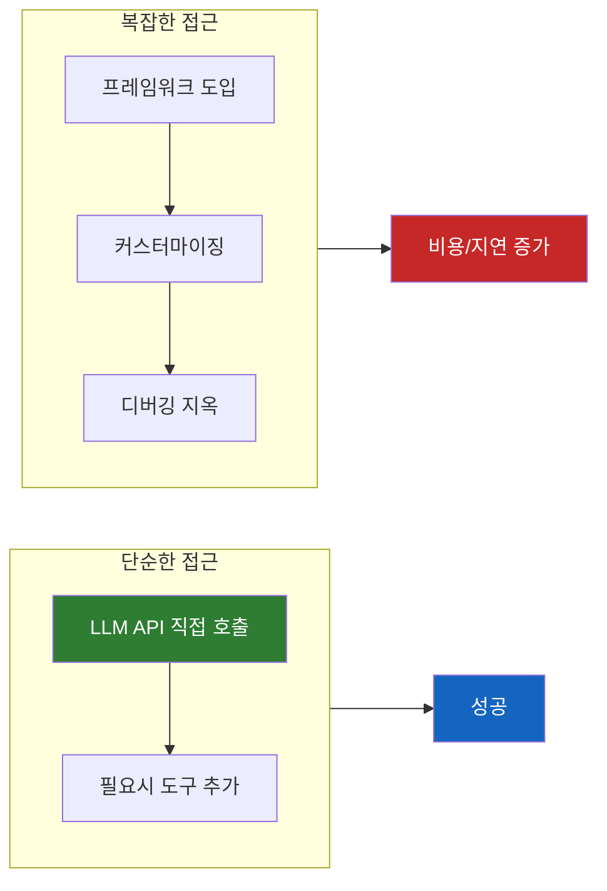
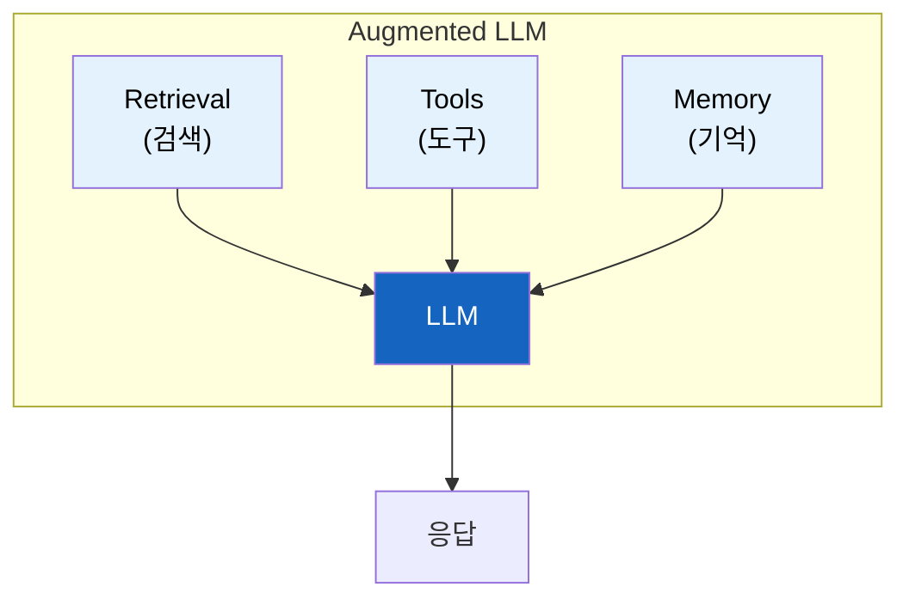
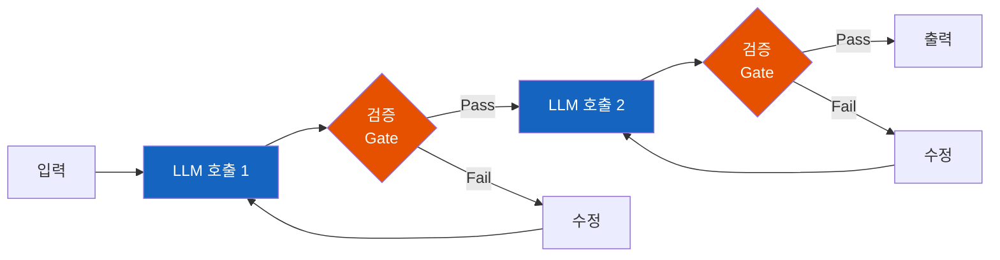
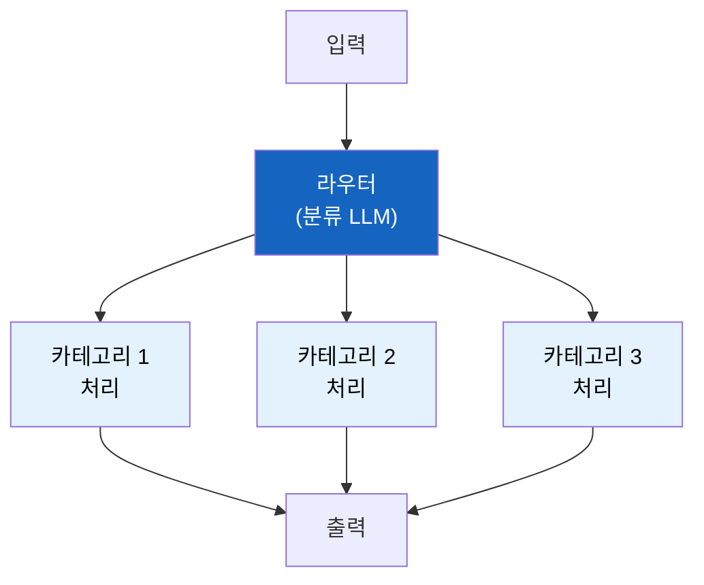
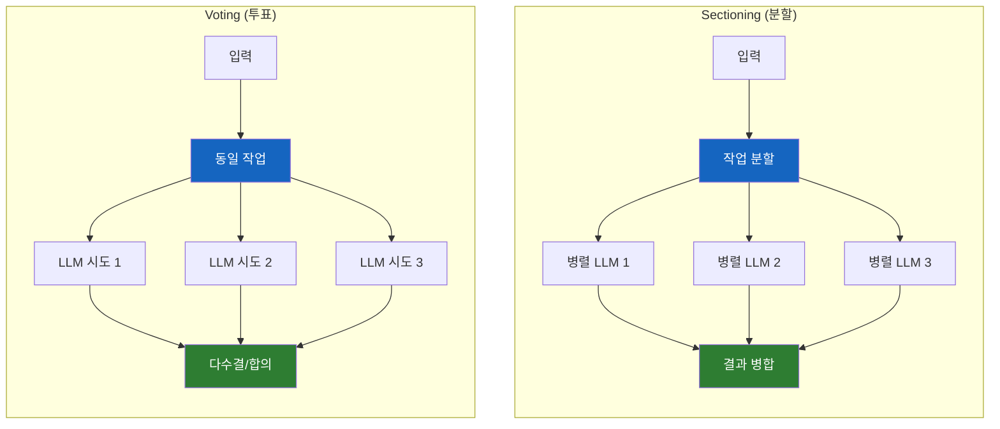
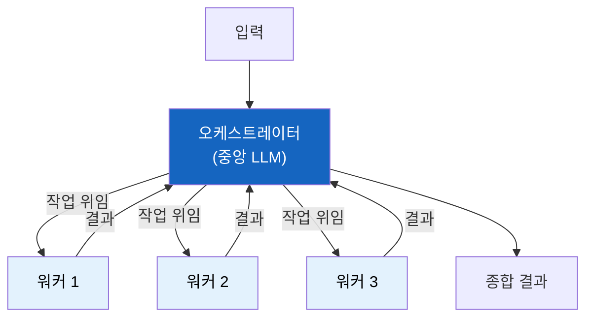
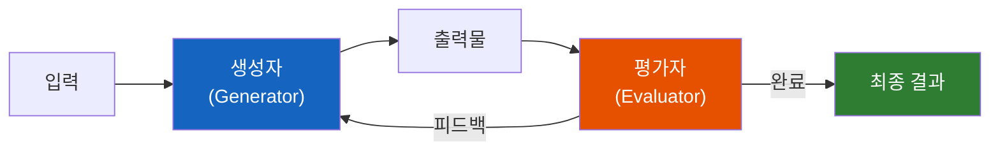
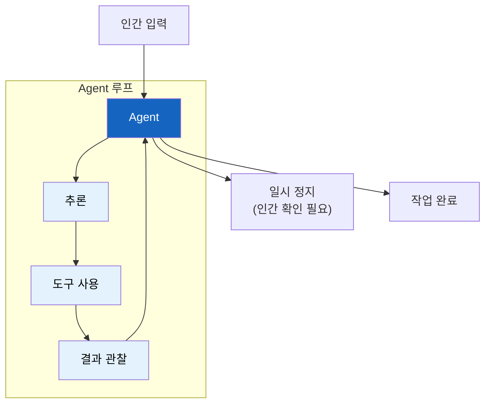
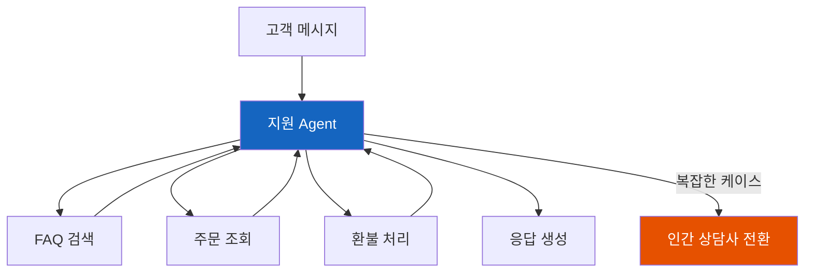
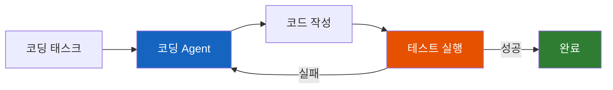

# 효과적인 AI Agent 구축하기 - Anthropic 가이드

Anthropic이 수많은 Agent 구현 사례에서 발견한 통찰: **가장 성공적인 구현은 복잡한 프레임워크가 아니라, 단순하고 조합 가능한 패턴으로 만들어졌다.**

## 결론부터 말하면

**Agent 구축의 핵심 원칙: 가능한 한 단순하게 시작하고, 필요할 때만 복잡성을 추가하라.**



| 용어 | 정의 |
|------|------|
| **Workflow** | LLM과 도구가 **미리 정의된 코드 경로** 로 조율되는 시스템 |
| **Agent** | LLM이 **동적으로 자신의 프로세스와 도구 사용을 결정** 하는 시스템 |

**언제 Agent를 사용할까?**
- Agent는 성능 향상을 위해 **지연 시간과 비용을 교환** 한다
- 항상 가장 단순한 솔루션부터 시작하라
- 복잡성은 실제로 성과를 개선할 때만 추가하라

## 1. 왜 이 가이드가 필요한가?

### 1.1 프레임워크의 함정

많은 개발자들이 Agent를 구축할 때 LangChain, LlamaIndex 같은 프레임워크부터 도입한다. 그런데 Anthropic이 고객사들의 구현 사례를 분석해보니 흥미로운 사실이 발견되었다.

**가장 성공적인 구현들은 프레임워크 없이 만들어졌다.**

왜일까? 프레임워크는 빠른 시작을 도와주지만, 동시에 다음과 같은 문제를 야기한다:

| 문제 | 설명 |
|------|------|
| **추상화 레이어** | 실제로 무슨 일이 일어나는지 파악하기 어려움 |
| **디버깅 어려움** | 문제 발생 시 프레임워크 내부를 파헤쳐야 함 |
| **유연성 부족** | 프레임워크가 지원하지 않는 패턴 구현이 어려움 |
| **오버헤드** | 불필요한 기능까지 포함되어 비용/지연 증가 |

### 1.2 그렇다면 어떻게?

Anthropic의 권장사항:

> **"LLM API를 직접 사용하는 것부터 시작하세요. 많은 패턴은 몇 줄의 코드로 구현할 수 있습니다."**

프레임워크가 필요 없다는 말이 아니다. 프레임워크는 프로토타이핑에 유용하다. 하지만 프로덕션에서는 **내부 동작을 이해하고 제어할 수 있어야 한다.** 프레임워크를 사용하더라도 "마법 같은" 추상화에 의존하지 말고, 실제로 무슨 일이 일어나는지 파악하라.

## 2. 빌딩 블록: Augmented LLM

모든 Agentic 시스템의 기초는 **향상된(Augmented) LLM** 이다. 기본 LLM에 다음을 결합한다:



| 구성 요소 | 역할 | 예시 |
|----------|------|------|
| **Retrieval** | 외부 지식 검색 | RAG, 벡터 DB |
| **Tools** | 외부 시스템과 상호작용 | API 호출, DB 쿼리 |
| **Memory** | 대화/작업 상태 유지 | 이전 대화, 장기 기억 |

핵심은 이러한 기능들이 **모델에 의해 동적으로 호출될 수 있어야 한다** 는 것이다. Model Context Protocol(MCP)을 사용하면 다양한 데이터 소스와 도구를 쉽게 통합할 수 있다.

## 3. Workflow 패턴들

### 3.1 Prompt Chaining (프롬프트 체이닝)

**개념:** 작업을 일련의 단계로 분해하고, 각 LLM 호출이 이전 호출의 결과를 처리한다.



**핵심 특징:**
- 각 단계 사이에 **프로그래밍 방식의 검증(Gate)** 추가 가능
- 복잡한 작업을 더 작고 집중된 단계로 분해
- **지연 시간을 교환하여 각 단계의 정확도 향상**

**언제 사용하나?**
- 작업이 **고정된 하위 작업으로 깔끔하게 분해** 될 때
- 각 단계마다 품질 검증이 필요할 때

**실제 사례:**
- 마케팅 카피 생성 → 다른 언어로 번역
- 문서 개요 작성 → 개요 검증 → 본문 작성
- 코드 생성 → 린팅 → 테스트 작성

### 3.2 Routing (라우팅)

**개념:** 입력을 분류하여 특화된 후속 작업으로 보낸다.



**핵심 특징:**
- **관심사의 분리(Separation of Concerns)**
- 각 카테고리별로 최적화된 프롬프트 사용 가능
- **비용 최적화:** 간단한 쿼리는 작은 모델, 복잡한 쿼리는 큰 모델

**언제 사용하나?**
- 서로 다른 카테고리가 **별도로 처리되는 것이 더 나은 복잡한 작업**
- 입력 유형에 따라 처리 방식이 크게 달라질 때

**실제 사례:**
- 고객 서비스 쿼리 분류 (일반 질문 / 환불 요청 / 기술 지원)
- 질문 복잡도에 따른 모델 선택 (Haiku / Sonnet / Opus)
- 이메일 자동 분류 및 처리

### 3.3 Parallelization (병렬화)

**개념:** LLM이 동시에 작업을 수행하고 결과를 프로그래밍 방식으로 집계한다.



**두 가지 변형:**

| 변형 | 설명 | 장점 |
|------|------|------|
| **Sectioning** | 작업을 독립적인 하위 작업으로 분할하여 병렬 실행 | 처리 속도 향상 |
| **Voting** | 동일 작업을 여러 번 실행하여 다양한 결과 수집 | 신뢰도 향상, 다양한 관점 |

**언제 사용하나?**
- 복잡한 작업에서 **여러 관점이 필요** 하거나 **여러 시도가 필요** 할 때
- 하위 작업들이 **독립적으로 실행 가능** 할 때
- 높은 신뢰도가 필요한 판단 (보안 검토, 콘텐츠 검열 등)

**실제 사례:**
- **Sectioning:** 여러 파일의 보안 취약점 동시 검사, LLM 성능 평가
- **Voting:** 코드 취약점 검토 (여러 관점), 콘텐츠 부적절성 판정

### 3.4 Orchestrator-Workers (오케스트레이터-워커)

**개념:** 중앙 LLM이 작업을 동적으로 분해하고 워커 LLM에 위임한 후 결과를 종합한다.



**병렬화와의 차이점:**

| 병렬화 | 오케스트레이터-워커 |
|--------|---------------------|
| 미리 정의된 작업을 병렬 처리 | 입력에 따라 **동적으로** 작업 결정 |
| 정적 분할 | 유연한 분해 |

**언제 사용하나?**
- **필요한 하위 작업을 미리 예측할 수 없는 복잡한 작업**
- 작업의 범위가 입력에 따라 크게 달라질 때

**실제 사례:**
- 여러 파일에 걸친 복잡한 코드 수정
- 여러 소스에서 정보를 수집하고 분석하는 연구 작업

### 3.5 Evaluator-Optimizer (평가자-최적화자)

**개념:** 한 LLM이 응답을 생성하고, 다른 LLM이 평가 및 피드백을 반복적으로 제공한다.



**적합 신호:**

1. **인간의 피드백으로 LLM 응답이 확실히 개선됨** (LLM도 비슷한 피드백 가능)
2. **LLM이 유용한 피드백을 제공할 수 있음** (명확한 평가 기준 존재)

**언제 사용하나?**
- **명확한 평가 기준이 있고 반복적 개선이 측정 가능한 가치를 제공** 할 때
- 품질이 최우선인 작업

**실제 사례:**
- 문학 번역 (뉘앙스를 반복적으로 개선)
- 복합 검색 작업 (다중 라운드 검색 및 분석)
- 코드 리뷰 및 개선 루프

## 4. 진정한 Agent

### 4.1 Agent란?

Workflow와 달리, **Agent는 자율적으로 작동** 한다. 인간의 개입 없이 도구를 사용하고, 환경의 피드백에 따라 다음 행동을 결정한다.



**Workflow vs Agent:**

| Workflow | Agent |
|----------|-------|
| 미리 정의된 경로 | 동적 의사결정 |
| 예측 가능한 흐름 | 자율적 탐색 |
| 적은 LLM 호출 | 많은 LLM 호출 (비용 높음) |
| 빠른 응답 | 느린 응답 (latency 높음) |

### 4.2 언제 Agent를 사용할까?

Agent는 강력하지만 **비용과 지연 시간이 크게 증가** 한다. 따라서 다음 조건이 충족될 때만 사용하라:

| 조건 | 설명 |
|------|------|
| **열린 문제** | 필요한 단계 수를 미리 예측하기 어려움 |
| **복잡한 환경** | 도구 결과에 따라 경로가 크게 달라짐 |
| **자율성 필요** | 인간 개입 없이 여러 단계를 수행해야 함 |

**Agent 사용 시 필수 요소:**

1. **명확한 성공 기준** (언제 끝나는지 알아야 함)
2. **적절한 인간 감독 지점** (guardrails)
3. **충분한 테스트** (sandbox 환경에서 먼저)

### 4.3 실제 Agent 구현

**실제 사례:** SWE-bench 코딩 태스크, Computer-use 구현

Agent 구현의 핵심은 **도구 설계** 에 있다. 도구가 잘 정의되어 있으면 Agent의 성능이 크게 향상된다.

## 5. 세 가지 핵심 원칙

### 5.1 단순성 (Simplicity)

> "복잡성은 실제로 성과를 개선할 때만 추가하세요."

```python
# Bad: 불필요한 추상화
class AgentFramework:
    def __init__(self, llm, tools, memory, planner, executor, ...):
        # 많은 설정...
        pass

# Good: 필요한 것만
def simple_agent(task: str, tools: list) -> str:
    while not done:
        action = llm.decide_action(task, context)
        result = tools[action.tool].execute(action.params)
        context.append(result)
    return context.final_answer
```

### 5.2 투명성 (Transparency)

Agent의 **계획 단계를 명시적으로 보여줘라.** 사용자가 무슨 일이 일어나는지 이해할 수 있어야 한다.

```python
# 계획 단계를 명시적으로 출력
def agent_with_transparency(task):
    plan = llm.create_plan(task)
    print(f"계획: {plan}")  # 사용자에게 계획 공유

    for step in plan:
        print(f"실행 중: {step}")
        result = execute_step(step)
        print(f"결과: {result}")
```

### 5.3 도구 설계 (Tool Design)

**Agent-Computer Interface (ACI)** 를 신중하게 설계하라.

ACI는 일반적인 UI/UX와 다르다. **인간의 시각적 편의성이 아닌, 모델의 토큰 효율성과 추론 논리에 최적화** 되어야 한다. 예를 들어, 복잡한 HTML 응답보다 구조화된 텍스트나 간결한 JSON이 모델의 다음 행동 결정에 더 유리하다.

| 원칙 | 설명 |
|------|------|
| **명확한 이름과 설명** | 도구가 무엇을 하는지 LLM이 이해할 수 있어야 함 |
| **자연스러운 입력 형식** | 인터넷 텍스트에서 자연스럽게 발생하는 형식 사용 |
| **포맷팅 오버헤드 최소화** | JSON 스키마 등 복잡한 형식 피하기 |
| **예시와 엣지 케이스 문서화** | 도구 사용법을 상세히 설명 |

```python
# Bad: 복잡한 입력 형식
def search(query_object: dict) -> list:
    """
    Args:
        query_object: {"query": str, "filters": {"date": str, "type": str}}
    """
    pass

# Good: 자연스러운 입력
def search(query: str, date_filter: str = None) -> list:
    """
    웹에서 정보를 검색합니다.

    Args:
        query: 검색할 텍스트 (예: "Python async await 사용법")
        date_filter: 날짜 필터 (예: "2024년 이후")

    Returns:
        검색 결과 목록
    """
    pass
```

## 6. 실전 응용: 고객 지원과 코딩 Agent

### 6.1 고객 지원 Agent

고객 지원은 Agent의 이상적인 사용 사례다:

- **자연스러운 대화 흐름**
- **도구 통합** (주문 조회, 환불 처리 등)
- **명확한 성공 기준** (고객 문제 해결)



### 6.2 코딩 Agent

코딩 Agent가 효과적인 이유:

- **검증 가능한 결과:** 테스트로 코드 품질 확인 가능
- **반복적 개선:** 테스트 실패 시 피드백으로 수정
- **샌드박스 환경:** 안전하게 실행 가능



## 7. 워크플로우 패턴 비교

| 패턴 | 복잡도 | 비용 | 속도 | 적합한 상황 |
|------|--------|------|------|-----------|
| **Prompt Chaining** | 낮음 | 중간 | 느림 | 고정 단계 분해 |
| **Routing** | 낮음 | 낮음 | 빠름 | 분류 기반 처리 |
| **Parallelization** | 중간 | 중간-높음 | 빠름 | 독립적 작업/투표 |
| **Orchestrator-Workers** | 높음 | 높음 | 중간 | 동적 분해 필요 |
| **Evaluator-Optimizer** | 중간 | 높음 | 느림 | 반복적 개선 |
| **Agent** | 높음 | 매우 높음 | 느림 | 자율적 탐색 필요 |

## 8. 핵심 요약

### 성공을 위한 체크리스트

```
시작 단계:
✅ LLM API 직접 호출로 시작
✅ 가장 단순한 솔루션부터 시도
✅ 프레임워크는 프로토타이핑에만

설계 단계:
✅ 적절한 패턴 선택 (Workflow vs Agent)
✅ 도구 이름과 설명을 명확하게
✅ 계획 단계를 투명하게 공개

운영 단계:
✅ 인간 감독 지점(guardrails) 설정
✅ 비용/지연 모니터링
✅ 에러 처리 및 에스컬레이션
```

### 마지막 조언

> **"LLM 공간에서의 성공은 가장 정교한 시스템을 만드는 것이 아닙니다. 필요에 맞는 올바른 시스템을 만드는 것입니다."**

- 단순함을 유지하라
- 투명성을 확보하라
- 도구 설계에 투자하라
- 복잡성은 필요할 때만 추가하라

---

## 출처

- [Building effective agents](https://www.anthropic.com/engineering/building-effective-agents) - Anthropic Engineering Blog, 2024.12.19
