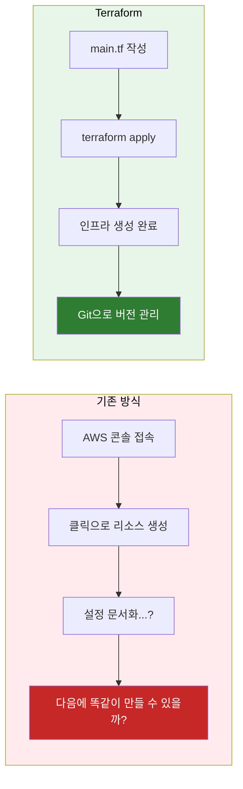
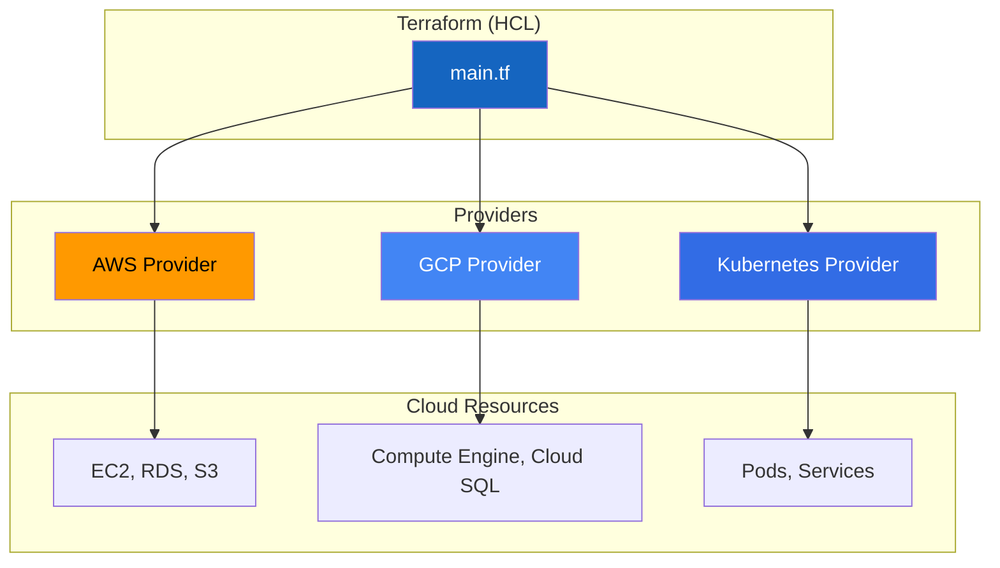
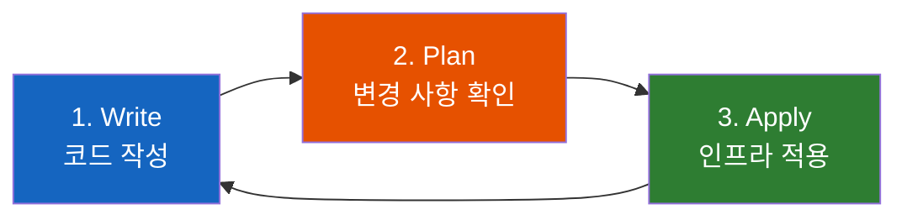
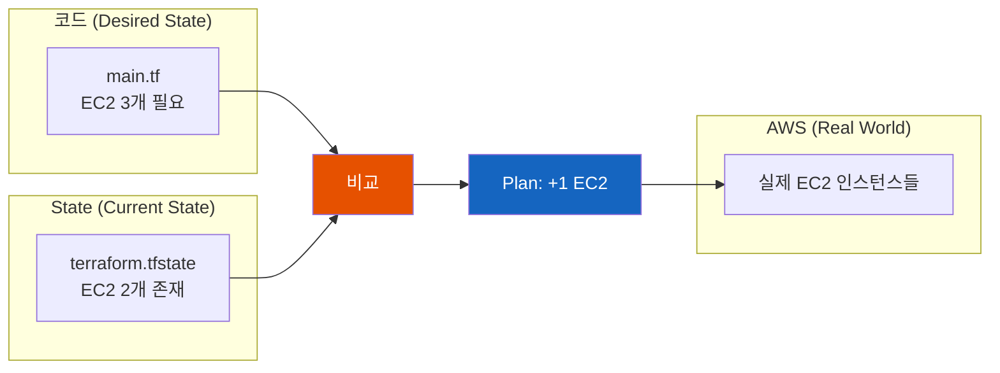

# Terraform으로 AWS 인프라를 코드로 관리하기

만약 AWS 콘솔에서 클릭으로 서버를 만들었는데, 똑같은 환경을 다시 만들어야 한다면?

## 결론부터 말하면

**Terraform은 인프라를 코드로 정의하고 관리하는 도구다.** AWS 콘솔에서 클릭하는 대신, 코드로 "EC2 인스턴스 3개, RDS 1개, S3 버킷 1개"를 선언하면 Terraform이 알아서 만들어준다.



| 방식 | 재현성 | 협업 | 롤백 |
|------|--------|------|------|
| AWS 콘솔 클릭 | 어려움 | 문서화 필요 | 수동 |
| **Terraform** | **완벽** | **Git으로 관리** | **코드 복원** |

---

## 1. 왜 Infrastructure as Code가 필요한가?

### 1.1 콘솔 클릭의 한계

AWS를 처음 배울 때는 콘솔에서 클릭하며 리소스를 만든다. EC2 인스턴스 하나 띄우는 건 어렵지 않다. 하지만 현실에서는 다른 문제가 생긴다.

**"개발 환경이랑 똑같이 스테이징 환경 만들어주세요."**

콘솔에서 만든 환경을 똑같이 복제하려면? 모든 설정을 하나하나 기억해야 한다. VPC 설정, 서브넷 CIDR, 보안 그룹 규칙, IAM 역할... 하나라도 빠뜨리면 "개발에서는 됐는데 스테이징에서 안 돼요"가 시작된다.

**"누가 이 보안 그룹 규칙 바꿨어요?"**

팀원 A가 급하게 보안 그룹에 포트를 열었다. 문서화는 안 했다. 한 달 뒤 장애가 났을 때, 왜 그 포트가 열려 있는지 아무도 모른다. 콘솔에서 변경한 내역은 CloudTrail을 뒤져봐야 알 수 있다.

### 1.2 코드로 인프라를 관리하면

Infrastructure as Code(IaC)는 이런 문제를 해결한다. 인프라를 코드로 정의하면:

1. **재현성**: 같은 코드를 실행하면 같은 인프라가 만들어진다
2. **버전 관리**: Git으로 누가, 언제, 왜 변경했는지 추적할 수 있다
3. **코드 리뷰**: 인프라 변경도 PR을 통해 리뷰할 수 있다
4. **롤백**: 문제가 생기면 이전 커밋으로 돌아가면 된다

Java 개발자라면 Maven이나 Gradle로 의존성을 관리하는 것과 비슷하다고 생각하면 된다. `pom.xml` 없이 수동으로 jar 파일을 관리하던 시절을 상상해보라.

---

## 2. Terraform이 다른 IaC 도구와 다른 점

IaC 도구는 여러 가지가 있다. AWS CloudFormation, Ansible, Pulumi 등. Terraform이 특별한 이유는 뭘까?

### 2.1 선언적(Declarative) 접근

Terraform은 **"최종 상태"** 를 선언한다. "EC2 인스턴스 3개가 있어야 해"라고 말하면, 현재 2개가 있으면 1개를 추가하고, 4개가 있으면 1개를 삭제한다.

```hcl
# 이것이 선언적 방식이다
# "3개가 있어야 해"라고 선언하면 Terraform이 알아서 맞춘다
resource "aws_instance" "web" {
  count         = 3
  ami           = "ami-0c55b159cbfafe1f0"
  instance_type = "t2.micro"
}
```

Ansible 같은 명령적(Imperative) 도구는 "이 작업을 수행해"라고 지시한다. 현재 상태를 고려하지 않고 항상 같은 작업을 수행하기 때문에, 멱등성을 직접 관리해야 한다.

### 2.2 멀티 클라우드 지원

CloudFormation은 AWS 전용이다. Terraform은 AWS, GCP, Azure, 심지어 Kubernetes까지 하나의 언어(HCL)로 관리할 수 있다. 물론 각 클라우드의 리소스는 다르지만, 문법과 워크플로우는 동일하다.



### 2.3 State 관리

Terraform의 가장 중요한 특징은 **State(상태)** 관리다. Terraform은 현재 인프라 상태를 `terraform.tfstate` 파일에 저장한다. 이 파일을 통해:

- 현재 상태와 원하는 상태의 차이를 계산할 수 있다
- 리소스 간의 의존성을 추적할 수 있다
- 변경 전에 "이렇게 바뀔 거야"라고 미리 보여줄 수 있다

---

## 3. Terraform 핵심 워크플로우

Terraform의 핵심 워크플로우는 단 3단계다: **Write → Plan → Apply**



### 3.1 Write: 인프라를 코드로 작성

```hcl
# main.tf
terraform {
  required_providers {
    aws = {
      source  = "hashicorp/aws"
      version = "~> 5.0"
    }
  }
}

provider "aws" {
  region = "ap-northeast-2"  # 서울 리전
}

# EC2 인스턴스 정의
resource "aws_instance" "web" {
  ami           = "ami-0c55b159cbfafe1f0"
  instance_type = "t2.micro"

  tags = {
    Name = "HelloTerraform"
  }
}
```

이 코드가 의미하는 것:
- AWS Provider를 사용한다
- 서울 리전(`ap-northeast-2`)에 리소스를 만든다
- `t2.micro` 타입의 EC2 인스턴스 1개를 만든다

### 3.2 Plan: 뭐가 바뀌는지 미리 확인

```bash
$ terraform init    # 프로바이더 플러그인 설치 (최초 1회)
$ terraform plan    # 변경 사항 미리보기
```

`terraform plan` 출력 예시:

```
Terraform will perform the following actions:

  # aws_instance.web will be created
  + resource "aws_instance" "web" {
      + ami                          = "ami-0c55b159cbfafe1f0"
      + instance_type                = "t2.micro"
      + tags                         = {
          + "Name" = "HelloTerraform"
        }
      ...
    }

Plan: 1 to add, 0 to change, 0 to destroy.
```

**이게 왜 중요할까?** 실수로 production 데이터베이스를 삭제하는 코드를 작성했다고 하자. `plan` 단계에서 "RDS를 삭제할 거야"라고 미리 알려주기 때문에, 실제로 삭제되기 전에 막을 수 있다.

### 3.3 Apply: 실제로 인프라 적용

```bash
$ terraform apply
```

Terraform이 다시 한번 변경 사항을 보여주고, `yes`를 입력하면 실제로 AWS에 리소스가 생성된다.

```
Do you want to perform these actions?
  Terraform will perform the actions described above.
  Only 'yes' will be accepted to approve.

  Enter a value: yes

aws_instance.web: Creating...
aws_instance.web: Creation complete after 32s [id=i-0abc123def456]

Apply complete! Resources: 1 added, 0 changed, 0 destroyed.
```

---

## 4. AWS에서 Terraform 실전 활용

### 4.1 프로젝트 구조

실무에서는 보통 이런 구조로 파일을 나눈다:

```
terraform/
├── main.tf          # 메인 리소스 정의
├── variables.tf     # 입력 변수
├── outputs.tf       # 출력 값
├── terraform.tfvars # 변수 값 (Git에 올리지 않음)
└── providers.tf     # 프로바이더 설정
```

### 4.2 변수 사용하기

하드코딩 대신 변수를 사용하면 환경별로 다른 값을 주입할 수 있다.

```hcl
# variables.tf
variable "environment" {
  description = "배포 환경 (dev, staging, prod)"
  type        = string
  default     = "dev"
}

variable "instance_type" {
  description = "EC2 인스턴스 타입"
  type        = string
  default     = "t2.micro"
}

# main.tf
resource "aws_instance" "web" {
  ami           = "ami-0c55b159cbfafe1f0"
  instance_type = var.instance_type

  tags = {
    Name        = "web-${var.environment}"
    Environment = var.environment
  }
}
```

```bash
# 개발 환경
$ terraform apply -var="environment=dev"

# 운영 환경
$ terraform apply -var="environment=prod" -var="instance_type=t2.large"
```

### 4.3 실전 예제: VPC + EC2 + RDS

실제 웹 애플리케이션을 위한 기본 인프라를 만들어보자.

```hcl
# VPC 생성
resource "aws_vpc" "main" {
  cidr_block           = "10.0.0.0/16"
  enable_dns_hostnames = true

  tags = {
    Name = "main-vpc"
  }
}

# 퍼블릭 서브넷
resource "aws_subnet" "public" {
  vpc_id                  = aws_vpc.main.id
  cidr_block              = "10.0.1.0/24"
  availability_zone       = "ap-northeast-2a"
  map_public_ip_on_launch = true

  tags = {
    Name = "public-subnet"
  }
}

# 프라이빗 서브넷 (RDS용)
resource "aws_subnet" "private" {
  vpc_id            = aws_vpc.main.id
  cidr_block        = "10.0.2.0/24"
  availability_zone = "ap-northeast-2a"

  tags = {
    Name = "private-subnet"
  }
}

# 보안 그룹
resource "aws_security_group" "web" {
  name        = "web-sg"
  description = "Security group for web servers"
  vpc_id      = aws_vpc.main.id

  ingress {
    from_port   = 80
    to_port     = 80
    protocol    = "tcp"
    cidr_blocks = ["0.0.0.0/0"]
  }

  ingress {
    from_port   = 443
    to_port     = 443
    protocol    = "tcp"
    cidr_blocks = ["0.0.0.0/0"]
  }

  egress {
    from_port   = 0
    to_port     = 0
    protocol    = "-1"
    cidr_blocks = ["0.0.0.0/0"]
  }
}

# EC2 인스턴스
resource "aws_instance" "web" {
  ami                    = "ami-0c55b159cbfafe1f0"
  instance_type          = "t2.micro"
  subnet_id              = aws_subnet.public.id
  vpc_security_group_ids = [aws_security_group.web.id]

  tags = {
    Name = "web-server"
  }
}

# 출력 값
output "instance_public_ip" {
  value       = aws_instance.web.public_ip
  description = "웹 서버의 퍼블릭 IP"
}
```

이 코드 하나로:
- VPC와 서브넷 생성
- 보안 그룹 설정 (80, 443 포트 오픈)
- EC2 인스턴스 생성
- 퍼블릭 IP 출력

모두 자동으로 처리된다. 그리고 이 코드를 Git에 올리면, 누구든 같은 인프라를 만들 수 있다.

---

## 5. State 관리: 가장 중요한 것

Terraform에서 가장 주의해야 할 것이 State 파일이다.

### 5.1 State란?

`terraform.tfstate` 파일은 Terraform이 관리하는 리소스의 현재 상태를 저장한다. 이 파일이 없으면 Terraform은 어떤 리소스를 만들었는지 알 수 없다.



### 5.2 State 파일을 로컬에 두면 안 되는 이유

`terraform.tfstate`를 로컬에 두면:

1. **팀원과 공유 불가**: 내 노트북에 있는 State와 팀원의 State가 다르면 충돌
2. **State 손실 위험**: 노트북 포맷하면 State도 사라짐
3. **동시 작업 불가**: 두 명이 동시에 `apply`하면 State가 꼬임

### 5.3 Remote State (S3 + DynamoDB)

실무에서는 반드시 Remote State를 사용한다.

```hcl
# backend.tf
terraform {
  backend "s3" {
    bucket         = "my-terraform-state-bucket"
    key            = "prod/terraform.tfstate"
    region         = "ap-northeast-2"
    encrypt        = true
    dynamodb_table = "terraform-state-lock"
  }
}
```

| 구성 요소 | 역할 |
|----------|------|
| S3 버킷 | State 파일 저장 |
| DynamoDB 테이블 | State 잠금 (동시 작업 방지) |
| 암호화 | State에 포함된 민감 정보 보호 |

---

## 6. Terraform 명령어 정리

| 명령어 | 설명 |
|--------|------|
| `terraform init` | 프로바이더 플러그인 설치, 백엔드 초기화 |
| `terraform plan` | 변경 사항 미리보기 |
| `terraform apply` | 실제 인프라에 변경 적용 |
| `terraform destroy` | 모든 리소스 삭제 |
| `terraform fmt` | 코드 포맷팅 |
| `terraform validate` | 문법 검증 |
| `terraform state list` | 관리 중인 리소스 목록 |
| `terraform import` | 기존 리소스를 State로 가져오기 |

---

## 7. 정리

Terraform을 사용하면 인프라 관리가 소프트웨어 개발과 같아진다.

| 소프트웨어 개발 | Terraform |
|----------------|-----------|
| 소스 코드 | HCL 파일 (`*.tf`) |
| 컴파일 | `terraform plan` |
| 배포 | `terraform apply` |
| 버전 관리 | Git |
| 코드 리뷰 | PR로 인프라 변경 리뷰 |

처음에는 콘솔 클릭이 더 빠르게 느껴질 수 있다. 하지만 환경이 늘어나고, 팀원이 늘어나고, 장애 대응이 필요해지면 Terraform의 가치를 체감하게 된다.

**인프라도 결국 코드다.** 그리고 코드는 버전 관리되어야 하고, 리뷰되어야 하며, 재현 가능해야 한다.

---

## 출처

- [HashiCorp Terraform Documentation](https://developer.hashicorp.com/terraform) - 공식 문서
- [Terraform AWS Provider](https://registry.terraform.io/providers/hashicorp/aws/latest/docs) - AWS 프로바이더 문서
- [Infrastructure as Code with Terraform](https://developer.hashicorp.com/terraform/tutorials/aws-get-started/infrastructure-as-code) - 공식 튜토리얼
