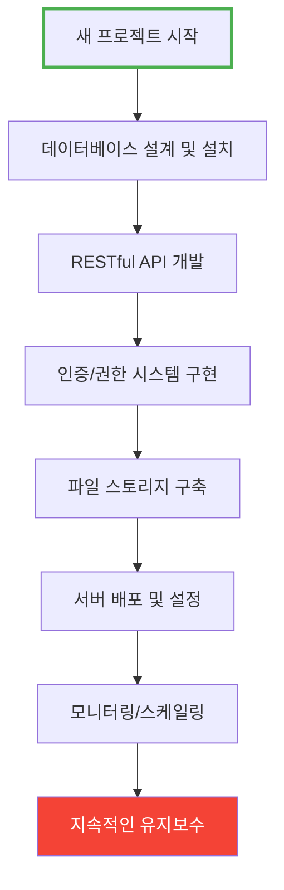
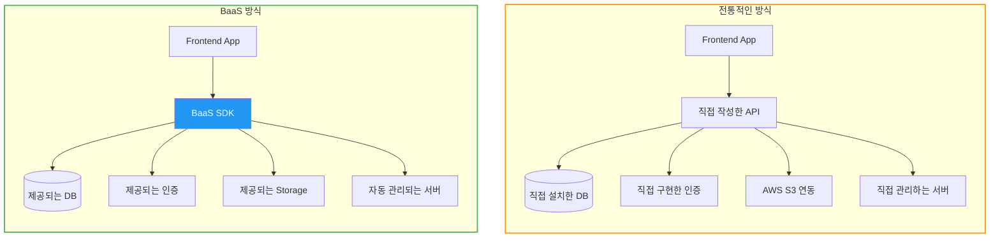
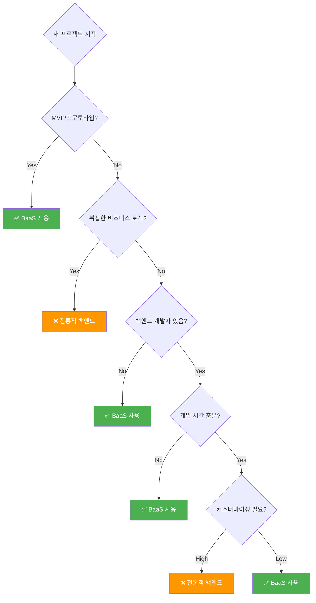
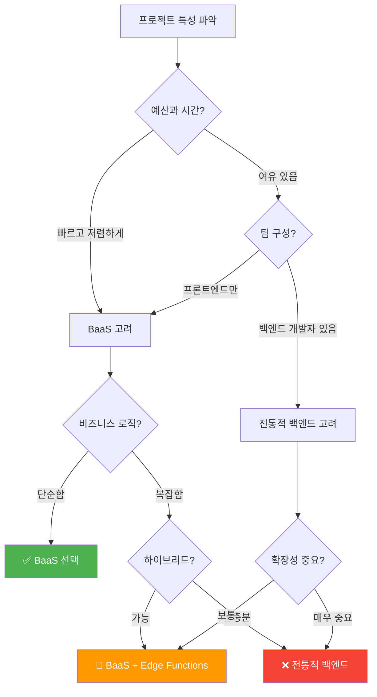

# BaaS (Backend as a Service)

백엔드 서버를 직접 구축하지 않고 API로 바로 사용할 수 있는 클라우드 서비스

## 결론부터 말하면

**BaaS는 데이터베이스, 인증, API, 파일 저장소 등 백엔드 기능을 클라우드에서 제공하는 서비스**입니다.
개발자가 서버 코드를 직접 작성하지 않고 SDK를 통해 백엔드 기능을 바로 사용할 수 있습니다.

```javascript
// 전통적인 방식: 서버 코드 직접 작성 필요
// Spring Boot, Express.js 등으로 API 구현, DB 설정, 배포...

// BaaS 방식: SDK로 바로 사용
import { createClient } from '@supabase/supabase-js'
const supabase = createClient('URL', 'KEY')

// DB 조회 (서버 코드 없이)
const { data } = await supabase.from('users').select('*')

// 인증 (구현 없이)
await supabase.auth.signUp({ email, password })

// 파일 업로드 (구현 없이)
await supabase.storage.from('images').upload('photo.jpg', file)
```

## 1. BaaS가 해결하는 문제

### 전통적인 백엔드 개발의 어려움



**문제점:**
- ⏰ 시간: 기본 백엔드 구축에만 수 주~수 개월 소요
- 💰 비용: 서버 운영, 인프라 관리 비용
- 🔧 복잡성: DB, 인증, API, 배포 등 다양한 기술 스택 필요
- 👥 인력: 백엔드 개발자 필수

### BaaS의 해결책


**장점:**
- ⚡ 빠른 개발: 몇 분~몇 시간이면 백엔드 준비 완료
- 💵 비용 절감: 사용량 기반 과금, 초기 비용 없음
- 🎯 단순함: SDK만 사용하면 됨
- 🚀 즉시 배포: 인프라 관리 불필요

## 2. 전통적인 백엔드 vs BaaS 비교

### 아키텍처 비교



### 코드 비교: 사용자 생성 API

#### 전통적인 방식 (Spring Boot)

```java
// 1. Entity 작성
@Entity
@Table(name = "users")
public class User {
    @Id
    @GeneratedValue(strategy = GenerationType.IDENTITY)
    private Long id;

    @Column(unique = true)
    private String email;

    private String password;
    // getter, setter...
}

// 2. Repository 작성
@Repository
public interface UserRepository extends JpaRepository<User, Long> {
    Optional<User> findByEmail(String email);
}

// 3. Service 작성
@Service
public class UserService {
    @Autowired
    private UserRepository userRepository;

    @Autowired
    private PasswordEncoder passwordEncoder;

    public User createUser(String email, String password) {
        String encodedPassword = passwordEncoder.encode(password);
        User user = new User(email, encodedPassword);
        return userRepository.save(user);
    }
}

// 4. Controller 작성
@RestController
@RequestMapping("/api/users")
public class UserController {
    @Autowired
    private UserService userService;

    @PostMapping
    public ResponseEntity<User> createUser(@RequestBody UserRequest request) {
        User user = userService.createUser(request.getEmail(), request.getPassword());
        return ResponseEntity.ok(user);
    }
}

// 5. Security 설정
@Configuration
public class SecurityConfig {
    @Bean
    public PasswordEncoder passwordEncoder() {
        return new BCryptPasswordEncoder();
    }
    // JWT, CORS, 권한 설정...
}

// 6. application.properties 설정
// spring.datasource.url=...
// spring.jpa.hibernate.ddl-auto=...

// 7. 서버 배포 및 운영
```

**필요한 작업:**
- Entity, Repository, Service, Controller 작성
- 비밀번호 암호화, 유효성 검증
- DB 설정 및 마이그레이션
- 에러 핸들링
- 서버 배포
- **총 소요 시간: 수 시간~수 일**

#### BaaS 방식 (Supabase)

```javascript
import { createClient } from '@supabase/supabase-js'

// 1. 초기화 (1분)
const supabase = createClient(
  'https://your-project.supabase.co',
  'your-anon-key'
)

// 2. 사용자 생성 (이미 구현되어 있음)
const { data, error } = await supabase.auth.signUp({
  email: 'user@example.com',
  password: 'password123'
})

// 끝! DB, 인증, API 모두 자동 처리됨
```

**필요한 작업:**
- Supabase 프로젝트 생성 (웹에서 클릭)
- SDK 설치 및 초기화
- **총 소요 시간: 5분**

### 개발 시간 비교

| 기능 | 전통적 방식 | BaaS | 시간 절감 |
|------|------------|------|-----------|
| DB 설정 | 2-4시간 | 5분 | 95%+ |
| 인증 구현 | 1-2주 | 10분 | 99%+ |
| API 개발 | 수 일~수 주 | 즉시 | 90%+ |
| 파일 업로드 | 2-3일 | 10분 | 98%+ |
| 배포 설정 | 1-2일 | 자동 | 100% |
| **합계** | **2-4주** | **1-2시간** | **95%+** |

## 3. BaaS의 주요 기능

### 3.1 데이터베이스

```javascript
// Supabase (PostgreSQL)
const { data } = await supabase
  .from('products')
  .select('*')
  .eq('category', 'electronics')
  .order('price', { ascending: true })
  .limit(10)
```

```javascript
// Firebase (NoSQL)
const products = await firebase
  .collection('products')
  .where('category', '==', 'electronics')
  .orderBy('price', 'asc')
  .limit(10)
  .get()
```

**특징:**
- SQL(Supabase) 또는 NoSQL(Firebase) 중 선택
- 자동으로 REST API 생성
- 웹 콘솔에서 데이터 관리

### 3.2 인증 (Authentication)

```javascript
// 이메일/비밀번호 회원가입
await supabase.auth.signUp({
  email: 'user@example.com',
  password: 'password'
})

// 소셜 로그인 (구글, 깃허브 등)
await supabase.auth.signInWithOAuth({
  provider: 'google'
})

// 로그인 상태 확인
const { data: { user } } = await supabase.auth.getUser()

// 로그아웃
await supabase.auth.signOut()
```

**지원 기능:**
- 이메일/비밀번호
- 소셜 로그인 (Google, GitHub, Facebook 등)
- 매직 링크 (비밀번호 없는 로그인)
- 2FA (이중 인증)
- JWT 토큰 자동 관리

### 3.3 실시간 데이터베이스

```javascript
// 실시간 구독 - 데이터 변경 시 자동 업데이트
supabase
  .channel('public:messages')
  .on('postgres_changes',
    { event: '*', schema: 'public', table: 'messages' },
    (payload) => {
      console.log('새 메시지:', payload.new)
      // UI 자동 업데이트
    }
  )
  .subscribe()
```

**활용:**
- 채팅 앱
- 실시간 협업 도구
- 라이브 대시보드
- 게임 리더보드

### 3.4 파일 스토리지

```javascript
// 파일 업로드
const { data, error } = await supabase.storage
  .from('avatars')
  .upload('user1/profile.jpg', file)

// 파일 다운로드 URL
const { data: url } = supabase.storage
  .from('avatars')
  .getPublicUrl('user1/profile.jpg')

// 파일 삭제
await supabase.storage
  .from('avatars')
  .remove(['user1/profile.jpg'])
```

**특징:**
- 자동 CDN 연동
- 이미지 리사이징
- 접근 권한 관리
- 대용량 파일 지원

### 3.5 서버리스 함수

```javascript
// Edge Function 예시 (Supabase)
// functions/hello/index.ts
import { serve } from 'https://deno.land/std@0.168.0/http/server.ts'

serve(async (req) => {
  const { name } = await req.json()

  // 복잡한 비즈니스 로직 실행
  const result = await processData(name)

  return new Response(
    JSON.stringify({ message: `Hello ${name}`, result }),
    { headers: { 'Content-Type': 'application/json' } }
  )
})
```

**활용:**
- 결제 처리
- 이메일 발송
- 이미지 처리
- 외부 API 연동

## 4. 주요 BaaS 서비스 비교

| 특징 | Firebase | Supabase | AWS Amplify | Appwrite |
|------|----------|----------|-------------|----------|
| **DB 타입** | NoSQL (Firestore) | SQL (PostgreSQL) | NoSQL (DynamoDB) | SQL/NoSQL |
| **가격** | 무료 → 종량제 | 무료 → 종량제 | 종량제 | 무료 (자체 호스팅) |
| **오픈소스** | ❌ | ✅ | ❌ | ✅ |
| **자체 호스팅** | ❌ | ✅ | ❌ | ✅ |
| **실시간 DB** | ✅ | ✅ | ✅ | ✅ |
| **인증** | ✅ | ✅ | ✅ | ✅ |
| **스토리지** | ✅ | ✅ | ✅ | ✅ |
| **학습 곡선** | 쉬움 | 중간 (SQL 필요) | 어려움 (AWS 생태계) | 쉬움 |
| **회사** | Google | Supabase | Amazon | Appwrite |

### Firebase
**강점:**
- Google 생태계 통합 (Analytics, Crashlytics)
- 가장 오래되고 안정적
- 풍부한 문서와 커뮤니티

**약점:**
- NoSQL만 지원 (복잡한 쿼리 어려움)
- 종속성 (자체 호스팅 불가)

### Supabase
**강점:**
- PostgreSQL (관계형 DB, 복잡한 쿼리)
- 오픈소스 (자체 호스팅 가능)
- SQL 지식 활용 가능

**약점:**
- 상대적으로 새로운 서비스
- Firebase보다 작은 생태계

### AWS Amplify
**강점:**
- AWS의 모든 서비스 활용 가능
- 엔터프라이즈급 보안

**약점:**
- 복잡한 설정
- 비싼 비용

### Appwrite
**강점:**
- 완전 무료 (자체 호스팅)
- Docker로 쉬운 설치

**약점:**
- 직접 서버 관리 필요
- 작은 커뮤니티

## 5. 언제 BaaS를 사용해야 하나?

### ✅ BaaS가 적합한 경우

**1. MVP (최소 기능 제품) 빠르게 만들기**
```
상황: 아이디어 검증을 위해 2주 안에 앱을 만들어야 함
해결: Firebase/Supabase로 1주일 만에 백엔드 완성
```

**2. 소규모 팀, 스타트업**
```
상황: 프론트엔드 개발자 2명, 백엔드 개발자 없음
해결: BaaS로 풀스택 개발 가능
```

**3. 표준 기능 중심의 앱**
```
필요 기능: 회원가입, 로그인, CRUD, 파일 업로드
해결: BaaS가 모두 기본 제공
```

**4. 실시간 기능이 필요한 앱**
```
예시: 채팅 앱, 협업 도구, 라이브 대시보드
해결: 실시간 DB 기능 바로 사용
```

**5. 서버 관리 부담 줄이기**
```
상황: 스케일링, 모니터링, 보안 패치 등 운영 부담
해결: BaaS가 자동으로 관리
```

### ❌ 전통적인 백엔드가 나은 경우

**1. 복잡한 비즈니스 로직**
```java
// 복잡한 주문 처리 로직
@Service
public class OrderService {
    public Order processOrder(OrderRequest request) {
        // 재고 확인
        // 할인 계산
        // 포인트 적립
        // 배송 스케줄링
        // 결제 처리
        // 알림 발송
        // 회계 시스템 연동
        // ...
    }
}
```
→ 서버 코드로 구현하는 게 더 명확

**2. 특수한 성능 최적화 필요**
```
- 복잡한 DB 쿼리 최적화
- 캐싱 전략
- DB 샤딩
- 커스텀 인덱싱
```

**3. 레거시 시스템 연동**
```
- 기존 온프레미스 DB 연동
- 내부 ERP/CRM 시스템 통합
- 특정 프로토콜 사용
```

**4. 엄격한 데이터 규정**
```
- 금융, 의료 등 규제 산업
- 데이터 국내 보관 의무
- 특정 보안 인증 필요
```

**5. 대규모 엔터프라이즈**
```
- 수천만 명의 사용자
- 초당 수만 건의 트랜잭션
- 완벽한 커스터마이징 필요
```

### 의사결정 플로우차트



## 6. 실무 활용 예시

### 예시 1: 할 일 관리 앱 (Todo App)

**요구사항:**
- 사용자 인증
- 할 일 CRUD
- 실시간 동기화

**Supabase로 구현:**

```javascript
// 1. 초기화
import { createClient } from '@supabase/supabase-js'
const supabase = createClient(SUPABASE_URL, SUPABASE_KEY)

// 2. 로그인
async function login(email, password) {
  const { data, error } = await supabase.auth.signInWithPassword({
    email,
    password
  })
  return data.user
}

// 3. 할 일 추가
async function addTodo(title) {
  const { data, error } = await supabase
    .from('todos')
    .insert({ title, user_id: user.id, completed: false })
    .select()
  return data
}

// 4. 할 일 목록 조회
async function getTodos() {
  const { data, error } = await supabase
    .from('todos')
    .select('*')
    .eq('user_id', user.id)
    .order('created_at', { ascending: false })
  return data
}

// 5. 실시간 구독
supabase
  .channel('todos')
  .on('postgres_changes',
    { event: '*', schema: 'public', table: 'todos' },
    (payload) => {
      console.log('변경 감지:', payload)
      // UI 자동 업데이트
      refreshTodoList()
    }
  )
  .subscribe()

// 6. 할 일 완료 처리
async function toggleTodo(id, completed) {
  const { data, error } = await supabase
    .from('todos')
    .update({ completed })
    .eq('id', id)
  return data
}

// 7. 할 일 삭제
async function deleteTodo(id) {
  const { data, error } = await supabase
    .from('todos')
    .delete()
    .eq('id', id)
  return data
}
```

**개발 시간:**
- 전통적 방식: 1-2주
- BaaS: 1-2일

### 예시 2: 블로그 플랫폼

**요구사항:**
- 사용자 인증
- 글 작성/수정/삭제
- 이미지 업로드
- 댓글 기능

**Firebase로 구현:**

```javascript
import { initializeApp } from 'firebase/app'
import { getFirestore, collection, addDoc, query, where, getDocs } from 'firebase/firestore'
import { getStorage, ref, uploadBytes, getDownloadURL } from 'firebase/storage'
import { getAuth, signInWithEmailAndPassword, createUserWithEmailAndPassword } from 'firebase/auth'

// 초기화
const app = initializeApp(firebaseConfig)
const db = getFirestore(app)
const storage = getStorage(app)
const auth = getAuth(app)

// 글 작성
async function createPost(title, content, imageFile) {
  // 1. 이미지 업로드
  const imageRef = ref(storage, `posts/${Date.now()}_${imageFile.name}`)
  await uploadBytes(imageRef, imageFile)
  const imageUrl = await getDownloadURL(imageRef)

  // 2. 글 저장
  const docRef = await addDoc(collection(db, 'posts'), {
    title,
    content,
    imageUrl,
    authorId: auth.currentUser.uid,
    createdAt: new Date(),
    likes: 0
  })

  return docRef.id
}

// 내 글 목록 조회
async function getMyPosts() {
  const q = query(
    collection(db, 'posts'),
    where('authorId', '==', auth.currentUser.uid)
  )
  const snapshot = await getDocs(q)
  return snapshot.docs.map(doc => ({ id: doc.id, ...doc.data() }))
}

// 댓글 추가
async function addComment(postId, text) {
  await addDoc(collection(db, 'comments'), {
    postId,
    text,
    authorId: auth.currentUser.uid,
    createdAt: new Date()
  })
}
```

**개발 시간:**
- 전통적 방식: 2-3주
- BaaS: 2-3일

### 예시 3: 실시간 채팅 앱

**요구사항:**
- 실시간 메시지
- 읽음 상태 표시
- 파일 전송

```javascript
// Supabase Realtime
const channel = supabase.channel('room1')

// 메시지 보내기
async function sendMessage(text) {
  const { data, error } = await supabase
    .from('messages')
    .insert({
      room_id: 'room1',
      user_id: user.id,
      text,
      created_at: new Date()
    })
}

// 실시간 메시지 수신
channel
  .on('postgres_changes',
    { event: 'INSERT', schema: 'public', table: 'messages' },
    (payload) => {
      displayMessage(payload.new)
    }
  )
  .subscribe()

// 파일 전송
async function sendFile(file) {
  // 1. 파일 업로드
  const fileName = `${Date.now()}_${file.name}`
  const { data: uploadData } = await supabase.storage
    .from('chat-files')
    .upload(fileName, file)

  // 2. 메시지로 URL 전송
  const { data: urlData } = supabase.storage
    .from('chat-files')
    .getPublicUrl(fileName)

  await sendMessage(`[파일] ${urlData.publicUrl}`)
}
```

**개발 시간:**
- 전통적 방식: 3-4주 (WebSocket 구현 포함)
- BaaS: 3-5일

## 7. BaaS 시작하기

### Supabase 빠른 시작

```bash
# 1. 프로젝트 생성 (https://supabase.com)
# "New Project" 클릭 → 프로젝트명 입력 → 생성

# 2. 프론트엔드 프로젝트에 설치
npm install @supabase/supabase-js

# 3. 초기화 (src/lib/supabase.js)
import { createClient } from '@supabase/supabase-js'

const supabaseUrl = 'https://your-project.supabase.co'
const supabaseKey = 'your-anon-key'

export const supabase = createClient(supabaseUrl, supabaseKey)

# 4. 테이블 생성 (SQL Editor에서)
CREATE TABLE posts (
  id UUID PRIMARY KEY DEFAULT uuid_generate_v4(),
  title TEXT NOT NULL,
  content TEXT,
  user_id UUID REFERENCES auth.users(id),
  created_at TIMESTAMP DEFAULT NOW()
);

# 5. Row Level Security 설정 (보안 정책)
ALTER TABLE posts ENABLE ROW LEVEL SECURITY;

CREATE POLICY "Users can read all posts"
  ON posts FOR SELECT
  USING (true);

CREATE POLICY "Users can create their own posts"
  ON posts FOR INSERT
  WITH CHECK (auth.uid() = user_id);

# 6. 사용
import { supabase } from './lib/supabase'

const { data, error } = await supabase
  .from('posts')
  .select('*')
```

### Firebase 빠른 시작

```bash
# 1. 프로젝트 생성 (https://console.firebase.google.com)
# "프로젝트 추가" → 이름 입력 → 생성

# 2. 설치
npm install firebase

# 3. 초기화 (src/firebase.js)
import { initializeApp } from 'firebase/app'
import { getFirestore } from 'firebase/firestore'
import { getAuth } from 'firebase/auth'

const firebaseConfig = {
  apiKey: "your-api-key",
  authDomain: "your-project.firebaseapp.com",
  projectId: "your-project",
  storageBucket: "your-project.appspot.com"
}

const app = initializeApp(firebaseConfig)
export const db = getFirestore(app)
export const auth = getAuth(app)

# 4. Firestore 보안 규칙 설정
rules_version = '2';
service cloud.firestore {
  match /databases/{database}/documents {
    match /posts/{postId} {
      allow read: if true;
      allow create: if request.auth != null;
      allow update, delete: if request.auth.uid == resource.data.authorId;
    }
  }
}

# 5. 사용
import { db } from './firebase'
import { collection, addDoc } from 'firebase/firestore'

await addDoc(collection(db, 'posts'), {
  title: 'Hello',
  content: 'World'
})
```

## 8. BaaS의 한계와 대안

### 비용 문제

**문제:** 사용자가 많아지면 비용이 급증할 수 있음

```
Firebase 가격 예시:
- 무료: 50,000 읽기/일
- 초과 시: $0.06/100,000 읽기

앱이 성장하면:
- 100만 사용자, 각 10회 읽기/일 = 1,000만 읽기/일
- 비용: $60/일 = $1,800/월
```

**해결책:**
1. 캐싱 전략 (React Query, SWR)
2. 쿼리 최적화
3. 자체 호스팅 고려 (Supabase, Appwrite)

### 벤더 종속성

**문제:** Firebase에서 다른 서비스로 마이그레이션이 어려움

**해결책:**
1. 오픈소스 BaaS 사용 (Supabase, Appwrite)
2. 추상화 레이어 작성
```javascript
// BaaS 추상화 예시
class DatabaseService {
  async getPosts() {
    // 구현은 Firebase, Supabase 등으로 교체 가능
  }
}
```

### 복잡한 쿼리 제한

**문제:** NoSQL(Firebase)는 복잡한 조인이 어려움

**예시:**
```javascript
// Firebase: 여러 번 쿼리 필요
const posts = await getPosts()
for (const post of posts) {
  post.author = await getUser(post.authorId)
  post.comments = await getComments(post.id)
}

// 전통적 SQL: 한 번에 가능
SELECT posts.*, users.name, COUNT(comments.id)
FROM posts
JOIN users ON posts.author_id = users.id
LEFT JOIN comments ON posts.id = comments.post_id
GROUP BY posts.id
```

**해결책:**
1. SQL 기반 BaaS 사용 (Supabase)
2. 데이터 비정규화
3. 복잡한 쿼리는 Edge Function으로 처리

## 9. BaaS vs 전통적 백엔드 - 최종 정리

### 개발 단계별 비교

| 단계 | 전통적 백엔드 | BaaS | 승자 |
|------|--------------|------|------|
| **초기 개발** | 느림 (수 주) | 매우 빠름 (수 일) | 🏆 BaaS |
| **0-1만 사용자** | 비용 높음 (서버 고정비) | 비용 낮음 (무료/저렴) | 🏆 BaaS |
| **1만-10만 사용자** | 안정적 비용 | 증가하는 비용 | ⚖️ 비슷 |
| **10만+ 사용자** | 최적화 가능 | 비용 급증 가능 | 🏆 전통적 |
| **복잡한 로직** | 자유로움 | 제한적 | 🏆 전통적 |
| **유지보수** | 직접 관리 | 자동 관리 | 🏆 BaaS |
| **커스터마이징** | 무제한 | 제한적 | 🏆 전통적 |

### 선택 가이드



**결론:**
- 🚀 **빠른 MVP, 프로토타입**: BaaS
- 💼 **소규모 팀, 스타트업**: BaaS
- 🏢 **대기업, 복잡한 시스템**: 전통적 백엔드
- 🔀 **중간 규모**: 하이브리드 (BaaS + 커스텀 API)

## 10. 더 알아보기

### 공식 문서
- [Firebase 공식 문서](https://firebase.google.com/docs)
- [Supabase 공식 문서](https://supabase.com/docs)
- [AWS Amplify 공식 문서](https://docs.amplify.aws/)
- [Appwrite 공식 문서](https://appwrite.io/docs)

### 튜토리얼
- [Supabase로 Todo 앱 만들기](https://supabase.com/docs/guides/getting-started/tutorials)
- [Firebase로 채팅 앱 만들기](https://firebase.google.com/docs/samples)

### 커뮤니티
- [r/firebase](https://reddit.com/r/firebase)
- [Supabase Discord](https://discord.supabase.com/)
