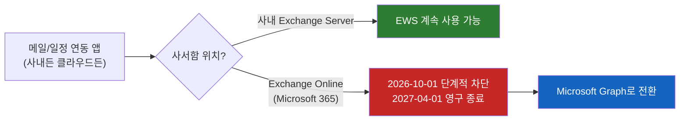
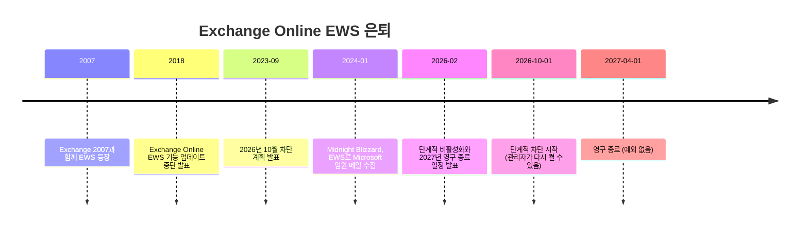

# Exchange Online EWS는 왜 2027년 4월에 완전히 꺼질까

20년 가까이 메일·일정 연동의 표준이던 EWS가 Microsoft 365에서 사라진다. 그런데 사내 Exchange Server의 EWS는 그대로라고 한다. 같은 API인데 왜 클라우드에서만 꺼질까? 그리고 내 앱은 영향을 받을까?

## 결론부터 말하면

**Exchange Online의 EWS는 2026년 10월 1일부터 단계적으로 차단되고, 2027년 4월 1일에 예외 없이 영구 종료된다.** 대체 수단은 Microsoft Graph API다. 사내(on-premises) Exchange Server의 EWS는 바뀌지 않는다.

영향 여부를 가르는 기준은 "앱이 어디서 도느냐"가 아니라 **"접근하는 사서함이 어디에 있느냐"** 다. 사내 서버에서 도는 배치 프로그램이라도 Exchange Online 사서함을 EWS로 읽고 있다면 종료 대상이다.



| 상황 | 영향 |
|------|------|
| 사내 앱 → 사내 Exchange Server 사서함 | 없음 |
| 사내 앱 → Exchange Online 사서함 | **종료 대상** |
| 클라우드 앱 → Exchange Online 사서함 | **종료 대상** |
| 하이브리드 (사서함이 양쪽에 섞임) | 사서함별로 분기. 사내 사서함은 EWS, 클라우드 사서함은 Graph |

> 이름이 비슷한 NTLM 퇴출과는 별개 이슈다. NTLM은 "누구인지 증명하는" 인증 프로토콜이고, EWS는 "메일 데이터에 접근하는" API다. NTLM은 기본 비활성화 날짜가 아직 없지만, EWS는 2027-04-01로 확정이다. ([NTLM은 왜 30년 만에 퇴출될까](../security/NTLM은-왜-30년-만에-퇴출될까.md) 참고)

---

## 1. EWS는 무엇이고, 왜 그렇게 널리 쓰였을까

### 1.1 Outlook이 아닌 프로그램이 메일함을 읽으려면

회사 메일 서버(Exchange)에 쌓인 메일과 일정을 Outlook이 아닌 다른 프로그램이 다뤄야 하는 경우는 생각보다 많다. 회의실 예약 시스템이 일정을 등록하고, 백업 솔루션이 사서함을 통째로 복사하고, 사내 그룹웨어가 메일 수를 띄우고, 마이그레이션 도구가 사서함을 옮긴다. 이런 프로그램들은 메일 서버와 대화할 표준 창구가 필요했다.

2007년 Exchange 2007과 함께 나온 **EWS(Exchange Web Services)** 가 그 창구다. EWS는 HTTPS 위에서 XML 메시지를 주고받는 **SOAP** 방식의 웹 서비스 API로, `https://<서버>/EWS/Exchange.asmx` 라는 엔드포인트 하나로 메일·일정·연락처·작업을 모두 다룰 수 있었다. Java와 .NET용 공식 SDK(EWS Managed API, ews-java-api)까지 나오면서, 이후 15년 넘게 Exchange 연동의 사실상 표준이 됐다.

### 1.2 클라우드로 옮겨가도 EWS는 따라왔다

Exchange가 클라우드 서비스(Exchange Online, Microsoft 365)로 옮겨갈 때도 EWS는 그대로 따라왔다. 기존 연동 프로그램이 주소만 `outlook.office365.com/EWS/Exchange.asmx` 로 바꾸면 클라우드 사서함을 그대로 읽을 수 있었기 때문이다. 호환성 측면에서는 훌륭한 선택이었다.

그런데 바로 이 "20년 된 API를 그대로 클라우드에 올려둔 상태"가 문제가 된다.

---

## 2. 왜 Microsoft는 클라우드에서만 EWS를 끄려 할까

### 2.1 이미 8년 전부터 예고된 은퇴

EWS의 은퇴는 갑작스러운 일이 아니다. Microsoft는 2018년에 Exchange Online의 EWS에 더 이상 기능을 추가하지 않겠다고 발표했고, 2023년에는 2026년 10월에 끄겠다고 못 박았다. 그사이 대체재로 키운 것이 **Microsoft Graph** 다. Graph는 메일·일정뿐 아니라 사용자, Teams, OneDrive, SharePoint까지 Microsoft 365 전체를 `https://graph.microsoft.com` 하나의 REST API로 다루는 통합 창구다. Microsoft는 Graph가 대부분의 EWS 시나리오에서 거의 완전한 기능 동등성(feature parity)에 도달했고, 자사 앱도 대부분 EWS를 떠났다고 설명한다.

### 2.2 공식 이유: 보안, 규모, 신뢰성

Exchange 팀은 은퇴 이유를 "EWS는 거의 20년 전에 만들어졌고, 오늘날의 보안·규모·신뢰성 요구에 맞지 않는다"고 정리했다. 레거시 API 하나를 유지한다는 것은 공격 표면 하나를 계속 열어둔다는 뜻이고, Graph와 EWS 두 경로를 동시에 운영하는 비용도 든다.

### 2.3 그 위험이 현실이 된 사건: Midnight Blizzard (2024)

2024년 1월 Microsoft는 국가 배후 해킹 그룹 Midnight Blizzard에게 자사 임원들의 메일함이 털렸다고 발표했다. Microsoft 보안 블로그의 분석에 따르면, 공격자는 오래된 테스트용 OAuth 앱을 장악해 **Exchange Online의 `full_access_as_app` 권한** 을 부여했고, 이를 이용해 **EWS로 메일을 수집** 했다.

`full_access_as_app` 은 EWS를 앱 권한으로 쓸 때 주는 권한으로, 따로 제한하지 않으면 조직 내 모든 사서함에 대한 전체 접근을 뜻한다. 권한을 주는 축은 두 가지로 나눠 볼 수 있다. 하나는 **어느 사서함에** 접근하느냐이고, 다른 하나는 **무엇을** 할 수 있느냐다. 사서함 범위는 Exchange Online의 애플리케이션 RBAC(RBAC for Applications)으로 EWS와 Graph 모두 좁힐 수 있다. 하지만 작업 범위는 다르다. EWS 앱 권한은 "사서함 전체 접근" 하나뿐인 반면, Graph는 `Mail.Read`, `Calendars.ReadWrite` 처럼 데이터 종류와 읽기/쓰기를 나눈 권한을 쓴다. 같은 "앱이 메일함을 읽는" 일이라도, 기본값이 얼마나 넓고 얼마나 잘게 쪼갤 수 있느냐가 다르다.

### 2.4 그럼 왜 사내 Exchange Server는 그대로일까

여기까지 보면 자연스러운 의문이 생긴다. 보안 문제라면 사내 Exchange Server의 EWS도 꺼야 하지 않을까?

답은 **Graph가 클라우드 전용** 이라는 데 있다. Graph는 Microsoft 365 클라우드 서비스의 API라서, 사내에 설치한 Exchange Server에는 Graph 엔드포인트가 없다. 사내 Exchange에서 EWS를 끄면 대체할 API 자체가 없다. 그래서 Microsoft는 "EWS is not being retired on-prem"이라고 명시했다. 클라우드는 대체재가 준비됐으니 끄고, 사내는 대체재가 없으니 남겨두는 것이다.

---

## 3. 어떻게 꺼지나: 일정과 차단 방식

### 3.1 타임라인



### 3.2 스위치는 `EWSEnabled` 하나

Microsoft는 테넌트(조직)마다 `EWSEnabled` 라는 설정 하나로 EWS를 끈다. 여기에 2026년에 새로 생긴 **AppID 허용 목록(`EWSAllowedAppIDs`)** 이 결합된다. AppID는 Entra ID(구 Azure AD)에 등록된 앱마다 붙는 고유 ID로, 허용 목록에 있는 앱만 EWS를 쓸 수 있게 하는 장치다.

| `EWSEnabled` 값 | 2026년 10월 이전 | 2026년 10월부터 |
|---|---|---|
| `True` | 허용 목록이 없으면 모든 EWS 허용 | **허용 목록에 있는 앱만 허용** (목록이 비어 있으면 전부 차단) |
| `False` | 모든 EWS 차단 | 모든 EWS 차단 |
| `Null` (기본값) | 모든 EWS 허용 | **`False` 로 자동 변경** → 모든 EWS 차단 |

즉 아무것도 하지 않은 조직은 2026년 10월 1일 이후 순차 배포 과정에서 `Null` 이 `False` 로 바뀌며 EWS가 막힌다. 업무가 멈추면 관리자가 `True` 로 되돌릴 수 있지만 그사이 서비스는 끊긴다. 9월 말까지 미리 허용 목록을 만들고 `True` 로 설정한 조직은 이 자동 변경에서 제외됐다. Microsoft는 허용 목록을 만들지 않은 테넌트에 대해 사용량을 기준으로 목록을 미리 채워주겠다고도 했다.

그리고 **2027년 4월 1일** 이 되면 `EWSEnabled` 를 바꾸는 권한 자체가 관리자에게서 사라지고 EWS는 영구히 꺼진다. Microsoft는 "2027년 4월 이후 예외는 없다"고 못 박았다.

### 3.3 하이브리드 환경의 함정

사내 Exchange와 Exchange Online을 함께 쓰는 하이브리드 구성은 한 번 더 확인해야 한다. 두 환경 사이의 일정 공유(Free/Busy), MailTips 같은 연동 기능이 그동안 Exchange Online의 EWS를 써왔기 때문이다. 이 연동은 Graph로 바뀌는데, **Graph로 Exchange Online을 호출하는 기능은 Exchange Server SE(최신 버전)만 지원** 한다. 사서함이 모두 사내에 있어도 테넌트와 하이브리드로 묶여 있다면 Exchange 2016/2019에서 SE로 올라가야 한다. Skype for Business Server처럼 Exchange Online의 EWS를 호출하던 사내 제품도 Graph를 쓰는 업데이트를 4월 전에 설치해야 한다.

---

## 4. 실무: 무엇을 확인하고 어떻게 바꿀까

### 4.1 내 조직에서 EWS를 누가 쓰는지 찾기

Microsoft 365 관리 센터의 **EWS 사용량 보고서** 에서 어떤 앱(AppID)이 얼마나 EWS를 호출하는지 볼 수 있다. 계속 써야 하는 앱만 허용 목록에 남긴다.

```powershell
# Exchange Online PowerShell
Get-OrganizationConfig | Select-Object EwsEnabled

# 허용할 앱만 등록 (기존 목록을 통째로 교체한다)
Set-OrganizationConfig -EwsAllowedAppIDs "11111111-2222-3333-4444-555555555555"
Set-OrganizationConfig -EwsEnabled $true   # 2027-04-01 전까지만 의미 있음

# 현재 허용 목록 확인
Get-OrganizationConfig -RetrieveEwsOperationAccessPolicy |
    Select-Object -ExpandProperty EwsAllowedAppIDs
```

허용 목록은 어디까지나 **2027년 4월까지 시간을 버는 장치** 다. 근본 해결은 Graph 전환이다.

### 4.2 코드는 어떻게 바뀌나: SOAP에서 REST로

"받은편지함의 최근 메일 10개 제목 가져오기"를 비교해 보자.

```xml
<!-- Before: EWS (SOAP) - POST https://outlook.office365.com/EWS/Exchange.asmx -->
<soap:Envelope xmlns:soap="http://schemas.xmlsoap.org/soap/envelope/"
               xmlns:t="http://schemas.microsoft.com/exchange/services/2006/types"
               xmlns:m="http://schemas.microsoft.com/exchange/services/2006/messages">
  <soap:Header>
    <t:RequestServerVersion Version="Exchange2016"/>
    <t:ExchangeImpersonation>  <!-- 앱 권한이면 대상 사서함을 가장(impersonation) -->
      <t:ConnectingSID><t:SmtpAddress>alice@corp.example.com</t:SmtpAddress></t:ConnectingSID>
    </t:ExchangeImpersonation>
  </soap:Header>
  <soap:Body>
    <m:FindItem Traversal="Shallow">
      <m:ItemShape><t:BaseShape>IdOnly</t:BaseShape>
        <t:AdditionalProperties><t:FieldURI FieldURI="item:Subject"/></t:AdditionalProperties>
      </m:ItemShape>
      <m:IndexedPageItemView MaxEntriesReturned="10" Offset="0" BasePoint="Beginning"/>
      <m:ParentFolderIds><t:DistinguishedFolderId Id="inbox"/></m:ParentFolderIds>
    </m:FindItem>
  </soap:Body>
</soap:Envelope>
```

```http
# After: Microsoft Graph (REST) - 같은 일을 한 줄로
GET https://graph.microsoft.com/v1.0/users/alice@corp.example.com/mailFolders/inbox/messages?$top=10&$select=subject
Authorization: Bearer <Entra ID에서 받은 access token>
```

Graph 쪽은 URL이 곧 "누구의, 어느 폴더의, 무엇을"을 표현하고, 응답은 XML 대신 JSON이다. 권한도 `full_access_as_app` 대신 `Mail.Read` 처럼 필요한 만큼만 요청한다. Java라면 ews-java-api를 걷어내고 Microsoft Graph Java SDK(또는 평범한 HTTP 클라이언트 + OAuth 2.0 client credentials)로 바꾸는 작업이 된다.

전환할 때 주의할 점도 있다. Graph는 요청량 제한(throttling)이 EWS와 다르고, 아이템 ID 형식이 달라 기존에 저장해 둔 EWS ID는 변환 API로 바꿔야 한다. 새 메일을 감지하는 방식도 바뀐다. EWS의 Streaming/Pull 알림 대신 Graph에서는 변경 시 Webhook으로 알려주는 Change Notifications(구독)와, 마지막 동기화 이후 바뀐 것만 가져오는 Delta Query(`/delta`)를 조합하는 것이 표준 패턴이다. 일부 기능은 아직 Graph에 동등한 기능이 없으니, Microsoft Learn의 "parity gaps" 목록을 먼저 확인하는 것이 좋다.

### 4.3 하이브리드 앱: 사서함 위치로 분기

하이브리드 환경의 앱은 사서함마다 위치가 다를 수 있다. Microsoft의 권장 방식은 Autodiscover로 사서함 위치를 판별한 뒤, 사내 사서함은 EWS로, 클라우드 사서함은 Graph로 호출하는 것이다. 결국 "EWS 하나로 다 되던" 시절이 끝나고, 앱이 두 경로를 모두 알아야 한다.

---

## 5. 정리

### 핵심 포인트

1. **Exchange Online EWS는 2027-04-01에 예외 없이 영구 종료된다**
   - 2026-10-01부터 단계적 차단, 아무 설정도 안 한 조직은 `EWSEnabled` 가 `False` 로 바뀐다
   - 허용 목록(`EWSAllowedAppIDs`)은 2027년 4월까지 시간을 버는 장치일 뿐이다

2. **기준은 앱 위치가 아니라 사서함 위치다**
   - 사내 Exchange Server 사서함은 EWS를 계속 쓸 수 있다. Graph가 클라우드 전용이라 대체재가 없기 때문이다
   - 사내에서 도는 앱도 Exchange Online 사서함을 읽으면 종료 대상이다

3. **왜 끄나: 20년 된 API의 거친 권한 모델**
   - EWS 앱 권한(`full_access_as_app`)은 전 사서함 전체 접근이고, 2024년 Midnight Blizzard가 실제로 이 경로로 메일을 수집했다
   - 사서함 범위는 둘 다 애플리케이션 RBAC으로 좁힐 수 있지만, 작업 범위는 Graph만 `Mail.Read` 처럼 세분화된다

4. **하이브리드라면 Exchange SE까지 확인하라**
   - Free/Busy·MailTips 같은 연동이 Graph로 바뀌고, 이를 지원하는 것은 Exchange Server SE뿐이다

---

## 출처

- [Exchange Online EWS, Your Time is Almost Up - Exchange Team Blog](https://techcommunity.microsoft.com/blog/exchange/exchange-online-ews-your-time-is-almost-up/4492361) - Microsoft 공식, 일정과 `EWSEnabled` 동작 (2026-02-05, 2026-09-09 갱신)
- [Deprecation of Exchange Web Services in Exchange Online - Microsoft Learn](https://learn.microsoft.com/exchange/clients-and-mobile-in-exchange-online/deprecation-of-ews-exchange-online) - 공식 문서, Graph parity gap 목록
- [Introducing EWSAllowedAppIDs - Exchange Team Blog](https://techcommunity.microsoft.com/blog/exchange/introducing-ewsallowedappids-preparing-for-the-final-phase-of-ews-retirement/4529471) - AppID 허용 목록 PowerShell
- [MC1227454 - Exchange Web Services (EWS) retirement update](https://mc.merill.net/message/MC1227454) - Microsoft 365 메시지 센터 공지 아카이브
- [Retirement of Exchange Web Services in Exchange Online - Microsoft 365 Developer Blog](https://devblogs.microsoft.com/microsoft365dev/retirement-of-exchange-web-services-in-exchange-online/) - 2023년 발표
- [Midnight Blizzard: Guidance for responders on nation-state attack - Microsoft Security Blog](https://www.microsoft.com/security/blog/2024/01/25/midnight-blizzard-guidance-for-responders-on-nation-state-attack) - `full_access_as_app` 과 EWS 수집
- [RBAC for Applications in Exchange Online - Microsoft Learn](https://learn.microsoft.com/en-us/exchange/permissions-exo/application-rbac) - EWS와 Graph의 사서함 범위 제한
- [Prepare for EWS retirement in Exchange Online - Skype for Business Hybrid](https://learn.microsoft.com/en-us/skypeforbusiness/hybrid/prepare-for-ews-retirement)
- [Final Countdown to EWS Retirement - Office365ITPros](https://office365itpros.com/2026/02/06/ews-retirement-may-2027) - 하이브리드와 Exchange SE
