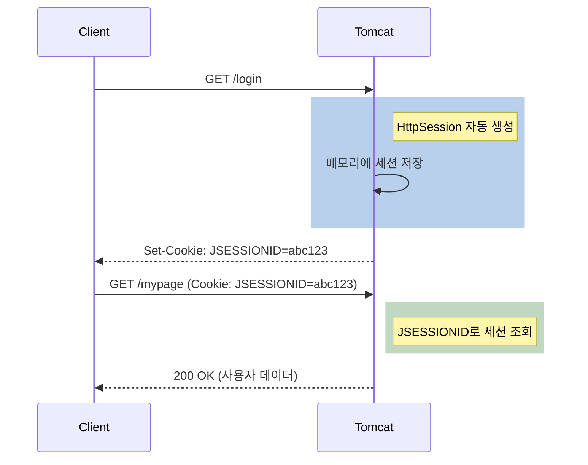
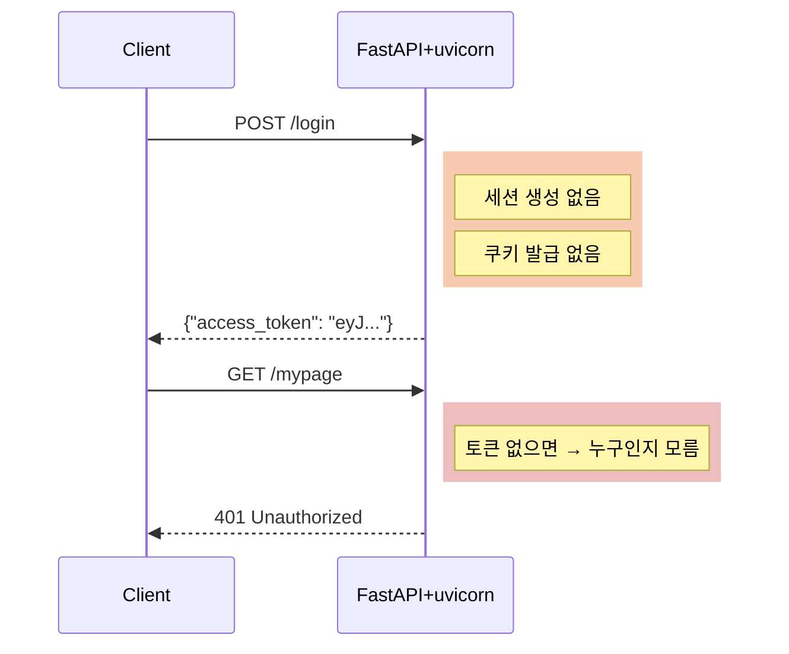
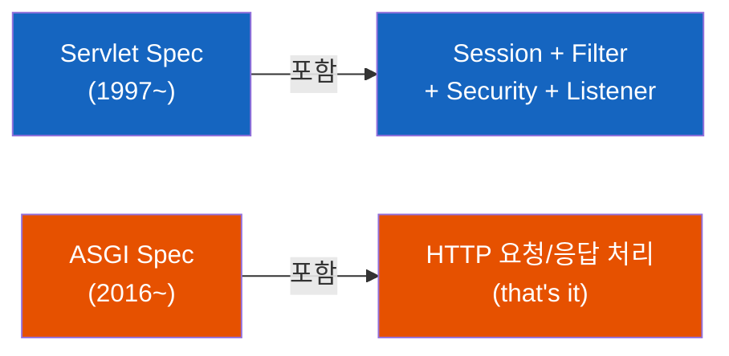
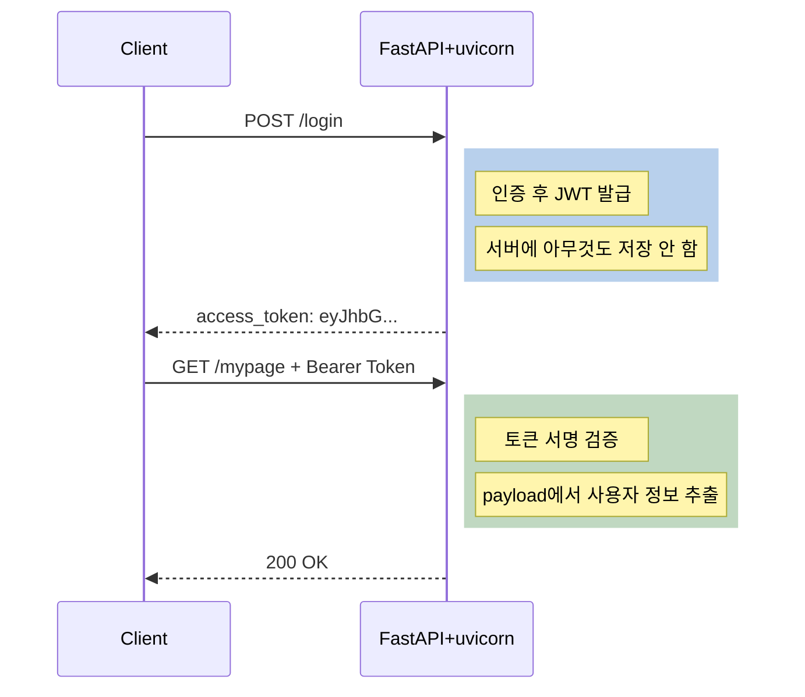

# FastAPI에는 왜 세션이 없을까

Tomcat은 세션을 자동으로 만들어주는데, FastAPI는 왜 안 만들어줄까? Servlet 컨테이너와 ASGI 서버, 두 세계의 설계 철학이 근본적으로 다르기 때문이다.

## 결론부터 말하면

**Tomcat(Servlet 컨테이너)은 Stateful 서버** 다. Servlet 스펙이 `HttpSession`이라는 표준을 정의하고 있어서, Tomcat이 세션을 자동 생성하고 `JSESSIONID` 쿠키로 클라이언트를 추적한다. 반면 **FastAPI+uvicorn(ASGI 서버)은 Stateless 서버** 다. 서버 측 세션 저장소가 아예 없다. 세션이 "사라진" 게 아니라, 처음부터 존재하지 않는 것이다.





| 구분 | Tomcat (Servlet) | FastAPI (ASGI) |
|------|-----------------|----------------|
| 세션 관리 | **자동** (HttpSession) | **없음** (직접 구현) |
| 쿠키 | JSESSIONID 자동 발급 | 직접 설정 |
| 상태 저장 | 서버 메모리 (기본) | 없음 |
| 설계 철학 | Stateful | Stateless |
| 인증 방식 | 세션 기반 | JWT, OAuth2 등 |

## 1. 왜 Tomcat은 세션을 "공짜로" 만들어줄까?

Java 개발자에게 `HttpSession`은 공기 같은 존재다. `request.getSession()`만 호출하면 세션이 생기고, `JSESSIONID` 쿠키가 자동으로 내려간다. 클라이언트가 다음 요청을 보내면 Tomcat이 알아서 쿠키를 읽고 세션을 매핑해준다. 개발자는 그냥 가져다 쓰면 된다.

왜 이렇게 편리한 걸까? 답은 **Servlet 스펙** 에 있다.

1997년, Sun Microsystems가 Servlet API를 설계할 때 HTTP의 본질적인 문제를 해결하려 했다. HTTP는 **Stateless 프로토콜** 이다. 매 요청이 독립적이라서 "이 사용자가 로그인했는지"를 서버가 기억할 방법이 없다. 당시는 쿠키 표준(RFC 2109)도 막 등장한 시기였고, 웹 서버마다 세션 관리를 제각각 구현하던 혼란기였다.

Servlet 스펙은 이 문제를 **컨테이너 레벨에서 해결** 하기로 했다. `javax.servlet.http.HttpSession` 인터페이스를 표준으로 정의하고, Servlet 컨테이너가 반드시 구현하도록 강제한 것이다. 덕분에 Java 개발자는 어떤 Servlet 컨테이너(Tomcat, Jetty, Undertow)를 쓰든 동일한 방식으로 세션을 사용할 수 있게 되었다.

```java
// Servlet 스펙이 보장하는 세션 관리 — 어떤 컨테이너든 동일하게 동작
HttpSession session = request.getSession();        // 세션 없으면 자동 생성
session.setAttribute("user", "sskim");             // 서버 메모리에 저장
// → Response: Set-Cookie: JSESSIONID=A1B2C3D4E5  (자동 발급)
```

Tomcat이 해주는 일을 정리하면 이렇다:

1. 첫 요청 시 `HttpSession` 객체 생성
2. 고유한 세션 ID 부여 (예: `A1B2C3D4E5`)
3. `Set-Cookie: JSESSIONID=A1B2C3D4E5` 헤더를 응답에 추가
4. 이후 요청에서 `JSESSIONID` 쿠키를 읽어 세션 매핑
5. 세션 데이터를 서버 메모리에 보관 (기본값)

이 모든 과정이 **자동** 이다. 개발자가 신경 쓸 건 `getSession()`과 `setAttribute()`/`getAttribute()` 뿐이다.

## 2. ASGI 서버는 왜 다를까?

Spring Boot를 하다가 FastAPI로 넘어오면 당황스러운 순간이 온다. `request.session`? 없다. `JSESSIONID`? 그런 것도 없다. uvicorn은 Tomcat처럼 세션을 자동으로 만들어주지 않는다.

이유는 **ASGI의 설계 철학** 이 Servlet과 근본적으로 다르기 때문이다.

Servlet 스펙은 "웹 애플리케이션에 필요한 모든 것을 제공하자"는 **올인원(All-in-One)** 철학으로 설계됐다. 세션, 필터, 리스너, 보안까지 하나의 스펙 안에 다 들어있다. 반면 ASGI는 "HTTP 요청/응답을 비동기로 처리하는 **최소한의 인터페이스** 만 정의하자"는 철학이다. 세션? 인증? 그건 애플리케이션이나 미들웨어가 알아서 할 일이다.



이런 차이가 생긴 데는 **시대적 배경** 도 있다.

Servlet이 등장한 1990년대 후반은 서버 한 대가 모든 것을 처리하던 **모놀리식 시대** 였다. 서버 메모리에 세션을 저장하는 게 자연스러웠다. 서버가 죽을 일이 거의 없었고, 설령 죽더라도 사용자에게 "다시 로그인해주세요"라고 하면 그만이었다.

하지만 2010년대 이후, 마이크로서비스와 클라우드 네이티브 환경에서는 이야기가 달라진다. **서버 인스턴스가 수시로 생성되고 파괴된다.** Auto Scaling으로 서버가 3대에서 10대로 늘어나기도 하고, 배포할 때 기존 서버가 교체되기도 한다. 이런 환경에서 서버 메모리에 세션을 저장하면 어떻게 될까?

- 서버 A에 로그인했는데, 로드밸런서가 서버 B로 보내면? → 세션 없음
- 서버 A가 스케일 다운으로 사라지면? → 세션도 사라짐
- 배포 때 서버가 교체되면? → 모든 사용자 강제 로그아웃

이 문제를 피하려면 처음부터 서버를 **Stateless** 로 만드는 게 합리적이다. FastAPI와 uvicorn은 이 철학을 따른다. 서버는 요청을 받고, 처리하고, 응답한다. 그 사이에 어떤 상태도 저장하지 않는다.

## 3. 그렇다면 FastAPI에서 인증은 어떻게?

Stateless 서버에서 인증은 **클라이언트가 매 요청마다 스스로를 증명** 하는 방식으로 구현한다. 가장 널리 쓰이는 방법이 **JWT(JSON Web Token)** 다.

```java
// Tomcat (Spring Boot) — 서버가 기억한다
@GetMapping("/login")
public String login(HttpServletRequest request) {
    HttpSession session = request.getSession();  // 서버에 세션 생성
    session.setAttribute("user", "sskim");       // 서버 메모리에 저장
    return "logged in";
    // → 서버가 상태를 가짐 (Stateful)
}
```

```python
# FastAPI — 클라이언트가 증명한다
@app.post("/login")
async def login(credentials: LoginRequest):
    user = authenticate(credentials)
    token = create_jwt({"sub": user.id})         # 토큰 생성 (서버에 저장 안 함!)
    return {"access_token": token}
    # → 서버는 아무것도 기억하지 않음 (Stateless)

@app.get("/mypage")
async def mypage(token = Depends(HTTPBearer())):
    payload = verify_jwt(token.credentials)      # 매 요청마다 토큰 검증
    return {"message": f"Hello, {payload['sub']}"}
```

핵심적인 차이가 보이는가?

| 방식 | 누가 상태를 관리하나? | 인증 수단 |
|------|---------------------|----------|
| Tomcat (세션) | **서버** 가 세션 ID로 사용자 기억 | JSESSIONID 쿠키 |
| FastAPI (JWT) | **클라이언트** 가 토큰으로 자신을 증명 | Authorization 헤더 |



물론 FastAPI에서도 세션을 쓸 수 있다. `starlette.middleware.sessions.SessionMiddleware`를 추가하면 쿠키 기반 세션을 사용할 수 있다. 하지만 이건 Tomcat의 서버 메모리 세션과는 다르다. 세션 데이터가 **쿠키 자체에 저장** 되기 때문에, 서버는 여전히 Stateless를 유지한다.

> **주의**: Starlette `SessionMiddleware`는 `itsdangerous`로 **서명(sign)** 만 하고 **암호화는 하지 않는다**. 쿠키 값은 `base64(json) + 서명` 형태라서, 클라이언트가 base64 디코딩하면 세션 내용을 그대로 읽을 수 있다 (위변조는 서명으로 차단되지만, 노출은 막지 못한다). 비밀번호·결제 정보 같은 민감한 데이터를 절대 세션에 담지 말고, 암호화가 필요하면 서버 측 세션 스토어(Redis 등)를 따로 두거나 `jose`/`fernet` 같은 라이브러리로 직접 암호화해야 한다.

한 가지 주의할 점이 있다. Stateless JWT에는 **즉각적인 로그아웃이 어렵다** 는 트레이드오프가 있다. Tomcat은 `session.invalidate()`를 호출하는 순간 해당 세션이 서버에서 사라지므로 즉시 차단이 가능하다. 하지만 JWT는 클라이언트가 토큰을 갖고 있는 한 서버가 강제로 만료시킬 방법이 없다. 그래서 실무에서는 Access Token의 유효기간을 짧게(15분~1시간) 설정하고 Refresh Token을 조합하거나, Redis에 Blacklist를 두어 특정 토큰을 즉시 무효화하는 패턴을 함께 사용한다.

## 4. 정리

### 핵심 포인트

1. **HttpSession은 "당연한 것"이 아니라 Servlet 스펙이 만든 편의 기능**
   - Tomcat이 자동으로 세션을 생성하고 JSESSIONID 쿠키를 관리하는 건 Servlet 표준 덕분이다
   - ASGI에는 이런 스펙이 없으므로 FastAPI+uvicorn에서는 세션이 존재하지 않는다

2. **Stateful vs Stateless는 시대의 선택**
   - 모놀리식 시대(1990~2000s): 서버 한 대가 모든 걸 기억 → Stateful이 합리적
   - 클라우드 시대(2010s~): 서버가 수시로 교체 → Stateless가 합리적

3. **서버가 기억하느냐, 클라이언트가 증명하느냐**
   - Tomcat: 서버가 세션 ID로 사용자를 **기억** 한다
   - FastAPI: 클라이언트가 JWT로 자신을 **증명** 한다
   - 어느 쪽이 우월한 게 아니라, 아키텍처에 맞는 선택이다

---

## 출처

- [Jakarta Servlet Specification](https://jakarta.ee/specifications/servlet/) - Servlet 공식 스펙
- [FastAPI Documentation](https://fastapi.tiangolo.com/) - FastAPI 공식 문서
- [ASGI Specification](https://asgi.readthedocs.io/) - ASGI 스펙
- [Starlette SessionMiddleware](https://www.starlette.io/middleware/#sessionmiddleware) - Starlette 세션 미들웨어
