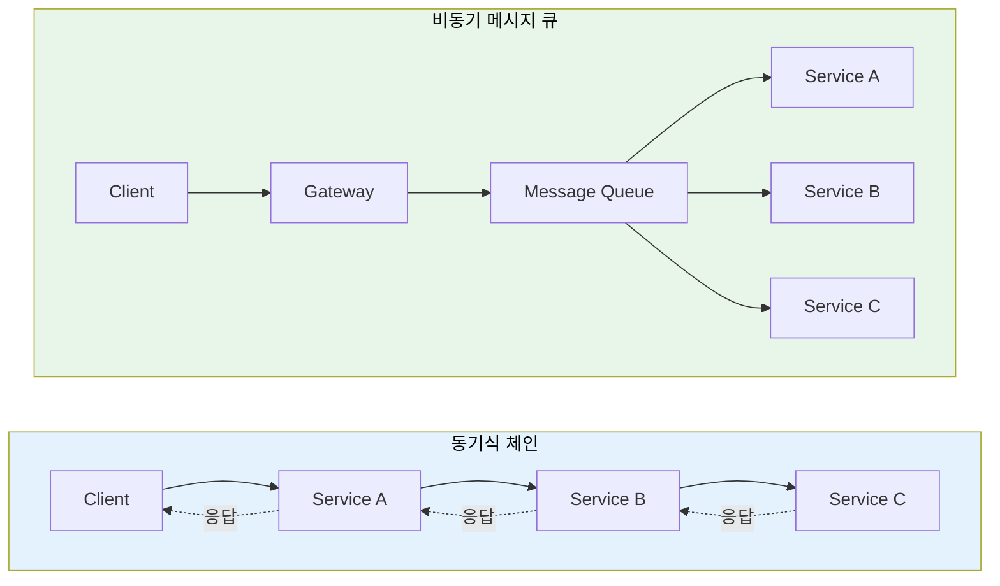
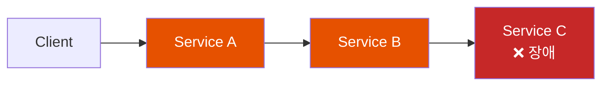
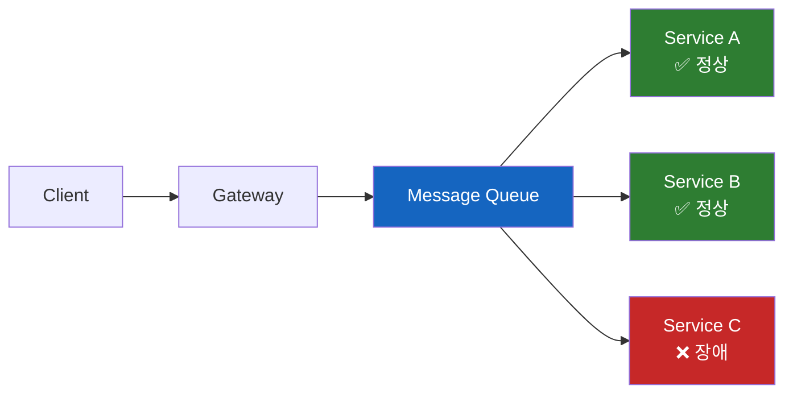
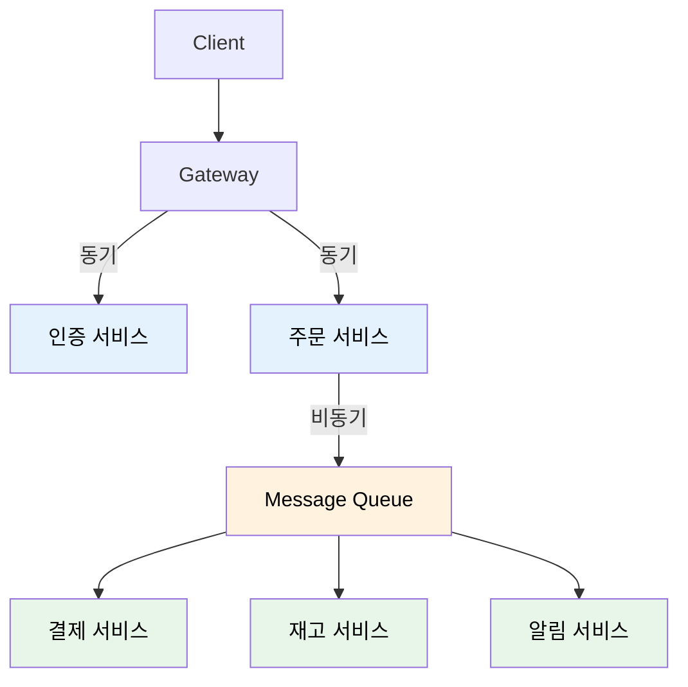
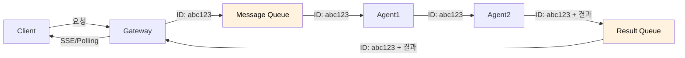

# 마이크로서비스 통신 패턴: 동기 vs 비동기

서비스 간 통신 방식의 선택이 시스템 전체의 성능과 안정성을 결정한다

## 결론부터 말하면

마이크로서비스 간 통신은 크게 **동기식 체인**과 **비동기 메시지 큐** 두 가지 패턴이 있다.

| 특징 | 동기식 체인 | 비동기 메시지 큐 |
|------|------------|-----------------|
| **통신 방식** | REST/gRPC 직접 호출 | Kafka/RabbitMQ 메시지 전달 |
| **결합도** | 높음 (서비스가 서로 알아야 함) | 낮음 (큐만 알면 됨) |
| **응답 시간** | 모든 체인의 합 | 즉시 응답 (처리는 나중에) |
| **장애 전파** | 연쇄 장애 위험 | 격리됨 |
| **복잡도** | 낮음 | 높음 (메시지 순서, 중복 처리) |



## 1. 왜 통신 패턴이 중요한가?

### 마이크로서비스의 딜레마

모놀리식에서는 함수 호출 한 번이면 끝난다:

```java
// 모놀리식: 메모리 내 함수 호출 (나노초)
Order order = orderService.createOrder(items);
Payment payment = paymentService.process(order);
Notification notification = notificationService.send(payment);
```

마이크로서비스에서는? **네트워크를 통해 다른 서비스를 호출**해야 한다. 여기서 문제가 시작된다.

- 네트워크는 **느리다** (밀리초~초)
- 네트워크는 **불안정하다** (타임아웃, 연결 끊김)
- 서비스는 **언제든 죽을 수 있다**

**어떻게 통신할 것인가?** 이 선택이 시스템의 성능, 안정성, 복잡도를 결정한다.

## 2. 동기식 체인 (Synchronous Chain)

### 동작 방식

서비스 A가 B를 호출하고, B가 C를 호출하는 **직렬 체인**:

```
Client → Gateway → Service A → Service B → Service C
                                              ↓
Client ← Gateway ← Service A ← Service B ← (응답)
```

모든 서비스가 **순차적으로 응답을 기다린다**.

### 코드 예시

```java
// Service A: Order Service
@RestController
public class OrderController {

    @Autowired
    private RestTemplate restTemplate;

    @PostMapping("/orders")
    public OrderResponse createOrder(@RequestBody OrderRequest request) {
        // 1. 주문 생성
        Order order = orderRepository.save(new Order(request));

        // 2. Service B (Payment) 동기 호출 - 응답 대기
        PaymentResponse payment = restTemplate.postForObject(
            "http://payment-service/payments",
            new PaymentRequest(order.getId(), order.getAmount()),
            PaymentResponse.class
        );

        // 3. Service C (Notification) 동기 호출 - 응답 대기
        restTemplate.postForObject(
            "http://notification-service/notify",
            new NotificationRequest(order.getUserId(), "주문 완료"),
            Void.class
        );

        return new OrderResponse(order, payment);
    }
}
```

### 응답 시간 계산

```
총 응답 시간 = A 처리 시간 + B 처리 시간 + C 처리 시간 + 네트워크 지연

예시:
- Service A: 50ms
- Service B: 100ms
- Service C: 30ms
- 네트워크 지연: 각 10ms × 4회 = 40ms
────────────────────────────────────
총 응답 시간: 220ms
```

### 장애 전파 문제

**Service C가 죽으면?**



- C가 응답 못 함 → B가 타임아웃 대기 → A가 타임아웃 대기
- **연쇄 장애 (Cascading Failure)**: 하나의 서비스 장애가 전체로 전파

### 장점

- **구현이 간단**: REST 호출만 하면 됨
- **디버깅 용이**: 요청-응답 추적이 명확
- **트랜잭션 관리**: 동기 흐름이라 롤백 처리가 직관적

### 단점

- **응답 시간 누적**: 체인이 길수록 느려짐
- **강한 결합**: 모든 서비스가 서로의 API를 알아야 함
- **장애 전파**: 하나가 죽으면 전체가 영향받음
- **확장성 제한**: 동시 처리가 어려움

## 3. 비동기 메시지 큐 (Asynchronous Message Queue)

### 동작 방식

서비스들이 **메시지 큐를 통해 간접적으로 통신**:

```
Client → Gateway → "주문 생성됨" 메시지 발행 → 즉시 응답
                          ↓
                    Message Queue
                    ↓     ↓     ↓
              Service A  B  C (각자 소비)
```

Gateway는 메시지를 발행하고 **바로 응답**. 실제 처리는 백그라운드에서 진행.

### 코드 예시

```java
// Gateway: 주문 요청 받고 메시지 발행
@RestController
public class OrderGatewayController {

    @Autowired
    private KafkaTemplate<String, OrderEvent> kafkaTemplate;

    @PostMapping("/orders")
    public OrderResponse createOrder(@RequestBody OrderRequest request) {
        // 1. 주문 ID 생성
        String orderId = UUID.randomUUID().toString();

        // 2. 메시지 발행 (비동기)
        kafkaTemplate.send("order-events", new OrderCreatedEvent(orderId, request));

        // 3. 즉시 응답 (처리 완료 전에!)
        return new OrderResponse(orderId, "PROCESSING");
    }
}

// Service A: Order Service (Consumer)
@KafkaListener(topics = "order-events")
public void handleOrderCreated(OrderCreatedEvent event) {
    // 주문 저장
    Order order = orderRepository.save(new Order(event));

    // 다음 이벤트 발행
    kafkaTemplate.send("payment-events", new PaymentRequestedEvent(order));
}

// Service B: Payment Service (Consumer)
@KafkaListener(topics = "payment-events")
public void handlePaymentRequested(PaymentRequestedEvent event) {
    // 결제 처리
    Payment payment = paymentService.process(event);

    // 다음 이벤트 발행
    kafkaTemplate.send("notification-events", new PaymentCompletedEvent(payment));
}

// Service C: Notification Service (Consumer)
@KafkaListener(topics = "notification-events")
public void handlePaymentCompleted(PaymentCompletedEvent event) {
    // 알림 발송
    notificationService.send(event.getUserId(), "결제 완료");
}
```

### 응답 시간

```
Gateway 응답 시간 = 메시지 발행 시간 ≈ 5~10ms

실제 처리 시간:
- Service A: 50ms (백그라운드)
- Service B: 100ms (백그라운드)
- Service C: 30ms (백그라운드)
────────────────────────────────────
클라이언트 체감 응답: ~10ms (나머지는 비동기 처리)
```

### 장애 격리

**Service C가 죽으면?**



- C가 죽어도 **메시지는 큐에 보관**
- C가 복구되면 **밀린 메시지 처리** 재개
- A, B는 **아무 영향 없음**

### 장점

- **빠른 응답**: 클라이언트는 즉시 응답 받음
- **느슨한 결합**: 서비스가 서로 모름 (큐만 알면 됨)
- **장애 격리**: 한 서비스 장애가 다른 서비스에 전파 안 됨
- **확장성**: 컨슈머를 늘리면 처리량 증가
- **부하 평준화**: 급격한 트래픽을 큐가 버퍼링

### 단점

- **복잡도 증가**: 메시지 순서, 중복, 유실 처리 필요
- **최종 일관성**: 즉각적인 일관성 보장 어려움
- **디버깅 어려움**: 비동기 흐름 추적이 복잡
- **인프라 비용**: Kafka, RabbitMQ 등 추가 인프라 필요

## 4. 실전 비교: 주문 시스템

### 시나리오

```
주문 생성 → 재고 확인 → 결제 처리 → 배송 요청 → 알림 발송
```

### 동기식 구현

```java
@Transactional
public OrderResult createOrder(OrderRequest request) {
    // 1. 재고 확인 (동기)
    InventoryResponse inventory = inventoryClient.check(request.getItems());
    if (!inventory.isAvailable()) {
        throw new OutOfStockException();
    }

    // 2. 결제 처리 (동기)
    PaymentResponse payment = paymentClient.process(request.getPayment());
    if (!payment.isSuccess()) {
        throw new PaymentFailedException();
    }

    // 3. 배송 요청 (동기)
    ShippingResponse shipping = shippingClient.request(request.getAddress());

    // 4. 알림 발송 (동기)
    notificationClient.send(request.getUserId(), "주문 완료");

    return new OrderResult(inventory, payment, shipping);
}
```

**문제점:**
- 총 응답 시간: 500ms+ (모든 서비스 합산)
- 하나라도 실패하면 전체 실패
- 알림 서비스가 느리면 주문 응답도 느려짐

### 비동기 구현 (이벤트 기반)

```java
// 1. 주문 생성 (즉시 응답)
public OrderResult createOrder(OrderRequest request) {
    Order order = orderRepository.save(new Order(request));
    eventPublisher.publish(new OrderCreatedEvent(order));
    return new OrderResult(order.getId(), "PROCESSING");
}

// 2. 각 서비스가 이벤트 구독
@EventListener
public void onOrderCreated(OrderCreatedEvent event) {
    // 재고 확인 후 이벤트 발행
    inventoryService.reserve(event.getItems());
    eventPublisher.publish(new InventoryReservedEvent(event.getOrderId()));
}

@EventListener
public void onInventoryReserved(InventoryReservedEvent event) {
    // 결제 처리 후 이벤트 발행
    paymentService.process(event.getOrderId());
    eventPublisher.publish(new PaymentCompletedEvent(event.getOrderId()));
}

// ... 계속
```

**장점:**
- 즉시 응답: ~10ms
- 알림이 느려도 주문 응답에 영향 없음
- 서비스 장애 시 재시도 가능

## 5. 하이브리드 패턴

실무에서는 **두 방식을 혼합**해서 사용한다:



| 처리 유형 | 통신 방식 | 이유 |
|----------|----------|------|
| **인증/인가** | 동기 | 즉각적인 결과 필요 |
| **핵심 비즈니스** | 동기 | 트랜잭션 일관성 |
| **결제** | 동기/비동기 | 상황에 따라 |
| **알림/로깅** | 비동기 | 실패해도 비즈니스 영향 없음 |
| **분석/통계** | 비동기 | 실시간성 불필요 |

## 6. 비동기에서 응답은 어떻게 받나?

비동기 처리의 핵심 의문: **클라이언트가 HTTP 커넥션을 닫았는데, 처리 결과는 어떻게 받지?**

4가지 패턴이 있다.

### 패턴 1: 폴링 (Polling)

클라이언트가 주기적으로 "결과 나왔어?" 확인하는 방식.

```
1. Client → Gateway: "처리해줘"
   Gateway → Client: "OK, 작업 ID: abc123" (즉시 응답)

2. (백그라운드에서 처리 중...)

3. Client → Gateway: "abc123 결과 나왔어?"
   Gateway → Client: "아직..."

4. Client → Gateway: "abc123 결과 나왔어?"
   Gateway → Client: "완료! 결과는 {...}"
```

```python
# 요청
response = httpx.post("/process", json=data)
job_id = response.json()["job_id"]

# 폴링
while True:
    result = httpx.get(f"/jobs/{job_id}")
    if result.json()["status"] == "completed":
        return result.json()["data"]
    time.sleep(1)
```

**장점:** 구현 단순, 방화벽 친화적
**단점:** 불필요한 요청 발생, 실시간성 부족

### 패턴 2: SSE (Server-Sent Events)

서버가 클라이언트에게 **단방향으로 푸시**하는 방식. HTTP 커넥션 유지.

```
1. Client → Gateway: "처리해줘" (커넥션 유지!)

2. Gateway → Client: "진행중... 30%"
   Gateway → Client: "진행중... 60%"

3. Gateway → Client: "완료! 결과는 {...}"
```

```python
# 스트리밍 수신
with httpx.stream("POST", "/process", json=data) as response:
    for line in response.iter_lines():
        event = json.loads(line)
        if event["status"] == "completed":
            return event["result"]
```

**ChatGPT, Claude API가 이 방식!** LLM 토큰 스트리밍에 적합.

### 패턴 3: WebSocket

**양방향 실시간 통신**. 클라이언트와 서버가 자유롭게 메시지 교환.

```
1. Client ◀──WebSocket 연결──▶ Gateway (양방향)

2. Client → Gateway: "처리해줘"

3. (백그라운드에서 처리...)

4. Gateway → Client: "완료!" (서버가 먼저 푸시)
```

**실시간 채팅, 게임, 협업 도구**에 적합.

### 패턴 4: Webhook (Callback URL)

클라이언트가 "끝나면 이 URL로 알려줘"라고 콜백 주소를 전달.

```
1. Client → Gateway: "처리해줘, 끝나면 https://my-server/callback 으로"
   Gateway → Client: "OK" (즉시 응답)

2. (백그라운드에서 처리...)

3. Reporter → https://my-server/callback: "완료! 결과는 {...}"
```

```python
# 요청 시
httpx.post("/process", json={
    "data": {...},
    "callback_url": "https://my-server/webhook/result"
})

# 내 서버에서 결과 수신
@app.post("/webhook/result")
def receive_result(result: dict):
    save_to_db(result)
```

**결제 시스템 (PG사 연동), 외부 API 연동**에서 많이 사용.

### 비동기 응답 패턴 비교

| 패턴 | 실시간성 | 구현 복잡도 | 사용 사례 |
|------|---------|------------|----------|
| **폴링** | 낮음 | 낮음 | 파일 업로드 처리, 배치 작업 |
| **SSE** | 높음 | 중간 | LLM 스트리밍, 알림 |
| **WebSocket** | 매우 높음 | 높음 | 채팅, 게임, 협업 |
| **Webhook** | 이벤트 기반 | 중간 | 결제, 외부 연동 |

### 내부 구조: Correlation ID 패턴

비동기 체인에서 "누구의 요청인지" 추적하는 방법:



1. Gateway가 **Correlation ID** 발급 (예: `abc123`)
2. 이 ID가 모든 서비스를 거쳐 전달됨
3. 최종 서비스가 결과 + ID를 함께 반환
4. Gateway가 ID로 대기 중인 클라이언트 매칭

## 7. 선택 기준

### 동기식이 적합한 경우

- **즉각적인 응답**이 필요할 때 (인증, 재고 확인)
- **트랜잭션 일관성**이 중요할 때
- **서비스 체인이 짧을 때** (2~3개)
- 실패 시 **즉각적인 롤백**이 필요할 때

### 비동기가 적합한 경우

- **긴 처리 시간**이 예상될 때
- **실패해도 재시도**가 가능할 때
- **느슨한 결합**이 필요할 때
- **트래픽 급증**을 흡수해야 할 때
- **부가 기능** (알림, 로깅, 분석)

## 정리

| 기준 | 동기식 체인 | 비동기 메시지 큐 |
|------|------------|-----------------|
| **응답 시간** | 체인 합산 (느림) | 즉시 (빠름) |
| **결합도** | 강함 | 약함 |
| **장애 전파** | 연쇄 장애 | 격리됨 |
| **일관성** | 강한 일관성 | 최종 일관성 |
| **구현 난이도** | 낮음 | 높음 |
| **인프라** | 없음 | Kafka/RabbitMQ |
| **디버깅** | 쉬움 | 어려움 |
| **확장성** | 제한적 | 우수 |

**실무 권장:**
- **핵심 흐름**: 동기 + Circuit Breaker
- **부가 기능**: 비동기 메시지 큐
- **대용량 처리**: 비동기 (Kafka)

---

## 출처

- [Microservices Patterns - Chris Richardson](https://microservices.io/patterns/)
- [Building Microservices - Sam Newman](https://samnewman.io/books/building_microservices_2nd_edition/)
- [Kafka 공식 문서](https://kafka.apache.org/documentation/)
