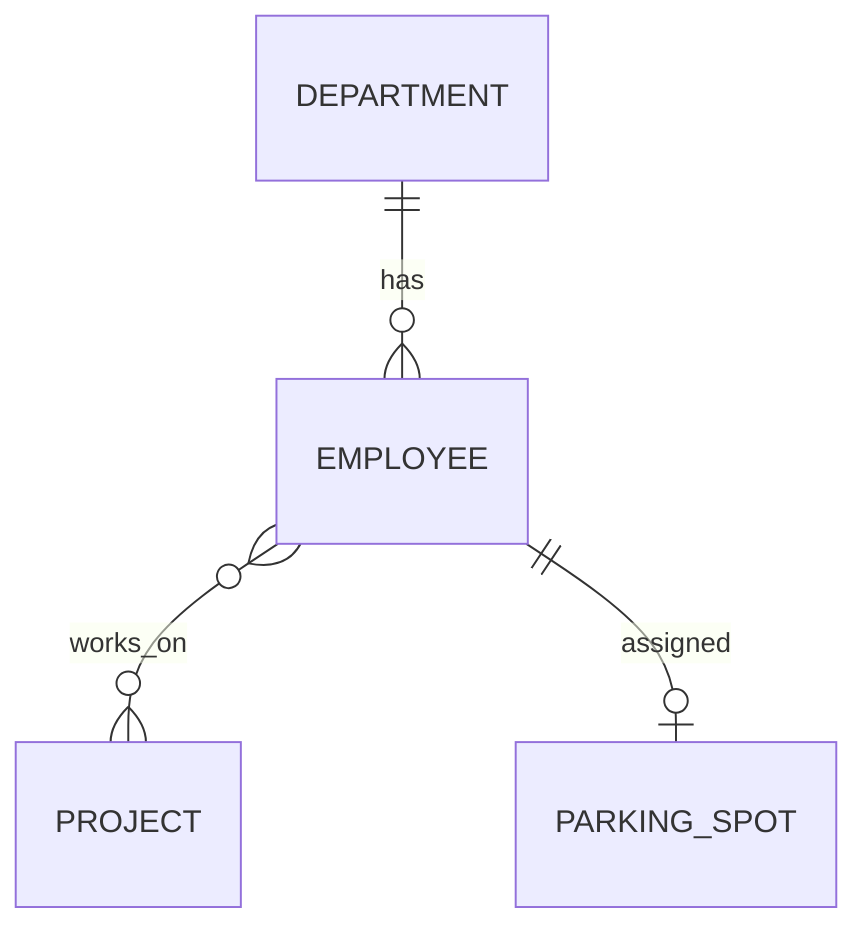
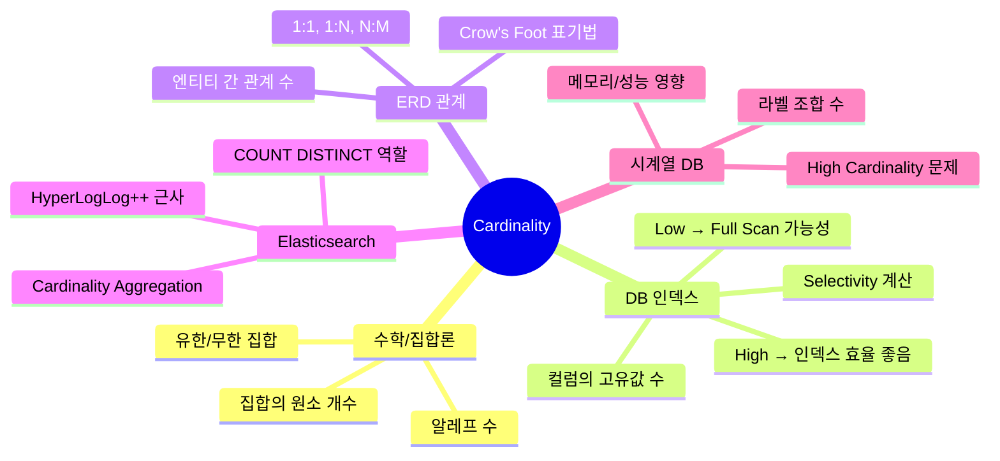

# Cardinality - 컴퓨터 과학에서의 의미와 활용

데이터베이스 책을 읽다 보면, Elasticsearch 문서를 보다 보면, Prometheus 설정을 하다 보면 계속 나오는 단어가 있다. **Cardinality**. 도대체 이게 뭘까?

## 결론부터 말하면

**Cardinality**는 원래 수학에서 "집합의 원소 개수"를 뜻하는 용어다. 컴퓨터 과학에서는 맥락에 따라 조금씩 다른 의미로 쓰이지만, 핵심은 하나다: "**고유한 값이 몇 개인가?**"

| 맥락 | Cardinality 의미 | 높으면 | 낮으면 |
|------|-----------------|-------|-------|
| DB 인덱스 | 컬럼의 고유값 개수 | 인덱스 효율 좋음 | 인덱스 효과 낮음 |
| ERD 관계 | 엔티티 간 관계 수 | N:M (다대다) | 1:1 (일대일) |
| Elasticsearch | 고유값 개수 집계 | 메모리 많이 사용 | 빠른 집계 |
| Prometheus | 시계열 조합 수 | 성능 문제 발생 | 안정적 운영 |

---

## 1. 수학에서의 Cardinality: 모든 것의 시작

### 1.1 집합의 크기를 재는 방법

Cardinality는 19세기 수학자 Georg Cantor가 집합론을 정립하면서 도입한 개념이다. 가장 단순하게 말하면 **집합에 포함된 원소의 개수**다.

```
A = {1, 2, 3, 4, 5}
|A| = 5  (Cardinality는 5)

B = {사과, 바나나, 오렌지}
|B| = 3
```

표기법은 `|A|`, `n(A)`, `card(A)`, `#A` 등 여러 가지가 있지만, 가장 흔한 건 절댓값처럼 생긴 `|A|`다.

### 1.2 무한 집합의 Cardinality

Cantor의 천재성은 **무한도 크기가 다를 수 있다**는 것을 증명한 데 있다.

| 집합 | Cardinality | 설명 |
|------|-------------|------|
| 자연수 ℕ | ℵ₀ (알레프 널) | 가장 작은 무한 |
| 정수 ℤ | ℵ₀ | 자연수와 일대일 대응 가능 |
| 유리수 ℚ | ℵ₀ | 놀랍게도 자연수와 같은 크기 |
| 실수 ℝ | 𝔠 (연속체) | 자연수보다 "더 큰" 무한 |

왜 이게 중요할까? 이 추상적인 개념이 현대 컴퓨터 과학, 특히 계산 이론과 알고리즘 복잡도의 기초가 되기 때문이다.

---

## 2. 데이터베이스 인덱스에서의 Cardinality

### 2.1 왜 인덱스 설계에서 Cardinality가 중요한가?

데이터베이스에서 Cardinality는 **컬럼에 존재하는 고유한 값의 개수**를 의미한다. 이게 왜 중요할까?

인덱스의 목적을 생각해보자. 100만 건의 데이터에서 특정 행을 빨리 찾으려면 인덱스가 필요하다. 그런데 인덱스가 효과적이려면, 그 인덱스가 데이터를 **잘 좁혀줘야** 한다.

```sql
-- 100만 건 중에서 검색
SELECT * FROM users WHERE email = 'john@example.com';   -- 1건 반환
SELECT * FROM users WHERE gender = 'M';                 -- 50만 건 반환
```

첫 번째 쿼리는 인덱스를 타면 바로 1건을 찾는다. 두 번째는? 인덱스를 타나 마나 50만 건을 스캔해야 한다. 오히려 Full Table Scan이 나을 수도 있다.

### 2.2 High Cardinality vs Low Cardinality

| 구분 | 특징 | 예시 | 인덱스 효과 |
|------|------|------|------------|
| **High Cardinality** | 고유값이 많음 | 이메일, UUID, 주민번호 | 매우 좋음 |
| **Low Cardinality** | 고유값이 적음 | 성별(M/F), 상태(Y/N), 요일 | 거의 없음 |

```sql
-- MySQL에서 인덱스 Cardinality 확인
SHOW INDEX FROM users;

-- 결과 예시
+-------+------------+----------+--------------+-------------+
| Table | Index_name | Seq_in_index | Column_name | Cardinality |
+-------+------------+----------+--------------+-------------+
| users | PRIMARY    | 1            | id          | 1000000     |  -- High
| users | idx_email  | 1            | email       | 998234      |  -- High
| users | idx_gender | 1            | gender      | 2           |  -- Low
+-------+------------+----------+--------------+-------------+
```

### 2.3 Selectivity: Cardinality의 실전 활용

**Selectivity**(선택도)는 Cardinality를 실제 쿼리 최적화에 활용하는 지표다.

$$
\text{Selectivity} = \frac{\text{Cardinality (고유값 수)}}{\text{전체 행 수}}
$$

| Selectivity | 의미 | 인덱스 효과 |
|-------------|------|------------|
| 1.0 (100%) | 모든 값이 고유 (Primary Key) | 최고 |
| 0.5 (50%) | 절반이 고유 | 보통 |
| 0.001 (0.1%) | 거의 중복 | 거의 없음 |

데이터베이스 옵티마이저는 이 Selectivity를 보고 인덱스를 탈지 말지 결정한다.

### 2.4 Low Cardinality도 유용한 경우

"Low Cardinality면 인덱스 쓸모없다"는 건 반만 맞는 말이다.

```sql
-- 3억 건 중 enabled: 2.99억, disabled: 100만
-- disabled를 찾을 때는 인덱스가 매우 유용!
SELECT * FROM users WHERE status = 'disabled';
```

**데이터 분포가 불균형**할 때, 희귀한 값을 찾는 쿼리에는 Low Cardinality 인덱스도 효과적이다.

왜 그럴까? 데이터베이스 옵티마이저는 단순히 Cardinality만 보는 게 아니라, **컬럼 통계 정보**(히스토그램 등)를 함께 분석한다. `status = 'disabled'`가 전체의 0.3%만 차지한다는 걸 알면, 옵티마이저는 인덱스를 타는 게 효율적이라고 판단한다. 반대로 `status = 'enabled'`는 99.7%니까 Full Scan을 선택한다.

### 2.5 복합 인덱스로 Cardinality 높이기

Low Cardinality 컬럼도 여러 개를 조합하면 High Cardinality가 된다.

```sql
-- 각각은 Low Cardinality
-- gender: 2개, status: 3개, country: 50개

-- 복합 인덱스: 최대 2 × 3 × 50 = 300개의 조합 가능
CREATE INDEX idx_composite ON users(gender, status, country);
```

실제 Cardinality는 데이터에 존재하는 고유 조합 수에 따라 결정되지만, 이론적으로 최대 300개까지 가능하므로 개별 컬럼보다 훨씬 높은 Cardinality를 확보할 수 있다.

---

## 3. ERD에서의 Cardinality: 관계의 수

### 3.1 엔티티 간 관계를 숫자로 표현

ERD(Entity-Relationship Diagram)에서 Cardinality는 **두 엔티티 사이의 관계 수**를 나타낸다.



위 다이어그램에서:
- **부서-직원**: 1:N 관계 (한 부서에 여러 직원)
- **직원-프로젝트**: N:M 관계 (직원은 여러 프로젝트에, 프로젝트는 여러 직원이)
- **직원-주차공간**: 1:1 관계 (한 직원에 하나의 주차공간)

### 3.2 Cardinality 유형

| 관계 | 표기 | 의미 | 예시 |
|------|------|------|------|
| **1:1** | One-to-One | 하나가 하나에 대응 | 직원 - 주차공간 |
| **1:N** | One-to-Many | 하나가 여러 개에 대응 | 부서 - 직원 |
| **N:M** | Many-to-Many | 여러 개가 여러 개에 대응 | 학생 - 강의 |

### 3.3 표기법: Crow's Foot Notation

가장 널리 쓰이는 ERD 표기법:

| 기호 | 의미 |
|------|------|
| `──┤├──` | 정확히 1개 (One and only one) |
| `──○├──` | 0개 또는 1개 (Zero or one) |
| `──<├──` | 1개 이상 (One or many) |
| `──○<──` | 0개 이상 (Zero or many) |

Java 개발자라면 JPA의 `@OneToMany`, `@ManyToOne`, `@ManyToMany`가 바로 이 Cardinality를 코드로 표현한 것이다.

```java
@Entity
public class Department {
    @OneToMany(mappedBy = "department")  // 1:N 관계
    private List<Employee> employees;
}
```

---

## 4. Elasticsearch에서의 Cardinality Aggregation

### 4.1 SQL의 COUNT(DISTINCT)와 같은 역할

Elasticsearch에서 **Cardinality Aggregation**은 특정 필드의 고유값 개수를 세는 집계다.

```json
// SQL: SELECT COUNT(DISTINCT user_id) FROM logs;
// Elasticsearch:
POST /logs/_search?size=0
{
  "aggs": {
    "unique_users": {
      "cardinality": {
        "field": "user_id"
      }
    }
  }
}
```

### 4.2 HyperLogLog++ 알고리즘

Elasticsearch의 Cardinality Aggregation은 **정확한 값이 아니라 근사값**을 반환한다. 왜 그럴까?

수억 개의 고유값을 정확히 세려면 모든 값을 메모리에 저장해야 한다. 대신 **HyperLogLog++** 알고리즘을 사용해서 메모리 사용량을 극적으로 줄인다.

```json
{
  "aggs": {
    "unique_users": {
      "cardinality": {
        "field": "user_id",
        "precision_threshold": 10000  // 정밀도 조절 (기본값: 3000, 최대: 40000)
      }
    }
  }
}
```

| precision_threshold | 메모리 사용 | 정확도 |
|--------------------|-------------|--------|
| 100 | 낮음 | 낮음 |
| 3000 (기본값) | 중간 | 보통 |
| 10000 | 높음 | 높음 |
| 40000 | 매우 높음 | 매우 높음 |

### 4.3 Value Count vs Cardinality

| Aggregation | 역할 | SQL 동치 |
|-------------|------|----------|
| Value Count | 전체 값 개수 (중복 포함) | `COUNT(column)` |
| Cardinality | 고유 값 개수 | `COUNT(DISTINCT column)` |

---

## 5. Prometheus/모니터링에서의 High Cardinality 문제

### 5.1 시계열 데이터베이스의 악몽

Prometheus, InfluxDB 같은 시계열 DB에서 **High Cardinality는 심각한 성능 문제**를 일으킨다.

```
# Prometheus 메트릭 예시
http_requests_total{method="GET", path="/api/users", status="200", instance="server-1"}
http_requests_total{method="POST", path="/api/orders", status="201", instance="server-2"}
```

각 라벨 조합이 하나의 **시계열**(time series)이 된다. 문제는 라벨 값이 많아지면 조합이 **폭발**한다는 것.

### 5.2 Cardinality 폭발의 수학

```
method: 5가지 (GET, POST, PUT, DELETE, PATCH)
path: 100가지 (API 엔드포인트)
status: 10가지 (200, 201, 400, 401, 403, 404, 500...)
instance: 1000개 (서버 수)

총 시계열 수 = 5 × 100 × 10 × 1000 = 5,000,000개
```

**500만 개의 시계열**이 하나의 메트릭에서 생성된다. 여기에 `user_id` 같은 라벨을 추가하면?

```
user_id: 100만명

총 시계열 수 = 5 × 100 × 10 × 1000 × 1,000,000 = 5조 개 💥
```

### 5.3 High Cardinality가 일으키는 문제

| 문제 | 영향 |
|------|------|
| 메모리 폭발 | 인덱스가 RAM을 다 먹음 |
| 쿼리 지연 | 대시보드 로딩 수십 초 |
| 스토리지 비용 | 저장 비용 기하급수적 증가 |
| TSDB 크래시 | Prometheus가 OOM으로 죽음 |

### 5.4 해결 방법

**1. 고위험 라벨 피하기**

```yaml
# ❌ Bad: user_id는 High Cardinality
http_requests_total{user_id="12345"}

# ✅ Good: 라벨 대신 로그나 트레이싱 사용
http_requests_total{endpoint="/api/users"}
```

**2. Recording Rules로 집계**

```yaml
# prometheus.yml
groups:
  - name: aggregations
    rules:
      - record: http_requests:rate5m
        expr: sum(rate(http_requests_total[5m])) by (method, status)
        # instance, path 라벨을 제거하여 Cardinality 감소
```

**3. Relabeling으로 라벨 제거**

```yaml
scrape_configs:
  - job_name: 'app'
    metric_relabel_configs:
      - source_labels: [user_id]
        action: drop  # user_id 라벨 삭제
```

### 5.5 Cardinality 모니터링 권장 사항

| 지표 | 권장 값 |
|------|--------|
| 단일 메트릭의 시계열 수 | < 1000 |
| 전체 시계열 수 | 모니터링 대상 수 × 100 이하 |
| 라벨당 고유값 | < 100 |

---

## 6. 정리: 맥락별 Cardinality 한눈에 보기



| 맥락 | 핵심 질문 | 실무 적용 |
|------|----------|----------|
| DB 인덱스 | "이 컬럼에 인덱스 걸어야 하나?" | High Cardinality면 인덱스 효과적 |
| ERD | "두 테이블 관계가 뭐지?" | 1:N인지 N:M인지 파악 |
| Elasticsearch | "고유 사용자 몇 명?" | Cardinality Aggregation 사용 |
| Prometheus | "왜 메모리가 폭발하지?" | 라벨 Cardinality 점검 |

---

## 출처

- [Wikipedia - Cardinality](https://en.wikipedia.org/wiki/Cardinality)
- [MySQL Tutorial - Index Cardinality](https://www.mysqltutorial.org/mysql-index/mysql-index-cardinality/)
- [Couchbase - Understanding Cardinality and Selectivity](https://developer.couchbase.com/tutorial-understanding-cardinality-and-selectivity/)
- [Elasticsearch - Cardinality Aggregation](https://www.elastic.co/guide/en/elasticsearch/reference/current/search-aggregations-metrics-cardinality-aggregation.html)
- [Grafana - How to manage high cardinality metrics in Prometheus](https://grafana.com/blog/2022/10/20/how-to-manage-high-cardinality-metrics-in-prometheus-and-kubernetes/)
- [Last9 - What is High Cardinality](https://last9.io/guides/high-cardinality/what-is-high-cardinality/)
- [GeeksforGeeks - Mapping Cardinalities in ER Diagrams](https://www.geeksforgeeks.org/dbms/what-is-mapping-cardinalities-er-diagrams/)
- [Lucidchart - ERD Symbols and Notation](https://www.lucidchart.com/pages/ER-diagram-symbols-and-meaning)
