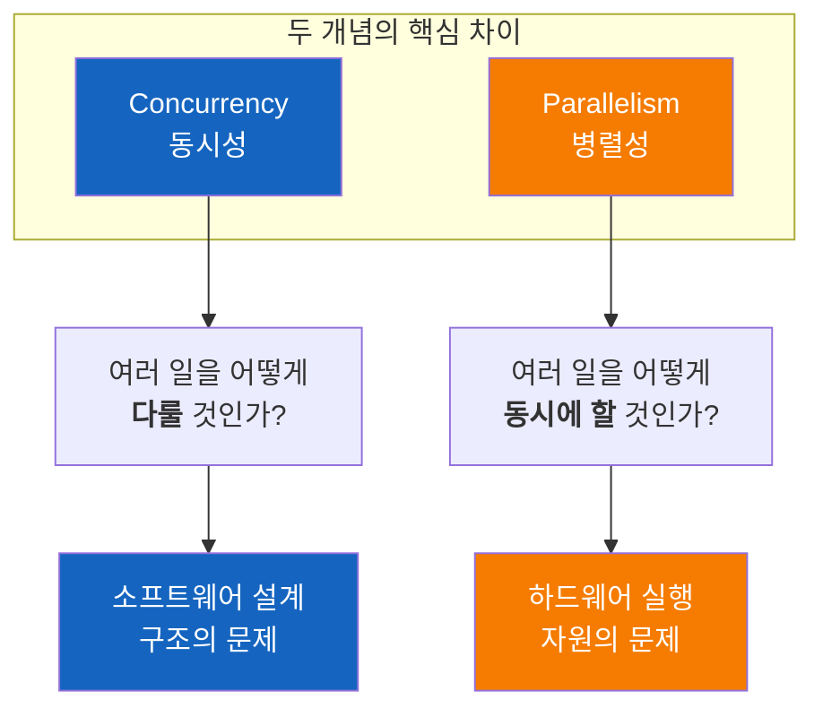
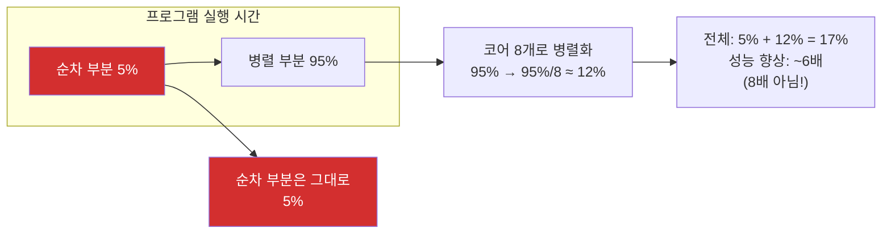
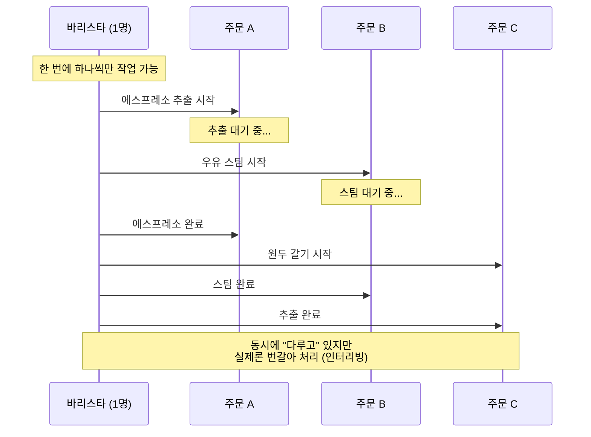
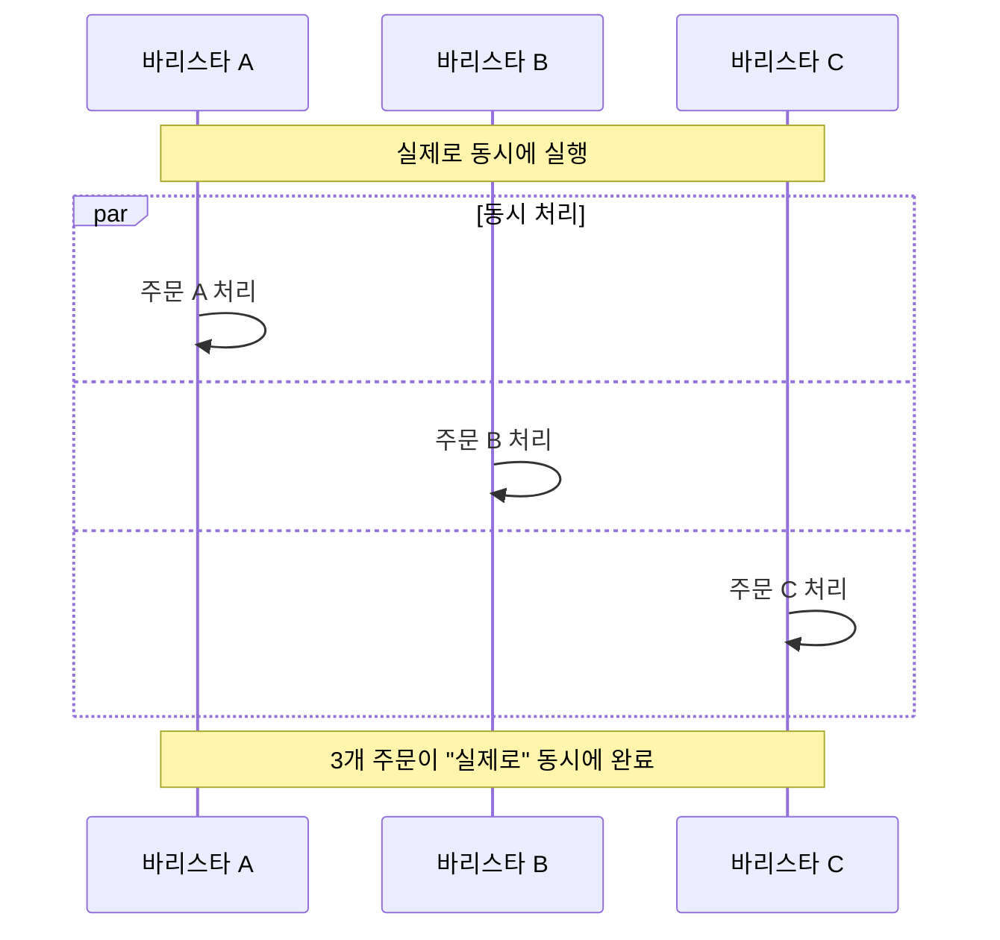
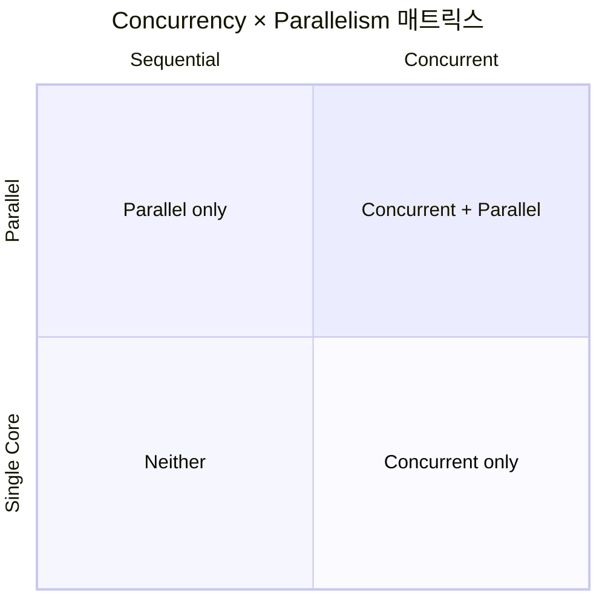
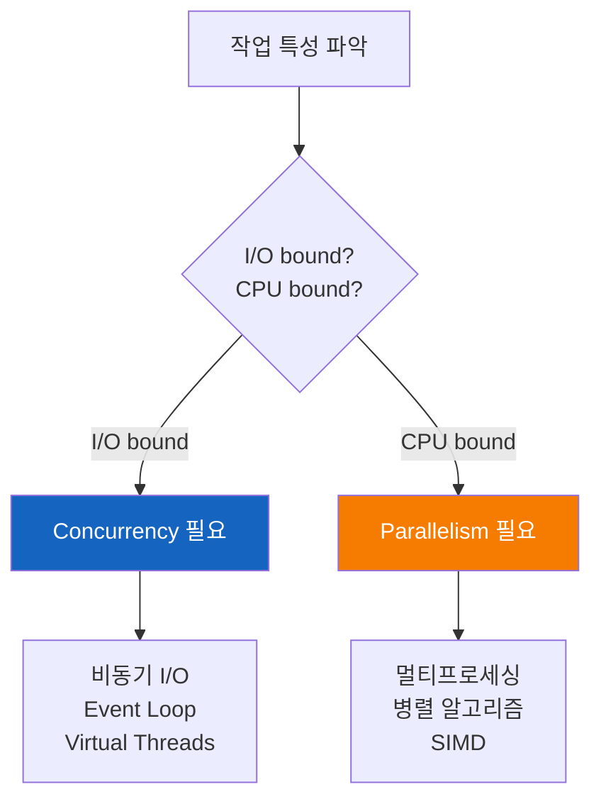
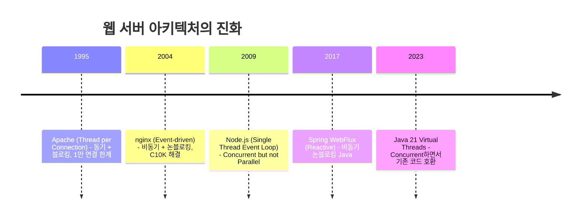
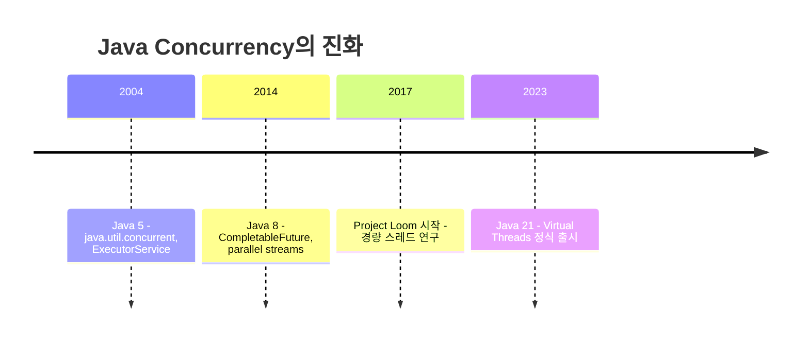
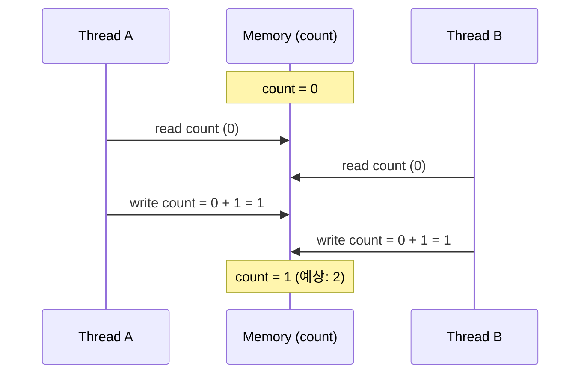
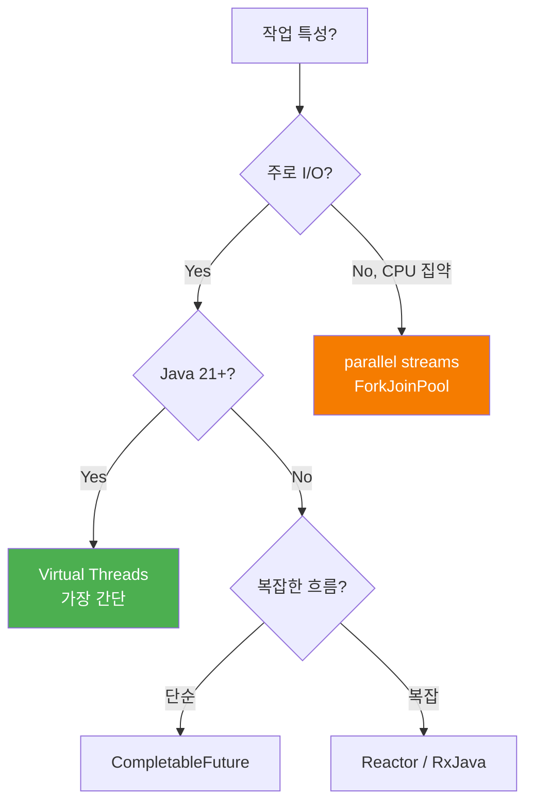

# Concurrency와 Parallelism - 동시성과 병렬성

"동시성"과 "병렬성"은 같은 말일까? 왜 이 두 개념을 구분해야 할까?

## 결론부터 말하면

**Concurrency**(동시성)와 **Parallelism**(병렬성)은 다른 개념이다. 하지만 자주 함께 나타나서 혼동된다.



| 구분 | Concurrency (동시성) | Parallelism (병렬성) |
|------|---------------------|---------------------|
| **핵심** | 여러 작업을 **다루는 구조** | 여러 작업을 **동시에 실행** |
| **관점** | 소프트웨어 설계 | 하드웨어 실행 |
| **필요조건** | 단일 CPU도 가능 | 멀티 CPU/코어 필수 |
| **비유** | 바리스타 1명이 여러 주문을 번갈아 처리 | 바리스타 여러 명이 각자 동시에 처리 |

**핵심 통찰**: Concurrent하게 설계하면, Parallel하게 실행**할 수 있다**. 하지만 Parallel 실행은 하드웨어가 뒷받침해야만 가능하다.

---

## 1. 왜 이 개념이 중요해졌을까?

### 1.1 공짜 점심의 끝 (The Free Lunch Is Over)

2005년까지 개발자들은 "공짜 점심"을 즐겼다. 코드를 그대로 두어도 새 CPU가 나오면 프로그램이 빨라졌다. 클럭 속도가 매년 증가했기 때문이다.

```
CPU 클럭 속도의 변화
━━━━━━━━━━━━━━━━━━━━━━━━━━━━━━━━
1995년:   100 MHz
2000년:   1 GHz      (10배 증가)
2005년:   3.8 GHz    (3.8배 증가)
2024년:   5~6 GHz    (1.5배... 거의 정체)
━━━━━━━━━━━━━━━━━━━━━━━━━━━━━━━━
```

왜 멈췄을까? 물리적 한계에 부딪혔기 때문이다.

| 한계 | 설명 |
|------|------|
| **발열** | 클럭이 올라가면 전력 소모와 발열이 기하급수적으로 증가 |
| **전자의 속도** | 빛의 속도에 근접하면서 신호 전달 한계 |
| **양자 효과** | 트랜지스터가 작아지면서 전자가 "터널링"으로 새어나감 |

CPU 제조사들의 해결책은 간단했다. **"더 빠르게"가 안 되면 "더 많이"로 가자.**


하지만 여기서 문제가 생겼다. 코어가 8개라고 프로그램이 8배 빨라지진 않는다. **Concurrency를 활용하도록 설계해야만** 멀티코어의 혜택을 받을 수 있다.

### 1.2 암달의 법칙 (Amdahl's Law)

왜 코어 수만큼 빨라지지 않을까? **암달의 법칙**이 그 이유를 수학적으로 설명한다.

$$
S = \frac{1}{(1 - P) + \frac{P}{N}}
$$

| 변수 | 의미 |
|------|------|
| $S$ | 전체 성능 향상 배수 |
| $P$ | 병렬화 가능한 부분의 비율 |
| $N$ | 프로세서(코어) 수 |

핵심은 "**병렬화할 수 없는 순차적 부분**"이 전체 성능의 한계를 결정한다는 것이다.

| 순차 부분 비율 | 병렬 부분 | 코어 수 | 최대 성능 향상 |
|---------------|----------|--------|---------------|
| 5% | 95% | ∞ (무한대) | **20배** (한계) |
| 10% | 90% | ∞ | **10배** |
| 25% | 75% | ∞ | **4배** |
| 50% | 50% | ∞ | **2배** |



**실무적 의미**: 아무리 코어를 늘려도, 프로그램의 순차적인 부분(초기화, 동기화, I/O 대기 등)이 병목이 된다. 병렬 프로그래밍에서 **순차 부분을 최소화하는 것**이 핵심이다.

### 1.3 I/O의 속도 차이

CPU가 기다리는 시간이 얼마나 긴지 실감해보자.

| 작업 | 소요 시간 | CPU 사이클 기준 | 비유 (1초=1사이클) |
|------|-----------|-----------------|-------------------|
| CPU 레지스터 | 1 ns | 1 cycle | 1초 |
| L1 캐시 | 1 ns | 3 cycles | 3초 |
| RAM | 100 ns | 300 cycles | 5분 |
| SSD | 100 μs | 300,000 cycles | 3.5일 |
| 네트워크 | 1-100 ms | 3,000,000+ cycles | 35일~3년 |

**100ms 네트워크 요청 동안 CPU는 3억 사이클을 낭비한다.** 이 시간에 다른 일을 할 수 있다면?

```java
// ❌ 순차 처리: 총 3초 (CPU는 대부분 놀고 있음)
String data1 = fetchFromAPI("service1");  // 1초 대기
String data2 = fetchFromAPI("service2");  // 1초 대기
String data3 = fetchFromAPI("service3");  // 1초 대기

// ✅ Concurrent 처리: 총 ~1초 (대기 시간 중첩)
CompletableFuture<String> f1 = CompletableFuture.supplyAsync(() -> fetchFromAPI("service1"));
CompletableFuture<String> f2 = CompletableFuture.supplyAsync(() -> fetchFromAPI("service2"));
CompletableFuture<String> f3 = CompletableFuture.supplyAsync(() -> fetchFromAPI("service3"));
CompletableFuture.allOf(f1, f2, f3).join();  // 동시에 대기, 가장 느린 것만큼만 걸림
```

---

## 2. Concurrency vs Parallelism - 정확히 무엇이 다른가?

### 2.1 Rob Pike의 정의

Go 언어의 창시자 Rob Pike는 이렇게 정의했다:

> **"Concurrency is about dealing with lots of things at once.**
> **Parallelism is about doing lots of things at once."**
>
> 동시성은 여러 일을 **한꺼번에 다루는 것**이고,
> 병렬성은 여러 일을 **한꺼번에 하는 것**이다.

"Dealing"과 "Doing"의 차이가 핵심이다.

### 2.2 커피숍 비유

**Concurrency: 바리스타 1명이 3개 주문을 번갈아 처리**



**Parallelism: 바리스타 3명이 각자 동시에 처리**



### 2.3 시간 흐름으로 보기

```
Concurrency (1 CPU):
시간 →  ─────────────────────────────────────────►
Task A: ███░░░███░░░███░░░
Task B: ░░░███░░░███░░░███
        번갈아가며 실행 (시분할)

Parallelism (2+ CPU):
시간 →  ─────────────────────────────────────────►
CPU 1:  ████████████████████  (Task A)
CPU 2:  ████████████████████  (Task B)
        실제로 동시에 실행
```

---

## 3. 네 가지 조합

Concurrency와 Parallelism은 **독립적인 두 축**이다. 따라서 2×2 = 4가지 조합이 가능하다.



| Concurrent? | Parallel? | 예시 | 특징 |
|:-----------:|:---------:|------|------|
| ❌ | ❌ | 순차 for 문 | 한 작업 끝나야 다음 |
| ✅ | ❌ | Node.js 이벤트 루프 | 단일 스레드지만 여러 요청 처리 |
| ❌ | ✅ | SIMD 벡터 연산 | 같은 연산을 여러 데이터에 동시 적용 |
| ✅ | ✅ | Java ForkJoinPool | 여러 작업을 여러 코어에서 동시 실행 |

### 3.1 Neither: 순차 실행

```java
// 가장 기본적인 형태 - 한 작업이 끝나야 다음 시작
for (Task task : tasks) {
    task.execute();  // 하나 끝나야 다음
}
```

### 3.2 Concurrent but not Parallel: Node.js

```javascript
// 단일 스레드지만 여러 요청을 "다룬다"
app.get('/api/users', async (req, res) => {
    const users = await db.query('SELECT * FROM users');  // I/O 대기 중 다른 요청 처리
    res.json(users);
});

app.get('/api/orders', async (req, res) => {
    const orders = await db.query('SELECT * FROM orders');
    res.json(orders);
});

// 1개의 스레드가 여러 요청을 번갈아 처리
// → Concurrent: Yes (여러 요청을 다룸)
// → Parallel: No (CPU 1개만 사용)
```

### 3.3 Parallel but not Concurrent: SIMD

```java
// CPU가 한 명령어로 여러 데이터를 동시에 처리
// Java 21+ Vector API
float[] a = {1, 2, 3, 4, 5, 6, 7, 8};
float[] b = {1, 1, 1, 1, 1, 1, 1, 1};
float[] c = new float[8];

// 8개의 덧셈이 물리적으로 동시에 실행됨
var va = FloatVector.fromArray(FloatVector.SPECIES_256, a, 0);
var vb = FloatVector.fromArray(FloatVector.SPECIES_256, b, 0);
va.add(vb).intoArray(c, 0);

// → Concurrent: No (구조적으로는 하나의 "벡터 덧셈" 연산)
// → Parallel: Yes (물리적으로 8개 연산이 동시 실행)
```

### 3.4 Both: 멀티코어에서 멀티스레딩

```java
// 여러 작업을 여러 코어에서 동시에 실행
ExecutorService executor = Executors.newFixedThreadPool(4);

List<Future<Result>> futures = tasks.stream()
    .map(task -> executor.submit(task::execute))
    .collect(toList());

// → Concurrent: Yes (여러 작업을 다루는 구조)
// → Parallel: Yes (4개 코어에서 실제로 동시 실행)
```

---

## 4. 왜 구분이 중요한가?

### 4.1 Concurrency는 설계 문제

**"프로그램을 어떻게 구조화할 것인가?"**의 문제다.

```java
// Concurrent한 설계: 독립적인 작업 단위로 분리
public class WebServer {
    public void handle(Request request) {
        // 각 요청을 독립적으로 처리할 수 있게 설계
        // → CPU가 1개든 100개든 이 코드는 동작한다
    }
}
```

Concurrent하게 설계하면:
- 단일 코어에서도 I/O 대기 시간을 활용할 수 있다
- 멀티 코어가 있으면 Parallel 실행의 혜택을 받을 수 있다
- 확장성이 좋아진다

### 4.2 Parallelism은 실행 문제

**"하드웨어가 실제로 동시에 실행하는가?"**의 문제다.

```java
// 같은 concurrent 코드라도:
ExecutorService executor = Executors.newFixedThreadPool(8);
executor.submit(task1);
executor.submit(task2);

// 1코어 머신에서 실행 → parallel 아님 (시분할)
// 8코어 머신에서 실행 → parallel (진짜 동시)
```

### 4.3 이 구분이 실무에서 왜 중요한가?



| 작업 특성 | 병목 | 필요한 것 | Java 해결책 |
|----------|------|----------|------------|
| **I/O bound** | 네트워크, 디스크 대기 | Concurrency | Virtual Threads, CompletableFuture |
| **CPU bound** | 계산 자체가 오래 걸림 | Parallelism | ForkJoinPool, parallel streams |

**잘못된 선택의 결과:**
- I/O bound 작업에 Parallelism만 적용 → 코어 수만큼 스레드가 모두 대기 상태
- CPU bound 작업에 Concurrency만 적용 → 시분할 오버헤드만 추가, 성능 향상 없음

---

## 5. 실제 시스템에서의 적용

### 5.1 웹 서버의 진화



#### Apache의 한계 (Thread per Connection)

```
10,000 동시 접속 시:
━━━━━━━━━━━━━━━━━━━━━━━━━━━━━━━━
스레드 수:     10,000개
스레드당 메모리: ~1MB
필요 메모리:   ~10GB
컨텍스트 스위칭: 엄청난 오버헤드
━━━━━━━━━━━━━━━━━━━━━━━━━━━━━━━━
```

#### nginx의 해결 (Event-driven)

```
10,000 동시 접속 시:
━━━━━━━━━━━━━━━━━━━━━━━━━━━━━━━━
워커 프로세스:  CPU 코어 수만큼 (예: 8개)
필요 메모리:   매우 적음
논블로킹 I/O:  대기 시간에 다른 연결 처리
━━━━━━━━━━━━━━━━━━━━━━━━━━━━━━━━
```

### 5.2 Java의 Concurrency 진화



#### Before: Platform Threads의 한계

```java
// 플랫폼 스레드: OS 스레드와 1:1 매핑
ExecutorService executor = Executors.newFixedThreadPool(200);

// 문제: 10,000 요청이 들어오면?
// → 200개씩만 처리 가능
// → 나머지 9,800개는 큐에서 대기
// → 스레드를 늘리면? 메모리 폭발
```

#### After: Virtual Threads (Java 21+)

```java
// 가상 스레드: JVM이 관리, OS 스레드와 M:N 매핑
ExecutorService executor = Executors.newVirtualThreadPerTaskExecutor();

// 10,000 요청이 들어오면?
// → 10,000개의 가상 스레드 생성 (메모리 ~수 KB씩)
// → I/O 대기 시 자동으로 다른 가상 스레드 실행
// → 기존 동기 코드 그대로 사용 가능!

try (var executor = Executors.newVirtualThreadPerTaskExecutor()) {
    for (int i = 0; i < 10_000; i++) {
        executor.submit(() -> {
            String result = fetchFromAPI();  // 블로킹처럼 보이지만
            process(result);                  // 실제론 논블로킹으로 동작
        });
    }
}
```

Virtual Threads가 혁신적인 이유:
- **Concurrent한 설계**를 강제하지 않아도 됨 (기존 코드 그대로)
- **Parallel 실행**의 혜택도 받음 (여러 코어 활용)
- 수백만 개의 가상 스레드 생성 가능

---

## 6. Concurrency의 어려움

### 6.1 Race Condition

```java
// 두 스레드가 동시에 실행하면?
class Counter {
    private int count = 0;

    void increment() {
        count++;  // 실제로는 3단계: read → add → write
    }
}
```



### 6.2 Deadlock

```java
// Thread A: lockA 획득 → lockB 대기
// Thread B: lockB 획득 → lockA 대기
// → 서로 영원히 대기

Object lockA = new Object();
Object lockB = new Object();

// Thread A
synchronized(lockA) {
    Thread.sleep(100);
    synchronized(lockB) { /* ... */ }
}

// Thread B
synchronized(lockB) {
    Thread.sleep(100);
    synchronized(lockA) { /* ... */ }  // Deadlock!
}
```

### 6.3 Memory Visibility

```java
class Flag {
    boolean stop = false;  // volatile 없음!

    void run() {
        while (!stop) {  // CPU 캐시에서 읽음 → 변경 감지 못할 수 있음
            doWork();
        }
    }

    void stop() {
        stop = true;  // 다른 스레드의 캐시에 반영 안 될 수 있음
    }
}
```

이런 문제들 때문에 **"Concurrency is hard"**라고 하는 것이다.

---

## 7. 현대적 해결 방법들

| 모델 | 언어/프레임워크 | 핵심 아이디어 | 장점 |
|------|-----------------|--------------|------|
| **Threads + Locks** | Java, C++ | 공유 메모리 + 동기화 | 직관적, 저수준 제어 |
| **Actor Model** | Erlang, Akka | 메시지 패싱, 상태 공유 없음 | 확장성, 분산 시스템 |
| **CSP** | Go (goroutine + channel) | 채널을 통한 통신 | 간결함 |
| **Async/Await** | JS, Python, Kotlin | 비동기를 동기처럼 작성 | 가독성 |
| **Virtual Threads** | Java 21+ | 경량 스레드 | 기존 코드 호환 |
| **Reactive Streams** | RxJava, Reactor | 백프레셔, 선언적 | 복잡한 비동기 흐름 |

### Java에서의 선택 가이드



---

## 8. 정리

### 핵심 포인트

1. **Concurrency ≠ Parallelism**
   - Concurrency: 여러 일을 **다루는** 것 (구조)
   - Parallelism: 여러 일을 **동시에 하는** 것 (실행)

2. **왜 구분이 중요한가**
   - Concurrent하게 설계해야 Parallel 실행의 혜택을 받을 수 있다
   - I/O bound → Concurrency, CPU bound → Parallelism

3. **현대 시스템의 필수 요소**
   - CPU 클럭 한계 → 멀티코어 시대
   - Concurrency 없이는 하드웨어 잠재력을 활용할 수 없다

### 면접 대비 핵심 문장

```
"Concurrency는 여러 작업을 다루는 '구조'의 문제이고,
Parallelism은 여러 작업을 동시에 실행하는 '하드웨어' 문제입니다.

Concurrent하게 설계된 프로그램은 멀티코어에서
자연스럽게 Parallel하게 실행될 수 있습니다.

Node.js의 이벤트 루프는 단일 스레드지만 Concurrent하고,
SIMD 연산은 Parallel하지만 구조적으로 Concurrent하지 않습니다.

Java 21의 Virtual Threads는 Concurrency와 Parallelism을
모두 지원하면서 기존 동기 코드를 그대로 사용할 수 있게 해줍니다."
```

---

## 출처

- [Concurrency Is Not Parallelism - Rob Pike](https://go.dev/blog/waza-talk) - Go 창시자의 명강연
- [The Free Lunch Is Over - Herb Sutter](http://www.gotw.ca/publications/concurrency-ddj.htm) - 멀티코어 시대의 시작을 알린 글
- [JEP 444: Virtual Threads](https://openjdk.org/jeps/444) - Java 21 Virtual Threads 공식 문서
- [Java Concurrency in Practice](https://jcip.net/) - Java 동시성의 바이블
