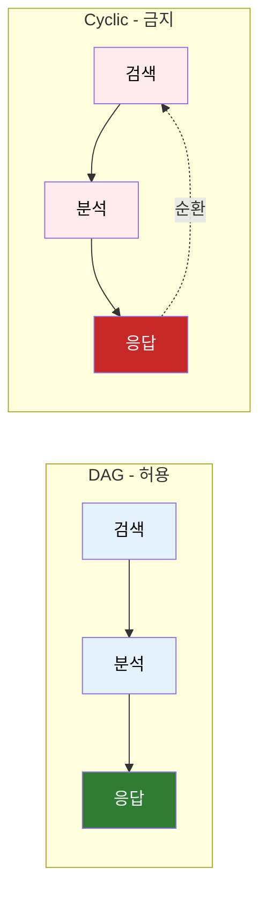
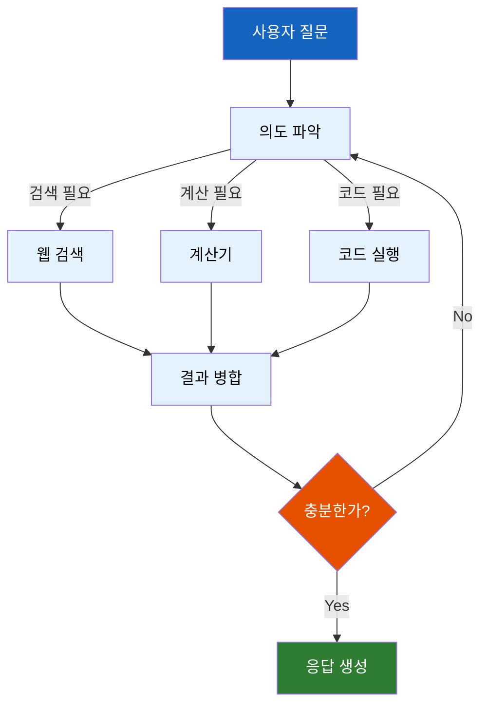
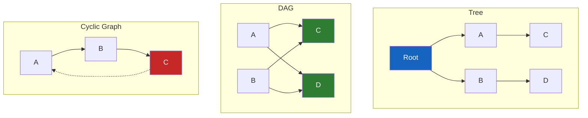
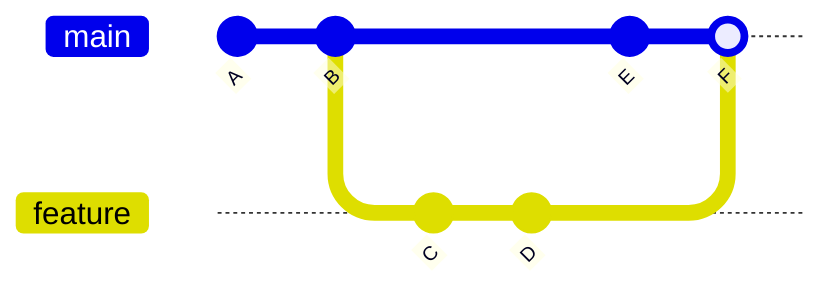
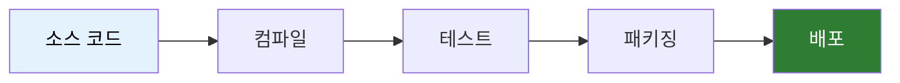
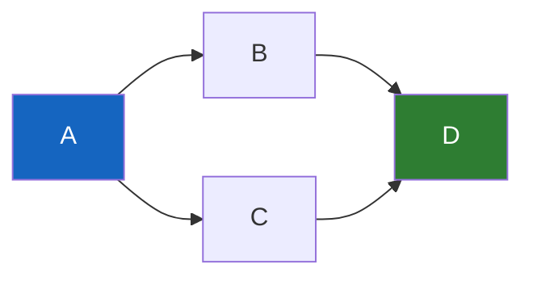
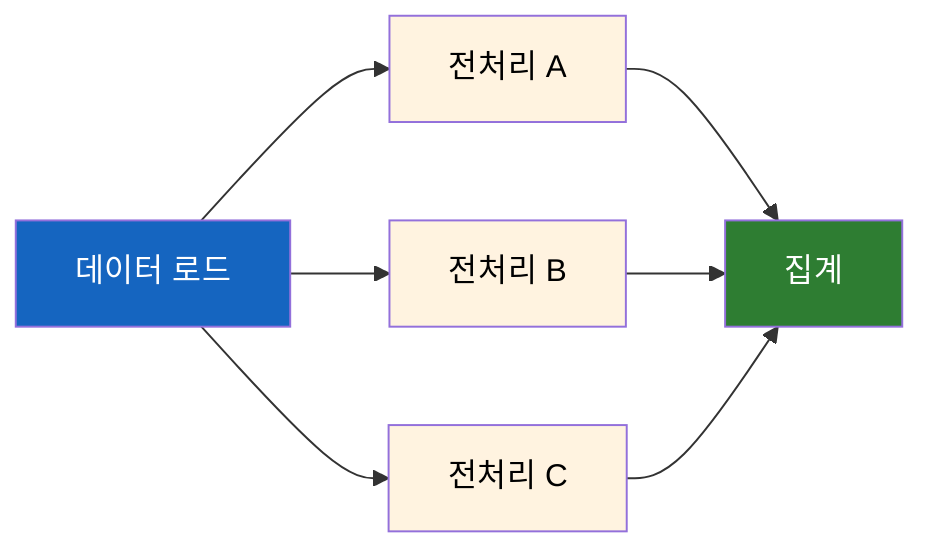

# DAG - 방향 비순환 그래프

AI Agent 워크플로우, Git 커밋 히스토리, 빌드 시스템... 왜 다들 "DAG"라고 할까?

## 결론부터 말하면

**DAG(Directed Acyclic Graph)** 는 "방향이 있고 순환이 없는 그래프"다. AI Agent에서 DAG를 쓰는 이유는 단순하다. **작업 흐름을 안전하게 정의하고, 무한 루프를 구조적으로 방지하기 위해서다.**



| 특성 | 의미 | 실무적 역할 |
|------|------|-------------|
| **Directed** (방향) | A→B는 B→A가 아님 | 작업 순서가 명확함 |
| **Acyclic** (비순환) | 자기 자신으로 돌아올 수 없음 | 무한 루프 방지 |
| **Graph** (그래프) | 노드와 엣지로 구성 | 복잡한 분기/병합 표현 가능 |

---

## 1. 왜 DAG라는 개념이 필요한가?

### 1.1 만약 작업 흐름을 아무렇게나 정의한다면?

AI Agent는 보통 여러 단계를 거친다. 의도 파악, 도구 선택, 실행, 결과 정리... 이걸 코드로 어떻게 표현할까?

단순한 경우라면 함수 호출 체인으로 충분하다:

```python
def agent(question):
    intent = analyze_intent(question)
    tool = select_tool(intent)
    result = execute_tool(tool)
    return format_response(result)
```

**하지만 현실은 복잡하다.** 실제 Agent는 이런 상황을 처리해야 한다:

- 검색 결과가 부족하면 **다시 검색**
- 여러 도구를 **병렬로 실행**
- 조건에 따라 **다른 경로로 분기**
- 중간 결과를 **합쳐서 다음 단계로**



위 다이어그램에서 문제가 보이는가? `R → I`로 가는 경로가 있다. **순환(Cycle)이 생겼다.**

### 1.2 순환이 왜 위험한가?

```python
# 위험한 코드
while not sufficient:
    result = search()
    sufficient = check(result)
    # 만약 영원히 sufficient가 False라면?
```

무한 루프에 빠질 수 있다. 실제로 LLM Agent가 "더 좋은 답을 찾아야겠다"라고 판단하면서 영원히 루프를 도는 사고가 발생한다. 비용은 계속 청구되고, 사용자는 응답을 못 받는다.

**DAG는 이 문제를 구조적으로 방지한다.** 순환을 허용하지 않으므로, 워크플로우는 반드시 끝난다. 시작점에서 어떤 경로를 따라가도 결국 종료점에 도달한다.

### 1.3 그렇다면 재시도는 어떻게?

"순환이 안 되면 재시도도 못 하나?" 좋은 질문이다.

**방법 1: 순환 없이 설계** - 재시도 로직을 노드 내부에 캡슐화한다:

```python
def search_with_retry(state, max_retries=3):
    for i in range(max_retries):
        result = search(state["query"])
        if is_sufficient(result):
            return {"results": result}
    return {"results": result, "warning": "max retries reached"}
```

**방법 2: 순환을 허용하되 제한** - LangGraph처럼 `recursion_limit`을 건다:

```python
app = graph.compile(recursion_limit=10)  # 최대 10번 순환 후 강제 종료
```

두 번째 방법은 **엄밀히 말하면 DAG가 아니다.** 순환을 허용하기 때문이다. 하지만 "유한한 순환"을 허용해서 실용성을 얻는 트레이드오프다.

---

## 2. DAG의 핵심 개념

### 2.1 그래프 기초 (Java 개발자를 위한 설명)

그래프는 **노드(Node)** 와 **엣지(Edge)** 로 구성된다. Java로 비유하면 이렇다:

```java
// 노드 = 클래스 또는 메서드
// 엣지 = 의존성 또는 호출 관계

class SearchNode { }

class AnalyzeNode {
    private SearchNode search;  // SearchNode에 의존 (엣지)
}

class ResponseNode {
    private AnalyzeNode analyze;  // AnalyzeNode에 의존 (엣지)
}
```

Spring의 Bean 의존성 그래프도 DAG다. **순환 의존성이 생기면 Spring이 에러를 던지는 이유가 바로 이것이다:**

```
BeanCurrentlyInCreationException:
    Requested bean is currently in creation:
    Is there an unresolvable circular reference?
```

Spring은 Bean을 생성할 때 의존성 순서대로 생성해야 한다. A가 B에 의존하면 B를 먼저 만들어야 한다. 그런데 B도 A에 의존한다면? 뭘 먼저 만들어야 할지 결정할 수 없다. 그래서 에러가 발생한다.

### 2.2 DAG vs 다른 구조 비교



| 구조 | 방향 | 순환 | 부모 수 | 예시 |
|------|------|------|---------|------|
| **Tree** | 있음 | 없음 | **1개** | 파일 시스템, DOM |
| **DAG** | 있음 | 없음 | **여러 개 가능** | Git 커밋, 빌드 의존성 |
| **Cyclic Graph** | 있음 | 있음 | 여러 개 | 소셜 네트워크, 웹 링크 |

DAG는 Tree보다 유연하다. Tree는 부모가 하나뿐이지만, **DAG는 여러 노드가 같은 노드를 가리킬 수 있다.** Git의 머지 커밋이 좋은 예다. 두 브랜치에서 온 커밋이 하나의 머지 커밋으로 합쳐진다.

---

## 3. 실제 사용 사례

### 3.1 Git 커밋 히스토리

Git이 DAG인 이유는 무엇일까?



- 각 커밋은 **부모 커밋을 가리킨다** (방향)
- 자식이 부모를 가리키지, **부모가 자식을 가리키지 않는다** (비순환)
- **머지 커밋은 여러 부모를 가진다** (DAG, Tree가 아님)

과거를 수정할 수 없고, 미래가 과거를 참조할 수 없다. 이게 바로 DAG의 특성이다.

### 3.2 빌드 시스템 (Gradle, Maven)



Gradle 태스크는 DAG로 표현된다. `test`는 `compile`에 의존하고, `package`는 `test`에 의존한다. Gradle은 이 의존성 그래프를 분석해서 **실행 순서를 자동으로 결정** 한다.

만약 순환 의존성이 있다면? Gradle도 빌드를 거부한다:

```
Circular dependency between the following tasks:
:taskA
\--- :taskB
     \--- :taskA (*)
```

### 3.3 주의: LangGraph는 DAG가 아니다

AI Agent 개발에서 LangGraph를 자주 접하게 된다. **하지만 LangGraph는 DAG가 아니다.**

| 프레임워크 | 그래프 타입 | 순환 | 용도 |
|------------|-------------|------|------|
| **LangChain (LCEL)** | DAG | 불가 | 단순 체인, 파이프라인 |
| **LangGraph** | Cyclic Graph | **가능** | Agent, 재시도, 루프 |

LangGraph 공식 문서의 입장은 명확하다:

> "LangGraph is NOT optimized for DAG workflows. If you want to build a DAG, you should just use LangChain Expression Language."

LangGraph는 **순환을 추가하기 위해** LangChain 위에 만들어졌다. Agent가 "결과가 부족하면 다시 검색"하는 루프를 자연스럽게 표현하려면 순환이 필요하기 때문이다.

```python
# LangGraph - 순환 허용 (DAG 아님)
graph.add_conditional_edges(
    "analyze",
    should_retry,
    {"retry": "search", "done": "respond"}  # search로 돌아갈 수 있음
)

# 무한 루프 방지를 위한 제한
app = graph.compile(recursion_limit=10)
```

**DAG만 필요하다면 LangChain LCEL을 쓰라** 는 게 공식 권장이다.

### 3.4 데이터 파이프라인 (Apache Airflow)

```python
from airflow import DAG
from airflow.operators.python import PythonOperator

with DAG("data_pipeline", ...) as dag:
    extract = PythonOperator(task_id="extract", ...)
    transform = PythonOperator(task_id="transform", ...)
    load = PythonOperator(task_id="load", ...)

    extract >> transform >> load  # DAG 정의
```

Airflow는 아예 핵심 객체 이름이 `DAG`다. ETL 파이프라인에서 작업 의존성을 정의하고, 병렬 실행 가능한 작업을 자동으로 식별한다.

---

## 4. DAG의 핵심 알고리즘

### 4.1 위상 정렬 (Topological Sort)

DAG의 가장 중요한 연산이다. **의존성 순서대로 노드를 나열** 한다.



위 DAG의 위상 정렬 결과: `A → B → C → D` 또는 `A → C → B → D`

B와 C는 서로 의존하지 않으므로 순서가 바뀌어도 된다. **이게 바로 병렬 실행 가능한 작업이다.**

Java로 구현하면:

```java
public List<Node> topologicalSort(Graph dag) {
    List<Node> result = new ArrayList<>();
    Set<Node> visited = new HashSet<>();

    for (Node node : dag.getNodes()) {
        if (!visited.contains(node)) {
            dfs(node, visited, result);
        }
    }

    Collections.reverse(result);
    return result;
}

private void dfs(Node node, Set<Node> visited, List<Node> result) {
    visited.add(node);
    for (Node neighbor : node.getOutgoingNodes()) {
        if (!visited.contains(neighbor)) {
            dfs(neighbor, visited, result);
        }
    }
    result.add(node);  // 후위 순회: 자식들 다 방문 후 추가
}
```

시간복잡도는 $O(V + E)$다. 모든 노드와 엣지를 한 번씩 방문한다.

> **참고: 칸 알고리즘(Kahn's Algorithm)**
>
> 위 DFS 방식 외에, "들어오는 간선(in-degree)이 0인 노드"를 큐에 넣어 반복 처리하는 **칸 알고리즘** 도 있다. 이 방식은 병렬 처리 가능한 작업 그룹을 단계별로 식별하는 데 더 직관적이어서, 실제 빌드 시스템이나 태스크 스케줄러에서 자주 사용된다.

### 4.2 순환 탐지 (Cycle Detection)

DAG가 맞는지 검증하려면 순환이 있는지 확인해야 한다. DFS로 탐지할 수 있다:

```java
public boolean hasCycle(Graph graph) {
    Set<Node> visited = new HashSet<>();
    Set<Node> recursionStack = new HashSet<>();  // 현재 DFS 경로

    for (Node node : graph.getNodes()) {
        // 이미 방문한 노드는 건너뜀 (각 컴포넌트당 한 번만 DFS)
        if (!visited.contains(node)) {
            if (hasCycleDFS(node, visited, recursionStack)) {
                return true;
            }
        }
    }
    return false;
}

private boolean hasCycleDFS(Node node, Set<Node> visited, Set<Node> stack) {
    visited.add(node);
    stack.add(node);  // 현재 경로에 추가

    for (Node neighbor : node.getOutgoingNodes()) {
        if (stack.contains(neighbor)) {
            return true;  // 현재 경로에서 다시 만남 = 순환!
        }
        if (!visited.contains(neighbor) && hasCycleDFS(neighbor, visited, stack)) {
            return true;
        }
    }

    stack.remove(node);  // 현재 경로에서 제거
    return false;
}
```

핵심은 `recursionStack`이다. 단순히 방문 여부만 체크하면 안 된다. **현재 탐색 경로** 에서 같은 노드를 다시 만나야 순환이다.

### 4.3 병렬 처리 최적화

DAG를 보면 **어떤 작업을 병렬로 실행할 수 있는지** 알 수 있다.



B, C, D는 서로 의존성이 없으므로 **동시에 실행 가능** 하다. 위상 정렬에서 같은 "레벨"에 있는 노드들이다. 이런 병렬화 기회를 DAG 구조에서 자동으로 찾아낼 수 있다.

---

## 5. 정리

| 질문 | 답변 |
|------|------|
| DAG가 뭐야? | 방향이 있고(Directed) 순환이 없는(Acyclic) 그래프(Graph) |
| 왜 AI Agent에서 쓰여? | 워크플로우를 안전하게 정의하고, 무한 루프를 구조적으로 방지 |
| Tree와 뭐가 달라? | 여러 부모를 가질 수 있음 (더 유연함) |
| 핵심 알고리즘은? | 위상 정렬 - 의존성 순서대로 실행 순서 결정 |

회의에서 "이거 DAG이에요"라고 말하는 건, **"이 워크플로우는 순환 없이 방향성 있게 흘러간다"** 는 의미다. 시작점에서 끝점까지 명확한 흐름이 있고, 무한 루프 걱정 없이 실행된다는 뜻이다.

---

## 출처

- [Wikipedia - Directed acyclic graph](https://en.wikipedia.org/wiki/Directed_acyclic_graph)
- [LangGraph - LangChain Blog](https://blog.langchain.com/langgraph/) - LangGraph가 순환을 지원하는 이유
- [Building Dynamic Workflows with LangGraph: Beyond DAGs](https://fetch.ai/blog/building-dynamic-workflows-with-langgraph-beyond-dags)
- [Apache Airflow Documentation](https://airflow.apache.org/docs/apache-airflow/stable/core-concepts/dags.html)
