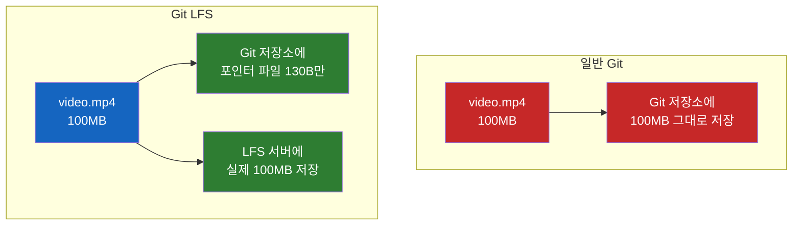
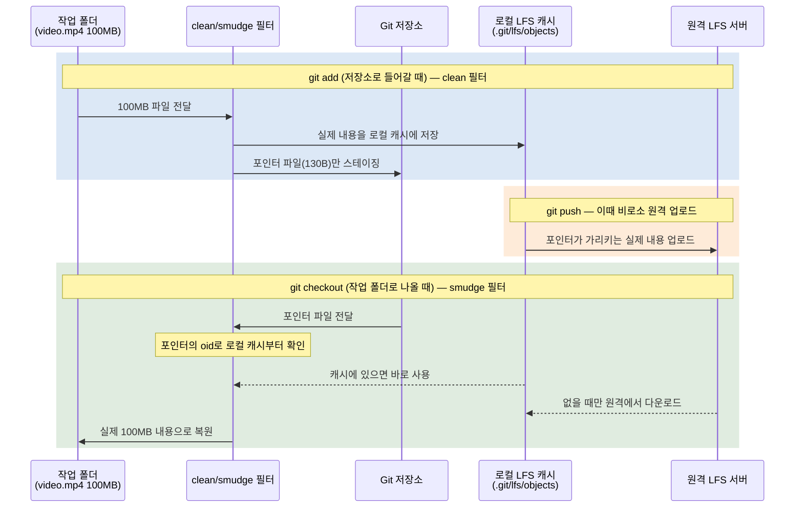

# Git LFS는 왜 파일 대신 포인터를 커밋할까

디자인 시안 하나, 동영상 하나를 Git에 올렸을 뿐인데 동료가 `git clone` 하는 데 30분이 걸린다. 게다가 그 파일을 나중에 지워도 저장소는 가벼워지지 않는다. 대체 왜 이럴까? 그리고 Git LFS는 이 문제를 어떻게 풀까?

## 결론부터 말하면

**Git LFS는 대용량 파일의 실제 내용을 Git 저장소 밖(LFS 서버)에 두고, 저장소 안에는 그 파일을 가리키는 작은 "포인터 파일"만 커밋한다.** Git이 대용량 바이너리를 직접 다루면 저장소가 통째로 비대해지기 때문에, 무거운 짐을 별도 창고로 빼내고 위치표만 버전 관리하는 전략이다.



| 구분 | 저장소에 커밋되는 것 | 실제 파일 위치 | clone 시 받는 것 |
|------|---------------------|----------------|------------------|
| 일반 Git | 파일 전체 (모든 버전) | Git 저장소 내부 | 전체 히스토리의 모든 버전 |
| Git LFS | 포인터 파일 (텍스트 3줄) | 별도 LFS 서버 | 포인터 + 체크아웃한 버전만 |

---

## 1. 왜 Git에 큰 파일을 넣으면 안 될까?

### 1.1 흔히 겪는 상황

개발하다 보면 코드만 다루는 게 아니다. 디자인 시안(`.psd`), 게임 리소스, 제품 소개 영상, 머신러닝 데이터셋 같은 **덩치 큰 파일** 도 함께 관리하고 싶어진다. 다른 파일처럼 그냥 `git add` 하고 커밋하면 될 것 같다.

그런데 이렇게 하면 시간이 지나면서 이상한 일이 벌어진다.

- 저장소를 새로 받는(`clone`) 데 몇십 분씩 걸린다.
- 그 큰 파일을 **지우고 커밋해도** 저장소 용량은 줄어들지 않는다.
- 팀원이 늘어날수록 모두가 똑같이 느려진다.

분명 지금 작업에 필요한 파일은 코드 몇 개뿐인데, 왜 과거에 잠깐 올렸던 영상 파일 때문에 모두가 고통받을까? 답은 **Git이 파일을 다루는 방식**에 있다.

### 1.2 Git은 "모든 버전을, 모두에게" 복사한다

Git을 사진첩에 비유해 보자. Git은 파일을 수정할 때마다 그 순간의 모습을 한 장씩 **사진으로 찍어 보관**한다. 그리고 `git clone`을 하면 최신 사진 한 장만 받는 게 아니라, **그동안 찍은 모든 사진(전체 히스토리)을 통째로** 내 컴퓨터로 복사한다.

이게 바로 Git의 강력함이다. 인터넷이 끊겨도 과거 어느 시점으로든 돌아갈 수 있고, 모든 작업이 내 컴퓨터에서 즉시 일어난다. 이것이 Git이 "분산" 버전 관리 시스템(여러 사람이 각자 완전한 복사본을 갖는 구조)이라 불리는 이유다.

문제는 여기서 시작된다. **모든 버전을 모두가 갖는다**는 건, 한 번 들어온 파일은 영원히 따라다닌다는 뜻이기도 하다. 그래서 큰 파일을 나중에 지워도 "과거에 그 파일이 있었다"는 사진은 히스토리에 그대로 남아, 모두의 디스크와 clone 시간을 계속 갉아먹는다.

### 1.3 그런데 왜 코드는 괜찮고 동영상은 문제일까?

여기서 의문이 든다. 코드 저장소도 수년간 수만 번 커밋하는데 왜 가벼울까? 매번 사진을 찍어 보관한다면 코드 저장소도 똑같이 터져야 하지 않나?

비밀은 Git이 사진을 **꾹꾹 눌러 압축**한다는 데 있다. 텍스트 코드는 한 줄만 고치면 이전 버전과 99%가 똑같다. Git은 이 비슷함을 영리하게 알아채서 "바뀐 부분"만 효율적으로 보관한다. 그래서 코드 1만 줄 중 한 줄을 고쳐도 저장소는 거의 커지지 않는다.

하지만 동영상·이미지 같은 **바이너리 파일** 에서는 이 압축이 통하지 않는다. 두 가지 이유 때문이다.

**첫째, 이미 압축된 파일이라 더 쥐어짤 게 없다.** JPEG나 MP4는 그 자체가 고도로 압축된 포맷이다. 게다가 영상의 1초만 편집해도 내부 데이터는 거의 전체가 달라진다. Git이 "비슷한 부분"을 찾으려 해도 찾을 게 없어서, 결국 **수정할 때마다 파일 전체를 통째로 새로 보관** 한다. 100MB 영상을 10번 수정하면 저장소가 1GB만큼 불어난다.

**둘째, 그 부담을 모두가 나눠 진다.** 1.2에서 봤듯 clone은 전체 히스토리를 받는다. 그래서 한 명이 실수로 큰 파일을 커밋하면, 그 무게를 **팀 전체가, 그것도 영원히** 짊어지게 된다.

> Microsoft Azure DevOps 문서도 같은 경고를 한다: *"크기가 작은 바이너리라도 자주 업데이트되면 문제가 된다. 100KB 파일을 100번 바꾸면 1MB 파일을 10번 바꾸는 것과 같은 저장 공간을 쓴다."*

> **조금 더 정확히:** Git은 논리적으로는 커밋마다 프로젝트 전체의 **스냅샷**을 저장한다(바뀌지 않은 파일은 기존 데이터를 재사용한다). 그리고 객체들을 모아 **packfile**로 묶는 단계에서 비슷한 객체끼리 **델타 압축(delta compression)** 을 적용한다. 위에서 "비슷함을 알아채 바뀐 부분만 보관한다"고 한 게 바로 이 단계다. 여기서 든 사진첩 비유는 동작의 결과를 직관적으로 옮긴 것이고, 더 깊은 내부 구조는 출처의 Git 공식 문서에서 확인할 수 있다.

정리하면, Git이 큰 파일에 약한 건 버그가 아니라 **설계의 대가**다. "모든 버전을 모두에게 분산 저장한다"는 철학이 텍스트에는 축복이지만 바이너리에는 저주가 된다. 그래서 GitHub와 Atlassian의 개발자들은 Git 자체를 뜯어고치는 대신 **우회로**를 만들었다. 그게 Git LFS다.

---

## 2. 핵심 개념: 포인터와 clean/smudge 필터

Git LFS의 발상은 단순하다. **무거운 파일은 다른 곳에 두고, 저장소에는 "그 파일은 저기 있다"는 쪽지만 남긴다.** 이 쪽지가 바로 **포인터 파일(pointer file)** 이다.

포인터 파일의 실제 모습은 이렇게 생긴 텍스트 3줄이다.

```
version https://git-lfs.github.com/spec/v1
oid sha256:4cac19622fc3ada9c0fdeadb33f88f367b541f38b89102a3f1261ac81fd5bcb5
size 84977953
```

- `version`: 어떤 LFS 스펙 버전인지
- `oid sha256:...`: 실제 파일 내용의 SHA-256 해시. 이것이 **파일의 고유 주소**다
- `size`: 원래 파일의 크기(바이트)

여기서 핵심은 `oid`다. Git LFS는 파일 내용의 SHA-256 해시로 파일을 식별하는 **Content-Addressable Storage(내용 기반 저장)** 를 쓴다. 즉 "파일 이름"이 아니라 "파일 내용 그 자체"가 주소가 된다. 내용이 같으면 주소도 같으므로, 똑같은 파일이 여러 번 올라가도 LFS 서버에는 하나만 저장된다.

### 2.1 그럼 이 교체는 누가, 언제 하는가?

포인터 파일이라는 개념은 알겠는데, 의문이 남는다. *나는 분명 `video.mp4`를 작업 폴더에서 보고 편집하는데, 커밋되는 건 포인터 파일이라니? 이 변신은 대체 언제 일어나는가?*

답은 Git에 원래 있던 기능인 **clean/smudge 필터** 다. 이 둘은 Git이 파일을 저장소에 넣을 때와 꺼낼 때 자동으로 거치는 변환 단계다. Git LFS는 이 두 관문에 자기 로직을 끼워 넣는다.

| 필터 | 언제 작동하나 | 하는 일 |
|------|--------------|---------|
| **clean** | `git add` 할 때 (스테이징 영역으로 **들어갈** 때) | 실제 파일을 `.git/lfs/objects`에 저장하고, 그 자리에 포인터 파일을 만들어 스테이징 |
| **smudge** | 체크아웃할 때 (작업 폴더로 **나올** 때) | 포인터 파일을 읽어 실제 파일 내용으로 되돌림 (없으면 LFS 서버에서 다운로드) |

여기서 중요한 구분이 하나 있다. 실제 파일이 보관되는 곳은 사실 **두 군데**다. 내 컴퓨터 안의 **로컬 캐시(`.git/lfs/objects`)** 와, 원격의 **LFS 서버** 다. `git add` 단계에서는 일단 로컬 캐시에만 저장되고, 원격 서버로의 실제 업로드는 `git push` 할 때 따로 일어난다.



이 구조의 아름다운 점은 **개발자가 아무것도 신경 쓸 필요가 없다**는 것이다. 작업 폴더에서는 늘 진짜 파일을 보고, `git add`/`git commit`/`git checkout`을 평소처럼 쓴다. 포인터로의 변신과 복원은 필터가 막후에서 알아서 처리한다.

### 2.2 어떤 파일을 LFS로 보낼지는 `.gitattributes`가 정한다

마지막 퍼즐. Git은 *모든* 파일에 LFS 필터를 적용하지 않는다(소스 코드까지 LFS로 보내면 곤란하다). 어떤 파일을 LFS 대상으로 삼을지는 `.gitattributes` 파일이 결정한다.

```bash
git lfs track "*.psd"   # .psd 파일을 LFS로 추적
```

이 명령은 `.gitattributes`에 다음 한 줄을 추가한다.

```
*.psd filter=lfs diff=lfs merge=lfs -text
```

`filter=lfs`가 바로 "이 패턴의 파일에는 clean/smudge 필터를 적용하라"는 지시다. `-text`는 바이너리로 취급하라는 표시이고, `diff=lfs merge=lfs`는 diff/merge 시 거대한 파일 내용 대신 포인터를 비교하라는 뜻이다.

---

## 3. 실제 사용 흐름

처음부터 끝까지 따라가 보자.

```bash
# 1. 사용자 계정당 한 번만: Git에 LFS 필터를 등록
git lfs install

# 2. 저장소에서 추적할 파일 유형 지정
git lfs track "*.psd"
git lfs track "*.mp4"

# 3. .gitattributes를 반드시 함께 커밋해야 협업자도 같은 규칙을 공유
git add .gitattributes

# 4. 이후로는 평소처럼 작업
git add design.psd        # clean 필터가 자동으로 포인터로 변환
git commit -m "Add design file"
git push                  # 포인터는 Git 서버로, 실제 파일은 LFS 서버로 분리 전송
```

`git push` 한 번에 두 곳으로 데이터가 나뉘어 전송된다는 점이 중요하다. 포인터 파일은 일반 Git 객체로 Git 호스트(GitHub 등)에 가고, 실제 바이너리는 LFS 서버로 업로드된다. 권한과 접근 제어는 일반 저장소와 동일하게 적용되므로 보안 모델이 달라지지 않는다.

### 3.1 반드시 알아야 할 함정들

Git LFS는 만능이 아니다. 도입 전에 알아야 할 함정이 몇 가지 있다.

**이미 커밋된 큰 파일은 `git lfs track`만으로 사라지지 않는다.** `.gitattributes`는 *앞으로의* 커밋에만 적용된다. 이미 히스토리에 박힌 대용량 파일을 빼내려면 `git lfs migrate` 또는 `git-filter-repo`로 **히스토리를 재작성** 해야 한다. 이건 force push를 동반하는 위험한 작업이라 협업 중에는 신중해야 한다. 그래서 **저장소를 처음 만들 때 LFS 전략을 미리 세우는 것**이 정석이다.

**LFS 클라이언트가 없는 협업자는 포인터 파일만 본다.** Git LFS는 Git의 확장 기능이라 별도 설치가 필요하다. 클라이언트 없이 clone한 사람의 작업 폴더에는 `video.mp4` 대신 그 130바이트 텍스트 포인터가 그대로 들어 있다. smudge 필터가 작동하지 않기 때문이다.

**용량과 대역폭에 한도가 있다.** GitHub은 플랜별로 파일당 최대 크기(Free/Pro 2GB ~ Enterprise Cloud 5GB)와 별도의 LFS 저장 공간/대역폭 쿼터를 둔다. 무료로 무한정 쓸 수 있는 게 아니다.

> 참고로 Git LFS는 활발히 유지보수되는 프로젝트로, 최신 버전은 **v3.7.1** 이며 보안 업데이트가 포함되어 있어 구버전 사용자는 업그레이드가 권장된다.

---

## 4. 정리

### 핵심 포인트

1. **Git LFS는 파일을 옮기는 게 아니라 "포인터로 바꿔치기"한다**
   - 저장소에는 SHA-256 해시·크기가 적힌 텍스트 포인터만 커밋되고, 실제 내용은 별도 LFS 서버에 저장된다.

2. **이게 필요한 이유는 Git의 분산 설계 때문이다**
   - Git은 모든 버전을 모두에게 복사하는데, 압축된 바이너리는 델타화가 안 돼 매 커밋마다 전체가 저장된다. 한 번 비대해진 저장소는 모든 팀원의 clone을 영원히 느리게 만든다.

3. **변환은 clean/smudge 필터가 자동으로 처리한다**
   - `.gitattributes`로 지정한 파일은 `git add` 시 포인터로(clean), 체크아웃 시 실제 파일로(smudge) 투명하게 변환된다. 개발자는 평소 Git 워크플로를 그대로 쓴다.

4. **도입은 저장소 생성 시점에 결정하라**
   - 이미 커밋된 파일은 히스토리 재작성(`git lfs migrate`)이 필요하고, 협업자는 LFS 클라이언트가 있어야 실제 파일을 받는다.

---

## 출처

- [Git Large File Storage 공식 사이트](https://git-lfs.com) - 공식 홈페이지 및 다운로드
- [About Git Large File Storage - GitHub Docs](https://docs.github.com/repositories/working-with-files/managing-large-files/about-git-large-file-storage) - 포인터 파일 포맷, 크기 한도
- [Work with large files in your Git repo - Azure Repos](https://learn.microsoft.com/en-us/azure/devops/repos/git/manage-large-files) - deltification과 바이너리 파일 문제
- [The Secret Life of Git Large File Storage - Ken Muse](https://www.kenmuse.com/blog/secret-life-of-git-lfs) - clean/smudge 필터 동작 상세
- [Git LFS (Git Large File Storage) Overview - Perforce](https://www.perforce.com/blog/vcs/how-git-lfs-works) - 동작 원리와 한계
