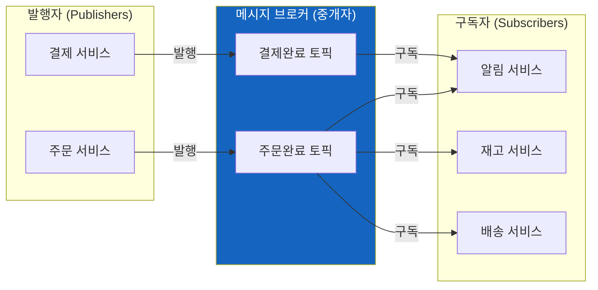
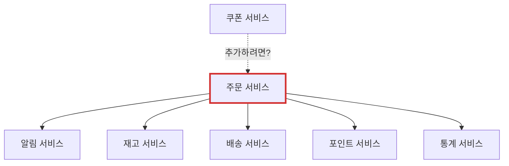
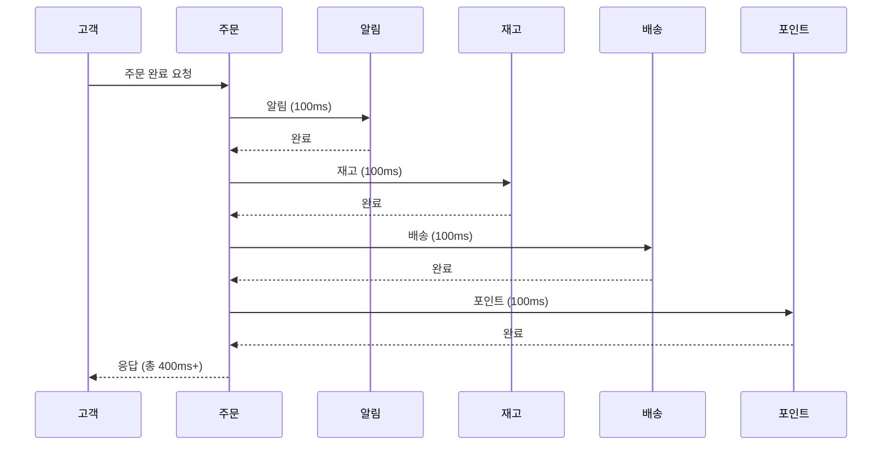
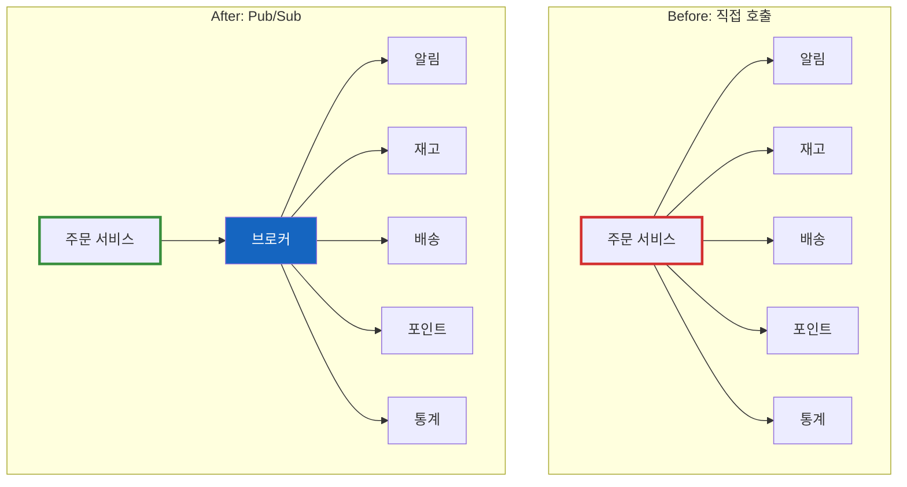
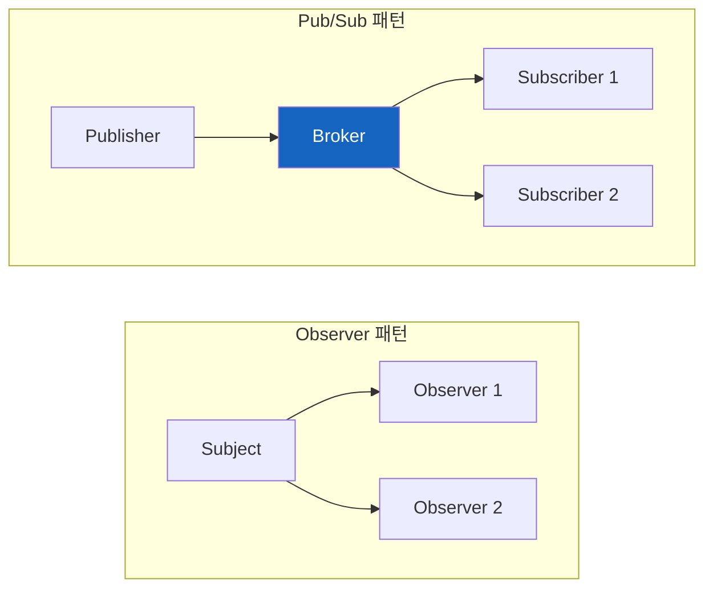
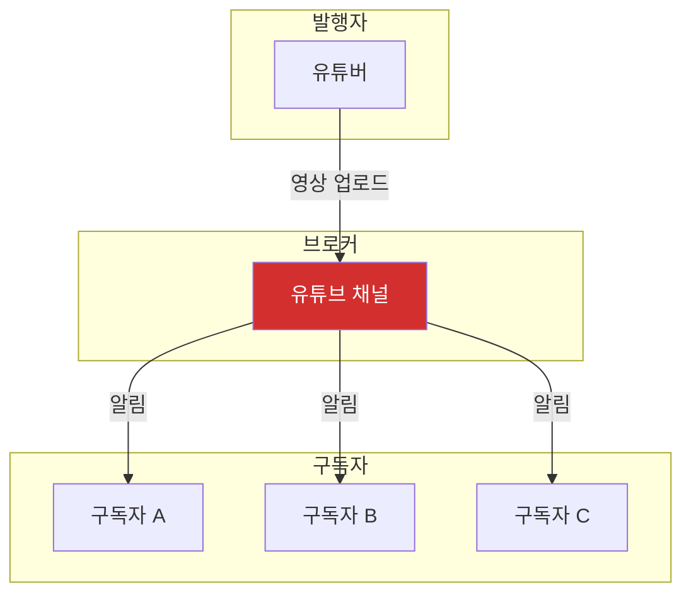
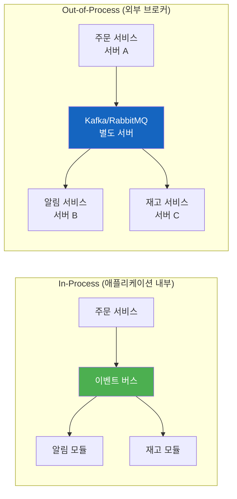
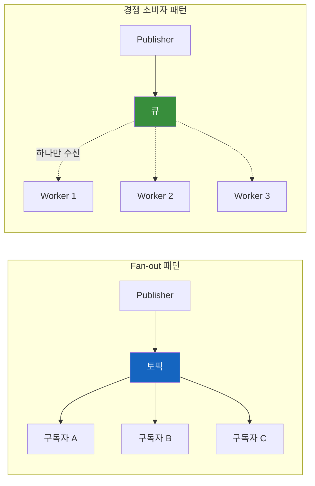

# Pub/Sub 패턴

발행자는 구독자를 모르고, 구독자는 발행자를 모른다. 그런데 어떻게 메시지가 전달될까?

## 결론부터 말하면

**Pub/Sub는 "누가 듣고 있는지 몰라도 말할 수 있게" 해주는 패턴이다.** 발행자(Publisher)와 구독자(Subscriber)가 서로를 직접 알지 못해도 메시지를 주고받을 수 있다. 이 "분리"가 Pub/Sub의 본질이다.



| 구분 | 역할 | 비유 |
|------|------|------|
| **Publisher** | 메시지를 발행 (누가 듣는지 모름) | 유튜버가 영상 업로드 |
| **Subscriber** | 관심 있는 토픽을 구독 | 구독자가 알림 받기 |
| **Broker** | 메시지를 중개 | 유튜브 플랫폼 |

**핵심:** 발행자와 구독자는 서로의 존재를 모른다. 브로커만 알고 있으면 된다.

## 1. 만약 Pub/Sub 없이 직접 호출한다면?

### 1.1 처음엔 괜찮았다

온라인 쇼핑몰을 만든다고 해보자. 주문이 완료되면 알림을 보내야 한다.

```java
// 주문 서비스
public class OrderService {
    private NotificationService notificationService;

    public void completeOrder(Order order) {
        // 주문 처리
        saveOrder(order);

        // 알림 전송
        notificationService.sendNotification(order);
    }
}
```

간단하다. 주문 서비스가 알림 서비스를 직접 호출한다. 아무 문제 없어 보인다.

### 1.2 그런데 요구사항이 늘어났다

사업이 잘 되면서 요구사항이 추가됐다. 주문 완료 시 재고 차감도 해야 하고, 배송 준비도 시작해야 하고, 포인트 적립도 해야 하고, 통계 집계도 해야 한다.

```java
public class OrderService {
    private NotificationService notificationService;
    private InventoryService inventoryService;      // 추가
    private ShippingService shippingService;        // 추가
    private PointService pointService;              // 추가
    private AnalyticsService analyticsService;      // 추가

    public void completeOrder(Order order) {
        saveOrder(order);

        notificationService.sendNotification(order);
        inventoryService.decreaseStock(order);      // 추가
        shippingService.prepareShipping(order);     // 추가
        pointService.addPoints(order);              // 추가
        analyticsService.recordOrder(order);        // 추가
    }
}
```

코드가 점점 비대해진다. 하지만 진짜 문제는 이게 아니다.

### 1.3 문제가 터지기 시작한다

**문제 1: 강한 결합**

주문 서비스가 5개 서비스를 직접 알고 있다. 새 서비스가 추가될 때마다 주문 서비스를 수정해야 한다. 주문 서비스는 "주문 처리"만 잘하면 되는데, 왜 알림/재고/배송까지 알아야 하는가?



쿠폰 서비스를 추가하려면? 주문 서비스를 또 수정해야 한다.

**문제 2: 연쇄 장애**

```java
public void completeOrder(Order order) {
    saveOrder(order);                              // 성공
    notificationService.sendNotification(order);   // 성공
    inventoryService.decreaseStock(order);         // 장애 발생!
    shippingService.prepareShipping(order);        // 실행 안 됨
    pointService.addPoints(order);                 // 실행 안 됨
}
```

재고 서비스가 죽으면? 주문 자체가 실패한다. 사용자는 "주문 실패"를 보게 된다. 하지만 생각해보면, 재고 차감은 나중에 해도 되는 작업이다. 왜 이것 때문에 주문이 실패해야 하는가?

**문제 3: 성능 저하**



각 호출이 100ms씩 걸린다면, 총 400ms가 걸린다. 동기 호출이라 순차적으로 기다려야 한다. 사용자는 그냥 "주문 완료" 메시지만 보면 되는데, 왜 모든 후처리가 끝날 때까지 기다려야 하는가?

## 2. Pub/Sub가 이 문제를 어떻게 해결하는가?

### 2.1 핵심 아이디어: "발행만 하고 잊어버려"

주문 서비스는 이렇게만 말한다: **"주문 완료됐어!"**

누가 듣고 있는지, 몇 명이 듣고 있는지, 뭘 하는지 전혀 모른다. 알 필요도 없다.

```java
public class OrderService {
    private EventPublisher eventPublisher;  // 단 하나만 의존

    public void completeOrder(Order order) {
        saveOrder(order);

        // "주문 완료됐어!" 라고 외치기만 함
        eventPublisher.publish("order.completed", order);
    }
}
```

5개의 의존성이 1개로 줄었다. 주문 서비스는 이제 "주문 처리"에만 집중한다.

### 2.2 관심 있는 서비스가 알아서 구독

```java
// 알림 서비스: OrderCompletedEvent 구독
@Component
public class NotificationSubscriber {
    @EventListener
    public void handle(OrderCompletedEvent event) {
        sendPushNotification(event.getOrder());
    }
}

// 재고 서비스: 같은 이벤트 구독
@Component
public class InventorySubscriber {
    @EventListener
    public void handle(OrderCompletedEvent event) {
        decreaseStock(event.getOrder());
    }
}

// 새 서비스 추가? 그냥 구독만 하면 됨!
@Component
public class CouponSubscriber {
    @EventListener
    public void handle(OrderCompletedEvent event) {
        issueCoupon(event.getOrder());
    }
}
```

쿠폰 서비스를 추가할 때 주문 서비스를 수정했는가? 아니다. 그냥 구독만 추가하면 끝이다.

### 2.3 무엇이 달라졌는가?



| 문제 | Before (직접 호출) | After (Pub/Sub) |
|------|-------------------|-----------------|
| **결합도** | 주문 → 5개 서비스 의존 | 주문 → 브로커만 의존 |
| **새 기능 추가** | 주문 서비스 수정 필요 | 구독만 추가하면 끝 |
| **장애 전파** | 하나 죽으면 전체 실패 | 독립적으로 처리 |
| **성능** | 순차 실행 (400ms+) | 병렬/비동기 처리 가능 |

## 3. Observer 패턴과 뭐가 다른가?

"잠깐, 이거 Observer 패턴 아니야?"라고 생각할 수 있다. 비슷하지만 결정적 차이가 있다.



| 구분 | Observer | Pub/Sub |
|------|----------|---------|
| **중개자** | 없음 (직접 연결) | 있음 (Broker) |
| **결합도** | Subject가 Observer를 앎 | 서로 모름 |
| **위치** | 보통 같은 프로세스 | 다른 프로세스/서버 가능 |
| **사용처** | GUI 이벤트, 상태 변경 | 마이크로서비스, 메시지 큐 |

```java
// Observer: Subject가 Observer를 직접 들고 있음
class Subject {
    private List<Observer> observers;  // 직접 참조!

    void notify() {
        for (Observer o : observers) {
            o.update(this);  // 직접 호출
        }
    }
}

// Pub/Sub: Publisher는 Broker만 알고 있음
class Publisher {
    private Broker broker;  // 중개자만 참조

    void publish(String topic, Object message) {
        broker.send(topic, message);  // 누가 받는지 모름
    }
}
```

**Observer 패턴**은 Subject가 Observer 목록을 직접 관리한다. **Pub/Sub 패턴**은 브로커가 이 역할을 대신한다. 이 차이가 분산 시스템에서 결정적이다. Observer 패턴은 같은 프로세스 내에서만 동작하지만, Pub/Sub는 네트워크를 넘어 다른 서버의 구독자에게도 메시지를 전달할 수 있다.

## 4. 일상에서 보는 Pub/Sub

### 4.1 유튜브 구독



유튜버는 구독자가 누구인지 모른다. 그냥 영상을 올릴 뿐이다. 구독자는 관심 있는 채널을 구독한다. 유튜브(브로커)가 중간에서 알림을 전달한다.

### 4.2 신문 구독

신문사(Publisher)는 기사를 발행하고, 구독자(Subscriber)는 신문을 받아본다. 신문사는 구독자 집 주소를 직접 관리하지 않는다. 배달 시스템(Broker)이 알아서 처리한다.

### 4.3 카카오톡 오픈채팅

오픈채팅방은 Pub/Sub의 좋은 예다. 누군가 메시지를 보내면(발행), 방에 참여한 모든 사람(구독자)이 메시지를 받는다. 발신자는 누가 읽었는지 신경 쓰지 않는다.

## 5. 실제 구현체들

| 기술 | 설명 | 사용 사례 |
|------|------|----------|
| **Apache Kafka** | 대용량 분산 메시지 스트리밍 | 로그 수집, 이벤트 소싱, 실시간 데이터 파이프라인 |
| **RabbitMQ** | AMQP 기반 메시지 브로커 | 작업 큐, 비동기 처리, 마이크로서비스 통신 |
| **Redis Pub/Sub** | 인메모리 Pub/Sub | 실시간 알림, 채팅, 캐시 무효화 |
| **AWS SNS/SQS** | 클라우드 메시징 | 서버리스 이벤트 처리, Fan-out 패턴 |
| **Spring Events** | 애플리케이션 내부 이벤트 | 모듈 간 느슨한 결합 |

### In-Process vs Out-of-Process: 이 차이를 모르면 설계가 망한다

Pub/Sub 구현체를 선택할 때 가장 먼저 이해해야 할 개념이다. **같은 Pub/Sub 패턴이라도 동작 환경이 완전히 다르다.**



| 구분 | In-Process | Out-of-Process |
|------|------------|----------------|
| **예시** | Spring Events, Guava EventBus | Kafka, RabbitMQ, Redis Pub/Sub, AWS SNS |
| **브로커 위치** | 애플리케이션 메모리 내부 | 별도 서버/클러스터 |
| **통신 범위** | 단일 JVM 내 모듈 간 | 다른 서버, 다른 언어, 다른 팀 |
| **네트워크** | 없음 (메서드 호출) | 필요 (TCP/HTTP) |
| **메시지 보존** | 앱 종료 시 유실 | 브로커가 보관 (디스크 저장) |
| **장애 복구** | 불가능 | 가능 (재처리, 리플레이) |
| **성능** | 매우 빠름 (ns~μs) | 상대적으로 느림 (ms) |
| **복잡도** | 낮음 | 높음 (인프라 운영 필요) |

**언제 무엇을 써야 하는가?**

```
┌─────────────────────────────────────────────────────────────┐
│ "같은 애플리케이션 안에서 모듈 간 결합을 줄이고 싶다"        │
│  → Spring Events, Guava EventBus (In-Process)               │
├─────────────────────────────────────────────────────────────┤
│ "다른 서버에 있는 서비스에게 이벤트를 전달해야 한다"         │
│  → Kafka, RabbitMQ (Out-of-Process)                         │
├─────────────────────────────────────────────────────────────┤
│ "앱이 죽어도 메시지가 유실되면 안 된다"                      │
│  → Kafka, RabbitMQ (Out-of-Process)                         │
├─────────────────────────────────────────────────────────────┤
│ "마이크로서비스 간 비동기 통신이 필요하다"                   │
│  → Kafka, RabbitMQ (Out-of-Process)                         │
└─────────────────────────────────────────────────────────────┘
```

**흔한 실수:** Spring Events로 시작했다가 나중에 "다른 서버로 이벤트를 보내야 하는데?"라는 요구사항이 생기면 아키텍처를 다시 설계해야 한다. 처음부터 확장 가능성을 고려하자.

### Spring Events 예시 (In-Process)

```java
// 이벤트 정의
public class OrderCompletedEvent {
    private final Order order;

    public OrderCompletedEvent(Order order) {
        this.order = order;
    }

    public Order getOrder() {
        return order;
    }
}

// Publisher
@Service
public class OrderService {
    private final ApplicationEventPublisher publisher;

    public OrderService(ApplicationEventPublisher publisher) {
        this.publisher = publisher;
    }

    public void completeOrder(Order order) {
        saveOrder(order);
        publisher.publishEvent(new OrderCompletedEvent(order));
    }
}

// Subscriber 1: 동기 처리
@Component
public class NotificationHandler {
    @EventListener
    public void handle(OrderCompletedEvent event) {
        sendPushNotification(event.getOrder());
    }
}

// Subscriber 2: 비동기 처리
// 주의: @Async를 사용하려면 @Configuration 클래스에 @EnableAsync 추가 필요
@Component
public class AnalyticsHandler {
    @Async
    @EventListener
    public void handle(OrderCompletedEvent event) {
        // 별도 스레드에서 비동기 실행 - 주문 완료 흐름을 막지 않음
        recordStatistics(event.getOrder());
    }
}
```

## 6. Pub/Sub의 한계

Pub/Sub가 만능은 아니다. 알아야 할 한계점도 있다.

| 한계 | 설명 |
|------|------|
| **메시지 순서 보장** | 기본적으로 순서가 보장되지 않음 (Kafka 파티션 등으로 해결) |
| **메시지 유실** | 브로커나 구독자 장애 시 유실 가능 (At-least-once, Exactly-once 전략 필요) |
| **디버깅 어려움** | 메시지 흐름 추적이 복잡해짐 (분산 트레이싱 필요) |
| **복잡성 증가** | 브로커 운영, 모니터링 등 인프라 부담 |

간단한 애플리케이션에서는 직접 호출이 더 나을 수 있다. Pub/Sub는 시스템이 커지고, 서비스 간 결합을 줄여야 할 때 빛을 발한다.

## 7. 심화: Fan-out vs 경쟁 소비자

Pub/Sub에는 두 가지 주요 메시지 분배 패턴이 있다.



| 패턴 | 메시지 수신 | 목적 | 예시 |
|------|------------|------|------|
| **Fan-out** | 모든 구독자가 수신 | 이벤트 브로드캐스트 | 주문 완료 → 알림, 재고, 배송 각각 처리 |
| **경쟁 소비자** | 하나의 워커만 수신 | 부하 분산 | 이메일 발송 작업을 여러 워커가 나눠서 처리 |

Kafka의 **컨슈머 그룹**이 경쟁 소비자의 대표적인 예다. 같은 그룹 내 컨슈머들은 메시지를 나눠 갖지만, 다른 그룹은 모든 메시지를 받는다.

## 8. 정리

**Pub/Sub의 본질은 "분리"다.**

- 발행자는 **"무슨 일이 일어났다"** 만 알린다
- 구독자는 **"관심 있는 일"** 만 처리한다
- 브로커가 **중간에서 연결**해준다

이 분리 덕분에:
- **새 기능 추가가 쉬워진다** (기존 코드 수정 없이 구독만 추가)
- **장애가 전파되지 않는다** (한 서비스가 죽어도 다른 서비스는 정상)
- **확장이 용이하다** (구독자를 얼마든지 늘릴 수 있다)

**한 문장으로:** Pub/Sub는 "내가 할 말만 하고, 듣고 싶은 사람만 듣게" 해주는 패턴이다.

---

## 출처

- [Enterprise Integration Patterns - Publish-Subscribe Channel](https://www.enterpriseintegrationpatterns.com/patterns/messaging/PublishSubscribeChannel.html)
- [Martin Fowler - Event-Driven Architecture](https://martinfowler.com/articles/201701-event-driven.html)
- [Apache Kafka Documentation - Introduction](https://kafka.apache.org/documentation/#introduction)
- [Spring Framework Documentation - Application Events](https://docs.spring.io/spring-framework/reference/core/beans/context-introduction.html#context-functionality-events)
