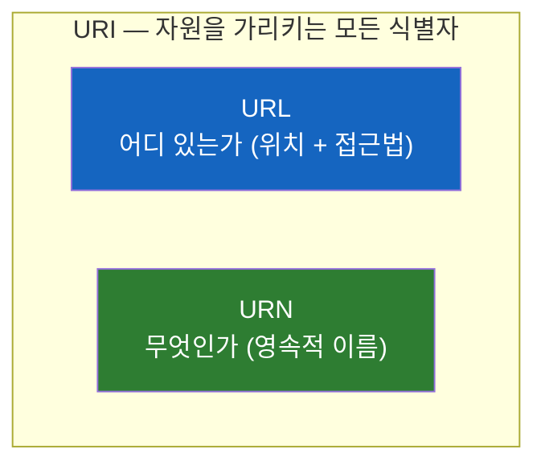
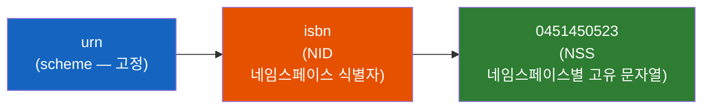
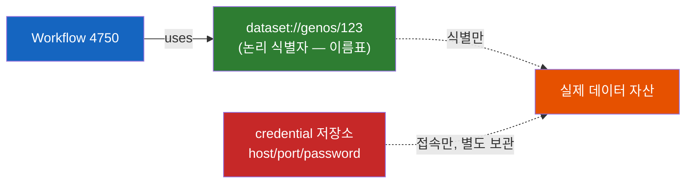

# URN은 왜 '주소'가 아니라 '이름'일까?

> URL은 매일 쓰는데 URN은 왜 낯설까? "위치"가 아니라 "이름"으로 자원을 가리킨다는 게 무슨 뜻이고, 왜 그게 필요할까?

## 결론부터 말하면

**URN(Uniform Resource Name)은 자원이 "어디에 있는지"가 아니라 "무엇인지"를 가리키는 식별자다.** URL이 집의 *주소*라면, URN은 그 집에 사는 *사람의 이름*이다. 사람이 이사를 가도 이름은 그대로이듯, 자원이 옮겨지거나 사라져도 URN은 변하지 않는다.

그리고 핵심 관계 하나만 기억하면 된다. **URL과 URN은 둘 다 URI라는 더 큰 우산 아래에 있다.**



| 구분 | 질문 | 예시 | 자원이 옮겨지면? |
|------|------|------|------------------|
| **URL** | "어디서 가져오나?" | `https://example.com/book.pdf` | **깨진다** (404) |
| **URN** | "그게 정확히 뭔가?" | `urn:isbn:0451450523` | **그대로 유효** |
| **URI** | (둘을 포함하는 상위 개념) | 위 둘 다 URI | — |

## 1. 왜 '이름'이 따로 필요할까?

URL은 너무 자연스러워서 의심할 일이 없다. 브라우저 주소창에 `https://blog.example.com/2020/post.html`을 치면 그 글이 뜬다. 잘 동작한다. 그런데 여기엔 숨은 약점이 있다.

URL은 **"위치 + 접근 방법"** 을 담는다. `https`는 접근 프로토콜이고, `blog.example.com`은 서버 위치이고, `/2020/post.html`은 그 서버 안의 경로다. 즉 URL은 본질적으로 "이 자원이 지금 *여기에* 있고 *이렇게* 가져와라"라는 지시다.

그래서 문제가 생긴다. 블로그가 도메인을 바꾸거나, 글을 다른 폴더로 옮기거나, 서버를 갈아엎으면 그 URL은 죽는다. 우리가 매일 만나는 "링크 깨짐(broken link)"의 정체가 이것이다. 자원 자체는 멀쩡히 존재하는데, *위치를 기준으로 이름을 붙였기 때문에* 위치가 바뀌는 순간 식별자가 무용지물이 된다.

이상하지 않은가? **셰익스피어의 『로미오와 줄리엣』 특정 판본은 그 책이 어느 도서관 어느 서가에 꽂혀 있든 똑같은 책이다.** 그런데 URL로 가리키면 "어느 서가"가 바뀔 때마다 식별자가 바뀐다. 우리가 정말 가리키고 싶은 건 *그 책*이지 *그 서가*가 아닌데 말이다.

여기서 URN이 등장한다.

## 2. 핵심 개념: URI, URL, URN의 가족 관계

용어가 셋이라 헷갈리니 정의부터 순서대로 깔고 가자.

**URI(Uniform Resource Identifier)** 가 가장 위에 있는 우산 개념이다. "자원을 고유하게 가리키는 문자열"이면 전부 URI다. 그 아래에 두 가지 방식이 있다.

**URL(Uniform Resource Locator)** 은 자원을 **위치(Location)** 로 가리킨다. "어디 있고 어떻게 접근하는가." 우리가 매일 쓰는 그것이다.

**URN(Uniform Resource Name)** 은 자원을 **이름(Name)** 으로 가리킨다. "이것이 무엇인가." 위치나 접근 방법은 말하지 않는다.

위키백과의 비유가 가장 깔끔하다.

> URN은 사람의 *이름*과 같고, URL은 그 사람의 *집 주소*와 같다. URN은 대상을 식별하고, URL은 그것을 찾아가는 방법을 제공한다.

여기서 자주 나오는 오해 하나를 짚자. **"URL과 URI는 다른 거 아닌가요?"** — 아니다. 모든 URL은 URI다. URL은 URI의 한 종류(위치로 식별하는 종류)일 뿐이다. 마찬가지로 모든 URN도 URI다. 즉 다음이 성립한다.

$$
\text{URL} \subseteq \text{URI}, \quad \text{URN} \subseteq \text{URI}
$$

실무에서 "URI vs URL"을 구분하느라 진땀 빼는 경우가 많은데, 대부분의 일상 대화에서는 둘을 섞어 써도 큰 문제가 없다. 진짜 구분이 중요해지는 지점은 **"위치로 가리킬 것인가, 이름으로 가리킬 것인가"** 라는 선택, 즉 URL이냐 URN이냐의 갈림길이다.

## 3. URN은 어떻게 생겼나 — RFC 8141 문법

URN은 막연한 개념이 아니라 IETF가 정한 정식 문법이 있다. 1997년 RFC 2141로 처음 정의됐고, 2017년 RFC 8141이 현재 표준이다. 기본 구조는 이렇다.

```
urn:<NID>:<NSS>
```

`urn:isbn:0451450523`을 쪼개 보면 세 조각으로 나뉜다.



- **`urn:`** — scheme 자리에 항상 `urn`이 고정으로 온다. `http:`, `ftp:`가 들어갈 자리에 `urn:`이 박혀 있다고 보면 된다. (대소문자 구분 없음)
- **NID(Namespace Identifier)** — "어떤 이름 체계인가"를 말한다. `isbn`은 국제표준도서번호 체계, `uuid`는 범용 고유 식별자 체계다.
- **NSS(Namespace-Specific String)** — 그 체계 안에서의 실제 고유 값. ISBN이면 책 번호, UUID면 128-bit 식별자 값이다(UUIDv4처럼 난수 기반인 버전도 있다).

널리 쓰이는 실제 URN들을 보면 감이 온다.

| URN | 가리키는 것 |
|------|-------------|
| `urn:isbn:0451450523` | 특정 판본의 책 (어느 서점에 있든 동일) |
| `urn:uuid:6e8bc430-9c3a-11d9-9669-0800200c9a66` | 전역 고유 ID (등록 기관조차 불필요) |
| `urn:ietf:rfc:2648` | IETF의 RFC 2648 문서 |
| `urn:issn:0167-6423` | 특정 학술지(연속 간행물) |

여기서 결정적인 성질 두 가지가 드러난다. 첫째, **URN은 굳이 "해석(resolve)" 되지 않아도 된다.** URL을 브라우저에 넣으면 DNS가 도메인을 IP로 바꾸고 실제 자원을 가져온다. 하지만 `urn:isbn:0451450523`을 어딘가에 넣는다고 책 PDF가 다운로드되지는 않는다. URN의 임무는 *가져오기*가 아니라 *식별*이기 때문이다. 둘째, 그래서 **URN은 자원이 사라진 뒤에도 영속적으로 유효하다.** 절판된 책의 ISBN URN도 "그 책"을 가리키는 이름으로서 영원히 의미를 가진다.

## 4. 실제 사례: 데이터 플랫폼이 데이터 자산을 가리키는 법

이 개념이 추상적으로 느껴진다면, 실무에서 어떻게 쓰이는지 보면 단번에 와닿는다. AI 에이전트 플랫폼(GenOS)에서 "어떤 워크플로가 어떤 데이터를 쓰는지"를 기록하는 상황을 보자.

여기서 워크플로가 사용하는 데이터 자산(벡터 DB, 데이터셋, 외부 DB 테이블, 파일 등)을 **데이터 소스** 로 등록한다. 그런데 이 데이터 소스를 무엇으로 가리킬까? 가장 먼저 떠오르는 건 DB 접속 정보, 즉 host/port/credential이 박힌 JDBC URL이다. 하지만 그건 위험하다. 비밀번호가 식별자에 섞여 들어가고, DB 서버를 옮기면 식별자가 통째로 바뀐다. 우리가 정작 알고 싶은 건 "이 워크플로가 *그 데이터 자산*을 쓴다"는 사실인데, 접속 정보로 가리키면 *접속 경로*가 바뀔 때마다 관계가 끊어진다.

정확히 1절에서 본 URL의 약점이다. 그래서 이 플랫폼은 데이터 자산에 **접속 정보가 아닌 '논리적 이름'을 붙인다.** 즉 URN의 정신을 빌린 내부 식별자를 쓴다.

| 데이터 소스 식별자 | 뜻 |
|------|------|
| `dataset://genos/123` | 플랫폼 내부 dataset id 123 — 저장 위치가 바뀌어도 id는 그대로 |
| `vdb://genos/customer_vectors` | 내부 벡터 인덱스의 논리 이름 |
| `dataset://genos/456` | 또 다른 내부 데이터셋 |

여기서 가장 중요한 건 식별자에 **위치나 접속 정보를 녹이지 않는다**는 점이다. `dataset://genos/123`은 그 데이터셋이 실제로 어느 서버·어느 디스크에 있든 동일하게 유지된다. 물리적 위치(host, 디스크)와 접속 수단(password, token)은 전부 별도 계층에 두고, 식별자는 오직 "이게 무엇인가"만 말한다.

그리고 절대 규칙 하나. **식별자에 password, token, secret을 넣지 않는다.** URN의 핵심 정신이 곧 "identity(무엇인가)와 access(어떻게 접속하나)의 분리"이기 때문이다.



여기서 솔직하게 두 가지를 짚어야 한다.

첫째, **이 내부 식별자들은 엄밀히 말하면 표준 URN이 아니다.** RFC 8141 기준 정식 URN은 반드시 `urn:` scheme으로 시작한다(`urn:isbn:...`). `dataset://genos/123`은 형식상 커스텀 scheme의 URI일 뿐, 표준 URN은 아니다. 다만 "위치·접속이 아니라 영속적 이름으로 식별한다"는 *역할*을 URN에서 빌려 왔기에 흔히 "URN처럼 쓴다"고 말할 뿐이다. 정확히는 **logical/persistent resource identifier(논리 식별자)** 라고 부르는 편이 안전하다.

둘째, 외부 자원(`s3://bucket/path/file.csv` 같은 경로, 외부 DB의 host:port)은 본질적으로 위치 정보를 품고 있어 그대로 두면 URL에 가깝다 — 경로가 바뀌면 깨지는, 1절에서 본 그 약점을 그대로 갖는다. 그래서 이런 외부 자원일수록 `dataset://genos/...` 같은 내부 논리 식별자 계층을 한 겹 덧씌워, 실제 위치가 바뀌어도 워크플로와 데이터의 *관계*는 끊기지 않게 만드는 것이 핵심 가치다. 이것은 ISBN·DOI 같은 표준 URN이 별도의 **resolver**(이름 → 실제 위치 URL로 변환해 주는 해석기)를 두어 "식별"과 "접근"을 분리하는 것과 같은 발상이다.

## 5. 정리

### 핵심 포인트

1. **URN = 위치가 아닌 '이름'으로 자원을 식별**
   - URL은 "어디 있고 어떻게 접근하나", URN은 "이것이 무엇인가"
   - 자원이 옮겨지거나 사라져도 URN은 영속적으로 유효하다

2. **URI는 우산, URL과 URN은 그 아래 두 방식**
   - $\text{URL} \subseteq \text{URI}$, $\text{URN} \subseteq \text{URI}$
   - "URL이냐 URI냐"보다 "위치로 가리킬까, 이름으로 가리킬까"가 진짜 갈림길

3. **문법은 `urn:<NID>:<NSS>` (RFC 8141)**
   - 예: `urn:isbn:0451450523`, `urn:uuid:...`
   - 해석(resolve)이 강제되지 않는다 — 임무는 *가져오기*가 아니라 *식별*

4. **표준 URN과 'URN처럼 쓰는' 논리 식별자는 구분**
   - 표준 URN은 반드시 `urn:` scheme (RFC 8141). `dataset://genos/123`은 표준 URN이 아니라 커스텀 scheme의 logical/persistent resource identifier다
   - 다만 둘 다 공유하는 핵심은 같다 — credential·위치를 섞지 않고 "무엇인지"만 가리키는, identity와 access의 분리

## 출처

- [RFC 8141 — Uniform Resource Names (URNs)](https://datatracker.ietf.org/doc/html/rfc8141) — IETF 현행 표준
- [RFC 2141 — URN Syntax](https://datatracker.ietf.org/doc/html/rfc2141) — 최초 정의(1997)
- [Uniform Resource Name — Wikipedia](https://en.wikipedia.org/wiki/Uniform_Resource_Name)
- [Uniform Resource Identifier — Wikipedia](https://en.wikipedia.org/wiki/Uniform_Resource_Identifier)
- [URL, URI, URN: What's the Difference? — Auth0](https://auth0.com/blog/url-uri-urn-differences)
