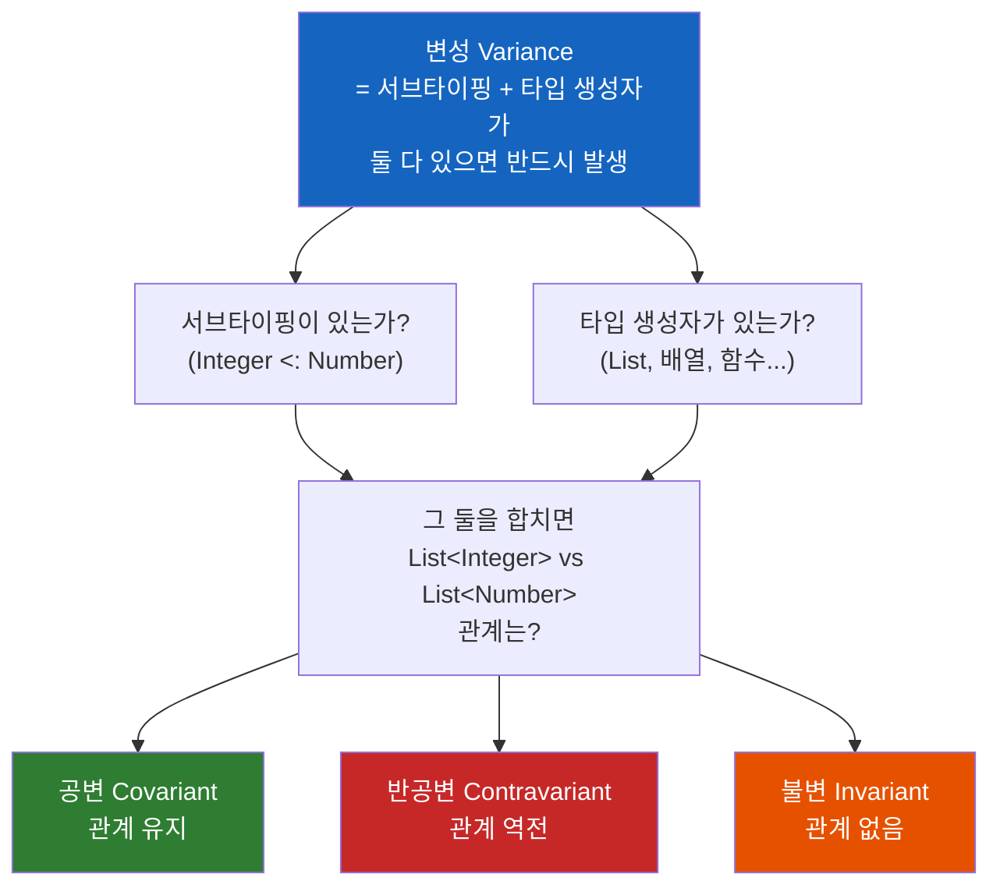
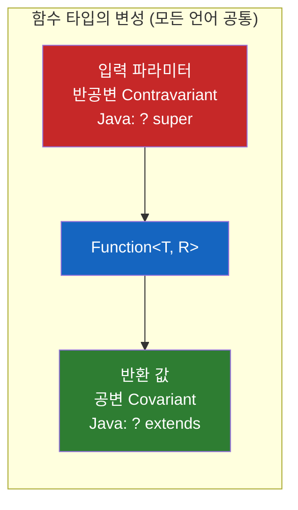

# 공변과 반공변은 제네릭 전용 문법이 아니다

자바 제네릭을 깊게 파다 만난 그 `? extends` / `? super`. 사실 배열에도, 함수에도, 심지어 파이썬에도 똑같이 있다. 왜 언어를 가리지 않고 어디서나 똑같은 모습으로 나타날까?

## 결론부터 말하면

**공변(covariance)/반공변(contravariance)은 제네릭의 기능도, 자바의 기능도 아니다.** "서브타이핑(subtyping)"과 "타입 생성자(type constructor)"가 **둘 다 존재하는 언어라면 무조건 마주치는 타입 이론의 보편 개념**이다. 자바 제네릭의 와일드카드는 이 보편 문제에 대한 하나의 답안지일 뿐이고, 파이썬도 타입 힌트 차원에서 똑같이 성립한다.



| 질문 | 답 |
|------|----|
| 공변·반공변은 제네릭에만 있는가? | **아니다.** 배열·메서드 반환 타입·함수 타입에도 나타난다 |
| 자바에만 있는가? | **아니다.** Kotlin·Scala·C#·Python 등 타입 시스템이 있는 언어 전반 |
| 파이썬도 성립하는가? | **성립한다.** `TypeVar(covariant=...)`, PEP 695. 단 정적 검사기 차원 |

## 1. 왜 "이건 제네릭/자바 얘기"라고 착각하게 될까?

대부분의 개발자가 공변·반공변이라는 단어를 처음 만나는 곳은 **자바 제네릭의 와일드카드** 다. `List<? extends Number>`가 왜 필요한지 배우다가, "이걸 공변이라고 부른다"는 설명을 듣는다. 그래서 자연스럽게 **"공변/반공변 = 제네릭 와일드카드 문법"** 이라는 등식이 머릿속에 박힌다.

하지만 이건 원인과 결과를 뒤집은 오해다. 제네릭 와일드카드가 있어서 변성이 생긴 게 아니라, **변성이라는 보편적인 문제가 먼저 있었고, 자바가 그걸 와일드카드로 푼 것**이다. 그 증거로, 자바에는 제네릭이 없던 시절(자바 1.0)부터 이미 변성이 작동하고 있었다. 바로 배열에서.

이 오해를 풀려면, 먼저 변성이라는 단어가 정확히 무엇을 가리키는지부터 쌓아 올려야 한다.

## 2. 변성이란 무엇인가 — 한 단계씩 쌓기

### 2.1 1단계: 서브타이핑

먼저 **서브타이핑(subtyping)** 이다. 어떤 타입 `S`의 값을 `T`가 와야 할 자리에 항상 넣을 수 있으면, `S`는 `T`의 서브타입이고 `S <: T`로 쓴다. 자바에서 `Integer`는 `Number`의 서브타입이다(`Integer <: Number`). `Number`를 요구하는 자리에 `Integer`를 넣어도 아무 문제가 없기 때문이다.

```java
Number n = Integer.valueOf(42);   // OK — Integer <: Number
```

### 2.2 2단계: 타입 생성자

다음은 **타입 생성자(type constructor)** 다. 이름이 거창하지만, **"타입을 받아서 새로운 타입을 만들어내는 무언가"** 일 뿐이다. `List<T>`는 타입 `T`를 받아 `List<Integer>`, `List<Number>` 같은 새 타입을 찍어낸다. `T[]`(배열)도, `Function<T, R>`(함수)도 모두 타입 생성자다. 제네릭은 그저 **타입 생성자의 한 종류**에 불과하다.

### 2.3 3단계: 직관과 그 직관이 흔들리는 순간

이제 두 가지를 합쳐보자. `Integer <: Number`라는 관계가 있는데, 이걸 `List<...>`라는 타입 생성자에 통과시키면 어떻게 될까? 직관적으로는 "`List<Integer>`도 `List<Number>`의 서브타입이겠지"라고 기대하게 된다.

**바로 이 "타입 생성자를 통과시켰을 때 원래의 서브타입 관계가 어떻게 되는가"가 변성이다.** 결과는 셋 중 하나다.

| 종류 | 정의 (`Integer <: Number`일 때) | 방향 |
|------|--------------------------------|------|
| 공변 (Covariant) | `F<Integer> <: F<Number>` | 서브타입 관계 **유지** |
| 반공변 (Contravariant) | `F<Number> <: F<Integer>` | 서브타입 관계 **역전** |
| 불변 (Invariant) | 둘 사이에 아무 관계 없음 | — |

여기서 핵심은, 이 세 가지 중 무엇이 **"안전한가"** 는 타입 생성자가 그 타입을 **읽는 데 쓰는지(생산), 쓰는 데 쓰는지(소비)** 에 따라 갈린다는 점이다. 이게 그 유명한 **PECS** 원칙으로 이어진다 — *Producer Extends, Consumer Super* (Joshua Bloch, *Effective Java*). **값을 꺼내기만(생산)** 하면 공변이 안전하고, **값을 넣기만(소비)** 하면 반공변이 안전하다.

## 3. 제네릭 밖에서도 변성은 이미 작동한다

이제 자바 안에서 제네릭이 아닌 곳들을 보자. 변성은 이미 여러 군데서 돌아가고 있다.

### 3.1 배열은 공변 — 그것도 위험하게

자바 **배열은 공변** 이다. 제네릭이 나오기 한참 전부터 그랬다.

```java
Object[] arr = new String[3];   // 컴파일 OK! String[] <: Object[] (공변)
arr[0] = Integer.valueOf(42);   // 컴파일 통과... 런타임에 ArrayStoreException 💥
```

`String[]`을 `Object[]`로 받을 수 있다는 건(공변), 곧 그 배열에 `Integer`를 넣는 코드도 컴파일을 통과한다는 뜻이다. 하지만 실제 배열은 `String[]`이므로 런타임에 터진다. **"가변 컨테이너 + 공변 = 타입 안전성 붕괴"** 의 전형적 사례다.

그럼 자바는 왜 이 위험을 감수했을까? 제네릭이 없던 시절, 배열 공변은 **다형적 유틸리티를 작성할 유일한 방법** 이었다. `void sort(Object[] a)` 하나로 `String[]`, `Integer[]` 같은 모든 참조 타입 배열을 정렬하려면 `String[] <: Object[]`가 성립해야 했다(primitive 배열 `int[]`은 공변에 참여하지 않는다). 타입 안전성과 코드 재사용성 사이의 타협이었던 셈이다.

자바 설계자들은 이 실수에서 배웠다. 그래서 나중에 나온 **제네릭은 의도적으로 불변(invariant)** 으로 만들었다 — `List<String>`은 `List<Object>`의 서브타입이 아니다. 와일드카드(`? extends`, `? super`)는 바로 이 "기본 불변"에다 필요할 때만 변성을 다시 끼워넣는 안전장치다.

### 3.2 메서드 반환 타입은 공변 (Covariant Return Type)

오버라이딩할 때 반환 타입을 더 좁은 타입으로 바꿀 수 있는 것. 이것도 변성이다(자바 5부터).

```java
class Animal { Animal reproduce() { ... } }
class Cat extends Animal {
    @Override
    Cat reproduce() { ... }   // 더 구체적인 타입 반환 OK — 공변 반환
}
```

### 3.3 함수 타입: 인자는 반공변, 반환은 공변

가장 보편적인 변성은 **함수 타입**에 있다. 어떤 함수를 다른 함수가 와야 할 자리에 안전하게 끼워 넣으려면, **인자는 더 넓게(반공변), 반환은 더 좁게(공변)** 받아야 한다. 더 넓은 입력을 받고 더 좁은 출력을 내는 함수는 언제나 더 까다로운 계약을 만족시키기 때문이다.



자바 `Function<T, R>` 인터페이스 자체에는 변성이 없지만, 그 함수를 **받아 쓰는 자리**에서 변성이 드러난다. `Stream.map`의 시그니처가 대표적인데, 이건 4장에서 볼 자바의 **사용 지점 변성**(use-site)이 함수 타입에 적용된 모습이기도 하다.

```java
// Stream.map의 시그니처 — 함수를 받는 자리에서 인자는 ? super(반공변), 결과는 ? extends(공변)
<R> Stream<R> map(Function<? super T, ? extends R> mapper);
```

## 4. 자바만의 이야기도 아니다 — "어디서 선언하느냐"의 차이

변성은 객체지향 언어 전반이 공유한다. 다만 언어마다 **변성을 표현하는 위치**가 다르다. 자바만 보면 이 차이가 안 보인다.

| 방식 | 설명 | 언어 |
|------|------|------|
| **사용 지점 변성** (use-site) | 타입을 **쓸 때마다** 와일드카드로 변성 지정 | **Java** (`? extends`, `? super`) |
| **선언 지점 변성** (declaration-site) | 타입을 **정의할 때** 한 번 변성 지정 | **Kotlin** (`out`/`in`), **Scala** (`+T`/`-T`), **C#** (`out`/`in`) |

```kotlin
// Kotlin — 선언할 때 out(공변)/in(반공변)을 한 번만 박아둔다
interface Producer<out T> { fun produce(): T }      // 공변 (값을 생산만)
interface Consumer<in T> { fun consume(item: T) }   // 반공변 (값을 소비만)
```

자바의 `? extends`(공변)는 Kotlin의 `out`에, `? super`(반공변)는 Kotlin의 `in`에 대응한다. 똑같은 개념을 "쓸 때 지정 vs 만들 때 지정"으로 다르게 푼 것뿐이다. 심지어 Kotlin의 `out`/`in`이라는 키워드 선택 자체가 PECS와 같은 직관이다 — **out**(밖으로 나가는, 생산) = 공변, **in**(안으로 들어오는, 소비) = 반공변.

## 5. 파이썬도 성립한다 — 단, "정적 검사기" 차원에서

자, 핵심 질문이다. 파이썬도 공변·반공변이 성립할까? **성립한다.** 다만 파이썬만의 특수성이 하나 있다.

파이썬은 런타임에는 **덕 타이핑(duck typing)** 이라 타입을 신경 쓰지 않는다. 변성은 **타입 힌트(PEP 484) + 정적 타입 검사기(mypy, pyright, ty 등)** 의 세계에서만 의미가 있다. 즉 "런타임 동작"이 아니라 **"타입 검사기가 코드를 통과시키느냐 막느냐"** 의 문제다. 이게 컴파일러가 변성을 강제하는 자바와 결정적으로 다른 지점이다.

### 5.1 기존 방식 — TypeVar에 직접 명시 (3.12+에서도 유효)

```python
from typing import TypeVar, Generic

T_co = TypeVar("T_co", covariant=True)              # 공변
T_contra = TypeVar("T_contra", contravariant=True)  # 반공변

class Producer(Generic[T_co]):       # 값을 생산만 → 공변
    def produce(self) -> T_co: ...

class Consumer(Generic[T_contra]):   # 값을 소비만 → 반공변
    def consume(self, item: T_contra) -> None: ...
```

보다시피 Kotlin/Scala처럼 **선언 지점 변성** 이다. 관례적으로 변수명에 `_co`/`_contra` 접미사까지 붙인다. 그리고 검사기는 변성 규칙을 위반하면 잡아낸다 — 공변 타입 변수를 메서드 인자(소비 위치)에 쓰면 `invalid-variance` 에러가 난다.

### 5.2 새 방식 (Python 3.12+, PEP 695) — 변성 자동 추론

Python 3.12의 PEP 695는 한 발 더 나아갔다. **변성을 직접 쓸 필요 없이, 검사기가 사용 패턴을 보고 자동으로 추론** 한다.

```python
# Python 3.12+ 신문법: T를 어떻게 쓰는지 보고 검사기가 변성을 자동 추론
class Producer[T]:
    def produce(self) -> T: ...   # T를 반환만 하면 → 공변으로 추론
```

PEP 695 명세는 이를 `infer_variance`로 정의한다 — 신문법으로 만든 타입 변수는 항상 `__infer_variance__`가 `True`이고, 검사기가 "T가 반환 위치에만 쓰이면 공변, 인자 위치에만 쓰이면 반공변, 양쪽 다면 불변"으로 계산한다.

### 5.3 표준 라이브러리도 이미 변성을 쓴다

- `typing.Callable[[Arg], Ret]` → 인자에 **반공변**, 반환에 **공변** (자바 `Function`과 완전히 동일한 원리)
- 읽기 전용 `Sequence[T]`(공변 가능) vs 가변 `list[T]`(불변)의 설계 차이

마지막 항목이 흥미롭다. 파이썬의 `list`가 왜 불변으로 설계됐는지 보면, **3.1절의 자바 배열 함정과 정확히 같은 이유** 임을 알 수 있다.

```python
# mypy 기준 — 왜 list는 공변이면 안 되는가 (자바 배열 ArrayStoreException과 같은 함정)
def add_int(items: list[object]) -> None:
    items.append(42)

nums: list[str] = ["a"]
add_int(nums)   # ❌ mypy 에러: list[str]는 list[object]가 아니다 (list는 불변)
                #    만약 허용했다면 nums에 int 42가 섞여 런타임에 깨진다
```

자바는 배열에서 이걸 런타임 예외(`ArrayStoreException`)로 뒤늦게 잡고, 파이썬 mypy는 `list`를 불변으로 막아 정적 단계에서 잡는다. 언어와 시점은 달라도 **타입 이론이 내리는 결론은 동일하다.**

## 6. 정리

### 핵심 포인트

1. **공변·반공변은 "제네릭"이나 "자바"의 기능이 아니라 타입 이론의 보편 개념이다**
   - 서브타이핑 + 타입 생성자가 둘 다 있으면 어떤 언어든 반드시 마주친다. 제네릭은 타입 생성자의 한 종류일 뿐이다.

2. **자바 안에서도 제네릭 밖에 변성이 산다**
   - 배열(공변, 그래서 위험), 메서드 반환 타입(공변), 함수 타입(인자 반공변·반환 공변). 제네릭이 불변으로 설계된 건 배열 공변의 실패에서 배운 결과다.

3. **언어마다 표현 위치가 다를 뿐, 개념은 같다**
   - 자바는 사용 지점(`? extends`/`? super`), Kotlin·Scala·C#은 선언 지점(`out`/`in`, `+T`/`-T`). PECS의 직관이 그대로 이어진다.

4. **파이썬도 성립한다 — 단 정적 검사기 차원**
   - `TypeVar(covariant=...)`, PEP 695의 자동 추론, `Callable`의 반공변/공변. 런타임이 아닌 mypy·pyright가 강제한다는 점만 자바와 다르다. Java의 PECS와 Python의 `_co`/`_contra`는 같은 직관이다.

## 출처

- [PEP 695 – Type Parameter Syntax](https://peps.python.org/pep-0695/) — 공식 문서, 변성 자동 추론(`infer_variance`)
- [PEP 484 – Type Hints](https://peps.python.org/pep-0484/) — 공식 문서, `TypeVar`의 `covariant`/`contravariant`
- [Covariance and contravariance in subtyping — Eli Bendersky](https://eli.thegreenplace.net/2018/covariance-and-contravariance-in-subtyping/)
- [Generics and Variance with Java — Nested Software](https://nestedsoftware.com/2025/09/20/generics-and-variance-with-java-27a2.2796441.html)
- [Pyrefly Error Kinds — invalid-variance / variance-mismatch](https://pyrefly.org/en/docs/error-kinds/)
- Joshua Bloch, *Effective Java* — PECS (Producer Extends, Consumer Super)
