# 동기-비동기, 블로킹-논블로킹 완전 정복

컴퓨터 사이언스 관점에서 동기/비동기, 블로킹/논블로킹의 정확한 개념과 차이점

## 결론부터 말하면

**동기/비동기**와 **블로킹/논블로킹**은 **서로 다른 관점**의 개념입니다.

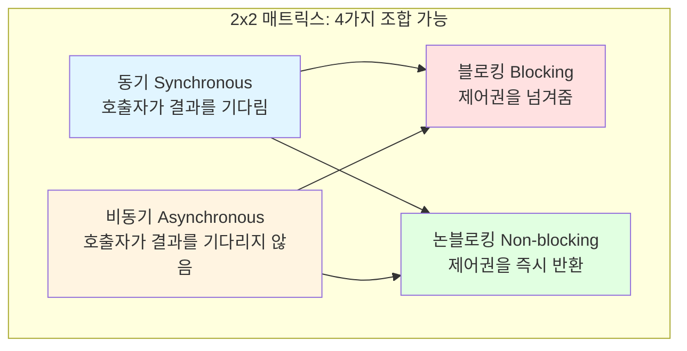

| 조합 | 설명 | 실제 사용 예 | 빈도 |
|------|------|------------|------|
| **동기 + 블로킹** | 결과 기다림 + 제어권 넘김 | 일반 함수 호출, JDBC | ⭐⭐⭐⭐⭐ 매우 흔함 |
| **비동기 + 논블로킹** | 결과 안 기다림 + 제어권 즉시 반환 | Node.js, JavaScript, Java NIO | ⭐⭐⭐⭐⭐ 매우 흔함 |
| **동기 + 논블로킹** | 결과 기다림 + 제어권 즉시 반환 | polling 방식 | ⭐⭐ 드뭄 |
| **비동기 + 블로킹** | 결과 안 기다림 + 제어권 넘김 | 특수한 경우 | ⭐ 매우 드뭄 |

**핵심 차이:**

```python
# ========== 관점의 차이 ==========

# 동기/비동기 (Synchronous/Asynchronous)
# → "호출자" 관점: 결과를 기다리는가?
# → 작업 완료 여부를 누가 신경쓰는가?

# 블로킹/논블로킹 (Blocking/Non-blocking)
# → "제어권" 관점: 즉시 리턴하는가?
# → 호출된 함수가 제어권을 바로 돌려주는가?
```

**왜 "동기=블로킹", "비동기=논블로킹"으로 자주 묶이는가?**
- 대부분의 시스템에서 **자연스러운 조합**이기 때문
- 하지만 **개념적으로는 독립적**이며, 4가지 조합 모두 가능

## 1. 동기 vs 비동기 (Synchronous vs Asynchronous)

### 정의

**동기 (Synchronous)**: 호출자가 **결과를 기다림**

**비동기 (Asynchronous)**: 호출자가 **결과를 기다리지 않음**

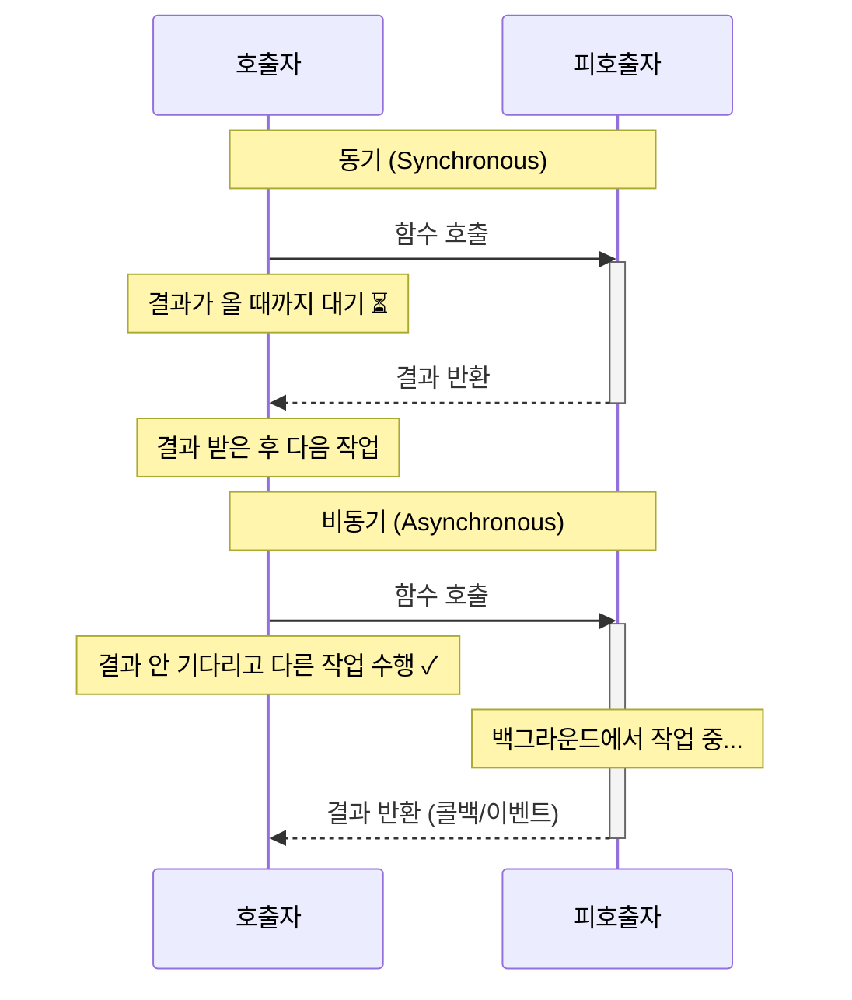

### 코드 예시

```python
import time
import threading

# ========== 동기 (Synchronous) ==========
def synchronous_task():
    print("작업 시작")
    time.sleep(2)  # 2초 걸리는 작업
    print("작업 완료")
    return "결과"

# 호출자가 결과를 기다림
result = synchronous_task()  # 2초 동안 대기 ⏳
print(f"받은 결과: {result}")
# 다음 작업은 2초 후에 실행됨


# ========== 비동기 (Asynchronous) ==========
def asynchronous_task(callback):
    def work():
        print("작업 시작")
        time.sleep(2)  # 2초 걸리는 작업
        result = "결과"
        callback(result)  # 완료 후 콜백 호출

    # 별도 스레드에서 실행
    thread = threading.Thread(target=work)
    thread.start()
    # 즉시 리턴 (결과를 기다리지 않음)

# 호출자가 결과를 기다리지 않음
def on_complete(result):
    print(f"받은 결과: {result}")

asynchronous_task(on_complete)  # 즉시 리턴 ✓
print("다른 작업 수행 가능")  # 즉시 실행됨
# 출력 순서:
# 작업 시작
# 다른 작업 수행 가능
# (2초 후) 받은 결과: 결과
```

### Java 예시

```java
// ========== 동기 (Synchronous) ==========
public class SynchronousExample {
    public String fetchData() {
        // 호출자가 결과를 기다림
        Thread.sleep(2000);
        return "데이터";
    }

    public void execute() {
        String result = fetchData();  // 2초 대기 ⏳
        System.out.println("결과: " + result);
    }
}


// ========== 비동기 (Asynchronous) ==========
import java.util.concurrent.CompletableFuture;

public class AsynchronousExample {
    public CompletableFuture<String> fetchData() {
        // 호출자가 결과를 기다리지 않음
        return CompletableFuture.supplyAsync(() -> {
            Thread.sleep(2000);
            return "데이터";
        });
    }

    public void execute() {
        CompletableFuture<String> future = fetchData();  // 즉시 리턴 ✓
        System.out.println("다른 작업 수행");  // 즉시 실행

        // 나중에 결과 필요할 때
        future.thenAccept(result -> {
            System.out.println("결과: " + result);
        });
    }
}
```

## 2. 블로킹 vs 논블로킹 (Blocking vs Non-blocking)

### 정의

**블로킹 (Blocking)**: 호출된 함수가 **제어권을 넘겨줌** (즉시 리턴 X)

**논블로킹 (Non-blocking)**: 호출된 함수가 **제어권을 즉시 반환** (즉시 리턴 O)

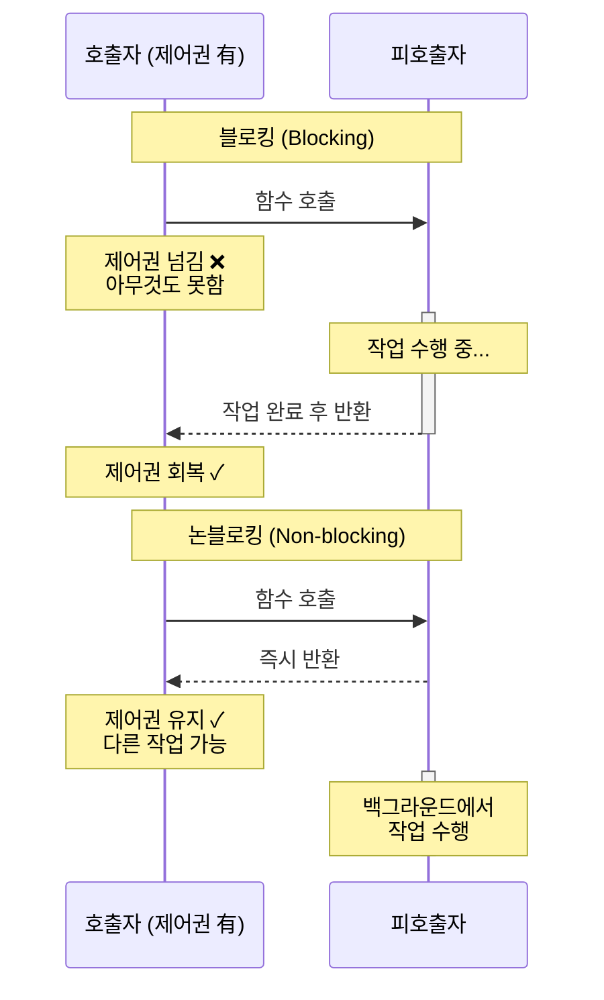

### 코드 예시 (파일 I/O)

```python
import os
import fcntl

# ========== 블로킹 (Blocking) ==========
def blocking_read(filename):
    with open(filename, 'r') as f:
        # 데이터가 준비될 때까지 대기 (제어권 넘김)
        data = f.read()  # ⏳ 블로킹
        return data

# 호출자는 read()가 끝날 때까지 아무것도 못함
data = blocking_read("file.txt")


# ========== 논블로킹 (Non-blocking) ==========
def nonblocking_read(filename):
    fd = os.open(filename, os.O_RDONLY | os.O_NONBLOCK)

    try:
        # 즉시 리턴 (제어권 유지)
        data = os.read(fd, 1024)  # ✓ 즉시 반환
        return data
    except BlockingIOError:
        # 데이터가 없으면 예외 발생 (즉시 리턴)
        return None
    finally:
        os.close(fd)

# 호출자는 즉시 제어권을 돌려받음
while True:
    data = nonblocking_read("file.txt")
    if data:
        break
    # 다른 작업 수행 가능
    print("아직 데이터 없음, 다른 작업 중...")
```

### Java 예시 (네트워크 I/O)

```java
// ========== 블로킹 (Blocking I/O) ==========
import java.io.*;
import java.net.*;

public class BlockingIO {
    public void readData() throws IOException {
        Socket socket = new Socket("localhost", 8080);
        InputStream in = socket.getInputStream();

        // 데이터가 올 때까지 대기 (제어권 넘김) ⏳
        byte[] buffer = new byte[1024];
        int bytesRead = in.read(buffer);  // 블로킹!

        System.out.println("데이터 읽음: " + bytesRead);
    }
}


// ========== 논블로킹 (Non-blocking I/O) ==========
import java.nio.*;
import java.nio.channels.*;

public class NonBlockingIO {
    public void readData() throws IOException {
        SocketChannel channel = SocketChannel.open();
        channel.configureBlocking(false);  // 논블로킹 설정
        channel.connect(new InetSocketAddress("localhost", 8080));

        ByteBuffer buffer = ByteBuffer.allocate(1024);

        // 즉시 리턴 (제어권 유지) ✓
        int bytesRead = channel.read(buffer);

        if (bytesRead == -1) {
            System.out.println("아직 데이터 없음");
            // 다른 작업 수행 가능
        } else {
            System.out.println("데이터 읽음: " + bytesRead);
        }
    }
}
```

## 3. 왜 "동기=블로킹", "비동기=논블로킹"으로 묶이는가?

### 자연스러운 조합

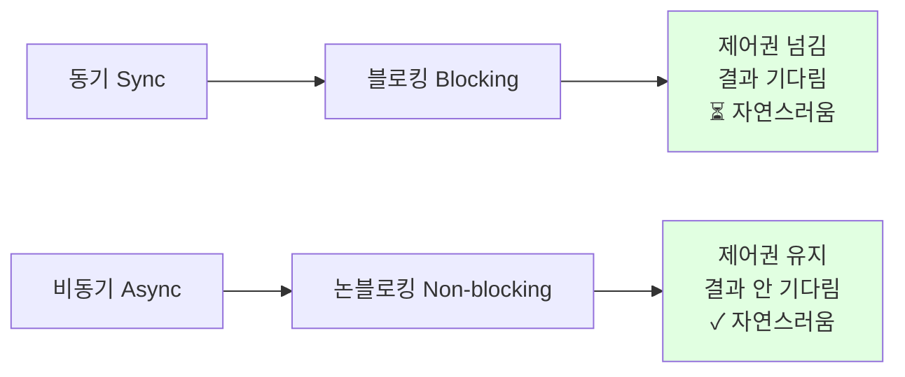

**동기 + 블로킹**이 자연스러운 이유:
```python
# 결과를 기다리는데 (동기)
# 제어권도 넘김 (블로킹)
# → 논리적으로 일관됨

result = database.query("SELECT * FROM users")  # 동기 + 블로킹
# 결과가 올 때까지 기다리고
# 그 동안 제어권도 없음
print(result)
```

**비동기 + 논블로킹**이 자연스러운 이유:
```python
# 결과를 기다리지 않는데 (비동기)
# 제어권을 즉시 돌려받음 (논블로킹)
# → 논리적으로 일관됨

future = database.query_async("SELECT * FROM users")  # 비동기 + 논블로킹
# 결과를 기다리지 않고
# 제어권을 즉시 돌려받음
print("다른 작업 수행")
future.then(result => print(result))
```

### 하지만 개념적으로는 독립적

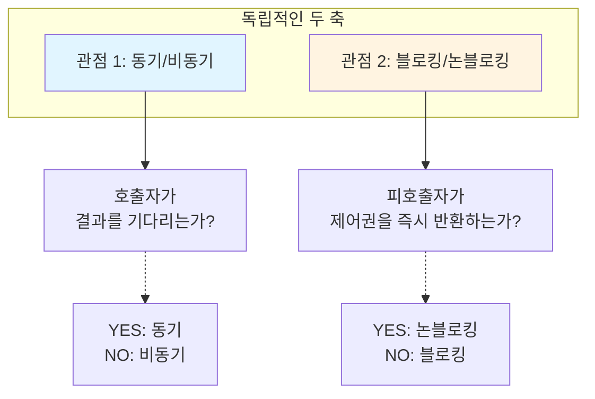

## 4. 네 가지 조합 완전 분석

### 조합 1: 동기 + 블로킹 ⭐⭐⭐⭐⭐

**가장 흔한 조합 - 일반적인 함수 호출**

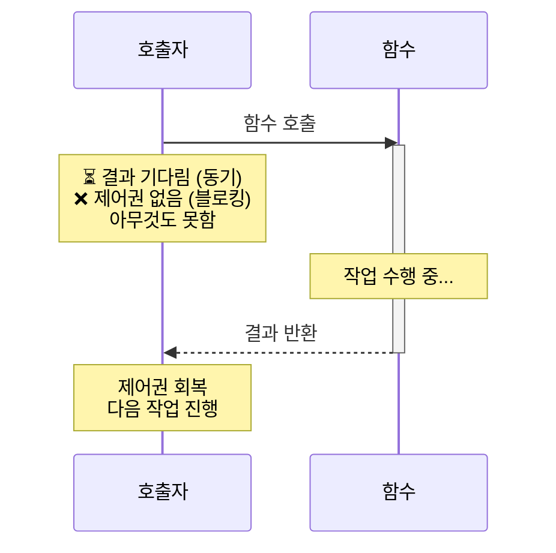

**실제 예시:**

```python
# Python - 일반 함수 호출
import time

def calculate(x, y):
    time.sleep(2)  # 계산에 2초 소요
    return x + y

# 동기 + 블로킹
result = calculate(10, 20)  # 2초 동안 대기 ⏳
print(result)  # 30
# → 결과를 기다리고 (동기)
# → 제어권도 없음 (블로킹)


# Java - JDBC 데이터베이스 쿼리
Connection conn = DriverManager.getConnection(url);
Statement stmt = conn.createStatement();

// 동기 + 블로킹
ResultSet rs = stmt.executeQuery("SELECT * FROM users");  // ⏳
// → 쿼리 결과를 기다리고 (동기)
// → 그 동안 제어권 없음 (블로킹)
```

**특징:**
- ✅ 코드가 단순하고 직관적
- ✅ 에러 처리 간단
- ❌ 성능 낮음 (대기 시간 낭비)
- ❌ 동시성 처리 어려움

---

### 조합 2: 비동기 + 논블로킹 ⭐⭐⭐⭐⭐

**두 번째로 흔한 조합 - 고성능 I/O**

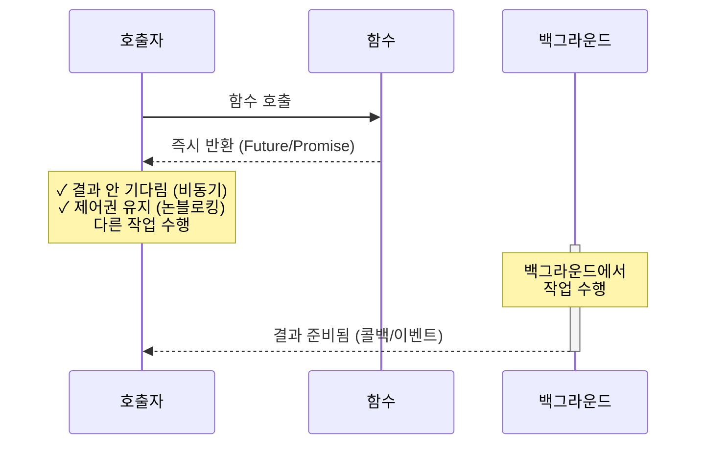

**실제 예시:**

```javascript
// JavaScript - fetch API
console.log("요청 시작");

// 비동기 + 논블로킹
fetch("https://api.example.com/users")
    .then(response => response.json())
    .then(data => console.log("데이터:", data));

console.log("다른 작업 수행");  // 즉시 실행 ✓

// 출력 순서:
// 요청 시작
// 다른 작업 수행
// 데이터: [...]
```

```java
// Java NIO - 비동기 논블로킹 I/O
import java.nio.channels.*;
import java.nio.*;
import java.util.concurrent.*;

Selector selector = Selector.open();
ServerSocketChannel serverChannel = ServerSocketChannel.open();
serverChannel.configureBlocking(false);  // 논블로킹 설정
serverChannel.register(selector, SelectionKey.OP_ACCEPT);

// 비동기 + 논블로킹
while (true) {
    selector.select();  // 이벤트 대기 (논블로킹)

    Set<SelectionKey> keys = selector.selectedKeys();
    for (SelectionKey key : keys) {
        if (key.isAcceptable()) {
            // 연결 수락 (논블로킹)
            SocketChannel client = serverChannel.accept();
            client.configureBlocking(false);
            // 다른 클라이언트 처리 가능 ✓
        }
    }
}
```

**특징:**
- ✅ 고성능 (대기 시간 활용)
- ✅ 높은 동시성
- ❌ 코드 복잡도 증가
- ❌ 디버깅 어려움

---

### 조합 3: 동기 + 논블로킹 ⭐⭐

**드문 조합 - Polling 방식**

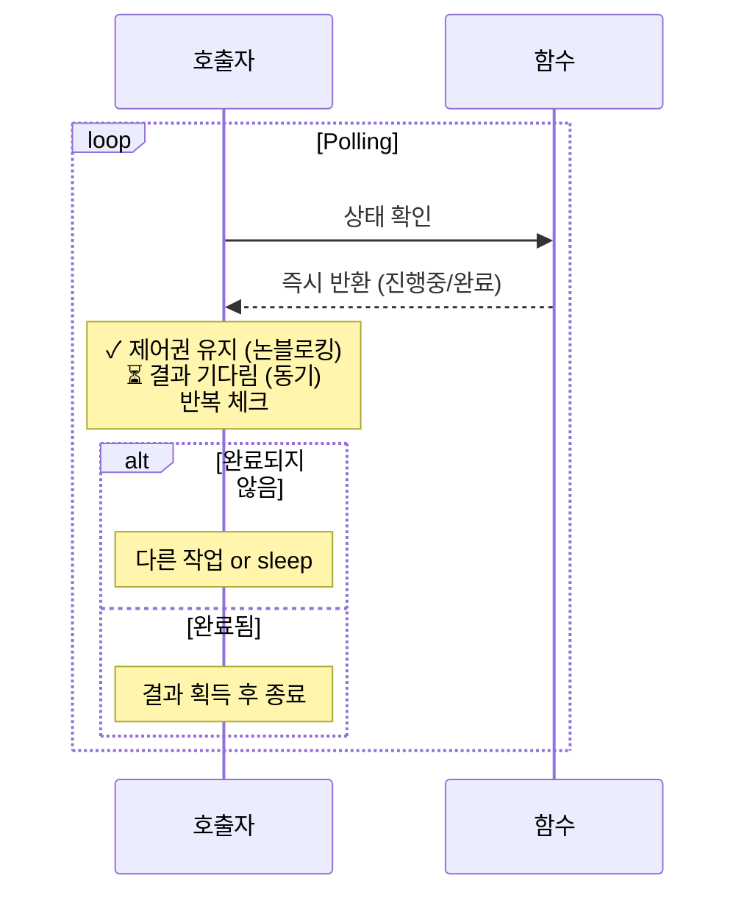

**실제 예시:**

```python
# Python - 논블로킹 소켓 + Polling
import socket
import time

sock = socket.socket()
sock.setblocking(False)  # 논블로킹 설정

try:
    sock.connect(("localhost", 8080))
except BlockingIOError:
    pass  # 논블로킹이라 즉시 리턴

# 동기 + 논블로킹 (Polling)
while True:
    try:
        # 논블로킹: 즉시 리턴
        data = sock.recv(1024)
        if data:
            print("데이터 받음:", data)
            break  # 동기: 결과를 기다렸음
    except BlockingIOError:
        # 아직 데이터 없음
        print("대기 중... 다른 작업 가능")
        time.sleep(0.1)  # 잠깐 대기 후 다시 확인
```

```java
// Java NIO - 논블로킹 채널 + Polling
SocketChannel channel = SocketChannel.open();
channel.configureBlocking(false);  // 논블로킹
channel.connect(new InetSocketAddress("localhost", 8080));

ByteBuffer buffer = ByteBuffer.allocate(1024);

// 동기 + 논블로킹 (Polling)
while (true) {
    int bytesRead = channel.read(buffer);  // 논블로킹: 즉시 리턴

    if (bytesRead > 0) {
        System.out.println("데이터 읽음");
        break;  // 동기: 결과를 기다렸음
    } else if (bytesRead == 0) {
        System.out.println("대기 중...");
        Thread.sleep(100);  // 다시 확인
    }
}
```

**특징:**
- ✅ 제어권 유지 (다른 작업 가능)
- ❌ CPU 낭비 (반복 체크)
- ❌ 비효율적 (대부분 비동기+논블로킹 사용)

**사용 사례:**
- 게임 루프 (매 프레임마다 입력 체크)
- 하드웨어 폴링 (센서 값 주기적 확인)

---

### 조합 4: 비동기 + 블로킹 ⭐

**매우 드문 조합 - 안티패턴**

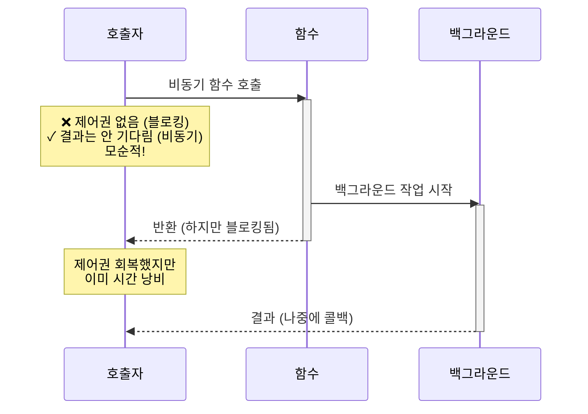

**실제 예시:**

```javascript
// Node.js - 안티패턴
// 비동기 함수를 동기처럼 사용

async function fetchData() {
    // 비동기 작업
    return await fetch("https://api.example.com/data");
}

function badExample() {
    // ❌ 비동기 + 블로킹 (안티패턴!)

    // 비동기: 콜백으로 결과 받음
    fetchData().then(data => {
        processData(data);
    });

    // 하지만 블로킹: 여기서 기다림
    while (!isDataReady()) {  // 블로킹!
        // 대기...
    }

    // → 비동기의 이점을 못 살림
}
```

```java
// Java - 잘못된 Future 사용
ExecutorService executor = Executors.newSingleThreadExecutor();

// 비동기 작업 시작
Future<String> future = executor.submit(() -> {
    Thread.sleep(5000);
    return "결과";
});

// ❌ 비동기 + 블로킹
// 비동기: Future로 결과를 나중에 받음
// 블로킹: get()으로 즉시 기다림
String result = future.get();  // 5초 블로킹!

// → 비동기로 시작했지만 블로킹으로 기다림
// → 비동기의 의미가 없어짐
```

**왜 드문가?**
- 비동기의 장점(논블로킹)을 살리지 못함
- 블로킹의 단순함도 얻지 못함
- 대부분 설계 실수

**드물게 사용되는 경우:**
```java
// Node.js select() 같은 경우
// - 여러 비동기 I/O를 감시
// - 하나라도 준비되면 깨어남
// - 모두 준비 안 되면 블로킹

Selector selector = Selector.open();
// 여러 채널 등록...

// 비동기 작업들을 감시하지만,
// 하나라도 준비될 때까지는 블로킹
int readyCount = selector.select();  // 블로킹!
```

**특징:**
- ❌ 비효율적 (비동기의 이점 상실)
- ❌ 복잡도만 증가
- ⚠️ 대부분 안티패턴

---

## 5. 네 가지 조합 비교표

| 조합 | 제어권 | 결과 대기 | 장점 | 단점 | 사용 예 | 빈도 |
|------|--------|----------|------|------|---------|------|
| **동기 + 블로킹** | ❌ 넘김 | ⏳ 기다림 | 단순함, 직관적 | 낮은 성능 | 일반 함수, JDBC | ⭐⭐⭐⭐⭐ |
| **비동기 + 논블로킹** | ✅ 유지 | ✅ 안 기다림 | 고성능, 높은 동시성 | 복잡함 | Node.js, Java NIO | ⭐⭐⭐⭐⭐ |
| **동기 + 논블로킹** | ✅ 유지 | ⏳ 기다림 | 제어권 유지 | CPU 낭비 (polling) | 게임 루프 | ⭐⭐ |
| **비동기 + 블로킹** | ❌ 넘김 | ✅ 안 기다림 | 없음 | 비효율적 | 설계 실수 | ⭐ |

## 6. 실제 시스템 예시

### 파일 I/O

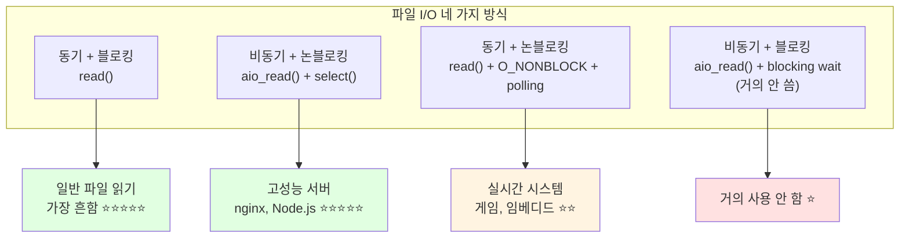

#### 1. 동기 + 블로킹 (일반 파일 읽기)

```python
# Python
with open("file.txt", "r") as f:
    data = f.read()  # ⏳ 블로킹, 결과 기다림
    print(data)


# Java
FileReader reader = new FileReader("file.txt");
BufferedReader br = new BufferedReader(reader);
String line = br.readLine();  // ⏳ 블로킹, 결과 기다림
```

#### 2. 비동기 + 논블로킹 (Node.js)

```javascript
// Node.js
const fs = require('fs').promises;

// 비동기 + 논블로킹
fs.readFile("file.txt", "utf8")
    .then(data => console.log(data))  // 콜백으로 결과
    .catch(err => console.error(err));

console.log("다른 작업");  // 즉시 실행 ✓
```

#### 3. 동기 + 논블로킹 (Polling)

```python
import os
import time

fd = os.open("file.txt", os.O_RDONLY | os.O_NONBLOCK)

# 동기 + 논블로킹 (Polling)
while True:
    try:
        data = os.read(fd, 1024)  # 즉시 리턴
        if data:
            print(data)
            break  # 결과 받을 때까지 반복
    except BlockingIOError:
        print("대기 중...")
        time.sleep(0.1)
```

### 네트워크 I/O

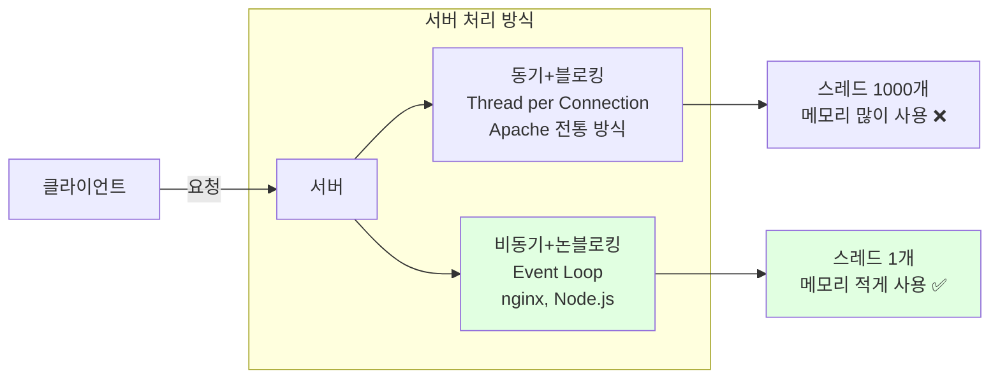

#### Apache (동기 + 블로킹)

```
┌─────────────────────────────────┐
│  Apache (전통적 방식)            │
├─────────────────────────────────┤
│ 클라이언트 1 → 스레드 1 (블로킹) │
│ 클라이언트 2 → 스레드 2 (블로킹) │
│ 클라이언트 3 → 스레드 3 (블로킹) │
│ ...                             │
│ 클라이언트 1000 → 스레드 1000   │
└─────────────────────────────────┘

문제점:
- 스레드 1000개 생성 (메모리 낭비)
- 컨텍스트 스위칭 오버헤드
- C10K 문제 (10,000 동시 접속 처리 어려움)
```

#### nginx (비동기 + 논블로킹)

```
┌─────────────────────────────────┐
│  nginx (Event-driven)           │
├─────────────────────────────────┤
│ 워커 프로세스 1개               │
│ ├─ 클라이언트 1 (논블로킹)      │
│ ├─ 클라이언트 2 (논블로킹)      │
│ ├─ 클라이언트 3 (논블로킹)      │
│ └─ ...                          │
│     클라이언트 10,000 처리 가능 │
└─────────────────────────────────┘

장점:
- 워커 프로세스 소수 (CPU 코어 수만큼)
- 메모리 효율적
- C10K 문제 해결
```

### 데이터베이스 접속

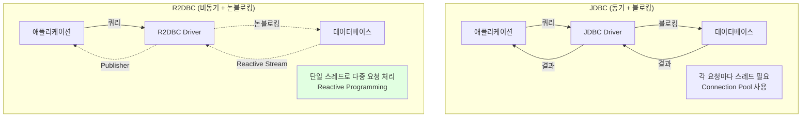

## 7. 운영체제 관점

### 시스템 콜 레벨

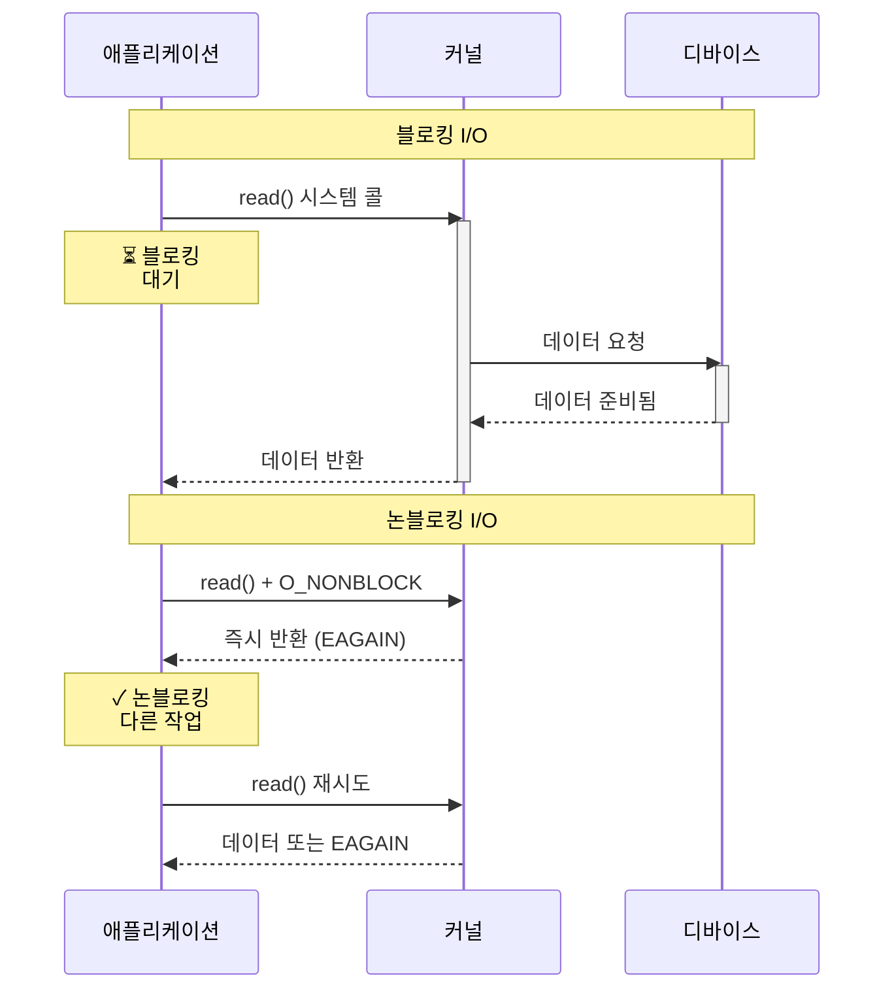

### Linux epoll (비동기 + 논블로킹)

```c
// C - Linux epoll 예제
int epfd = epoll_create1(0);

struct epoll_event event;
event.events = EPOLLIN;  // 읽기 이벤트
event.data.fd = socket_fd;

epoll_ctl(epfd, EPOLL_CTL_ADD, socket_fd, &event);

// 비동기 + 논블로킹 이벤트 루프
while (1) {
    struct epoll_event events[MAX_EVENTS];

    // 이벤트 대기 (여러 소켓 감시)
    int nfds = epoll_wait(epfd, events, MAX_EVENTS, -1);

    for (int i = 0; i < nfds; i++) {
        if (events[i].events & EPOLLIN) {
            // 데이터 읽기 (논블로킹)
            int fd = events[i].data.fd;
            char buffer[1024];
            read(fd, buffer, sizeof(buffer));

            // 다른 소켓도 처리 가능 ✓
        }
    }
}
```

### Java NIO Selector

```java
// Java NIO Selector (epoll 기반)
Selector selector = Selector.open();

ServerSocketChannel serverChannel = ServerSocketChannel.open();
serverChannel.configureBlocking(false);  // 논블로킹
serverChannel.bind(new InetSocketAddress(8080));
serverChannel.register(selector, SelectionKey.OP_ACCEPT);

// 비동기 + 논블로킹 이벤트 루프
while (true) {
    selector.select();  // 이벤트 대기

    Set<SelectionKey> keys = selector.selectedKeys();
    Iterator<SelectionKey> iterator = keys.iterator();

    while (iterator.hasNext()) {
        SelectionKey key = iterator.next();
        iterator.remove();

        if (key.isAcceptable()) {
            // 연결 수락 (논블로킹)
            ServerSocketChannel server = (ServerSocketChannel) key.channel();
            SocketChannel client = server.accept();
            client.configureBlocking(false);
            client.register(selector, SelectionKey.OP_READ);
        } else if (key.isReadable()) {
            // 데이터 읽기 (논블로킹)
            SocketChannel client = (SocketChannel) key.channel();
            ByteBuffer buffer = ByteBuffer.allocate(1024);
            client.read(buffer);

            // 다른 클라이언트도 처리 가능 ✓
        }
    }
}
```

## 8. 면접 질문 모음

### Q1. 동기/비동기와 블로킹/논블로킹의 차이는?

```
[모범 답변]

동기/비동기는 "호출자 관점"에서 결과를 기다리는지 여부입니다.
- 동기: 호출자가 결과를 기다림
- 비동기: 호출자가 결과를 기다리지 않고 다른 작업 수행

블로킹/논블로킹은 "제어권 관점"에서 즉시 리턴하는지 여부입니다.
- 블로킹: 호출된 함수가 제어권을 넘겨받고 작업 완료 후 반환
- 논블로킹: 호출된 함수가 즉시 제어권을 반환

독립적인 개념이므로 2x2 = 4가지 조합이 가능합니다.
```

### Q2. "동기=블로킹", "비동기=논블로킹"이 맞나요?

```
[모범 답변]

대부분의 경우 맞지만, 항상 그런 것은 아닙니다.

동기+블로킹이 자연스러운 이유:
- 결과를 기다리는데 (동기)
- 제어권도 넘기면 (블로킹)
- 논리적으로 일관됨
- 예: 일반 함수 호출, JDBC

비동기+논블로킹이 자연스러운 이유:
- 결과를 안 기다리는데 (비동기)
- 제어권을 즉시 받으면 (논블로킹)
- 논리적으로 일관됨
- 예: Node.js, Java NIO

하지만 동기+논블로킹(polling), 비동기+블로킹(안티패턴)도 가능합니다.
```

### Q3. Node.js는 싱글 스레드인데 어떻게 동시에 여러 요청을 처리하나요?

```
[모범 답변]

Node.js는 "비동기 + 논블로킹" 방식을 사용합니다.

1. 이벤트 루프 (Event Loop)
   - 단일 스레드로 이벤트를 감시
   - I/O 작업은 운영체제에 위임

2. 논블로킹 I/O
   - I/O 요청 시 즉시 리턴
   - 완료되면 콜백으로 통지

3. 동작 과정:
   ┌─────────────────────────┐
   │  Event Loop (싱글 스레드) │
   ├─────────────────────────┤
   │ 1. 요청1 받음 → libuv 위임 │
   │ 2. 요청2 받음 → libuv 위임 │
   │ 3. 요청3 받음 → libuv 위임 │
   │ 4. 완료된 작업 콜백 실행   │
   └─────────────────────────┘
           ↓
   ┌─────────────────────────┐
   │  libuv (Thread Pool)    │
   │  - 파일 I/O             │
   │  - DNS 조회             │
   │  - 암호화               │
   └─────────────────────────┘

CPU 집약적 작업은 Worker Threads 사용 권장.
```

### Q4. Java의 synchronized는 동기인가요 블로킹인가요?

```
[모범 답변]

synchronized는 "블로킹"입니다.

synchronized (lock) {
    // 임계 영역
}

다른 스레드가 락을 잡고 있으면:
- 제어권을 넘김 (블로킹)
- 락이 해제될 때까지 대기

"동기/비동기"는 별개의 개념:
- 동기: 작업 완료를 기다리는가?
- 블로킹: 제어권을 즉시 반환하는가?

synchronized는 "블로킹 동기화 메커니즘"이라고 표현이 정확합니다.
```

### Q5. select(), poll(), epoll()의 차이는?

```
[모범 답변]

모두 "여러 파일 디스크립터를 감시"하는 시스템 콜입니다.

1. select()
   - 가장 오래됨
   - FD_SETSIZE 제한 (보통 1024)
   - O(n) 복잡도 (전체 스캔)
   - 이식성 좋음 (모든 Unix)

2. poll()
   - select() 개선
   - FD 개수 제한 없음
   - O(n) 복잡도 (전체 스캔)
   - select()보다 효율적

3. epoll() (Linux)
   - 가장 현대적
   - FD 개수 제한 없음
   - O(1) 복잡도 (이벤트만 반환)
   - 대규모 연결 처리에 최적
   - nginx, Node.js 등에서 사용

성능 비교:
- 연결 100개: 비슷함
- 연결 10,000개: epoll >> poll > select
```

### Q6. CompletableFuture와 Future의 차이는?

```
[모범 답변]

1. Future (Java 5+)
   - 블로킹: get()으로 결과 기다림
   - 콜백 없음
   - 예외 처리 어려움

   Future<String> future = executor.submit(() -> "결과");
   String result = future.get();  // 블로킹!

2. CompletableFuture (Java 8+)
   - 논블로킹: thenApply() 등으로 콜백 등록
   - 체이닝 가능
   - 예외 처리 쉬움
   - 수동 완료 가능

   CompletableFuture<String> future = CompletableFuture
       .supplyAsync(() -> "결과")
       .thenApply(s -> s.toUpperCase())
       .exceptionally(ex -> "에러");

CompletableFuture가 더 현대적이고 비동기 프로그래밍에 적합합니다.
```

### Q7. WebFlux는 왜 더 많은 요청을 처리할 수 있나요?

```
[모범 답변]

Spring WebFlux는 "비동기 + 논블로킹" 방식이기 때문입니다.

Spring MVC (동기 + 블로킹):
┌─────────────────────┐
│ 요청 1 → 스레드 1    │ ⏳ DB 대기 중
│ 요청 2 → 스레드 2    │ ⏳ DB 대기 중
│ ...                 │
│ 요청 200 → 스레드 200│ ⏳ DB 대기 중
└─────────────────────┘
문제: 스레드 200개 생성 (메모리 낭비)

Spring WebFlux (비동기 + 논블로킹):
┌─────────────────────┐
│ 이벤트 루프 (소수)   │
│ ├─ 요청 1 → DB 요청  │ 논블로킹
│ ├─ 요청 2 → DB 요청  │ 논블로킹
│ └─ ...              │
│     요청 10,000 처리 │ ✓
└─────────────────────┘
장점: 스레드 소수, 메모리 효율적

단, CPU 집약적 작업에는 부적합 (블로킹 발생).
```

## 9. 실무 활용 가이드

### 언제 무엇을 선택할까?

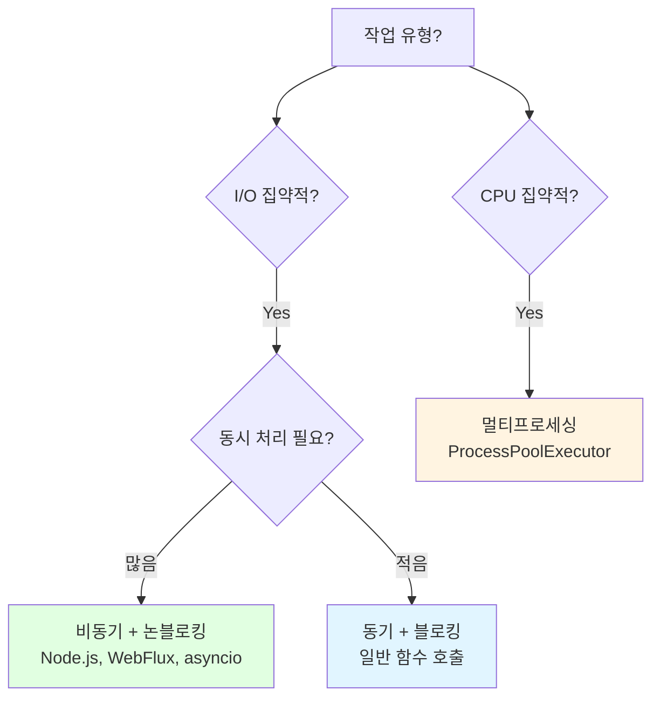

### 프레임워크별 특징

| 프레임워크 | 모델 | 적합한 작업 | 비고 |
|-----------|------|------------|------|
| **Spring MVC** | 동기 + 블로킹 | 간단한 CRUD | Thread per Request |
| **Spring WebFlux** | 비동기 + 논블로킹 | 많은 I/O, 스트리밍 | Reactive Programming |
| **Node.js** | 비동기 + 논블로킹 | 실시간, API Gateway | 싱글 스레드 |
| **Django** | 동기 + 블로킹 | 일반 웹 서비스 | WSGI |
| **FastAPI** | 비동기 + 논블로킹 | 고성능 API | ASGI |

### 잘못된 사용 예

```python
# ❌ 잘못된 예 1: 비동기에서 블로킹 함수 호출
import asyncio
import time

async def bad_example():
    # 비동기 함수 안에서 블로킹 호출
    time.sleep(5)  # ❌ 블로킹! 다른 코루틴도 멈춤
    return "완료"

# ✅ 올바른 예
async def good_example():
    await asyncio.sleep(5)  # ✓ 논블로킹
    return "완료"


# ❌ 잘못된 예 2: 논블로킹에서 동기 대기
async def bad_async():
    future = some_async_task()
    # 비동기로 시작했지만
    result = await future  # 블로킹처럼 기다림
    return result
    # → 비동기의 이점 상실

# ✅ 올바른 예
async def good_async():
    # 여러 작업 동시 실행
    results = await asyncio.gather(
        task1(),
        task2(),
        task3()
    )
    return results
```

## 정리

### 핵심 포인트

1. **독립적인 두 개념**
   - 동기/비동기: 호출자가 결과를 기다리는가?
   - 블로킹/논블로킹: 제어권을 즉시 반환하는가?

2. **4가지 조합 가능**
   - 동기 + 블로킹 ⭐⭐⭐⭐⭐ (가장 흔함)
   - 비동기 + 논블로킹 ⭐⭐⭐⭐⭐ (고성능)
   - 동기 + 논블로킹 ⭐⭐ (Polling)
   - 비동기 + 블로킹 ⭐ (안티패턴)

3. **실무 선택 기준**
   - I/O 많음 + 높은 동시성 → 비동기 + 논블로킹
   - 간단한 로직 → 동기 + 블로킹
   - CPU 집약적 → 멀티프로세싱

### 면접 대비 핵심 문장

```
"동기/비동기는 호출자가 결과를 기다리는지 여부이고,
블로킹/논블로킹은 제어권을 즉시 반환하는지 여부입니다.

독립적인 개념이므로 4가지 조합이 가능하지만,
동기+블로킹과 비동기+논블로킹이 자연스러워 가장 많이 사용됩니다.

Node.js, nginx는 비동기+논블로킹으로 높은 동시성을 달성하고,
일반 함수 호출은 동기+블로킹으로 단순성을 유지합니다."
```

---

## 참고 자료

- [POSIX Asynchronous I/O](https://man7.org/linux/man-pages/man7/aio.7.html)
- [Linux epoll](https://man7.org/linux/man-pages/man7/epoll.7.html)
- [Java NIO](https://docs.oracle.com/javase/8/docs/api/java/nio/package-summary.html)
- [Node.js Event Loop](https://nodejs.org/en/docs/guides/event-loop-timers-and-nexttick/)
- [The C10K Problem](http://www.kegel.com/c10k.html)
