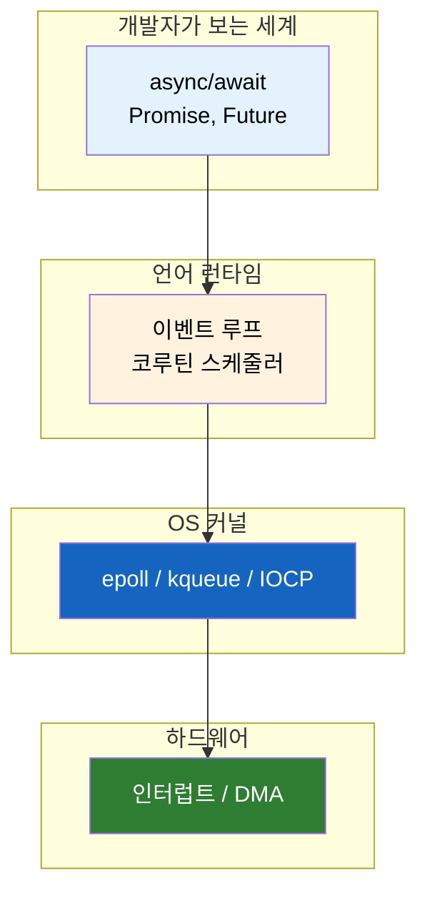
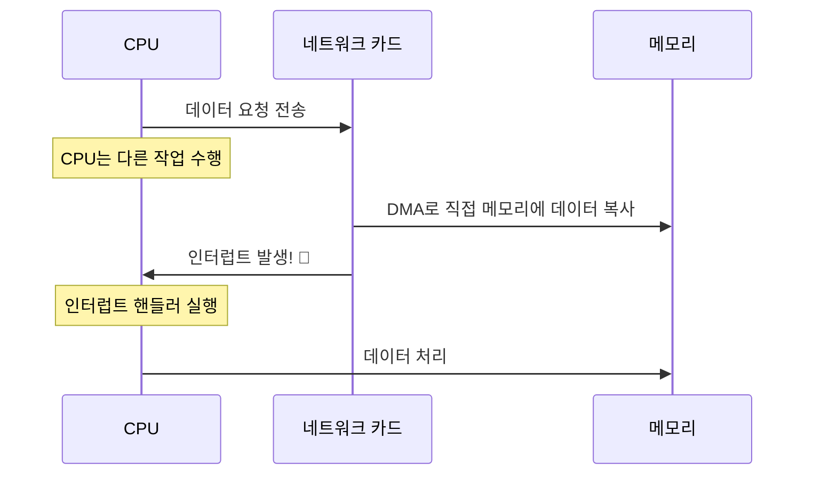
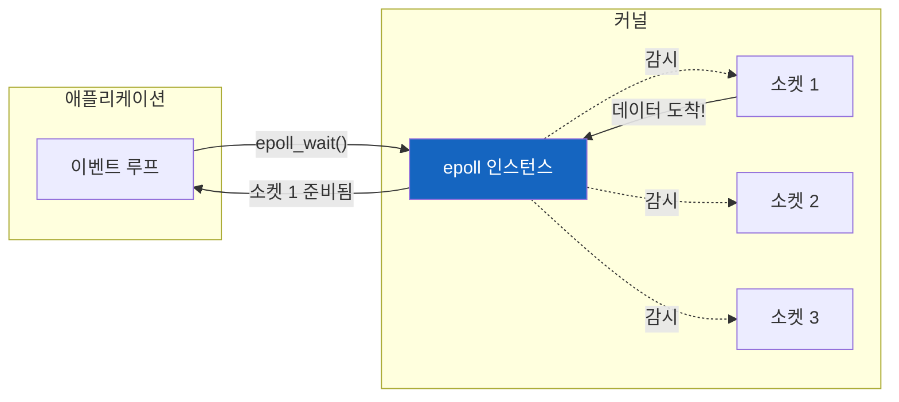
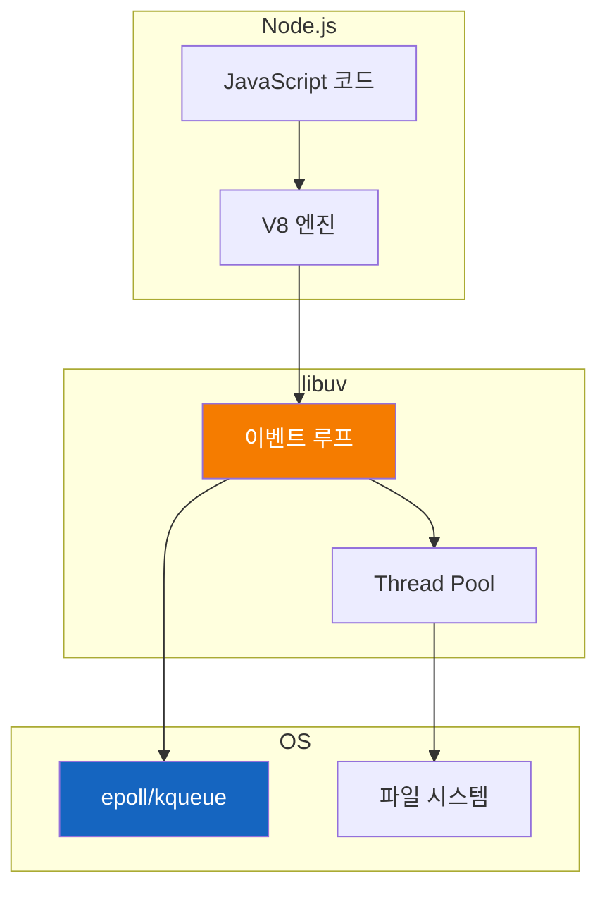
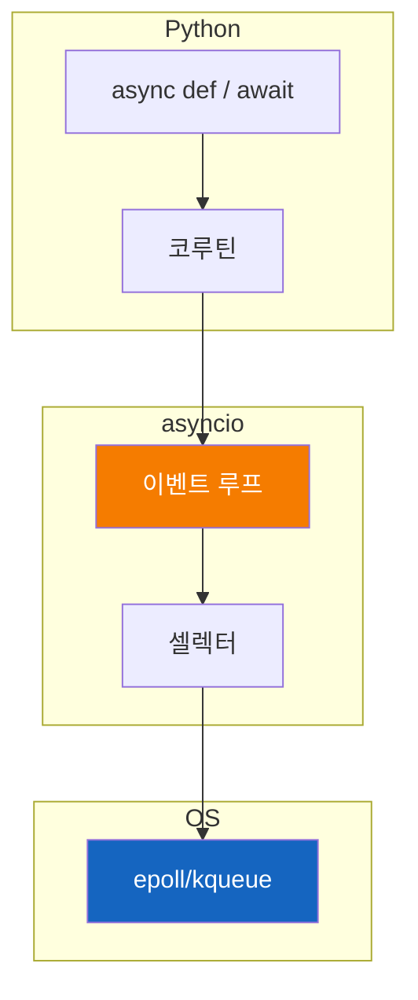
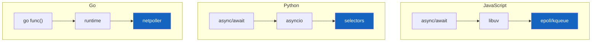

# 비동기의 계층 구조 - async/await는 빙산의 일각

`async/await`만 쓰면 비동기인가? 그 아래에는 무엇이 있는가?

## 결론부터 말하면

**언어의 `async/await`는 OS의 비동기 I/O를 편하게 쓰기 위한 포장지다.** 진짜 비동기는 OS 커널과 하드웨어 수준에서 일어난다.



| 계층 | 역할 | 예시 |
|------|------|------|
| **언어** | 문법적 추상화 | `async/await`, `Promise` |
| **런타임** | 코루틴 스케줄링 | Python asyncio, Node.js libuv |
| **OS** | I/O 멀티플렉싱 | Linux epoll, macOS kqueue |
| **하드웨어** | 물리적 비동기 | 네트워크 카드 인터럽트, DMA |

**핵심**: 언어 혼자서는 "기다림" 자체를 없앨 수 없다. OS가 "데이터 왔어"라고 알려줘야 한다.

---

## 1. 왜 이 계층 구조를 알아야 하는가?

### 1.1 흔한 오해

많은 개발자가 이렇게 생각한다:

> "`async/await` 키워드를 붙이면 비동기가 된다"

하지만 이건 반쪽짜리 이해다. `async/await`는 **문법적 설탕(syntactic sugar)** 일 뿐이다.

```python
# 이 코드가 비동기로 동작하는 이유는 async 때문이 아니다
async def fetch_data():
    response = await aiohttp.get("https://api.example.com")
    return response
```

`async` 키워드가 마법처럼 비동기를 만드는 게 아니다. 그 아래에서 **OS가 네트워크 I/O를 비동기로 처리** 해주기 때문에 가능한 것이다.

### 1.2 만약 OS 없이 언어만으로 비동기를 구현한다면?

```python
# 순수 언어 수준에서 "기다림"을 없애려면?
def fake_async_read():
    while not data_ready():  # CPU가 계속 확인 (busy waiting)
        pass
    return read_data()
```

이건 **진짜 비동기가 아니다**. CPU가 100%로 돌면서 계속 확인하는 것일 뿐이다.

진짜 비동기는 **CPU를 쉬게 하면서** 데이터가 오면 깨워주는 것이다. 이건 OS만 할 수 있다.

---

## 2. 계층별 상세 분석

### 2.1 하드웨어 계층: 인터럽트와 DMA

모든 비동기의 **물리적 근본** 은 하드웨어 인터럽트다.



**인터럽트(Interrupt)** 란 무엇인가?

하드웨어 장치가 CPU에게 "나 할 말 있어!"라고 신호를 보내는 것이다. CPU는 하던 일을 멈추고 인터럽트를 처리한다.

**DMA(Direct Memory Access)** 란?

네트워크 카드나 디스크가 CPU를 거치지 않고 **직접 메모리에 데이터를 복사** 하는 기술이다. CPU는 그동안 다른 일을 할 수 있다.

이것이 비동기의 **물리적 기반** 이다. CPU가 I/O를 기다리지 않아도 되는 이유가 바로 이것이다.

### 2.2 OS 커널 계층: I/O 멀티플렉싱

OS는 하드웨어 인터럽트를 추상화해서 애플리케이션에게 **"여러 I/O를 동시에 감시하는 기능"** 을 제공한다.

| OS | 메커니즘 | 특징 |
|----|----------|------|
| Linux | `epoll` | 수천 개 소켓을 O(1)로 감시 |
| macOS/BSD | `kqueue` | epoll과 유사, BSD 계열 |
| Windows | `IOCP` | I/O Completion Port |

#### epoll은 어떻게 동작하는가?



**핵심 동작**:

1. 애플리케이션이 `epoll_wait()` 호출
2. **커널이 CPU를 sleep 시킴** (여기서 CPU가 쉰다!)
3. 하드웨어 인터럽트 발생 시 커널이 CPU를 깨움
4. 어떤 소켓에 데이터가 왔는지 알려줌

```c
// C - Linux epoll 사용 예시
int epfd = epoll_create1(0);

struct epoll_event event;
event.events = EPOLLIN;
event.data.fd = socket_fd;
epoll_ctl(epfd, EPOLL_CTL_ADD, socket_fd, &event);

// 이벤트 루프
while (1) {
    struct epoll_event events[MAX_EVENTS];

    // 여기서 CPU가 sleep 한다!
    // 데이터가 오면 커널이 깨워준다
    int nfds = epoll_wait(epfd, events, MAX_EVENTS, -1);

    for (int i = 0; i < nfds; i++) {
        // 준비된 소켓만 처리
        handle_event(events[i].data.fd);
    }
}
```

**이것이 진짜 비동기다**: CPU가 busy waiting 하지 않고 **실제로 쉬면서** 데이터가 오면 깨어난다.

### 2.3 런타임 계층: 이벤트 루프

언어 런타임은 OS의 epoll/kqueue를 감싸서 **개발자 친화적인 API** 를 제공한다.

#### Node.js의 libuv



libuv가 하는 일:

| 작업 유형 | 처리 방식 | 이유 |
|----------|----------|------|
| 네트워크 I/O | epoll/kqueue | OS가 비동기 지원 |
| 파일 I/O | Thread Pool | OS가 비동기 미지원* |
| DNS 조회 | Thread Pool | getaddrinfo가 블로킹 |

*Linux에는 `io_uring`이 있지만 libuv는 아직 Thread Pool 사용

#### Python의 asyncio



```python
import asyncio
import selectors

# asyncio 내부에서 일어나는 일 (단순화)
class SimpleEventLoop:
    def __init__(self):
        # OS의 epoll/kqueue를 감싼다
        self.selector = selectors.DefaultSelector()
        self.ready = []

    def run_until_complete(self, coro):
        # 코루틴을 실행하다가
        # await를 만나면 OS에 등록하고
        # 다른 코루틴을 실행한다
        pass
```

### 2.4 언어 계층: async/await

드디어 개발자가 보는 세계다. `async/await`는 **코루틴을 동기 코드처럼 작성** 할 수 있게 해주는 문법이다.

```python
# 개발자가 작성하는 코드
async def fetch_user(user_id):
    response = await http_client.get(f"/users/{user_id}")
    return response.json()

# 실제로 일어나는 일
def fetch_user_generator(user_id):
    future = http_client.get(f"/users/{user_id}")
    yield future  # 여기서 이벤트 루프에 제어권 반환
    response = future.result()
    return response.json()
```

`await`의 정체:

1. "나 이거 기다려야 해"라고 이벤트 루프에 알림
2. **제어권을 이벤트 루프에 반환**
3. 이벤트 루프는 다른 코루틴 실행
4. 데이터가 오면 (OS가 알려줌) 이 코루틴 재개

---

## 3. 전체 흐름: 한 줄의 코드가 거치는 여정

```python
response = await aiohttp.get("https://api.example.com/data")
```

이 한 줄이 실행될 때 일어나는 일:

```mermaid
sequenceDiagram
    participant Code as Python 코드
    participant Loop as 이벤트 루프
    participant OS as OS 커널
    participant HW as 네트워크 카드

    Code->>Loop: await http.get()
    Note over Code: 제어권 반환

    Loop->>OS: 소켓 생성 + epoll 등록
    OS->>HW: TCP 연결 + HTTP 요청

    Note over Loop: 다른 코루틴 실행

    HW->>OS: 응답 도착 (인터럽트)
    OS->>Loop: epoll_wait 반환
    Loop->>Code: 코루틴 재개

    Note over Code: response 사용 가능
```

**시간순으로 보면**:

| 단계 | 계층 | 동작 |
|------|------|------|
| 1 | 언어 | `await` → 제어권 반환 |
| 2 | 런타임 | 소켓을 epoll에 등록 |
| 3 | OS | TCP 패킷 전송 |
| 4 | 하드웨어 | 네트워크 전송 |
| 5 | 하드웨어 | 응답 수신 → 인터럽트 |
| 6 | OS | epoll에게 알림 |
| 7 | 런타임 | 해당 코루틴 재개 |
| 8 | 언어 | `await` 이후 코드 실행 |

---

## 4. 비동기 ≠ 멀티스레드

여기서 중요한 의문이 생긴다.

> "비동기로 동시에 실행된다는 건 스레드가 여러 개라는 건가?"

**아니다.** 비동기와 멀티스레드는 다른 개념이다.

| 개념 | 의미 | 스레드 수 |
|------|------|----------|
| **비동기** | 완료를 기다리지 않고 다음 작업 | 1개로도 가능 |
| **멀티스레드** | 여러 스레드가 동시 실행 | 2개 이상 |

### 싱글스레드로 비동기가 가능한 이유

```
시간 →
────────────────────────────────────────────────────→

Thread 1: [요청1 전송]─[요청2 전송]─[요청3 전송]─[대기]─[응답1]─[응답2]─[응답3]
                                                   ↑
                                         CPU가 쉬고 있음
                                         (epoll_wait에서 sleep)
```

핵심은 **I/O 대기 시간** 이다:

- 네트워크 요청: CPU 입장에서 **영겁의 시간**
- 그 시간 동안 다른 요청을 보내면 됨
- OS가 "응답 왔어"라고 알려주면 처리

**멀티스레드가 필요한 경우**:

```python
# CPU-bound 작업은 비동기로 해결 안 됨
async def bad_example():
    # 이건 CPU가 직접 해야 함 - 기다릴 게 없음
    result = heavy_calculation()  # 비동기 이점 없음
    return result

# 해결책: 별도 스레드/프로세스
import asyncio
from concurrent.futures import ProcessPoolExecutor

async def good_example():
    loop = asyncio.get_event_loop()
    with ProcessPoolExecutor() as pool:
        result = await loop.run_in_executor(pool, heavy_calculation)
    return result
```

---

## 5. 언어별 비동기 구현 비교

| 언어 | 런타임 | OS 연동 | 특징 |
|------|--------|---------|------|
| **JavaScript (Node.js)** | libuv | epoll/kqueue/IOCP | 파일 I/O는 Thread Pool |
| **Python (asyncio)** | asyncio | selectors 모듈 | GIL 때문에 CPU-bound 제한 |
| **Java (NIO)** | Selector | epoll/kqueue | 저수준 API |
| **Go** | runtime | netpoller | goroutine + M:N 스케줄링 |
| **Rust (tokio)** | tokio | mio | 제로 코스트 추상화 |

### 각 언어의 계층 구조



**공통점**: 결국 모두 OS의 I/O 멀티플렉싱(epoll/kqueue)에 의존한다.

---

## 6. 정리

### 비동기의 계층 구조

| 계층 | 구성 요소 | 역할 |
|------|----------|------|
| **언어** | async/await, Promise, Future | 개발자가 편하게 쓰는 문법 |
| **런타임** | 이벤트 루프, 코루틴 스케줄러 | OS API를 감싸서 언어에 맞게 제공 |
| **OS 커널** | epoll, kqueue, IOCP | 여러 I/O를 효율적으로 감시 |
| **하드웨어** | 인터럽트, DMA | 물리적 비동기의 근본 |

### 핵심 포인트

1. **`async/await`는 추상화일 뿐이다**
   - 진짜 비동기는 OS와 하드웨어에서 일어남
   - 언어는 그걸 편하게 쓰게 해주는 포장지

2. **비동기 ≠ 멀티스레드**
   - 비동기는 "기다리지 않는다"는 실행 모델
   - 싱글스레드로도 충분히 구현 가능

3. **OS가 핵심이다**
   - `epoll_wait()`에서 CPU가 실제로 sleep
   - 하드웨어 인터럽트가 오면 깨어남
   - 이것이 busy waiting과의 결정적 차이

4. **언어마다 구현은 달라도 원리는 같다**
   - Node.js, Python, Go, Java 모두
   - 결국 OS의 I/O 멀티플렉싱에 의존

---

## 출처

- [Linux epoll man page](https://man7.org/linux/man-pages/man7/epoll.7.html) - 공식 문서
- [libuv Design Overview](https://docs.libuv.org/en/v1.x/design.html) - Node.js의 비동기 I/O 라이브러리
- [Python asyncio Documentation](https://docs.python.org/3/library/asyncio.html) - 공식 문서
- [The C10K Problem](http://www.kegel.com/c10k.html) - 동시 접속 처리의 역사
