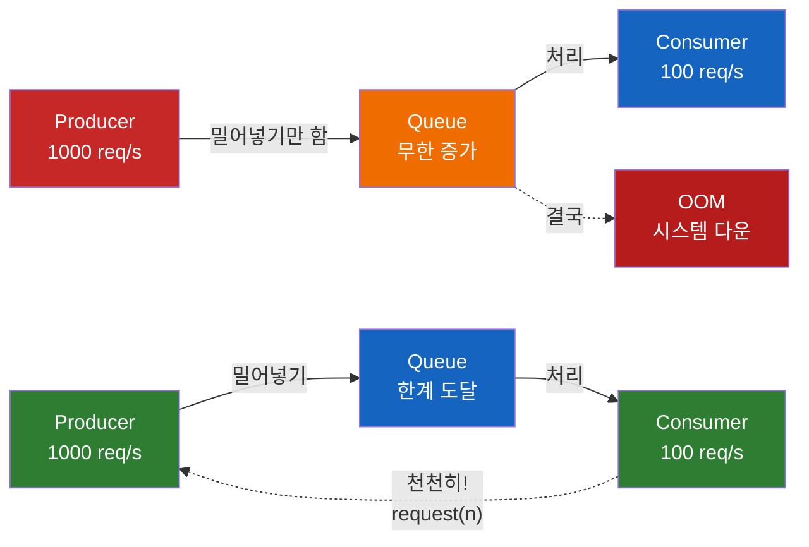
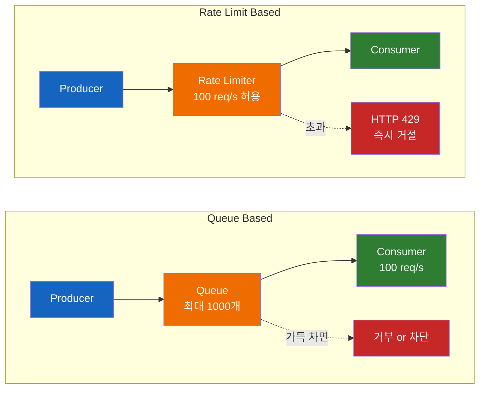
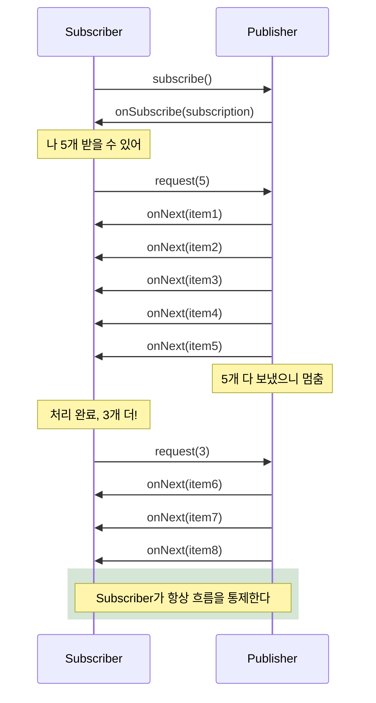
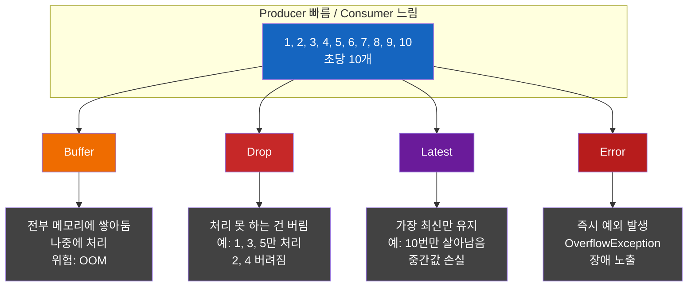

# 빠른 Producer가 시스템을 죽인다 — Back Pressure

생산자가 빠른 게 좋은 것 아닌가? 왜 굳이 "Back Pressure" 라는 이름까지 붙여서 속도를 거꾸로 밀어내야 할까?

## 결론부터 말하면

**Back Pressure는 "소비자가 따라오지 못할 때, 생산자에게 '천천히 좀'이라고 거꾸로(back) 압력(pressure)을 보내는 메커니즘"** 이다. 생산자만 빠르면 중간 큐가 무한히 쌓이다가 OOM(Out Of Memory)으로 시스템 전체가 무너지기 때문이다.



왼쪽이 **Back Pressure 없는 시스템**, 오른쪽이 **Back Pressure가 작동하는 시스템**이다. 차이는 단 하나, **Consumer가 Producer에게 자기 처리 가능량을 알려주느냐**다.

## 1. 왜 이 개념이 등장했을까?

전통적인 Push 기반 시스템을 떠올려 보자. Observer 패턴이 대표적이다. Publisher가 Subscriber에게 데이터를 일방적으로 "밀어넣는다(push)". Subscriber가 처리할 준비가 됐는지는 신경 쓰지 않는다.

이게 왜 문제일까? 데이터 양이 적고 일정할 때는 문제가 없다. 하지만 현실의 데이터는 **스파이크(spike)** 가 있다. 평소엔 초당 100건이다가 갑자기 초당 10,000건이 쏟아진다. Consumer가 초당 1,000건밖에 처리 못 하면 차이만큼 어딘가에 쌓여야 한다. 그 어딘가가 메모리 큐다.

```
들어오는 속도 = 10,000/s
처리 속도     = 1,000/s
------
초당 9,000개씩 메모리에 누적
1분이면 540,000개
1시간이면 32,400,000개 → OOM
```

여기서 **이상한 점**이 보인다. Producer는 Consumer 사정을 모른다. Consumer는 Producer에게 "그만!"이라고 말할 방법이 없다. 둘 사이를 중재하는 누군가가 필요하다. 이 중재 메커니즘이 바로 **Back Pressure**다.

이름이 직관적이다. 데이터는 Producer → Consumer 방향으로 흐른다(forward pressure). Consumer가 힘들면 그 흐름에 거슬러서(back) Producer에게 압력(pressure)을 보낸다. 수도관이 막혀서 수도꼭지 쪽으로 압력이 거꾸로 전달되는 모습과 닮아서 붙은 이름이다.

### 사실 새로운 패턴이 아니다 — Write-back Cache 라는 원형

여기서 멈추고 한번 의심해 보자. 정말 reactive 시대에 와서야 발명된 개념일까? 그럴 리 없다. CPU와 디스크의 속도 차이는 수십 년 전부터 컴퓨터 구조의 근본 문제였다.

CPU는 나노초 단위로 동작하고 디스크는 밀리초 단위다. 백만 배 차이가 난다. 매번 디스크에 직접 쓰면? CPU가 디스크를 기다리느라 마비된다. **속도 불균형이 동일하게 존재한다.** 컴퓨터 구조는 이걸 어떻게 풀었을까?

답이 **Write-back Cache**다. CPU는 일단 빠른 메모리(캐시)에 쓴다. 캐시는 백그라운드에서 천천히 디스크로 flush한다. 캐시가 가득 차면? 그제서야 CPU를 멈춰 빈자리가 생기길 기다린다.

```
CPU (1000 writes/μs) → [Cache: 64MB 버퍼] → 백그라운드 flush → Disk (10 writes/ms)

캐시가 차면 → CPU stall (= 거꾸로 보내는 압력)
```

낯익은 그림이다. **버퍼가 속도 차이를 흡수하고, 버퍼가 한계에 도달하면 생산자를 멈춘다** — 글머리부터 우리가 본 백프레셔의 핵심 구조 그 자체다. Reactive Streams는 새로운 발명이 아니라, 이 수십 년 묵은 하드웨어 패턴을 **메서드 호출 수준의 데이터 흐름까지 일반화**한 것뿐이다. 백프레셔가 갑자기 와닿지 않는다면, 이미 알고 있던 캐시의 동작을 떠올리면 된다.

## 2. 가장 간단한 모델 — 큐 vs 거부

본격적인 메커니즘으로 들어가기 전에, 실무에서 가장 자주 마주치는 **두 가지 단순한 구현**을 먼저 보자. 시스템 디자인 책에서 백프레셔를 처음 소개할 때 거의 항상 이 두 가지로 압축한다.



### 1) 큐로 흡수하고 처리량을 제한한다

초과 요청이 들어오면 일단 **큐에 쌓고**, Consumer는 단위 시간당 정해진 양만 처리한다. 큐가 한계에 도달하면 그때 새 요청을 거부하거나 Producer를 멈춘다. Kafka 파티션, RabbitMQ 큐, Spring의 `ThreadPoolTaskExecutor#setQueueCapacity(int)`(Spring Boot에서는 `spring.task.execution.pool.queue-capacity` 프로퍼티) 같은 곳에서 매일 쓰는 패턴이다.

### 2) Rate Limit으로 진입 자체를 막는다

큐도 만들지 않는다. **정해진 임계치를 넘는 요청은 들어오는 순간 거절(HTTP 429 Too Many Requests)** 한다. Token Bucket, Leaky Bucket 알고리즘이 대표적이고, Nginx의 `limit_req`, Spring Cloud Gateway, AWS API Gateway throttling이 이 방식이다.

### 두 방식의 차이

| | 큐 기반 | Rate Limit 기반 |
|---|---|---|
| 초과 요청 처리 | 큐에 쌓아 둠 (지연되더라도 처리) | 즉시 거절 |
| 메모리 사용 | 큐 크기만큼 | 거의 없음 |
| 사용자 경험 | 느려짐 | 명확한 실패 |
| 적합한 도메인 | 처리만 되면 OK (배치, 비동기 메시지) | 실시간성 중요 (API 서버, 결제) |

이 두 가지가 **백프레셔의 현실 세계 골격**이다. 책에서 백프레셔를 처음 만났을 때 이 두 가지로 정리해도 80%는 맞다. 아래부터는 이 골격을 어떻게 더 정교하게 만들 수 있는지 — Reactive Streams가 어떻게 Producer-Consumer 간 **양방향 신호**까지 더해 진화시켰는지 — 살펴본다.

## 3. 핵심 개념 — Push 모델에서 Dynamic Push-Pull 모델로

위의 두 단순 모델은 충분히 강력하지만 한 가지 약점이 있다. **Consumer가 Producer에게 직접 "내 처리 가능량은 이만큼"이라고 말할 방법이 없다.** Producer는 자기 페이스대로 보내고, 큐나 Rate Limiter가 중간에서 막을 뿐이다. Reactive Streams는 이 한계를 깬다 — **Consumer가 직접 Producer에게 신호를 보낸다.**

### Subscriber가 "허용량"을 주고 Publisher가 그 안에서 Push

Reactive Streams 명세가 해결한 핵심은 **데이터 흐름의 주도권을 Subscriber에게 넘긴 것**이다. Subscriber가 "나 n개 받을 수 있어"라고 `request(n)`을 보내면, Publisher는 **그 범위 내에서 비동기로 Push** 한다.

여기서 흔히 하는 오해 하나. 이걸 단순 Pull 모델로 부르면 부정확하다. 정확히는 **Dynamic Push-Pull (Hybrid) 모델**이다. 매 데이터마다 Subscriber가 `next()`를 호출하는 순수 Pull이 아니다. Subscriber는 **허용량(demand)만 알릴 뿐**, 실제 데이터 전송은 Publisher가 비동기로 한 번에 여러 개를 Push한다. 이 차이는 성능 최적화 관점에서 중요하다 — 매 아이템마다 왕복(round-trip) 비용이 없기 때문이다.

Java의 `Iterator`와 Observer와 비교하면 위치가 분명해진다.

| 비교 | Iterator (순수 Pull, 동기) | Reactive Streams (Push-Pull Hybrid) | Observer (순수 Push) |
|------|------|------|------|
| 누가 다음 값 결정 | Consumer (`next()` 매번 호출) | Consumer가 허용량 통보 → Publisher가 Push | Producer (그냥 보냄) |
| 흐름 제어 | 자연스럽게 됨 | `request(n)` 으로 됨 | **불가능** |
| 비동기 지원 | X | O | O |
| 아이템당 왕복 비용 | 있음 | 없음 (batch push) | 없음 |

Iterator는 흐름 제어가 자연스럽지만 동기라서 블로킹된다. Observer는 비동기지만 흐름 제어가 없다. **Reactive Streams는 둘의 장점만 합쳤다** — Subscriber가 주도권을 가지면서도 비동기 batch push로 효율을 유지한다.

### 흐름 시퀀스



이 구조 덕분에 Subscriber는 절대 처리 불가능한 양을 받지 않는다. **흐름 제어가 프로토콜 차원에 내장**된 것이다.

> **`request(n)`은 outstanding demand에 누적(additive)된다.** 정확히 말하면 `request(n)`은 "현 시점에 아직 소비되지 않은 demand"에 더해진다. 시나리오로 보면 헷갈림이 풀린다.
>
> - Subscriber가 `request(5)` 호출 → outstanding demand = 5
> - Publisher가 2개 보냄 → outstanding demand = 3
> - Subscriber가 추가로 `request(3)` → outstanding demand = 3 + 3 = **6** (Publisher는 앞으로 6개 더 보낼 수 있음)
> - 만약 5개를 모두 받은 후 `request(3)`이면 → outstanding demand = 0 + 3 = **3**
>
> 즉 "총 보낸 양"이 누적되는 게 아니라 **"아직 보낼 수 있는 잔여 허용량"이 누적**된다. 매번 새 값으로 덮어쓰지 않고 더해진다는 것은 Reactive Streams 명세의 핵심 약속이며, 커스텀 Subscriber를 만들 때 가장 자주 헷갈리는 지점이다.

## 3. 실전 — 4가지 Back Pressure 전략

Push-Pull 모델이 작동하더라도 Publisher가 **Subscriber 요청을 따라갈 수 없는** 경우가 있다. 시간 기반 이벤트(`Flux.interval`), 외부 이벤트(키보드, 네트워크 패킷) 같은 것들은 생산 자체가 외부 박자(타이머, 사용자 입력)에 묶여 있어 demand가 부족해도 늦출 수 없다 — 이 경우 그대로 두면 OverflowException으로 종료된다. 이때 어떻게 대응할지 정해야 하는데, 이게 **Back Pressure 전략**이다.

### 4가지 전략 비교



### 언제 어떤 전략을 쓸까?

| 전략 | 어울리는 상황 | 위험 / 주의 |
|------|---------------|------|
| **Buffer** | 짧은 스파이크 흡수, 일시적 burst 평탄화 | 무한 버퍼는 OOM. **반드시 capacity 설정**. 손실되면 안 되는 도메인(결제·주문)이라면 `DROP_OLDEST` 같은 overflow 정책으로는 부족하다 — overflow를 ERROR로 노출시키고 **upstream rate limit + 재시도 + Kafka 같은 영속 큐**로 보완해야 한다. |
| **Drop** | 옛 데이터는 가치 없음 (실시간 대시보드 프레임) | 데이터 손실 — 모니터링 필수 |
| **Latest** | 최신 상태만 의미 있음 (설정값, 주가 표시) | 중간 변화 추적 불가 |
| **Error** | 명확히 장애로 처리해야 할 때 | 호출자가 핸들링해야 함 |

> **Drop의 보완책 — Dead Letter Queue (DLQ).** Drop을 그대로 두면 데이터가 영영 사라지지만, 실무에선 "사라지게 두지 않는" 패턴이 함께 쓰인다. 처리 실패하거나 버려질 메시지를 **별도 큐로 격리**해서 보존하는 게 DLQ다. Kafka에서는 retry topic + DLQ 패턴이 표준으로 자리잡았고, RabbitMQ에서는 `x-dead-letter-exchange` 설정으로 큐 단위로 켠다. 백프레셔의 Drop이 "지금 처리 못 하는 건 버린다" 라면, DLQ는 **"버려도 흔적은 남기고 나중에 들여다본다"** 는 약속이다. 손실되면 안 되는 도메인에서 Drop 계열 전략을 쓸 때 거의 항상 같이 등장한다.

### Project Reactor 코드 예시

Java 개발자라면 가장 익숙할 Project Reactor로 보자. 모든 예시는 **`Flux.interval`로 1ms마다 생산, `concatMap` + `Mono.delay`로 100ms씩 소비** 시나리오다 (생산이 소비보다 100배 빠름 → 실제로 backpressure가 발생).

```java
// ⚠️ 함정: 인자 없는 onBackpressureBuffer()는 unbounded buffer → OOM
// 또한 .subscribe(lambda)는 내부적으로 Long.MAX_VALUE로 request →
// 빠른 finite source(Flux.range 등)에서는 backpressure가 발동하지 않는다.
// 시간 기반 source(Flux.interval)나 BaseSubscriber/limitRate가 있어야 시연 가능.

// 1. Buffer 전략 — capacity는 반드시 명시
Flux.interval(Duration.ofMillis(1))            // 1ms마다 생산
    .onBackpressureBuffer(50,                  // 최대 50개까지만 버퍼
        dropped -> log.warn("Dropped: {}", dropped),
        BufferOverflowStrategy.DROP_OLDEST)    // 넘치면 오래된 것부터 버림
    .concatMap(i -> Mono.delay(Duration.ofMillis(100)).thenReturn(i))
    .subscribe(System.out::println);

// 2. Drop 전략 — 처리 못 하면 즉시 버림 (실시간 프레임)
Flux.interval(Duration.ofMillis(1))
    .onBackpressureDrop(dropped -> metrics.increment("dropped"))
    .concatMap(i -> Mono.delay(Duration.ofMillis(100)).thenReturn(i))
    .subscribe(this::renderFrame);

// 3. Latest 전략 — 최신값만 유지 (주가, 센서값)
priceStream
    .onBackpressureLatest()
    .concatMap(p -> Mono.delay(Duration.ofMillis(100)).thenReturn(p))
    .subscribe(this::updatePriceDisplay);

// 4. 기본 동작 (전략 미지정)
//    시간/외부 이벤트 기반 source → request 신호를 따라갈 수 없음 → OverflowException
Flux.interval(Duration.ofMillis(1))
    .concatMap(i -> Mono.delay(Duration.ofMillis(100)).thenReturn(i))
    .blockLast();
// → reactor.core.Exceptions$OverflowException: Could not emit tick X

//    Demand 존중 source (Flux.range, Flux.fromIterable 등) → request 올 때까지 대기
//    → 전략 미지정이어도 OOM/예외 없이 자연스럽게 흐름 제어가 된다
Flux.range(1, 1_000_000)
    .concatMap(i -> Mono.delay(Duration.ofMillis(100)).thenReturn(i))
    .blockLast();
// → 예외 없음. concatMap의 prefetch만큼만 천천히 흐름
```

> **Source의 성격이 동작을 가른다.** 같은 "전략 미지정"이라도 source가 demand를 따라갈 수 있느냐가 결과를 결정한다. `Flux.range`, `Flux.fromIterable`처럼 **demand에 맞춰 생산 속도를 조절할 수 있는 source**는 `request(n)`이 자연스럽게 작동해 전략 없이도 안전하다. 반면 `Flux.interval`(시간 tick), 외부 이벤트, 네트워크 패킷처럼 **외부 박자에 맞춰 emit되는 source**는 downstream demand를 알아도 생산 자체를 늦출 수 없으니 명시적 전략이 필수다. "백프레셔 전략 없으면 무조건 터진다"는 미신은 여기서 나온다.
>
> *주의*: 이 구분은 Reactor의 **Hot/Cold Publisher 분류와는 다른 축**이다. Hot/Cold는 "구독할 때마다 새로 시작되는가, 공유되는 흐름인가"의 구분이다. `Flux.interval`은 기술적으로 Cold(구독 시점에 타이머 시작)이지만 외부 타이머를 늦출 수 없어, demand가 부족하면 `OverflowException`으로 종료된다 — Reactive Streams 명세를 어기는 게 아니라 명세가 정한 실패 경로를 따르는 것이다.

> **operator도 흐름에 개입한다.** Reactor의 많은 operator는 안 보이는 곳에서 upstream에 자체 `prefetch` 만큼 미리 `request`를 보낸다. 예를 들어 `flatMap`은 기본적으로 `Queues.SMALL_BUFFER_SIZE`(보통 256)만큼 선행 요청을 깔아 두고, `concatMap(mapper, prefetch)` 같은 prefetch 인자가 있는 오버로드도 같은 방식이다. 반면 `concatMap(mapper)`처럼 prefetch 인자가 없는 형태는 downstream demand에 맞춰 request를 전파한다 — operator마다, 그리고 같은 operator의 오버로드마다 정책이 다르다. 즉 Back Pressure 분석에서 "최종 Subscriber가 얼마를 요청했는가" 만 보면 안 되고 **각 operator의 prefetch 정책**(Reactor Javadoc에 명시)까지 함께 봐야 실제 흐름이 보인다.

### 다른 영역에서의 Back Pressure

Back Pressure는 Reactive Streams만의 개념이 아니다. 곳곳에 다른 이름으로 숨어 있다.

| 영역 | 어떻게 구현됐나 |
|------|----------------|
| **TCP** | 수신측 윈도우 크기를 ACK에 실어 전송. 송신측이 그만큼만 보냄 |
| **Node.js Streams** | `highWaterMark` 도달 시 `write()`가 `false` 반환 → `drain` 이벤트 대기. `pipe()`가 자동으로 처리 |
| **Kafka** | Producer의 `buffer.memory` 초과 시 `max.block.ms` 동안 블로킹. Consumer 측은 **consumer lag**으로 간접 표출 |
| **Spring WebFlux** | TCP flow control에 의존 (바이트 단위). 논리적 요소는 Reactor가 담당 |
| **Apache Flink** | 네트워크 버퍼가 차면 upstream operator로 자동 전파 (credit-based) |

특히 **Kafka는 흥미롭다**. Kafka는 Producer와 Consumer를 완전히 분리하기 때문에 직접적인 Back Pressure 신호가 없다. 대신 **consumer lag**(생산 offset과 소비 offset의 차이)이 점점 벌어지는 것으로 나타난다. 즉, **Kafka 자체가 거대한 버퍼 역할**을 하면서 Back Pressure를 "지연된 형태"로 흡수한다.

```bash
# Kafka consumer lag 확인
kafka-consumer-groups.sh --bootstrap-server localhost:9092 \
  --describe --group my-pipeline-group
# LAG 컬럼이 계속 증가하면 → Consumer가 따라오지 못함 = Back Pressure 신호
```

## 4. 정리

### 핵심 포인트

1. **Back Pressure는 "Consumer가 Producer를 통제할 수 있게 하는" 메커니즘이다**
   - Push 모델의 근본적 한계(Producer가 일방적으로 데이터를 밀어넣음 → 메모리 누적 → OOM)를 `request(n)` 기반의 **Push-Pull Hybrid 모델**로 해결한 것이다.

2. **전략 선택은 도메인에 따라 달라진다**
   - 모든 데이터가 중요하면 Buffer(capacity 필수), 최신성이 중요하면 Latest, 처리 못 하는 건 버려도 되면 Drop, 명확한 장애로 다루려면 Error. **무한 버퍼는 절대 금지**.

3. **Back Pressure는 Reactive Streams 전용 개념이 아니다**
   - TCP 윈도우, Node.js의 `highWaterMark`, Kafka의 consumer lag, Flink의 credit 시스템 모두 같은 본질을 다른 이름으로 구현한 것이다. 패러다임의 이름이 다를 뿐 문제는 같다.

4. **drops를 측정하지 않으면 Back Pressure 전략은 무의미하다**
   - Drop이나 Latest를 쓴다면 "얼마나 버려졌는가"를 메트릭으로 노출해야 한다. 조용히 사라진 데이터는 가장 위험한 종류의 버그를 만든다.

---

## 출처

- [Reactor Core Reference Guide — Reactive Programming](https://projectreactor.io/docs/core/release/reference/reactiveProgramming.html) — Project Reactor 공식 문서
- [Reactive Streams Specification](https://www.reactive-streams.org/) — 명세 공식 사이트
- [Node.js — Backpressuring in Streams](https://nodejs.org/learn/modules/backpressuring-in-streams) — Node.js 공식 가이드
- [Baeldung — Backpressure Mechanism in Spring WebFlux](https://www.baeldung.com/spring-webflux-backpressure)
- [Backpressure in Stream Processing — Streamkap](https://streamkap.com/resources-and-guides/backpressure-stream-processing)
- [Mastering Backpressure in Java — DZone](https://dzone.com/articles/mastering-backpressure-in-java-concepts-real-world)
- [Back Pressure in Distributed Systems — GeeksforGeeks](https://www.geeksforgeeks.org/computer-networks/back-pressure-in-distributed-systems/)
- [Backpressure Handling in Streaming Systems — Conduktor](https://conduktor.io/glossary/backpressure-handling-in-streaming-systems)

### 더 깊이 알고 싶다면 (End-to-End Back Pressure)

- [RSocket Protocol](https://rsocket.io/) — `request(n)` 신호를 네트워크 프레임 레벨에서 직접 지원하는 프로토콜. 단일 프로세스 → 분산 시스템 환경으로 Back Pressure를 확장하는 가장 깔끔한 실무 대안.
- [gRPC Flow Control](https://grpc.io/docs/guides/flow-control/) — HTTP/2 위에서의 흐름 제어 메커니즘.
