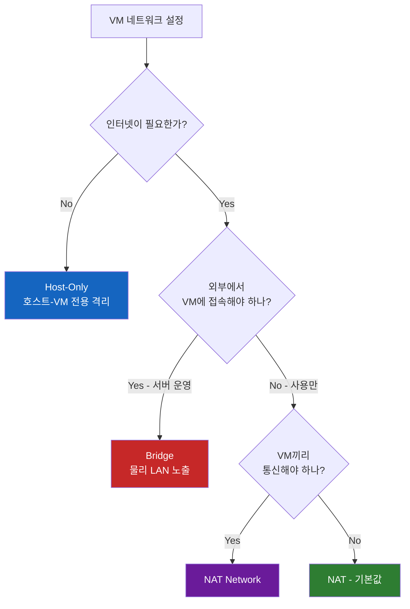
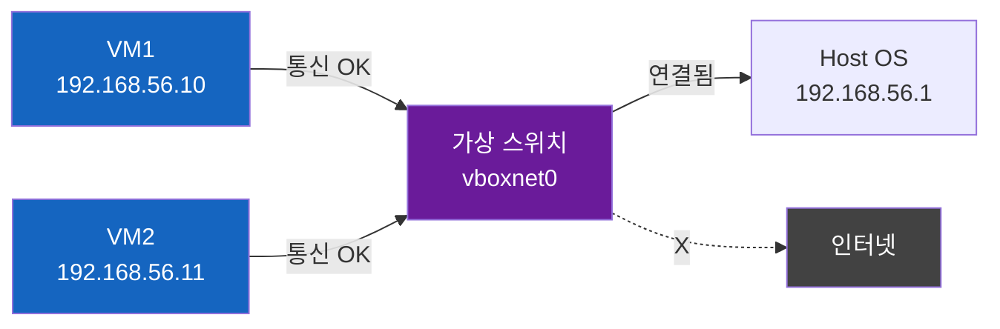
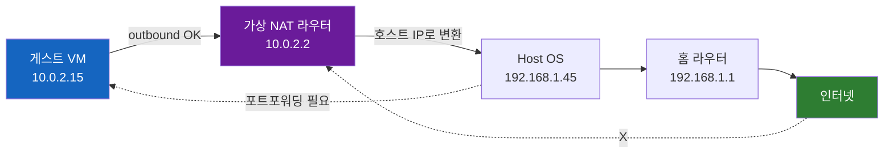
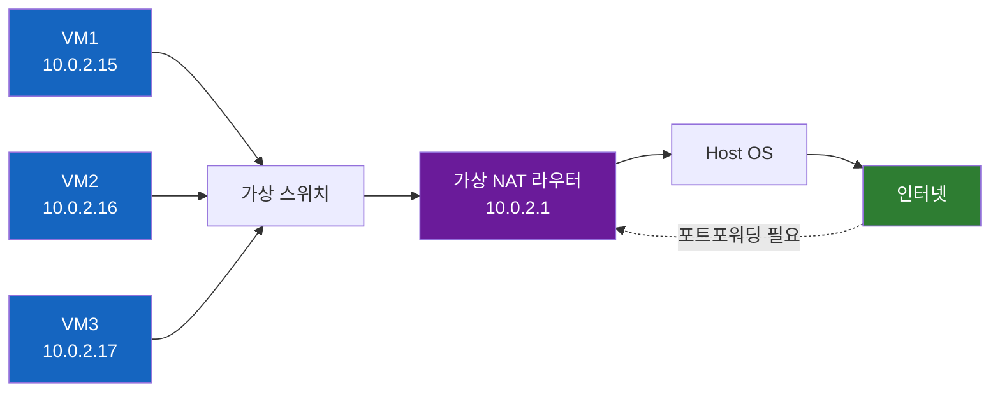
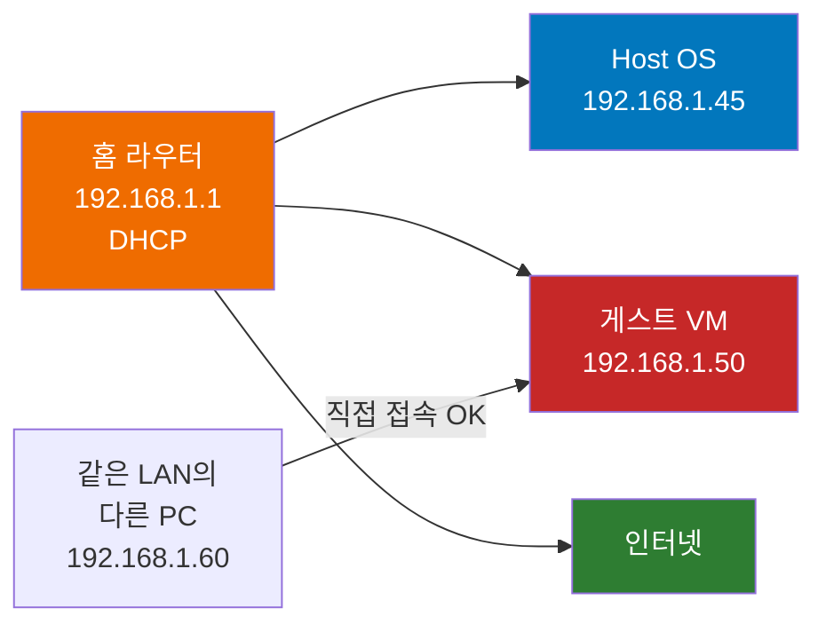

# 왜 가상머신에는 네트워크 모드가 4개나 있을까

VirtualBox에서 VM을 만들면 네트워크 어댑터 설정에서 **NAT, NAT Network, Bridge, Host-Only** 라는 네 가지 옵션을 마주친다. 물리 컴퓨터는 그냥 랜선 하나 꽂으면 끝인데, 왜 가상머신은 이렇게 모드가 많을까. 이걸 하나씩 들여다 보자.

> 이 글은 **VirtualBox** 의 공식 매뉴얼(Chapter 6)을 기준으로 한다. VMware Fusion/Workstation도 Bridged/Host-only/NAT라는 큰 줄기는 같지만, NAT Network에 해당하는 개념의 이름이나 VM 간 통신 디테일은 제품마다 조금씩 다르다.

## 결론부터 말하면

**4가지 모드의 본질적 차이는 "VM이 누구에게 보이느냐"다.** 호스트 머신, VM끼리, 그리고 외부 LAN/인터넷 — 다섯 가지 통신 방향을 어떻게 열고 닫느냐의 조합이다. VirtualBox 공식 매뉴얼 Table 6.1에서 대표적인 네 가지만 추리면 이렇다(이 표 외에도 `Internal` 모드가 있다 — 호스트조차 보이지 않는 더 닫힌 격리망이라 이 글에서는 다루지 않는다).

| 모드 | VM → Host | Host → VM | VM ↔ VM | VM → LAN | LAN → VM | 한 줄 요약 |
|------|:---:|:---:|:---:|:---:|:---:|------|
| **Host-Only** | O | O | O | X | X | 호스트와 VM만 있는 사설망 |
| **NAT** | O | 포트포워딩 | X | O | 포트포워딩 | VM마다 독립된 라우터 뒤에 숨김 |
| **NAT Network** | O | 포트포워딩 | O | O | 포트포워딩 | NAT인데 VM끼리도 대화 가능 |
| **Bridge** | O | O | O | O | O | VM이 물리 LAN의 일원이 됨 |

> NAT/NAT Network에서 **호스트 → VM** 방향이 "포트포워딩"인 점에 주의. 같은 호스트에 있다고 해서 호스트가 자유롭게 VM에 접속할 수 있는 것은 아니다. 가상 NAT 라우터 너머에 VM이 숨어 있기 때문에, 인터넷에서 들어올 때와 똑같이 호스트에서도 포트포워딩 규칙이 있어야 VM의 서비스에 접근한다.

## 1. 왜 모드가 4개나 필요한가?

물리 컴퓨터는 단순하다. 메인보드에 박힌 NIC(Network Interface Card)를 라우터에 연결하면 끝이다. 라우터가 DHCP로 IP를 던져 주고, 그 IP로 외부와 통신한다.

가상머신은 사정이 다르다. **VM은 진짜 NIC을 가지고 있지 않다.** 호스트의 NIC을 빌려 쓰거나, 하이퍼바이저가 만든 "가상 NIC"을 통해서만 바깥 세상과 만날 수 있다. 그러면 자연스럽게 질문이 생긴다.

- VM이 외부로 나갈 수 있어야 하나? (Outbound)
- 외부에서 VM에 접속해야 하나? (Inbound)
- VM이 호스트와 대화해야 하나?
- VM끼리 대화해야 하나?

이 네 질문에 대한 답이 매번 다르기 때문에 모드가 여럿이다. 예를 들어:

- 노트북에서 가볍게 리눅스 한번 돌려보고 싶다 → **인터넷만 되면 됨**
- 회사 네트워크에 VM을 서버로 띄우고 동료가 접속하게 하고 싶다 → **외부에서 들여다 볼 수 있어야 함**
- 쿠버네티스 노드 3개를 VM으로 만들어 클러스터 실습 → **VM끼리 통신 필수**
- 격리된 환경에서 악성 코드 분석 → **인터넷 차단, 호스트와만 통신**

이제 각 모드를 격리도 순서로 풀어 보자. 가장 닫힌 모드부터 가장 열린 모드까지.

## 2. Host-Only — 호스트와 VM만 사는 섬

**Host-Only 모드는 호스트와 VM 사이에 가상의 사설망 하나를 깔고, 그 안에서만 통신을 허용한다.** 인터넷은 안 된다. 외부도 모른다. 오직 같은 Host-Only 네트워크에 붙은 VM들과 호스트만 서로를 본다.

VirtualBox는 이걸 위해 가상 어댑터를 호스트에 만든다. macOS/Linux는 `vboxnet0` 같은 이름으로, Windows는 `VirtualBox Host-Only Ethernet Adapter` 라는 이름으로 표시된다 — OS마다 다르니 자기 환경에 맞춰 확인하자. 마치 호스트와 VM 사이에만 깔린 비밀 LAN 케이블이 한 가닥 있는 셈이다.

**언제 쓰나?** 보안 분석실, 데이터베이스 백업 테스트, 또는 인터넷이 닿으면 안 되는 폐쇄망 실습.

## 3. NAT — VM마다 독립된 라우터

이제 인터넷이 필요해졌다. **NAT 모드는 VM 하나하나에 "가상 라우터"를 붙여 준다.** 진짜 집에 있는 공유기와 똑같은 동작을 가상화 안에서 재현하는 것이다.

VM은 `10.0.2.15` 같은 사설 IP를 받고, 외부로 나갈 때는 가상 NAT 라우터가 패킷의 출발지 IP를 호스트의 IP로 바꿔치기한다. 외부에서 보면 호스트가 보낸 것처럼 보인다. **공유기 뒤에 숨어 있는 노트북과 똑같다.**

여기서 중요한 함정이 있다.

> **NAT 모드에서는 VM끼리 통신할 수 없다.** 각 VM이 자기만의 가상 라우터 뒤에 있기 때문에 서로를 보지 못한다. 같은 건물(호스트 OS)에 살고 있어도 서로 다른 공유기에 따로 묶여 있는 두 노트북이 직접 대화할 수 없는 것과 같다.

외부에서 VM 안의 서비스에 접근하려면 어떻게 하나? **포트 포워딩** 을 설정해야 한다. 호스트의 8080 포트를 VM의 80 포트로 매핑하는 식이다. 이건 진짜 공유기에서 외부 접속을 허용할 때 쓰는 것과 똑같은 메커니즘이다.

**언제 쓰나?** VirtualBox의 기본값이 바로 NAT다. 설정 안 하고 VM을 만들면 알아서 인터넷이 되는 이유다. "그냥 가볍게 써 본다"에 최적.

## 4. NAT Network — NAT + VM 간 통신

NAT 모드가 좋은데 VM끼리 통신 안 되는 게 아쉽다. 그래서 등장한 게 NAT Network 모드다. **이름 그대로 NAT인데, VM들을 같은 네트워크에 묶어 준다.**

차이는 단순하다. **NAT 라우터 앞에 가상 스위치가 하나 끼어 있다.** 그래서 VM1이 VM2를 `10.0.2.16` 으로 직접 호출할 수 있다. 인터넷 접근 방식과 포트 포워딩 동작은 NAT와 동일하다.

> 다른 모드와 달리 NAT Network는 **VirtualBox 글로벌 설정(File → Tools → Network Manager)에서 네트워크를 먼저 만들어 두어야** VM의 어댑터 설정에서 선택할 수 있다. NAT/Bridge/Host-Only처럼 VM 설정만으로 바로 붙는 모드가 아니다.

비유하자면, NAT가 "VM마다 공유기 한 대씩"이라면 NAT Network는 "VM들이 공유기 한 대를 공유"하는 것이다.

**언제 쓰나?** 쿠버네티스 멀티 노드, Docker Swarm, 분산 시스템 실습처럼 **여러 VM이 한 그룹으로 묶여야 할 때**. 그런데 외부에 노출되면 곤란할 때.

## 5. Bridge — VM이 진짜 네트워크의 일원

마지막은 가장 개방적인 Bridge 모드다. **VM이 호스트와 동등한 자격으로 물리 LAN에 붙는다.** 

NAT처럼 가상 라우터가 끼어들지 않는다. **VirtualBox는 호스트의 NIC을 "브리지(bridge)"로 만들어, VM이 만든 이더넷 프레임을 그대로 물리 네트워크에 흘려보낸다.** VM은 자기만의 MAC 주소를 가지고, 홈 라우터의 DHCP로부터 직접 IP를 받는다. 같은 사무실의 동료 PC 입장에서 보면 VM은 새로 한 대 추가된 컴퓨터처럼 보인다.

> 가장 빠르고 가장 단순하지만, 가장 위험하기도 하다. 회사 LAN에 함부로 VM을 Bridge로 띄우면 IP 충돌이나 네트워크 정책 위반이 될 수 있다.

> **Wi-Fi 브리지는 유선과 다르다.** 무선 어댑터의 promiscuous mode 제약 때문에 VirtualBox는 Wi-Fi 호스트에서 VM 프레임의 MAC을 호스트 무선 NIC의 MAC으로 다시 쓰는 식으로 처리한다. 그래서 L2 시뮬레이션이나 패킷 캡처 실습을 할 때 유선 호스트에서와 동작이 달라질 수 있다 — 가능한 한 유선 NIC에서 실습하자.

**언제 쓰나?**
- VM을 진짜 서버로 운영하고 싶을 때 (LAN의 다른 기기가 접근 가능)
- 네트워크 시뮬레이션, 패킷 캡처 실습 (VM이 진짜 NIC을 가진 것처럼 동작)
- DHCP 서버를 VM에 띄워 테스트할 때

## 6. 실제 사례 — 어떻게 골라야 할까

**상황별 매핑.** 외워서 쓰는 것보다 "내 VM이 누구와 대화해야 하는가"를 먼저 생각하면 자연스럽게 답이 나온다.

| 시나리오 | 추천 모드 | 이유 |
|---------|----------|------|
| 리눅스 처음 설치해서 써 보기 | NAT | 기본값. 인터넷만 되면 충분 |
| VM 안에서 웹서버 띄워 호스트 브라우저로 접속 | NAT + 포트포워딩 | 호스트 8080 → VM 80 매핑 |
| k8s/Vagrant로 클러스터 실습 | NAT Network 또는 Host-Only | VM끼리 통신 필수 |
| 회사 LAN에 VM을 서버로 노출 | Bridge | LAN의 다른 PC가 접근 가능해야 함 |
| 악성코드/취약점 분석 | Host-Only (또는 Internal) | 외부 차단이 우선 |
| 인터넷 없이 VM 2대로 SSH 실습 | Host-Only | 둘 다 같은 사설망에 들어옴 |

> 악성코드 분석에서 Host-Only를 쓸 때는 **호스트와 VM 간 통신은 여전히 열려 있다는 점**을 기억하자. 호스트의 공유 폴더나 클립보드 통합을 통해 감염이 새어 나갈 여지가 있다. 완전한 격리가 목적이면 `Internal Network` 모드(호스트조차 차단)나 어댑터 자체를 비활성화하는 편이 안전하다.

**복합 사용도 가능하다.** 하이퍼바이저들은 한 VM에 어댑터를 여러 개 붙일 수 있다. 흔한 조합은 **"NAT + Host-Only"** 다. NAT 어댑터로는 인터넷에 나가고, Host-Only 어댑터로는 호스트에서 안정된 IP로 SSH 접속을 받는다. Vagrant의 VirtualBox provider도 1번 어댑터를 항상 NAT로 두고, `config.vm.network "private_network"` 를 설정하면 그 위에 Host-Only 어댑터를 하나 더 얹어 주는 방식으로 같은 효과를 낸다.

## 7. 정리

네 가지 모드의 차이는 결국 **"통신 방향을 어디까지 열어 줄 것인가"** 의 정책이다. 외워야 할 게 있다면 두 개의 축이다.

- **외부에서 VM이 보이는가?** → Bridge만 보인다. 나머지는 다 숨어 있다.
- **VM끼리 보이는가?** → NAT만 못 본다. 나머지는 다 본다.

이 두 축을 머리에 그려 두면, 어떤 모드를 골라야 할지 매번 고민할 필요가 없다. 그리고 한 가지 더, **VirtualBox 매뉴얼의 Table 6.1**은 이 모든 걸 한 표로 정리해 둔 결정판이다 — 헷갈리면 그 표를 다시 보면 된다.

## 출처

- [Oracle VM VirtualBox User Manual — Chapter 6. Virtual Networking](https://www.virtualbox.org/manual/ch06.html) (공식 매뉴얼)
- [VMware Knowledge Base — Understanding networking types in VMware Fusion](https://knowledge.broadcom.com/external/article/303393/understanding-networking-types-in-vmware.html)
- [NAKIVO Blog — VirtualBox Network Settings: All You Need to Know](https://www.nakivo.com/blog/virtualbox-network-setting-guide)
- [Superuser — What is the difference between NAT / Bridged / Host-Only networking?](https://superuser.com/questions/227505/what-is-the-difference-between-nat-bridged-host-only-networking)
