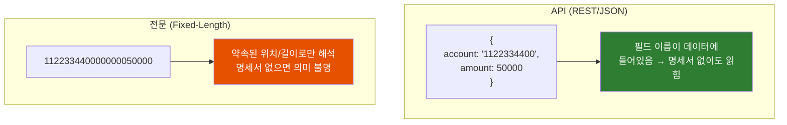
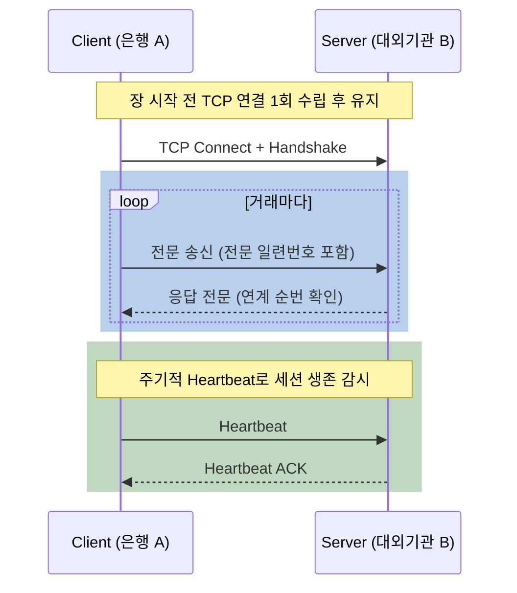

# 왜 은행은 JSON 대신 '전문(電文)'을 주고받을까

IT 서비스 회사는 다 REST API를 쓰는데, 금융권은 왜 아직도 `112233440000000050000` 같은 정체불명의 문자열을 주고받을까? 전문통신과 API는 대체 무엇이 다를까?

## 결론부터 말하면

**전문통신과 API는 둘 다 "시스템 간 통신 방법"이지만, 메시지가 스스로를 설명하느냐 아니냐가 본질적인 차이다.** API(REST/JSON)는 데이터에 필드 이름이 함께 들어 있어 **자기서술적(self-describing)** 이지만, 전문(電文)은 **약속된 위치와 길이에 값만 나열** 하기 때문에 양쪽이 똑같은 명세서를 들고 있어야만 해석된다.

여기서 **전문(電文)** 이란 "약속된 규칙에 따라 데이터를 한 덩어리의 문자열로 만든 메시지"를 말한다. 영어로는 fixed-length message에 가깝다. 금융권에서 회사 간 연동에 가장 널리 쓰이는 방식이다.



| 축 | 전문(電文) 통신 | API (REST/HTTP) |
|------|------------------|------------------|
| **전송 계층** | 주로 **raw TCP 소켓** (세션 1~2개 유지) | **HTTP/HTTPS** |
| **메시지 포맷** | **고정 길이** (위치·길이로 필드 구분) | **JSON/XML** (key-value, 가변 길이) |
| **포맷 정의** | **전문 명세서** (별도 문서, 사람이 관리) | **OpenAPI/Swagger** (기계가 읽는 스키마) |
| **자기 서술성** | 없음 (명세서 없으면 해석 불가) | 있음 (필드 이름이 데이터에 포함) |
| **주 사용처** | 은행·증권·카드, 금융결제원, 대외 연계(FEP) | 웹/모바일 백엔드, MSA, 범용 연동 |

## 1. 왜 금융권만 다른 길을 갔을까?

일반적인 IT 서비스 회사를 떠올려 보자. 프론트엔드가 백엔드에 데이터를 요청할 때, 우리는 당연하다는 듯이 HTTP로 JSON을 주고받는다. `GET /accounts/123`을 호출하면 `{ "balance": 50000 }` 같은 응답이 온다. 필드 이름이 그대로 들어 있으니, 명세서를 보지 않아도 "아 잔액이 5만원이구나"를 바로 안다.

그런데 은행이나 증권사의 시스템을 들여다보면 풍경이 사뭇 다르다. 회사와 회사가 데이터를 주고받을 때, JSON이 아니라 `09001015734500593000000010000000070000` 같은 **숫자와 문자가 빽빽하게 이어 붙은 한 줄짜리 문자열** 을 주고받는다. 이게 바로 "전문(電文)"이다.

여기서 자연스러운 의문이 생긴다. **왜 굳이 이렇게 읽기 어려운 방식을 쓸까?** 같은 정보라면 JSON이 훨씬 편한데 말이다. 이 질문에 답하려면, 먼저 전문이 정확히 어떻게 생겼는지부터 봐야 한다.

## 2. 전문은 어떻게 생겼나 — 위치와 길이의 약속

전문의 핵심 특징은 이름 그대로 **고정 길이(Fixed-Length)** 다. 각 필드가 차지할 자리(위치)와 크기(바이트 수)를 미리 약속해 두고, 그 약속대로 값만 채워 넣는다.

예를 들어 주식 주문 전문을 만든다고 하자. 명세서가 아래처럼 정의되어 있다면:

| 필드 | 위치(byte) | 크기 | 예시 값 |
|------|-----------|------|---------|
| 주문시간 | 0~11 | 12 | `090010157345` |
| 종목코드 | 12~17 | 6 | `005930` |
| 수량 | 18~25 | 8 | `00000010` |
| 가격 | 26~37 | 12 | `000000070000` |

이 값들을 **순서대로 이어 붙이면** 하나의 전문이 완성된다:

```text
090010157345 005930 00000010 000000070000
└─ 주문시간 ─┘└종목코드┘└─수량─┘└──── 가격 ────┘

실제 전송되는 전문 (공백 없이):
09001015734500593000000010000000070000
```

받는 쪽은 이 문자열을 받아서 "0번째부터 12바이트는 주문시간, 그다음 6바이트는 종목코드..." 하는 식으로 **명세서를 보며 직접 잘라낸다.** 데이터 어디에도 "이게 종목코드다"라는 표시가 없다. 오직 위치와 길이만이 의미를 부여한다.

이제 1장의 의문에 대한 답이 보이기 시작한다. JSON이라면 `{"종목코드":"005930"}`처럼 키 이름(`종목코드`)에 따옴표, 콜론, 중괄호까지 따라붙는다. 하지만 전문은 **값만 보낸다.** 같은 정보를 훨씬 적은 바이트로 전송할 수 있는 것이다. 그리고 이 "값만 보낸다"는 특성이, 전문이 살아남은 이유의 핵심이다.

## 3. 전문은 왜 아직도 살아남았나

### 3.1 저지연(Low Latency)에 유리하다

전문이 가장 빛을 발하는 곳은 **HFT(High Frequency Trading, 초단타 매매)** 처럼 극단적으로 빠른 응답이 필요한 영역이다. 키 이름 없이 값만 나열하니 메시지 크기가 작고, 파싱도 "정해진 위치를 자르기"만 하면 되니 단순하고 빠르다. 게다가 길이나 형식이 명세서와 조금이라도 어긋나면 즉시 오류로 판단할 수 있어, 검증도 가볍다.

실제로 전 세계 자본시장에서는 **FIX(Financial Information eXchange)** 라는 전문 기반 국제표준 프로토콜이 쓰인다. NYSE, NASDAQ, CME 같은 주요 거래소가 매일 수백만 건의 거래를 이 방식으로 처리한다. 카드 결제 쪽에는 **ISO 8583** 이라는 표준이 있는데, Mastercard·Visa의 승인 통신이 이 위에서 돈다.

> **주의: "전문 = 무조건 고정 길이"는 아니다.** 지금까지 2장에서 본 "위치·길이만으로 자르는 순수 고정 길이"는 국내 레거시 대외계 전문에서 흔한 **대표적 구현 중 하나** 일 뿐이다. FIX는 `35=D|55=005930|...`처럼 **Tag=Value** 로 필드를 식별하고, ISO 8583은 **비트맵(bitmap)** 으로 "이번 메시지에 어떤 필드가 들어 있는지"를 표시한 뒤 고정/가변 길이 필드를 섞어 쓴다. 즉 "값만 나열해 작고 빠르게"라는 철학은 공유하되, 필드를 구분하는 방식은 표준마다 다르다.

### 3.2 연결을 유지하며 신뢰성을 확보한다

전문통신은 보통 **TCP 소켓 연결을 미리 맺어두고 계속 유지** 한다. 세션 개수는 1~2개로 제한하는 경우가 많다. 왜 이렇게 할까?

주식 주문을 생각해 보자. "내가 보낸 주문이 거래소에 제대로 도착했는가"는 절대 틀려서는 안 되는 정보다. 그래서 장 시작 전에 TCP 세션을 맺고, **주기적으로 Heartbeat를 보내며 세션이 살아 있는지 끊임없이 감시** 한다. 그리고 주문의 누락·중복은 **애플리케이션 레벨의 순번** 으로 검출한다. 여기서 주의할 점은, 이때 쓰는 순번이 TCP 계층의 Sequence/Acknowledgment Number가 아니라는 것이다. TCP의 Seq/Ack는 바이트 스트림이 유실 없이 도착하도록 OS가 처리하는 하부 메커니즘이고, 전문 누락 검출은 그 위에서 **전문 헤더의 일련번호나 FIX의 `MsgSeqNum` 같은 업무 레벨 순번** 으로 따로 한다. 둘은 다른 계층의 이야기다.



사실 HTTP도 연결 재사용은 한다. HTTP/1.1은 지속 연결(persistent connection)이 기본이고, HTTP/2는 한 연결에서 여러 요청을 multiplexing한다. 그래서 둘의 진짜 차이는 "연결을 유지하느냐"가 아니라 **무엇을 프로토콜 관례로 묶었느냐** 에 있다. 일반 REST API는 요청/응답 단위로 느슨하게 상호작용하지만, 전문통신은 장 시작 전 맺은 **업무 세션 자체를 Heartbeat로 감시하고 업무 레벨 순번으로 누락·중복까지 관리** 하는 운영 모델을 프로토콜에 강하게 묶어 둔 것이 핵심이다.

### 3.3 그런데, 정말 그게 다일까?

여기서 한 가지 솔직한 반론을 짚고 넘어가야 한다. 위의 이유들(저지연·신뢰성)은 **증권 거래처럼 진짜로 극한 성능이 필요한 영역** 에서는 타당하다. 하지만 금융권의 모든 전문통신이 그런 건 아니다.

현업에서 들리는 목소리를 종합하면, 상당수의 전문통신은 **"성능 때문에 꼭 필요해서"가 아니라 "예전부터 그렇게 해왔기 때문에"** 유지되는 측면이 크다. 실제로 요즘 전문은 바이트를 아끼는 이진(binary) 형식도 아니고, 사람이 눈으로 읽을 수 있는 text 형식인 경우가 많다. 4바이트면 표현할 숫자를 10바이트짜리 문자열로 보내기도 한다. 디버깅 편의가 목적이라면 그건 JSON이 더 잘한다. 세션을 1~2개로 제한하는 것도, 연결 비용이 비쌌던 옛날에는 의미가 있었지만 지금의 하드웨어로는 큰 제약이 아니다.

즉 **"전문통신 = 무조건 고성능"이라는 통념은 절반만 맞다.** 거래소의 주문·시세 같은 진짜 저지연 영역에서는 합당하지만, 그 외 많은 대외 연계는 레거시 관성에 가깝다. 다만 한번 표준으로 굳어진 거대한 금융 인프라(코스콤, 금융결제원 등)를 바꾸는 비용이 워낙 커서 쉽게 사라지지 않을 뿐이다.

## 4. 실전: Java로 전문을 다룰 때의 함정

전문통신을 직접 구현하게 되면, JSON만 다루던 개발자가 반드시 마주치는 함정이 있다.

**첫째, 바이트 길이 ≠ 문자 길이.** 전문의 "10바이트"는 문자 10개가 아니라 바이트 10개다. EUC-KR 환경에서 한글 한 글자는 2바이트를 차지한다. 그래서 `String.length()`로 자르면 필드가 밀려 전체 전문이 깨진다. 핵심은 **소켓에서 받은 원시 `byte[]` 상태에서 오프셋·길이로 먼저 잘라낸 뒤, 필드 단위로만 디코딩** 하는 것이다. 받자마자 통째로 `String`으로 바꿔버리면, 잘못된 charset으로 디코딩됐을 때 멀티바이트 경계가 이미 깨져 복구할 수 없다.

```java
// 소켓에서 수신한 원시 바이트 배열 (절대 String으로 먼저 변환하지 말 것)
byte[] packet = ...;  // InputStream에서 읽어온 raw bytes

// Bad: 받자마자 String으로 바꾸면 멀티바이트 경계가 깨질 수 있다
String data = new String(packet);     // 기본 charset → 한글 왜곡 위험
String name = data.substring(0, 10);  // 문자 길이 ≠ 바이트 길이

// Good: raw byte[]에서 오프셋·길이로 잘라 필드별로만 디코딩한다
String name = new String(packet, 0, 10, "EUC-KR");  // 0~10번째 바이트
```

**둘째, TCP는 스트림이라 "메시지 경계"가 없다.** 이게 가장 많이 놓치는 함정이다. HTTP는 요청 하나가 응답 하나로 깔끔하게 떨어지지만, raw TCP 소켓에서 `read()`를 한 번 호출했다고 전문 하나가 통째로 온다는 보장이 전혀 없다. 전문이 여러 번에 나뉘어 도착할 수도 있고, 두 전문이 한꺼번에 붙어 올 수도 있다.

그래서 보통 전문 헤더 맨 앞에 **길이 필드** 를 두고, "먼저 헤더를 정확히 읽어 바디 길이를 알아낸 뒤 → 그 길이만큼 바이트가 다 모일 때까지 누적해서 읽는" 프레이밍(framing) 로직을 직접 짜야 한다. Netty의 `LengthFieldBasedFrameDecoder`가 존재하는 이유가 바로 이것이다.

여기서 한 가지 함정. `read()`는 요청한 바이트가 다 오기 전에 일부만 읽고 반환할 수 있으므로, **"정확히 N바이트가 모일 때까지 반복해서 읽는" 헬퍼** 가 반드시 필요하다. 그리고 헤더를 읽으면 그만큼 스트림이 소모되므로, 그 뒤에는 **바디 길이만큼만** 추가로 읽어야 한다(헤더 분량을 빼지 않고 전체 길이를 다시 읽으면 다음 전문 데이터까지 침범한다).

```java
// 1) 길이 정보가 든 헤더를 정확히 HEADER_LEN 바이트만큼 읽는다
byte[] header = readFully(in, HEADER_LEN);
int bodyLength = parseBodyLength(header);   // 헤더에서 "바디 길이"를 파싱

// 2) 바디를 "그 길이만큼" 다 모일 때까지 누적 수신한다
byte[] body = readFully(in, bodyLength);
// 이제 header + body가 전문 1건 → 명세서대로 byte[]에서 필드 파싱

// 공통 유틸: 정확히 len 바이트가 모일 때까지 반복해서 읽는다
byte[] readFully(InputStream in, int len) throws IOException {
    byte[] buf = new byte[len];
    int received = 0;
    while (received < len) {                // 부분 수신에 대비해 반복
        int n = in.read(buf, received, len - received);
        if (n == -1) throw new EOFException("연결이 끊김");
        received += n;
    }
    return buf;
}
```

## 5. 정리

### 핵심 포인트

1. **자기서술성의 유무가 본질적 차이다**
   - API(JSON)는 필드 이름이 데이터에 있어 명세서 없이도 읽힌다.
   - 전문은 약속된 위치·길이에 값만 나열하므로, 양쪽이 같은 명세서를 들고 있어야 해석된다.

2. **전문은 "저지연·신뢰성" 요구에서 태어났다**
   - 값만 보내니 작고 빠르다 → HFT·카드 승인(FIX, ISO 8583)에 적합.
   - TCP 영속 세션 + Heartbeat(세션 생존 감시) + 업무 레벨 순번(누락·중복 검출)으로 신뢰성을 확보한다.

3. **하지만 "전문 = 고성능"은 절반만 맞다**
   - 진짜 저지연이 필요한 거래소 영역을 빼면, 상당수는 레거시 관성에 가깝다.
   - 거대한 금융 인프라 교체 비용 때문에 쉽게 사라지지 않을 뿐이다.

4. **구현 시 두 가지 함정을 기억하라**
   - 바이트 길이 ≠ 문자 길이 (EUC-KR 한글은 2바이트).
   - TCP는 메시지 경계가 없다 → 길이 기반 프레이밍을 직접 처리해야 한다.

---

## 출처

- [ISO 8583 - Wikipedia](https://en.wikipedia.org/wiki/ISO_8583) - 카드 거래 전문 국제표준 (메시지 포맷·비트맵 구조)
- [A Guide To ISO 8583 | IR](https://www.ir.com/guides/introduction-to-iso-8583) - ISO 8583 메시지 처리·연결 방식 해설
- ["전문 통신"에 관하여 - 개발자의 여의도 표류기](https://hanqpark.github.io/fep/%EC%A0%84%EB%AC%B8-%ED%86%B5%EC%8B%A0-%EC%97%90-%EA%B4%80%ED%95%98%EC%97%AC) - FIX·HFT·TCP 세션 관점의 전문통신 설명
- [금융권에서는 왜 전문 통신을 쓸까 (박준하, LinkedIn)](https://kr.linkedin.com/posts/%EC%A4%80%ED%95%98-%EB%B0%95-42443064_%EA%B8%88%EC%9C%B5%EA%B6%8C%EC%97%90%EC%84%9C%EB%8A%94-%EC%97%AC%EB%9F%AC-%ED%9A%8C%EC%82%AC%EB%81%BC%EB%A6%AC-%EC%97%B0%EB%8F%99%EC%9D%84-%ED%95%98%EA%B8%B0-%EC%9C%84%ED%95%B4%EC%84%9C-%EB%8C%80%EB%B6%80%EB%B6%84-%EC%A0%84%EB%AC%B8-%ED%86%B5%EC%8B%A0%EC%9D%84-%ED%95%98%EA%B3%A0-%EC%9E%88%EC%8A%B5%EB%8B%88%EB%8B%A4-activity-7105894467450126337-iYx4) - 전문통신이 레거시 관성이라는 관점
- [The Future of Card Payments: ISO 8583 vs ISO 20022](https://digitalbankexpert.com/2025/04/the-future-of-card-payments-a-comparison-of-iso-8583-and-iso-20022-2) - 전문 기반 표준의 현대적 대안(ISO 20022, XML 기반)
